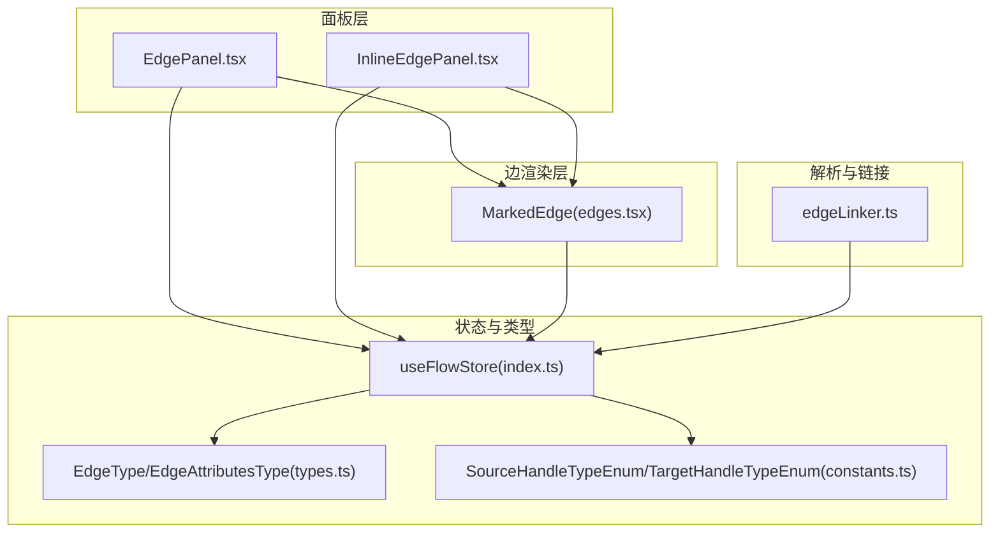
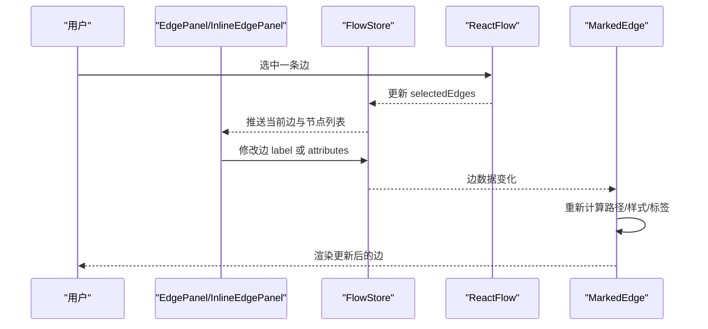
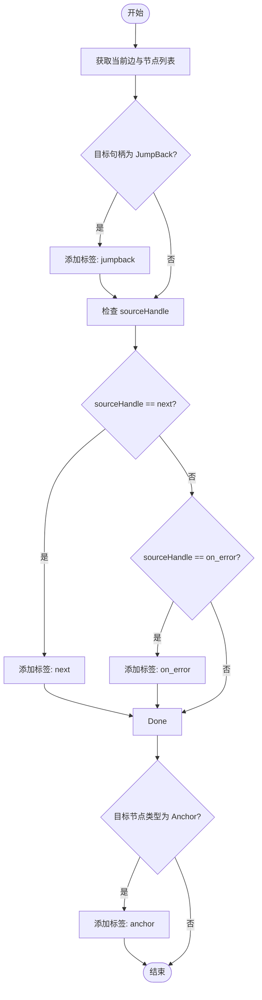
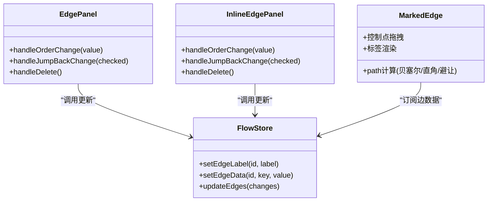
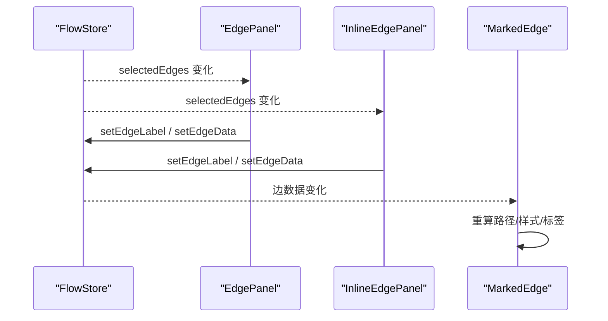
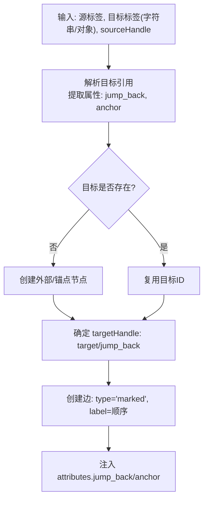
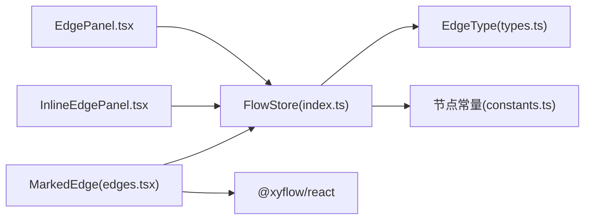

# 边面板

<cite>
**本文档引用的文件**
- [EdgePanel.tsx](file://src/components/panels/main/EdgePanel.tsx)
- [InlineEdgePanel.tsx](file://src/components/panels/main/InlineEdgePanel.tsx)
- [edges.tsx](file://src/components/flow/edges.tsx)
- [edgeLinker.ts](file://src/core/parser/edgeLinker.ts)
- [constants.ts](file://src/components/flow/nodes/constants.ts)
- [index.ts](file://src/stores/flow/index.ts)
- [types.ts](file://src/stores/flow/types.ts)
</cite>

## 目录
1. [简介](#简介)
2. [项目结构](#项目结构)
3. [核心组件](#核心组件)
4. [架构总览](#架构总览)
5. [详细组件分析](#详细组件分析)
6. [依赖分析](#依赖分析)
7. [性能考虑](#性能考虑)
8. [故障排查指南](#故障排查指南)
9. [结论](#结论)
10. [附录](#附录)

## 简介
本文件面向“边面板”的技术实现与交互设计，围绕连线属性编辑器展开，系统性说明以下内容：
- 边的类型识别与标签呈现（如 next/on_error、jump_back、anchor 等）
- 属性配置与样式设置（顺序、JumpBack、标签颜色等）
- 边面板与可视化编辑器的实时同步机制
- 边的验证规则与约束检查逻辑
- 扩展开发与自定义边类型的实现指导
- 性能优化与用户体验设计最佳实践

## 项目结构
边面板由两个主要组件构成：
- 固定侧边栏式边面板：EdgePanel.tsx
- 视口内嵌式边面板：InlineEdgePanel.tsx
两者均依赖统一的边类型与节点常量、Flow Store 状态管理，并通过 React Flow 的边组件进行渲染。

图表来源
- [EdgePanel.tsx:130-299](file://src/components/panels/main/EdgePanel.tsx#L130-L299)
- [InlineEdgePanel.tsx:55-290](file://src/components/panels/main/InlineEdgePanel.tsx#L55-L290)
- [edges.tsx:311-676](file://src/components/flow/edges.tsx#L311-L676)
- [index.ts:18-28](file://src/stores/flow/index.ts#L18-L28)
- [types.ts:29-40](file://src/stores/flow/types.ts#L29-L40)
- [constants.ts:2-11](file://src/components/flow/nodes/constants.ts#L2-L11)
- [edgeLinker.ts:91-162](file://src/core/parser/edgeLinker.ts#L91-L162)

章节来源
- [EdgePanel.tsx:130-299](file://src/components/panels/main/EdgePanel.tsx#L130-L299)
- [InlineEdgePanel.tsx:55-290](file://src/components/panels/main/InlineEdgePanel.tsx#L55-L290)
- [edges.tsx:311-676](file://src/components/flow/edges.tsx#L311-L676)
- [index.ts:18-28](file://src/stores/flow/index.ts#L18-L28)
- [types.ts:29-40](file://src/stores/flow/types.ts#L29-L40)
- [constants.ts:2-11](file://src/components/flow/nodes/constants.ts#L2-L11)
- [edgeLinker.ts:91-162](file://src/core/parser/edgeLinker.ts#L91-L162)

## 核心组件
- 边面板（固定侧边栏）：负责在选中单条边时展示边信息、顺序与 JumpBack 开关，并支持删除连接；根据面板模式切换为可拖拽或固定布局。
- 内嵌边面板（视口内）：在边中点附近渲染，随边拖动自动隐藏，支持相同属性编辑能力。
- 自定义边组件（MarkedEdge）：根据边类型与节点方向绘制路径（贝塞尔/直角/避让），支持控制点拖拽与标签渲染，同时按类型应用样式类。

章节来源
- [EdgePanel.tsx:130-299](file://src/components/panels/main/EdgePanel.tsx#L130-L299)
- [InlineEdgePanel.tsx:55-290](file://src/components/panels/main/InlineEdgePanel.tsx#L55-L290)
- [edges.tsx:311-676](file://src/components/flow/edges.tsx#L311-L676)

## 架构总览
边面板与可视化编辑器的交互链路如下：
- 选中边事件来自 Flow Store 的 selection slice，面板据此决定是否渲染与如何渲染。
- 边面板通过 Flow Store 的更新接口修改边的 label（顺序）与 attributes（如 jump_back）。
- 自定义边组件订阅边数据与节点方向，动态计算路径与样式，实现与面板的双向一致。

图表来源
- [EdgePanel.tsx:130-299](file://src/components/panels/main/EdgePanel.tsx#L130-L299)
- [InlineEdgePanel.tsx:55-290](file://src/components/panels/main/InlineEdgePanel.tsx#L55-L290)
- [edges.tsx:311-676](file://src/components/flow/edges.tsx#L311-L676)
- [index.ts:18-28](file://src/stores/flow/index.ts#L18-L28)

## 详细组件分析

### 边类型识别与标签呈现
- 类型识别逻辑：
  - 基于 sourceHandle 识别 next/on_error
  - 基于 targetHandle 识别 jump_back
  - 基于目标节点类型识别 anchor
- 标签颜色与文案：
  - next/green、on_error/magenta、jump_back/orange、anchor/blue
- 顺序计算：
  - 同一源节点与同一 sourceHandle 的边数量即为最大顺序上限，当前边 label 即为当前序号

图表来源
- [EdgePanel.tsx:24-50](file://src/components/panels/main/EdgePanel.tsx#L24-L50)
- [InlineEdgePanel.tsx:27-53](file://src/components/panels/main/InlineEdgePanel.tsx#L27-L53)
- [constants.ts:2-11](file://src/components/flow/nodes/constants.ts#L2-L11)

章节来源
- [EdgePanel.tsx:24-50](file://src/components/panels/main/EdgePanel.tsx#L24-L50)
- [InlineEdgePanel.tsx:27-53](file://src/components/panels/main/InlineEdgePanel.tsx#L27-L53)
- [constants.ts:2-11](file://src/components/flow/nodes/constants.ts#L2-L11)

### 属性配置与样式设置
- 顺序（label）：
  - 输入范围为 [1, maxOrder]，通过 setEdgeLabel 更新
- JumpBack：
  - 仅在 sourceHandle 为 on_error 时显示开关；通过 setEdgeData 更新 attributes.jump_back
- 样式：
  - 依据 selected/sourceHandle/targetHandle 应用不同 CSS 类，区分 next/error/jumpback/error+jumpback
  - 控制点拖拽与标签渲染受配置项控制（如显示标签、显示控制点）

图表来源
- [EdgePanel.tsx:199-224](file://src/components/panels/main/EdgePanel.tsx#L199-L224)
- [InlineEdgePanel.tsx:146-171](file://src/components/panels/main/InlineEdgePanel.tsx#L146-L171)
- [edges.tsx:311-676](file://src/components/flow/edges.tsx#L311-L676)
- [index.ts:18-28](file://src/stores/flow/index.ts#L18-L28)

章节来源
- [EdgePanel.tsx:199-224](file://src/components/panels/main/EdgePanel.tsx#L199-L224)
- [InlineEdgePanel.tsx:146-171](file://src/components/panels/main/InlineEdgePanel.tsx#L146-L171)
- [edges.tsx:311-676](file://src/components/flow/edges.tsx#L311-L676)

### 边面板与可视化编辑器的实时同步机制
- 选中态同步：
  - 面板监听 selectedEdges 与 targetNode，仅当仅选中一条边且未选中节点时显示
  - 面板模式（inline/draggable）影响渲染位置与行为
- 数据同步：
  - 面板通过 FlowStore 的 setEdgeLabel/setEdgeData/updateEdges 实时写回
  - 自定义边组件订阅边数据变化，重新计算路径与样式
- 内嵌面板定位：
  - 基于源/目标节点中心点计算中点，结合缩放与偏移定位，拖动节点时自动隐藏

图表来源
- [EdgePanel.tsx:130-156](file://src/components/panels/main/EdgePanel.tsx#L130-L156)
- [InlineEdgePanel.tsx:55-92](file://src/components/panels/main/InlineEdgePanel.tsx#L55-L92)
- [edges.tsx:311-676](file://src/components/flow/edges.tsx#L311-L676)

章节来源
- [EdgePanel.tsx:130-156](file://src/components/panels/main/EdgePanel.tsx#L130-L156)
- [InlineEdgePanel.tsx:55-92](file://src/components/panels/main/InlineEdgePanel.tsx#L55-L92)
- [edges.tsx:311-676](file://src/components/flow/edges.tsx#L311-L676)

### 边的验证规则与约束检查逻辑
- 边类型与句柄约束：
  - sourceHandle 限定为 next/on_error
  - targetHandle 限定为 target/jump_back
- 顺序唯一性：
  - 同一源节点与同一 sourceHandle 的多条边，其 label 必须为 1..N 且互不重复
- JumpBack 条件：
  - 仅在 sourceHandle 为 on_error 时允许启用 jump_back
- 导入/链接解析：
  - 支持字符串/对象两种目标引用格式，自动解析 [Anchor]/[JumpBack] 前缀并创建外部/锚点节点
  - 未找到目标时自动创建外部节点或锚点节点，并将 attributes 注入边

图表来源
- [edgeLinker.ts:91-162](file://src/core/parser/edgeLinker.ts#L91-L162)
- [constants.ts:2-11](file://src/components/flow/nodes/constants.ts#L2-L11)
- [types.ts:29-40](file://src/stores/flow/types.ts#L29-L40)

章节来源
- [edgeLinker.ts:91-162](file://src/core/parser/edgeLinker.ts#L91-L162)
- [constants.ts:2-11](file://src/components/flow/nodes/constants.ts#L2-L11)
- [types.ts:29-40](file://src/stores/flow/types.ts#L29-L40)

### 扩展开发与自定义边类型实现指导
- 自定义边组件
  - 使用 BaseEdge 渲染路径，支持 getBezierPath/getStraightPath/getSmoothStepPath 等函数
  - 通过 edgeTypes 注册新类型并在 ReactFlow 中使用
- 控制点与标签
  - 可实现控制点拖拽与双击重置，以及边标签渲染
- 与面板联动
  - 自定义边的数据结构需兼容 FlowStore 的 EdgeType；面板通过 setEdgeLabel/setEdgeData 更新
- 样式与交互
  - 通过 CSS 类区分不同边类型；结合配置项控制标签与控制点显示

章节来源
- [edges.tsx:311-676](file://src/components/flow/edges.tsx#L311-L676)
- [types.ts:29-40](file://src/stores/flow/types.ts#L29-L40)

## 依赖分析
- 组件耦合
  - EdgePanel/InlineEdgePanel 依赖 Flow Store 的 selection 与更新接口
  - MarkedEdge 依赖 Flow Store 的节点/边数据与配置项
- 外部依赖
  - React Flow 提供 EdgeProps、BaseEdge、路径计算工具与 useStore 订阅
- 类型契约
  - EdgeType 明确 id/source/target/sourceHandle/targetHandle/label/type/attributes
  - SourceHandleTypeEnum/TargetHandleTypeEnum 限定句柄类型

图表来源
- [EdgePanel.tsx:130-299](file://src/components/panels/main/EdgePanel.tsx#L130-L299)
- [InlineEdgePanel.tsx:55-290](file://src/components/panels/main/InlineEdgePanel.tsx#L55-L290)
- [edges.tsx:311-676](file://src/components/flow/edges.tsx#L311-L676)
- [index.ts:18-28](file://src/stores/flow/index.ts#L18-L28)
- [types.ts:29-40](file://src/stores/flow/types.ts#L29-L40)
- [constants.ts:2-11](file://src/components/flow/nodes/constants.ts#L2-L11)

章节来源
- [EdgePanel.tsx:130-299](file://src/components/panels/main/EdgePanel.tsx#L130-L299)
- [InlineEdgePanel.tsx:55-290](file://src/components/panels/main/InlineEdgePanel.tsx#L55-L290)
- [edges.tsx:311-676](file://src/components/flow/edges.tsx#L311-L676)
- [index.ts:18-28](file://src/stores/flow/index.ts#L18-L28)
- [types.ts:29-40](file://src/stores/flow/types.ts#L29-L40)
- [constants.ts:2-11](file://src/components/flow/nodes/constants.ts#L2-L11)

## 性能考虑
- 渲染优化
  - 面板采用 memo 包装与 useMemo 缓存计算结果，减少无效重渲染
  - 内嵌面板在节点拖动时隐藏，避免不必要的 DOM 更新
- 计算优化
  - 路径计算按模式分支（贝塞尔/直角/避让），仅在必要时重新计算
  - 控制点拖拽使用 useRef 缓存初始偏移，mousemove 事件解绑避免泄漏
- 存储与订阅
  - 使用 shallow selector 仅订阅所需字段，降低订阅开销
  - 顺序上限与标签计算基于过滤聚合，避免全量遍历

章节来源
- [EdgePanel.tsx:130-299](file://src/components/panels/main/EdgePanel.tsx#L130-L299)
- [InlineEdgePanel.tsx:55-290](file://src/components/panels/main/InlineEdgePanel.tsx#L55-L290)
- [edges.tsx:311-676](file://src/components/flow/edges.tsx#L311-L676)

## 故障排查指南
- 无法看到边面板
  - 确认仅选中一条边且未同时选中节点
  - 检查面板模式（inline/draggable）与占位系统状态
- JumpBack 不显示
  - 仅在 sourceHandle 为 on_error 时显示开关
- 顺序输入异常
  - 确认输入值在 [1, maxOrder] 范围内；maxOrder 由同源同句柄边数决定
- 控制点不可拖拽
  - 确认 edgePathMode 为 bezier 且启用了控制点显示
- 导入边未创建目标节点
  - 检查目标引用格式与前缀 [Anchor]/[JumpBack] 是否正确

章节来源
- [EdgePanel.tsx:130-299](file://src/components/panels/main/EdgePanel.tsx#L130-L299)
- [InlineEdgePanel.tsx:55-290](file://src/components/panels/main/InlineEdgePanel.tsx#L55-L290)
- [edgeLinker.ts:91-162](file://src/core/parser/edgeLinker.ts#L91-L162)

## 结论
边面板通过简洁的类型识别与直观的属性编辑，实现了对边的高效配置；配合自定义边组件的路径与样式能力，形成完整的可视化编辑闭环。通过合理的状态订阅与计算缓存，保证了在复杂图场景下的流畅体验。建议在扩展新边类型时遵循现有类型契约与样式约定，确保与面板与渲染层的一致性。

## 附录
- 关键类型与常量
  - EdgeType：边的核心数据结构
  - EdgeAttributesType：边属性（jump_back/anchor）
  - SourceHandleTypeEnum/TargetHandleTypeEnum：句柄类型枚举
- 常用操作
  - setEdgeLabel：设置边顺序
  - setEdgeData：设置边属性
  - updateEdges：批量更新边（含删除）

章节来源
- [types.ts:29-40](file://src/stores/flow/types.ts#L29-L40)
- [constants.ts:2-11](file://src/components/flow/nodes/constants.ts#L2-L11)
- [index.ts:18-28](file://src/stores/flow/index.ts#L18-L28)