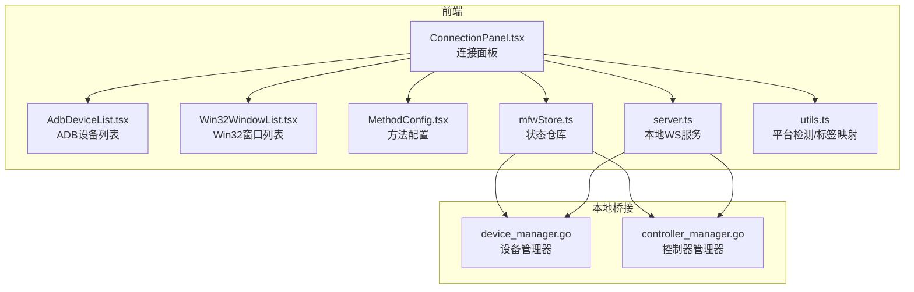
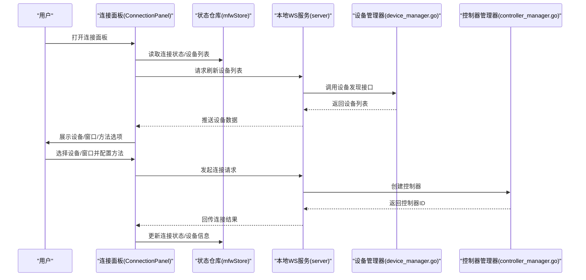
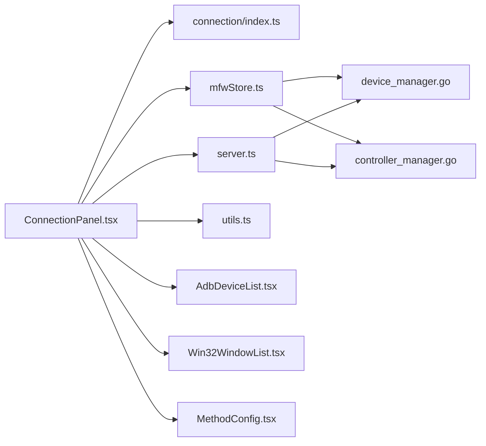
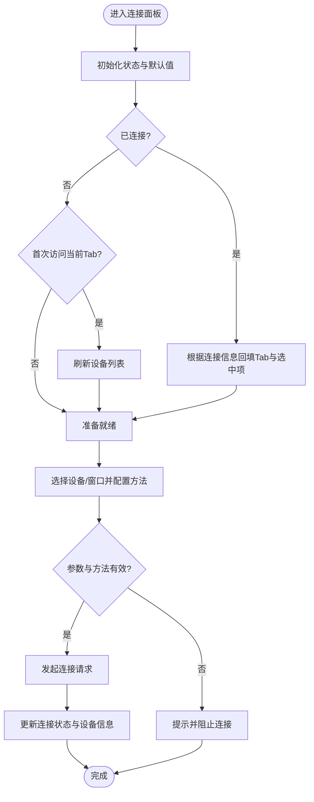

# 连接面板

<cite>
**本文引用的文件**
- [ConnectionPanel.tsx](file://src/components/panels/main/ConnectionPanel.tsx)
- [mfwStore.ts](file://src/stores/mfwStore.ts)
- [index.ts](file://src/components/panels/main/connection/index.ts)
- [utils.ts](file://src/components/panels/main/connection/utils.ts)
- [AdbDeviceList.tsx](file://src/components/panels/main/connection/AdbDeviceList.tsx)
- [Win32WindowList.tsx](file://src/components/panels/main/connection/Win32WindowList.tsx)
- [MethodConfig.tsx](file://src/components/panels/main/connection/MethodConfig.tsx)
- [server.ts](file://src/services/server.ts)
- [device_manager.go](file://LocalBridge/internal/mfw/device_manager.go)
- [controller_manager.go](file://LocalBridge/internal/mfw/controller_manager.go)
- [Header.tsx](file://src/components/Header.tsx)
</cite>

## 目录
1. [简介](#简介)
2. [项目结构](#项目结构)
3. [核心组件](#核心组件)
4. [架构总览](#架构总览)
5. [详细组件分析](#详细组件分析)
6. [依赖关系分析](#依赖关系分析)
7. [性能考量](#性能考量)
8. [故障排查指南](#故障排查指南)
9. [结论](#结论)
10. [附录](#附录)

## 简介
本文件面向“连接面板”的技术实现，系统性阐述设备连接管理的关键能力：ADB 设备列表、Win32 窗口选择、手柄连接、WlRoots 与 macOS 原生连接等多通道接入；覆盖设备发现、连接建立、状态监控的完整流程；说明连接配置参数的校验与持久化策略；给出跨平台适配与差异化的实现要点；并提供故障排查与性能优化建议及 UI 交互体验优化思路。

## 项目结构
连接面板位于主界面的右侧抽屉式面板，通过统一的状态仓库与本地桥接服务进行设备发现与连接控制，支持多平台差异化入口与方法配置。

图表来源
- [ConnectionPanel.tsx:1-954](file://src/components/panels/main/ConnectionPanel.tsx#L1-L954)
- [mfwStore.ts:1-195](file://src/stores/mfwStore.ts#L1-L195)
- [utils.ts:1-26](file://src/components/panels/main/connection/utils.ts#L1-L26)
- [AdbDeviceList.tsx:1-180](file://src/components/panels/main/connection/AdbDeviceList.tsx#L1-L180)
- [Win32WindowList.tsx:1-85](file://src/components/panels/main/connection/Win32WindowList.tsx#L1-L85)
- [MethodConfig.tsx:1-189](file://src/components/panels/main/connection/MethodConfig.tsx#L1-L189)
- [server.ts:1-388](file://src/services/server.ts#L1-L388)
- [device_manager.go:1-136](file://LocalBridge/internal/mfw/device_manager.go#L1-L136)
- [controller_manager.go:1-200](file://LocalBridge/internal/mfw/controller_manager.go#L1-L200)

章节来源
- [ConnectionPanel.tsx:1-954](file://src/components/panels/main/ConnectionPanel.tsx#L1-L954)
- [mfwStore.ts:1-195](file://src/stores/mfwStore.ts#L1-L195)
- [utils.ts:1-26](file://src/components/panels/main/connection/utils.ts#L1-L26)

## 核心组件
- 连接面板容器：负责多连接方式的切换、设备选择、方法配置、连接/断开控制、状态展示与错误提示。
- 设备列表组件：分别渲染 ADB 设备与 Win32 窗口列表，并支持手动输入 ADB 参数。
- 方法配置组件：根据所选设备动态聚合可用截图/输入方法，支持多选（ADB）与单选（Win32）。
- 状态仓库：集中维护连接状态、控制器类型与ID、设备信息、设备列表与错误消息。
- 平台工具：检测当前运行平台，映射可用连接标签与默认方法集合。
- 本地桥接：封装设备发现与控制器创建，承载跨平台差异与底层调用。

章节来源
- [ConnectionPanel.tsx:1-954](file://src/components/panels/main/ConnectionPanel.tsx#L1-L954)
- [mfwStore.ts:1-195](file://src/stores/mfwStore.ts#L1-L195)
- [AdbDeviceList.tsx:1-180](file://src/components/panels/main/connection/AdbDeviceList.tsx#L1-L180)
- [Win32WindowList.tsx:1-85](file://src/components/panels/main/connection/Win32WindowList.tsx#L1-L85)
- [MethodConfig.tsx:1-189](file://src/components/panels/main/connection/MethodConfig.tsx#L1-L189)
- [utils.ts:1-26](file://src/components/panels/main/connection/utils.ts#L1-L26)
- [device_manager.go:1-136](file://LocalBridge/internal/mfw/device_manager.go#L1-L136)
- [controller_manager.go:1-200](file://LocalBridge/internal/mfw/controller_manager.go#L1-L200)

## 架构总览
连接面板采用“前端状态驱动 + 本地桥接服务”的分层架构：
- 前端通过状态仓库与本地 WS 服务交互，下发设备发现与连接指令。
- 本地桥接在 Go 侧执行系统 API 调用，返回设备列表与控制器实例。
- 前端根据返回结果更新 UI 状态与设备选择项，形成“发现—选择—配置—连接”的闭环。

图表来源
- [ConnectionPanel.tsx:344-511](file://src/components/panels/main/ConnectionPanel.tsx#L344-L511)
- [mfwStore.ts:143-194](file://src/stores/mfwStore.ts#L143-L194)
- [server.ts:1-388](file://src/services/server.ts#L1-L388)
- [device_manager.go:27-121](file://LocalBridge/internal/mfw/device_manager.go#L27-L121)
- [controller_manager.go:33-192](file://LocalBridge/internal/mfw/controller_manager.go#L33-L192)

## 详细组件分析

### 连接面板（ConnectionPanel）
- 功能职责
  - 多连接方式切换：ADB、Win32、PlayCover、Gamepad、WlRoots、macOS。
  - 设备选择与状态展示：根据当前连接状态预选对应设备，避免重复连接。
  - 方法配置：动态聚合设备可用方法，支持多选（ADB）与单选（Win32）。
  - 连接/断开控制：发起连接、断开当前连接、连接新设备。
  - 错误提示与刷新：展示错误信息，支持刷新设备列表。
- 关键流程
  - 初始化：根据连接状态与设备信息回填当前 Tab 与选中项。
  - 首次打开：若未连接且未访问过当前 Tab，则自动刷新设备列表。
  - 连接前校验：确保已选择设备且方法有效，避免无效连接。
  - 连接新设备：先断开当前连接再发起新连接，保证状态一致性。
- 状态与持久化
  - 使用状态仓库维护连接状态、控制器类型与ID、设备信息、设备列表与错误消息。
  - 使用持久化状态保存各连接方式的参数（如 ADB 路径、地址、方法等），提升用户体验。

章节来源
- [ConnectionPanel.tsx:51-954](file://src/components/panels/main/ConnectionPanel.tsx#L51-L954)
- [mfwStore.ts:143-194](file://src/stores/mfwStore.ts#L143-L194)

### 设备列表组件

#### ADB 设备列表（AdbDeviceList）
- 特点
  - 支持“列表选择”与“手动输入”两种模式，互斥生效。
  - 当存在手动输入时，禁用列表项的高亮与交互，避免冲突。
  - 提供手动表单，支持 ADB 路径、设备地址、配置与名称的输入。
- 交互
  - 点击列表项清空手动输入并选中该设备。
  - 手动输入任一字段时，自动取消列表选择，确保单一来源。

章节来源
- [AdbDeviceList.tsx:1-180](file://src/components/panels/main/connection/AdbDeviceList.tsx#L1-L180)

#### Win32 窗口列表（Win32WindowList）
- 特点
  - 展示系统桌面窗口，强调“管理员权限”提示，降低连接失败概率。
  - 支持窗口句柄选择，提供窗口名与类名信息。
- 交互
  - 点击窗口项选中目标窗口，高亮显示当前选择。

章节来源
- [Win32WindowList.tsx:1-85](file://src/components/panels/main/connection/Win32WindowList.tsx#L1-L85)

### 方法配置（MethodConfig）
- 功能
  - 聚合所有设备的可用截图与输入方法，生成可选项。
  - 根据当前设备与模式（ADB 手动/列表）动态回退默认方法集合。
  - ADB 支持多选，Win32 强制单选，PlayCover/Gamepad/WlRoots/macOS 不显示方法配置。
- 设计
  - 使用受控 Select 组件，支持清空与自动选择。
  - 对于 ADB 手动模式，若全局方法为空则回退内置默认集合。

章节来源
- [MethodConfig.tsx:1-189](file://src/components/panels/main/connection/MethodConfig.tsx#L1-L189)

### 平台适配与默认方法（utils）
- 平台检测：基于浏览器平台字符串识别 Windows、macOS、Linux。
- 可用标签映射：不同平台启用不同的连接标签（ADB、Win32、Gamepad、PlayCover、WlRoots、macOS）。
- macOS 默认方法：提供截图与输入方法的默认集合，便于首次连接。

章节来源
- [utils.ts:1-26](file://src/components/panels/main/connection/utils.ts#L1-L26)

### 状态仓库（mfwStore）
- 数据模型
  - 连接状态：未连接、连接中、已连接、失败。
  - 控制器类型与ID：区分 ADB、Win32、PlayCover、Gamepad、WlRoots、macOS。
  - 设备信息：按类型聚合字段，支持部分字段缺失。
  - 设备列表：ADB 设备、Win32 窗口、WlRoots 合成器。
- 操作接口
  - 更新连接状态、控制器信息、设备列表、错误消息与清除连接。
- 作用
  - 作为连接面板与本地桥接之间的数据枢纽，统一状态变更入口。

章节来源
- [mfwStore.ts:1-195](file://src/stores/mfwStore.ts#L1-L195)

### 本地桥接（Go 侧）
- 设备管理器
  - ADB 设备：调用系统 API 获取设备列表，附带截图与输入方法集合。
  - Win32 窗口：枚举桌面窗口，附带截图与输入方法集合。
  - WlRoots 合成器：枚举窗口并提取 socket 路径。
- 控制器管理器
  - ADB 控制器：解析截图与输入方法位掩码，创建控制器并登记。
  - Win32 控制器：解析窗口句柄与方法，创建控制器并登记。
  - PlayCover/macOS/Gamepad/WlRoots 控制器：按平台特性创建并登记。

章节来源
- [device_manager.go:27-121](file://LocalBridge/internal/mfw/device_manager.go#L27-L121)
- [controller_manager.go:33-192](file://LocalBridge/internal/mfw/controller_manager.go#L33-L192)

## 依赖关系分析

图表来源
- [ConnectionPanel.tsx:1-954](file://src/components/panels/main/ConnectionPanel.tsx#L1-L954)
- [index.ts:1-10](file://src/components/panels/main/connection/index.ts#L1-L10)
- [mfwStore.ts:1-195](file://src/stores/mfwStore.ts#L1-L195)
- [server.ts:1-388](file://src/services/server.ts#L1-L388)
- [utils.ts:1-26](file://src/components/panels/main/connection/utils.ts#L1-L26)
- [AdbDeviceList.tsx:1-180](file://src/components/panels/main/connection/AdbDeviceList.tsx#L1-L180)
- [Win32WindowList.tsx:1-85](file://src/components/panels/main/connection/Win32WindowList.tsx#L1-L85)
- [MethodConfig.tsx:1-189](file://src/components/panels/main/connection/MethodConfig.tsx#L1-L189)
- [device_manager.go:1-136](file://LocalBridge/internal/mfw/device_manager.go#L1-L136)
- [controller_manager.go:1-200](file://LocalBridge/internal/mfw/controller_manager.go#L1-L200)

章节来源
- [ConnectionPanel.tsx:1-954](file://src/components/panels/main/ConnectionPanel.tsx#L1-L954)
- [index.ts:1-10](file://src/components/panels/main/connection/index.ts#L1-L10)
- [mfwStore.ts:1-195](file://src/stores/mfwStore.ts#L1-L195)
- [server.ts:1-388](file://src/services/server.ts#L1-L388)
- [utils.ts:1-26](file://src/components/panels/main/connection/utils.ts#L1-L26)
- [device_manager.go:1-136](file://LocalBridge/internal/mfw/device_manager.go#L1-L136)
- [controller_manager.go:1-200](file://LocalBridge/internal/mfw/controller_manager.go#L1-L200)

## 性能考量
- 设备列表刷新
  - 首次打开且未连接时自动刷新，避免不必要的频繁刷新。
  - 刷新过程设置加载态，防止重复触发。
- 方法配置
  - 使用受控 Select，减少不必要的重渲染。
  - ADB 手动模式下回退默认方法集合，避免空集导致的无效选择。
- 连接流程
  - 连接新设备前先断开当前连接，等待短暂间隔后发起新连接，避免并发冲突。
- 跨平台差异
  - Win32 需要管理员权限，失败概率较高，应优先提示并引导以管理员身份重启。
  - ADB 与 WlRoots 的方法集合较大，建议默认选择通用方法，逐步优化。

[本节为通用性能建议，无需特定文件引用]

## 故障排查指南
- 连接超时
  - 现象：连接本地服务超时，提示检查本地服务是否启动或端口是否可用。
  - 处理：确认本地服务已启动且端口正确；必要时查看文档指引。
- 协议版本不匹配
  - 现象：握手失败，提示前端与本地服务协议版本不一致。
  - 处理：按提示升级本地服务至兼容版本。
- Win32 连接失败
  - 现象：连接无响应或控制无效。
  - 处理：以管理员身份重启前后端；确认窗口句柄格式正确；检查截图/输入方法是否匹配。
- ADB 连接异常
  - 现象：设备列表为空或连接失败。
  - 处理：确认 ADB 路径与设备地址正确；尝试更换截图/输入方法；检查防火墙与 USB/无线调试设置。
- PlayCover/macOS/WlRoots/Gamepad
  - 现象：参数缺失或方法不可用。
  - 处理：完善地址/UUID/PID/方法选择；参考默认方法集合进行回退。

章节来源
- [server.ts:108-200](file://src/services/server.ts#L108-L200)
- [ConnectionPanel.tsx:357-511](file://src/components/panels/main/ConnectionPanel.tsx#L357-L511)
- [Win32WindowList.tsx:18-24](file://src/components/panels/main/connection/Win32WindowList.tsx#L18-L24)

## 结论
连接面板通过清晰的组件划分与状态驱动，实现了多平台、多方式的设备连接管理。前端负责交互与配置，本地桥接负责系统级调用与控制器生命周期管理。配合完善的错误提示与平台适配策略，能够满足复杂场景下的设备接入需求。后续可在方法推荐、连接日志与可视化诊断方面进一步增强用户体验。

[本节为总结性内容，无需特定文件引用]

## 附录

### UI 交互设计与体验优化
- 状态反馈
  - 使用徽章与卡片直观展示连接状态与当前设备信息。
  - 错误信息以 Alert 形式突出显示，避免被覆盖。
- 操作引导
  - 首次打开自动刷新设备列表，减少用户操作成本。
  - Win32 提示管理员权限，降低失败率。
- 选择与配置
  - ADB 支持手动输入与列表选择互斥，避免歧义。
  - 方法配置支持多选与自动选择，兼顾灵活性与易用性。
- 交互细节
  - 列表项悬停高亮、选中态边框与图标，提升可发现性。
  - 连接/断开按钮根据状态动态布局，避免无效操作。

章节来源
- [ConnectionPanel.tsx:651-954](file://src/components/panels/main/ConnectionPanel.tsx#L651-L954)
- [Win32WindowList.tsx:18-24](file://src/components/panels/main/connection/Win32WindowList.tsx#L18-L24)
- [AdbDeviceList.tsx:63-65](file://src/components/panels/main/connection/AdbDeviceList.tsx#L63-L65)

### 设备发现与连接流程（代码级）

图表来源
- [ConnectionPanel.tsx:266-334](file://src/components/panels/main/ConnectionPanel.tsx#L266-L334)
- [ConnectionPanel.tsx:357-511](file://src/components/panels/main/ConnectionPanel.tsx#L357-L511)
- [mfwStore.ts:143-194](file://src/stores/mfwStore.ts#L143-L194)