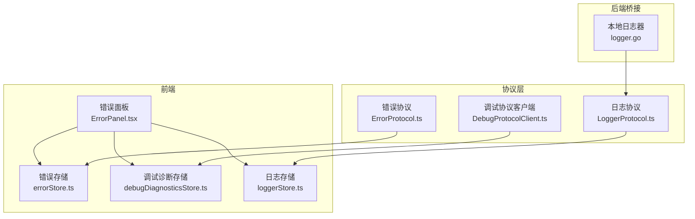
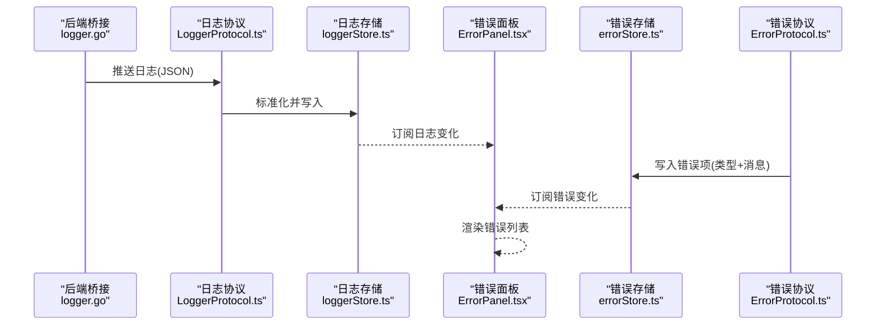
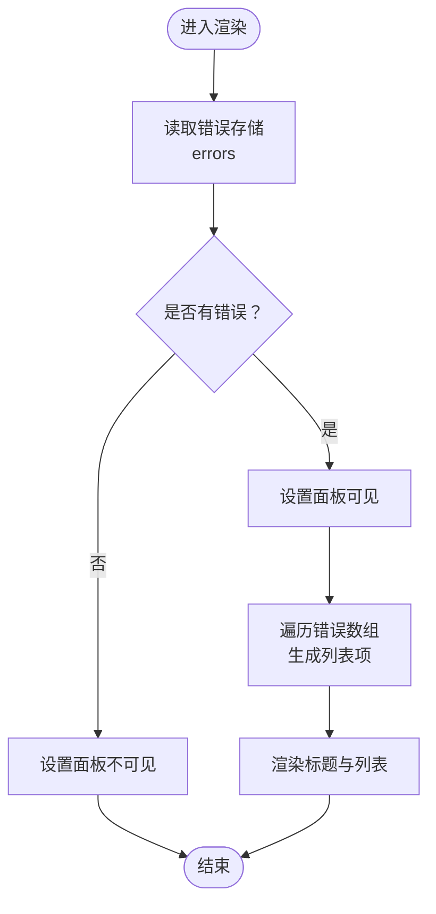
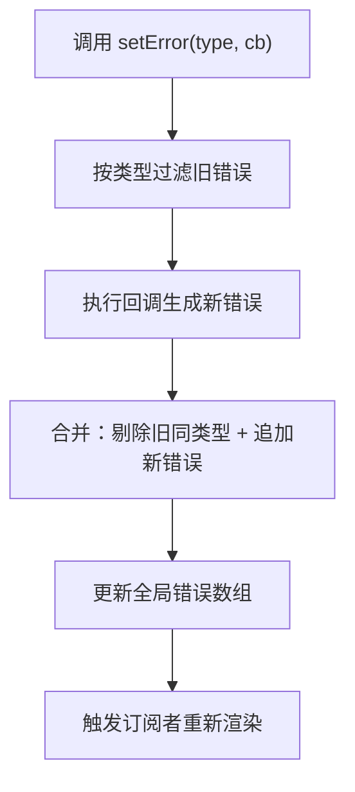
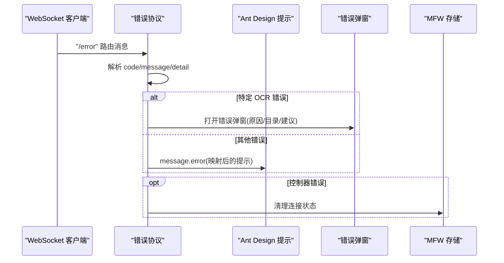
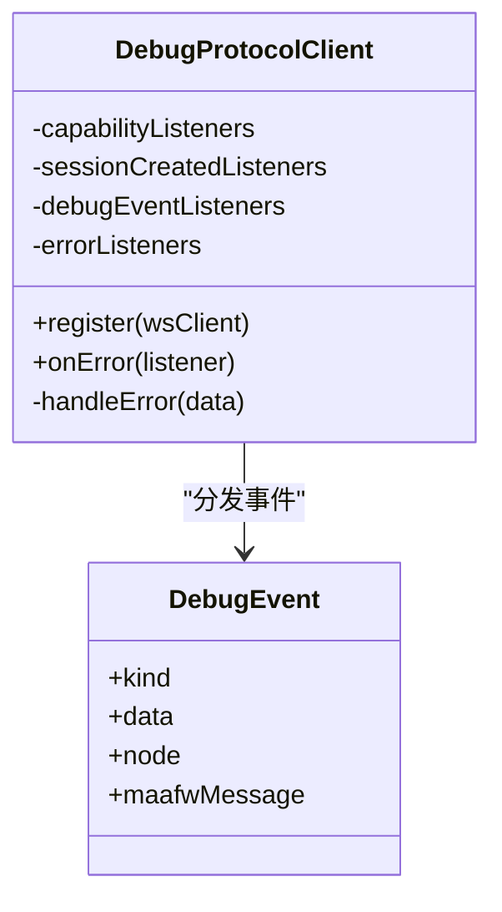
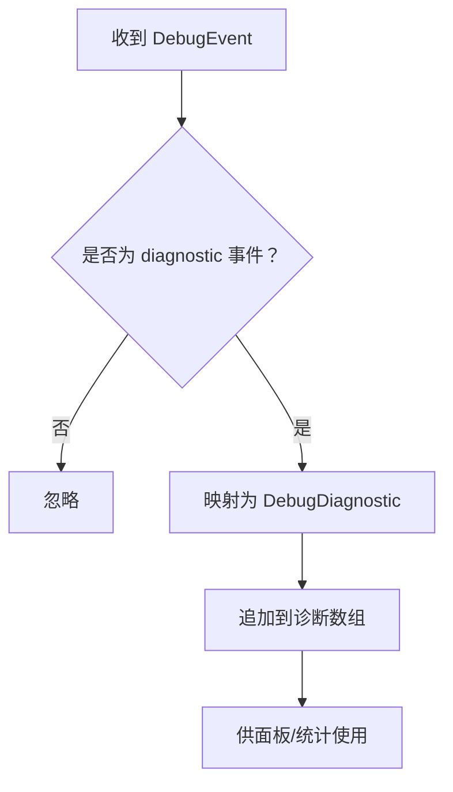
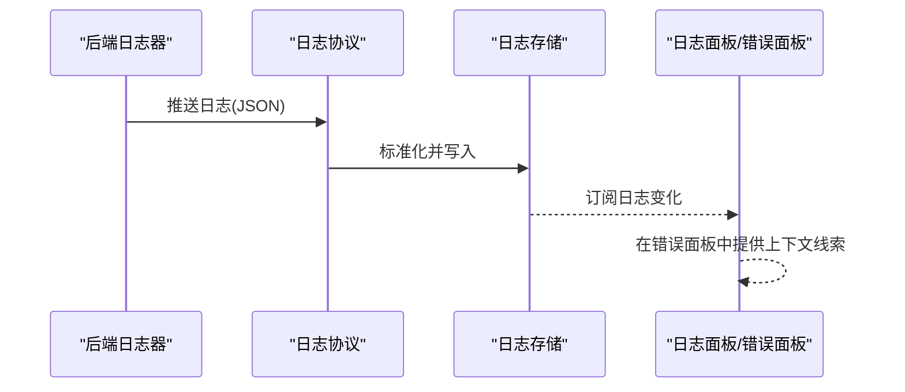
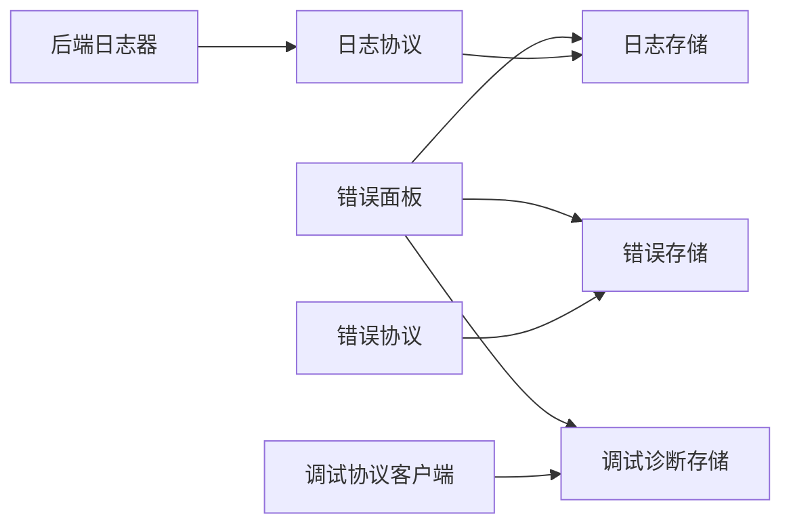

# 错误面板

<cite>
**本文引用的文件**
- [ErrorPanel.tsx](file://src/components/panels/main/ErrorPanel.tsx)
- [ErrorPanel.module.less](file://src/styles/panels/ErrorPanel.module.less)
- [errorStore.ts](file://src/stores/errorStore.ts)
- [ErrorProtocol.ts](file://src/services/protocols/ErrorProtocol.ts)
- [DebugProtocolClient.ts](file://src/services/protocols/DebugProtocolClient.ts)
- [debugDiagnosticsStore.ts](file://src/stores/debugDiagnosticsStore.ts)
- [LoggerProtocol.ts](file://src/services/protocols/LoggerProtocol.ts)
- [loggerStore.ts](file://src/stores/loggerStore.ts)
- [logger.go](file://LocalBridge/internal/logger/logger.go)
</cite>

## 目录
1. [简介](#简介)
2. [项目结构](#项目结构)
3. [核心组件](#核心组件)
4. [架构总览](#架构总览)
5. [详细组件分析](#详细组件分析)
6. [依赖分析](#依赖分析)
7. [性能考虑](#性能考虑)
8. [故障排查指南](#故障排查指南)
9. [结论](#结论)
10. [附录](#附录)

## 简介
本文件围绕“错误面板”的技术实现进行系统化说明，覆盖错误收集、分类、展示的完整链路；解释错误信息的格式化、层级化与可操作性设计；阐述错误面板与调试系统（含诊断、日志）的集成关系；介绍错误统计、趋势分析与预警机制的实现思路；并提供扩展开发与自定义错误类型的实践指导，以及用户体验优化与故障排查辅助功能的设计要点。

## 项目结构
错误面板位于主工作流面板中，采用轻量的 React 组件与 Zustand 状态管理配合样式模块化组织，同时通过协议层接收来自本地桥接与调试系统的错误/诊断/日志数据，并在前端统一呈现。

图示来源
- [ErrorPanel.tsx:1-38](file://src/components/panels/main/ErrorPanel.tsx#L1-L38)
- [errorStore.ts:1-39](file://src/stores/errorStore.ts#L1-L39)
- [debugDiagnosticsStore.ts:1-49](file://src/stores/debugDiagnosticsStore.ts#L1-L49)
- [loggerStore.ts:1-46](file://src/stores/loggerStore.ts#L1-L46)
- [ErrorProtocol.ts:1-121](file://src/services/protocols/ErrorProtocol.ts#L1-L121)
- [DebugProtocolClient.ts:1-353](file://src/services/protocols/DebugProtocolClient.ts#L1-L353)
- [LoggerProtocol.ts:1-57](file://src/services/protocols/LoggerProtocol.ts#L1-L57)
- [logger.go:71-179](file://LocalBridge/internal/logger/logger.go#L71-L179)

章节来源
- [ErrorPanel.tsx:1-38](file://src/components/panels/main/ErrorPanel.tsx#L1-L38)
- [errorStore.ts:1-39](file://src/stores/errorStore.ts#L1-L39)
- [ErrorProtocol.ts:1-121](file://src/services/protocols/ErrorProtocol.ts#L1-L121)
- [DebugProtocolClient.ts:1-353](file://src/services/protocols/DebugProtocolClient.ts#L1-L353)
- [debugDiagnosticsStore.ts:1-49](file://src/stores/debugDiagnosticsStore.ts#L1-L49)
- [LoggerProtocol.ts:1-57](file://src/services/protocols/LoggerProtocol.ts#L1-L57)
- [loggerStore.ts:1-46](file://src/stores/loggerStore.ts#L1-L46)
- [logger.go:71-179](file://LocalBridge/internal/logger/logger.go#L71-L179)

## 核心组件
- 错误面板组件：负责渲染错误列表，根据错误数量动态显示/隐藏，提供基础样式与交互。
- 错误存储：集中管理错误集合，支持按类型过滤、批量更新与去重合并。
- 错误协议：统一接收并处理来自本地桥接的错误消息，做映射、弹窗与状态清理。
- 调试协议客户端：订阅调试事件与错误，转发给诊断存储与错误监听者。
- 调试诊断存储：聚合诊断事件，形成可排序、可筛选的诊断列表。
- 日志协议与日志存储：接收后端推送的日志，标准化级别与内容，供日志面板与错误面板联动参考。
- 后端日志器：负责写入文件与推送日志，为前端提供统一的数据源。

章节来源
- [ErrorPanel.tsx:8-35](file://src/components/panels/main/ErrorPanel.tsx#L8-L35)
- [errorStore.ts:17-38](file://src/stores/errorStore.ts#L17-L38)
- [ErrorProtocol.ts:20-79](file://src/services/protocols/ErrorProtocol.ts#L20-L79)
- [DebugProtocolClient.ts:31-121](file://src/services/protocols/DebugProtocolClient.ts#L31-L121)
- [debugDiagnosticsStore.ts:4-49](file://src/stores/debugDiagnosticsStore.ts#L4-L49)
- [LoggerProtocol.ts:25-56](file://src/services/protocols/LoggerProtocol.ts#L25-L56)
- [loggerStore.ts:11-45](file://src/stores/loggerStore.ts#L11-L45)
- [logger.go:107-162](file://LocalBridge/internal/logger/logger.go#L107-L162)

## 架构总览
错误面板的实现遵循“协议-存储-组件”三层解耦设计：协议层负责接入外部数据源（本地桥接、调试系统），存储层负责数据聚合与状态管理，组件层负责 UI 呈现与用户交互。

图示来源
- [logger.go:147-162](file://LocalBridge/internal/logger/logger.go#L147-L162)
- [LoggerProtocol.ts:32-56](file://src/services/protocols/LoggerProtocol.ts#L32-L56)
- [loggerStore.ts:26-38](file://src/stores/loggerStore.ts#L26-L38)
- [ErrorPanel.tsx:21-34](file://src/components/panels/main/ErrorPanel.tsx#L21-L34)
- [errorStore.ts:24-38](file://src/stores/errorStore.ts#L24-L38)
- [ErrorProtocol.ts:27-79](file://src/services/protocols/ErrorProtocol.ts#L27-L79)

## 详细组件分析

### 错误面板组件（UI 展示）
- 职责：基于错误存储中的错误集合渲染列表，动态控制面板显隐，提供基础样式与标题。
- 关键点：使用类名组合控制面板可见性；列表项以索引+类型+消息的形式展示，便于快速定位与复制。

图示来源
- [ErrorPanel.tsx:8-35](file://src/components/panels/main/ErrorPanel.tsx#L8-L35)

章节来源
- [ErrorPanel.tsx:8-35](file://src/components/panels/main/ErrorPanel.tsx#L8-L35)
- [ErrorPanel.module.less:1-26](file://src/styles/panels/ErrorPanel.module.less#L1-L26)

### 错误存储（状态管理）
- 数据模型：错误类型枚举、错误条目结构（类型、消息、可选标记与点击回调）、查询与更新函数。
- 更新策略：按类型过滤旧错误，执行回调生成新错误，合并去重，保证同一类型错误的原子替换。
- 查询能力：提供按类型查找的辅助函数，便于业务侧精准定位与处理。

图示来源
- [errorStore.ts:17-38](file://src/stores/errorStore.ts#L17-L38)

章节来源
- [errorStore.ts:3-15](file://src/stores/errorStore.ts#L3-L15)
- [errorStore.ts:17-38](file://src/stores/errorStore.ts#L17-L38)

### 错误协议（消息分发与弹窗）
- 路由注册：统一注册错误路由，接收来自本地桥接的错误消息。
- 消息映射：根据错误码映射为用户可读提示，支持详情对象解析与多行内容拼接。
- 弹窗策略：对特定 OCR 错误使用 Modal 弹窗，展示原因、资源目录与排查建议；其他错误使用消息提示。
- 状态联动：当控制器相关错误出现时，清理连接状态，避免后续操作误导。

图示来源
- [ErrorProtocol.ts:20-79](file://src/services/protocols/ErrorProtocol.ts#L20-L79)
- [ErrorProtocol.ts:84-119](file://src/services/protocols/ErrorProtocol.ts#L84-L119)

章节来源
- [ErrorProtocol.ts:20-79](file://src/services/protocols/ErrorProtocol.ts#L20-L79)
- [ErrorProtocol.ts:84-119](file://src/services/protocols/ErrorProtocol.ts#L84-L119)

### 调试协议客户端（诊断与错误订阅）
- 路由注册：注册调试相关路由，包括 capabilities、session、event、run、resource、trace、error 等。
- 事件分发：将收到的调试事件转换为强类型事件，分发给对应的监听集合。
- 错误订阅：提供 onError 监听器注册接口，便于上层组件订阅调试错误事件。

图示来源
- [DebugProtocolClient.ts:31-121](file://src/services/protocols/DebugProtocolClient.ts#L31-L121)
- [DebugProtocolClient.ts:348-351](file://src/services/protocols/DebugProtocolClient.ts#L348-L351)

章节来源
- [DebugProtocolClient.ts:31-121](file://src/services/protocols/DebugProtocolClient.ts#L31-L121)
- [DebugProtocolClient.ts:263-266](file://src/services/protocols/DebugProtocolClient.ts#L263-L266)
- [DebugProtocolClient.ts:348-351](file://src/services/protocols/DebugProtocolClient.ts#L348-L351)

### 调试诊断存储（聚合与筛选）
- 事件到诊断的转换：从调试事件中提取严重程度、代码、消息、文件/节点/字段路径等。
- 聚合策略：追加新诊断，支持预置诊断与清空。
- 可扩展性：为后续统计与趋势分析提供统一的数据结构。

图示来源
- [debugDiagnosticsStore.ts:11-33](file://src/stores/debugDiagnosticsStore.ts#L11-L33)
- [debugDiagnosticsStore.ts:40-46](file://src/stores/debugDiagnosticsStore.ts#L40-L46)

章节来源
- [debugDiagnosticsStore.ts:4-49](file://src/stores/debugDiagnosticsStore.ts#L4-L49)

### 日志协议与日志存储（联动参考）
- 日志协议：接收后端推送的日志，标准化级别与内容，写入日志存储。
- 日志存储：维护固定长度的环形缓冲，支持展开/收起与清空。
- 与错误面板的关系：日志可用于辅助定位错误上下文，提升排障效率。

图示来源
- [LoggerProtocol.ts:25-56](file://src/services/protocols/LoggerProtocol.ts#L25-L56)
- [loggerStore.ts:26-38](file://src/stores/loggerStore.ts#L26-L38)
- [logger.go:147-162](file://LocalBridge/internal/logger/logger.go#L147-L162)

章节来源
- [LoggerProtocol.ts:25-56](file://src/services/protocols/LoggerProtocol.ts#L25-L56)
- [loggerStore.ts:11-45](file://src/stores/loggerStore.ts#L11-L45)
- [logger.go:107-162](file://LocalBridge/internal/logger/logger.go#L107-L162)

## 依赖分析
- 组件依赖：错误面板依赖错误存储；同时可与调试诊断存储、日志存储联动。
- 协议依赖：错误协议依赖本地 WebSocket 客户端与 MFW 存储；调试协议客户端依赖 WebSocket 客户端与调试事件类型。
- 存储依赖：错误存储与调试诊断存储均为独立 Zustand 模块；日志存储与后端日志器通过协议层解耦。

图示来源
- [ErrorPanel.tsx](file://src/components/panels/main/ErrorPanel.tsx#L6)
- [errorStore.ts](file://src/stores/errorStore.ts#L1)
- [debugDiagnosticsStore.ts](file://src/stores/debugDiagnosticsStore.ts#L1)
- [loggerStore.ts](file://src/stores/loggerStore.ts#L1)
- [ErrorProtocol.ts](file://src/services/protocols/ErrorProtocol.ts#L1)
- [DebugProtocolClient.ts](file://src/services/protocols/DebugProtocolClient.ts#L1)
- [LoggerProtocol.ts](file://src/services/protocols/LoggerProtocol.ts#L1)
- [logger.go:71-179](file://LocalBridge/internal/logger/logger.go#L71-L179)

章节来源
- [ErrorPanel.tsx](file://src/components/panels/main/ErrorPanel.tsx#L6)
- [errorStore.ts](file://src/stores/errorStore.ts#L1)
- [debugDiagnosticsStore.ts](file://src/stores/debugDiagnosticsStore.ts#L1)
- [loggerStore.ts](file://src/stores/loggerStore.ts#L1)
- [ErrorProtocol.ts](file://src/services/protocols/ErrorProtocol.ts#L1)
- [DebugProtocolClient.ts](file://src/services/protocols/DebugProtocolClient.ts#L1)
- [LoggerProtocol.ts](file://src/services/protocols/LoggerProtocol.ts#L1)
- [logger.go:71-179](file://LocalBridge/internal/logger/logger.go#L71-L179)

## 性能考虑
- 渲染优化：错误面板仅在错误数量变化时更新，减少不必要的重渲染。
- 存储容量：日志存储采用环形缓冲，限制最大日志数，避免内存膨胀。
- 协议处理：错误协议对特定错误使用弹窗，避免频繁消息堆积；对一般错误使用短时提示，降低 UI 抖动。
- 事件分发：调试协议客户端使用集合分发事件，避免重复序列化与多次渲染。

## 故障排查指南
- 控制器错误：当出现控制器未找到/未连接/连接失败/创建失败时，错误协议会自动清理连接状态，需先检查设备与连接配置。
- OCR 资源错误：错误协议会弹出详细弹窗，包含原因、资源目录与排查建议，优先核对资源目录与文件完整性。
- 日志辅助：通过日志存储查看前后文日志，结合错误消息定位问题根因。
- 诊断联动：调试诊断存储可提供更细粒度的诊断信息，辅助判断配置与运行时异常。

章节来源
- [ErrorProtocol.ts:69-78](file://src/services/protocols/ErrorProtocol.ts#L69-L78)
- [ErrorProtocol.ts:84-119](file://src/services/protocols/ErrorProtocol.ts#L84-L119)
- [loggerStore.ts:22-38](file://src/stores/loggerStore.ts#L22-L38)
- [debugDiagnosticsStore.ts:11-33](file://src/stores/debugDiagnosticsStore.ts#L11-L33)

## 结论
错误面板通过“协议-存储-组件”的清晰分层，实现了从后端到前端的一体化错误与诊断呈现。其设计兼顾了可读性、可操作性与可扩展性，既满足日常排障需求，也为后续统计与预警提供了数据基础。建议在实际使用中结合日志与诊断信息，形成闭环的故障排查流程。

## 附录

### 错误信息格式化与层级化设计
- 格式化：错误协议对常见错误码进行映射，必要时拼接详情对象内容，确保用户可理解。
- 层级化：错误面板以“索引-类型-消息”的形式展示，便于快速识别与复制；日志与诊断作为上下文支撑。
- 可操作性：错误存储允许为错误项绑定点击回调，便于直接跳转到相关节点或打开修复界面。

章节来源
- [ErrorProtocol.ts:31-67](file://src/services/protocols/ErrorProtocol.ts#L31-L67)
- [ErrorPanel.tsx:27-31](file://src/components/panels/main/ErrorPanel.tsx#L27-L31)
- [errorStore.ts:6-11](file://src/stores/errorStore.ts#L6-L11)

### 错误统计、趋势分析与预警机制
- 统计维度：可基于错误类型枚举与诊断严重程度进行计数与占比分析。
- 趋势分析：结合时间戳与日志上下文，追踪错误发生频率与热点节点。
- 预警机制：可在错误协议或调试协议层增加阈值检测与告警通道（如通知中心或弹窗），并在错误存储中引入“高优/紧急”标记位。

章节来源
- [errorStore.ts:3-5](file://src/stores/errorStore.ts#L3-L5)
- [debugDiagnosticsStore.ts:14-20](file://src/stores/debugDiagnosticsStore.ts#L14-L20)
- [loggerStore.ts:28-37](file://src/stores/loggerStore.ts#L28-L37)

### 扩展开发与自定义错误类型处理
- 新增错误类型：在错误类型枚举中添加新类型，并在错误存储中提供查询函数。
- 自定义处理：在错误协议中新增错误码映射与弹窗逻辑；在调试协议客户端中扩展 onError 监听器，实现跨系统联动。
- UI 扩展：在错误面板中增加按类型分组、筛选与导出功能，提升可操作性。

章节来源
- [errorStore.ts:3-15](file://src/stores/errorStore.ts#L3-L15)
- [ErrorProtocol.ts:31-67](file://src/services/protocols/ErrorProtocol.ts#L31-L67)
- [DebugProtocolClient.ts:263-266](file://src/services/protocols/DebugProtocolClient.ts#L263-L266)
- [ErrorPanel.tsx:21-34](file://src/components/panels/main/ErrorPanel.tsx#L21-L34)

### 用户体验优化与故障排查辅助
- 交互优化：错误面板默认隐藏无错误状态，有错误时自动显示；支持一键清空与复制消息。
- 辅助功能：结合日志与诊断存储，提供“查看上下文日志”“跳转到节点”等快捷入口；在弹窗中提供可复制的资源目录与建议清单。

章节来源
- [ErrorPanel.tsx:12-18](file://src/components/panels/main/ErrorPanel.tsx#L12-L18)
- [ErrorProtocol.ts:103-119](file://src/services/protocols/ErrorProtocol.ts#L103-L119)
- [LoggerProtocol.ts:32-56](file://src/services/protocols/LoggerProtocol.ts#L32-L56)
- [debugDiagnosticsStore.ts:40-46](file://src/stores/debugDiagnosticsStore.ts#L40-L46)