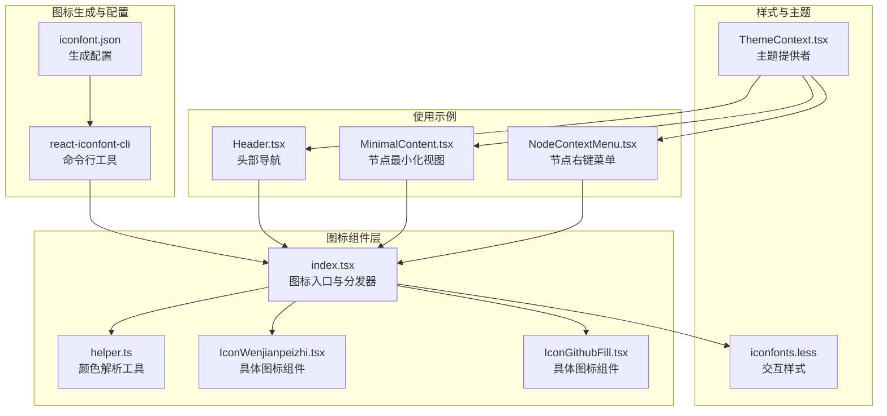
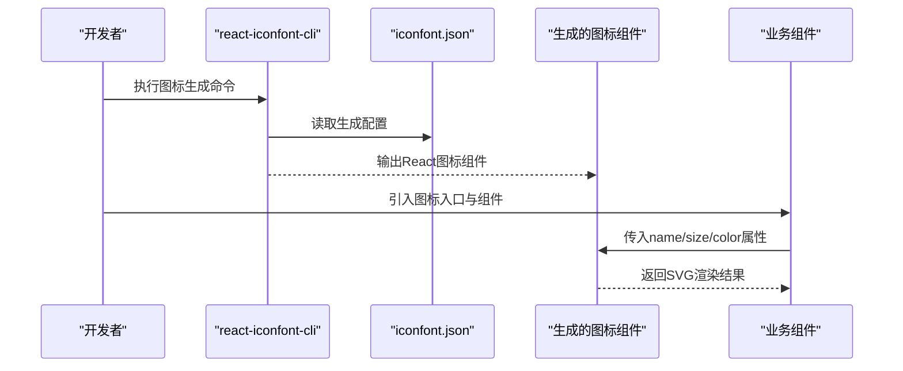
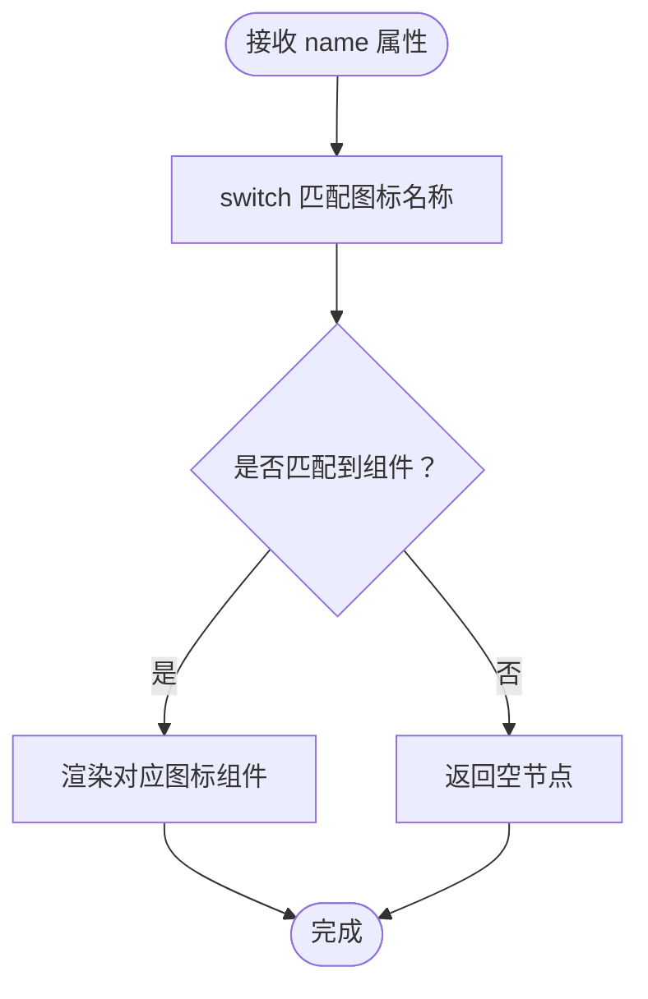
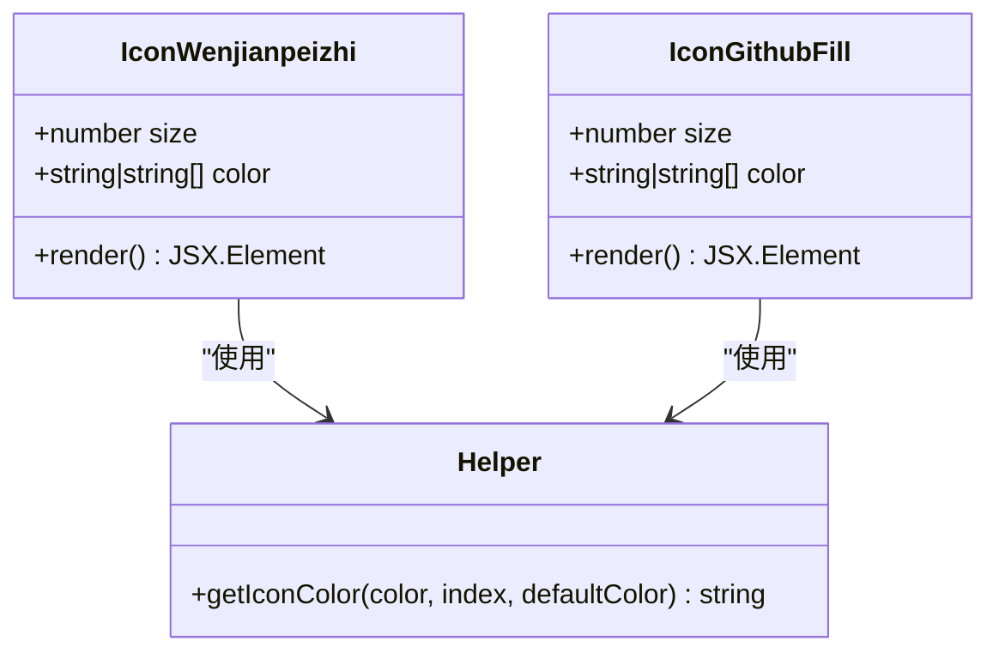
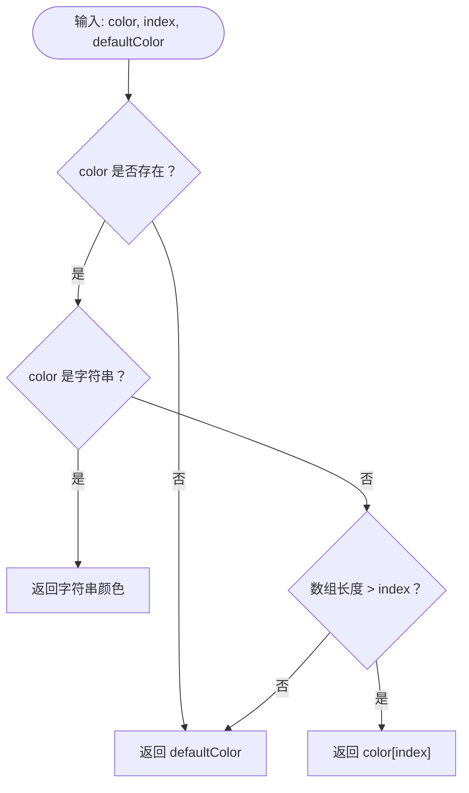
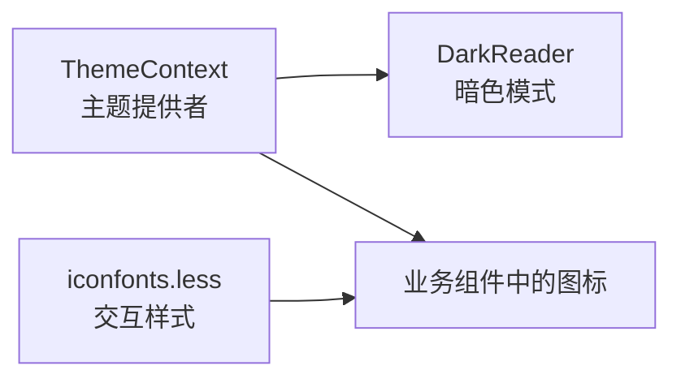
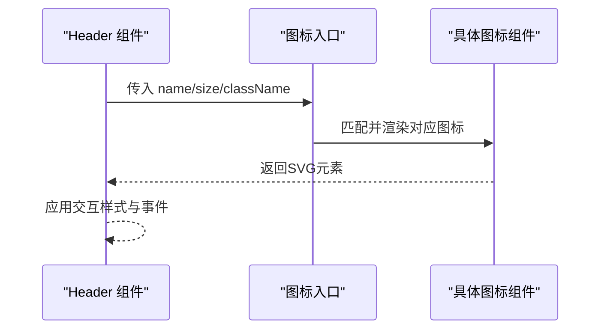
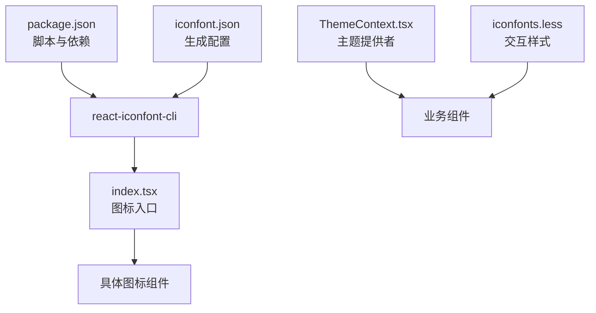

# 图标字体系统

<cite>
**本文档引用的文件**
- [src/components/iconfonts/index.tsx](file://src/components/iconfonts/index.tsx)
- [src/components/iconfonts/helper.ts](file://src/components/iconfonts/helper.ts)
- [src/components/iconfonts/IconWenjianpeizhi.tsx](file://src/components/iconfonts/IconWenjianpeizhi.tsx)
- [src/components/iconfonts/IconGithubFill.tsx](file://src/components/iconfonts/IconGithubFill.tsx)
- [src/styles/base/iconfonts.less](file://src/styles/base/iconfonts.less)
- [iconfont.json](file://iconfont.json)
- [src/contexts/ThemeContext.tsx](file://src/contexts/ThemeContext.tsx)
- [src/components/Header.tsx](file://src/components/Header.tsx)
- [src/components/flow/nodes/PipelineNode/MinimalContent.tsx](file://src/components/flow/nodes/PipelineNode/MinimalContent.tsx)
- [src/components/flow/nodes/components/NodeContextMenu.tsx](file://src/components/flow/nodes/components/NodeContextMenu.tsx)
- [package.json](file://package.json)
</cite>

## 目录
1. [简介](#简介)
2. [项目结构](#项目结构)
3. [核心组件](#核心组件)
4. [架构总览](#架构总览)
5. [详细组件分析](#详细组件分析)
6. [依赖关系分析](#依赖关系分析)
7. [性能考虑](#性能考虑)
8. [故障排除指南](#故障排除指南)
9. [结论](#结论)
10. [附录](#附录)

## 简介
本系统采用基于 SVG 的图标字体方案，通过脚手架工具将在线图标库转换为 React 组件形式，实现统一的图标管理、主题适配与跨平台渲染。系统提供集中式图标入口、类型安全的图标名称枚举、可插拔的颜色与尺寸控制，并在主题切换时保持一致的视觉表现。

## 项目结构
图标系统主要由以下部分组成：
- 图标生成配置：用于指定在线图标库地址、输出目录、默认单位与尺寸等参数
- 图标组件集合：每个图标对应一个独立的 React 组件文件，内部封装 SVG 路径与默认样式
- 图标入口与分发器：集中导出所有图标并根据名称进行选择性渲染
- 辅助工具：提供颜色解析逻辑，支持单色与多段彩色图标
- 样式与主题：提供交互态样式与暗色模式适配
- 使用示例：在头部导航、节点面板、上下文菜单等组件中统一调用

**图表来源**
- [iconfont.json:1-8](file://iconfont.json#L1-L8)
- [src/components/iconfonts/index.tsx:1-427](file://src/components/iconfonts/index.tsx#L1-L427)
- [src/components/iconfonts/helper.ts:1-13](file://src/components/iconfonts/helper.ts#L1-L13)
- [src/styles/base/iconfonts.less:1-11](file://src/styles/base/iconfonts.less#L1-L11)
- [src/contexts/ThemeContext.tsx:1-68](file://src/contexts/ThemeContext.tsx#L1-L68)
- [src/components/Header.tsx:1-500](file://src/components/Header.tsx#L1-L500)
- [src/components/flow/nodes/PipelineNode/MinimalContent.tsx:1-58](file://src/components/flow/nodes/PipelineNode/MinimalContent.tsx#L1-L58)
- [src/components/flow/nodes/components/NodeContextMenu.tsx:1-260](file://src/components/flow/nodes/components/NodeContextMenu.tsx#L1-L260)

**章节来源**
- [iconfont.json:1-8](file://iconfont.json#L1-L8)
- [src/components/iconfonts/index.tsx:1-427](file://src/components/iconfonts/index.tsx#L1-L427)
- [src/components/iconfonts/helper.ts:1-13](file://src/components/iconfonts/helper.ts#L1-L13)
- [src/styles/base/iconfonts.less:1-11](file://src/styles/base/iconfonts.less#L1-L11)
- [src/contexts/ThemeContext.tsx:1-68](file://src/contexts/ThemeContext.tsx#L1-L68)
- [src/components/Header.tsx:1-500](file://src/components/Header.tsx#L1-L500)
- [src/components/flow/nodes/PipelineNode/MinimalContent.tsx:1-58](file://src/components/flow/nodes/PipelineNode/MinimalContent.tsx#L1-L58)
- [src/components/flow/nodes/components/NodeContextMenu.tsx:1-260](file://src/components/flow/nodes/components/NodeContextMenu.tsx#L1-L260)

## 核心组件
- 图标入口与分发器：集中导出所有图标组件，并通过名称映射到具体组件进行渲染；提供类型安全的图标名称枚举，确保使用时的正确性
- 具体图标组件：每个图标组件封装了 SVG 路径、默认尺寸与颜色策略，支持通过属性传入尺寸与颜色数组
- 颜色解析工具：根据传入的颜色值（字符串或数组）与索引返回最终填充色，支持多段彩色图标
- 交互样式：提供统一的悬停与过渡效果，增强用户交互体验
- 主题上下文：集成暗色模式支持，通过外部库实现自动主题切换

**章节来源**
- [src/components/iconfonts/index.tsx:208-427](file://src/components/iconfonts/index.tsx#L208-L427)
- [src/components/iconfonts/helper.ts:4-12](file://src/components/iconfonts/helper.ts#L4-L12)
- [src/styles/base/iconfonts.less:1-11](file://src/styles/base/iconfonts.less#L1-L11)
- [src/contexts/ThemeContext.tsx:22-56](file://src/contexts/ThemeContext.tsx#L22-L56)

## 架构总览
图标系统采用“生成-封装-分发-渲染”的分层架构：
- 生成阶段：通过配置文件指定在线图标库地址，使用命令行工具批量生成 TypeScript 版本的图标组件
- 封装阶段：每个图标组件内含 SVG 路径与默认样式，提供统一的尺寸与颜色接口
- 分发阶段：入口文件集中导出所有图标，并根据名称进行条件渲染
- 渲染阶段：在各业务组件中按需引入并使用，支持主题与交互样式

**图表来源**
- [package.json:6-8](file://package.json#L6-L8)
- [iconfont.json:1-8](file://iconfont.json#L1-L8)
- [src/components/iconfonts/index.tsx:216-424](file://src/components/iconfonts/index.tsx#L216-L424)

**章节来源**
- [package.json:6-8](file://package.json#L6-L8)
- [iconfont.json:1-8](file://iconfont.json#L1-L8)
- [src/components/iconfonts/index.tsx:216-424](file://src/components/iconfonts/index.tsx#L216-L424)

## 详细组件分析

### 图标入口与分发器（IconFont）
- 功能职责：集中导出所有图标组件，提供类型安全的名称枚举，根据 name 属性进行分支渲染
- 关键特性：
  - 类型安全：通过 IconNames 枚举限制可用图标名称，避免拼写错误
  - 条件渲染：switch 语句按名称匹配具体图标组件，未命中时返回空节点
  - 属性透传：除 color 外透传其余 SVG 属性，支持 size 与 style 自定义
- 性能考量：switch 分支数量较大，但仅在渲染时执行一次匹配；可通过按需引入减少打包体积

**图表来源**
- [src/components/iconfonts/index.tsx:216-424](file://src/components/iconfonts/index.tsx#L216-L424)

**章节来源**
- [src/components/iconfonts/index.tsx:208-427](file://src/components/iconfonts/index.tsx#L208-L427)

### 具体图标组件（示例：文件配置、GitHub 填充）
- 结构特征：每个组件定义统一的 Props 接口，包含 size 与 color；内部封装 SVG 路径与默认样式
- 颜色策略：通过辅助工具解析颜色，支持单色与多段彩色；默认尺寸来自配置文件
- 示例对比：
  - 文件配置图标：展示路径与默认填充色，适合单色场景
  - GitHub 填充图标：展示复杂路径与默认深色填充，适合品牌图标

**图表来源**
- [src/components/iconfonts/IconWenjianpeizhi.tsx:16-33](file://src/components/iconfonts/IconWenjianpeizhi.tsx#L16-L33)
- [src/components/iconfonts/IconGithubFill.tsx:16-33](file://src/components/iconfonts/IconGithubFill.tsx#L16-L33)
- [src/components/iconfonts/helper.ts:4-12](file://src/components/iconfonts/helper.ts#L4-L12)

**章节来源**
- [src/components/iconfonts/IconWenjianpeizhi.tsx:16-33](file://src/components/iconfonts/IconWenjianpeizhi.tsx#L16-L33)
- [src/components/iconfonts/IconGithubFill.tsx:16-33](file://src/components/iconfonts/IconGithubFill.tsx#L16-L33)
- [src/components/iconfonts/helper.ts:4-12](file://src/components/iconfonts/helper.ts#L4-L12)

### 颜色解析工具（getIconColor）
- 功能：根据传入的颜色值（字符串或数组）与索引返回最终填充色
- 行为规则：
  - 若传入颜色为字符串，直接返回该颜色
  - 若传入颜色为数组，按索引取色，越界则回退到默认色
  - 若未传入颜色，直接返回默认色
- 应用场景：支持多段彩色图标与动态主题颜色

**图表来源**
- [src/components/iconfonts/helper.ts:4-12](file://src/components/iconfonts/helper.ts#L4-L12)

**章节来源**
- [src/components/iconfonts/helper.ts:4-12](file://src/components/iconfonts/helper.ts#L4-L12)

### 交互样式与主题适配
- 交互样式：提供统一的悬停放大与透明度过渡效果，提升用户体验
- 主题适配：通过主题上下文启用/禁用暗色模式，配合外部库实现全局样式调整

**图表来源**
- [src/styles/base/iconfonts.less:1-11](file://src/styles/base/iconfonts.less#L1-L11)
- [src/contexts/ThemeContext.tsx:26-37](file://src/contexts/ThemeContext.tsx#L26-L37)

**章节来源**
- [src/styles/base/iconfonts.less:1-11](file://src/styles/base/iconfonts.less#L1-L11)
- [src/contexts/ThemeContext.tsx:26-37](file://src/contexts/ThemeContext.tsx#L26-L37)

### 使用模式与集成示例
- 头部导航：在头部右侧展示更新日志、GitHub 等图标，支持交互样式与点击跳转
- 节点最小化视图：根据识别类型动态选择图标与颜色，提升节点辨识度
- 节点右键菜单：菜单项左侧显示图标，支持危险操作的高亮颜色

**图表来源**
- [src/components/Header.tsx:470-486](file://src/components/Header.tsx#L470-L486)
- [src/components/flow/nodes/PipelineNode/MinimalContent.tsx:39-43](file://src/components/flow/nodes/PipelineNode/MinimalContent.tsx#L39-L43)
- [src/components/flow/nodes/components/NodeContextMenu.tsx:144-151](file://src/components/flow/nodes/components/NodeContextMenu.tsx#L144-L151)

**章节来源**
- [src/components/Header.tsx:470-486](file://src/components/Header.tsx#L470-L486)
- [src/components/flow/nodes/PipelineNode/MinimalContent.tsx:39-43](file://src/components/flow/nodes/PipelineNode/MinimalContent.tsx#L39-L43)
- [src/components/flow/nodes/components/NodeContextMenu.tsx:144-151](file://src/components/flow/nodes/components/NodeContextMenu.tsx#L144-L151)

## 依赖关系分析
- 生成工具链：通过命令行工具与配置文件驱动图标生成流程
- 运行时依赖：图标组件依赖 React 与 SVG 属性类型，入口文件依赖类型安全的名称枚举
- 主题依赖：主题上下文依赖外部库实现暗色模式，样式文件提供交互态效果

**图表来源**
- [package.json:6-8](file://package.json#L6-L8)
- [iconfont.json:1-8](file://iconfont.json#L1-L8)
- [src/components/iconfonts/index.tsx:1-427](file://src/components/iconfonts/index.tsx#L1-L427)
- [src/contexts/ThemeContext.tsx:1-68](file://src/contexts/ThemeContext.tsx#L1-L68)
- [src/styles/base/iconfonts.less:1-11](file://src/styles/base/iconfonts.less#L1-L11)

**章节来源**
- [package.json:6-8](file://package.json#L6-L8)
- [iconfont.json:1-8](file://iconfont.json#L1-L8)
- [src/components/iconfonts/index.tsx:1-427](file://src/components/iconfonts/index.tsx#L1-L427)
- [src/contexts/ThemeContext.tsx:1-68](file://src/contexts/ThemeContext.tsx#L1-L68)
- [src/styles/base/iconfonts.less:1-11](file://src/styles/base/iconfonts.less#L1-L11)

## 性能考虑
- 按需引入：建议仅引入实际使用的图标组件，减少打包体积与运行时开销
- 组件复用：在相同位置重复使用同一图标时，优先复用已渲染实例
- 主题切换：暗色模式切换涉及全局样式重绘，应避免频繁切换造成抖动
- 渲染优化：对于大量图标渲染的场景，可结合虚拟化与懒加载策略降低首屏压力

## 故障排除指南
- 图标不显示：检查名称是否在枚举范围内，确认入口文件已导出对应组件
- 颜色异常：确认传入的颜色值类型与索引范围，必要时回退到默认色
- 主题不生效：检查主题上下文是否正确包裹应用，确认外部库初始化成功
- 生成失败：核对配置文件路径与网络访问权限，确保命令行工具正常运行

**章节来源**
- [src/components/iconfonts/index.tsx:208-427](file://src/components/iconfonts/index.tsx#L208-L427)
- [src/components/iconfonts/helper.ts:4-12](file://src/components/iconfonts/helper.ts#L4-L12)
- [src/contexts/ThemeContext.tsx:26-37](file://src/contexts/ThemeContext.tsx#L26-L37)

## 结论
该图标字体系统通过标准化的生成流程与清晰的组件架构，实现了图标资源的统一管理与高效使用。系统具备良好的扩展性与主题适配能力，能够满足复杂业务场景下的图标需求。建议在后续迭代中进一步完善按需加载与性能监控机制，持续优化用户体验。

## 附录
- 图标生成命令：通过脚本触发命令行工具，读取配置文件并生成 TypeScript 图标组件
- 配置文件说明：包含在线图标库地址、输出目录、单位与默认尺寸等关键参数

**章节来源**
- [package.json:6-8](file://package.json#L6-L8)
- [iconfont.json:1-8](file://iconfont.json#L1-L8)