# 基础模态框系统

<cite>
**本文档引用的文件**
- [ScreenshotModalBase.tsx](file://src/components/modals/ScreenshotModalBase.tsx)
- [ROIModal.tsx](file://src/components/modals/ROIModal.tsx)
- [OCRModal.tsx](file://src/components/modals/OCRModal.tsx)
- [TemplateModal.tsx](file://src/components/modals/TemplateModal.tsx)
- [ColorModal.tsx](file://src/components/modals/ColorModal.tsx)
- [DeltaModal.tsx](file://src/components/modals/DeltaModal.tsx)
- [ExportFileModal.tsx](file://src/components/modals/ExportFileModal.tsx)
- [GuardPromptModal.tsx](file://src/components/modals/GuardPromptModal.tsx)
- [NewcomerGuideModal.tsx](file://src/components/modals/NewcomerGuideModal.tsx)
- [BackendConfigModal.tsx](file://src/components/modals/BackendConfigModal.tsx)
- [index.ts](file://src/components/modals/index.ts)
- [useCanvasViewport.ts](file://src/hooks/useCanvasViewport.ts)
- [mfwProtocol.ts](file://src/services/server.ts)
- [mfwStore.ts](file://src/stores/mfwStore.ts)
</cite>

## 目录
1. [简介](#简介)
2. [项目结构](#项目结构)
3. [核心组件](#核心组件)
4. [架构概览](#架构概览)
5. [详细组件分析](#详细组件分析)
6. [依赖关系分析](#依赖关系分析)
7. [性能考虑](#性能考虑)
8. [故障排除指南](#故障排除指南)
9. [结论](#结论)

## 简介

基础模态框系统是 MaaPipelineEditor（MPE）中的核心交互组件，为用户提供截图预览、图像处理和配置管理等功能。该系统基于 Ant Design Modal 组件构建，提供了统一的模态框架构和丰富的扩展能力。

系统采用模块化设计，通过 ScreenshotModalBase 基础组件提供统一的截图处理能力和视口控制功能，各个专用模态框组件继承并扩展基础功能，实现了高度一致的用户体验和开发体验。

## 项目结构

基础模态框系统主要位于 `src/components/modals/` 目录下，采用模块化组织方式：

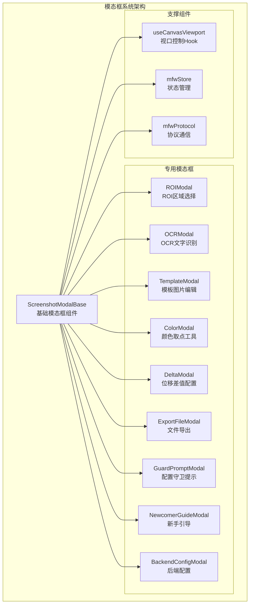

**图表来源**
- [ScreenshotModalBase.tsx:78-404](file://src/components/modals/ScreenshotModalBase.tsx#L78-L404)
- [index.ts:1-8](file://src/components/modals/index.ts#L1-L8)

**章节来源**
- [index.ts:1-8](file://src/components/modals/index.ts#L1-L8)
- [ScreenshotModalBase.tsx:78-404](file://src/components/modals/ScreenshotModalBase.tsx#L78-L404)

## 核心组件

### ScreenshotModalBase 基础组件

ScreenshotModalBase 是整个模态框系统的核心基础组件，提供了统一的截图处理框架和视口控制功能。

#### 主要功能特性

1. **截图管理**：自动请求、加载和显示截图
2. **视口控制**：提供缩放、平移、居中等视图控制功能
3. **工具栏集成**：支持自定义工具栏渲染
4. **Canvas渲染**：提供灵活的Canvas渲染接口
5. **状态管理**：统一的打开/关闭状态和重置逻辑

#### 关键接口定义

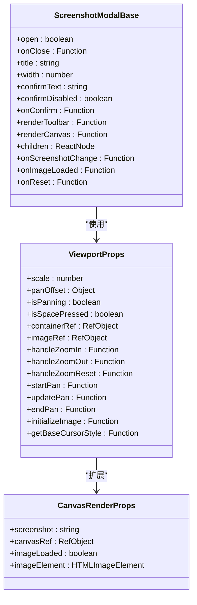

**图表来源**
- [ScreenshotModalBase.tsx:16-44](file://src/components/modals/ScreenshotModalBase.tsx#L16-L44)
- [ScreenshotModalBase.tsx:46-76](file://src/components/modals/ScreenshotModalBase.tsx#L46-L76)

#### 生命周期管理

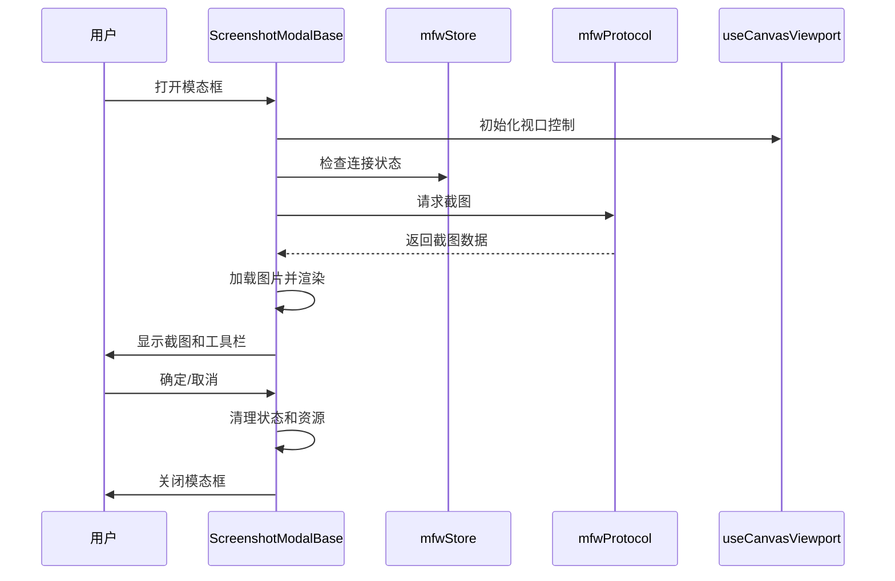

**图表来源**
- [ScreenshotModalBase.tsx:124-196](file://src/components/modals/ScreenshotModalBase.tsx#L124-L196)
- [useCanvasViewport.ts:17-59](file://src/hooks/useCanvasViewport.ts#L17-L59)

**章节来源**
- [ScreenshotModalBase.tsx:78-404](file://src/components/modals/ScreenshotModalBase.tsx#L78-L404)
- [useCanvasViewport.ts:17-59](file://src/hooks/useCanvasViewport.ts#L17-L59)

## 架构概览

### 系统架构设计

基础模态框系统采用分层架构设计，通过基础组件提供核心功能，专用组件实现特定业务逻辑：

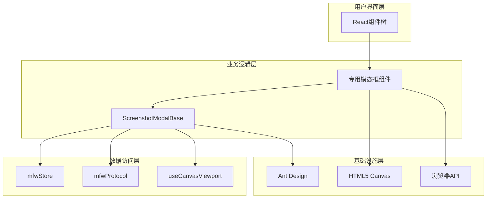

**图表来源**
- [ScreenshotModalBase.tsx:94-132](file://src/components/modals/ScreenshotModalBase.tsx#L94-L132)
- [mfwStore.ts](file://src/stores/mfwStore.ts)
- [mfwProtocol.ts](file://src/services/server.ts)

### 数据流架构

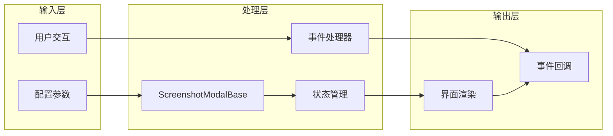

**图表来源**
- [ScreenshotModalBase.tsx:114-122](file://src/components/modals/ScreenshotModalBase.tsx#L114-L122)

## 详细组件分析

### ROI区域选择模态框

ROIModal 提供了完整的ROI（感兴趣区域）选择和编辑功能，支持负数坐标处理和实时预览。

#### 核心功能实现

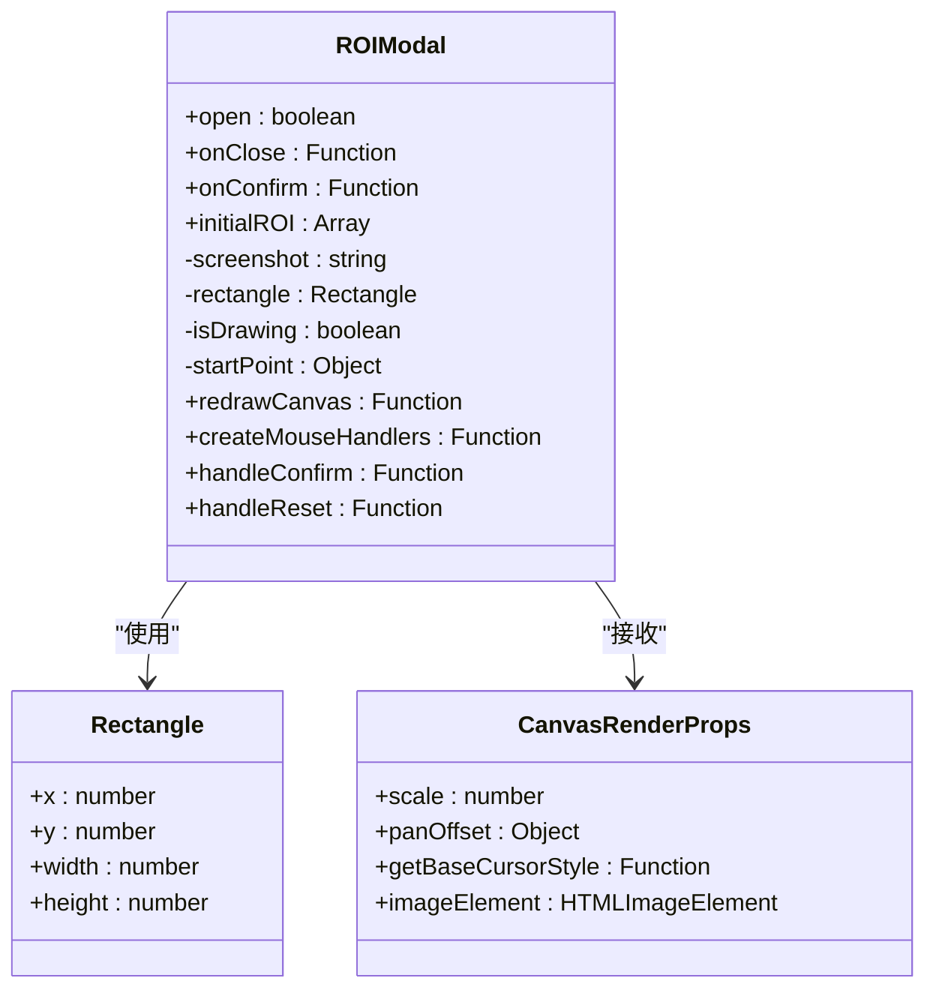

**图表来源**
- [ROIModal.tsx:13-18](file://src/components/modals/ROIModal.tsx#L13-L18)
- [ROIModal.tsx:20-44](file://src/components/modals/ROIModal.tsx#L20-L44)

#### ROI坐标处理算法

系统支持负数坐标和特殊值处理，通过 `resolveNegativeROI` 函数实现智能坐标解析：

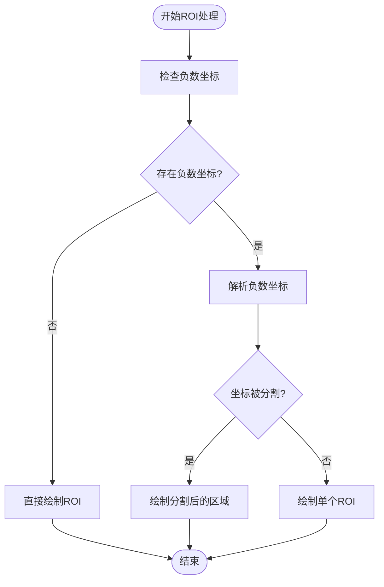

**图表来源**
- [ROIModal.tsx:54-70](file://src/components/modals/ROIModal.tsx#L54-L70)
- [ROIModal.tsx:97-117](file://src/components/modals/ROIModal.tsx#L97-L117)

**章节来源**
- [ROIModal.tsx:20-564](file://src/components/modals/ROIModal.tsx#L20-L564)

### OCR文字识别模态框

OCRModal 集成了前端和后端两种OCR识别模式，提供了强大的文字识别和预览功能。

#### OCR识别流程

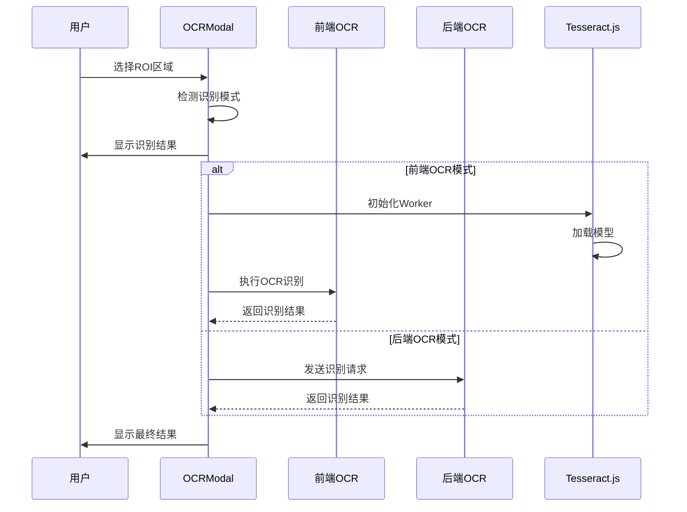

**图表来源**
- [OCRModal.tsx:98-258](file://src/components/modals/OCRModal.tsx#L98-L258)
- [OCRModal.tsx:261-294](file://src/components/modals/OCRModal.tsx#L261-L294)

#### 前端OCR处理流程

系统采用Tesseract.js实现前端OCR识别，包含图像预处理和智能阈值计算：

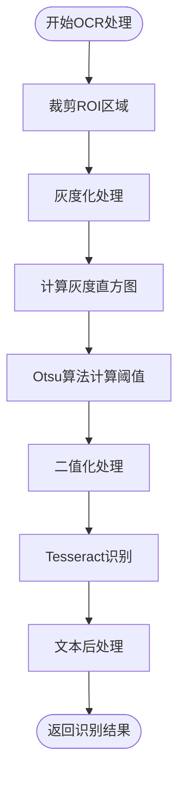

**图表来源**
- [OCRModal.tsx:107-195](file://src/components/modals/OCRModal.tsx#L107-L195)
- [OCRModal.tsx:223-256](file://src/components/modals/OCRModal.tsx#L223-L256)

**章节来源**
- [OCRModal.tsx:56-1104](file://src/components/modals/OCRModal.tsx#L56-L1104)

### 模板图片编辑模态框

TemplateModal 提供了模板图片的创建和编辑功能，支持绿色遮罩和多种绘图工具。

#### 绘图工具系统

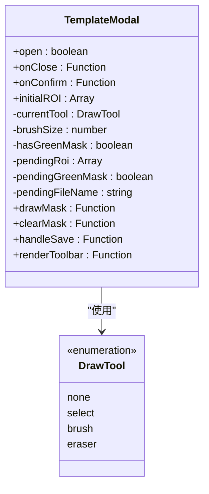

**图表来源**
- [TemplateModal.tsx:38-36](file://src/components/modals/TemplateModal.tsx#L38-L36)

#### 遮罩处理机制

系统采用双Canvas架构实现遮罩功能：

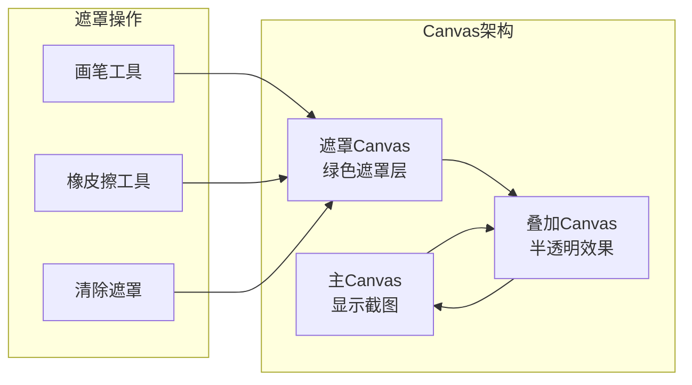

**图表来源**
- [TemplateModal.tsx:202-243](file://src/components/modals/TemplateModal.tsx#L202-L243)
- [TemplateModal.tsx:583-599](file://src/components/modals/TemplateModal.tsx#L583-L599)

**章节来源**
- [TemplateModal.tsx:40-991](file://src/components/modals/TemplateModal.tsx#L40-L991)

### 颜色取点工具模态框

ColorModal 提供了RGB、HSV、灰度三种颜色模式的颜色取点和范围预览功能。

#### 颜色模式转换

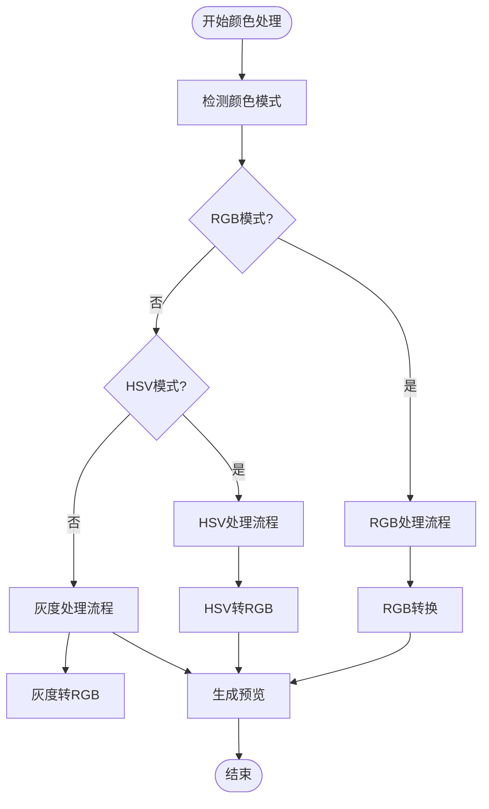

**图表来源**
- [ColorModal.tsx:28-32](file://src/components/modals/ColorModal.tsx#L28-L32)
- [ColorModal.tsx:102-140](file://src/components/modals/ColorModal.tsx#L102-L140)

#### 颜色范围预览算法

系统实现了高效的像素匹配算法，支持实时颜色范围预览：

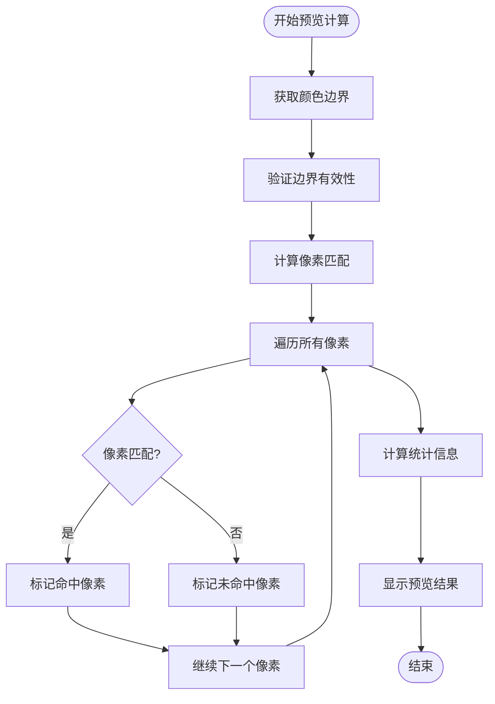

**图表来源**
- [ColorModal.tsx:233-331](file://src/components/modals/ColorModal.tsx#L233-L331)

**章节来源**
- [ColorModal.tsx:23-972](file://src/components/modals/ColorModal.tsx#L23-L972)

### 位移差值配置模态框

DeltaModal 提供了水平(dx)和垂直(dy)位移差值的配置功能，支持精确的坐标测量。

#### 差值计算机制

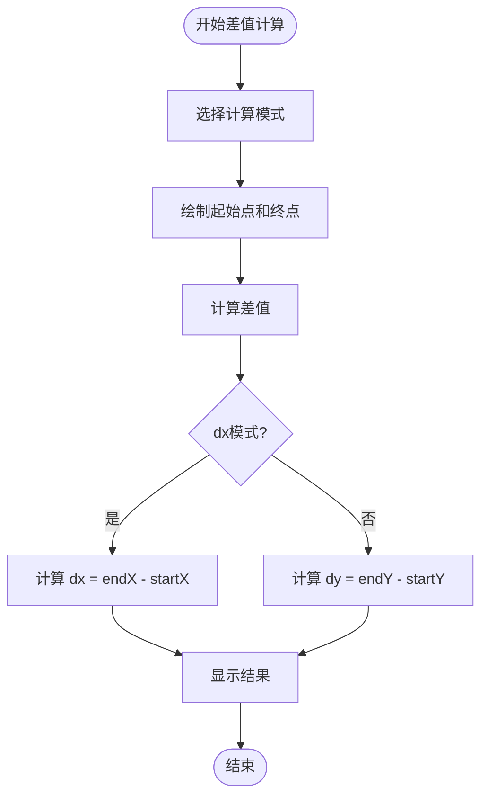

**图表来源**
- [DeltaModal.tsx:35-42](file://src/components/modals/DeltaModal.tsx#L35-L42)
- [DeltaModal.tsx:116-180](file://src/components/modals/DeltaModal.tsx#L116-L180)

**章节来源**
- [DeltaModal.tsx:22-401](file://src/components/modals/DeltaModal.tsx#L22-L401)

### 文件导出模态框

ExportFileModal 提供了工作流文件的导出功能，支持多种格式和导出策略。

#### 导出流程

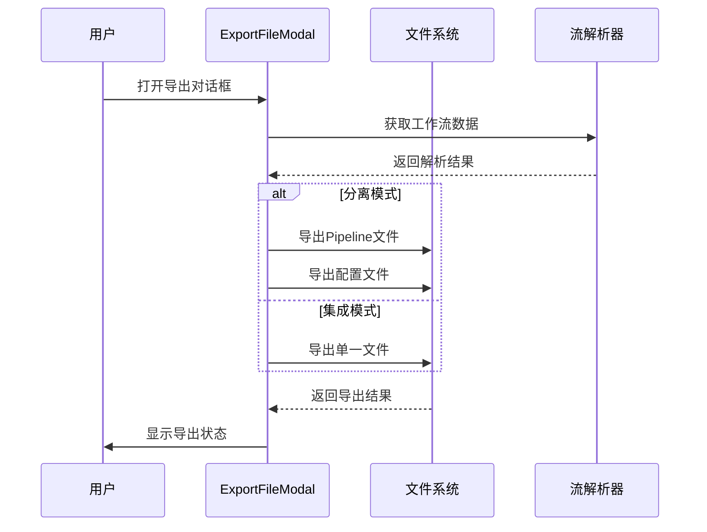

**图表来源**
- [ExportFileModal.tsx:102-139](file://src/components/modals/ExportFileModal.tsx#L102-L139)

**章节来源**
- [ExportFileModal.tsx:16-302](file://src/components/modals/ExportFileModal.tsx#L16-L302)

### 配置守卫提示模态框

GuardPromptModal 提供了配置守卫功能，确保关键配置项的正确设置。

#### 守卫检查流程

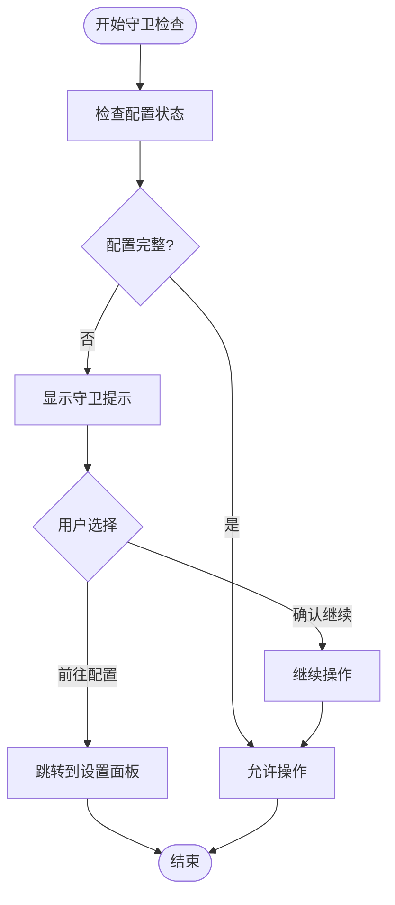

**图表来源**
- [GuardPromptModal.tsx:145-161](file://src/components/modals/GuardPromptModal.tsx#L145-L161)

**章节来源**
- [GuardPromptModal.tsx:38-172](file://src/components/modals/GuardPromptModal.tsx#L38-L172)

### 新手引导模态框

NewcomerGuideModal 提供了完整的新人引导流程，包含知识测试和证书颁发。

#### 引导流程

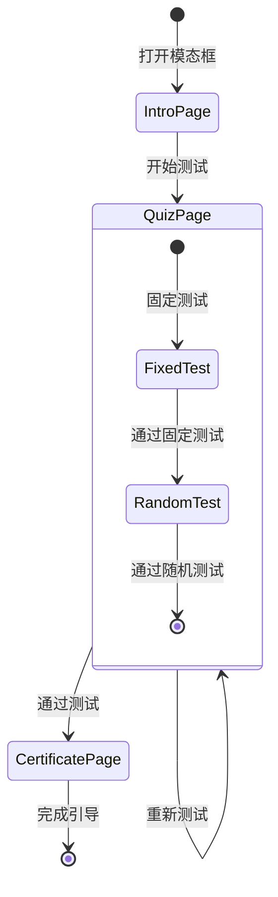

**图表来源**
- [NewcomerGuideModal.tsx:125-134](file://src/components/modals/NewcomerGuideModal.tsx#L125-L134)

**章节来源**
- [NewcomerGuideModal.tsx:40-423](file://src/components/modals/NewcomerGuideModal.tsx#L40-L423)

### 后端配置模态框

BackendConfigModal 提供了LocalBridge后端服务的配置管理功能。

#### 配置管理流程

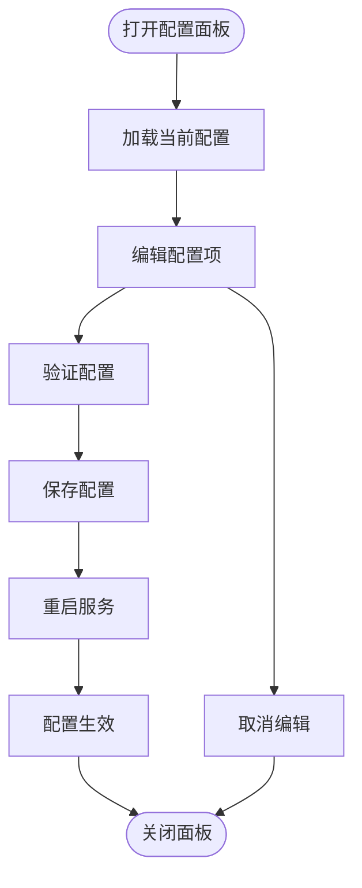

**图表来源**
- [BackendConfigModal.tsx:130-183](file://src/components/modals/BackendConfigModal.tsx#L130-L183)

**章节来源**
- [BackendConfigModal.tsx:38-480](file://src/components/modals/BackendConfigModal.tsx#L38-L480)

## 依赖关系分析

### 组件依赖图

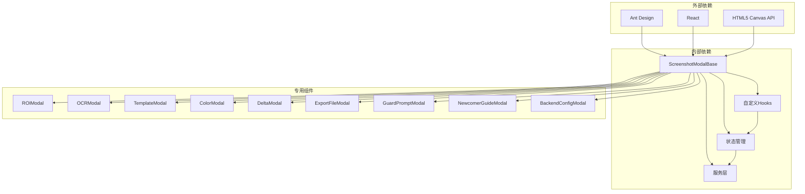

**图表来源**
- [ScreenshotModalBase.tsx:1-15](file://src/components/modals/ScreenshotModalBase.tsx#L1-L15)
- [mfwStore.ts](file://src/stores/mfwStore.ts)
- [mfwProtocol.ts](file://src/services/server.ts)

### 关键依赖关系

| 组件 | 主要依赖 | 用途 |
|------|----------|------|
| ScreenshotModalBase | useCanvasViewport, mfwStore, mfwProtocol | 基础模态框功能 |
| ROIModal | ScreenshotModalBase, roiNegativeCoord | ROI区域选择 |
| OCRModal | ScreenshotModalBase, tesseract.js | OCR文字识别 |
| TemplateModal | ScreenshotModalBase, mfwProtocol | 模板图片编辑 |
| ColorModal | ScreenshotModalBase, hsv/rgb转换 | 颜色取点工具 |
| DeltaModal | ScreenshotModalBase | 位移差值配置 |
| ExportFileModal | fileStore, configStore, parser | 文件导出功能 |
| GuardPromptModal | configStore, guardSystem | 配置守卫提示 |
| NewcomerGuideModal | newcomerStore, quiz数据 | 新人引导 |
| BackendConfigModal | configProtocol, wailsBridge | 后端配置管理 |

**章节来源**
- [ScreenshotModalBase.tsx:94-132](file://src/components/modals/ScreenshotModalBase.tsx#L94-L132)
- [ROIModal.tsx:8-11](file://src/components/modals/ROIModal.tsx#L8-L11)
- [OCRModal.tsx:18-24](file://src/components/modals/OCRModal.tsx#L18-L24)

## 性能考虑

### 性能优化策略

1. **Canvas渲染优化**
   - 使用requestAnimationFrame进行高效渲染
   - 实现Canvas缓存机制减少重复绘制
   - 采用双Canvas架构分离遮罩和主图像

2. **内存管理**
   - 及时清理Canvas上下文和图像数据
   - 使用Ref对象避免不必要的重渲染
   - 实现组件卸载时的状态清理

3. **网络优化**
   - 截图请求去抖动处理
   - 错误重试机制
   - 连接状态检查

4. **计算优化**
   - OCR识别结果缓存
   - 颜色范围预览的增量更新
   - ROI坐标解析的智能缓存

### 性能监控指标

- **渲染性能**: Canvas绘制帧率保持在60fps以上
- **内存使用**: 组件卸载后及时释放Canvas和图像资源
- **网络延迟**: 截图请求响应时间小于2秒
- **交互流畅度**: 鼠标事件处理延迟小于16ms

## 故障排除指南

### 常见问题及解决方案

#### 截图功能异常

**问题描述**: 截图无法正常显示或加载失败

**可能原因**:
1. 后端服务未连接
2. 网络连接中断
3. 权限不足

**解决步骤**:
1. 检查后端服务连接状态
2. 验证网络连接稳定性
3. 确认应用权限设置
4. 重新尝试截图请求

#### Canvas渲染问题

**问题描述**: Canvas显示异常或绘制错误

**可能原因**:
1. Canvas尺寸设置错误
2. 图像数据损坏
3. 浏览器兼容性问题

**解决步骤**:
1. 检查Canvas尺寸和比例
2. 验证图像数据完整性
3. 测试不同浏览器兼容性
4. 清理浏览器缓存

#### OCR识别失败

**问题描述**: OCR识别结果不准确或完全失败

**可能原因**:
1. 图像质量过低
2. 模型加载失败
3. 配置参数错误

**解决步骤**:
1. 提高图像分辨率和对比度
2. 检查OCR模型文件完整性
3. 验证OCR参数配置
4. 尝试不同的识别模式

**章节来源**
- [ScreenshotModalBase.tsx:124-169](file://src/components/modals/ScreenshotModalBase.tsx#L124-L169)
- [OCRModal.tsx:296-366](file://src/components/modals/OCRModal.tsx#L296-L366)

### 调试工具和方法

1. **开发者工具**: 使用浏览器开发者工具监控Canvas渲染
2. **日志系统**: 启用详细日志记录关键操作
3. **性能分析**: 使用性能面板分析渲染性能
4. **网络监控**: 监控截图请求和响应时间

## 结论

基础模态框系统通过模块化设计和统一架构，为MaaPipelineEditor提供了强大而灵活的交互能力。系统具有以下特点：

1. **高度模块化**: 通过基础组件和专用组件的分离，实现了良好的代码复用和维护性
2. **功能丰富**: 支持截图预览、图像处理、配置管理等多种业务场景
3. **性能优化**: 采用多种优化策略确保流畅的用户体验
4. **扩展性强**: 提供清晰的扩展接口，便于添加新的模态框功能

该系统为复杂图像处理和配置管理场景提供了可靠的解决方案，是MPE应用的重要基础设施组件。通过持续的优化和扩展，基础模态框系统将继续为用户提供更好的使用体验。