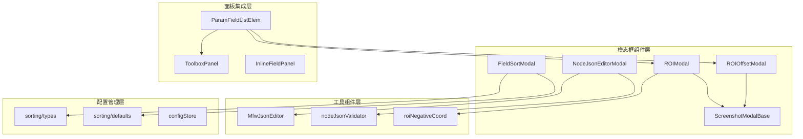
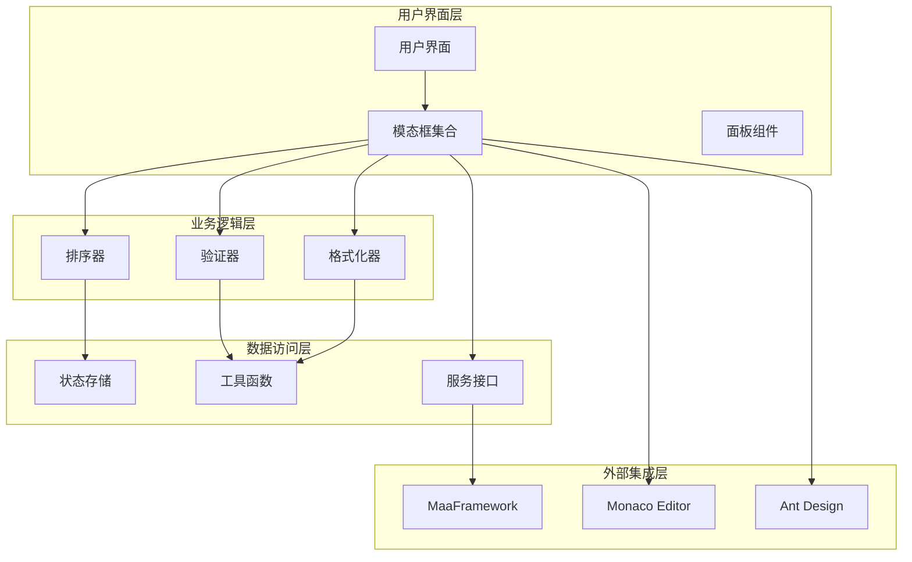
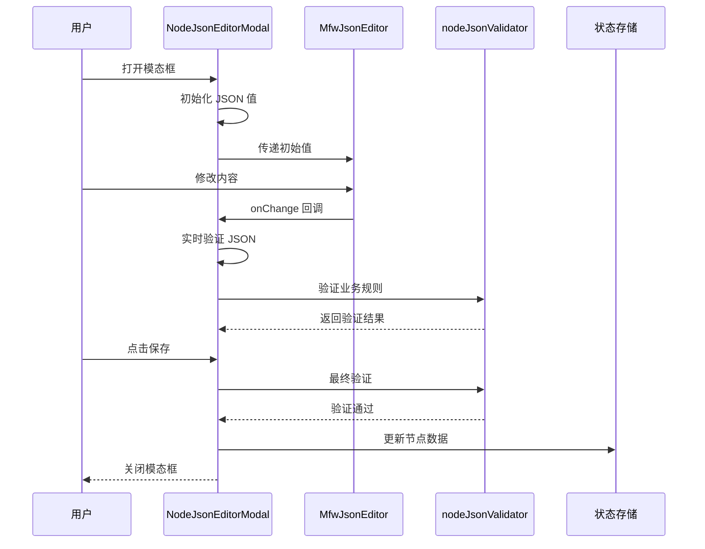
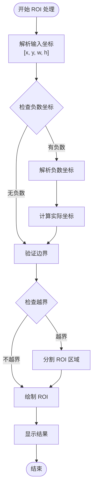
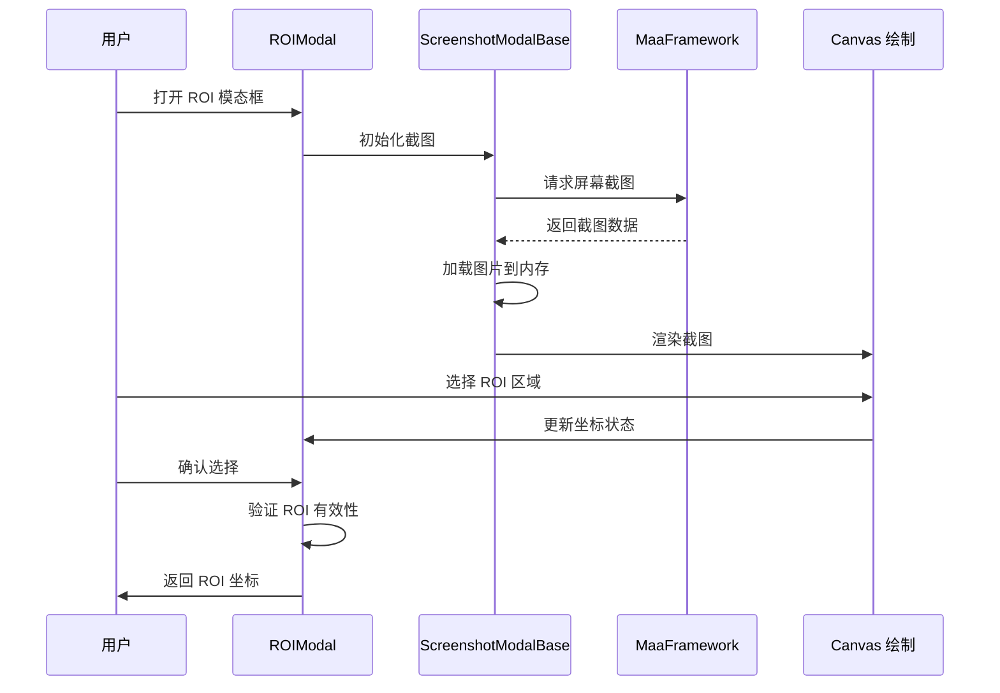
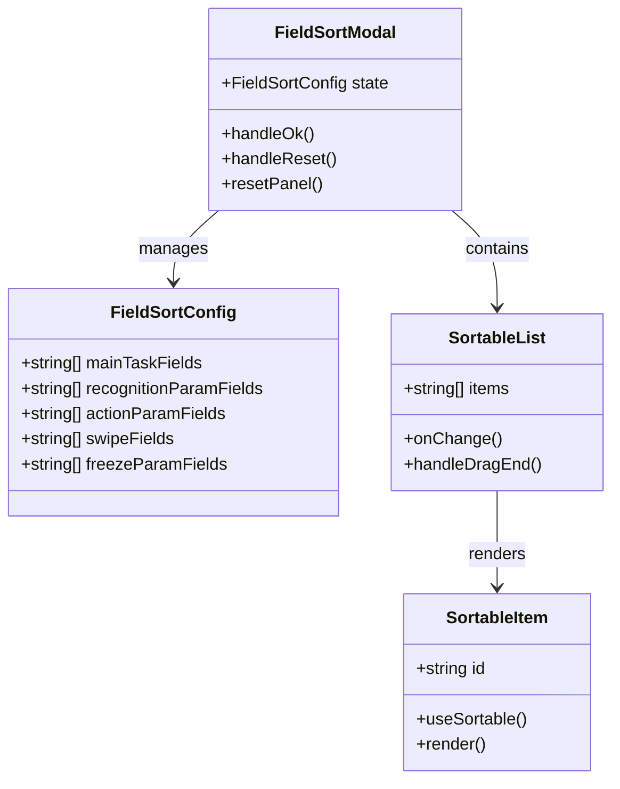
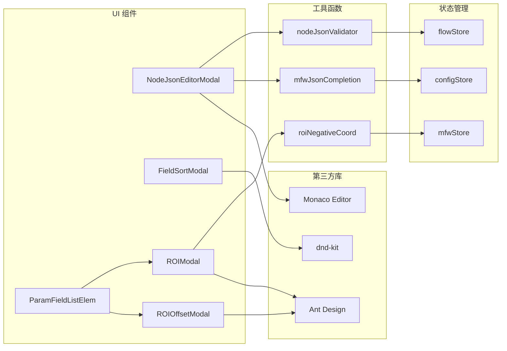

# 字段编辑模态框

<cite>
**本文档引用的文件**
- [NodeJsonEditorModal.tsx](file://src/components/modals/NodeJsonEditorModal.tsx)
- [FieldSortModal.tsx](file://src/components/modals/FieldSortModal.tsx)
- [ROIModal.tsx](file://src/components/modals/ROIModal.tsx)
- [ROIOffsetModal.tsx](file://src/components/modals/ROIOffsetModal.tsx)
- [ScreenshotModalBase.tsx](file://src/components/modals/ScreenshotModalBase.tsx)
- [MfwJsonEditor.tsx](file://src/components/json/MfwJsonEditor.tsx)
- [nodeJsonValidator.ts](file://src/utils/node/nodeJsonValidator.ts)
- [roiNegativeCoord.ts](file://src/utils/data/roiNegativeCoord.ts)
- [ParamFieldListElem.tsx](file://src/components/panels/field/items/ParamFieldListElem.tsx)
- [ToolboxPanel.tsx](file://src/components/panels/tools/ToolboxPanel.tsx)
- [index.ts](file://src/components/modals/index.ts)
- [types.ts](file://src/core/sorting/types.ts)
- [defaults.ts](file://src/core/sorting/defaults.ts)
- [index.ts](file://src/core/sorting/index.ts)
- [InlineFieldPanel.tsx](file://src/components/panels/main/InlineFieldPanel.tsx)
</cite>

## 目录
1. [简介](#简介)
2. [项目结构](#项目结构)
3. [核心组件](#核心组件)
4. [架构概览](#架构概览)
5. [详细组件分析](#详细组件分析)
6. [依赖关系分析](#依赖关系分析)
7. [性能考虑](#性能考虑)
8. [故障排除指南](#故障排除指南)
9. [结论](#结论)

## 简介

字段编辑模态框是 MAA Pipeline Editor 中用于节点属性编辑的核心功能模块。该系统提供了三种主要类型的编辑器：节点 JSON 编辑器、字段排序配置器和 ROI 操作工具。这些组件协同工作，为用户提供了一个强大而直观的字段编辑体验。

系统采用模块化设计，每个模态框都是独立的功能单元，通过统一的状态管理和事件处理机制进行协调。支持实时验证、类型检查、格式化处理以及复杂的可视化编辑功能。

## 项目结构

字段编辑模态框系统由多个相互关联的组件组成，形成了一个完整的编辑生态系统：

**图表来源**
- [NodeJsonEditorModal.tsx:1-244](file://src/components/modals/NodeJsonEditorModal.tsx#L1-L244)
- [ROIModal.tsx:1-564](file://src/components/modals/ROIModal.tsx#L1-L564)
- [FieldSortModal.tsx:1-360](file://src/components/modals/FieldSortModal.tsx#L1-L360)

**章节来源**
- [NodeJsonEditorModal.tsx:1-244](file://src/components/modals/NodeJsonEditorModal.tsx#L1-L244)
- [ROIModal.tsx:1-564](file://src/components/modals/ROIModal.tsx#L1-L564)
- [FieldSortModal.tsx:1-360](file://src/components/modals/FieldSortModal.tsx#L1-L360)

## 核心组件

### 节点 JSON 编辑器

节点 JSON 编辑器提供了对节点数据的直接 JSON 编辑能力，支持实时语法验证和格式化功能。

**关键特性：**
- 实时 JSON 语法验证
- 自动格式化和缩进
- 业务规则验证
- Monaco Editor 集成
- 错误处理和提示

### 字段排序配置器

字段排序配置器允许用户自定义字段的显示顺序，支持拖拽排序和默认值重置。

**关键特性：**
- 拖拽排序界面
- 多面板配置支持
- 默认值管理
- 实时预览更新

### ROI 操作工具

ROI 操作工具集成了截图捕获、区域选择和坐标计算功能，支持负数坐标处理。

**关键特性：**
- 实时截图预览
- 交互式区域选择
- 负数坐标解析
- 坐标可视化显示

**章节来源**
- [NodeJsonEditorModal.tsx:57-241](file://src/components/modals/NodeJsonEditorModal.tsx#L57-L241)
- [FieldSortModal.tsx:108-359](file://src/components/modals/FieldSortModal.tsx#L108-L359)
- [ROIModal.tsx:20-563](file://src/components/modals/ROIModal.tsx#L20-L563)

## 架构概览

系统采用分层架构设计，确保了组件间的松耦合和高内聚：

**图表来源**
- [ParamFieldListElem.tsx:73-788](file://src/components/panels/field/items/ParamFieldListElem.tsx#L73-L788)
- [ToolboxPanel.tsx:1-524](file://src/components/panels/tools/ToolboxPanel.tsx#L1-L524)

## 详细组件分析

### 节点 JSON 编辑器模态框

节点 JSON 编辑器是一个功能完整的 JSON 编辑解决方案，集成了多种验证和格式化功能。

#### 数据绑定机制

编辑器采用受控组件模式，通过状态管理实现双向数据绑定：

**图表来源**
- [NodeJsonEditorModal.tsx:87-129](file://src/components/modals/NodeJsonEditorModal.tsx#L87-L129)
- [nodeJsonValidator.ts:103-144](file://src/utils/node/nodeJsonValidator.ts#L103-L144)

#### 实时验证机制

编辑器实现了多层次的验证策略：

1. **语法验证**：实时检查 JSON 语法正确性
2. **业务验证**：验证节点数据结构完整性
3. **类型检查**：确保字段类型符合预期
4. **格式化验证**：检查缩进和格式规范

**章节来源**
- [NodeJsonEditorModal.tsx:87-129](file://src/components/modals/NodeJsonEditorModal.tsx#L87-L129)
- [nodeJsonValidator.ts:16-95](file://src/utils/node/nodeJsonValidator.ts#L16-L95)

### ROI 操作模态框

ROI 操作模态框提供了强大的区域选择和坐标编辑功能，支持复杂的坐标系统。

#### ROI 坐标处理算法

系统支持负数坐标处理，这是 MaaFramework v5.6+ 的重要特性：

**图表来源**
- [roiNegativeCoord.ts:55-178](file://src/utils/data/roiNegativeCoord.ts#L55-L178)

#### 截图处理流程

ROI 模态框集成了完整的截图处理管道：

**图表来源**
- [ROIModal.tsx:244-301](file://src/components/modals/ROIModal.tsx#L244-L301)
- [ScreenshotModalBase.tsx:124-169](file://src/components/modals/ScreenshotModalBase.tsx#L124-L169)

**章节来源**
- [ROIModal.tsx:20-563](file://src/components/modals/ROIModal.tsx#L20-L563)
- [roiNegativeCoord.ts:1-313](file://src/utils/data/roiNegativeCoord.ts#L1-L313)

### 字段排序配置器

字段排序配置器提供了灵活的字段顺序管理功能，支持多维度的排序配置。

#### 排序配置架构

**图表来源**
- [types.ts:6-27](file://src/core/sorting/types.ts#L6-L27)
- [FieldSortModal.tsx:108-359](file://src/components/modals/FieldSortModal.tsx#L108-L359)

#### 默认排序策略

系统提供了针对不同节点类型的默认排序策略：

| 字段类型 | 默认顺序 | 用途 |
|---------|----------|------|
| 主任务字段 | desc, doc, enabled, max_hit, ... | 节点基本属性 |
| Recognition 参数 | custom_recognition, roi, template, method, ... | 识别相关参数 |
| Action 参数 | custom_action, target, duration, swipes, ... | 动作相关参数 |
| Swipe 字段 | 专用字段列表 | 触摸滑动参数 |
| Freeze 参数 | time, target, threshold, ... | 冻结等待参数 |

**章节来源**
- [defaults.ts:122-152](file://src/core/sorting/defaults.ts#L122-L152)
- [FieldSortModal.tsx:194-215](file://src/components/modals/FieldSortModal.tsx#L194-L215)

### 快捷工具集成

系统集成了多种快捷工具，为用户提供高效的字段编辑体验：

#### 快捷工具配置

| 工具类型 | 字段映射 | 图标 | 功能描述 |
|---------|----------|------|----------|
| ROI 选择 | roi, target, begin, end | 图标：框选中 | 区域选择工具 |
| ROI 偏移 | roi_offset, target_offset, begin_offset, end_offset | 图标：测量1 | ROI 偏移测量 |
| OCR 识别 | expected | 图标：OCR1 | 文本识别工具 |
| 模板截图 | template | 图标：截图 | 模板图像采集 |
| 颜色取点 | lower, upper | 图标：取色器 | 颜色采样工具 |
| 位移差值 | dx, dy | 图标：测量2 | 位置差异计算 |

**章节来源**
- [ParamFieldListElem.tsx:39-65](file://src/components/panels/field/items/ParamFieldListElem.tsx#L39-L65)
- [ToolboxPanel.tsx:40-522](file://src/components/panels/tools/ToolboxPanel.tsx#L40-L522)

## 依赖关系分析

系统中的组件依赖关系体现了清晰的分层架构：

**图表来源**
- [index.ts:1-7](file://src/components/modals/index.ts#L1-L7)
- [InlineFieldPanel.tsx:223-228](file://src/components/panels/main/InlineFieldPanel.tsx#L223-L228)

**章节来源**
- [index.ts:1-7](file://src/components/modals/index.ts#L1-L7)
- [InlineFieldPanel.tsx:223-228](file://src/components/panels/main/InlineFieldPanel.tsx#L223-L228)

## 性能考虑

### 渲染优化

系统采用了多种性能优化策略：

1. **懒加载组件**：使用 React.lazy 和 Suspense 实现按需加载
2. **记忆化优化**：广泛使用 memo 和 useCallback 避免不必要的重渲染
3. **虚拟滚动**：对于大量字段的情况使用虚拟化技术
4. **防抖处理**：对高频事件（如实时验证）使用防抖优化

### 内存管理

- 截图资源及时释放
- Canvas 绘制完成后清理上下文
- 事件监听器的正确注销
- 大对象的及时垃圾回收

### 网络优化

- 截图请求的去重处理
- 连接状态的智能检测
- 失败重试机制的指数退避

## 故障排除指南

### 常见问题及解决方案

#### 设备连接问题

**症状**：快捷工具无法打开，提示需要连接设备
**原因**：MFW 连接状态异常
**解决方法**：
1. 检查设备连接状态
2. 重新建立 MFW 连接
3. 验证控制器 ID 有效性

#### ROI 选择异常

**症状**：ROI 选择框无法正常绘制或坐标计算错误
**原因**：截图加载失败或坐标解析异常
**解决方法**：
1. 重新请求截图
2. 检查图片加载状态
3. 验证坐标范围有效性

#### JSON 编辑错误

**症状**：保存时出现 JSON 验证错误
**原因**：语法错误或业务规则不满足
**解决方法**：
1. 查看错误提示信息
2. 使用格式化功能修复缩进
3. 检查必需字段的完整性

**章节来源**
- [ParamFieldListElem.tsx:118-199](file://src/components/panels/field/items/ParamFieldListElem.tsx#L118-L199)
- [ROIModal.tsx:218-232](file://src/components/modals/ROIModal.tsx#L218-L232)
- [NodeJsonEditorModal.tsx:109-129](file://src/components/modals/NodeJsonEditorModal.tsx#L109-L129)

## 结论

字段编辑模态框系统通过精心设计的架构和丰富的功能特性，为用户提供了强大而直观的节点编辑体验。系统的主要优势包括：

1. **模块化设计**：每个模态框都是独立的功能单元，便于维护和扩展
2. **实时反馈**：提供即时的验证和预览反馈
3. **类型安全**：严格的类型检查和格式化处理
4. **用户体验**：直观的界面设计和流畅的操作体验
5. **可扩展性**：清晰的架构为未来功能扩展奠定了基础

该系统成功地平衡了功能完整性与性能效率，在保证用户体验的同时，确保了系统的稳定性和可靠性。通过合理的错误处理和故障排除机制，用户可以高效地完成各种字段编辑任务。