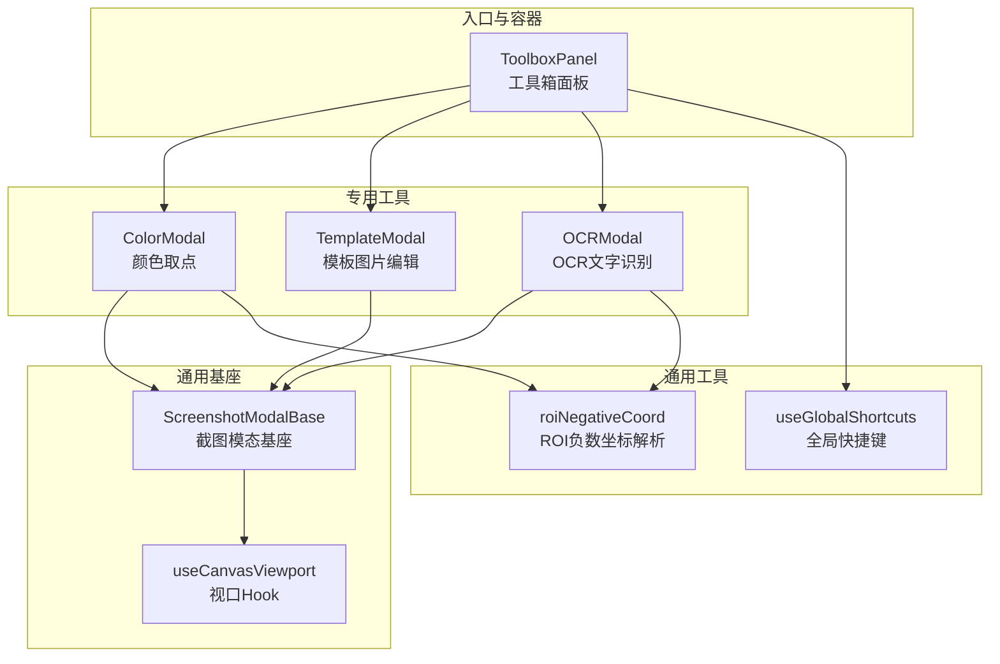
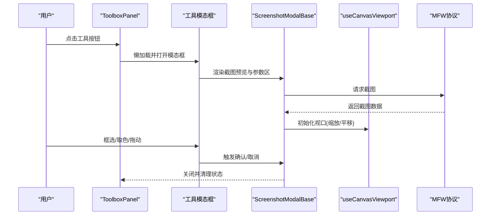
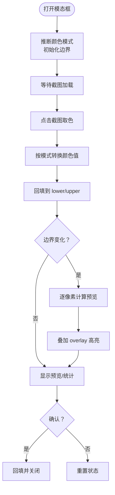
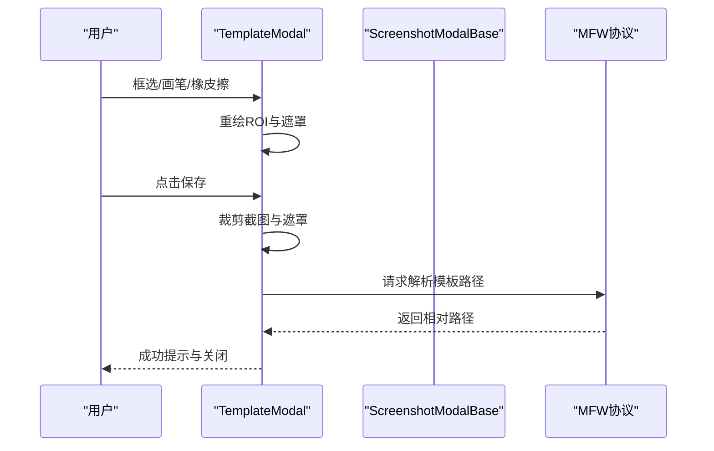
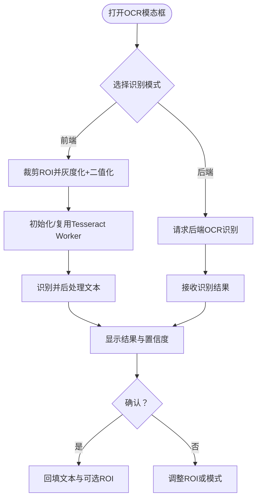
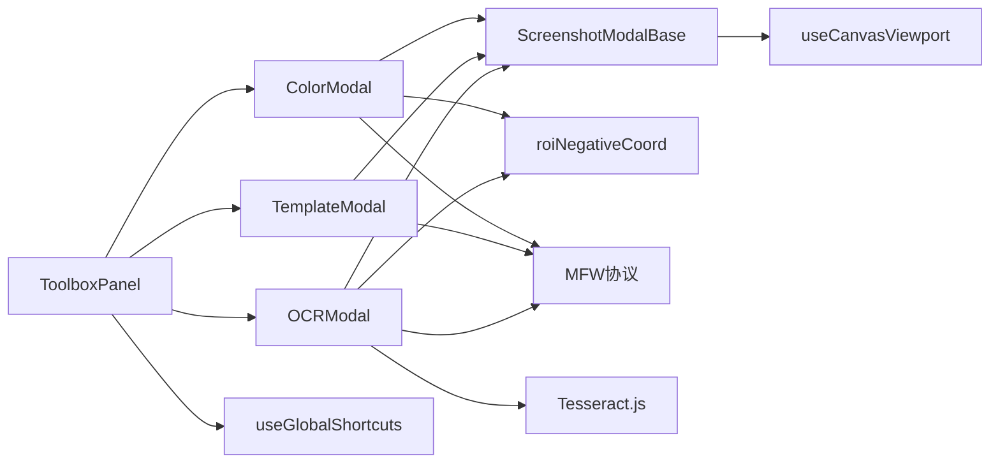

# 工具类模态框

<cite>
**本文引用的文件**
- [ColorModal.tsx](file://src/components/modals/ColorModal.tsx)
- [TemplateModal.tsx](file://src/components/modals/TemplateModal.tsx)
- [OCRModal.tsx](file://src/components/modals/OCRModal.tsx)
- [ScreenshotModalBase.tsx](file://src/components/modals/ScreenshotModalBase.tsx)
- [useCanvasViewport.ts](file://src/hooks/useCanvasViewport.ts)
- [ToolboxPanel.tsx](file://src/components/panels/tools/ToolboxPanel.tsx)
- [useGlobalShortcuts.ts](file://src/hooks/useGlobalShortcuts.ts)
- [roiNegativeCoord.ts](file://src/utils/data/roiNegativeCoord.ts)
- [index.ts](file://src/components/modals/index.ts)
</cite>

## 目录
1. [简介](#简介)
2. [项目结构](#项目结构)
3. [核心组件](#核心组件)
4. [架构总览](#架构总览)
5. [详细组件分析](#详细组件分析)
6. [依赖关系分析](#依赖关系分析)
7. [性能考量](#性能考量)
8. [故障排查指南](#故障排查指南)
9. [结论](#结论)
10. [附录](#附录)

## 简介
本文件系统性梳理“工具类模态框”的实现与使用，覆盖颜色选择器、模板管理、OCR识别三大核心工具，并深入分析其专用组件、交互模式、配置参数、性能优化与资源管理策略。同时给出快捷键支持与上下文菜单集成的实践路径，以及扩展开发指导，帮助开发者在现有架构基础上高效扩展新的工具模态框。

## 项目结构
工具类模态框位于前端组件目录，采用“通用基座 + 专用工具”的分层设计：
- 通用基座：ScreenshotModalBase 提供统一的截图获取、视口控制、左右布局与操作区。
- 专用工具：ColorModal、TemplateModal、OCRModal 等各自封装领域逻辑与 UI。
- 交互入口：ToolboxPanel 将工具按钮与模态框联动，支持懒加载与状态管理。
- 通用能力：useCanvasViewport 提供缩放、平移、空格/中键拖动、滚轮缩放等视口控制；roiNegativeCoord 提供 ROI 负数坐标解析；useGlobalShortcuts 提供全局快捷键拦截与屏蔽。

图表来源
- [ToolboxPanel.tsx:1-524](file://src/components/panels/tools/ToolboxPanel.tsx#L1-L524)
- [ScreenshotModalBase.tsx:1-405](file://src/components/modals/ScreenshotModalBase.tsx#L1-L405)
- [useCanvasViewport.ts:1-307](file://src/hooks/useCanvasViewport.ts#L1-L307)
- [ColorModal.tsx:1-972](file://src/components/modals/ColorModal.tsx#L1-L972)
- [TemplateModal.tsx:1-991](file://src/components/modals/TemplateModal.tsx#L1-L991)
- [OCRModal.tsx:1-1104](file://src/components/modals/OCRModal.tsx#L1-L1104)
- [roiNegativeCoord.ts:1-313](file://src/utils/data/roiNegativeCoord.ts#L1-L313)
- [useGlobalShortcuts.ts:1-169](file://src/hooks/useGlobalShortcuts.ts#L1-L169)

章节来源
- [ToolboxPanel.tsx:1-524](file://src/components/panels/tools/ToolboxPanel.tsx#L1-L524)
- [ScreenshotModalBase.tsx:1-405](file://src/components/modals/ScreenshotModalBase.tsx#L1-L405)

## 核心组件
- ScreenshotModalBase：统一的截图获取、视口控制、左右布局与操作区，所有工具模态框的父类。
- ColorModal：颜色取点与颜色范围预览，支持 RGB/HSV/GRAY 三种模式与取色后自动回填。
- TemplateModal：模板图片编辑，支持框选、画笔、橡皮擦、遮罩叠加与模板导出。
- OCRModal：OCR 文字识别，支持前端 Tesseract 与后端原生两种模式，自动防抖触发识别。
- useCanvasViewport：封装缩放、平移、空格/中键拖动、滚轮缩放、初始适配等视口控制。
- roiNegativeCoord：ROI 负数坐标解析与可视化辅助，支持分割区域绘制与扩展边距标注。
- useGlobalShortcuts：全局撤销/重做/删除键重定向，屏蔽模态框期间的快捷键干扰。

章节来源
- [ScreenshotModalBase.tsx:1-405](file://src/components/modals/ScreenshotModalBase.tsx#L1-L405)
- [ColorModal.tsx:1-972](file://src/components/modals/ColorModal.tsx#L1-L972)
- [TemplateModal.tsx:1-991](file://src/components/modals/TemplateModal.tsx#L1-L991)
- [OCRModal.tsx:1-1104](file://src/components/modals/OCRModal.tsx#L1-L1104)
- [useCanvasViewport.ts:1-307](file://src/hooks/useCanvasViewport.ts#L1-L307)
- [roiNegativeCoord.ts:1-313](file://src/utils/data/roiNegativeCoord.ts#L1-L313)
- [useGlobalShortcuts.ts:1-169](file://src/hooks/useGlobalShortcuts.ts#L1-L169)

## 架构总览
工具类模态框遵循“通用基座 + 专用工具 + 交互入口”的分层架构。通用基座负责截图获取与视口控制，专用工具负责具体业务逻辑，交互入口负责状态管理与懒加载。

图表来源
- [ToolboxPanel.tsx:464-520](file://src/components/panels/tools/ToolboxPanel.tsx#L464-L520)
- [ScreenshotModalBase.tsx:124-169](file://src/components/modals/ScreenshotModalBase.tsx#L124-L169)
- [useCanvasViewport.ts:189-215](file://src/hooks/useCanvasViewport.ts#L189-L215)

## 详细组件分析

### 颜色取点工具（ColorModal）
- 功能要点
  - 支持 RGB/HSV/GRAY 三种颜色模式，自动根据初始 method 推断模式。
  - 取色后自动回填到 lower/upper 边界，支持目标字段名区分上下界。
  - 颜色范围预览：逐像素对比，命中半透明绿色高亮，未命中半透明黑色遮罩。
  - 预览统计：返回命中像素数量与百分比。
  - 颜色模式切换：RGB↔HSV↔GRAY 互转，同时重置边界与预览。
- 数据流
  - 截图加载后初始化 canvas，鼠标点击读取像素 RGB，按模式转换为目标通道值。
  - 边界输入变化触发预览重算，预览结果通过 overlay canvas 叠加显示。
- 性能与资源
  - 使用 requestAnimationFrame 与 ImageData 批量处理像素，避免主线程阻塞。
  - 预览关闭时清空 overlay canvas，释放内存。
- 交互模式
  - 空格/中键拖动平移；滚轮缩放；点击取色；确认回填。

图表来源
- [ColorModal.tsx:23-475](file://src/components/modals/ColorModal.tsx#L23-L475)
- [ColorModal.tsx:232-331](file://src/components/modals/ColorModal.tsx#L232-L331)
- [ColorModal.tsx:333-424](file://src/components/modals/ColorModal.tsx#L333-L424)

章节来源
- [ColorModal.tsx:1-972](file://src/components/modals/ColorModal.tsx#L1-L972)

### 模板图片编辑（TemplateModal）
- 功能要点
  - 支持框选 ROI、画笔/橡皮擦遮罩叠加、遮罩清除。
  - ROI 支持负数坐标解析与分割区域可视化。
  - 保存模板：支持 File System Access API 与传统下载，自动请求后端解析相对路径。
  - 绿色遮罩标记：用于指示模板中需要忽略的区域。
- 数据流
  - 用户框选 ROI，实时重绘；画笔/橡皮擦在隐藏的 maskCanvas 上绘制。
  - 保存时裁剪截图与遮罩，导出 PNG；通过 mfwProtocol 请求路径解析。
- 性能与资源
  - 遮罩层独立 canvas，减少主画布重绘开销。
  - 保存前仅在临时 canvas 上合成，避免污染主画布。
- 交互模式
  - 工具切换：框选/画笔/橡皮擦；画笔大小滑条；遮罩清除按钮。

图表来源
- [TemplateModal.tsx:380-496](file://src/components/modals/TemplateModal.tsx#L380-L496)
- [TemplateModal.tsx:80-101](file://src/components/modals/TemplateModal.tsx#L80-L101)

章节来源
- [TemplateModal.tsx:1-991](file://src/components/modals/TemplateModal.tsx#L1-L991)

### OCR 文字识别（OCRModal）
- 功能要点
  - 前端 OCR：基于 Tesseract.js，灰度化+Otsu 二值化+识别，支持中文+英文混合。
  - 后端 OCR：通过 MFW 协议调用本地 OCR 模型，重新截取当前窗口画面。
  - 自动防抖：框选/坐标变化后 500ms 防抖触发识别。
  - ROI 负数坐标解析：支持负数 x/y、w/h=0/-0 的复杂场景。
- 数据流
  - 用户框选 ROI，触发防抖识别；前端模式直接在当前截图上裁剪识别；后端模式通过协议请求识别结果。
  - 识别结果回填到字段，可选附带 ROI。
- 性能与资源
  - 首次加载模型时 loading 状态；识别完成后释放 worker（可复用）。
  - 二值化与灰度化使用 ImageData 批处理，避免阻塞主线程。
- 交互模式
  - 模式切换：前端/后端；框选 ROI；坐标手动输入；确认回填。

图表来源
- [OCRModal.tsx:98-258](file://src/components/modals/OCRModal.tsx#L98-L258)
- [OCRModal.tsx:260-294](file://src/components/modals/OCRModal.tsx#L260-L294)
- [OCRModal.tsx:521-532](file://src/components/modals/OCRModal.tsx#L521-L532)

章节来源
- [OCRModal.tsx:1-1104](file://src/components/modals/OCRModal.tsx#L1-L1104)

### 通用基座（ScreenshotModalBase）
- 功能要点
  - 统一的左右布局：左侧截图预览，右侧参数配置区。
  - 视口控制：缩放、平移、空格/中键拖动、滚轮缩放、自适应窗口。
  - 截图获取：通过 MFW 协议请求截图，加载完成后渲染 canvas。
  - 操作区：重新截图、取消、确认。
- 设计模式
  - 通过 renderCanvas 与 renderToolbar 插槽，允许子组件注入自定义 UI。
  - 通过 onScreenshotChange/onImageLoaded/onReset 回调，实现生命周期管理。

章节来源
- [ScreenshotModalBase.tsx:1-405](file://src/components/modals/ScreenshotModalBase.tsx#L1-L405)

### 视口控制（useCanvasViewport）
- 功能要点
  - 缩放：最小/最大比例限制，步进缩放，滚轮缩放。
  - 平移：空格键或中键拖动，记录起点与偏移。
  - 初始化：根据容器与图片尺寸计算初始缩放与居中偏移。
  - 重置：恢复初始状态。
- 交互细节
  - 空格键按下时切换 grab 光标样式，中键拖动时同样切换 grab。
  - 滚轮缩放以鼠标位置为中心，保持视觉焦点稳定。

章节来源
- [useCanvasViewport.ts:1-307](file://src/hooks/useCanvasViewport.ts#L1-L307)

### ROI 负数坐标解析（roiNegativeCoord）
- 功能要点
  - 解析规则：负数 x/y 从右/下边缘计算；w/h=0 延伸至边缘；w/h<0 视为右下角。
  - 分割区域：当 ROI 超出边界时，拆分为左上角与右下角两块区域。
  - 可视化辅助：扩展边距绘制、边界线与标签标注。
- 适用场景
  - 模板编辑、OCR 框选、颜色取点等需要灵活 ROI 的场景。

章节来源
- [roiNegativeCoord.ts:1-313](file://src/utils/data/roiNegativeCoord.ts#L1-L313)

### 全局快捷键（useGlobalShortcuts）
- 功能要点
  - 拦截撤销/重做快捷键，避免在模态框期间影响编辑器。
  - Delete 键重定向为 Backspace，提升跨平台一致性。
  - 仅在非输入控件与非模态框打开时生效。
- 交互细节
  - 通过 isModalOpen 检测 .ant-modal-wrap 可见性，确保不干扰其他 Modal。

章节来源
- [useGlobalShortcuts.ts:1-169](file://src/hooks/useGlobalShortcuts.ts#L1-L169)

## 依赖关系分析
- 组件耦合
  - ColorModal/TemplateModal/OCRModal 共同依赖 ScreenshotModalBase 与 useCanvasViewport。
  - TemplateModal/OCRModal 依赖 roiNegativeCoord 进行 ROI 解析。
  - ToolboxPanel 作为入口，懒加载各工具模态框并管理状态。
- 外部依赖
  - MFW 协议：截图、OCR、路径解析等后端能力。
  - Tesseract.js：前端 OCR 识别。
  - Ant Design：Modal、Button、InputNumber、Radio、Slider 等 UI 组件。

图表来源
- [ToolboxPanel.tsx:1-524](file://src/components/panels/tools/ToolboxPanel.tsx#L1-L524)
- [ScreenshotModalBase.tsx:1-405](file://src/components/modals/ScreenshotModalBase.tsx#L1-L405)
- [useCanvasViewport.ts:1-307](file://src/hooks/useCanvasViewport.ts#L1-L307)
- [roiNegativeCoord.ts:1-313](file://src/utils/data/roiNegativeCoord.ts#L1-L313)
- [useGlobalShortcuts.ts:1-169](file://src/hooks/useGlobalShortcuts.ts#L1-L169)

章节来源
- [index.ts:1-8](file://src/components/modals/index.ts#L1-L8)

## 性能考量
- 主线程安全
  - 使用 requestAnimationFrame 执行像素级 ImageData 处理，避免阻塞 UI。
  - 预览 overlay canvas 独立管理，及时清空以释放内存。
- 识别效率
  - OCR 前端模式：首次加载模型后复用 worker；二值化采用 Otsu 算法快速阈值计算。
  - 防抖策略：框选/坐标变化后 500ms 防抖，减少频繁识别。
- 资源管理
  - 模板保存：临时 canvas 合成后销毁对象 URL；遮罩层独立 canvas，避免主画布重绘。
  - 截图加载：图片对象与 canvas 引用及时清理，关闭时重置视口状态。
- 视口性能
  - 滚轮缩放事件阻止冒泡，避免影响外层滚动容器。
  - 初始缩放与居中计算一次完成，避免重复布局。

[本节为通用性能讨论，不直接分析具体文件]

## 故障排查指南
- 截图无法获取
  - 检查 MFW 连接状态与控制器 ID；确认后端服务已启动。
  - 查看截图请求与结果回调日志，确认截图数据格式。
- OCR 识别失败
  - 前端模式：检查模型加载状态与网络；查看错误提示与建议。
  - 后端模式：确认资源路径配置与任务提交状态；查看详细错误码与排查建议。
- ROI 超界或异常
  - 使用 roiNegativeCoord 解析负数坐标，确认分割区域与扩展边距。
  - 检查 ROI 输入数值范围与单位。
- 模态框快捷键冲突
  - 确认 useGlobalShortcuts 是否在模态框打开时被屏蔽；检查输入控件焦点状态。

章节来源
- [ScreenshotModalBase.tsx:124-169](file://src/components/modals/ScreenshotModalBase.tsx#L124-L169)
- [OCRModal.tsx:296-366](file://src/components/modals/OCRModal.tsx#L296-L366)
- [useGlobalShortcuts.ts:19-26](file://src/hooks/useGlobalShortcuts.ts#L19-L26)

## 结论
工具类模态框通过“通用基座 + 专用工具 + 交互入口”的架构实现了高内聚、低耦合的设计。ScreenshotModalBase 提供统一的截图与视口控制，ColorModal/TemplateModal/OCRModal 各司其职，配合 useCanvasViewport、roiNegativeCoord 与全局快捷键，形成完整的工具链路。在性能方面，采用异步像素处理、防抖识别与资源及时释放等策略，确保流畅体验。扩展新工具时，建议遵循现有模式，复用基座能力与通用工具，降低维护成本。

[本节为总结性内容，不直接分析具体文件]

## 附录

### 工具模态框的配置选项与参数传递
- 通用基座参数
  - open、onClose、title、width、confirmText、confirmDisabled、onConfirm、renderToolbar、renderCanvas、children、onScreenshotChange、onImageLoaded、onReset。
- 颜色取点参数
  - open、onClose、onConfirm、targetKey（lower/upper）、initialMethod（RGB/HSV/GRAY）、initialLower、initialUpper。
- 模板编辑参数
  - open、onClose、onConfirm、initialROI。
- OCR 参数
  - open、onClose、onConfirm、initialROI。
- 视口控制参数
  - open、screenshot、containerPadding；返回 scale、panOffset、isPanning、isSpacePressed、isMiddleMouseDown、initialScale、containerRef、imageRef、handleZoomIn、handleZoomOut、handleZoomReset、startPan、updatePan、endPan、initializeImage、resetViewport、getBaseCursorStyle。

章节来源
- [ScreenshotModalBase.tsx:46-76](file://src/components/modals/ScreenshotModalBase.tsx#L46-L76)
- [ColorModal.tsx:13-21](file://src/components/modals/ColorModal.tsx#L13-L21)
- [TemplateModal.tsx:27-36](file://src/components/modals/TemplateModal.tsx#L27-L36)
- [OCRModal.tsx:32-37](file://src/components/modals/OCRModal.tsx#L32-L37)
- [useCanvasViewport.ts:17-63](file://src/hooks/useCanvasViewport.ts#L17-L63)

### 快捷键支持与上下文菜单集成
- 快捷键
  - 全局撤销/重做：Ctrl/Cmd+Z、Ctrl/Cmd+Shift+Z；Delete 键重定向为 Backspace。
  - 模态框期间屏蔽全局快捷键，避免干扰。
- 上下文菜单
  - 通过 Dropdown 与菜单配置项实现节点/选择上下文菜单，支持图标、禁用、危险项与子菜单。
  - 与工具模态框结合：在菜单中触发相应工具打开。

章节来源
- [useGlobalShortcuts.ts:69-148](file://src/hooks/useGlobalShortcuts.ts#L69-L148)
- [ToolboxPanel.tsx:464-520](file://src/components/panels/tools/ToolboxPanel.tsx#L464-L520)

### 扩展开发指导
- 新增工具步骤
  - 在 src/components/modals 下新增组件，继承 ScreenshotModalBase 或复用通用工具。
  - 在 src/components/panels/tools/ToolboxPanel.tsx 中注册按钮与懒加载。
  - 如需 ROI 负数坐标支持，复用 roiNegativeCoord 工具。
  - 如需全局快捷键，参考 useGlobalShortcuts 的拦截逻辑。
- 最佳实践
  - 使用 requestAnimationFrame 处理像素密集操作。
  - 对外暴露明确的 props 与回调，便于父组件接入。
  - 注意资源释放与状态重置，避免内存泄漏。

章节来源
- [ToolboxPanel.tsx:1-524](file://src/components/panels/tools/ToolboxPanel.tsx#L1-L524)
- [ScreenshotModalBase.tsx:1-405](file://src/components/modals/ScreenshotModalBase.tsx#L1-L405)
- [useCanvasViewport.ts:1-307](file://src/hooks/useCanvasViewport.ts#L1-L307)
- [roiNegativeCoord.ts:1-313](file://src/utils/data/roiNegativeCoord.ts#L1-L313)
- [useGlobalShortcuts.ts:1-169](file://src/hooks/useGlobalShortcuts.ts#L1-L169)