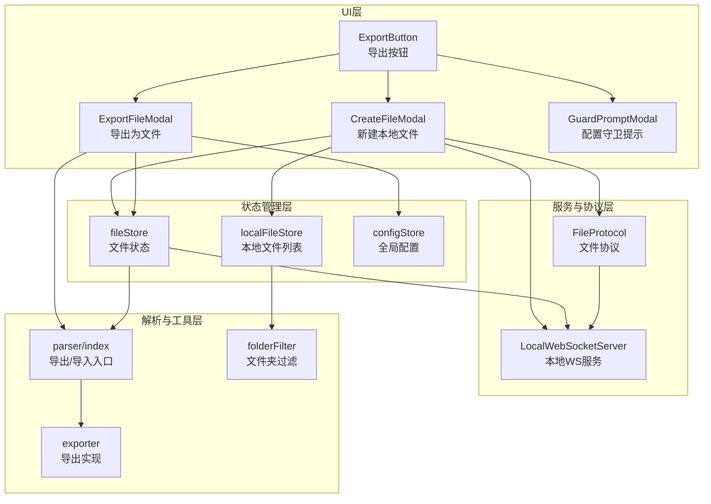
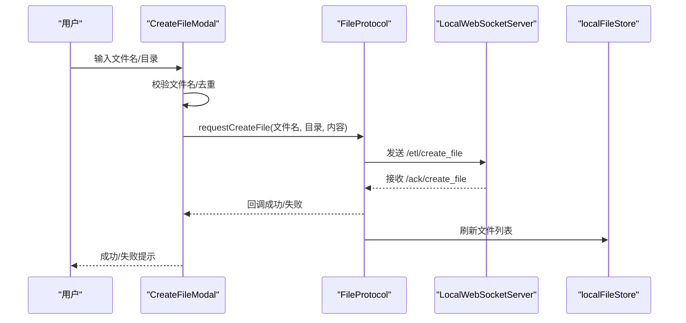
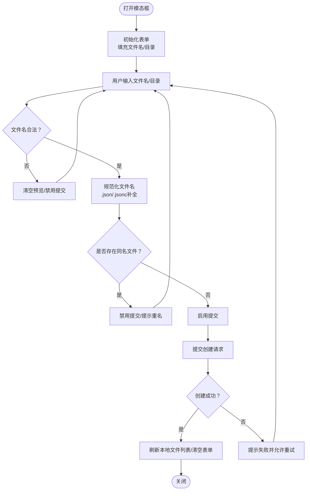
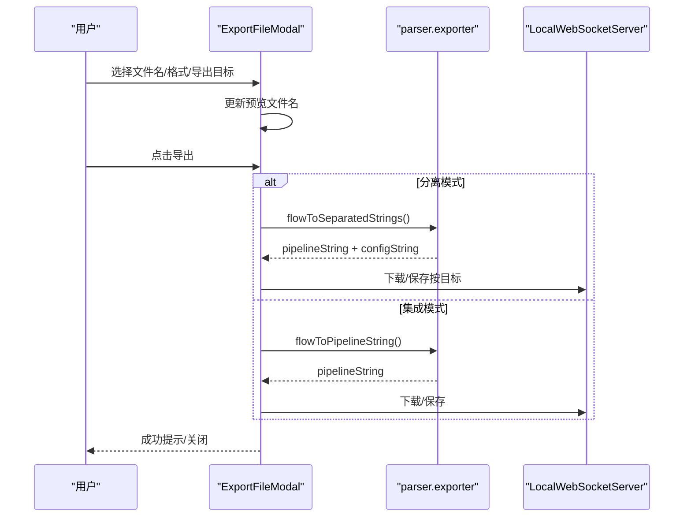
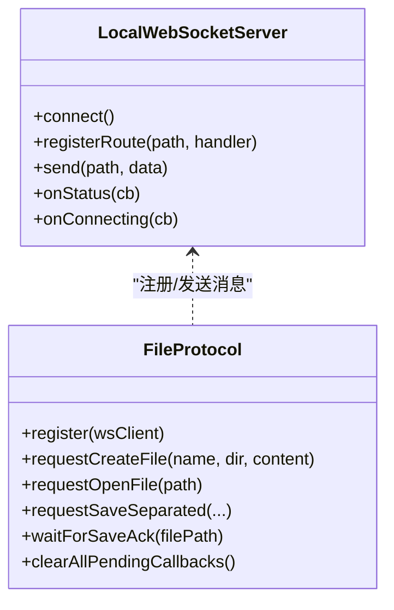
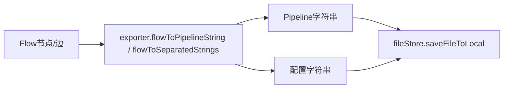
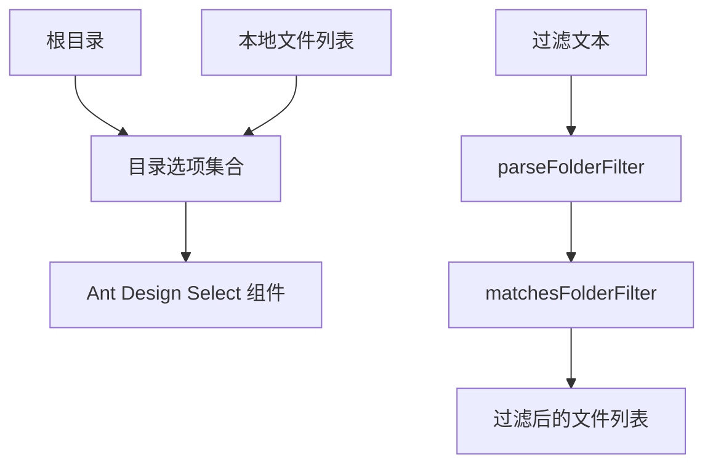
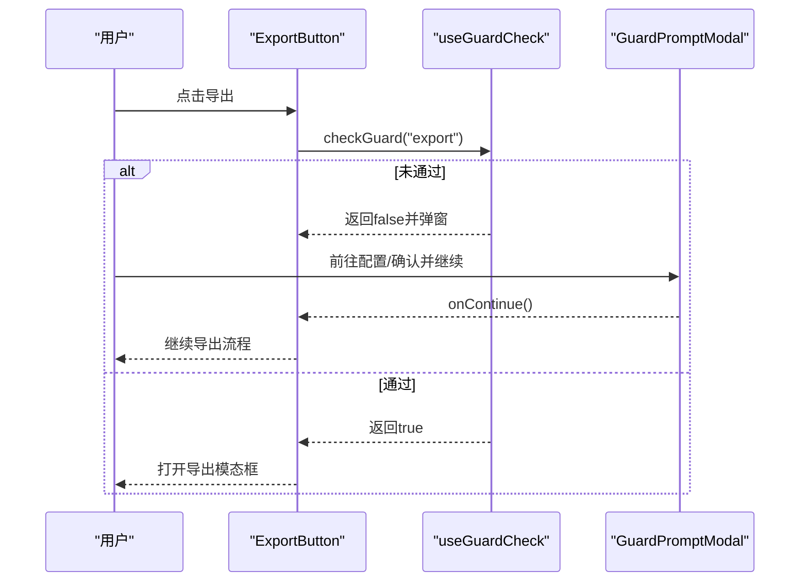
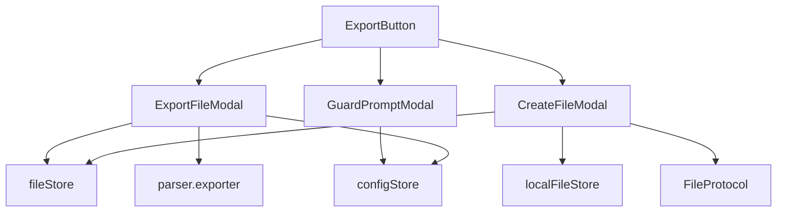

# 文件操作模态框

<cite>
**本文档引用的文件**
- [CreateFileModal.tsx](file://src/components/modals/CreateFileModal.tsx)
- [ExportFileModal.tsx](file://src/components/modals/ExportFileModal.tsx)
- [fileStore.ts](file://src/stores/fileStore.ts)
- [localFileStore.ts](file://src/stores/localFileStore.ts)
- [FileProtocol.ts](file://src/services/protocols/FileProtocol.ts)
- [server.ts](file://src/services/server.ts)
- [index.ts](file://src/core/parser/index.ts)
- [exporter.ts](file://src/core/parser/exporter.ts)
- [folderFilter.ts](file://src/utils/file/folderFilter.ts)
- [GuardPromptModal.tsx](file://src/components/modals/GuardPromptModal.tsx)
- [ExportButton.tsx](file://src/components/panels/toolbar/ExportButton.tsx)
</cite>

## 目录
1. [简介](#简介)
2. [项目结构](#项目结构)
3. [核心组件](#核心组件)
4. [架构总览](#架构总览)
5. [详细组件分析](#详细组件分析)
6. [依赖关系分析](#依赖关系分析)
7. [性能考虑](#性能考虑)
8. [故障排除指南](#故障排除指南)
9. [结论](#结论)
10. [附录](#附录)

## 简介
本文件操作模态框技术文档聚焦于“新建本地文件”和“导出为文件”两大核心模态框，涵盖文件创建、导出、配置管理、文件选择器集成、文件验证机制、安全检查与权限验证、格式验证与错误处理策略，并提供自定义与扩展实现指导以及用户体验优化与批量处理支持建议。

## 项目结构
文件操作模态框位于前端组件层，与状态管理、服务协议、解析器等模块协同工作，形成完整的文件生命周期闭环。

**图表来源**
- [CreateFileModal.tsx:1-450](file://src/components/modals/CreateFileModal.tsx#L1-L450)
- [ExportFileModal.tsx:1-302](file://src/components/modals/ExportFileModal.tsx#L1-L302)
- [fileStore.ts:1-933](file://src/stores/fileStore.ts#L1-L933)
- [localFileStore.ts:1-339](file://src/stores/localFileStore.ts#L1-L339)
- [FileProtocol.ts:1-581](file://src/services/protocols/FileProtocol.ts#L1-L581)
- [server.ts:1-388](file://src/services/server.ts#L1-L388)
- [index.ts:1-85](file://src/core/parser/index.ts#L1-L85)
- [exporter.ts:1-320](file://src/core/parser/exporter.ts#L1-L320)
- [folderFilter.ts:1-46](file://src/utils/file/folderFilter.ts#L1-L46)

**章节来源**
- [CreateFileModal.tsx:1-450](file://src/components/modals/CreateFileModal.tsx#L1-L450)
- [ExportFileModal.tsx:1-302](file://src/components/modals/ExportFileModal.tsx#L1-L302)
- [fileStore.ts:1-933](file://src/stores/fileStore.ts#L1-L933)
- [localFileStore.ts:1-339](file://src/stores/localFileStore.ts#L1-L339)
- [FileProtocol.ts:1-581](file://src/services/protocols/FileProtocol.ts#L1-L581)
- [server.ts:1-388](file://src/services/server.ts#L1-L388)
- [index.ts:1-85](file://src/core/parser/index.ts#L1-L85)
- [exporter.ts:1-320](file://src/core/parser/exporter.ts#L1-L320)
- [folderFilter.ts:1-46](file://src/utils/file/folderFilter.ts#L1-L46)

## 核心组件
- 新建本地文件模态框（CreateFileModal）：负责校验文件名合法性、检测重名、规范化文件名、调用协议创建文件并刷新本地文件列表。
- 导出为文件模态框（ExportFileModal）：负责根据配置处理模式（集成/分离）生成导出内容，支持预览文件名、格式选择、目标选择（仅Pipeline/仅配置/两者），并提供现代文件系统访问API与回退下载机制。
- 文件协议（FileProtocol）：封装与本地服务的WebSocket通信，处理文件列表、内容推送、变更通知、保存/创建确认等。
- 文件状态（fileStore）：管理当前文件、多文件集合、保存/打开/合并配置、导出/保存策略等。
- 本地文件状态（localFileStore）：维护本地文件树、资源包、图片缓存与列表，提供增量更新能力。
- 解析器（parser/exporter）：将Flow格式转换为Pipeline字符串或分离字符串，支持配置合并/拆分。
- 配置守卫（GuardPromptModal）：在关键操作前检查配置完整性，引导用户完成必要配置。

**章节来源**
- [CreateFileModal.tsx:1-450](file://src/components/modals/CreateFileModal.tsx#L1-L450)
- [ExportFileModal.tsx:1-302](file://src/components/modals/ExportFileModal.tsx#L1-L302)
- [FileProtocol.ts:1-581](file://src/services/protocols/FileProtocol.ts#L1-L581)
- [fileStore.ts:1-933](file://src/stores/fileStore.ts#L1-L933)
- [localFileStore.ts:1-339](file://src/stores/localFileStore.ts#L1-L339)
- [exporter.ts:1-320](file://src/core/parser/exporter.ts#L1-L320)
- [GuardPromptModal.tsx:1-172](file://src/components/modals/GuardPromptModal.tsx#L1-L172)

## 架构总览
文件操作模态框通过状态管理与协议层与本地服务交互，解析器负责数据格式转换，UI层提供直观的用户交互与反馈。

**图表来源**
- [CreateFileModal.tsx:218-262](file://src/components/modals/CreateFileModal.tsx#L218-L262)
- [FileProtocol.ts:353-368](file://src/services/protocols/FileProtocol.ts#L353-L368)
- [server.ts:1-388](file://src/services/server.ts#L1-L388)
- [localFileStore.ts:1-339](file://src/stores/localFileStore.ts#L1-L339)

**章节来源**
- [CreateFileModal.tsx:218-262](file://src/components/modals/CreateFileModal.tsx#L218-L262)
- [FileProtocol.ts:353-368](file://src/services/protocols/FileProtocol.ts#L353-L368)
- [server.ts:1-388](file://src/services/server.ts#L1-L388)
- [localFileStore.ts:1-339](file://src/stores/localFileStore.ts#L1-L339)

## 详细组件分析

### 新建本地文件模态框（CreateFileModal）
- 功能要点
  - 自动填充当前文件名与目录（优先当前文件所在目录，否则根目录）。
  - 文件名规范化：自动补全“.json/.jsonc”，非法字符校验，禁止包含路径分隔符与保留字符。
  - 重名检测：基于本地文件列表（大小写不敏感比较）。
  - 本地服务连接检查：未连接时阻止创建。
  - 通过协议请求创建文件，成功后刷新文件列表并清空表单。
- 关键流程
  - 表单初始化与预填
  - 文件名变更校验与预览
  - 目录变更联动重名校验
  - 提交阶段：规范化文件名、获取Flow内容、调用协议、处理结果与提示
- 错误处理
  - 未连接本地服务：提示错误
  - 重名冲突：禁用提交按钮并给出帮助信息
  - 协议调用失败：提示失败并保持表单状态以便重试

**图表来源**
- [CreateFileModal.tsx:89-131](file://src/components/modals/CreateFileModal.tsx#L89-L131)
- [CreateFileModal.tsx:134-162](file://src/components/modals/CreateFileModal.tsx#L134-L162)
- [CreateFileModal.tsx:165-181](file://src/components/modals/CreateFileModal.tsx#L165-L181)
- [CreateFileModal.tsx:218-262](file://src/components/modals/CreateFileModal.tsx#L218-L262)

**章节来源**
- [CreateFileModal.tsx:1-450](file://src/components/modals/CreateFileModal.tsx#L1-L450)

### 导出为文件模态框（ExportFileModal）
- 功能要点
  - 基于当前文件名推导默认文件名，去除“.json/.jsonc”后缀。
  - 格式选择：.json/.jsonc。
  - 分离模式下可选择导出目标：Pipeline、配置或两者。
  - 预览文件名动态更新，支持分离模式下的组合显示。
  - 现代文件系统访问API优先，失败时回退至传统下载。
- 关键流程
  - 表单初始化与默认值设置
  - 文件名/格式/目标变更联动更新预览
  - 提交阶段：根据配置处理模式生成内容，调用导出函数，成功后关闭模态框
- 错误处理
  - 导出异常捕获与日志输出
  - File System Access API异常（如用户取消）的降级处理

**图表来源**
- [ExportFileModal.tsx:31-52](file://src/components/modals/ExportFileModal.tsx#L31-L52)
- [ExportFileModal.tsx:55-91](file://src/components/modals/ExportFileModal.tsx#L55-L91)
- [ExportFileModal.tsx:102-139](file://src/components/modals/ExportFileModal.tsx#L102-L139)
- [exporter.ts:1-320](file://src/core/parser/exporter.ts#L1-L320)

**章节来源**
- [ExportFileModal.tsx:1-302](file://src/components/modals/ExportFileModal.tsx#L1-L302)
- [exporter.ts:1-320](file://src/core/parser/exporter.ts#L1-L320)

### 文件协议与本地服务（FileProtocol + LocalWebSocketServer）
- 文件协议职责
  - 注册文件列表、内容、变更推送路由
  - 注册保存/创建确认路由
  - 统一处理保存确认回调，支持超时与清理
  - 文件变更时弹窗提示或自动重载（受配置控制）
- 本地服务连接
  - 版本握手与超时处理
  - 路由注册与消息分发
  - 连接状态监听与错误提示

**图表来源**
- [server.ts:1-388](file://src/services/server.ts#L1-L388)
- [FileProtocol.ts:1-581](file://src/services/protocols/FileProtocol.ts#L1-L581)

**章节来源**
- [FileProtocol.ts:1-581](file://src/services/protocols/FileProtocol.ts#L1-L581)
- [server.ts:1-388](file://src/services/server.ts#L1-L388)

### 文件状态与解析器（fileStore + parser）
- 文件状态
  - 管理当前文件、多文件集合、节点顺序、视口位置等
  - 保存/打开/合并配置、保存到本地（集成/分离模式）、打开本地文件
- 解析器
  - Flow到Pipeline对象/字符串转换
  - 分离模式导出：同时生成Pipeline与配置字符串
  - 节点/边排序、去重、坐标序列化等

**图表来源**
- [fileStore.ts:663-800](file://src/stores/fileStore.ts#L663-L800)
- [exporter.ts:44-200](file://src/core/parser/exporter.ts#L44-L200)
- [index.ts:19-26](file://src/core/parser/index.ts#L19-L26)

**章节来源**
- [fileStore.ts:663-800](file://src/stores/fileStore.ts#L663-L800)
- [exporter.ts:44-200](file://src/core/parser/exporter.ts#L44-L200)
- [index.ts:19-26](file://src/core/parser/index.ts#L19-L26)

### 文件选择器与目录集成（localFileStore + folderFilter）
- 目录选择器
  - 基于本地文件根路径与文件列表生成目录选项
  - 支持根目录标识与相对路径显示
  - 无目录时提示“暂无可用目录，请先连接本地服务”
- 文件夹过滤
  - 支持多种分隔符的过滤文本解析
  - 相对路径标准化与前缀匹配

**图表来源**
- [localFileStore.ts:33-51](file://src/stores/localFileStore.ts#L33-L51)
- [localFileStore.ts:149-156](file://src/stores/localFileStore.ts#L149-L156)
- [folderFilter.ts:16-45](file://src/utils/file/folderFilter.ts#L16-L45)

**章节来源**
- [localFileStore.ts:1-339](file://src/stores/localFileStore.ts#L1-L339)
- [folderFilter.ts:1-46](file://src/utils/file/folderFilter.ts#L1-L46)

### 配置守卫与权限检查（GuardPromptModal + ExportButton）
- 配置守卫
  - 异步检查未配置项，弹窗引导用户前往设置或继续
  - 支持标记为已配置，避免重复提示
- 导出按钮集成
  - 在导出前触发守卫检查，阻塞或放行
  - 与模态框组合使用，确保关键操作前具备必要配置

**图表来源**
- [GuardPromptModal.tsx:138-171](file://src/components/modals/GuardPromptModal.tsx#L138-L171)
- [ExportButton.tsx:322-361](file://src/components/panels/toolbar/ExportButton.tsx#L322-L361)

**章节来源**
- [GuardPromptModal.tsx:1-172](file://src/components/modals/GuardPromptModal.tsx#L1-L172)
- [ExportButton.tsx:322-361](file://src/components/panels/toolbar/ExportButton.tsx#L322-L361)

## 依赖关系分析
- 组件耦合
  - CreateFileModal 与 ExportFileModal 均依赖 fileStore、configStore、parser 与协议层
  - GuardPromptModal 作为横切关注点，通过 hook 与导出流程解耦
- 外部依赖
  - Ant Design 表单与模态框组件
  - 浏览器 File System Access API（可选）
  - WebSocket 本地服务通信

**图表来源**
- [CreateFileModal.tsx:1-450](file://src/components/modals/CreateFileModal.tsx#L1-L450)
- [ExportFileModal.tsx:1-302](file://src/components/modals/ExportFileModal.tsx#L1-L302)
- [fileStore.ts:1-933](file://src/stores/fileStore.ts#L1-L933)
- [localFileStore.ts:1-339](file://src/stores/localFileStore.ts#L1-L339)
- [FileProtocol.ts:1-581](file://src/services/protocols/FileProtocol.ts#L1-L581)
- [GuardPromptModal.tsx:1-172](file://src/components/modals/GuardPromptModal.tsx#L1-L172)
- [ExportButton.tsx:322-361](file://src/components/panels/toolbar/ExportButton.tsx#L322-L361)

**章节来源**
- [CreateFileModal.tsx:1-450](file://src/components/modals/CreateFileModal.tsx#L1-L450)
- [ExportFileModal.tsx:1-302](file://src/components/modals/ExportFileModal.tsx#L1-L302)
- [fileStore.ts:1-933](file://src/stores/fileStore.ts#L1-L933)
- [localFileStore.ts:1-339](file://src/stores/localFileStore.ts#L1-L339)
- [FileProtocol.ts:1-581](file://src/services/protocols/FileProtocol.ts#L1-L581)
- [GuardPromptModal.tsx:1-172](file://src/components/modals/GuardPromptModal.tsx#L1-L172)
- [ExportButton.tsx:322-361](file://src/components/panels/toolbar/ExportButton.tsx#L322-L361)

## 性能考虑
- 导出性能
  - 分离模式导出需生成两份字符串，注意大文件场景的内存占用与渲染阻塞
  - 采用现代文件系统访问API可减少内存拷贝，提升下载体验
- 本地文件列表
  - 目录选项基于本地文件列表构建，建议在大量文件场景下启用过滤与懒加载
- 保存确认机制
  - 保存确认回调带有超时控制，避免长时间挂起；合理设置超时阈值

[本节为通用指导，无需特定文件分析]

## 故障排除指南
- 未连接本地服务
  - 现象：新建文件/保存失败，提示未连接
  - 处理：检查本地服务运行状态与端口配置，确保协议版本匹配
- 文件名非法或重名
  - 现象：提交按钮禁用，提示非法字符或重名
  - 处理：修正文件名（仅支持.json/.jsonc，且不含非法字符），或更换目录
- 导出失败或浏览器降级
  - 现象：File System Access API异常导致回退下载
  - 处理：确认浏览器支持与权限，或手动保存下载文件
- 文件变更冲突
  - 现象：弹出“文件已被外部修改”提示
  - 处理：选择“自动重载”或“重新加载”，或稍后处理

**章节来源**
- [CreateFileModal.tsx:223-232](file://src/components/modals/CreateFileModal.tsx#L223-L232)
- [ExportFileModal.tsx:173-178](file://src/components/modals/ExportFileModal.tsx#L173-L178)
- [FileProtocol.ts:408-511](file://src/services/protocols/FileProtocol.ts#L408-L511)

## 结论
文件操作模态框通过清晰的职责划分与完善的错误处理机制，实现了从UI交互到本地服务通信的完整闭环。新建与导出流程分别针对“创建文件”和“导出内容”的不同需求进行了针对性设计，结合配置守卫与文件系统访问API，既保证了安全性与易用性，也为未来扩展（如批量处理、更多格式支持）提供了良好基础。

[本节为总结性内容，无需特定文件分析]

## 附录

### 文件格式验证与错误处理策略
- 文件名验证
  - 非法字符过滤：禁止包含路径分隔符与保留字符
  - 后缀要求：必须为.json或.jsonc，未带后缀时自动补全
- 重名检测
  - 基于本地文件列表进行大小写不敏感匹配
- 导出格式
  - 支持 .json 与 .jsonc，分离模式下可选择导出目标
- 错误处理
  - 本地服务不可用：提示并阻断操作
  - 导出异常：捕获并记录，必要时回退下载
  - 保存确认：超时与清理机制保障稳定性

**章节来源**
- [CreateFileModal.tsx:149-162](file://src/components/modals/CreateFileModal.tsx#L149-L162)
- [CreateFileModal.tsx:165-181](file://src/components/modals/CreateFileModal.tsx#L165-L181)
- [ExportFileModal.tsx:94-100](file://src/components/modals/ExportFileModal.tsx#L94-L100)
- [ExportFileModal.tsx:142-188](file://src/components/modals/ExportFileModal.tsx#L142-L188)

### 用户体验优化与批量处理支持建议
- 用户体验优化
  - 预览文件名即时更新，减少用户试错成本
  - 提示信息明确，区分“稍后处理/自动重载/重新加载”等选项
  - 目录选择器支持根目录标识与相对路径显示
- 批量处理支持建议
  - 导出：在导出模态框中增加“批量导出”选项，结合文件夹过滤与选择器
  - 创建：在新建模态框中支持“批量创建”（基于模板/脚本），并提供进度反馈
  - 本地文件列表：支持多选与批量操作（删除/重命名/刷新）

[本节为概念性建议，无需特定文件分析]