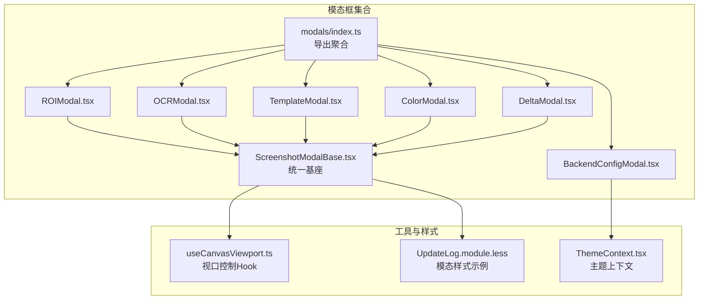
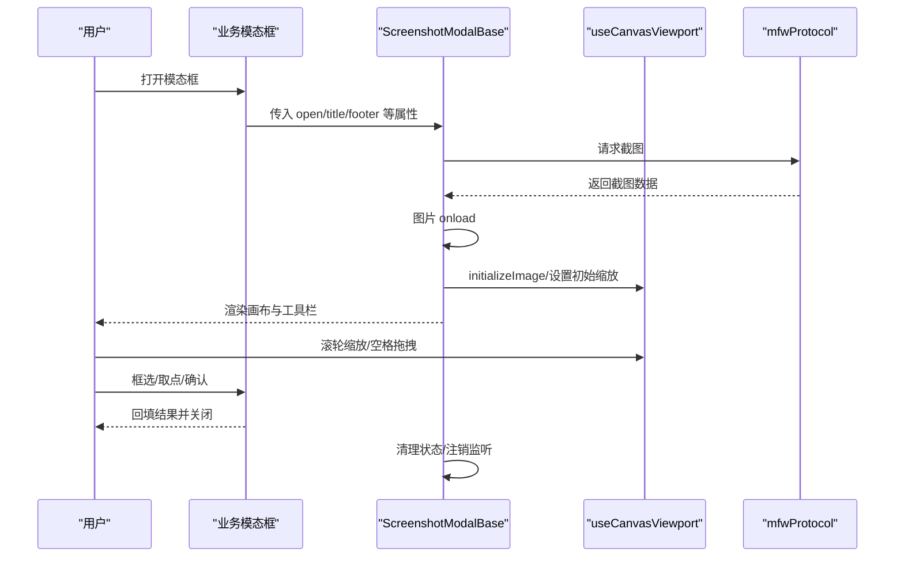
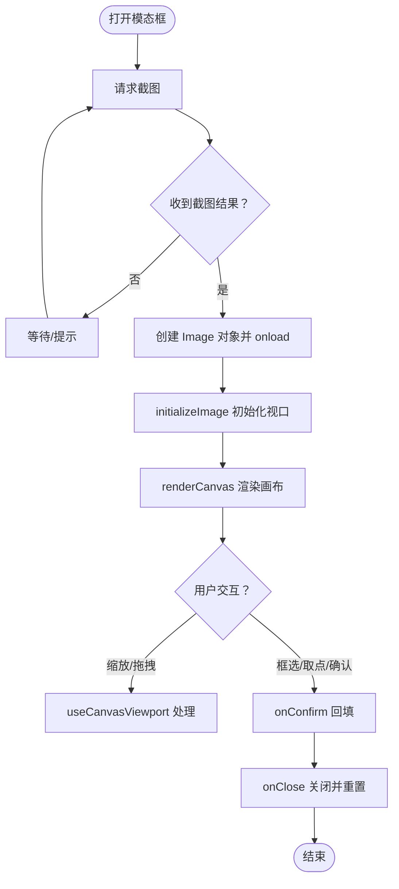
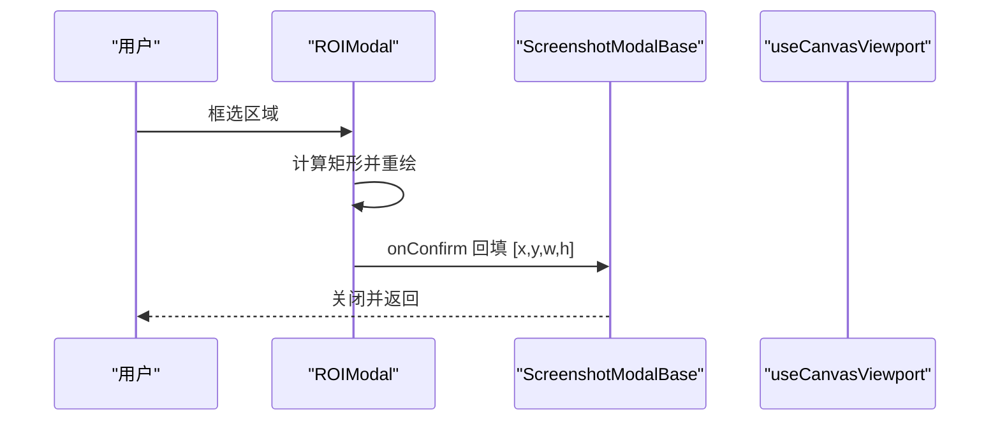
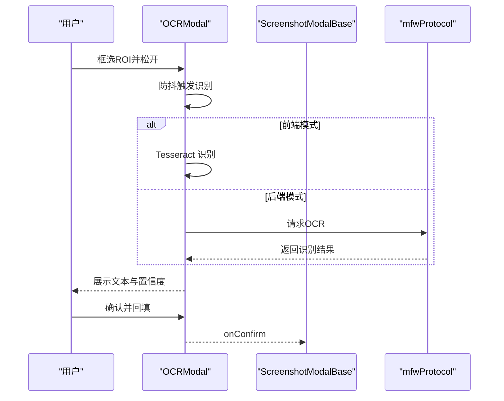
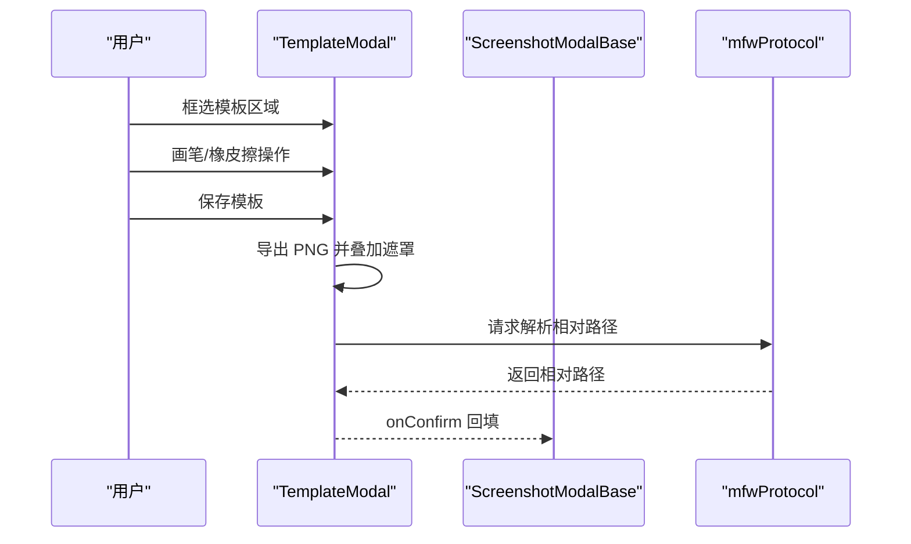
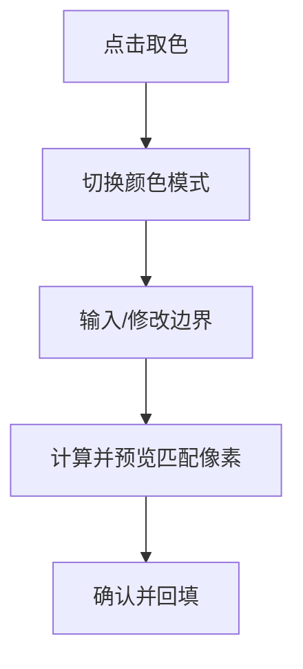
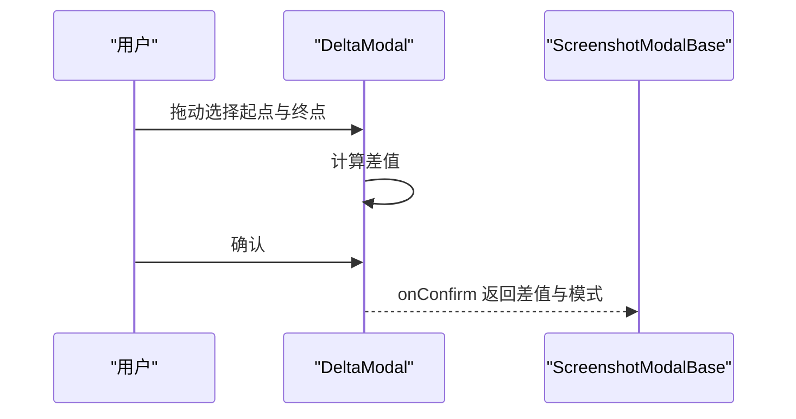
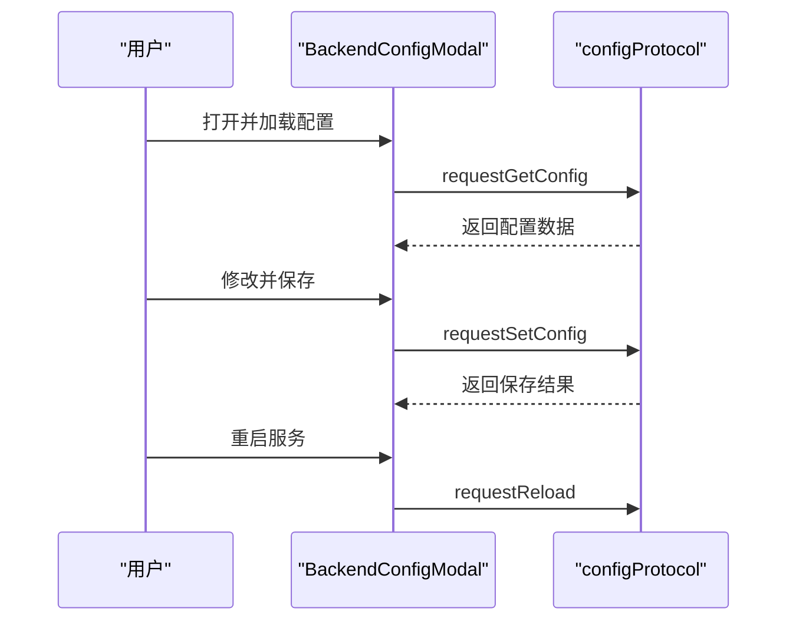
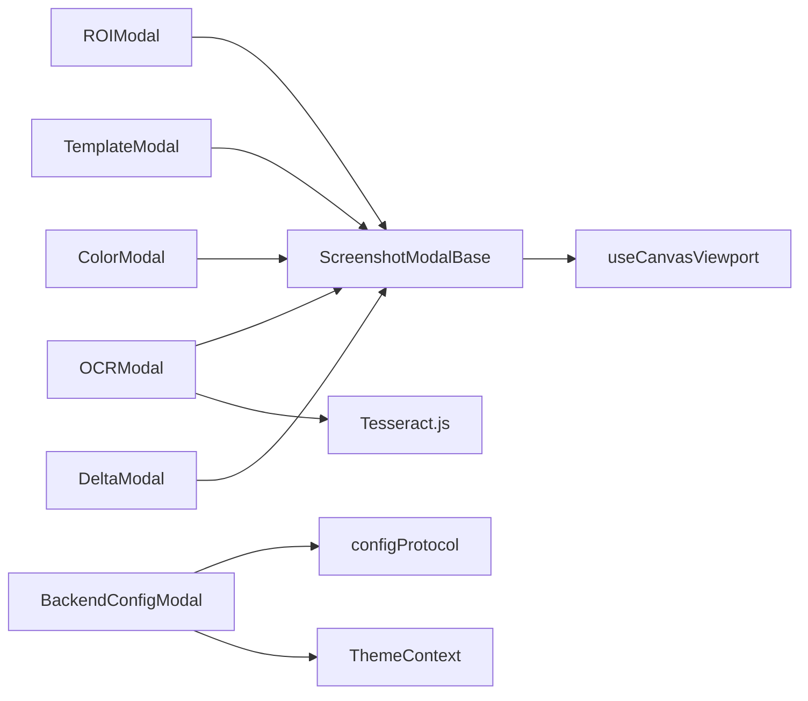

# 模态框与对话框

<cite>
**本文引用的文件**
- [src/components/modals/index.ts](file://src/components/modals/index.ts)
- [src/components/modals/ScreenshotModalBase.tsx](file://src/components/modals/ScreenshotModalBase.tsx)
- [src/components/modals/ROIModal.tsx](file://src/components/modals/ROIModal.tsx)
- [src/components/modals/OCRModal.tsx](file://src/components/modals/OCRModal.tsx)
- [src/components/modals/TemplateModal.tsx](file://src/components/modals/TemplateModal.tsx)
- [src/components/modals/ColorModal.tsx](file://src/components/modals/ColorModal.tsx)
- [src/components/modals/DeltaModal.tsx](file://src/components/modals/DeltaModal.tsx)
- [src/components/modals/BackendConfigModal.tsx](file://src/components/modals/BackendConfigModal.tsx)
- [src/hooks/useCanvasViewport.ts](file://src/hooks/useCanvasViewport.ts)
- [src/styles/modals/UpdateLog.module.less](file://src/styles/modals/UpdateLog.module.less)
- [src/contexts/ThemeContext.tsx](file://src/contexts/ThemeContext.tsx)
- [dev/instructions/ant-design/blog/modal-hook-order.zh-CN.md](file://dev/instructions/ant-design/blog/modal-hook-order.zh-CN.md)
</cite>

## 目录
1. [简介](#简介)
2. [项目结构](#项目结构)
3. [核心组件](#核心组件)
4. [架构总览](#架构总览)
5. [详细组件分析](#详细组件分析)
6. [依赖分析](#依赖分析)
7. [性能考虑](#性能考虑)
8. [故障排除指南](#故障排除指南)
9. [结论](#结论)
10. [附录](#附录)

## 简介
本文件系统性梳理本仓库中的模态框与对话框体系，覆盖以下方面：
- 设计模式与实现原理：基于统一基座的“截图 + 画布 + 工具栏”三段式结构，结合视口控制 Hook 实现缩放与拖拽。
- 状态管理与生命周期：集中于截图请求、图像加载、画布渲染、状态重置与卸载清理。
- 层级关系与遮罩处理：统一使用 Ant Design Modal，遵循 Portal 渲染与上下文注入顺序。
- 动画与过渡：基于 Ant Design 动画系统，结合容器滚动与布局自适应。
- 可访问性与键盘导航：空格键拖拽、滚轮缩放、焦点管理与无障碍标签。
- 开发与自定义指南：如何基于 ScreenshotModalBase 快速扩展新模态框。

## 项目结构
模态框相关代码主要位于 src/components/modals 目录，配合通用视口控制 Hook 与样式模块：
- 统一入口导出：modals/index.ts
- 基础组件：ScreenshotModalBase.tsx
- 典型业务模态框：ROIModal、OCRModal、TemplateModal、ColorModal、DeltaModal、BackendConfigModal
- 视口控制：useCanvasViewport.ts
- 样式：modals/*.module.less
- 主题上下文：ThemeContext.tsx



图表来源
- [src/components/modals/index.ts:1-8](file://src/components/modals/index.ts#L1-L8)
- [src/components/modals/ScreenshotModalBase.tsx:1-405](file://src/components/modals/ScreenshotModalBase.tsx#L1-L405)
- [src/hooks/useCanvasViewport.ts:1-307](file://src/hooks/useCanvasViewport.ts#L1-L307)
- [src/contexts/ThemeContext.tsx:1-68](file://src/contexts/ThemeContext.tsx#L1-L68)
- [src/styles/modals/UpdateLog.module.less:1-301](file://src/styles/modals/UpdateLog.module.less#L1-L301)

章节来源
- [src/components/modals/index.ts:1-8](file://src/components/modals/index.ts#L1-L8)
- [src/components/modals/ScreenshotModalBase.tsx:1-405](file://src/components/modals/ScreenshotModalBase.tsx#L1-L405)
- [src/hooks/useCanvasViewport.ts:1-307](file://src/hooks/useCanvasViewport.ts#L1-L307)
- [src/styles/modals/UpdateLog.module.less:1-301](file://src/styles/modals/UpdateLog.module.less#L1-L301)
- [src/contexts/ThemeContext.tsx:1-68](file://src/contexts/ThemeContext.tsx#L1-L68)

## 核心组件
- ScreenshotModalBase：提供统一的截图获取、画布渲染、工具栏与参数面板布局，以及确认/取消流程。
- useCanvasViewport：封装缩放、平移、空格键拖拽、滚轮缩放、居中适配等视口控制逻辑。
- 各业务模态框：在 ScreenshotModalBase 基础上扩展具体功能（如 ROI 选取、OCR 识别、模板编辑、颜色取点、位移差值、后端配置）。

关键职责与交互
- 生命周期：打开时请求截图、加载图片、初始化视口；关闭时重置状态、清理回调。
- 数据流：截图数据 → 图像对象 → 画布渲染 → 用户交互（拖拽/缩放/取点/框选）→ 回填结果。
- 事件链：截图结果监听 → 图片 onload → 触发渲染回调 → 业务逻辑处理。

章节来源
- [src/components/modals/ScreenshotModalBase.tsx:78-405](file://src/components/modals/ScreenshotModalBase.tsx#L78-L405)
- [src/hooks/useCanvasViewport.ts:69-307](file://src/hooks/useCanvasViewport.ts#L69-L307)

## 架构总览
模态框系统采用“基座 + 业务扩展”的分层架构：
- 基座层：统一的 Modal 容器、截图获取、画布渲染、工具栏与参数面板布局。
- 控制层：视口控制 Hook 提供跨模态框一致的交互体验。
- 业务层：各业务模态框在基座之上实现差异化 UI 与逻辑。
- 通信层：通过协议（如 mfwProtocol）与后端交互，接收结果并驱动 UI 更新。



图表来源
- [src/components/modals/ScreenshotModalBase.tsx:124-196](file://src/components/modals/ScreenshotModalBase.tsx#L124-L196)
- [src/hooks/useCanvasViewport.ts:189-215](file://src/hooks/useCanvasViewport.ts#L189-L215)
- [src/components/modals/ROIModal.tsx:218-232](file://src/components/modals/ROIModal.tsx#L218-L232)
- [src/components/modals/OCRModal.tsx:285-294](file://src/components/modals/OCRModal.tsx#L285-L294)
- [src/components/modals/TemplateModal.tsx:498-512](file://src/components/modals/TemplateModal.tsx#L498-L512)

## 详细组件分析

### ScreenshotModalBase 基座组件
- 统一布局：左右分栏（截图显示区 + 参数配置区），底部操作区。
- 截图与加载：请求截图、监听结果、图片加载完成回调。
- 视口控制：集成 useCanvasViewport，提供缩放、平移、居中、滚轮缩放。
- 工具栏与渲染：通过 renderToolbar 与 renderCanvas 注入自定义 UI。
- 确认与重置：onConfirm、onReset、onClose 流程清晰。



图表来源
- [src/components/modals/ScreenshotModalBase.tsx:124-196](file://src/components/modals/ScreenshotModalBase.tsx#L124-L196)
- [src/hooks/useCanvasViewport.ts:189-215](file://src/hooks/useCanvasViewport.ts#L189-L215)

章节来源
- [src/components/modals/ScreenshotModalBase.tsx:78-405](file://src/components/modals/ScreenshotModalBase.tsx#L78-L405)

### ROI 区域配置模态框（ROIModal）
- 功能：在截图上框选 ROI，支持负数坐标解析与可视化。
- 交互：鼠标框选、实时绘制、输入框联动、坐标提示与负数坐标说明。
- 输出：标准化 [x, y, w, h] 返回给调用方。



图表来源
- [src/components/modals/ROIModal.tsx:218-232](file://src/components/modals/ROIModal.tsx#L218-L232)
- [src/components/modals/ROIModal.tsx:46-121](file://src/components/modals/ROIModal.tsx#L46-L121)

章节来源
- [src/components/modals/ROIModal.tsx:20-564](file://src/components/modals/ROIModal.tsx#L20-L564)

### OCR 文字识别模态框（OCRModal）
- 功能：前端（Tesseract.js）与后端（MaaFramework）双模式识别，支持防抖与结果展示。
- 交互：框选 ROI 后自动触发识别，支持模式切换与坐标输入。
- 错误处理：针对资源未配置、加载失败等场景给出详细提示。



图表来源
- [src/components/modals/OCRModal.tsx:98-258](file://src/components/modals/OCRModal.tsx#L98-L258)
- [src/components/modals/OCRModal.tsx:261-294](file://src/components/modals/OCRModal.tsx#L261-L294)
- [src/components/modals/OCRModal.tsx:296-366](file://src/components/modals/OCRModal.tsx#L296-L366)

章节来源
- [src/components/modals/OCRModal.tsx:56-1104](file://src/components/modals/OCRModal.tsx#L56-L1104)

### 模板图片编辑模态框（TemplateModal）
- 功能：在截图上框选模板区域，支持画笔/橡皮擦遮罩，导出 PNG 并请求后端解析相对路径。
- 交互：工具栏切换、画笔大小调节、遮罩叠加、清空遮罩、保存模板。
- 输出：模板路径、绿色遮罩标记、ROI。



图表来源
- [src/components/modals/TemplateModal.tsx:380-496](file://src/components/modals/TemplateModal.tsx#L380-L496)
- [src/components/modals/TemplateModal.tsx:80-101](file://src/components/modals/TemplateModal.tsx#L80-L101)

章节来源
- [src/components/modals/TemplateModal.tsx:40-991](file://src/components/modals/TemplateModal.tsx#L40-L991)

### 颜色取点与范围预览模态框（ColorModal）
- 功能：RGB/HSV/GRAY 三种模式，取点后自动填入对应边界，支持颜色范围预览与像素匹配统计。
- 交互：点击取色、模式切换、边界输入、预览开关、清空预览。
- 输出：所选颜色值（按模式编码）。



图表来源
- [src/components/modals/ColorModal.tsx:347-394](file://src/components/modals/ColorModal.tsx#L347-L394)
- [src/components/modals/ColorModal.tsx:427-475](file://src/components/modals/ColorModal.tsx#L427-L475)

章节来源
- [src/components/modals/ColorModal.tsx:23-972](file://src/components/modals/ColorModal.tsx#L23-L972)

### 位移差值配置模态框（DeltaModal）
- 功能：在截图上选择起点与终点，计算 dx/dy 差值并展示。
- 交互：拖动选择、手动输入坐标、模式切换（dx/dy）。
- 输出：差值与模式。



图表来源
- [src/components/modals/DeltaModal.tsx:116-180](file://src/components/modals/DeltaModal.tsx#L116-L180)
- [src/components/modals/DeltaModal.tsx:208-217](file://src/components/modals/DeltaModal.tsx#L208-L217)

章节来源
- [src/components/modals/DeltaModal.tsx:22-401](file://src/components/modals/DeltaModal.tsx#L22-L401)

### 后端配置模态框（BackendConfigModal）
- 功能：本地服务配置项的增删改查与重载，支持与 Extremer 环境同步。
- 交互：表单校验、保存、刷新、重启服务、自动重载提示。
- 输出：配置变更与重载状态反馈。



图表来源
- [src/components/modals/BackendConfigModal.tsx:46-118](file://src/components/modals/BackendConfigModal.tsx#L46-L118)
- [src/components/modals/BackendConfigModal.tsx:130-183](file://src/components/modals/BackendConfigModal.tsx#L130-L183)
- [src/components/modals/BackendConfigModal.tsx:185-203](file://src/components/modals/BackendConfigModal.tsx#L185-L203)

章节来源
- [src/components/modals/BackendConfigModal.tsx:38-480](file://src/components/modals/BackendConfigModal.tsx#L38-L480)

### 视口控制 Hook（useCanvasViewport）
- 能力：缩放（滚轮/按钮）、平移（空格/中键）、居中适配、初始缩放计算、光标状态反馈。
- 约束：缩放范围限制、容器内边距适配、拖拽状态管理。

```mermaid
classDiagram
class UseCanvasViewportReturn {
+scale : number
+panOffset : {x, y}
+isPanning : boolean
+isSpacePressed : boolean
+isMiddleMouseDown : boolean
+handleZoomIn()
+handleZoomOut()
+handleZoomReset()
+startPan(clientX, clientY, isMiddleButton)
+updatePan(clientX, clientY)
+endPan()
+initializeImage(img)
+resetViewport()
+getBaseCursorStyle()
}
```

图表来源
- [src/hooks/useCanvasViewport.ts:26-63](file://src/hooks/useCanvasViewport.ts#L26-L63)

章节来源
- [src/hooks/useCanvasViewport.ts:69-307](file://src/hooks/useCanvasViewport.ts#L69-L307)

## 依赖分析
- 组件耦合
  - 业务模态框均依赖 ScreenshotModalBase 与 useCanvasViewport，形成高内聚低耦合。
  - BackendConfigModal 独立于截图流程，直接依赖配置协议。
- 外部依赖
  - Ant Design Modal/组件与样式系统。
  - Dark Reader 主题切换。
  - Tesseract.js（前端 OCR）。
  - mfwProtocol/configProtocol（后端通信）。



图表来源
- [src/components/modals/ROIModal.tsx:1-12](file://src/components/modals/ROIModal.tsx#L1-L12)
- [src/components/modals/OCRModal.tsx:18-28](file://src/components/modals/OCRModal.tsx#L18-L28)
- [src/components/modals/TemplateModal.tsx:21-25](file://src/components/modals/TemplateModal.tsx#L21-L25)
- [src/components/modals/ColorModal.tsx:1-7](file://src/components/modals/ColorModal.tsx#L1-L7)
- [src/components/modals/DeltaModal.tsx:1-6](file://src/components/modals/DeltaModal.tsx#L1-L6)
- [src/components/modals/BackendConfigModal.tsx:22-31](file://src/components/modals/BackendConfigModal.tsx#L22-L31)
- [src/hooks/useCanvasViewport.ts:1-2](file://src/hooks/useCanvasViewport.ts#L1-L2)
- [src/contexts/ThemeContext.tsx:2-5](file://src/contexts/ThemeContext.tsx#L2-L5)

章节来源
- [src/components/modals/index.ts:1-8](file://src/components/modals/index.ts#L1-L8)
- [src/components/modals/ScreenshotModalBase.tsx:1-14](file://src/components/modals/ScreenshotModalBase.tsx#L1-L14)
- [src/hooks/useCanvasViewport.ts:1-2](file://src/hooks/useCanvasViewport.ts#L1-L2)
- [src/contexts/ThemeContext.tsx:1-6](file://src/contexts/ThemeContext.tsx#L1-L6)

## 性能考虑
- 截图与渲染
  - 截图请求在打开时触发，避免重复请求；图片加载完成后一次性初始化视口，减少多次重排。
  - 画布重绘按需触发（坐标变化或图片加载），避免频繁重绘。
- 前端 OCR
  - Tesseract worker 复用，首次加载模型后缓存；识别结果进行后处理（去空格、去换行、去多余空白）。
- 预览与遮罩
  - 颜色范围预览使用 overlay canvas，仅在需要时计算命中像素并叠加半透明遮罩。
- 主题与样式
  - 主题切换通过 Dark Reader 动态注入，避免全量重绘；模态样式采用局部作用域类名，降低冲突风险。

## 故障排除指南
- 截图为空或加载失败
  - 检查连接状态与控制器 ID；确认截图结果回调是否注册与注销。
  - 参考：[截图请求与结果监听:124-169](file://src/components/modals/ScreenshotModalBase.tsx#L124-L169)
- 模态框内弹出位置异常（Ant Design Modal）
  - 当 contextHolder 放置在 Modal 内部时，可能出现弹出位置不正确的问题；应将其置于 Modal 外层。
  - 参考：[Modal hook 位置问题说明:10-48](file://dev/instructions/ant-design/blog/modal-hook-order.zh-CN.md#L10-L48)
- OCR 识别失败
  - 资源未配置或加载失败时，后端会返回详细错误码与排查建议；前端模式需注意模型加载耗时。
  - 参考：[OCR 错误处理与提示:296-366](file://src/components/modals/OCRModal.tsx#L296-L366)
- 颜色范围预览不准确
  - 确认颜色模式与边界通道数一致；检查像素匹配计算过程与 overlay canvas 初始化。
  - 参考：[颜色范围预览计算:233-331](file://src/components/modals/ColorModal.tsx#L233-L331)
- 模板保存失败
  - 检查浏览器 File System Access API 支持与权限；降级为传统下载方式。
  - 参考：[模板保存与路径解析:442-495](file://src/components/modals/TemplateModal.tsx#L442-L495)

章节来源
- [src/components/modals/ScreenshotModalBase.tsx:124-169](file://src/components/modals/ScreenshotModalBase.tsx#L124-L169)
- [dev/instructions/ant-design/blog/modal-hook-order.zh-CN.md:10-48](file://dev/instructions/ant-design/blog/modal-hook-order.zh-CN.md#L10-L48)
- [src/components/modals/OCRModal.tsx:296-366](file://src/components/modals/OCRModal.tsx#L296-L366)
- [src/components/modals/ColorModal.tsx:233-331](file://src/components/modals/ColorModal.tsx#L233-L331)
- [src/components/modals/TemplateModal.tsx:442-495](file://src/components/modals/TemplateModal.tsx#L442-L495)

## 结论
本模态框系统以 ScreenshotModalBase 为核心，结合 useCanvasViewport 提供一致的交互体验，并通过业务模态框实现多样化功能。系统具备良好的扩展性与可维护性，同时在性能与可访问性方面做了充分考量。建议后续持续优化：
- 统一错误处理与提示策略；
- 增强键盘导航与无障碍标签；
- 优化大图场景下的渲染性能；
- 完善模态框间的状态隔离与共享机制。

## 附录
- 开发与自定义指南
  - 基于 ScreenshotModalBase 扩展新模态框：定义 renderToolbar 与 renderCanvas，实现 onConfirm/onReset，确保在打开时请求截图并在关闭时清理状态。
  - 视口控制：复用 useCanvasViewport，按需暴露缩放/平移 API。
  - 样式：采用模块化 CSS，避免全局污染；必要时引入主题上下文。
  - 可访问性：保证键盘可达、焦点管理、语义化标签与屏幕阅读器友好。
- 参考文件
  - [模态框入口导出:1-8](file://src/components/modals/index.ts#L1-L8)
  - [基座组件:78-405](file://src/components/modals/ScreenshotModalBase.tsx#L78-L405)
  - [视口控制 Hook:69-307](file://src/hooks/useCanvasViewport.ts#L69-L307)
  - [样式示例:1-301](file://src/styles/modals/UpdateLog.module.less#L1-L301)
  - [主题上下文:1-68](file://src/contexts/ThemeContext.tsx#L1-L68)