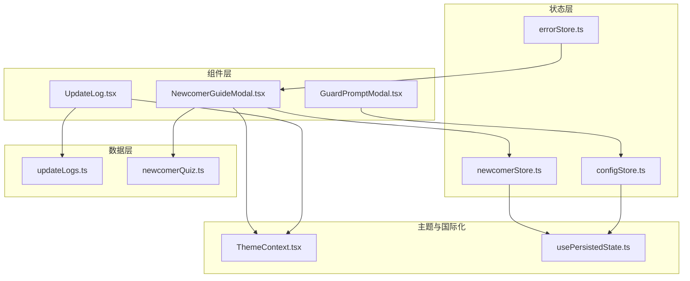
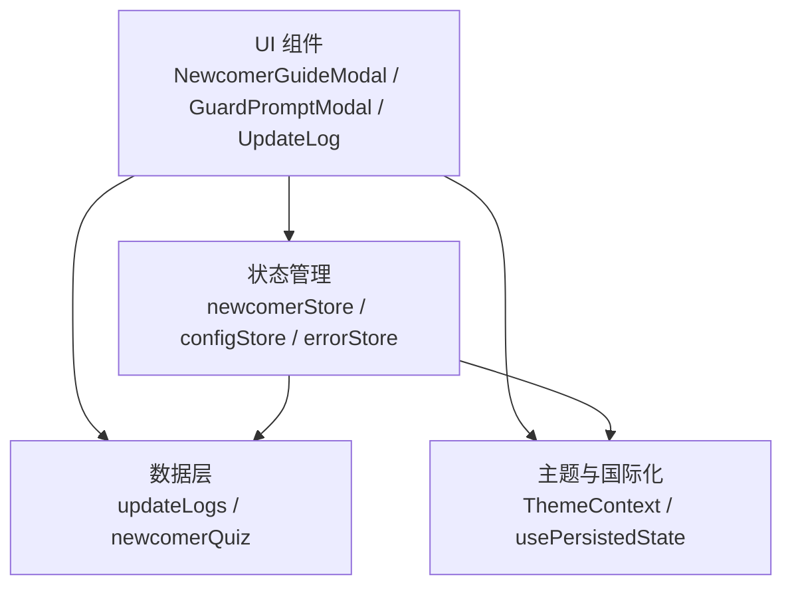
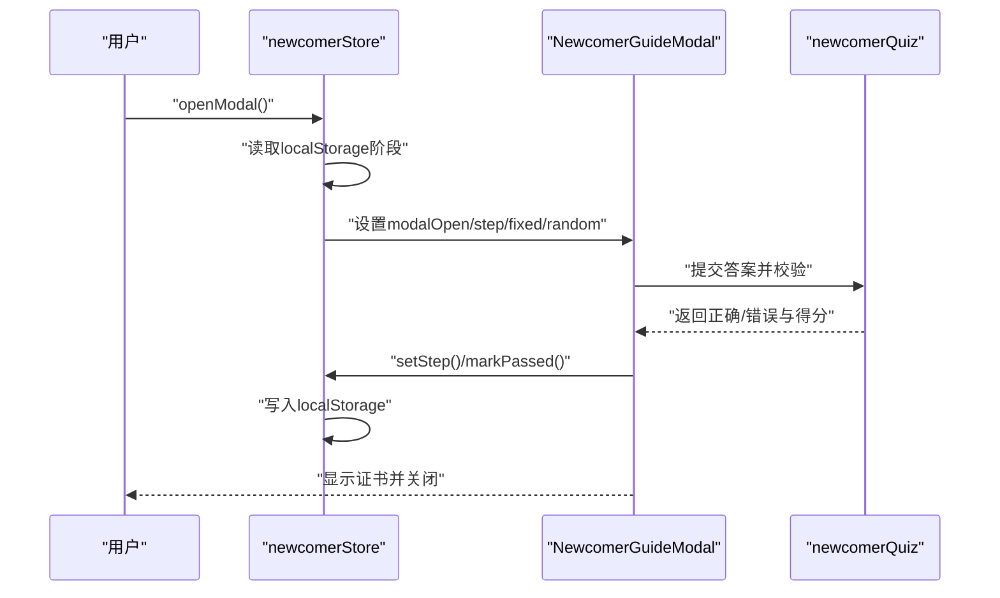
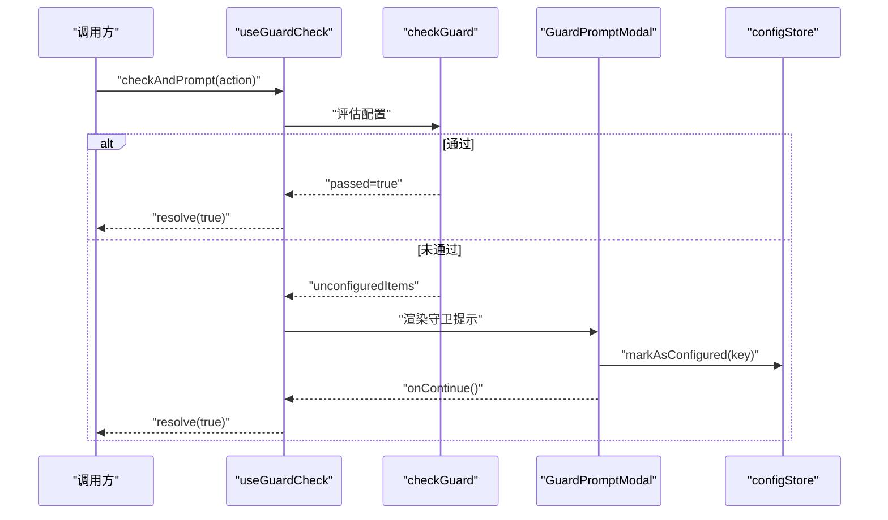
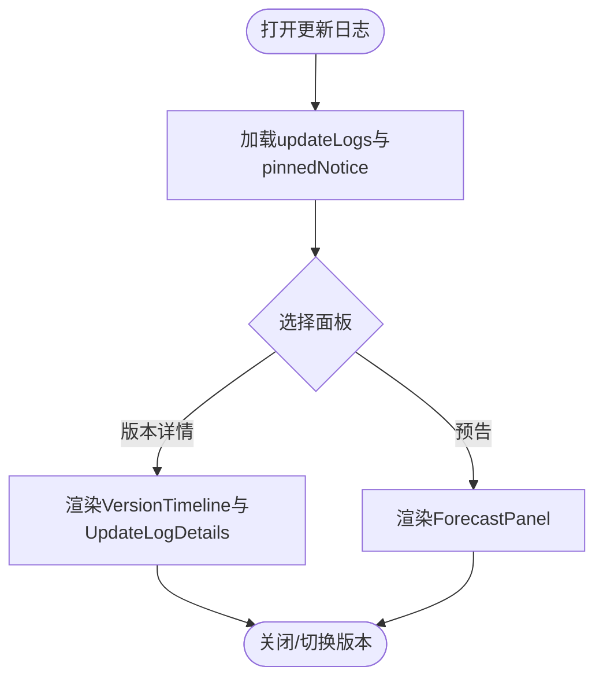
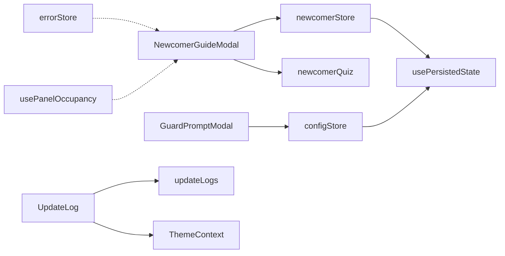

# 系统级模态框

<cite>
**本文档引用的文件**
- [NewcomerGuideModal.tsx](file://src/components/modals/NewcomerGuideModal.tsx)
- [GuardPromptModal.tsx](file://src/components/modals/GuardPromptModal.tsx)
- [UpdateLog.tsx](file://src/components/modals/UpdateLog.tsx)
- [newcomerStore.ts](file://src/stores/newcomerStore.ts)
- [configStore.ts](file://src/stores/configStore.ts)
- [updateLogs.ts](file://src/data/updateLogs.ts)
- [ThemeContext.tsx](file://src/contexts/ThemeContext.tsx)
- [usePersistedState.ts](file://src/hooks/usePersistedState.ts)
- [errorStore.ts](file://src/stores/errorStore.ts)
- [ThemeContext.tsx](file://src/contexts/ThemeContext.tsx)
- [useEmbedMode.ts](file://src/hooks/useEmbedMode.ts)
- [usePanelOccupancy.ts](file://src/hooks/usePanelOccupancy.ts)
- [3.3-ProjectInterfaceV2.md](file://dev/instructions/maafw-guide/3.3-ProjectInterfaceV2.md)
- [dialog.mdx](file://dev/instructions/wails/reference/runtime/dialog.mdx)
- [modal-hook-order.zh-CN.md](file://dev/instructions/ant-design/blog/modal-hook-order.zh-CN.md)
</cite>

## 目录
1. [简介](#简介)
2. [项目结构](#项目结构)
3. [核心组件](#核心组件)
4. [架构总览](#架构总览)
5. [详细组件分析](#详细组件分析)
6. [依赖分析](#依赖分析)
7. [性能考量](#性能考量)
8. [故障排查指南](#故障排查指南)
9. [结论](#结论)
10. [附录](#附录)

## 简介
本文件面向系统级模态框的实现与使用，覆盖安全提示、新手引导与更新日志三大类系统模态框。重点阐述：
- 触发机制与显示时机控制
- 系统消息优先级管理与用户确认流程
- 主题适配与多语言支持策略
- 配置与定制化实现指导
- 持久化存储与用户偏好处理

## 项目结构
系统级模态框主要分布在前端组件层与状态管理层：
- 组件层：位于 src/components/modals 下，分别实现新手引导、配置守卫提示、更新日志等
- 状态层：通过 zustand store 管理模态框状态、用户偏好与持久化
- 数据层：更新日志数据与新手题库等静态/动态数据
- 主题与国际化：通过 ThemeContext 与配置项实现主题适配；通过 $ 前缀约定实现国际化字符串解析

**图表来源**
- [NewcomerGuideModal.tsx:1-134](file://src/components/modals/NewcomerGuideModal.tsx#L1-L134)
- [GuardPromptModal.tsx:1-171](file://src/components/modals/GuardPromptModal.tsx#L1-L171)
- [UpdateLog.tsx:1-411](file://src/components/modals/UpdateLog.tsx#L1-L411)
- [newcomerStore.ts:1-93](file://src/stores/newcomerStore.ts#L1-L93)
- [configStore.ts:1-440](file://src/stores/configStore.ts#L1-L440)
- [updateLogs.ts:1-912](file://src/data/updateLogs.ts#L1-L912)
- [ThemeContext.tsx:1-67](file://src/contexts/ThemeContext.tsx#L1-L67)
- [usePersistedState.ts:1-36](file://src/hooks/usePersistedState.ts#L1-L36)

**章节来源**
- [NewcomerGuideModal.tsx:1-134](file://src/components/modals/NewcomerGuideModal.tsx#L1-L134)
- [GuardPromptModal.tsx:1-171](file://src/components/modals/GuardPromptModal.tsx#L1-L171)
- [UpdateLog.tsx:1-411](file://src/components/modals/UpdateLog.tsx#L1-L411)
- [newcomerStore.ts:1-93](file://src/stores/newcomerStore.ts#L1-L93)
- [configStore.ts:1-440](file://src/stores/configStore.ts#L1-L440)
- [updateLogs.ts:1-912](file://src/data/updateLogs.ts#L1-L912)
- [ThemeContext.tsx:1-67](file://src/contexts/ThemeContext.tsx#L1-L67)
- [usePersistedState.ts:1-36](file://src/hooks/usePersistedState.ts#L1-L36)

## 核心组件
- 新手引导模态框：基于 zustand store 管理步骤、答题与通关状态，结合 localStorage 实现持久化与阶段性记忆
- 配置守卫提示模态框：在关键操作前检查配置完整性，引导用户前往设置面板或继续执行
- 更新日志模态框：集中展示版本历史、预告与置顶公告，支持时间线与详情切换

**章节来源**
- [NewcomerGuideModal.tsx:40-134](file://src/components/modals/NewcomerGuideModal.tsx#L40-L134)
- [GuardPromptModal.tsx:38-171](file://src/components/modals/GuardPromptModal.tsx#L38-L171)
- [UpdateLog.tsx:316-411](file://src/components/modals/UpdateLog.tsx#L316-L411)

## 架构总览
系统级模态框遵循“组件-状态-数据-主题”的分层设计：
- 组件负责 UI 行为与交互
- 状态层负责数据与持久化
- 数据层提供静态/动态内容
- 主题层统一外观与交互体验

**图表来源**
- [NewcomerGuideModal.tsx:40-134](file://src/components/modals/NewcomerGuideModal.tsx#L40-L134)
- [GuardPromptModal.tsx:38-171](file://src/components/modals/GuardPromptModal.tsx#L38-L171)
- [UpdateLog.tsx:316-411](file://src/components/modals/UpdateLog.tsx#L316-L411)
- [newcomerStore.ts:30-73](file://src/stores/newcomerStore.ts#L30-L73)
- [configStore.ts:270-413](file://src/stores/configStore.ts#L270-L413)
- [updateLogs.ts:52-104](file://src/data/updateLogs.ts#L52-L104)
- [ThemeContext.tsx:22-55](file://src/contexts/ThemeContext.tsx#L22-L55)
- [usePersistedState.ts:9-36](file://src/hooks/usePersistedState.ts#L9-L36)

## 详细组件分析

### 新手引导模态框
- 触发与显示时机
  - 通过 newcomerStore.openModal 初始化阶段与题目集合，并根据 localStorage 恢复进度
  - 通过步骤推进与答题校验控制下一步
- 用户确认流程
  - 固定题与随机题分别校验，达到及格线后进入证书页并标记通关
- 持久化与偏好
  - 使用 localStorage 记录通关状态与阶段进度，避免重复打扰

**图表来源**
- [newcomerStore.ts:30-73](file://src/stores/newcomerStore.ts#L30-L73)
- [NewcomerGuideModal.tsx:86-112](file://src/components/modals/NewcomerGuideModal.tsx#L86-L112)
- [newcomerQuiz.ts:9-32](file://src/data/newcomerQuiz.ts#L9-L32)

**章节来源**
- [NewcomerGuideModal.tsx:40-134](file://src/components/modals/NewcomerGuideModal.tsx#L40-L134)
- [newcomerStore.ts:30-93](file://src/stores/newcomerStore.ts#L30-L93)
- [newcomerQuiz.ts:1-33](file://src/data/newcomerQuiz.ts#L1-L33)

### 配置守卫提示模态框
- 触发机制
  - 通过 useGuardCheck 返回的检查函数在操作前异步评估配置完整性
  - 若未通过，弹出守卫提示并允许用户前往设置或继续
- 用户确认流程
  - “前往配置”：打开设置面板并定位到首个未配置项所在分类
  - “确认并继续”：标记相关配置为已配置，继续执行原操作
- 与主题/状态
  - 与 configStore 状态联动，支持主题切换与配置持久化

**图表来源**
- [GuardPromptModal.tsx:138-171](file://src/components/modals/GuardPromptModal.tsx#L138-L171)
- [GuardPromptModal.tsx:38-101](file://src/components/modals/GuardPromptModal.tsx#L38-L101)
- [configStore.ts:368-379](file://src/stores/configStore.ts#L368-L379)

**章节来源**
- [GuardPromptModal.tsx:1-171](file://src/components/modals/GuardPromptModal.tsx#L1-L171)
- [configStore.ts:270-413](file://src/stores/configStore.ts#L270-L413)

### 更新日志模态框
- 展示内容
  - 置顶公告、版本时间线、分类详情与预告板块
- 交互与状态
  - 通过 selectedPanel 控制当前显示面板（版本详情或预告）
  - 支持 Markdown 链接与加粗解析
- 主题适配
  - 通过样式模块与主题上下文统一外观

**图表来源**
- [UpdateLog.tsx:316-411](file://src/components/modals/UpdateLog.tsx#L316-L411)
- [updateLogs.ts:52-104](file://src/data/updateLogs.ts#L52-L104)

**章节来源**
- [UpdateLog.tsx:1-411](file://src/components/modals/UpdateLog.tsx#L1-L411)
- [updateLogs.ts:1-912](file://src/data/updateLogs.ts#L1-L912)

### 系统消息优先级与确认流程
- 优先级机制
  - 通过 display 字段控制消息渠道：log（非阻塞）、toast（轻量通知）、notification（系统通知）、dialog（非阻塞弹窗）、modal（阻塞弹窗）
- 确认流程
  - modal 会暂停任务直至用户确认，适合需要人工干预的场景
- 与模态框的关系
  - 本项目中，系统消息的阻塞行为可通过 modal 类型实现，与系统级模态框的交互一致

**章节来源**
- [3.3-ProjectInterfaceV2.md:946-989](file://dev/instructions/maafw-guide/3.3-ProjectInterfaceV2.md#L946-L989)

### 主题适配与多语言支持
- 主题适配
  - ThemeContext 同步 useDarkMode 配置到 DarkReader，实现深色/浅色主题切换
- 多语言支持
  - 国际化字符串以 $ 开头，客户端在显示前从翻译文件解析真实值
- 模态框主题一致性
  - 模态框组件继承 Ant Design 主题体系，受 ThemeContext 影响

**章节来源**
- [ThemeContext.tsx:22-55](file://src/contexts/ThemeContext.tsx#L22-L55)
- [3.3-ProjectInterfaceV2.md:832-834](file://dev/instructions/maafw-guide/3.3-ProjectInterfaceV2.md#L832-L834)

### 配置与定制实现指导
- 配置项持久化
  - configStore 提供 setConfig/replaceConfig/markAsConfigured/resetConfig 等能力，支持加密存储与批量导入
- 自定义模态框
  - 参考现有模态框的结构：接收 open/onClose 状态，内部使用 Ant Design Modal，结合 store 管理交互
- 与嵌入模式兼容
  - useEmbedMode 提供嵌入环境能力检测与 UI 配置，定制时需考虑面板隐藏与能力限制

**章节来源**
- [configStore.ts:270-413](file://src/stores/configStore.ts#L270-L413)
- [useEmbedMode.ts:10-29](file://src/hooks/useEmbedMode.ts#L10-L29)

## 依赖分析
- 组件与状态
  - NewcomerGuideModal 依赖 newcomerStore 与 newcomerQuiz
  - GuardPromptModal 依赖 configStore 与守卫系统
  - UpdateLog 依赖 updateLogs 数据与样式模块
- 主题与国际化
  - ThemeContext 与 usePersistedState 提供主题与持久化能力
- 错误与互斥
  - errorStore 提供错误聚合与回调；usePanelOccupancy 提供面板互斥与抢占逻辑，避免模态框与面板冲突

**图表来源**
- [NewcomerGuideModal.tsx:20-26](file://src/components/modals/NewcomerGuideModal.tsx#L20-L26)
- [GuardPromptModal.tsx:3-5](file://src/components/modals/GuardPromptModal.tsx#L3-L5)
- [UpdateLog.tsx:11-22](file://src/components/modals/UpdateLog.tsx#L11-L22)
- [newcomerStore.ts:1-93](file://src/stores/newcomerStore.ts#L1-L93)
- [configStore.ts:1-440](file://src/stores/configStore.ts#L1-L440)
- [updateLogs.ts:1-912](file://src/data/updateLogs.ts#L1-L912)
- [ThemeContext.tsx:1-67](file://src/contexts/ThemeContext.tsx#L1-L67)
- [usePersistedState.ts:1-36](file://src/hooks/usePersistedState.ts#L1-L36)
- [errorStore.ts:1-39](file://src/stores/errorStore.ts#L1-L39)
- [usePanelOccupancy.ts:1-46](file://src/hooks/usePanelOccupancy.ts#L1-L46)

**章节来源**
- [errorStore.ts:1-39](file://src/stores/errorStore.ts#L1-L39)
- [usePanelOccupancy.ts:1-46](file://src/hooks/usePanelOccupancy.ts#L1-L46)

## 性能考量
- 模态框渲染
  - 使用 destroyOnHidden 等属性减少不必要的 DOM 占用
  - 对复杂列表（如更新日志时间线）采用虚拟滚动与懒加载策略
- 主题切换
  - ThemeContext 仅在 useDarkMode 变化时触发重绘，避免频繁重排
- 状态持久化
  - 通过 usePersistedState 与 configStore 的缓存机制降低重复序列化成本

[本节为通用指导，不涉及具体文件分析]

## 故障排查指南
- 模态框遮挡与定位异常
  - 避免在 Modal 内部放置 contextHolder；参考 Modal hook 顺序问题说明
- 主题不生效
  - 确认 ThemeContext 已包裹应用根节点，且 useDarkMode 配置已同步到 DarkReader
- 配置未持久化
  - 检查 configStore 的 setConfig/replaceConfig 是否正确调用，以及 localStorage 是否可用
- 新手引导重复出现
  - 检查 localStorage 中的通关与阶段键值，必要时清理或重置

**章节来源**
- [modal-hook-order.zh-CN.md:10-169](file://dev/instructions/ant-design/blog/modal-hook-order.zh-CN.md#L10-L169)
- [ThemeContext.tsx:22-55](file://src/contexts/ThemeContext.tsx#L22-L55)
- [configStore.ts:417-440](file://src/stores/configStore.ts#L417-L440)
- [newcomerStore.ts:37-72](file://src/stores/newcomerStore.ts#L37-L72)

## 结论
系统级模态框通过清晰的组件-状态-数据-主题分层，实现了安全提示、新手引导与更新日志的统一管理。借助 zustand store 与 localStorage，系统在用户体验与持久化之间取得平衡；通过 ThemeContext 与国际化约定，保证了主题一致性与多语言扩展性。未来可在复杂列表渲染与主题切换性能方面持续优化。

[本节为总结性内容，不涉及具体文件分析]

## 附录
- 与系统对话框的差异
  - 本项目使用 Ant Design 的 Modal 实现系统级模态框；Wails 的 runtime.Dialog 提供系统级对话框，适用于底层系统交互
- 嵌入模式注意事项
  - 在嵌入环境中，需根据 useEmbedMode 的能力与 UI 配置调整模态框显示策略

**章节来源**
- [dialog.mdx:123-151](file://dev/instructions/wails/reference/runtime/dialog.mdx#L123-L151)
- [useEmbedMode.ts:10-29](file://src/hooks/useEmbedMode.ts#L10-L29)