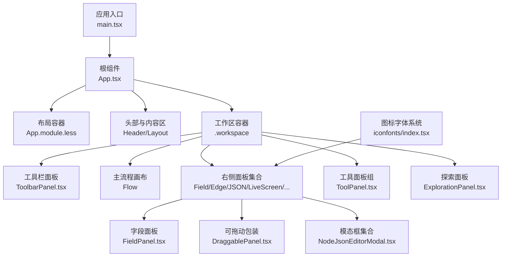
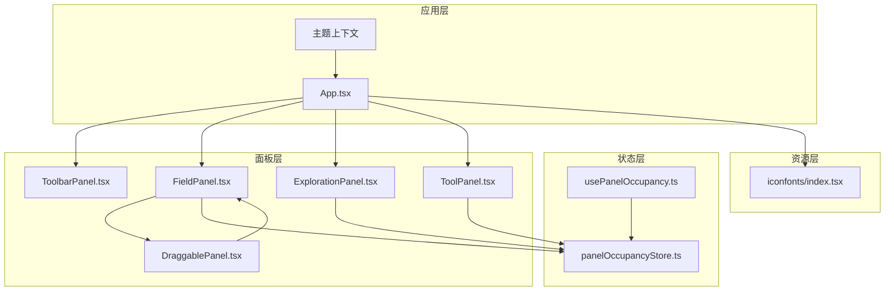
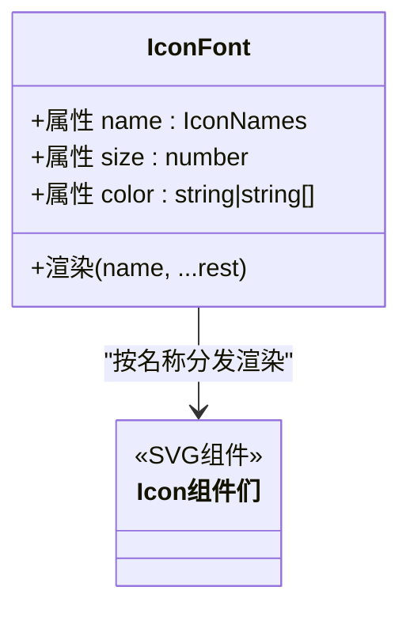
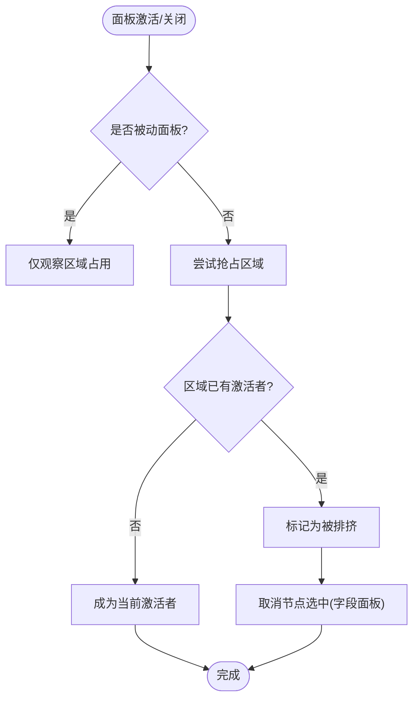
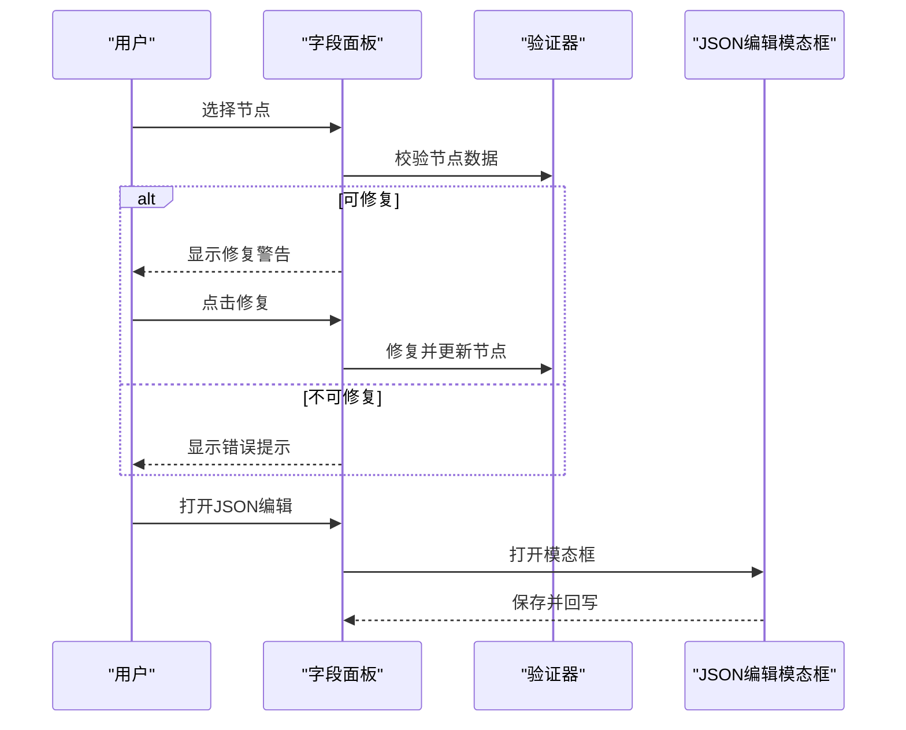
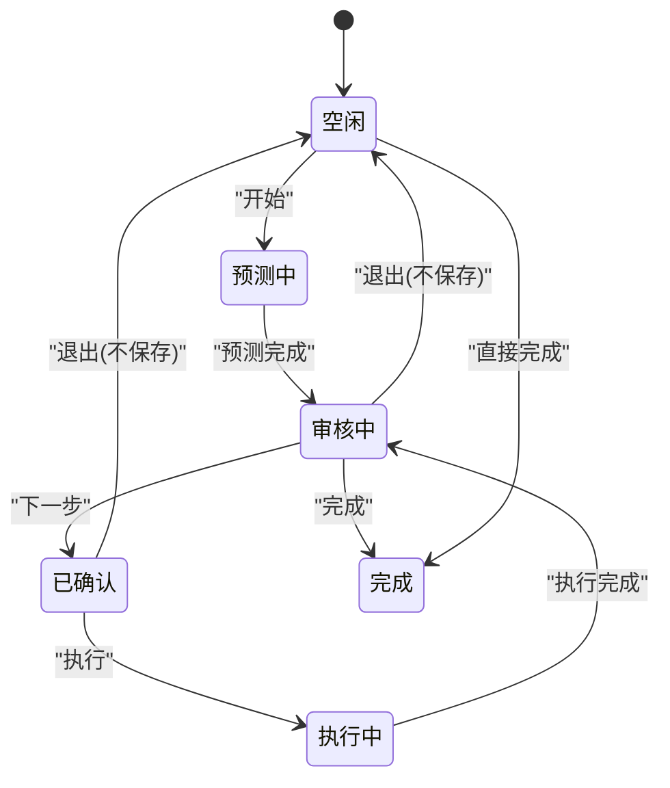
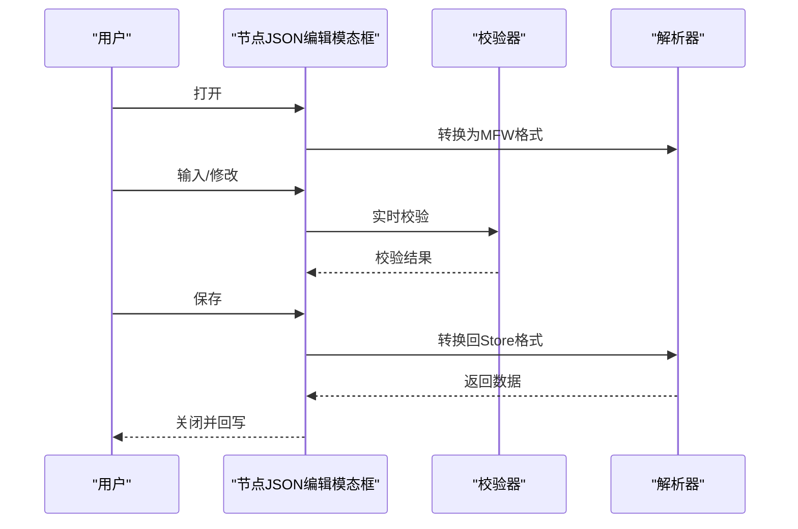
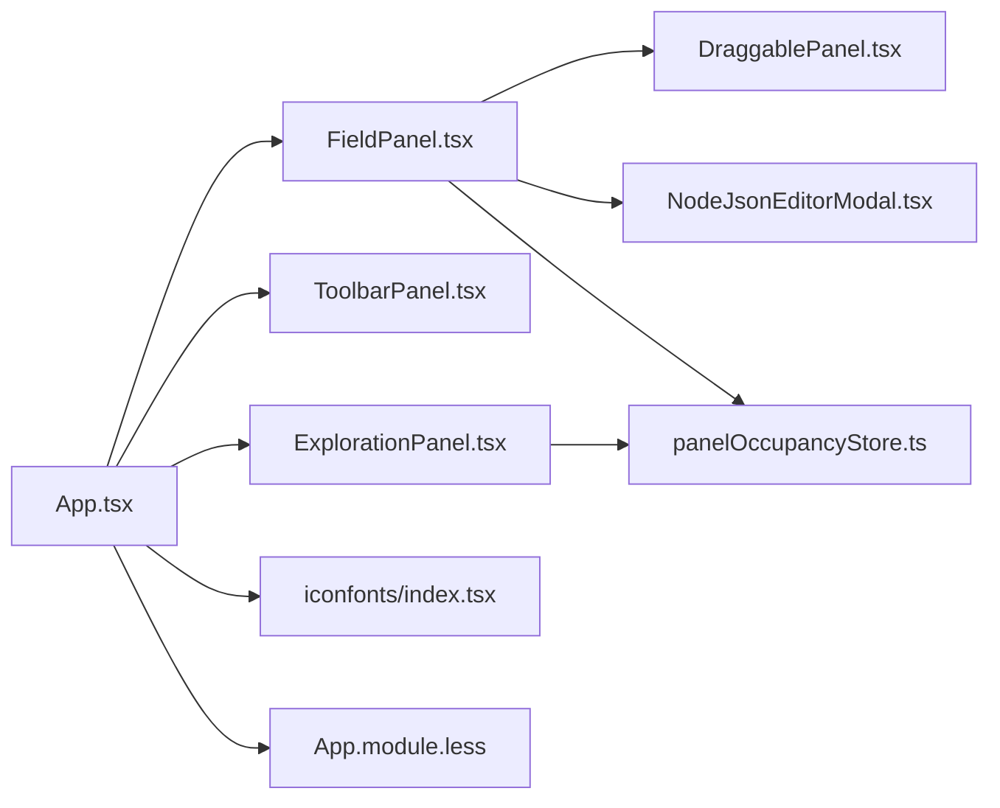

# 面板与组件

<cite>
**本文引用的文件**
- [App.tsx](file://src/App.tsx)
- [main.tsx](file://src/main.tsx)
- [index.tsx](file://src/components/iconfonts/index.tsx)
- [panelOccupancyStore.ts](file://src/stores/panelOccupancyStore.ts)
- [FieldPanel.tsx](file://src/components/panels/main/FieldPanel.tsx)
- [ToolbarPanel.tsx](file://src/components/panels/main/ToolbarPanel.tsx)
- [ToolPanel.tsx](file://src/components/panels/tools/ToolPanel.tsx)
- [NodeJsonEditorModal.tsx](file://src/components/modals/NodeJsonEditorModal.tsx)
- [ExplorationPanel.tsx](file://src/components/panels/exploration/ExplorationPanel.tsx)
- [DraggablePanel.tsx](file://src/components/panels/common/DraggablePanel.tsx)
- [usePanelOccupancy.ts](file://src/hooks/usePanelOccupancy.ts)
- [App.module.less](file://src/styles/layout/App.module.less)
</cite>

## 目录
1. [简介](#简介)
2. [项目结构](#项目结构)
3. [核心组件](#核心组件)
4. [架构总览](#架构总览)
5. [组件详解](#组件详解)
6. [依赖关系分析](#依赖关系分析)
7. [性能考量](#性能考量)
8. [故障排查指南](#故障排查指南)
9. [结论](#结论)
10. [附录](#附录)

## 简介
本文件面向“面板与组件系统”的技术文档，聚焦以下主题：
- 主要面板的功能设计与实现原理（如字段面板、工具栏面板、探索面板等）
- 工具面板的架构与交互模式
- 模态框与对话框的组件设计与状态管理
- 图标字体系统的实现与扩展机制
- 面板布局与响应式设计的实现
- 组件开发与自定义的实现指导
- 组件复用与性能优化的最佳实践

## 项目结构
前端采用 React + Zustand 架构，核心入口在应用根组件中统一挂载各面板与工具，并通过样式模块化组织布局与面板样式。

图表来源
- [main.tsx:1-20](file://src/main.tsx#L1-L20)
- [App.tsx:536-594](file://src/App.tsx#L536-L594)
- [App.module.less:1-32](file://src/styles/layout/App.module.less#L1-L32)
- [ToolbarPanel.tsx:1-22](file://src/components/panels/main/ToolbarPanel.tsx#L1-L22)
- [ToolPanel.tsx:1-12](file://src/components/panels/tools/ToolPanel.tsx#L1-L12)
- [FieldPanel.tsx:450-488](file://src/components/panels/main/FieldPanel.tsx#L450-L488)
- [DraggablePanel.tsx:37-175](file://src/components/panels/common/DraggablePanel.tsx#L37-L175)
- [NodeJsonEditorModal.tsx:57-241](file://src/components/modals/NodeJsonEditorModal.tsx#L57-L241)
- [ExplorationPanel.tsx:29-306](file://src/components/panels/exploration/ExplorationPanel.tsx#L29-L306)
- [index.tsx:1-427](file://src/components/iconfonts/index.tsx#L1-L427)

章节来源
- [main.tsx:1-20](file://src/main.tsx#L1-L20)
- [App.tsx:536-594](file://src/App.tsx#L536-L594)
- [App.module.less:1-32](file://src/styles/layout/App.module.less#L1-L32)

## 核心组件
- 应用根组件：负责环境探测、嵌入模式桥接、WebSocket 连接、面板可见性控制、全局快捷键与新手引导等。
- 面板占位互斥系统：通过注册表与 Zustand store 管理面板区域内的互斥与被动面板行为。
- 字体图标系统：集中导出大量 SVG 图标组件，统一通过 IconFont 组件按名称分发渲染。
- 面板容器与拖动：可拖动面板包装器负责面板拖拽、边界约束与位置持久化。
- 模态框与对话框：节点 JSON 编辑模态框提供语法校验、格式化与保存流程；探索面板提供 AI 探索状态机与交互。

章节来源
- [App.tsx:136-594](file://src/App.tsx#L136-L594)
- [panelOccupancyStore.ts:1-136](file://src/stores/panelOccupancyStore.ts#L1-L136)
- [index.tsx:1-427](file://src/components/iconfonts/index.tsx#L1-L427)
- [DraggablePanel.tsx:37-175](file://src/components/panels/common/DraggablePanel.tsx#L37-L175)
- [NodeJsonEditorModal.tsx:57-241](file://src/components/modals/NodeJsonEditorModal.tsx#L57-L241)
- [ExplorationPanel.tsx:29-306](file://src/components/panels/exploration/ExplorationPanel.tsx#L29-L306)

## 架构总览
整体采用“入口组件 + 面板集合 + 状态存储 + 图标系统”的分层架构。入口组件负责环境与桥接、面板可见性与布局；面板通过占位互斥系统协调区域占用；图标系统提供统一视觉符号；模态框与对话框承载高优先级交互。

图表来源
- [App.tsx:536-594](file://src/App.tsx#L536-L594)
- [ToolbarPanel.tsx:1-22](file://src/components/panels/main/ToolbarPanel.tsx#L1-L22)
- [FieldPanel.tsx:103-488](file://src/components/panels/main/FieldPanel.tsx#L103-L488)
- [ExplorationPanel.tsx:29-306](file://src/components/panels/exploration/ExplorationPanel.tsx#L29-L306)
- [DraggablePanel.tsx:37-175](file://src/components/panels/common/DraggablePanel.tsx#L37-L175)
- [ToolPanel.tsx:1-12](file://src/components/panels/tools/ToolPanel.tsx#L1-L12)
- [panelOccupancyStore.ts:87-135](file://src/stores/panelOccupancyStore.ts#L87-L135)
- [usePanelOccupancy.ts:16-60](file://src/hooks/usePanelOccupancy.ts#L16-L60)
- [index.tsx:216-426](file://src/components/iconfonts/index.tsx#L216-L426)

## 组件详解

### 字体图标系统（IconFont）
- 设计要点
  - 集中式导出：通过 index.tsx 统一导出大量 SVG 图标组件，便于按需引入与别名管理。
  - 名称映射：IconFont 组件根据传入的 name 属性进行分支渲染，实现“名称到组件”的解耦。
  - 扩展机制：新增图标只需添加对应 SVG 组件并在 index.tsx 中注册，即可通过 IconFont(name) 使用。
- 性能与维护
  - 按需渲染：仅在匹配到 name 时渲染对应图标，避免全量导入。
  - 类型约束：提供 IconNames 类型，降低拼写错误风险。
- 使用建议
  - 在需要统一图标的区域（如面板标题、按钮、菜单项）统一使用 IconFont，保证风格一致。

图表来源
- [index.tsx:216-426](file://src/components/iconfonts/index.tsx#L216-L426)

章节来源
- [index.tsx:1-427](file://src/components/iconfonts/index.tsx#L1-L427)

### 面板占位互斥系统（Panel Occupancy）
- 功能概述
  - 通过注册表声明面板区域、反应形态与是否被动，Zustand store 维护每个区域当前激活面板。
  - 主动面板可抢占区域，被动面板仅观察；当区域有激活者时，被动面板会被“排挤”。
- 关键接口
  - 注册面板：在初始化时注册所有面板及其属性。
  - 激活/释放：面板在打开/关闭时与 store 同步。
  - Hook：usePanelOccupancy 提供 isActive、isDisplaced、activate、deactivate、reaction。
- 交互影响
  - 字段面板在非内联模式下参与抢占；当被排挤时会取消节点选中，避免冲突。

图表来源
- [panelOccupancyStore.ts:87-135](file://src/stores/panelOccupancyStore.ts#L87-L135)
- [usePanelOccupancy.ts:16-60](file://src/hooks/usePanelOccupancy.ts#L16-L60)
- [FieldPanel.tsx:120-144](file://src/components/panels/main/FieldPanel.tsx#L120-L144)

章节来源
- [panelOccupancyStore.ts:1-136](file://src/stores/panelOccupancyStore.ts#L1-L136)
- [usePanelOccupancy.ts:1-61](file://src/hooks/usePanelOccupancy.ts#L1-L61)
- [FieldPanel.tsx:103-144](file://src/components/panels/main/FieldPanel.tsx#L103-L144)

### 字段面板（FieldPanel）
- 功能设计
  - 根据当前选中节点类型渲染对应的编辑器（Pipeline/External/Anchor/Sticker/Group），并提供邻接信息页签。
  - 支持 JSON 编辑模态框，提供语法校验、格式化与保存。
  - 数据验证与修复：对节点数据进行校验，若可修复则提示并允许一键应用修复。
  - 模式控制：支持内联、可拖动、固定三种模式；内联模式下不渲染面板主体。
- 交互模式
  - 与占位系统联动：非内联模式下在打开时激活区域，关闭时释放。
  - 被排挤处理：当面板被其他主动面板抢占时，自动取消节点选中，避免冲突。
- 错误处理
  - 使用错误边界捕获编辑器渲染异常，提供“尝试修复节点”按钮。
  - 对不可修复的数据给出明确提示与建议。

图表来源
- [FieldPanel.tsx:103-488](file://src/components/panels/main/FieldPanel.tsx#L103-L488)
- [NodeJsonEditorModal.tsx:57-241](file://src/components/modals/NodeJsonEditorModal.tsx#L57-L241)

章节来源
- [FieldPanel.tsx:103-488](file://src/components/panels/main/FieldPanel.tsx#L103-L488)
- [NodeJsonEditorModal.tsx:57-241](file://src/components/modals/NodeJsonEditorModal.tsx#L57-L241)

### 工具栏面板（ToolbarPanel）
- 功能概述
  - 位于界面右上角，集成导出、导入、JSON 预览等常用操作按钮。
- 设计原则
  - 轻量化：仅承载高频操作，避免占用过多空间。
  - 一致性：与主流程画布紧密配合，提供即时反馈。

章节来源
- [ToolbarPanel.tsx:1-22](file://src/components/panels/main/ToolbarPanel.tsx#L1-L22)

### 工具面板（ToolPanel）
- 架构说明
  - 作为命名空间导出 Add/Global/Layout 三个子面板，便于按需组合与扩展。
- 交互模式
  - 通过 App.tsx 的条件渲染控制显示与隐藏，结合嵌入模式能力开关实现灵活布局。

章节来源
- [ToolPanel.tsx:1-12](file://src/components/panels/tools/ToolPanel.tsx#L1-L12)
- [App.tsx:563-566](file://src/App.tsx#L563-L566)

### 探索面板（ExplorationPanel）
- 状态机
  - idle → predicting → reviewing → confirmed → executing → completed
  - 支持中途退出并可选择是否保存已确认步骤。
- 交互要点
  - 输入目标、选择起始节点、开始/下一步/完成/取消等操作。
  - 与 AI 服务与设备连接状态联动，前置条件满足才可开始。
- 用户体验
  - 提供进度阶段与详情展示，错误信息显式提示，完成态提供统计信息。

图表来源
- [ExplorationPanel.tsx:29-306](file://src/components/panels/exploration/ExplorationPanel.tsx#L29-L306)

章节来源
- [ExplorationPanel.tsx:29-306](file://src/components/panels/exploration/ExplorationPanel.tsx#L29-L306)

### 可拖动面板包装（DraggablePanel）
- 设计要点
  - 通过标题栏拖动，拖动时限制在可视区域内，拖动结束后将最终位置写入 store。
  - 支持默认位置计算与延迟初始化，保证首次渲染稳定性。
- 适用场景
  - 字段面板与边编辑面板等需要自由定位的面板。

章节来源
- [DraggablePanel.tsx:37-175](file://src/components/panels/common/DraggablePanel.tsx#L37-L175)

### 模态框与对话框（NodeJsonEditorModal）
- 功能设计
  - 提供节点数据的 JSON 编辑能力，内置语法校验、格式化与保存。
  - 支持将 MFW 格式与 Store 格式双向转换，保证编辑与存储一致性。
- 交互流程
  - 打开时根据节点类型转换为 MFW 格式并初始化编辑器。
  - 实时校验 JSON 语法，保存时转换回 Store 格式并回写到 store。
- 错误处理
  - 语法错误以告警形式提示，禁用保存按钮直至修复。

图表来源
- [NodeJsonEditorModal.tsx:57-241](file://src/components/modals/NodeJsonEditorModal.tsx#L57-L241)

章节来源
- [NodeJsonEditorModal.tsx:57-241](file://src/components/modals/NodeJsonEditorModal.tsx#L57-L241)

## 依赖关系分析
- 组件耦合
  - App.tsx 作为顶层容器，依赖面板、工具、图标与状态模块；面板之间通过占位系统弱耦合。
  - 字段面板与模态框存在直接交互（打开/保存），但通过 store 解耦数据流。
- 外部依赖
  - 图标系统集中于 iconfonts/index.tsx，减少重复导入与命名冲突。
  - 工具面板通过命名空间聚合，便于扩展与替换。

图表来源
- [App.tsx:536-594](file://src/App.tsx#L536-L594)
- [FieldPanel.tsx:103-488](file://src/components/panels/main/FieldPanel.tsx#L103-L488)
- [ToolbarPanel.tsx:1-22](file://src/components/panels/main/ToolbarPanel.tsx#L1-22)
- [ExplorationPanel.tsx:29-306](file://src/components/panels/exploration/ExplorationPanel.tsx#L29-L306)
- [DraggablePanel.tsx:37-175](file://src/components/panels/common/DraggablePanel.tsx#L37-L175)
- [NodeJsonEditorModal.tsx:57-241](file://src/components/modals/NodeJsonEditorModal.tsx#L57-L241)
- [panelOccupancyStore.ts:87-135](file://src/stores/panelOccupancyStore.ts#L87-L135)
- [index.tsx:216-426](file://src/components/iconfonts/index.tsx#L216-L426)
- [App.module.less:1-32](file://src/styles/layout/App.module.less#L1-L32)

章节来源
- [App.tsx:536-594](file://src/App.tsx#L536-L594)
- [FieldPanel.tsx:103-488](file://src/components/panels/main/FieldPanel.tsx#L103-L488)
- [panelOccupancyStore.ts:87-135](file://src/stores/panelOccupancyStore.ts#L87-L135)

## 性能考量
- 渲染优化
  - 使用 memo 与 useMemo 降低面板与工具组件重渲染频率。
  - 字段面板在加载时使用遮罩层与进度信息，避免阻塞交互。
- 状态管理
  - 面板占位系统使用轻量 store，避免跨组件复杂 props 传递。
  - 可拖动面板位置使用独立 store，减少面板树的频繁更新。
- 资源加载
  - 图标组件集中导出，按需渲染，避免不必要的打包体积。
- 交互体验
  - 模态框采用懒加载与延迟初始化，减少首屏压力。

## 故障排查指南
- 字段面板渲染异常
  - 现象：编辑器区域报错或空白。
  - 处理：检查节点数据结构完整性；使用“尝试修复节点”按钮；若仍失败，建议删除节点并重建。
- JSON 编辑保存失败
  - 现象：保存按钮禁用或提示语法错误。
  - 处理：先格式化 JSON，修正语法错误后再保存。
- 面板被排挤导致节点未选中
  - 现象：打开字段面板后节点自动取消选中。
  - 处理：这是被动面板被抢占的正常行为，关闭抢占面板或切换为内联模式。
- 探索面板无法开始
  - 现象：开始按钮不可用。
  - 处理：检查设备连接状态与 AI 配置（地址、密钥、模型）是否齐全。

章节来源
- [FieldPanel.tsx:39-100](file://src/components/panels/main/FieldPanel.tsx#L39-L100)
- [NodeJsonEditorModal.tsx:34-55](file://src/components/modals/NodeJsonEditorModal.tsx#L34-L55)
- [FieldPanel.tsx:120-144](file://src/components/panels/main/FieldPanel.tsx#L120-L144)
- [ExplorationPanel.tsx:62-67](file://src/components/panels/exploration/ExplorationPanel.tsx#L62-L67)

## 结论
本系统通过清晰的分层与职责划分，实现了高内聚、低耦合的面板与组件体系。面板占位互斥系统保障了多面板共存时的稳定与可用；图标字体系统提供了统一且易扩展的视觉语言；模态框与对话框在保证安全的前提下提升了交互效率。结合性能优化策略与完善的故障排查指引，能够支撑复杂工作流场景下的高效开发与使用。

## 附录
- 组件开发与自定义指导
  - 新增面板：在初始化阶段注册面板描述符，遵循区域与反应形态约定；在 App.tsx 中按需渲染。
  - 新增图标：在 iconfonts 目录新增 SVG 组件并在 index.tsx 中注册，通过 IconFont(name) 使用。
  - 新增模态框：参考 NodeJsonEditorModal 的结构与校验流程，确保数据转换与保存路径清晰。
- 最佳实践
  - 面板模式选择：优先使用内联模式承载轻量信息；需要自由布局时使用可拖动模式。
  - 状态同步：面板打开/关闭时及时与占位系统同步，避免区域冲突。
  - 错误边界：为复杂编辑器增加错误边界，提升稳定性与可恢复性。