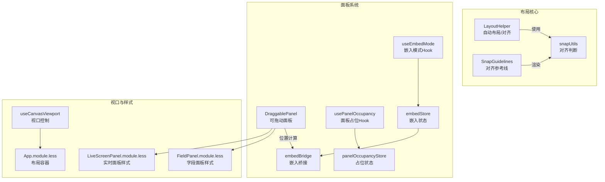
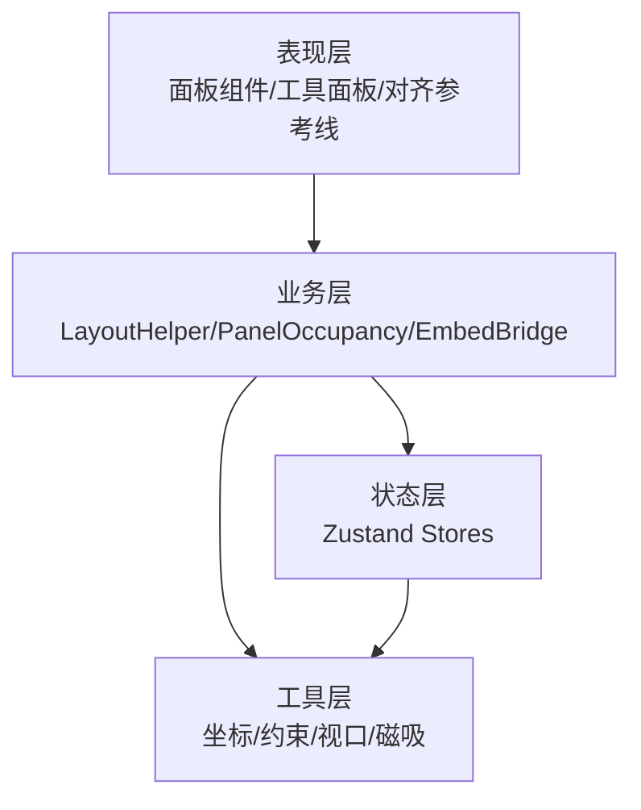
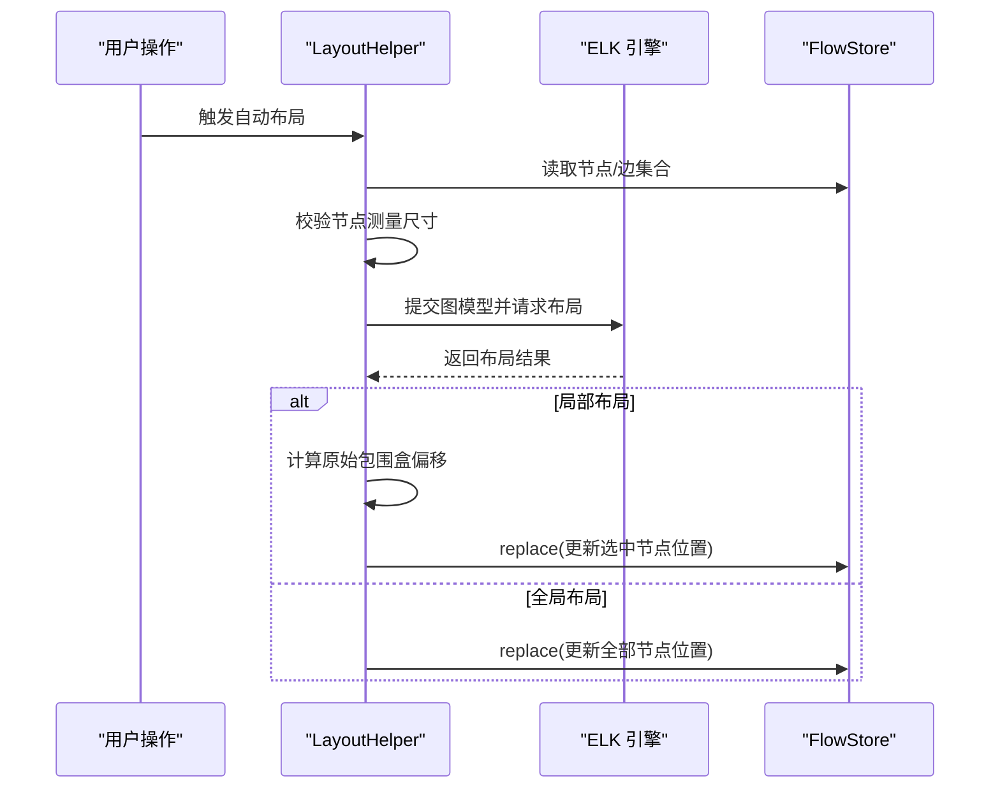
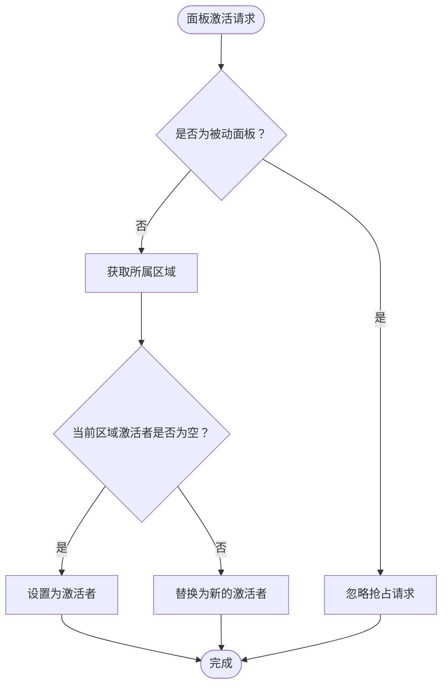
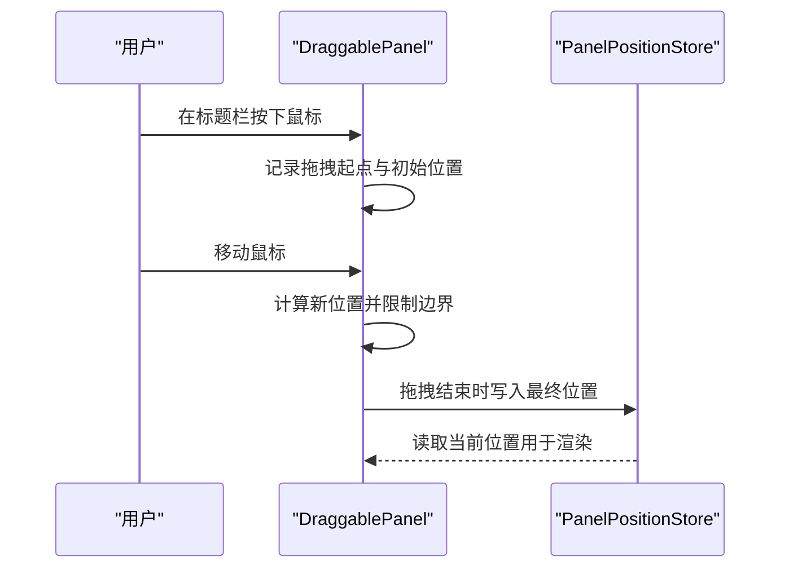
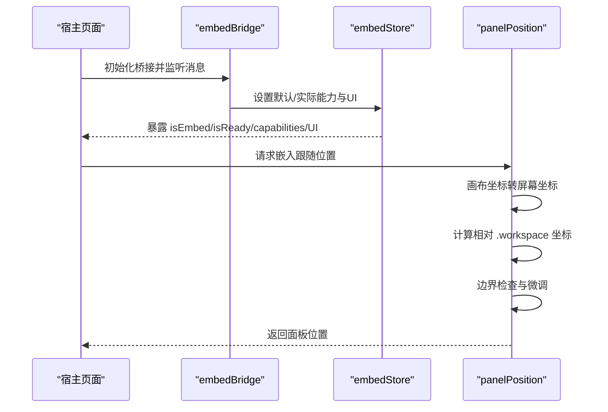
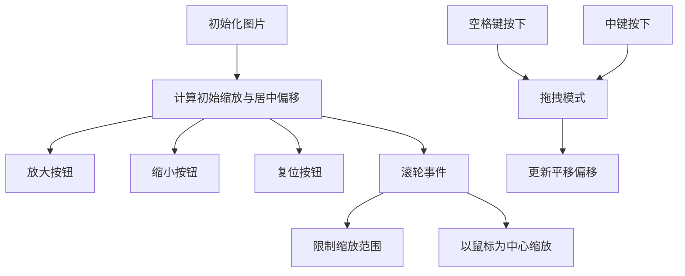
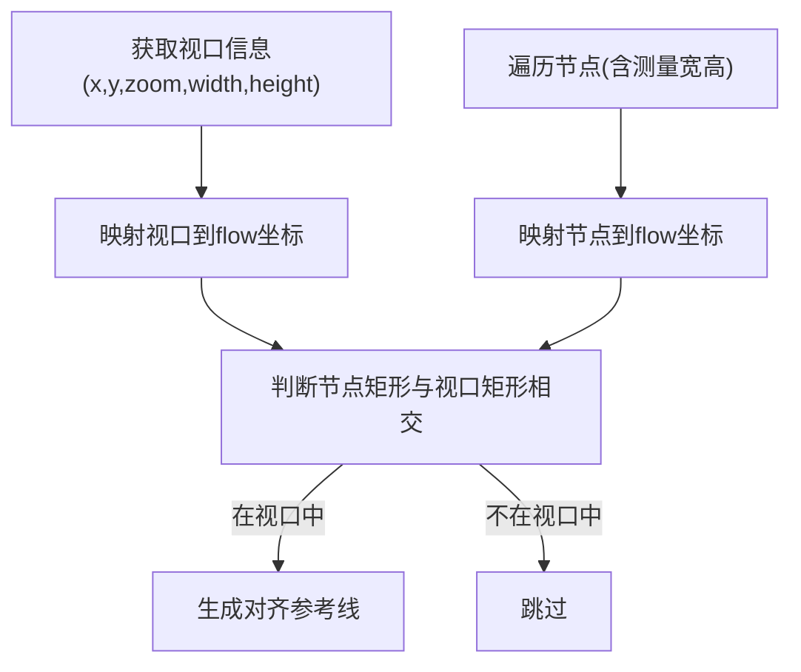
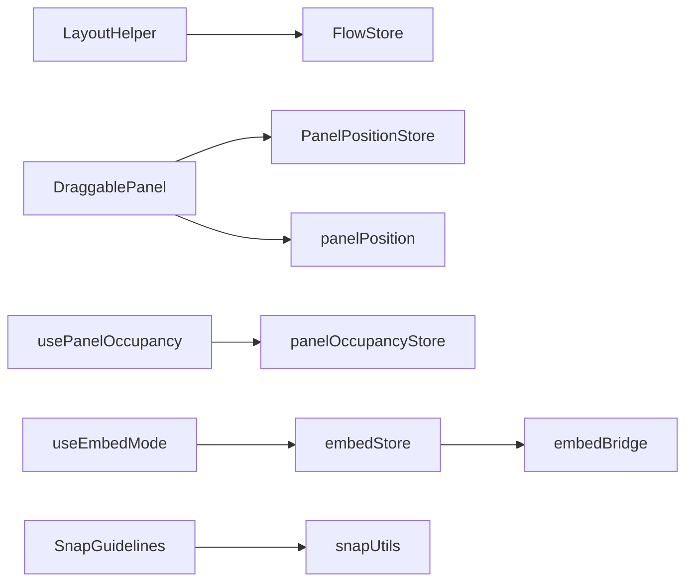

# 面板布局系统

<cite>
**本文档引用的文件**
- [layout.ts](file://src/core/layout.ts)
- [usePanelOccupancy.ts](file://src/hooks/usePanelOccupancy.ts)
- [panelOccupancyStore.ts](file://src/stores/panelOccupancyStore.ts)
- [useEmbedMode.ts](file://src/hooks/useEmbedMode.ts)
- [panelPosition.ts](file://src/utils/ui/panelPosition.ts)
- [DraggablePanel.tsx](file://src/components/panels/common/DraggablePanel.tsx)
- [embedStore.ts](file://src/stores/embedStore.ts)
- [embedBridge.ts](file://src/utils/embedBridge.ts)
- [App.module.less](file://src/styles/layout/App.module.less)
- [FieldPanel.module.less](file://src/styles/panels/FieldPanel.module.less)
- [LiveScreenPanel.module.less](file://src/styles/panels/LiveScreenPanel.module.less)
- [useCanvasViewport.ts](file://src/hooks/useCanvasViewport.ts)
- [SnapGuidelines.tsx](file://src/components/flow/SnapGuidelines.tsx)
- [snapUtils.ts](file://src/core/snapUtils.ts)
- [flow/index.ts](file://src/stores/flow/index.ts)
</cite>

## 目录
1. [简介](#简介)
2. [项目结构](#项目结构)
3. [核心组件](#核心组件)
4. [架构总览](#架构总览)
5. [详细组件分析](#详细组件分析)
6. [依赖关系分析](#依赖关系分析)
7. [性能考虑](#性能考虑)
8. [故障排除指南](#故障排除指南)
9. [结论](#结论)
10. [附录](#附录)

## 简介
本文件系统性梳理了面板布局系统的架构设计与实现细节，覆盖以下主题：
- 面板布局的响应式适配机制与嵌入模式约束处理
- 面板占用空间计算与动态调整算法
- 面板拖拽与缩放的实现原理
- 自定义与扩展指导
- 性能优化与用户体验提升策略

## 项目结构
面板布局系统由多个层次协同组成：
- 核心布局与对齐：基于 ELK 的自动布局与节点对齐
- 面板互斥与占位：区域化互斥与被动面板反应机制
- 面板拖拽与定位：可拖动面板与嵌入跟随模式位置计算
- 嵌入模式桥接：iframe 嵌入环境检测与双向通信
- 视口与缩放：画布视口控制与截图缩放
- 磁吸与对齐：对齐参考线与节点吸附

**图表来源**
- [layout.ts:31-218](file://src/core/layout.ts#L31-L218)
- [snapUtils.ts:1-57](file://src/core/snapUtils.ts#L1-L57)
- [SnapGuidelines.tsx:1-58](file://src/components/flow/SnapGuidelines.tsx#L1-L58)
- [DraggablePanel.tsx:1-178](file://src/components/panels/common/DraggablePanel.tsx#L1-L178)
- [usePanelOccupancy.ts:1-61](file://src/hooks/usePanelOccupancy.ts#L1-L61)
- [panelOccupancyStore.ts:1-136](file://src/stores/panelOccupancyStore.ts#L1-L136)
- [useEmbedMode.ts:1-30](file://src/hooks/useEmbedMode.ts#L1-L30)
- [embedStore.ts:1-60](file://src/stores/embedStore.ts#L1-L60)
- [embedBridge.ts:1-282](file://src/utils/embedBridge.ts#L1-L282)
- [useCanvasViewport.ts:1-307](file://src/hooks/useCanvasViewport.ts#L1-L307)
- [App.module.less:1-32](file://src/styles/layout/App.module.less#L1-L32)
- [FieldPanel.module.less:1-204](file://src/styles/panels/FieldPanel.module.less#L1-L204)
- [LiveScreenPanel.module.less:1-89](file://src/styles/panels/LiveScreenPanel.module.less#L1-L89)

**章节来源**
- [layout.ts:1-220](file://src/core/layout.ts#L1-L220)
- [panelPosition.ts:1-263](file://src/utils/ui/panelPosition.ts#L1-L263)
- [DraggablePanel.tsx:1-178](file://src/components/panels/common/DraggablePanel.tsx#L1-L178)
- [panelOccupancyStore.ts:1-136](file://src/stores/panelOccupancyStore.ts#L1-L136)
- [useEmbedMode.ts:1-30](file://src/hooks/useEmbedMode.ts#L1-L30)
- [embedBridge.ts:1-282](file://src/utils/embedBridge.ts#L1-L282)
- [useCanvasViewport.ts:1-307](file://src/hooks/useCanvasViewport.ts#L1-L307)
- [App.module.less:1-32](file://src/styles/layout/App.module.less#L1-L32)
- [FieldPanel.module.less:1-204](file://src/styles/panels/FieldPanel.module.less#L1-L204)
- [LiveScreenPanel.module.less:1-89](file://src/styles/panels/LiveScreenPanel.module.less#L1-L89)

## 核心组件
- 自动布局与对齐：基于 ELK 的层级布局，支持局部/全局布局；提供左/右/上/下/水平居中/垂直居中对齐。
- 面板占位互斥：区域化互斥（右/左/底），支持主动面板抢占与被动面板三种反应（关闭/隐藏/偏移）。
- 面板拖拽与定位：可拖动面板封装，支持标题栏拖拽、边界限制、默认位置与持久化位置。
- 嵌入模式适配：环境检测、握手协议、UI 配置与能力开关，以及嵌入跟随模式下的位置计算。
- 视口与缩放：滚轮缩放、空格拖拽、复位与截图适配，保证大图浏览体验。
- 磁吸与对齐：对齐参考线渲染与节点在视口内的可见性判断。

**章节来源**
- [layout.ts:31-218](file://src/core/layout.ts#L31-L218)
- [panelOccupancyStore.ts:87-135](file://src/stores/panelOccupancyStore.ts#L87-L135)
- [DraggablePanel.tsx:37-175](file://src/components/panels/common/DraggablePanel.tsx#L37-L175)
- [embedBridge.ts:70-282](file://src/utils/embedBridge.ts#L70-L282)
- [useCanvasViewport.ts:69-307](file://src/hooks/useCanvasViewport.ts#L69-L307)
- [snapUtils.ts:1-57](file://src/core/snapUtils.ts#L1-L57)

## 架构总览
系统采用分层架构：
- 表现层：面板组件、工具面板、对齐参考线
- 业务层：布局助手、面板占位系统、嵌入桥接
- 状态层：Zustand store（面板位置、占位状态、嵌入状态、流程状态）
- 工具层：坐标转换、位置约束、视口控制、磁吸工具

**图表来源**
- [layout.ts:31-218](file://src/core/layout.ts#L31-L218)
- [panelOccupancyStore.ts:87-135](file://src/stores/panelOccupancyStore.ts#L87-L135)
- [embedBridge.ts:179-282](file://src/utils/embedBridge.ts#L179-L282)
- [useCanvasViewport.ts:69-307](file://src/hooks/useCanvasViewport.ts#L69-L307)
- [snapUtils.ts:1-57](file://src/core/snapUtils.ts#L1-L57)

## 详细组件分析

### 自动布局与对齐（LayoutHelper）
- 自动布局：收集节点测量宽高，构建 ELK 图模型，异步执行布局，支持局部/全局两种模式；局部布局时保留原始包围盒并进行偏移对齐。
- 对齐算法：根据方向枚举计算对齐目标位置，批量更新节点位置。
- 错误处理：捕获 ELK 异常并输出日志，避免阻塞主线程。

**图表来源**
- [layout.ts:32-148](file://src/core/layout.ts#L32-L148)
- [flow/index.ts:1-124](file://src/stores/flow/index.ts#L1-L124)

**章节来源**
- [layout.ts:31-218](file://src/core/layout.ts#L31-L218)

### 面板占位互斥系统
- 区域划分：右/左/底部三块区域，同一时刻每个区域仅允许一个面板激活。
- 面板类型：主动面板（可抢占）、被动面板（不可抢占，仅观察）。
- 反应形态：close（关闭）、hide（隐藏）、offset（偏移）。
- 注册机制：应用初始化时集中注册，运行期不可动态增删。

**图表来源**
- [panelOccupancyStore.ts:105-134](file://src/stores/panelOccupancyStore.ts#L105-L134)

**章节来源**
- [usePanelOccupancy.ts:1-61](file://src/hooks/usePanelOccupancy.ts#L1-L61)
- [panelOccupancyStore.ts:1-136](file://src/stores/panelOccupancyStore.ts#L1-L136)

### 面板拖拽与定位
- 拖拽实现：仅标题栏触发，记录起始位置与鼠标偏移，实时更新拖拽位置并在松开时写入 store。
- 边界限制：窗口可视区域内限制，防止面板完全移出。
- 默认位置：首次渲染时根据窗口尺寸与默认偏移计算，延迟初始化确保 DOM 可用。
- 共享位置：字段/连接面板共享位置状态，便于联动。

**图表来源**
- [DraggablePanel.tsx:84-146](file://src/components/panels/common/DraggablePanel.tsx#L84-L146)
- [DraggablePanel.tsx:19-22](file://src/components/panels/common/DraggablePanel.tsx#L19-L22)

**章节来源**
- [DraggablePanel.tsx:1-178](file://src/components/panels/common/DraggablePanel.tsx#L1-L178)

### 嵌入模式下的布局适配与约束
- 环境检测：通过 URL 参数识别嵌入环境，支持宿主 origin 校验。
- 握手协议：初始化桥接，注册消息处理器，5 秒超时回退默认能力。
- UI 配置：隐藏头部/工具栏、隐藏面板列表，按能力开关控制功能可用性。
- 嵌入跟随模式：根据目标元素画布坐标与视口缩放，计算面板相对 .workspace 的位置，并进行边界检查与微调。

**图表来源**
- [embedBridge.ts:179-282](file://src/utils/embedBridge.ts#L179-L282)
- [embedStore.ts:31-60](file://src/stores/embedStore.ts#L31-L60)
- [panelPosition.ts:93-157](file://src/utils/ui/panelPosition.ts#L93-L157)

**章节来源**
- [useEmbedMode.ts:1-30](file://src/hooks/useEmbedMode.ts#L1-L30)
- [embedBridge.ts:1-282](file://src/utils/embedBridge.ts#L1-L282)
- [embedStore.ts:1-60](file://src/stores/embedStore.ts#L1-L60)
- [panelPosition.ts:1-263](file://src/utils/ui/panelPosition.ts#L1-L263)

### 视口与缩放（CanvasViewport）
- 缩放范围：0.1–5，滚轮按鼠标位置中心缩放，支持 +/−/复位。
- 拖拽模式：空格键或中键按下进入拖拽，实时更新平移偏移。
- 截图适配：根据容器与图片尺寸计算初始缩放与居中偏移。
- 光标反馈：根据拖拽状态返回不同光标样式。

**图表来源**
- [useCanvasViewport.ts:161-215](file://src/hooks/useCanvasViewport.ts#L161-L215)
- [useCanvasViewport.ts:218-249](file://src/hooks/useCanvasViewport.ts#L218-L249)

**章节来源**
- [useCanvasViewport.ts:1-307](file://src/hooks/useCanvasViewport.ts#L1-L307)

### 磁吸与对齐（SnapGuidelines + snapUtils）
- 对齐参考线：根据视口缩放与偏移实时绘制水平/垂直参考线。
- 可见性判断：将视口与节点矩形映射到 flow 坐标系，结合额外边距判断节点是否在可视范围内。
- 与布局协作：对齐结果可用于节点放置与吸附，提升编辑效率。

**图表来源**
- [snapUtils.ts:38-57](file://src/core/snapUtils.ts#L38-L57)
- [SnapGuidelines.tsx:6-55](file://src/components/flow/SnapGuidelines.tsx#L6-L55)

**章节来源**
- [snapUtils.ts:1-57](file://src/core/snapUtils.ts#L1-L57)
- [SnapGuidelines.tsx:1-58](file://src/components/flow/SnapGuidelines.tsx#L1-L58)

## 依赖关系分析
- 组件耦合
  - LayoutHelper 依赖 FlowStore 读取/写入节点/边状态，与 snapUtils 存在概念关联但无直接导入。
  - DraggablePanel 依赖 PanelPositionStore 与 DOM 尺寸，与 panelPosition 的位置计算存在协作关系。
  - panelOccupancyStore 作为纯状态容器，被 usePanelOccupancy Hook 使用。
  - embedBridge 与 embedStore 彼此独立，分别负责协议与状态。
- 外部依赖
  - ELKJS 用于自动布局
  - @xyflow/react 用于视口与节点渲染（在 SnapGuidelines 中使用）

**图表来源**
- [layout.ts:42-148](file://src/core/layout.ts#L42-L148)
- [DraggablePanel.tsx:52-53](file://src/components/panels/common/DraggablePanel.tsx#L52-L53)
- [panelPosition.ts:93-157](file://src/utils/ui/panelPosition.ts#L93-L157)
- [usePanelOccupancy.ts:37-41](file://src/hooks/usePanelOccupancy.ts#L37-L41)
- [panelOccupancyStore.ts:98-135](file://src/stores/panelOccupancyStore.ts#L98-L135)
- [useEmbedMode.ts:14-19](file://src/hooks/useEmbedMode.ts#L14-L19)
- [embedStore.ts:31-60](file://src/stores/embedStore.ts#L31-L60)
- [embedBridge.ts:179-282](file://src/utils/embedBridge.ts#L179-L282)
- [SnapGuidelines.tsx:7](file://src/components/flow/SnapGuidelines.tsx#L7)

**章节来源**
- [layout.ts:1-220](file://src/core/layout.ts#L1-L220)
- [DraggablePanel.tsx:1-178](file://src/components/panels/common/DraggablePanel.tsx#L1-L178)
- [panelOccupancyStore.ts:1-136](file://src/stores/panelOccupancyStore.ts#L1-L136)
- [embedBridge.ts:1-282](file://src/utils/embedBridge.ts#L1-L282)
- [SnapGuidelines.tsx:1-58](file://src/components/flow/SnapGuidelines.tsx#L1-L58)

## 性能考虑
- 自动布局
  - 使用 requestAnimationFrame 触发布局，避免阻塞渲染帧。
  - 若节点未完成测量，延迟重试，减少无效计算。
  - 局部布局仅处理选中节点子图，降低复杂度。
- 面板拖拽
  - 仅在标题栏触发，避免误触按钮导致拖拽。
  - 边界限制在内存中计算，避免频繁 DOM 查询。
- 嵌入模式
  - 位置计算基于视口缩放与 .workspace 偏移，尽量减少重复查询。
  - 超时回退默认能力，避免长时间等待。
- 视口缩放
  - 滚轮事件阻止默认行为并使用被动监听参数，提升滚动性能。
  - 以鼠标为中心缩放，减少视觉跳跃感。
- 磁吸对齐
  - 参考线按需渲染，仅在存在对齐结果时绘制。
  - 可见性判断使用简单矩形相交，复杂度低。

[本节为通用性能建议，无需特定文件引用]

## 故障排除指南
- 自动布局无响应
  - 检查节点是否具备测量尺寸；若缺失，等待测量完成后重试。
  - 查看控制台是否有 ELK 异常日志。
- 面板被意外隐藏/关闭
  - 检查面板注册的反应形态（close/hide/offset）与当前激活者。
  - 确认被动面板不会抢占区域。
- 嵌入面板位置异常
  - 确认 .workspace 元素是否存在；若不存在，将回退到默认位置策略。
  - 检查视口缩放与目标元素尺寸是否正确。
- 拖拽失效
  - 确认点击的是标题栏而非交互按钮。
  - 检查 DOM 是否已渲染，必要时延迟初始化。
- 视口缩放异常
  - 确认容器与图片引用已正确初始化。
  - 检查滚轮事件是否被其他监听器阻止。

**章节来源**
- [layout.ts:54-59](file://src/core/layout.ts#L54-L59)
- [panelOccupancyStore.ts:105-134](file://src/stores/panelOccupancyStore.ts#L105-L134)
- [panelPosition.ts:110-118](file://src/utils/ui/panelPosition.ts#L110-L118)
- [DraggablePanel.tsx:88-93](file://src/components/panels/common/DraggablePanel.tsx#L88-L93)
- [useCanvasViewport.ts:128-158](file://src/hooks/useCanvasViewport.ts#L128-L158)

## 结论
面板布局系统通过清晰的分层设计与模块化实现，提供了：
- 高效的自动布局与对齐能力
- 稳健的面板互斥与占位机制
- 流畅的拖拽与嵌入跟随体验
- 完备的嵌入模式桥接与 UI 适配
- 良好的性能与可维护性

建议在扩展时遵循现有模式：新增面板先注册描述符，再通过 Hook 与状态系统集成；布局算法优先考虑局部优化与异步执行；嵌入模式严格区分环境检测与协议握手。

[本节为总结性内容，无需特定文件引用]

## 附录

### 自定义与扩展指导
- 新增面板
  - 在 panelOccupancyStore 中注册面板描述符，声明区域与反应形态。
  - 在 DraggablePanel 中配置默认位置与样式类名。
  - 如需嵌入跟随，使用 panelPosition 的计算函数。
- 扩展布局算法
  - 在 LayoutHelper 中添加新的对齐/分布策略，注意与 FlowStore 的交互。
  - 对于复杂场景，可引入增量布局或缓存中间结果。
- 嵌入能力开关
  - 通过 embedStore 的 isCapabilityAllowed 判定功能可用性。
  - 在 UI 中根据 capabilities 与 ui 配置动态渲染。

**章节来源**
- [panelOccupancyStore.ts:38-45](file://src/stores/panelOccupancyStore.ts#L38-L45)
- [DraggablePanel.tsx:24-45](file://src/components/panels/common/DraggablePanel.tsx#L24-L45)
- [panelPosition.ts:93-157](file://src/utils/ui/panelPosition.ts#L93-L157)
- [embedStore.ts:52-58](file://src/stores/embedStore.ts#L52-L58)