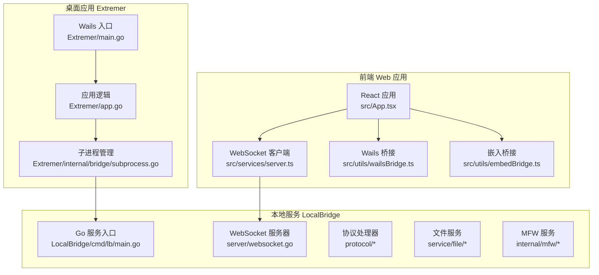
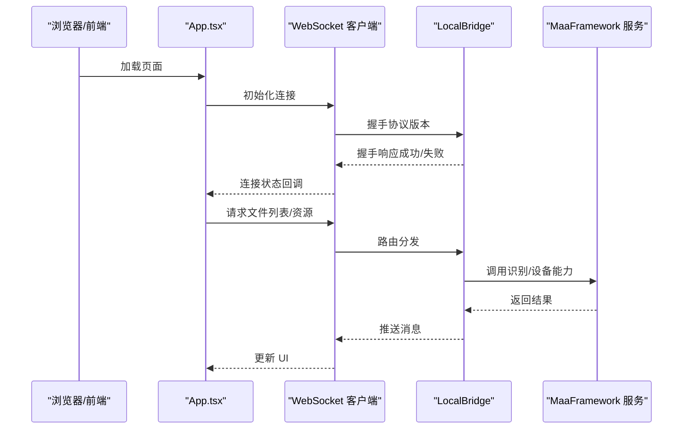
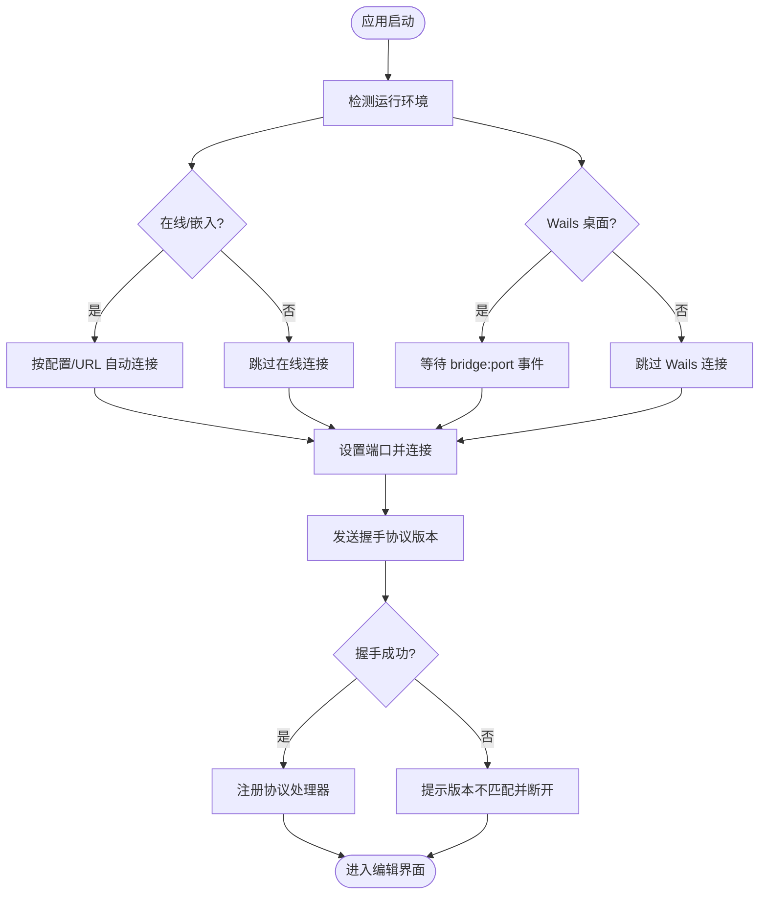
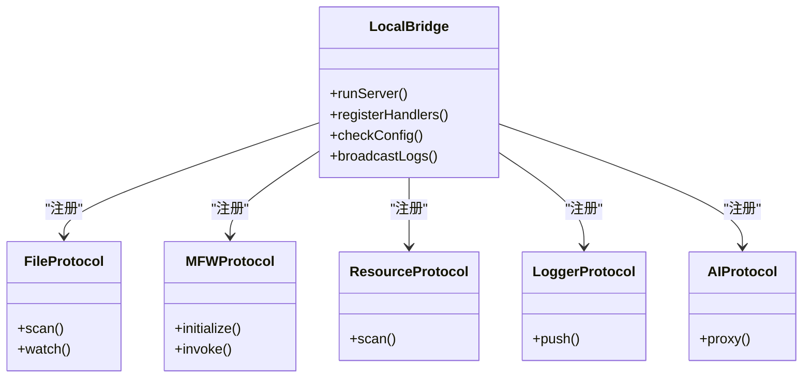
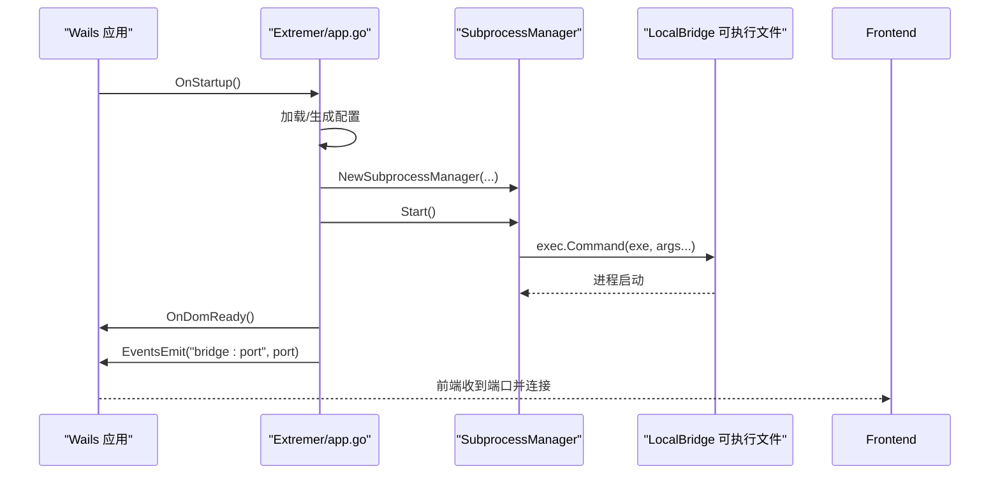
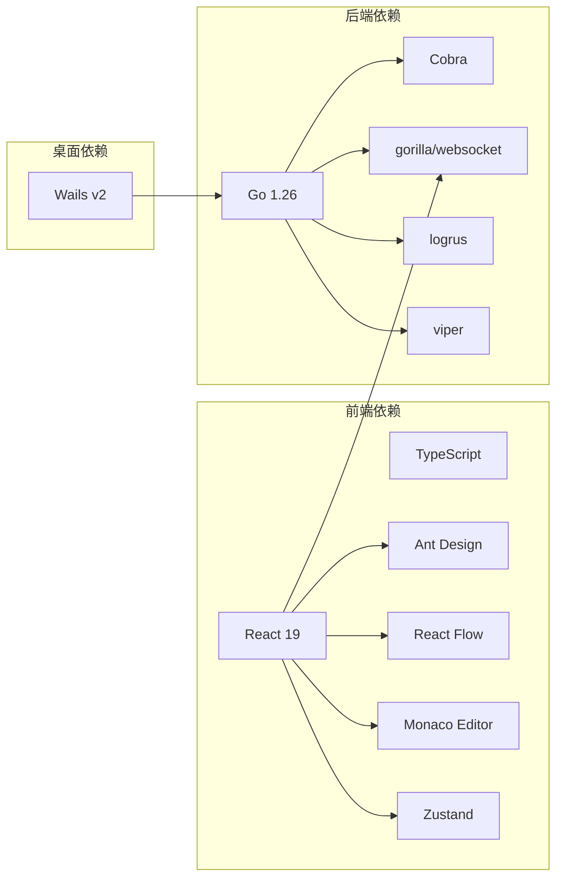

# 项目概述

<cite>
**本文引用的文件**
- [README.md](file://README.md)
- [package.json](file://package.json)
- [Extremer\wails.json](file://Extremer/wails.json)
- [LocalBridge\go.mod](file://LocalBridge/go.mod)
- [Extremer\go.mod](file://Extremer/go.mod)
- [src\main.tsx](file://src/main.tsx)
- [Extremer\app.go](file://Extremer/app.go)
- [Extremer\main.go](file://Extremer/main.go)
- [LocalBridge\cmd\lb\main.go](file://LocalBridge/cmd/lb/main.go)
- [src\App.tsx](file://src/App.tsx)
- [src\services\server.ts](file://src/services/server.ts)
- [src\stores\wsStore.ts](file://src/stores/wsStore.ts)
- [src\utils\wailsBridge.ts](file://src/utils/wailsBridge.ts)
- [src\utils\embedBridge.ts](file://src/utils/embedBridge.ts)
- [Extremer\internal\bridge\subprocess.go](file://Extremer/internal/bridge/subprocess.go)
</cite>

## 目录
1. [引言](#引言)
2. [项目结构](#项目结构)
3. [核心组件](#核心组件)
4. [架构总览](#架构总览)
5. [详细组件分析](#详细组件分析)
6. [依赖关系分析](#依赖关系分析)
7. [性能考虑](#性能考虑)
8. [故障排查指南](#故障排查指南)
9. [结论](#结论)
10. [附录](#附录)

## 引言
MaaPipelineEditor（简称 MPE）是一个面向 MaaFramework Pipeline 的下一代可视化工作流编辑器，采用前后端分离架构，提供在线与桌面双形态使用方式。项目旨在解决传统 Pipeline 编辑痛点：手写 JSON 繁琐、缺乏可视化、难以调试与协作等问题。通过拖拽式节点编辑、字段级 AI 补全、文件与设备能力集成、探索模式等特性，显著提升资源开发者在设计、调试与分享流程方面的效率与体验。

## 项目结构
MPE 仓库采用多模块组织方式，核心分为三层：
- 前端 Web 应用：基于 React 19 + TypeScript，负责可视化编辑、面板交互与协议通信。
- 本地服务（LocalBridge）：基于 Go 的 WebSocket 服务，提供文件扫描、MaaFramework 集成、日志推送、资源管理等能力。
- 桌面应用包装（Extremer）：基于 Wails，将前端与本地服务打包为跨平台桌面应用，提供开箱即用的一体化体验。

**图表来源**
- [src\App.tsx:136-597](file://src/App.tsx#L136-L597)
- [src\services\server.ts:22-345](file://src/services/server.ts#L22-L345)
- [src\utils\wailsBridge.ts:54-270](file://src/utils/wailsBridge.ts#L54-L270)
- [src\utils\embedBridge.ts:75-282](file://src/utils/embedBridge.ts#L75-L282)
- [LocalBridge\cmd\lb\main.go:185-468](file://LocalBridge/cmd/lb/main.go#L185-L468)
- [Extremer\main.go:26-89](file://Extremer/main.go#L26-L89)
- [Extremer\app.go:182-304](file://Extremer/app.go#L182-L304)
- [Extremer\internal\bridge\subprocess.go:35-105](file://Extremer/internal/bridge/subprocess.go#L35-L105)

**章节来源**
- [README.md:31-92](file://README.md#L31-L92)
- [package.json:1-75](file://package.json#L1-L75)
- [Extremer\wails.json:1-18](file://Extremer/wails.json#L1-L18)
- [LocalBridge\go.mod:1-38](file://LocalBridge/go.mod#L1-L38)
- [Extremer\go.mod:1-39](file://Extremer/go.mod#L1-L39)

## 核心组件
- 可视化编辑器：基于 React + React Flow，提供节点拖拽、连线、分组、便签、自动布局等能力，兼顾阅读体验与编辑效率。
- 本地服务（LocalBridge）：提供文件扫描、资源管理、MaaFramework 集成、日志推送、调试接口等，通过 WebSocket 与前端通信。
- 桌面应用（Extremer）：基于 Wails，封装前端与 LocalBridge，提供跨平台可执行文件，支持开机自启、自动更新提示、托盘等。
- 协议与桥接：统一的 WebSocket 协议版本协商机制，支持 Wails 与嵌入模式（iframe）双向通信，保障多端一致性。

**章节来源**
- [README.md:37-92](file://README.md#L37-L92)
- [src\App.tsx:136-597](file://src/App.tsx#L136-L597)
- [src\services\server.ts:22-345](file://src/services/server.ts#L22-L345)
- [src\utils\wailsBridge.ts:54-270](file://src/utils/wailsBridge.ts#L54-L270)
- [src\utils\embedBridge.ts:75-282](file://src/utils/embedBridge.ts#L75-L282)

## 架构总览
MPE 采用三层架构：
- 前端层：React 应用负责 UI 与交互，通过 WebSocket 与本地服务通信；在桌面环境下通过 Wails 桥接访问系统能力；在嵌入模式下通过 postMessage 与宿主通信。
- 本地服务层：Go 实现的 LocalBridge，提供文件扫描、资源管理、MaaFramework 集成、日志推送、协议路由等能力，以 WebSocket 作为统一通信协议。
- 桌面包装层：Wails 应用负责窗口管理、子进程生命周期、配置持久化、更新提示等，将前端与本地服务打包为跨平台桌面应用。

**图表来源**
- [src\App.tsx:430-493](file://src/App.tsx#L430-L493)
- [src\services\server.ts:109-255](file://src/services/server.ts#L109-L255)
- [LocalBridge\cmd\lb\main.go:388-434](file://LocalBridge/cmd/lb/main.go#L388-L434)

**章节来源**
- [src\App.tsx:136-597](file://src/App.tsx#L136-L597)
- [src\services\server.ts:22-345](file://src/services/server.ts#L22-L345)
- [LocalBridge\cmd\lb\main.go:185-468](file://LocalBridge/cmd/lb/main.go#L185-L468)

## 详细组件分析

### 前端应用与连接管理
- 应用入口：初始化 WebSocket、开发控制台，创建 React 根实例。
- 连接策略：根据运行环境（在线、Wails、嵌入）选择连接方式；支持自动连接、URL 参数连接、Wails 事件驱动连接。
- 协议注册：集中注册文件、MFW、配置、调试、资源、日志、AI 等协议处理器，统一消息路由。
- 状态管理：WebSocket 连接状态通过 zustand store 管理，驱动 UI 层的连接指示与功能开关。

**图表来源**
- [src\App.tsx:430-493](file://src/App.tsx#L430-L493)
- [src\services\server.ts:109-168](file://src/services/server.ts#L109-L168)
- [src\stores\wsStore.ts:1-24](file://src/stores/wsStore.ts#L1-L24)

**章节来源**
- [src\main.tsx:1-20](file://src/main.tsx#L1-L20)
- [src\App.tsx:136-597](file://src/App.tsx#L136-L597)
- [src\services\server.ts:22-345](file://src/services/server.ts#L22-L345)
- [src\stores\wsStore.ts:1-24](file://src/stores/wsStore.ts#L1-L24)

### 本地服务（LocalBridge）与协议体系
- 服务职责：文件扫描与监听、资源目录扫描、MaaFramework 初始化与调用、日志推送、协议路由与消息分发。
- 协议体系：统一的 WebSocket 协议版本协商，支持文件、MFW、配置、资源、调试、日志、AI 等协议处理器。
- 安全与健壮性：路径安全检查、配置重载、异常日志推送、协议不匹配主动退出保护。
- 命令行工具：提供配置管理、路径设置、日志查看等 CLI 能力，便于运维与诊断。

**图表来源**
- [LocalBridge\cmd\lb\main.go:388-434](file://LocalBridge/cmd/lb/main.go#L388-L434)
- [LocalBridge\cmd\lb\main.go:405-431](file://LocalBridge/cmd/lb/main.go#L405-L431)

**章节来源**
- [LocalBridge\cmd\lb\main.go:185-468](file://LocalBridge/cmd/lb/main.go#L185-L468)

### 桌面应用（Extremer）与子进程管理
- 应用职责：窗口管理、启动画面、配置加载与持久化、端口分配、子进程生命周期管理、事件通知。
- 子进程管理：动态定位 LocalBridge 可执行文件，拼装参数（端口、根目录、日志目录、配置文件），重定向输出到日志文件，后台监控进程状态。
- Wails 集成：暴露 Go 方法给前端调用（端口、运行状态、重启、目录打开等），并在 DOM 就绪后通知前端连接。

**图表来源**
- [Extremer\app.go:182-304](file://Extremer/app.go#L182-L304)
- [Extremer\app.go:416-444](file://Extremer/app.go#L416-L444)
- [Extremer\internal\bridge\subprocess.go:35-105](file://Extremer/internal/bridge/subprocess.go#L35-L105)
- [Extremer\main.go:49-84](file://Extremer/main.go#L49-L84)

**章节来源**
- [Extremer\app.go:182-304](file://Extremer/app.go#L182-L304)
- [Extremer\internal\bridge\subprocess.go:35-105](file://Extremer/internal/bridge/subprocess.go#L35-L105)
- [Extremer\main.go:26-89](file://Extremer/main.go#L26-L89)

### 嵌入模式与 Wails 桥接
- 嵌入模式：通过 URL 参数与 postMessage 实现 iframe 嵌入，支持能力声明（只读、撤销重做、AI、搜索等）与 UI 隐藏面板控制。
- Wails 桥接：在桌面环境下，前端通过 window.runtime 与 window.go 调用后端方法，实现端口获取、桥接状态检查、重启、目录打开等。
- 握手与超时：嵌入模式在 5 秒内完成握手，否则使用默认能力集；Wails 事件驱动连接，避免阻塞 UI。

**章节来源**
- [src\utils\embedBridge.ts:75-282](file://src/utils/embedBridge.ts#L75-L282)
- [src\utils\wailsBridge.ts:54-270](file://src/utils/wailsBridge.ts#L54-L270)

## 依赖关系分析
- 技术栈概览
  - 前端：React 19、TypeScript、Ant Design、React Flow、Monaco Editor、Zustand、DnD Kit 等。
  - 后端：Go 1.26、Cobra（CLI）、Gorilla WebSocket、Logrus、Viper（配置）等。
  - 桌面：Wails v2，跨平台窗口与系统集成。
- 外部依赖与集成
  - MaaFramework（Go 绑定）：提供识别、设备、任务执行等能力。
  - 第三方工具：OCR（Tesseract.js）、图像处理（html-to-image）、图标字体（iconfont）等。

**图表来源**
- [package.json:24-73](file://package.json#L24-L73)
- [LocalBridge\go.mod:5-16](file://LocalBridge/go.mod#L5-L16)
- [Extremer\go.mod:6-8](file://Extremer/go.mod#L6-L8)

**章节来源**
- [package.json:24-73](file://package.json#L24-L73)
- [LocalBridge\go.mod:1-38](file://LocalBridge/go.mod#L1-L38)
- [Extremer\go.mod:1-39](file://Extremer/go.mod#L1-L39)

## 性能考虑
- 连接与协议
  - WebSocket 握手与版本协商在连接初期完成，避免后续通信开销。
  - 路由分发与消息解析采用 Map 查找，降低处理延迟。
- 本地服务
  - 文件扫描与资源扫描支持最大深度与文件数量限制，避免大规模目录导致卡顿。
  - 日志推送采用广播机制，按需推送历史日志，减少冗余传输。
- 前端渲染
  - React 19 与 Suspense 结合懒加载重型组件（JSON 查看器、调试模态），提升首屏性能。
  - React Flow 节点与边渲染优化，结合自动布局与吸附网格，减少重绘。
- 桌面应用
  - 子进程重定向输出到文件，避免阻塞 UI；Wails 事件异步通知前端连接。

[本节为通用指导，不直接分析具体文件]

## 故障排查指南
- 连接失败
  - 检查本地服务是否启动、端口是否被占用；查看连接超时与错误提示，必要时查看文档站指引。
  - 在桌面环境下确认 Extremer 是否正确发出 bridge:port 事件，前端是否收到并发起连接。
- 协议版本不匹配
  - 前端与后端协议版本不一致会导致握手失败；根据提示升级前端或后端版本。
- MaaFramework 初始化失败
  - 检查 lib_dir 与 resource_dir 配置是否正确；确认库版本与框架版本兼容。
- 嵌入模式握手超时
  - 确认宿主 origin 校验与消息协议头；若超时则使用默认能力集继续运行。

**章节来源**
- [src\services\server.ts:39-67](file://src/services/server.ts#L39-L67)
- [src\services\server.ts:109-255](file://src/services/server.ts#L109-L255)
- [LocalBridge\cmd\lb\main.go:225-256](file://LocalBridge/cmd/lb/main.go#L225-L256)
- [src\utils\embedBridge.ts:221-228](file://src/utils/embedBridge.ts#L221-L228)

## 结论
MaaPipelineEditor 通过三层架构实现了“所见即所得”的 Pipeline 编辑体验，结合本地服务与桌面包装，提供了开箱即用、跨平台、可扩展的解决方案。其核心价值在于：
- 可视化与拖拽：降低学习成本，提升设计与协作效率。
- 本地能力集成：文件管理、设备连接、流程调试、日志推送等能力无缝衔接。
- AI 辅助：节点级 AI 补全与智能搜索，加速配置与排错。
- 多形态支持：在线、桌面、嵌入三种使用方式满足不同场景需求。

[本节为总结性内容，不直接分析具体文件]

## 附录
- 版本与发布：项目采用语义化版本管理，通过脚本进行构建与发布；Extremer 与 LocalBridge 版本号保持一致。
- 历史与演进：从 YaMaaPE 到 MaaPipelineExtremer，再到 MaaPipelineEditor，持续完善协议、UI 与本地能力。
- 开发与贡献：提供文档站、脚手架与开发工具链，鼓励社区参与与反馈。

**章节来源**
- [README.md:150-161](file://README.md#L150-L161)
- [Extremer\wails.json:13-16](file://Extremer/wails.json#L13-L16)
- [package.json:21-22](file://package.json#L21-L22)