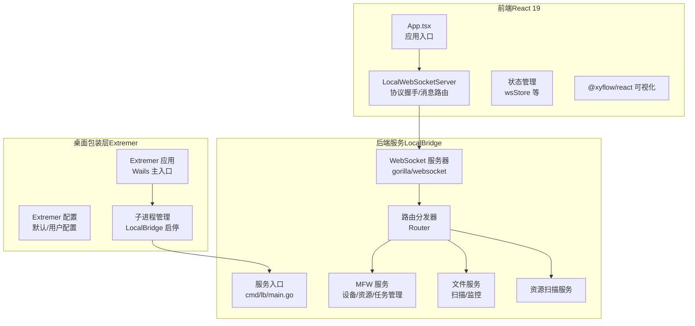
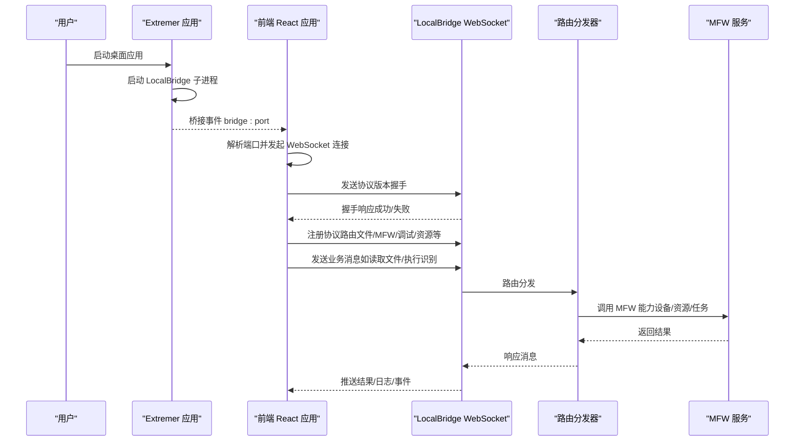
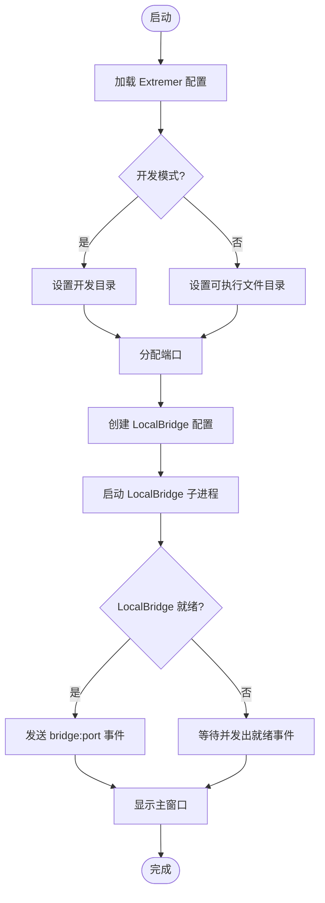
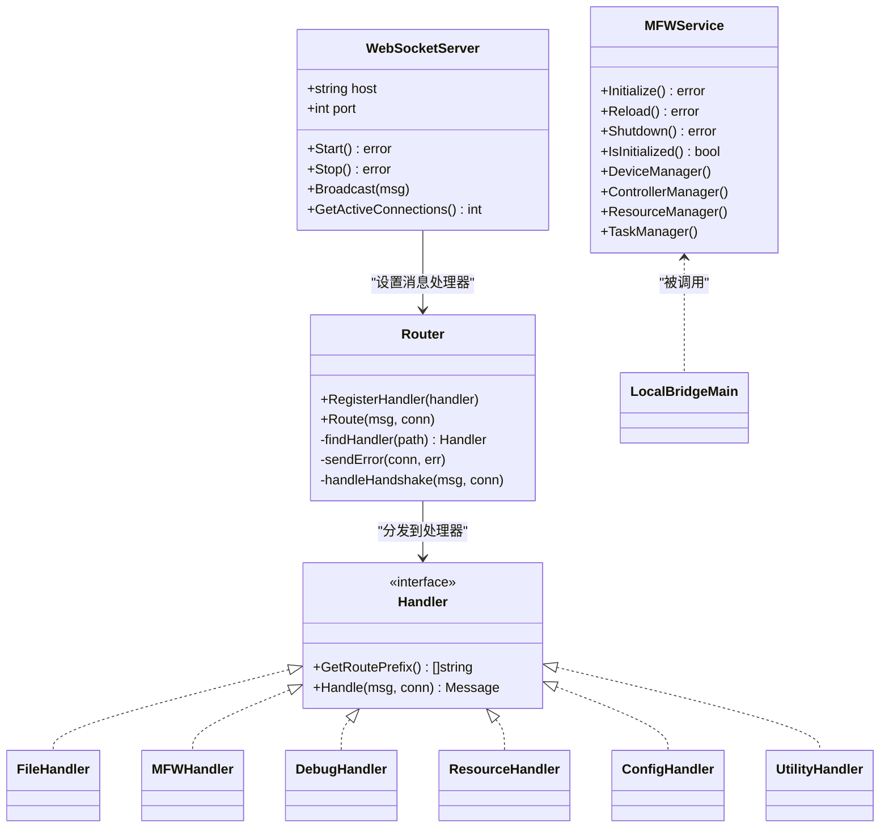
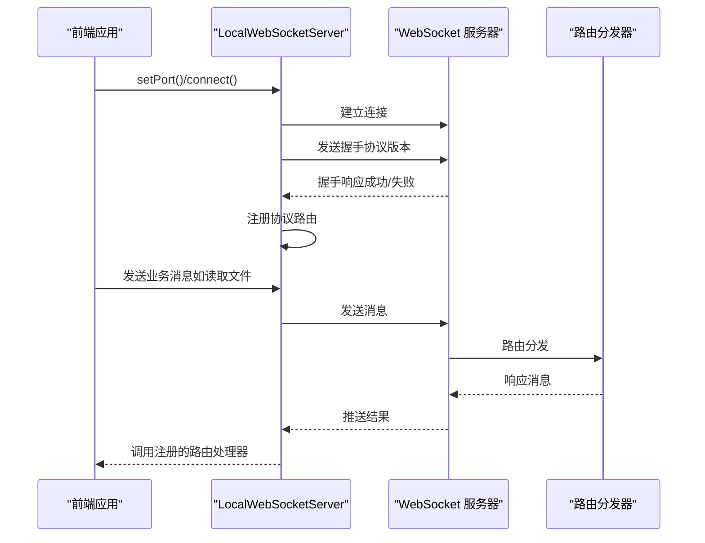
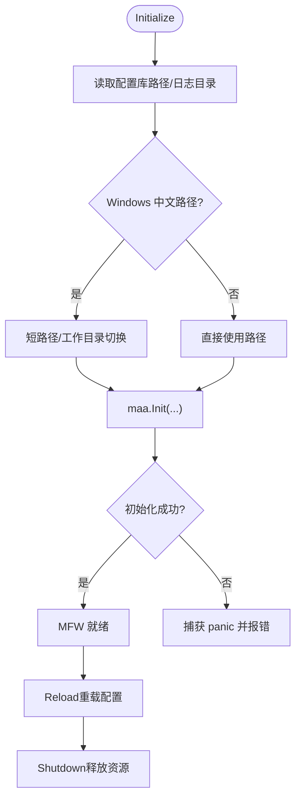
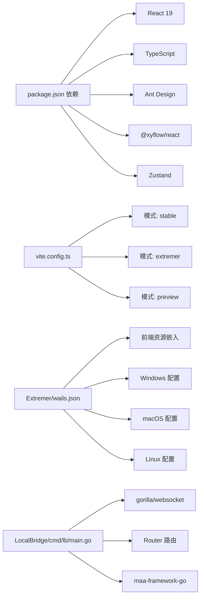

# 技术架构

<cite>
**本文引用的文件**   
- [README.md](file://README.md)
- [package.json](file://package.json)
- [vite.config.ts](file://vite.config.ts)
- [Extremer/main.go](file://Extremer/main.go)
- [Extremer/app.go](file://Extremer/app.go)
- [Extremer/wails.json](file://Extremer/wails.json)
- [LocalBridge/cmd/lb/main.go](file://LocalBridge/cmd/lb/main.go)
- [LocalBridge/internal/server/websocket.go](file://LocalBridge/internal/server/websocket.go)
- [LocalBridge/internal/router/router.go](file://LocalBridge/internal/router/router.go)
- [LocalBridge/internal/mfw/service.go](file://LocalBridge/internal/mfw/service.go)
- [src/services/server.ts](file://src/services/server.ts)
- [src/App.tsx](file://src/App.tsx)
- [src/stores/wsStore.ts](file://src/stores/wsStore.ts)
- [tsconfig.json](file://tsconfig.json)
</cite>

## 目录
1. [简介](#简介)
2. [项目结构](#项目结构)
3. [核心组件](#核心组件)
4. [架构总览](#架构总览)
5. [详细组件分析](#详细组件分析)
6. [依赖分析](#依赖分析)
7. [性能考量](#性能考量)
8. [故障排查指南](#故障排查指南)
9. [结论](#结论)
10. [附录](#附录)

## 简介
本项目为 MaaPipelineEditor（MPE）的后端服务与前端应用的整体技术架构文档，重点阐述：
- 前后端分离架构：前端基于 React 19 + TypeScript + Vite + Ant Design + @xyflow/react，后端基于 Go 语言的 LocalBridge 服务。
- Wails 桌面应用包装器：Extremer 将前端资源打包为桌面应用，并在启动时自动拉起 LocalBridge 子进程。
- 与 MaaFramework 的深度集成：LocalBridge 通过 maa-framework-go 管理设备、控制器、资源与任务，提供原生 OCR/图像识别能力。
- 通信协议：基于 WebSocket 的消息路由与版本握手机制，确保前后端协议一致性。

## 项目结构
项目采用多模块组织：
- Extremer：Wails 桌面应用包装器，负责应用生命周期、窗口管理、子进程（LocalBridge）管理与配置。
- LocalBridge：Go 后端服务，提供文件管理、资源扫描、MaaFramework 集成、WebSocket 通信与协议路由。
- 前端（src/）：React 19 + TypeScript 应用，使用 Ant Design 作为 UI 框架，@xyflow/react 实现可视化流程编辑。
- 文档站点（docsite/）：配套文档与示例。
- 测试（tests/）、工具（tools/）等辅助模块。

图表来源
- [Extremer/main.go:26-89](file://Extremer/main.go#L26-L89)
- [Extremer/app.go:290-304](file://Extremer/app.go#L290-L304)
- [LocalBridge/cmd/lb/main.go:183-440](file://LocalBridge/cmd/lb/main.go#L183-L440)
- [LocalBridge/internal/server/websocket.go:66-93](file://LocalBridge/internal/server/websocket.go#L66-L93)
- [LocalBridge/internal/router/router.go:49-76](file://LocalBridge/internal/router/router.go#L49-L76)
- [LocalBridge/internal/mfw/service.go:36-138](file://LocalBridge/internal/mfw/service.go#L36-L138)
- [src/App.tsx:210-269](file://src/App.tsx#L210-L269)
- [src/services/server.ts:20-373](file://src/services/server.ts#L20-L373)

章节来源
- [README.md:31-36](file://README.md#L31-L36)
- [Extremer/main.go:26-89](file://Extremer/main.go#L26-L89)
- [Extremer/app.go:181-304](file://Extremer/app.go#L181-L304)
- [LocalBridge/cmd/lb/main.go:183-440](file://LocalBridge/cmd/lb/main.go#L183-L440)
- [src/App.tsx:111-293](file://src/App.tsx#L111-L293)

## 核心组件
- Wails 桌面包装器（Extremer）
  - 负责应用启动、窗口显示、资源嵌入、事件绑定与 LocalBridge 子进程生命周期管理。
  - 提供桥接事件（如 bridge:port）通知前端连接端口。
- LocalBridge 服务（Go）
  - WebSocket 服务器：统一接入点，负责握手、广播与连接管理。
  - 路由分发器：根据消息路径分派到对应协议处理器（文件、MFW、调试、资源、配置、工具）。
  - MaaFramework 集成：设备/控制器/资源/任务管理，支持 OCR 资源与日志目录配置。
  - 文件与资源服务：文件扫描、变更监听与资源索引。
- 前端（React 19 + TypeScript）
  - LocalWebSocketServer：封装 WebSocket 连接、协议版本握手、消息路由注册与错误处理。
  - 协议层：FileProtocol、MFWProtocol、DebugProtocol、ResourceProtocol、ConfigProtocol、LoggerProtocol 等。
  - 视觉编辑：@xyflow/react + Ant Design，提供节点/连线/工具面板与状态管理。

章节来源
- [Extremer/app.go:51-63](file://Extremer/app.go#L51-L63)
- [LocalBridge/internal/server/websocket.go:35-58](file://LocalBridge/internal/server/websocket.go#L35-L58)
- [LocalBridge/internal/router/router.go:28-47](file://LocalBridge/internal/router/router.go#L28-L47)
- [LocalBridge/internal/mfw/service.go:15-34](file://LocalBridge/internal/mfw/service.go#L15-L34)
- [src/services/server.ts:20-373](file://src/services/server.ts#L20-L373)

## 架构总览
整体采用“桌面包装器 + 后端服务 + 前端应用”的三层架构：
- 桌面包装器（Extremer）：负责宿主环境与子进程管理，向前端暴露桥接事件。
- 后端服务（LocalBridge）：提供统一 WebSocket 接口与协议路由，承载 MaaFramework 能力。
- 前端应用：通过 WebSocket 与后端通信，完成文件管理、资源扫描、MFW 调试与可视化编辑。

图表来源
- [Extremer/app.go:415-444](file://Extremer/app.go#L415-L444)
- [src/App.tsx:218-269](file://src/App.tsx#L218-L269)
- [src/services/server.ts:104-251](file://src/services/server.ts#L104-L251)
- [LocalBridge/internal/server/websocket.go:144-161](file://LocalBridge/internal/server/websocket.go#L144-L161)
- [LocalBridge/internal/router/router.go:49-76](file://LocalBridge/internal/router/router.go#L49-L76)
- [LocalBridge/internal/mfw/service.go:36-138](file://LocalBridge/internal/mfw/service.go#L36-L138)

## 详细组件分析

### 组件A：Extremer（Wails 桌面包装器）
- 职责
  - 应用生命周期管理（启动/就绪/关闭）。
  - 配置加载与默认配置回退。
  - 子进程（LocalBridge）启动与端口分配。
  - 桥接事件（bridge:port/bridge:ready）通知前端。
- 关键点
  - 开发模式检测与资源路径处理。
  - 跨平台工作目录与日志目录确定。
  - 启动画面与窗口显示控制。
- 与前端交互
  - 前端通过桥接事件获取端口并自动连接 WebSocket。

图表来源
- [Extremer/app.go:181-304](file://Extremer/app.go#L181-L304)
- [Extremer/app.go:415-444](file://Extremer/app.go#L415-L444)
- [Extremer/main.go:26-89](file://Extremer/main.go#L26-L89)

章节来源
- [Extremer/app.go:80-179](file://Extremer/app.go#L80-L179)
- [Extremer/app.go:181-304](file://Extremer/app.go#L181-L304)
- [Extremer/main.go:26-89](file://Extremer/main.go#L26-L89)

### 组件B：LocalBridge（Go 后端服务）
- WebSocket 服务器
  - 升级 HTTP 连接为 WebSocket，维护连接集合，广播消息。
  - 提供握手路由与版本校验。
- 路由分发器
  - 基于路径前缀匹配处理器，统一错误返回。
- 协议处理器
  - 文件：扫描、监听、读写。
  - MFW：设备/控制器/资源/任务管理。
  - 调试：流程级调试与事件推送。
  - 资源：资源扫描与索引。
  - 配置/工具：配置管理与实用工具。
- MaaFramework 集成
  - 初始化/重载/关闭，处理中文路径与工作目录切换。
  - 日志目录与 OCR 资源路径配置。

图表来源
- [LocalBridge/internal/server/websocket.go:35-58](file://LocalBridge/internal/server/websocket.go#L35-L58)
- [LocalBridge/internal/router/router.go:28-47](file://LocalBridge/internal/router/router.go#L28-L47)
- [LocalBridge/internal/mfw/service.go:15-34](file://LocalBridge/internal/mfw/service.go#L15-L34)
- [LocalBridge/cmd/lb/main.go:385-411](file://LocalBridge/cmd/lb/main.go#L385-L411)

章节来源
- [LocalBridge/internal/server/websocket.go:65-93](file://LocalBridge/internal/server/websocket.go#L65-L93)
- [LocalBridge/internal/router/router.go:49-76](file://LocalBridge/internal/router/router.go#L49-L76)
- [LocalBridge/internal/mfw/service.go:36-138](file://LocalBridge/internal/mfw/service.go#L36-L138)
- [LocalBridge/cmd/lb/main.go:183-440](file://LocalBridge/cmd/lb/main.go#L183-L440)

### 组件C：前端（React 19 + TypeScript）
- LocalWebSocketServer
  - 连接管理、握手、消息路由注册、错误提示与状态回调。
- 协议层
  - FileProtocol、MFWProtocol、DebugProtocol、ResourceProtocol、ConfigProtocol、LoggerProtocol。
- 视觉编辑
  - @xyflow/react 节点/连线渲染，Ant Design 组件库与主题上下文。
- 状态管理
  - wsStore 管理连接状态，全局配置与主题上下文贯穿组件树。

图表来源
- [src/services/server.ts:20-373](file://src/services/server.ts#L20-L373)
- [src/App.tsx:218-269](file://src/App.tsx#L218-L269)
- [LocalBridge/internal/server/websocket.go:144-161](file://LocalBridge/internal/server/websocket.go#L144-L161)
- [LocalBridge/internal/router/router.go:49-76](file://LocalBridge/internal/router/router.go#L49-L76)

章节来源
- [src/services/server.ts:20-373](file://src/services/server.ts#L20-L373)
- [src/App.tsx:111-293](file://src/App.tsx#L111-L293)
- [src/stores/wsStore.ts:7-23](file://src/stores/wsStore.ts#L7-L23)

### 组件D：MaaFramework 集成
- 初始化策略
  - 从配置读取库路径与日志目录，处理 Windows 中文路径（短路径/工作目录切换）。
  - 捕获 panic 并转换为可读错误，避免崩溃。
- 生命周期
  - Initialize → Reload（重载配置）→ Shutdown（释放资源、断开控制器、停止任务）。
- 能力边界
  - 设备/控制器/资源/任务管理，OCR 资源路径配置，日志推送至前端。

图表来源
- [LocalBridge/internal/mfw/service.go:36-138](file://LocalBridge/internal/mfw/service.go#L36-L138)

章节来源
- [LocalBridge/internal/mfw/service.go:36-138](file://LocalBridge/internal/mfw/service.go#L36-L138)

## 依赖分析
- 前端依赖
  - React 19、TypeScript、Ant Design、@xyflow/react、Zustand 等。
  - Vite 构建工具，支持多模式（stable/extremer/preview）与测试覆盖率。
- 桌面包装器
  - Wails v2，资产嵌入（前端 dist）、窗口配置、平台特定选项。
- 后端依赖
  - gorilla/websocket、Cobra（CLI）、maa-framework-go、事件总线与日志系统。

图表来源
- [package.json:20-40](file://package.json#L20-L40)
- [vite.config.ts:5-13](file://vite.config.ts#L5-L13)
- [Extremer/wails.json:1-18](file://Extremer/wails.json#L1-L18)
- [LocalBridge/cmd/lb/main.go:1-35](file://LocalBridge/cmd/lb/main.go#L1-L35)

章节来源
- [package.json:20-40](file://package.json#L20-L40)
- [vite.config.ts:5-13](file://vite.config.ts#L5-L13)
- [Extremer/wails.json:1-18](file://Extremer/wails.json#L1-L18)
- [LocalBridge/cmd/lb/main.go:1-35](file://LocalBridge/cmd/lb/main.go#L1-L35)

## 性能考量
- WebSocket 连接与消息路由
  - 使用 gorilla/websocket，缓冲区大小固定，避免内存膨胀。
  - 路由分发采用前缀匹配，降低查找成本。
- MaaFramework 初始化
  - 避免频繁初始化/重载，尽量在配置变更时触发 Reload。
  - Windows 中文路径处理采用短路径或工作目录切换，减少路径解析开销。
- 前端连接管理
  - 握手超时与连接状态回调，避免无效重连与 UI 卡顿。
  - 路由处理器按需注册，减少消息处理分支。

## 故障排查指南
- 握手失败（协议版本不匹配）
  - 现象：前端弹出“协议版本不匹配”提示并断开连接。
  - 处理：根据提示更新 LocalBridge 或前端版本，确保版本一致。
- 连接超时/断开
  - 现象：前端提示“连接超时/连接失败/本地服务已断开连接”。
  - 处理：确认 LocalBridge 已启动、端口正确、防火墙放行。
- MFW 初始化失败
  - 现象：日志提示“库版本不匹配/panic”，MFW 能力不可用。
  - 处理：使用 mpelb config set-lib/set-resource 配置正确路径，重启服务。
- 资源扫描异常
  - 现象：资源列表为空或扫描耗时过长。
  - 处理：调整扫描深度与文件数量限制，检查根目录权限。

章节来源
- [src/services/server.ts:37-65](file://src/services/server.ts#L37-L65)
- [src/services/server.ts:104-251](file://src/services/server.ts#L104-L251)
- [LocalBridge/cmd/lb/main.go:256-298](file://LocalBridge/cmd/lb/main.go#L256-L298)
- [LocalBridge/internal/server/websocket.go:65-93](file://LocalBridge/internal/server/websocket.go#L65-L93)

## 结论
本架构以“桌面包装器 + 后端服务 + 前端应用”为核心，通过 Wails 将前端资源与 Go 后端服务无缝集成，借助 WebSocket 实现前后端协议化通信，并以 MaaFramework 为核心扩展本地自动化能力。模块化设计保证了可扩展性与可维护性，协议版本握手与错误处理机制提升了稳定性与用户体验。

## 附录
- 构建与运行
  - 前端：yarn dev/build，Vite 多模式支持。
  - 桌面：Wails 构建，资源嵌入前端 dist。
  - 后端：mpelb 启动，支持配置管理与路径设置。
- 配置与路径
  - Extremer 默认配置与用户配置回退。
  - LocalBridge 配置文件（server/port、file/exclude/extensions、log、maafw/lib_dir/resource_dir）。

章节来源
- [vite.config.ts:5-13](file://vite.config.ts#L5-L13)
- [Extremer/wails.json:1-18](file://Extremer/wails.json#L1-L18)
- [LocalBridge/cmd/lb/main.go:442-492](file://LocalBridge/cmd/lb/main.go#L442-L492)
- [Extremer/app.go:80-179](file://Extremer/app.go#L80-L179)