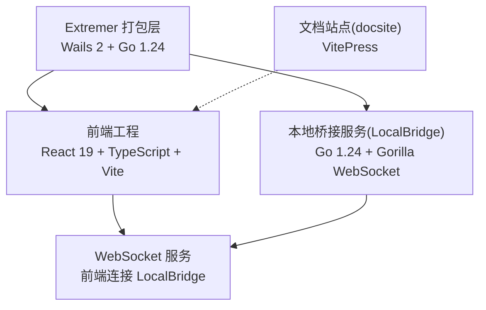
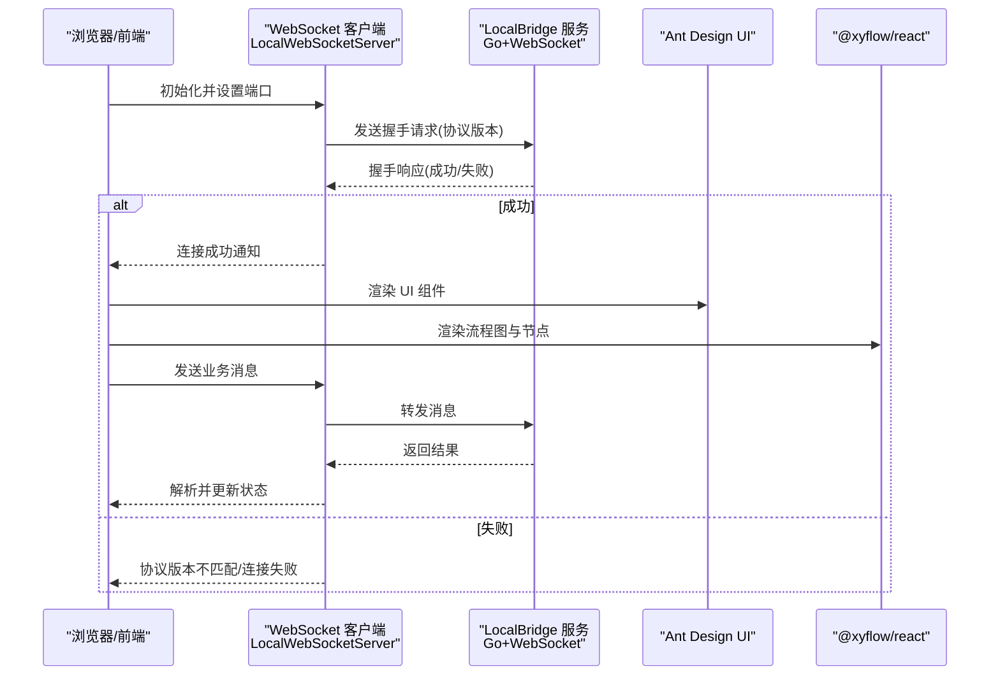
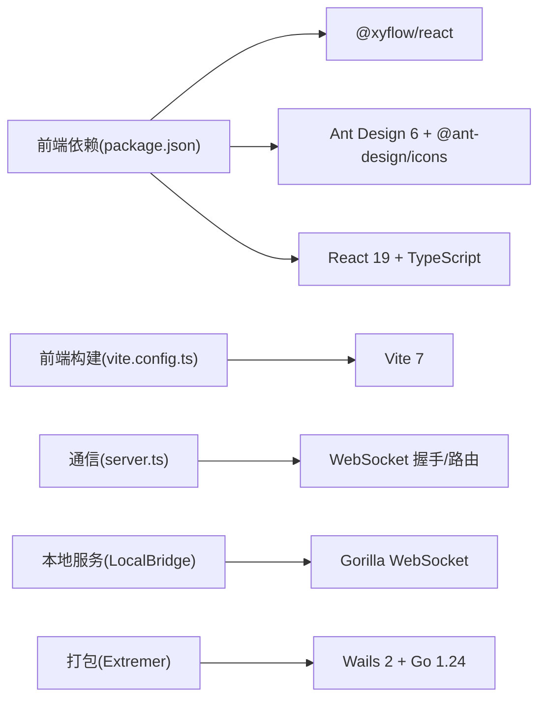

# 技术栈

<cite>
**本文引用的文件**
- [package.json](file://package.json)
- [vite.config.ts](file://vite.config.ts)
- [tsconfig.json](file://tsconfig.json)
- [eslint.config.js](file://eslint.config.js)
- [src/main.tsx](file://src/main.tsx)
- [src/App.tsx](file://src/App.tsx)
- [src/services/server.ts](file://src/services/server.ts)
- [src/styles/index.less](file://src/styles/index.less)
- [src/stores/flow/types.ts](file://src/stores/flow/types.ts)
- [Extremer/package.json](file://Extremer/package.json)
- [Extremer/wails.json](file://Extremer/wails.json)
- [Extremer/go.mod](file://Extremer/go.mod)
- [LocalBridge/package.json](file://LocalBridge/package.json)
- [LocalBridge/go.mod](file://LocalBridge/go.mod)
- [docsite/package.json](file://docsite/package.json)
</cite>

## 目录
1. [简介](#简介)
2. [项目结构](#项目结构)
3. [核心组件](#核心组件)
4. [架构总览](#架构总览)
5. [详细组件分析](#详细组件分析)
6. [依赖分析](#依赖分析)
7. [性能考量](#性能考量)
8. [故障排查指南](#故障排查指南)
9. [结论](#结论)
10. [附录](#附录)

## 简介
本文件系统性梳理 MaaPipelineEditor 的技术栈，覆盖前端（React 19、TypeScript 5.8、Less、Ant Design 6、@xyflow/react 等）、后端（Go 1.24、Gin/标准库、Gorilla WebSocket 等）与开发工具（Vite、ESLint、Prettier 等），并结合仓库中的实际配置文件进行版本与兼容性说明，给出技术选型优势、局限与演进方向，并提供学习路径与参考资料。

## 项目结构
项目采用多模块组织方式：
- 前端主工程：基于 Vite + React 19 + TypeScript，使用 Ant Design 6 与 @xyflow/react 构建可视化流程编辑器。
- 本地桥接服务（LocalBridge）：Go 实现的本地 WebSocket 服务，负责与前端通信、资源管理与设备交互。
- Extremer：基于 Wails 2 的原生打包层，用于将前端产物与本地服务打包为桌面应用。
- 文档站点（docsite）：基于 VitePress 的文档站点，辅助用户与开发者理解系统。

图表来源
- [src/main.tsx:1-18](file://src/main.tsx#L1-L18)
- [src/services/server.ts:20-333](file://src/services/server.ts#L20-L333)
- [Extremer/wails.json:1-18](file://Extremer/wails.json#L1-L18)
- [LocalBridge/go.mod:1-38](file://LocalBridge/go.mod#L1-L38)
- [docsite/package.json:1-22](file://docsite/package.json#L1-L22)

章节来源
- [package.json:1-65](file://package.json#L1-L65)
- [vite.config.ts:1-41](file://vite.config.ts#L1-L41)
- [Extremer/package.json:1-13](file://Extremer/package.json#L1-L13)
- [LocalBridge/package.json:1-8](file://LocalBridge/package.json#L1-L8)
- [docsite/package.json:1-22](file://docsite/package.json#L1-L22)

## 核心组件
- 前端框架与构建
  - React 19：用于声明式 UI 构建，配合 StrictMode 提升开发体验与早期问题发现。
  - TypeScript 5.8：强类型保障，配合多 tsconfig 引用实现分层配置。
  - Vite 7：快速开发与构建工具，支持多模式构建（stable/extremer/preview）。
  - Ant Design 6 + @ant-design/icons：企业级 UI 组件库与图标体系。
  - @xyflow/react：可视化流程图与节点/连线交互。
  - Less：CSS 预处理，统一主题与样式组织。
- 通信与协议
  - WebSocket：前端通过本地 WebSocket 与 LocalBridge 通信，内置握手与错误处理。
  - 协议版本控制：前端与后端通过协议版本协商，避免兼容性问题。
- 本地服务（Go）
  - Gorilla WebSocket：服务端 WebSocket 支持。
  - Maa Framework Go SDK：集成 MAA 框架能力。
  - Cobra/Viper：命令行与配置管理。
- 打包与分发
  - Wails 2：将前端与 Go 服务打包为原生桌面应用。
- 文档与站点
  - VitePress：文档站点，支持 LLM 插件与主题扩展。

章节来源
- [src/main.tsx:1-18](file://src/main.tsx#L1-L18)
- [src/App.tsx:1-333](file://src/App.tsx#L1-L333)
- [src/services/server.ts:20-333](file://src/services/server.ts#L20-L333)
- [src/styles/index.less:1-30](file://src/styles/index.less#L1-L30)
- [Extremer/wails.json:1-18](file://Extremer/wails.json#L1-L18)
- [LocalBridge/go.mod:1-38](file://LocalBridge/go.mod#L1-L38)
- [docsite/package.json:1-22](file://docsite/package.json#L1-L22)

## 架构总览
前端通过 WebSocket 与本地服务通信，遵循统一协议版本；Extremer 将前端与本地服务打包为桌面应用；文档站点提供用户与开发者指南。

图表来源
- [src/services/server.ts:20-333](file://src/services/server.ts#L20-L333)
- [src/App.tsx:208-270](file://src/App.tsx#L208-L270)

章节来源
- [src/services/server.ts:20-333](file://src/services/server.ts#L20-L333)
- [src/App.tsx:208-270](file://src/App.tsx#L208-L270)

## 详细组件分析

### 前端技术栈
- React 19
  - 使用 StrictMode 提升开发质量；入口在 main.tsx 中初始化 WebSocket 并渲染根组件。
  - 优势：并发特性、更优的开发体验；局限：生态适配需关注兼容性。
- TypeScript 5.8
  - 多 tsconfig 引用，分别覆盖应用与 Node 工具链配置，提升可维护性。
  - 优势：类型安全、IDE 支持；局限：复杂配置的学习成本。
- Vite 7
  - 多模式构建（stable/extremer/preview），别名 @ 指向 src，测试环境使用 happy-dom。
  - 优势：冷启动快、热更新高效；局限：部分插件生态差异。
- Ant Design 6 + @ant-design/icons
  - 统一 UI 设计语言，图标库丰富；@ant-design/v5-patch-for-react-19 保证兼容。
  - 优势：组件完善、主题定制；局限：体积与按需加载策略。
- @xyflow/react
  - 流程图与节点/连线交互，配合 zustand 状态管理与自定义节点类型。
  - 优势：可视化编辑体验；局限：复杂场景下性能与内存占用。
- Less/CSS
  - 样式模块化与主题统一，基础字体与全局样式在 index.less 中集中管理。
  - 优势：样式复用与主题一致性；局限：命名冲突与作用域管理。
- ESLint/Prettier
  - ESLint 使用 typescript-eslint 与 React Hooks/React Refresh 插件；Prettier 未在本仓库显式配置，建议与 ESLint 协同。
  - 优势：代码风格一致；局限：规则冲突需统一。

章节来源
- [src/main.tsx:1-18](file://src/main.tsx#L1-L18)
- [tsconfig.json:1-8](file://tsconfig.json#L1-L8)
- [vite.config.ts:1-41](file://vite.config.ts#L1-L41)
- [eslint.config.js:1-24](file://eslint.config.js#L1-L24)
- [src/styles/index.less:1-30](file://src/styles/index.less#L1-L30)
- [package.json:20-63](file://package.json#L20-L63)

### 本地服务（Go）技术栈
- Go 1.24/1.24.0
  - 版本要求明确，确保跨平台兼容与新特性支持。
- Gorilla WebSocket
  - 服务端 WebSocket 支持，与前端握手协议协同。
- Maa Framework Go SDK
  - 集成 MAA 框架能力，支持资源管理、设备与任务调度。
- Cobra/Viper
  - 命令行与配置管理，便于本地服务部署与运行。
- 日志与文件监控
  - Logrus 提供结构化日志；fsnotify 实现文件变更监听。

章节来源
- [LocalBridge/go.mod:1-38](file://LocalBridge/go.mod#L1-L38)
- [LocalBridge/package.json:1-8](file://LocalBridge/package.json#L1-L8)

### 打包与分发（Extremer + Wails 2）
- Wails 2
  - 将前端与 Go 服务打包为原生应用，配置文件包含产品信息与构建目录。
- 构建脚本
  - 支持 dev/build/all 模式，拷贝前端 dist 与默认配置至构建目录。
- Go 1.24
  - 与 Extremer 保持一致的 Go 版本，确保二进制兼容。

章节来源
- [Extremer/wails.json:1-18](file://Extremer/wails.json#L1-L18)
- [Extremer/package.json:1-13](file://Extremer/package.json#L1-L13)
- [Extremer/go.mod:1-39](file://Extremer/go.mod#L1-L39)

### 文档站点（VitePress）
- VitePress 1.5
  - 文档站点，支持 LLM 插件与主题扩展，Vue 3 驱动。
- 依赖：sass、vitepress-plugin-llms、vitepress-theme-teek 等。

章节来源
- [docsite/package.json:1-22](file://docsite/package.json#L1-L22)

## 依赖分析
- 前端依赖关系
  - React 19 与 Ant Design 6 生态紧密耦合，@ant-design/v5-patch-for-react-19 保证兼容。
  - @xyflow/react 提供流程图能力，zustand 作为轻量状态管理。
  - Less 与 Ant Design Less 样式文件共同构成 UI 主题。
- 通信协议
  - 前端通过 WebSocket 与 LocalBridge 通信，握手阶段校验协议版本，失败则主动断开。
- 打包层
  - Extremer 通过 Wails 2 将前端与本地服务整合为单体应用，构建脚本负责资源拷贝与配置注入。

图表来源
- [package.json:20-63](file://package.json#L20-L63)
- [vite.config.ts:1-41](file://vite.config.ts#L1-L41)
- [src/services/server.ts:20-333](file://src/services/server.ts#L20-L333)
- [LocalBridge/go.mod:1-38](file://LocalBridge/go.mod#L1-L38)
- [Extremer/wails.json:1-18](file://Extremer/wails.json#L1-L18)

章节来源
- [package.json:20-63](file://package.json#L20-L63)
- [vite.config.ts:1-41](file://vite.config.ts#L1-L41)
- [src/services/server.ts:20-333](file://src/services/server.ts#L20-L333)
- [LocalBridge/go.mod:1-38](file://LocalBridge/go.mod#L1-L38)
- [Extremer/wails.json:1-18](file://Extremer/wails.json#L1-L18)

## 性能考量
- 前端
  - 使用 Vite 7 提升开发与构建效率；@xyflow/react 在大规模节点/连线场景下需关注虚拟化与增量更新策略。
  - Zustand 轻量状态管理，建议按模块拆分 Store，避免全局抖动。
- 通信
  - WebSocket 握手与超时控制减少无效等待；建议对高频消息进行节流与批处理。
- 本地服务
  - Gorilla WebSocket 与 fsnotify 需注意高并发与文件系统事件风暴，必要时引入队列与背压机制。
- 打包
  - Wails 2 构建产物包含前端与本地服务，需关注体积与启动时间优化。

## 故障排查指南
- 连接失败/超时
  - 检查本地服务是否启动、端口是否正确；前端会显示错误提示并引导查看部署文档。
- 协议版本不匹配
  - 前端会在握手阶段检测版本并提示升级；需同步前后端版本。
- Wails 环境端口获取
  - 前端在 Wails 环境下优先通过桥接事件获取端口，若未触发需确认桥接服务状态。
- 样式与主题
  - index.less 中统一字体与全局样式，如出现异常可检查 Less 编译与覆盖顺序。

章节来源
- [src/services/server.ts:104-251](file://src/services/server.ts#L104-L251)
- [src/App.tsx:215-270](file://src/App.tsx#L215-L270)
- [src/styles/index.less:1-30](file://src/styles/index.less#L1-L30)

## 结论
本项目采用“现代前端 + Go 本地服务 + Wails 打包”的混合架构，前端以 React 19 + TypeScript + Ant Design 6 + @xyflow/react 构建可视化编辑器，后端以 Go 1.24 + Gorilla WebSocket 提供稳定通信与扩展能力，Extremer 与 Wails 2 实现跨平台桌面应用分发。整体技术栈成熟、生态完善，具备良好的可维护性与扩展性。建议持续关注前端性能优化、协议版本治理与打包体积控制。

## 附录
- 学习路径与参考资料
  - 前端：React 19、TypeScript 5.8、Vite 7、Ant Design 6、@xyflow/react、Less
  - 后端：Go 1.24、Gorilla WebSocket、Cobra/Viper、Logrus、fsnotify
  - 打包：Wails 2、Go 模块与构建脚本
  - 文档：VitePress、Vue 3
- 版本与兼容性
  - 前端：React 19、TypeScript 5.8、Vite 7、Ant Design 6、@xyflow/react
  - 后端：Go 1.24/1.24.0、Gorilla WebSocket、Maa Framework Go SDK
  - 打包：Wails 2、Go 1.24
  - 文档：VitePress 1.5、Vue 3