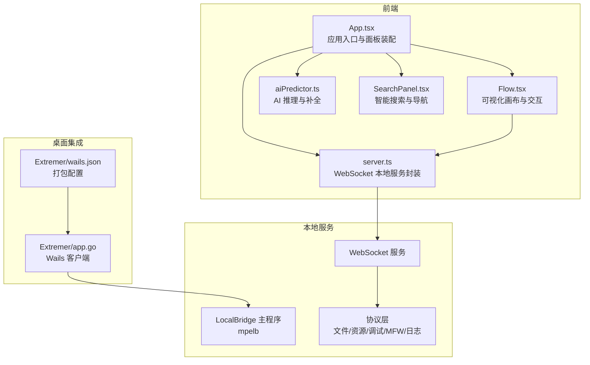
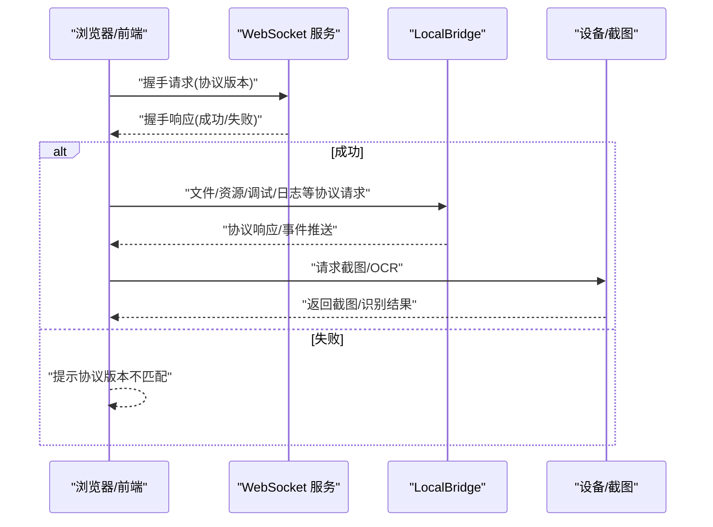
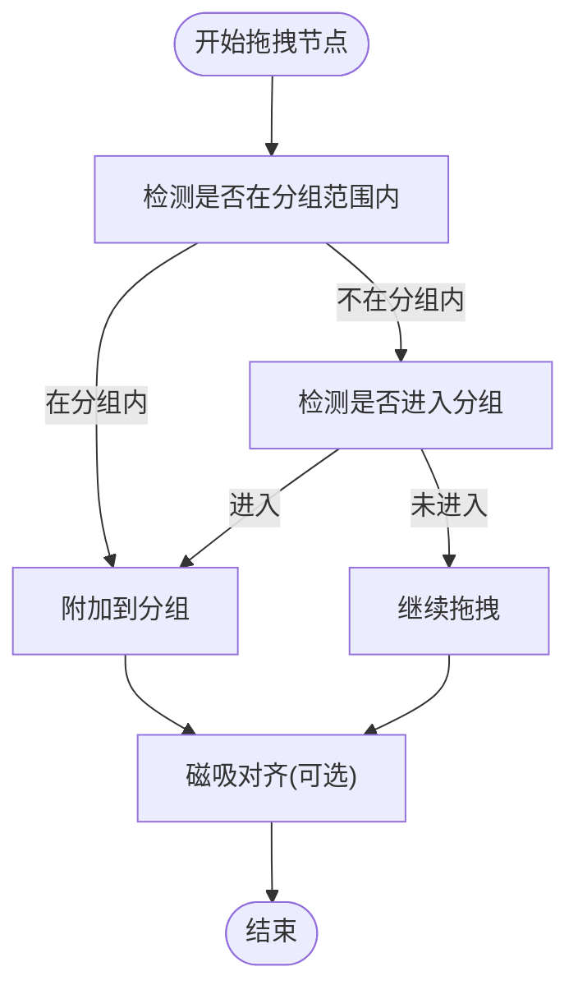
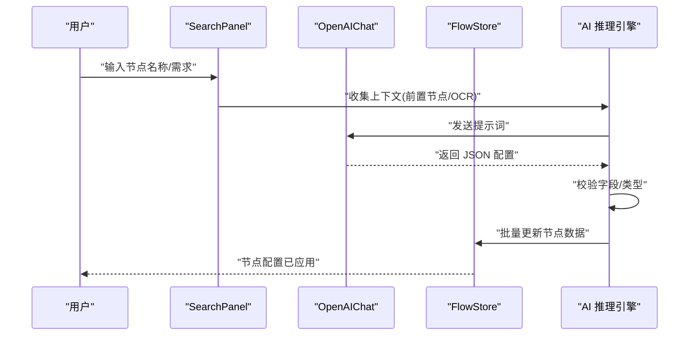
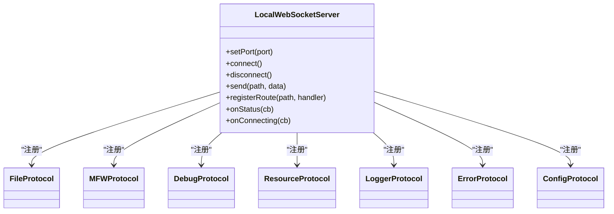
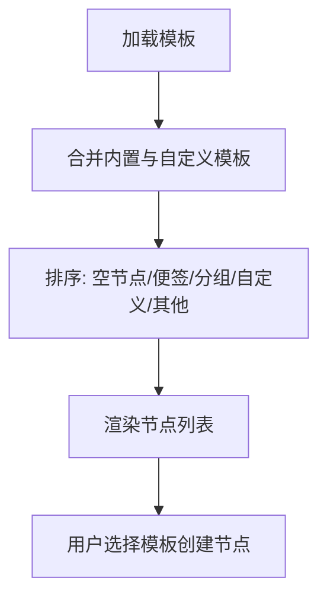
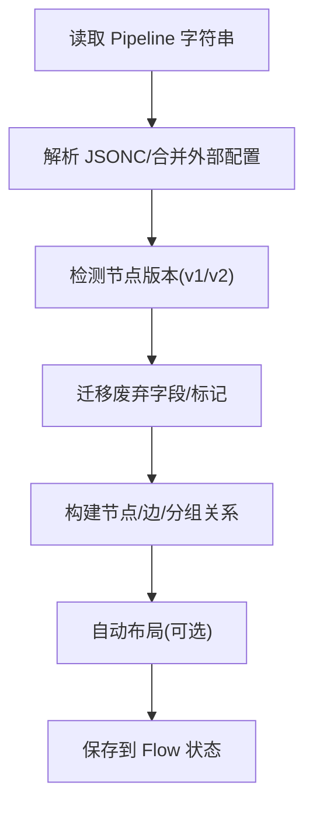
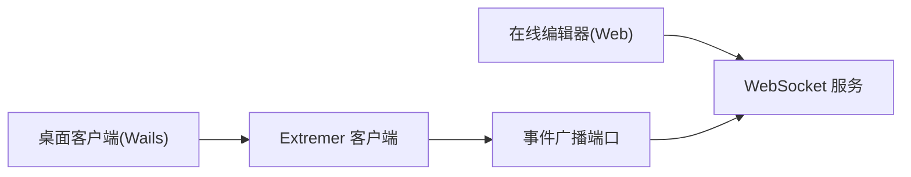
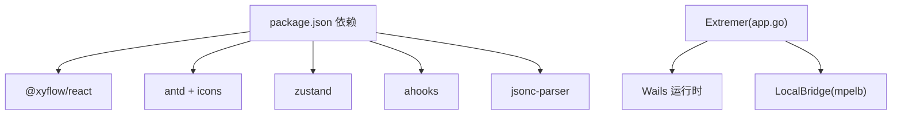

# 核心特性

<cite>
**本文引用的文件**
- [README.md](file://README.md)
- [App.tsx](file://src/App.tsx)
- [main.tsx](file://src/main.tsx)
- [Flow.tsx](file://src/components/Flow.tsx)
- [SearchPanel.tsx](file://src/components/panels/main/SearchPanel.tsx)
- [aiPredictor.ts](file://src/utils/aiPredictor.ts)
- [server.ts](file://src/services/server.ts)
- [wailsBridge.ts](file://src/utils/wailsBridge.ts)
- [nodeTemplates.ts](file://src/data/nodeTemplates.ts)
- [customTemplateStore.ts](file://src/stores/customTemplateStore.ts)
- [importer.ts](file://src/core/parser/importer.ts)
- [versionDetector.ts](file://src/core/parser/versionDetector.ts)
- [app.go](file://Extremer/app.go)
- [wails.json](file://Extremer/wails.json)
- [package.json](file://package.json)
</cite>

## 目录
1. [简介](#简介)
2. [项目结构](#项目结构)
3. [核心特性](#核心特性)
4. [架构总览](#架构总览)
5. [详细特性分析](#详细特性分析)
6. [依赖关系分析](#依赖关系分析)
7. [性能考量](#性能考量)
8. [故障排查指南](#故障排查指南)
9. [结论](#结论)
10. [附录](#附录)

## 简介
MaaPipelineEditor（MPE）是一款面向 MaaFramework Pipeline 的下一代可视化工作流编辑器，具备“所见即所得”的节点拖拽、连接与自动布局能力；提供 AI 辅助的智能节点搜索与配置补全；通过本地服务集成文件管理、截图工具与流程调试；支持内置与自定义节点模板；兼容旧项目一键导入与协议版本混合；并以 Web 技术实现真正的跨平台体验。

## 项目结构
MPE 采用前后端分离架构：前端基于 React + TypeScript + Vite，后端以 Go 实现的 LocalBridge 通过 WebSocket 与前端通信；同时提供 Wails 打包的桌面客户端（Extremer），在桌面环境下自动发现并连接 LocalBridge。

图表来源
- [App.tsx:111-333](file://src/App.tsx#L111-L333)
- [Flow.tsx:193-542](file://src/components/Flow.tsx#L193-L542)
- [server.ts:20-373](file://src/services/server.ts#L20-L373)
- [app.go:182-444](file://Extremer/app.go#L182-L444)
- [wails.json:1-18](file://Extremer/wails.json#L1-L18)

章节来源
- [README.md:31-91](file://README.md#L31-L91)
- [package.json:20-40](file://package.json#L20-L40)

## 核心特性
- 可视化工作流编辑器：节点拖拽、连接、自动布局、磁吸对齐、分组与便签
- AI 辅助功能：智能节点搜索、节点级 AI 配置补全
- 本地服务集成：文件管理、截图工具、流程调试、日志推送
- 模板系统：内置与自定义节点模板，支持导出/导入
- 全面兼容：旧项目一键导入、协议版本混合识别与迁移
- 跨平台支持：Web 原生跨平台，Wails 桌面集成

章节来源
- [README.md:37-91](file://README.md#L37-L91)

## 架构总览
前端通过 WebSocket 与 LocalBridge 通信，握手阶段校验协议版本；Wails 桌面端由 Extremer 负责启动 LocalBridge 并向前端广播端口，前端自动连接。AI 推理与搜索通过 OpenAIChat 与本地设备/截图能力协同。

图表来源
- [server.ts:105-251](file://src/services/server.ts#L105-L251)
- [server.ts:269-283](file://src/services/server.ts#L269-L283)
- [aiPredictor.ts:196-248](file://src/utils/aiPredictor.ts#L196-L248)

章节来源
- [server.ts:18-373](file://src/services/server.ts#L18-L373)
- [aiPredictor.ts:174-265](file://src/utils/aiPredictor.ts#L174-L265)

## 详细特性分析

### 1) 可视化工作流编辑器
- 节点与连接：基于 React Flow，支持节点拖拽、连接、选区右键菜单、自动布局
- 磁吸对齐：拖拽时计算对齐参考线，支持仅视口内对齐
- 分组与便签：支持创建分组、嵌套拖拽、脱离分组；便签节点用于标注
- 视口与缩放：支持最小/最大缩放、视口记忆与自动适配
- 交互快捷键：复制/粘贴、聚焦、自动布局等

图表来源
- [Flow.tsx:361-413](file://src/components/Flow.tsx#L361-L413)

章节来源
- [Flow.tsx:193-542](file://src/components/Flow.tsx#L193-L542)

### 2) AI 辅助功能
- 智能节点搜索：支持跨文件搜索、模糊匹配、AI 语义搜索
- 节点级 AI 补全：基于上下文（前置节点、OCR 结果）生成识别/动作配置
- 推理流程：构建提示词 → 调用 AI → 校验与应用 → 批量更新节点

图表来源
- [SearchPanel.tsx:206-273](file://src/components/panels/main/SearchPanel.tsx#L206-L273)
- [aiPredictor.ts:532-596](file://src/utils/aiPredictor.ts#L532-L596)

章节来源
- [SearchPanel.tsx:21-414](file://src/components/panels/main/SearchPanel.tsx#L21-L414)
- [aiPredictor.ts:1-785](file://src/utils/aiPredictor.ts#L1-L785)

### 3) 本地服务集成
- WebSocket 服务：统一协议路由、握手校验、连接状态管理
- 协议体系：文件、资源、调试、MFW、日志、错误等协议
- Wails 桥接：桌面端自动发现端口、事件监听、重启桥接
- 连接策略：URL 参数/配置端口优先，自动连接或手动连接

图表来源
- [server.ts:20-373](file://src/services/server.ts#L20-L373)

章节来源
- [server.ts:1-373](file://src/services/server.ts#L1-L373)
- [wailsBridge.ts:1-197](file://src/utils/wailsBridge.ts#L1-L197)
- [App.tsx:215-279](file://src/App.tsx#L215-L279)

### 4) 模板系统
- 内置模板：空节点、OCR/TemplateMatch/Click/Custom/External/Anchor/Sticker/Group 等
- 自定义模板：支持新增/删除/更新/导出/导入，本地持久化存储
- 模板排序：内置模板优先，便签/分组特殊处理，自定义模板按创建时间倒序

图表来源
- [nodeTemplates.ts:1-108](file://src/data/nodeTemplates.ts#L1-L108)
- [customTemplateStore.ts:50-94](file://src/stores/customTemplateStore.ts#L50-L94)
- [customTemplateStore.ts:212-248](file://src/stores/customTemplateStore.ts#L212-L248)

章节来源
- [nodeTemplates.ts:1-108](file://src/data/nodeTemplates.ts#L1-L108)
- [customTemplateStore.ts:1-310](file://src/stores/customTemplateStore.ts#L1-L310)

### 5) 全面兼容性
- 旧项目一键导入：支持 .json/.jsonc，自动解析配置、迁移废弃字段、混合 v1/v2 协议
- 协议版本检测：识别 recognition/action 字段版本，标准化类型
- 自动布局：无位置信息时自动排版，保持可读性

图表来源
- [importer.ts:155-507](file://src/core/parser/importer.ts#L155-L507)
- [versionDetector.ts:23-110](file://src/core/parser/versionDetector.ts#L23-L110)

章节来源
- [importer.ts:1-508](file://src/core/parser/importer.ts#L1-L508)
- [versionDetector.ts:1-149](file://src/core/parser/versionDetector.ts#L1-L149)

### 6) 跨平台支持
- Web 原生：React/Vite 构建，无需安装即可在线使用
- Wails 桌面：Extremer 打包，自动发现 LocalBridge 端口并连接
- 资源与路径：跨平台工作目录、日志目录、资源目录管理

图表来源
- [App.tsx:215-279](file://src/App.tsx#L215-L279)
- [wailsBridge.ts:79-93](file://src/utils/wailsBridge.ts#L79-L93)
- [app.go:416-444](file://Extremer/app.go#L416-L444)

章节来源
- [README.md:41-53](file://README.md#L41-L53)
- [wails.json:1-18](file://Extremer/wails.json#L1-L18)
- [package.json:1-65](file://package.json#L1-L65)

## 依赖关系分析
- 前端依赖：@xyflow/react（画布）、antd（UI）、zustand（状态）、ahooks（工具）、jsonc-parser（解析）
- 本地服务：Cobra 命令行、WebSocket 服务器、事件总线、MaaFramework 服务
- 桌面集成：Wails 运行时桥接、端口事件监听、重启桥接

图表来源
- [package.json:20-40](file://package.json#L20-L40)
- [app.go:1-620](file://Extremer/app.go#L1-L620)

章节来源
- [package.json:1-65](file://package.json#L1-L65)
- [app.go:1-620](file://Extremer/app.go#L1-L620)

## 性能考量
- 画布渲染：React Flow 的节点/边更新采用批量变更与防抖保存，避免频繁重绘
- 搜索与补全：输入防抖、AI 请求超时控制、OCR 截图超时保护
- 磁吸对齐：仅在视口内过滤节点，降低计算量
- 自动布局：仅在无位置信息时触发，避免不必要的重排

## 故障排查指南
- 连接失败/超时：检查 LocalBridge 是否启动、端口是否正确、协议版本是否匹配
- 协议不匹配：前端需求版本与本地服务版本不一致，按提示升级
- AI 推理异常：确认设备连接状态、OCR 权限、网络可达性
- 模板导入失败：检查模板数据格式与版本，清理损坏数据后重试

章节来源
- [server.ts:118-159](file://src/services/server.ts#L118-L159)
- [server.ts:182-250](file://src/services/server.ts#L182-L250)
- [aiPredictor.ts:192-248](file://src/utils/aiPredictor.ts#L192-L248)
- [customTemplateStore.ts:88-94](file://src/stores/customTemplateStore.ts#L88-L94)

## 结论
MPE 通过“可视化编辑 + AI 辅助 + 本地服务 + 模板系统 + 全面兼容 + 跨平台”的组合，为资源开发者提供高效、直观、可扩展的 Pipeline 编辑体验。其模块化的协议与桥接设计，既满足在线使用，也支持桌面一体化部署，兼顾易用性与工程化落地。

## 附录
- 使用示例与最佳实践
  - 可视化编辑：双击空白处打开节点添加面板，拖拽节点、连接端口、使用磁吸对齐
  - AI 搜索：在搜索面板输入节点名称或需求，使用普通搜索或 AI 搜索快速定位
  - 本地服务：通过 Wails 启动桌面端，自动连接 LocalBridge；或在非 Wails 环境手动指定端口
  - 模板复用：在节点列表中选择内置模板，或在节点编辑器中保存自定义模板
  - 兼容迁移：粘贴旧 Pipeline 或拖拽导入，系统自动识别版本并迁移字段

章节来源
- [README.md:92-121](file://README.md#L92-L121)
- [SearchPanel.tsx:154-174](file://src/components/panels/main/SearchPanel.tsx#L154-L174)
- [App.tsx:151-193](file://src/App.tsx#L151-L193)
- [customTemplateStore.ts:96-170](file://src/stores/customTemplateStore.ts#L96-L170)
- [importer.ts:155-507](file://src/core/parser/importer.ts#L155-L507)