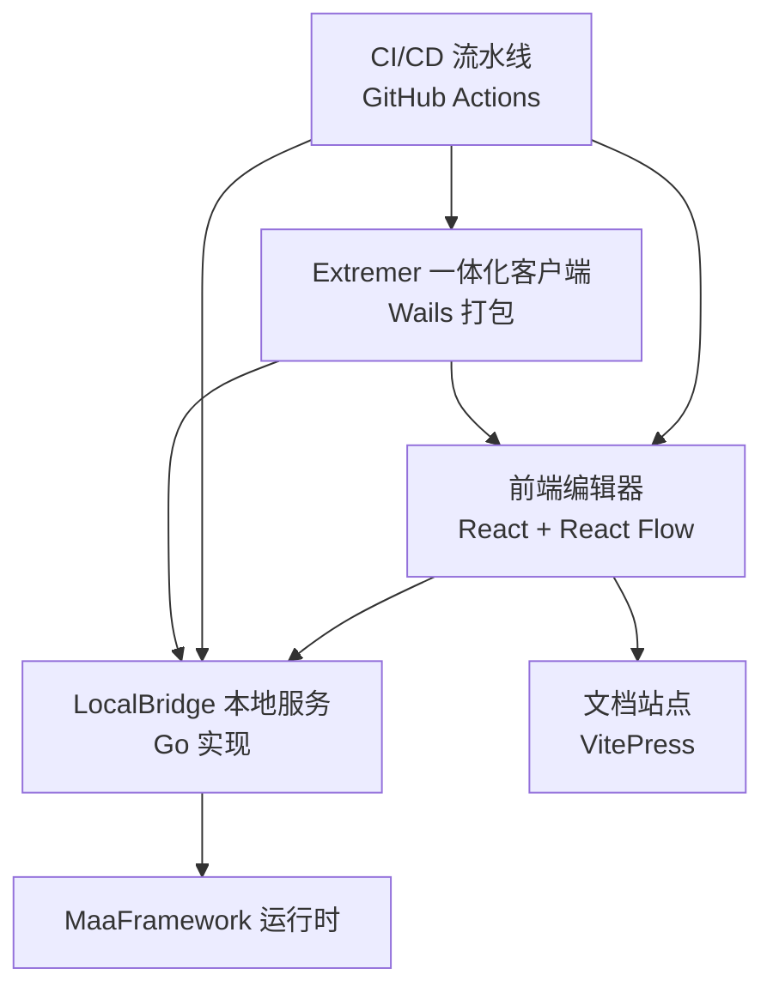
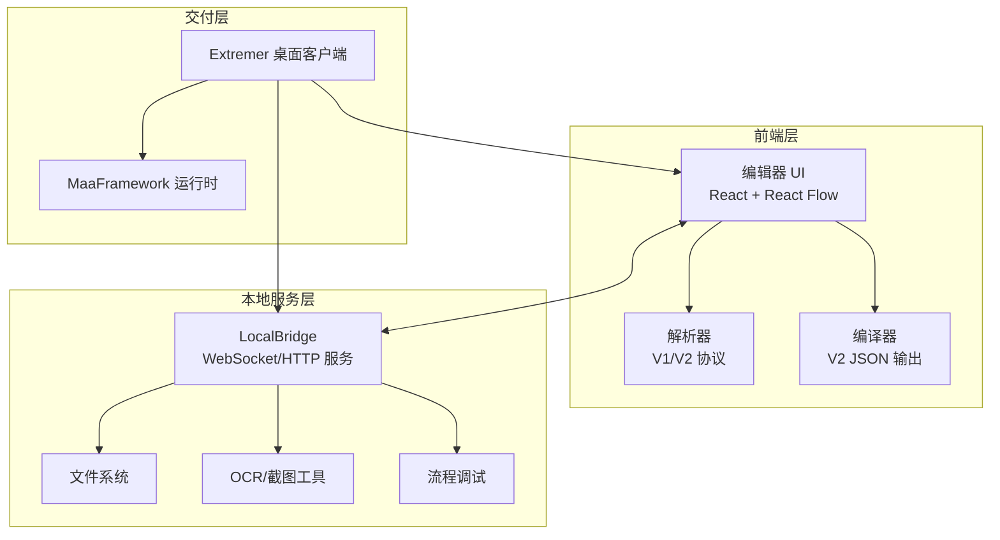
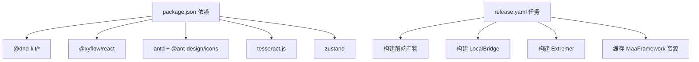

# 项目历史

<cite>
**本文引用的文件**
- [README.md](file://README.md)
- [package.json](file://package.json)
- [updateLogs.ts](file://src/data/updateLogs.ts)
- [release.yaml](file://.github/workflows/release.yaml)
- [Extremer/app.go](file://Extremer/app.go)
- [Extremer/wails.json](file://Extremer/wails.json)
- [LocalBridge/README.md](file://LocalBridge/README.md)
- [docsite/docs/01.指南/目录.md](file://docsite/docs/01.指南/目录.md)
- [docsite/docs/01.指南/100.其他/01.参与开发.md](file://docsite/docs/01.指南/100.其他/01.参与开发.md)
- [docsite/docs/01.指南/90.迁移/02.从 YAMaaPE 迁移.md](file://docsite/docs/01.指南/90.迁移/02.从 YAMaaPE 迁移.md)
- [docsite/docs/01.指南/01.开始/01.介绍.md](file://docsite/docs/01.指南/01.开始/01.介绍.md)
- [docsite/docs/01.指南/25.本地一体包/01.概览与部署.md](file://docsite/docs/01.指南/25.本地一体包/01.概览与部署.md)
- [LocalBridge/test-json/base/pipeline/通用/进入活动界面.json](file://LocalBridge/test-json/base/pipeline/通用/进入活动界面.json)
</cite>

## 目录
1. [简介](#简介)
2. [项目结构](#项目结构)
3. [核心组件](#核心组件)
4. [架构总览](#架构总览)
5. [详细里程碑分析](#详细里程碑分析)
6. [依赖关系分析](#依赖关系分析)
7. [性能考量](#性能考量)
8. [故障排查指南](#故障排查指南)
9. [结论](#结论)
10. [附录](#附录)

## 简介
本文件系统梳理 MaaPipelineEditor（MPE）的发展历程，从 2025 年 5 月的 YaMaaPE 原型，到 MNMA 实践（2025.5–8）、重构为 MaaPipelineEditor（2025.8–10）、LocalBridge 协议（2025.10–12）、MaaPipelineExtremer 一体化整合（2026.1）等关键里程碑。文档重点阐述每个阶段的技术突破、功能演进与架构变化，总结社区贡献与用户反馈的影响，并给出未来发展方向与规划。

## 项目结构
MPE 采用前后端分离架构：前端基于 React 与 React Flow 构建可视化编辑器；后端包含 LocalBridge 本地服务与 Extremer 一体化桌面客户端。文档站点与 CI/CD 流水线支撑发布与生态建设。

图表来源
- [README.md:33-35](file://README.md#L33-L35)
- [Extremer/wails.json:1-17](file://Extremer/wails.json#L1-L17)
- [release.yaml:13-489](file://.github/workflows/release.yaml#L13-L489)

章节来源
- [README.md:31-91](file://README.md#L31-L91)
- [package.json:1-65](file://package.json#L1-L65)

## 核心组件
- 前端编辑器：负责节点/边的可视化编辑、字段面板、连接与布局、导入导出、AI 辅助与调试。
- LocalBridge：本地服务，提供文件管理、截图工具、流程调试、热重载与日志查看等能力。
- Extremer：一体化桌面客户端，内置前端、LocalBridge 与 MaaFramework 运行环境，开箱即用。
- 文档与迁移：提供从 YaMaaPE 的迁移指南与 MNMA 示例，便于用户快速上手。
- CI/CD：自动化构建 Web、LocalBridge、Extremer 产物并发布。

章节来源
- [README.md:33-91](file://README.md#L33-L91)
- [docsite/docs/01.指南/25.本地一体包/01.概览与部署.md:10-49](file://docsite/docs/01.指南/25.本地一体包/01.概览与部署.md#L10-L49)
- [release.yaml:13-489](file://.github/workflows/release.yaml#L13-L489)

## 架构总览
MPE 的架构围绕“可视化编辑 + 本地能力扩展 + 一体化交付”的目标演进。前端通过协议与 LocalBridge 通信，实现文件同步、截图与调试；Extremer 将前端与 LocalBridge 打包为单机应用，降低使用门槛。

图表来源
- [docsite/docs/01.指南/01.开始/01.介绍.md:14-22](file://docsite/docs/01.指南/01.开始/01.介绍.md#L14-L22)
- [docsite/docs/01.指南/25.本地一体包/01.概览与部署.md:10-22](file://docsite/docs/01.指南/25.本地一体包/01.概览与部署.md#L10-L22)
- [Extremer/app.go:290-304](file://Extremer/app.go#L290-L304)

## 详细里程碑分析

### YaMaaPE 原型（2025.5）
- 背景：为满足资源开发对 Pipeline 的可视化需求，早期以 Vue3 + VueFlow 实现原型，支持 Pipeline V1 协议。
- 影响：奠定后续 MPE 的可视化编辑与协议兼容基础，虽已停止维护，但其经验被 MPE 充分吸收。
- 关键点：协议支持局限、旧项目兼容度不足，促使后续重构。

章节来源
- [docsite/docs/01.指南/01.开始/01.介绍.md:34-38](file://docsite/docs/01.指南/01.开始/01.介绍.md#L34-L38)
- [README.md:148](file://README.md#L148)

### MNMA 实践（2025.5–8）
- 背景：MPE 最初为辅助构建 MNMA 项目而生，在实践中逐步完善协议解析、节点样式与交互体验。
- 成果：从原型走向可用，逐步解耦，形成可复用的编辑器能力。
- 用户反馈：推动了协议兼容、自动布局与导入导出体验的改进。

章节来源
- [docsite/docs/01.指南/01.开始/01.介绍.md:11-12](file://docsite/docs/01.指南/01.开始/01.介绍.md#L11-L12)

### 重构为 MaaPipelineEditor（2025.8–10）
- 技术突破：采用 React + React Flow 替代 Vue3，支持 V1/V2 协议混合导入，增强字段解析与模板体系。
- 功能改进：引入自动布局、节点聚焦/高亮、连接中点拖拽、便签与分组等交互能力。
- 架构演进：前后端分离，协议抽象清晰，为 LocalBridge 与 Extremer 打下基础。

章节来源
- [README.md:33-91](file://README.md#L33-L91)
- [docsite/docs/01.指南/01.开始/01.介绍.md:14-22](file://docsite/docs/01.指南/01.开始/01.介绍.md#L14-L22)

### LocalBridge 协议（2025.10–12）
- 技术突破：定义并实现 LocalBridge 协议，提供文件管理、截图工具、流程调试、热重载与日志查看。
- 功能改进：前后端通过 WebSocket/HTTP 通信，支持跨文件搜索与跳转、模板图片选择、现代节点样式等。
- 架构演进：前端与本地服务解耦，支持分离/集成两种使用模式，提升可扩展性与用户体验。

章节来源
- [README.md:145](file://README.md#L145)
- [docsite/docs/01.指南/25.本地一体包/01.概览与部署.md:10-22](file://docsite/docs/01.指南/25.本地一体包/01.概览与部署.md#L10-L22)
- [Extremer/app.go:290-304](file://Extremer/app.go#L290-L304)

### MaaPipelineExtremer 一体化整合（2026.1）
- 技术突破：Wails 打包前端与 LocalBridge，内置 MaaFramework 运行时与 OCR 资源，实现“开箱即用”。
- 功能改进：自动初始化工作目录、端口分配与后端服务，支持自动更新与跨平台交付。
- 架构演进：从“在线编辑 + 本地服务”升级为“一体化桌面客户端”，降低用户使用门槛，提升长期使用体验。

章节来源
- [README.md:144](file://README.md#L144)
- [docsite/docs/01.指南/25.本地一体包/01.概览与部署.md:10-49](file://docsite/docs/01.指南/25.本地一体包/01.概览与部署.md#L10-L49)
- [release.yaml:249-401](file://.github/workflows/release.yaml#L249-L401)

### 节点扩展与交互优化（2026.1–至今）
- 功能演进：新增便签节点、节点分组、实时渲染窗口、磁吸对齐、节点端点位置可调、模板与 AI 辅助等。
- 性能优化：自动布局、延迟默认值优化、导出字段排序稳定、文件列表排序稳定性、LB 启动目录安全检查等。
- 兼容性：支持 DirectHit 系列字段、WithPseudoMinimize/WithWindowPos 输入方案、负数 ROI/Target 渲染提示等。

章节来源
- [README.md:143](file://README.md#L143)
- [src/data/updateLogs.ts:49-659](file://src/data/updateLogs.ts#L49-L659)

## 依赖关系分析
- 前端依赖：React 19、React Flow 12、Ant Design 6、Zustand 状态管理、Tesseract.js OCR 等。
- 后端依赖：Go 语言生态，WebSocket/HTTP 服务，文件系统扫描与监听，日志与错误处理。
- 交付依赖：Wails 打包、GitHub Actions 自动化、MaaFramework 资源缓存与并行下载。

图表来源
- [package.json:20-40](file://package.json#L20-L40)
- [release.yaml:70-149](file://.github/workflows/release.yaml#L70-L149)
- [release.yaml:158-248](file://.github/workflows/release.yaml#L158-L248)

章节来源
- [package.json:1-65](file://package.json#L1-L65)
- [release.yaml:13-489](file://.github/workflows/release.yaml#L13-L489)

## 性能考量
- 前端性能：节点较多时拖拽面板渲染性能优化、自动布局算法改进、响应式显示优化。
- 本地服务：连接超时检查、日志分级输出、热重载与配置变更检测、LB 启动目录安全检查。
- 交付优化：Extremer 自动连接稳定性、资源打包体积控制（仅复制 bin 目录）、并行下载 MaaFramework 资源。

章节来源
- [src/data/updateLogs.ts:117-124](file://src/data/updateLogs.ts#L117-L124)
- [Extremer/app.go:306-311](file://Extremer/app.go#L306-L311)
- [release.yaml:215-241](file://.github/workflows/release.yaml#L215-L241)

## 故障排查指南
- 连接问题：检查 LocalBridge 是否启动、端口是否正确、工作目录路径是否有效；可通过 Extremer 的日志窗口与 LB 命令查看日志。
- 导入导出：确认协议版本（V1/V2 混合导入）、字段类型与预设一致性；必要时启用忽略字段校验选项。
- 文件同步：确保本地文件监控生效，避免删除/重命名/新增目录导致的同步丢失。
- Extremer 闪退：检查运行时资源完整性与端口占用，必要时重启 LocalBridge 或重新初始化工作目录。

章节来源
- [docsite/docs/01.指南/25.本地一体包/01.概览与部署.md:23-39](file://docsite/docs/01.指南/25.本地一体包/01.概览与部署.md#L23-L39)
- [src/data/updateLogs.ts:125-139](file://src/data/updateLogs.ts#L125-L139)

## 结论
MPE 的发展历程体现了从原型到成熟工具的完整演进：以 YaMaaPE 为基础，通过 MNMA 实践沉淀能力，借助 LocalBridge 实现本地能力扩展，最终以 Extremer 一体化交付提升用户体验。未来将持续优化节点扩展与交互体验，强化 AI 辅助与协议兼容，完善文档与社区协作机制，推动 MPE 成为 MaaFramework 生态中不可或缺的可视化编辑工具。

## 附录

### 项目统计数据与社区活跃度
- Star 历史：通过 Star History Chart 可观测项目长期增长趋势。
- 社区交流：通过 MaaFramework 集成/开发交流 QQ 群进行讨论与反馈。
- 贡献者：贡献者图像展示团队协作成果。

章节来源
- [README.md:150](file://README.md#L150)
- [docsite/docs/01.指南/100.其他/01.参与开发.md:18-21](file://docsite/docs/01.指南/100.其他/01.参与开发.md#L18-L21)

### 用户增长与使用场景
- 在线编辑器与文档站：提供稳定版与预览版，覆盖广泛用户群体。
- 应用场景展示：支持复杂 Pipeline 的可视化编辑与审阅，便于快速理解他人实现逻辑。

章节来源
- [README.md:114-121](file://README.md#L114-L121)
- [README.md:92-113](file://README.md#L92-L113)

### 迁移与兼容性
- YaMaaPE 迁移：保留特殊字段兼容，手动调整 MaaFramework 4.5 前字段，随后使用 v1 协议导入，再使用 v2 导入。
- MNMA 示例：提供复杂 Pipeline 示例，便于理解与迁移。

章节来源
- [docsite/docs/01.指南/90.迁移/02.从 YAMaaPE 迁移.md:10-17](file://docsite/docs/01.指南/90.迁移/02.从 YAMaaPE 迁移.md#L10-L17)
- [docsite/docs/01.指南/90.迁移/01.导入已有文件.md:155-159](file://docsite/docs/01.指南/90.迁移/01.导入已有文件.md#L155-L159)