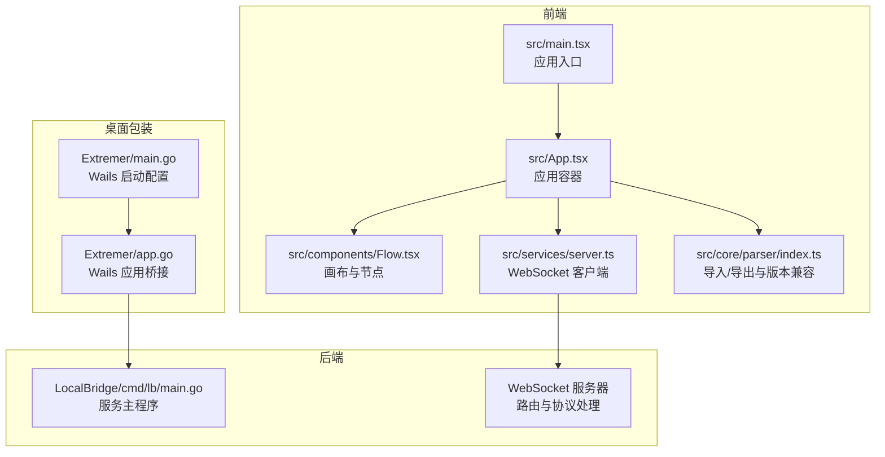
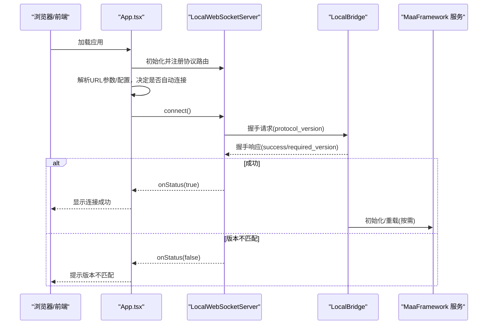
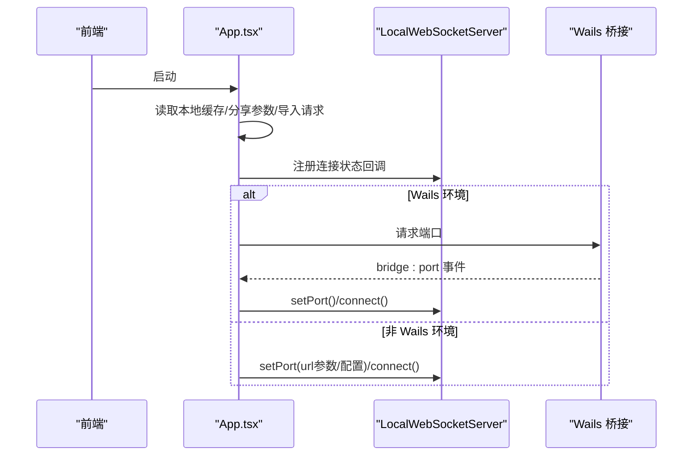
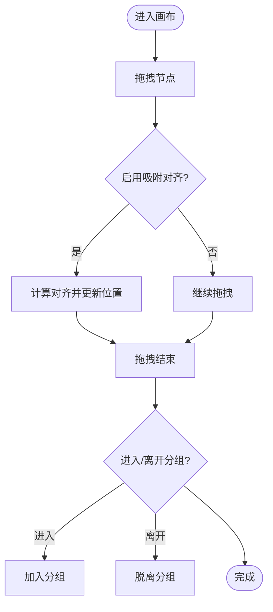
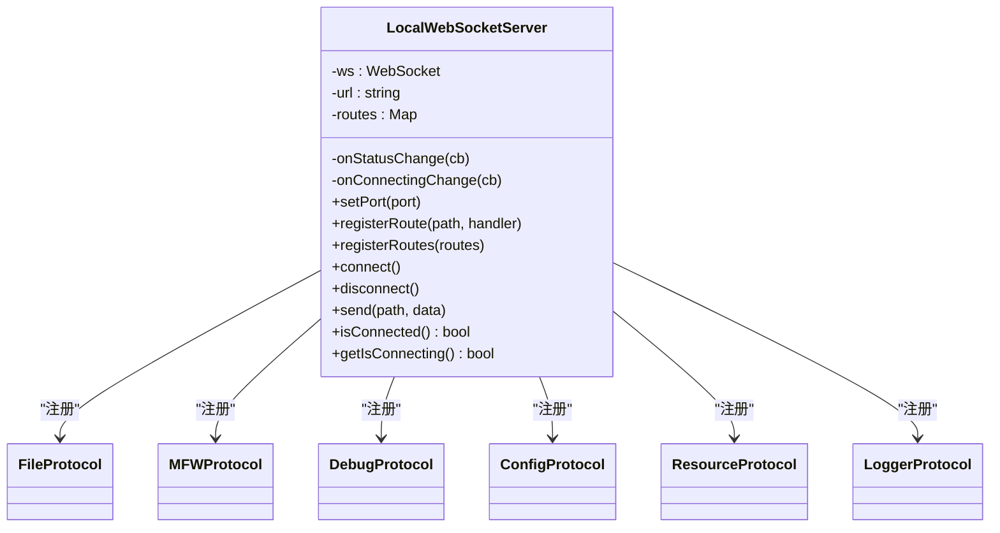
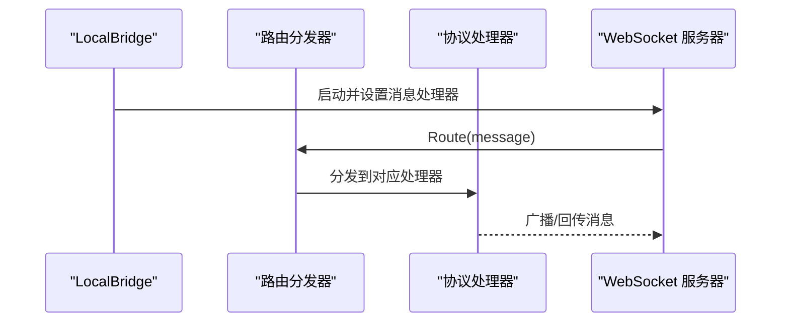
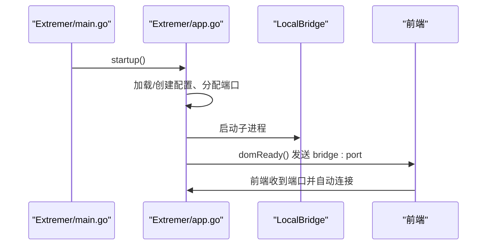
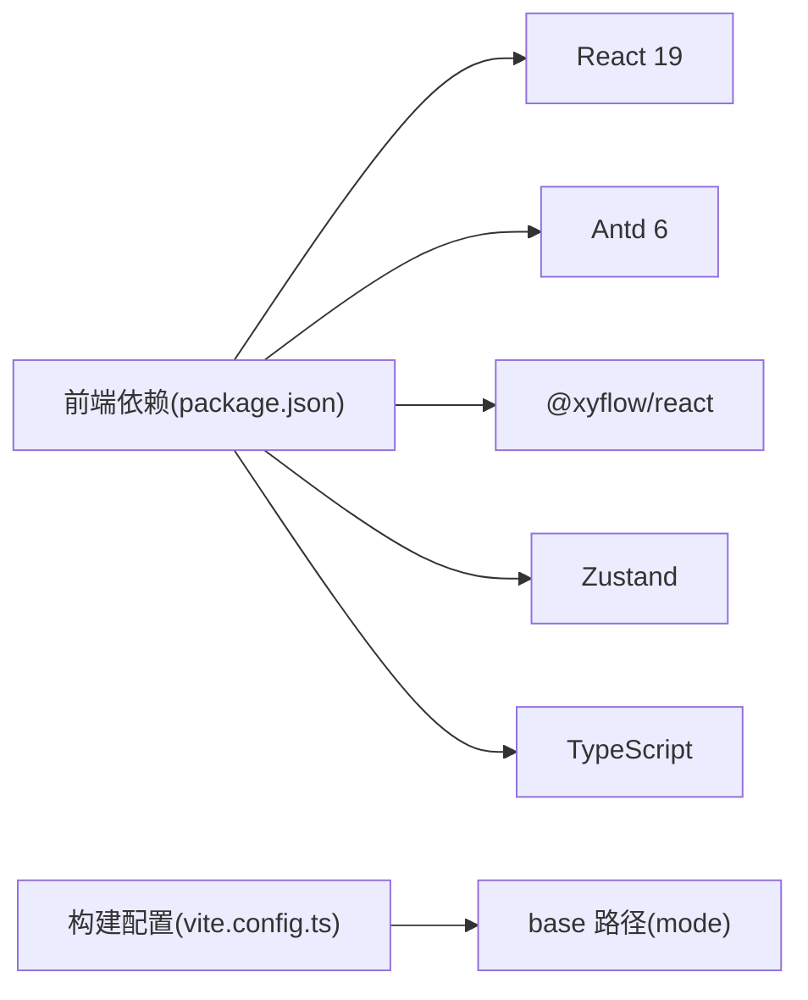

# 项目概述

<cite>
**本文引用的文件**
- [README.md](file://README.md)
- [package.json](file://package.json)
- [vite.config.ts](file://vite.config.ts)
- [src/main.tsx](file://src/main.tsx)
- [src/App.tsx](file://src/App.tsx)
- [src/components/Flow.tsx](file://src/components/Flow.tsx)
- [src/services/server.ts](file://src/services/server.ts)
- [src/stores/wsStore.ts](file://src/stores/wsStore.ts)
- [src/core/parser/index.ts](file://src/core/parser/index.ts)
- [Extremer/app.go](file://Extremer/app.go)
- [Extremer/main.go](file://Extremer/main.go)
- [Extremer/wails.json](file://Extremer/wails.json)
- [LocalBridge/cmd/lb/main.go](file://LocalBridge/cmd/lb/main.go)
</cite>

## 目录
1. [简介](#简介)
2. [项目结构](#项目结构)
3. [核心组件](#核心组件)
4. [架构总览](#架构总览)
5. [详细组件分析](#详细组件分析)
6. [依赖分析](#依赖分析)
7. [性能考虑](#性能考虑)
8. [故障排查指南](#故障排查指南)
9. [结论](#结论)
10. [附录](#附录)

## 简介
MaaPipelineEditor（MPE）是一个面向 MaaFramework Pipeline 的下一代可视化工作流编辑器，目标是解决传统手工编写 Pipeline JSON 的繁琐与易错问题。它提供：
- 可视化编辑与拖拽配置
- 流程级调试与实时屏幕预览
- 识别/动作节点的字段级辅助与模板复用
- 与 MaaFramework 的深度集成（通过 LocalBridge 与 MaaFramework 库对接）
- 前后端分离 + Wails 桌面包装器，既可在线使用，也可打包为桌面应用

MPE 的核心价值在于“所见即所得”的工作流设计体验，结合本地服务提供的文件管理、截图、OCR、设备控制等能力，显著降低资源开发门槛，提升效率与可读性。

**章节来源**
- [README.md:30-120](file://README.md#L30-L120)

## 项目结构
项目采用前后端分离架构：
- 前端：基于 React 19 + TypeScript，使用 Vite 构建，组件化程度高，状态管理采用 Zustand
- 后端：Go 语言实现的 LocalBridge，提供 WebSocket 服务，承载文件管理、MaaFramework 集成、日志推送等能力
- 桌面包装：Wails v2 将前端资源嵌入 Go 应用，形成可分发的桌面客户端（Extremer）

**图表来源**
- [src/main.tsx:1-18](file://src/main.tsx#L1-L18)
- [src/App.tsx:110-333](file://src/App.tsx#L110-L333)
- [src/components/Flow.tsx:193-542](file://src/components/Flow.tsx#L193-L542)
- [src/services/server.ts:20-373](file://src/services/server.ts#L20-L373)
- [LocalBridge/cmd/lb/main.go:182-440](file://LocalBridge/cmd/lb/main.go#L182-L440)
- [Extremer/app.go:181-304](file://Extremer/app.go#L181-L304)
- [Extremer/main.go:26-89](file://Extremer/main.go#L26-L89)

**章节来源**
- [package.json:1-65](file://package.json#L1-L65)
- [vite.config.ts:1-41](file://vite.config.ts#L1-L41)
- [src/main.tsx:1-18](file://src/main.tsx#L1-L18)
- [src/App.tsx:110-333](file://src/App.tsx#L110-L333)
- [src/components/Flow.tsx:193-542](file://src/components/Flow.tsx#L193-L542)
- [src/services/server.ts:20-373](file://src/services/server.ts#L20-L373)
- [LocalBridge/cmd/lb/main.go:182-440](file://LocalBridge/cmd/lb/main.go#L182-L440)
- [Extremer/app.go:181-304](file://Extremer/app.go#L181-L304)
- [Extremer/main.go:26-89](file://Extremer/main.go#L26-L89)

## 核心组件
- 前端应用入口与初始化
  - 应用入口负责初始化 WebSocket、挂载主题与全局组件
  - 参考：[src/main.tsx:1-18](file://src/main.tsx#L1-L18)
- 应用容器与页面布局
  - App 组件负责文件拖拽导入、分享参数处理、Wails 环境桥接、自动连接本地服务等
  - 参考：[src/App.tsx:110-333](file://src/App.tsx#L110-L333)
- 画布与节点系统
  - 基于 React Flow，提供节点增删改、连线、分组、吸附对齐、内联字段面板等
  - 参考：[src/components/Flow.tsx:193-542](file://src/components/Flow.tsx#L193-L542)
- WebSocket 通信层
  - 封装握手、路由注册、连接状态管理、错误提示与自动重连策略
  - 参考：[src/services/server.ts:20-373](file://src/services/server.ts#L20-L373)
- 状态管理
  - WebSocket 连接状态 Store，用于 UI 展示与交互反馈
  - 参考：[src/stores/wsStore.ts:1-24](file://src/stores/wsStore.ts#L1-L24)
- Pipeline 解析与导入导出
  - 提供 Flow 与 Pipeline 的双向转换、配置拆分合并、版本兼容与类型匹配
  - 参考：[src/core/parser/index.ts:1-85](file://src/core/parser/index.ts#L1-L85)

**章节来源**
- [src/main.tsx:1-18](file://src/main.tsx#L1-L18)
- [src/App.tsx:110-333](file://src/App.tsx#L110-L333)
- [src/components/Flow.tsx:193-542](file://src/components/Flow.tsx#L193-L542)
- [src/services/server.ts:20-373](file://src/services/server.ts#L20-L373)
- [src/stores/wsStore.ts:1-24](file://src/stores/wsStore.ts#L1-L24)
- [src/core/parser/index.ts:1-85](file://src/core/parser/index.ts#L1-L85)

## 架构总览
MPE 采用“前端可视化 + 后端本地服务 + 桌面包装器”的三层架构：
- 前端通过 WebSocket 与 LocalBridge 通信，遵循统一协议（握手、路由、消息体）
- LocalBridge 作为网关，负责文件扫描、资源管理、MaaFramework 服务初始化与事件广播
- Wails 将前端资源与 LocalBridge 打包为桌面应用，自动分配端口并桥接事件

**图表来源**
- [src/App.tsx:208-270](file://src/App.tsx#L208-L270)
- [src/services/server.ts:37-65](file://src/services/server.ts#L37-L65)
- [LocalBridge/cmd/lb/main.go:317-420](file://LocalBridge/cmd/lb/main.go#L317-L420)

**章节来源**
- [src/App.tsx:208-270](file://src/App.tsx#L208-L270)
- [src/services/server.ts:37-65](file://src/services/server.ts#L37-L65)
- [LocalBridge/cmd/lb/main.go:317-420](file://LocalBridge/cmd/lb/main.go#L317-L420)

## 详细组件分析

### 前端应用与桌面桥接
- 应用入口负责初始化 WebSocket 并注册协议路由
- App 组件处理拖拽导入、分享参数、Wails 环境下的端口事件监听与自动连接
- 在非 Wails 环境下，支持通过 URL 参数或配置端口进行连接

**图表来源**
- [src/main.tsx:1-18](file://src/main.tsx#L1-L18)
- [src/App.tsx:150-293](file://src/App.tsx#L150-L293)
- [src/services/server.ts:76-103](file://src/services/server.ts#L76-L103)

**章节来源**
- [src/main.tsx:1-18](file://src/main.tsx#L1-L18)
- [src/App.tsx:150-293](file://src/App.tsx#L150-L293)
- [src/services/server.ts:76-103](file://src/services/server.ts#L76-L103)

### 画布与节点系统
- 基于 React Flow，提供节点拖拽、吸附对齐、分组、内联字段面板、边连接等
- 通过 Zustand 管理节点/边/选区/视口状态，自动保存与防抖更新
- 支持键盘快捷键（复制/粘贴）、右键菜单、双击添加节点等

**图表来源**
- [src/components/Flow.tsx:296-413](file://src/components/Flow.tsx#L296-L413)

**章节来源**
- [src/components/Flow.tsx:193-542](file://src/components/Flow.tsx#L193-L542)

### WebSocket 通信与协议
- 握手阶段校验协议版本，不匹配则断开并提示
- 支持连接超时、错误提示、断开通知与状态回调
- 路由注册后，按 path 分发消息到对应处理器

**图表来源**
- [src/services/server.ts:20-373](file://src/services/server.ts#L20-L373)

**章节来源**
- [src/services/server.ts:20-373](file://src/services/server.ts#L20-L373)

### LocalBridge 本地服务
- 负责文件扫描、资源扫描、MaaFramework 服务初始化与重载、日志推送、更新检查
- 通过 WebSocket 路由分发器将消息分派给具体协议处理器（文件、MFW、调试、资源、配置、工具）
- 支持安全检查（目录风险提示）、便携模式、命令行配置管理

**图表来源**
- [LocalBridge/cmd/lb/main.go:385-420](file://LocalBridge/cmd/lb/main.go#L385-L420)

**章节来源**
- [LocalBridge/cmd/lb/main.go:182-440](file://LocalBridge/cmd/lb/main.go#L182-L440)

### Wails 桌面包装器
- Extremer 负责加载/创建 LocalBridge 配置、分配端口、启动子进程、桥接事件
- main.go 配置窗口、资源嵌入、启动画面、生命周期回调
- 支持打开工作目录、日志目录、资源目录，以及重启 LocalBridge

**图表来源**
- [Extremer/main.go:26-89](file://Extremer/main.go#L26-L89)
- [Extremer/app.go:181-304](file://Extremer/app.go#L181-L304)
- [Extremer/app.go:415-444](file://Extremer/app.go#L415-L444)

**章节来源**
- [Extremer/main.go:26-89](file://Extremer/main.go#L26-L89)
- [Extremer/app.go:181-304](file://Extremer/app.go#L181-L304)
- [Extremer/app.go:415-444](file://Extremer/app.go#L415-L444)

## 依赖分析
- 前端依赖
  - React 19、Ant Design 6、React Flow、Zustand、ahooks、tesseract.js 等
  - 参考：[package.json:20-40](file://package.json#L20-L40)
- 构建与测试
  - Vite、ESLint、TypeScript、React Testing Library、vitest 等
  - 参考：[package.json:41-63](file://package.json#L41-L63)
- 构建基座
  - Vite 配置按模式（stable/preview/extremer）设置 base 路径
  - 参考：[vite.config.ts:5-13](file://vite.config.ts#L5-L13)

**图表来源**
- [package.json:20-63](file://package.json#L20-L63)
- [vite.config.ts:5-13](file://vite.config.ts#L5-L13)

**章节来源**
- [package.json:20-63](file://package.json#L20-L63)
- [vite.config.ts:5-13](file://vite.config.ts#L5-L13)

## 性能考虑
- 前端
  - React 19 与 React Flow 的组合在大规模节点/边场景下，建议：
    - 合理使用 memo 与浅比较（useShallow）
    - 对频繁变更的节点/边进行防抖更新（debounce）
    - 控制吸附对齐范围（仅视口内）以减少计算量
  - 参考：[src/components/Flow.tsx:117-147](file://src/components/Flow.tsx#L117-L147)
- 通信层
  - WebSocket 握手与路由分发应尽量轻量化，避免在 onmessage 中做重型计算
  - 连接超时与错误提示需及时反馈，避免 UI 卡顿
  - 参考：[src/services/server.ts:104-251](file://src/services/server.ts#L104-L251)
- 本地服务
  - 文件扫描与资源扫描应限制深度与数量，避免阻塞
  - MFW 服务初始化失败时降级为文件管理功能，保证基本可用
  - 参考：[LocalBridge/cmd/lb/main.go:222-254](file://LocalBridge/cmd/lb/main.go#L222-L254)

[本节为通用指导，不涉及具体文件分析]

## 故障排查指南
- 连接失败/超时
  - 检查 LocalBridge 是否已启动、端口是否被占用
  - 查看前端通知与日志，确认是否因协议版本不匹配导致握手失败
  - 参考：[src/services/server.ts:127-159](file://src/services/server.ts#L127-L159)
- Wails 环境无法自动连接
  - 确认已收到 bridge:port 事件，或手动设置端口后重试
  - 参考：[src/App.tsx:215-269](file://src/App.tsx#L215-L269)
- LocalBridge 启动异常
  - 检查配置文件路径有效性、MaaFramework 路径与资源路径
  - 参考：[Extremer/app.go:306-351](file://Extremer/app.go#L306-L351)
- 协议版本不匹配
  - 前端与后端协议版本需一致，升级任一侧后需同步
  - 参考：[src/services/server.ts:40-63](file://src/services/server.ts#L40-L63)

**章节来源**
- [src/services/server.ts:127-159](file://src/services/server.ts#L127-L159)
- [src/App.tsx:215-269](file://src/App.tsx#L215-L269)
- [Extremer/app.go:306-351](file://Extremer/app.go#L306-L351)
- [src/services/server.ts:40-63](file://src/services/server.ts#L40-L63)

## 结论
MaaPipelineEditor 通过“可视化 + 本地能力 + 桌面包装”的架构，将复杂的 Pipeline 编排工作变得直观、高效且可扩展。其前后端分离设计便于独立演进，Wails 包装器提供了良好的用户体验与分发方式。随着 MaaFramework 的演进，MPE 将持续在兼容性与智能化（如 AI 辅助）方面迭代，满足资源开发者不断增长的需求。

[本节为总结性内容，不涉及具体文件分析]

## 附录
- 技术栈概览
  - 前端：React 19、TypeScript、Ant Design、React Flow、Zustand、Vite
  - 后端：Go 1.24、Cobra、WebSocket、事件总线
  - 桌面：Wails v2
  - 参考：[README.md:14-17](file://README.md#L14-L17)、[package.json:20-63](file://package.json#L20-L63)
- 演进历史与里程碑
  - 2026.1：一体化整合（MaaPipelineExtremer）
  - 2025.10-12：本地服务协议（LocalBridge）
  - 2025.8-10：重构为 MaaPipelineEditor（泛用化）
  - 2025.5-8：MNMA 实践（思路修补）
  - 2025.5：YaMaaPE（项目原型）
  - 参考：[README.md:140-149](file://README.md#L140-L149)

**章节来源**
- [README.md:14-17](file://README.md#L14-L17)
- [README.md:140-149](file://README.md#L140-L149)
- [package.json:20-63](file://package.json#L20-L63)