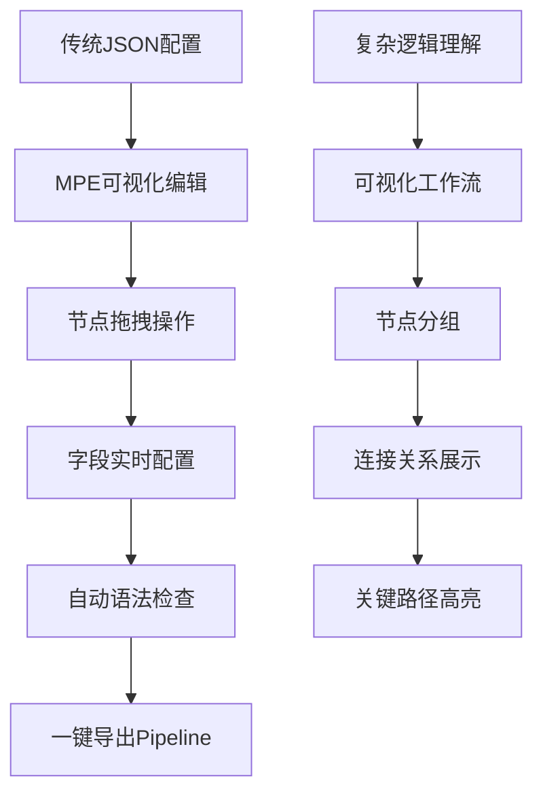
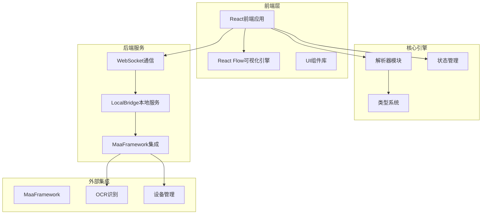
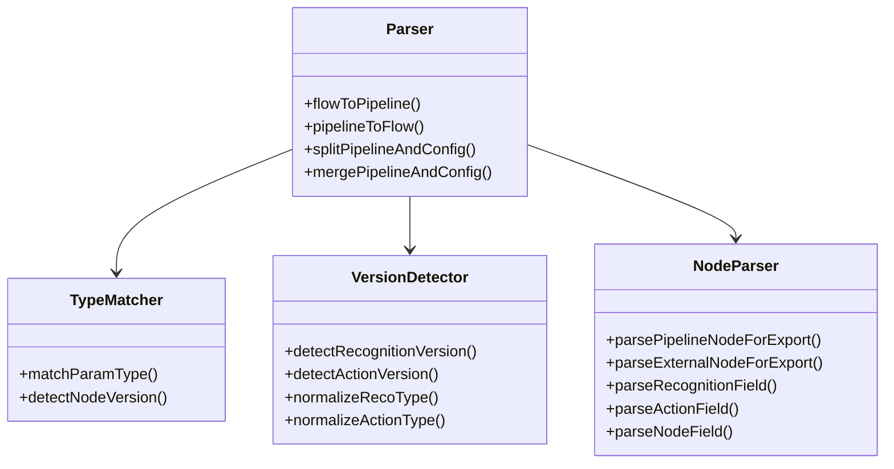

# 项目简介

<cite>
**本文引用的文件列表**
- [README.md](file://README.md)
- [App.tsx](file://src/App.tsx)
- [Flow.tsx](file://src/components/Flow.tsx)
- [FieldPanel.tsx](file://src/components/panels/main/FieldPanel.tsx)
- [server.ts](file://src/services/server.ts)
- [index.ts](file://src/core/parser/index.ts)
- [types.ts](file://src/stores/flow/types.ts)
- [main.go](file://LocalBridge/cmd/lb/main.go)
- [main.go](file://Extremer/main.go)
- [index.md](file://docsite/docs/index.md)
</cite>

## 目录
1. [引言](#引言)
2. [项目定位与价值主张](#项目定位与价值主张)
3. [核心问题与解决方案](#核心问题与解决方案)
4. [目标用户群体](#目标用户群体)
5. [项目愿景与使命](#项目愿景与使命)
6. [架构概览](#架构概览)
7. [核心组件与优势](#核心组件与优势)
8. [特色功能与创新点](#特色功能与创新点)
9. [技术实现要点](#技术实现要点)
10. [总结](#总结)

## 引言

MaaPipelineEditor（简称MPE）是专为MaaFramework Pipeline工作流设计的下一代可视化编辑器。它致力于解决传统手工配置JSON的繁琐问题，通过"告别手调千行JSON"的理念，为用户提供拖拽+配置的高效工作方式。

## 项目定位与价值主张

### 核心定位
MPE是面向MaaFramework资源开发者的专业级工作流编辑工具，专注于：
- **可视化构建**：告别复杂的JSON配置，用图形化方式构建Pipeline
- **高效协作**：支持团队共享和版本管理
- **智能辅助**：内置AI补全和语法糖，提升开发效率
- **跨平台支持**：Web端开箱即用，本地服务可选增强

### 价值主张
- **降低学习成本**：从复杂的JSON配置转向直观的图形化操作
- **提升开发效率**：拖拽式编辑、智能补全、一键导入导出
- **保证质量**：类型校验、语法检查、错误提示
- **增强协作**：统一的编辑标准和分享机制

## 核心问题与解决方案

### 传统痛点分析

#### 1. 配置繁琐
- **问题**：手工编写JSON配置，容易出错且难以维护
- **MPE解决方案**：提供可视化节点编辑器，支持字段级配置和实时预览

#### 2. 缺乏可视化
- **问题**：Pipeline逻辑难以直观理解
- **MPE解决方案**：基于React Flow的可视化工作流编辑，支持节点分组、连接关系可视化

#### 3. 交互不便
- **问题**：传统编辑器缺乏拖拽操作和即时反馈
- **MPE解决方案**：完整的拖拽、缩放、连接功能，支持磁吸对齐和批量操作

### 技术解决方案

**图表来源**
- [README.md:31-104](file://README.md#L31-L104)
- [Flow.tsx:193-542](file://src/components/Flow.tsx#L193-L542)

## 目标用户群体

### 主要用户
1. **MaaFramework资源开发者**
   - 需要构建和维护自动化流程的工程师
   - 负责游戏自动化、图像识别等项目的开发者

2. **自动化流程工程师**
   - 专门从事流程自动化设计和实现的专业人士
   - 需要高效工具来设计复杂工作流的工程师

3. **测试工程师**
   - 负责软件测试自动化的测试工程师
   - 需要可视化工具来设计测试流程

4. **技术文档作者**
   - 需要清晰展示工作流逻辑的技术文档编写者
   - 希望通过可视化方式解释复杂流程的作者

### 用户特征
- 具备一定的编程基础，但希望避免繁琐的手工配置
- 重视开发效率和工作体验
- 需要团队协作和知识共享能力
- 追求直观、易用的开发工具

## 项目愿景与使命

### 愿景
成为MaaFramework生态中最受欢迎的可视化工作流编辑器，让每个开发者都能轻松构建高质量的自动化流程。

### 使命
"由您设计，由我们支持" - 我们致力于为开发者提供最贴心的工具支持，让创意能够顺畅地转化为可执行的自动化流程。

### 核心理念
- **以需求为中心**：架构服务于实际需求，而非为了技术而技术
- **用户体验至上**：提供类原生的交互体验
- **开放协作**：欢迎社区贡献和反馈
- **持续演进**：根据用户需求不断改进

## 架构概览

### 整体架构

**图表来源**
- [App.tsx:111-333](file://src/App.tsx#L111-L333)
- [server.ts:20-373](file://src/services/server.ts#L20-L373)
- [main.go:183-440](file://LocalBridge/cmd/lb/main.go#L183-L440)

### 技术栈
- **前端**：React 19 + TypeScript + React Flow 12
- **后端**：Go 1.24 + Cobra命令行框架
- **构建工具**：Vite + Wails 2
- **UI框架**：Ant Design 6
- **状态管理**：Zustand

## 核心组件与优势

### 1. 可视化工作流编辑器

#### 核心功能
- **节点拖拽**：支持多种节点类型的拖拽创建
- **连接编辑**：直观的边连接和断开操作
- **分组管理**：支持节点分组和嵌套
- **磁吸对齐**：智能节点对齐和布局优化

#### 技术特点
- 基于React Flow的高性能渲染
- 支持键盘快捷键操作
- 实时的节点状态同步
- 完善的撤销重做机制

**章节来源**
- [Flow.tsx:193-542](file://src/components/Flow.tsx#L193-L542)
- [types.ts:165-243](file://src/stores/flow/types.ts#L165-L243)

### 2. 智能字段编辑器

#### 功能特性
- **分类字段添加**：单面板分类字段编辑
- **字段类型校验**：实时的字段类型和值校验
- **模板支持**：丰富的节点模板和自定义模板
- **语法糖**：内置多种语法糖简化配置

#### 技术实现
- 基于Zustand的状态管理
- 完整的字段类型系统
- 实时的数据验证和错误提示

**章节来源**
- [FieldPanel.tsx:185-524](file://src/components/panels/main/FieldPanel.tsx#L185-L524)
- [index.ts:1-85](file://src/core/parser/index.ts#L1-L85)

### 3. 本地服务集成

#### 服务功能
- **文件管理**：本地文件浏览和管理
- **设备控制**：屏幕截图、设备连接管理
- **流程调试**：可视化流程调试和监控
- **AI辅助**：智能节点搜索和补全

#### 技术架构
- 基于WebSocket的双向通信
- 模块化的协议设计
- 完善的错误处理和重连机制

**章节来源**
- [server.ts:20-373](file://src/services/server.ts#L20-L373)
- [main.go:183-440](file://LocalBridge/cmd/lb/main.go#L183-L440)

## 特色功能与创新点

### 1. 多样化节点样式
- 支持经典、现代、极简等多种节点外观
- 可根据使用场景灵活切换
- 完善的主题支持和自定义选项

### 2. 智能连接系统
- 支持节点间智能连接和断开
- 可拖拽的连接中点调整
- 连接关系的可视化展示

### 3. AI赋能功能
- **智能节点搜索**：模糊搜索、精准推荐
- **节点级AI补全**：大模型辅助节点配置
- **MCP联动**：与其他工具链的无缝集成

### 4. 全面兼容性
- 支持Pipeline V1/V2协议混合导入
- 自动识别废弃字段并智能迁移
- 提供自动排版和布局优化

**章节来源**
- [README.md:37-90](file://README.md#L37-L90)
- [index.md:28-41](file://docsite/docs/index.md#L28-L41)

## 技术实现要点

### 1. 解析器架构
MPE采用模块化的解析器设计，负责Pipeline格式与Flow格式之间的互转：

**图表来源**
- [index.ts:1-85](file://src/core/parser/index.ts#L1-L85)

### 2. 状态管理系统
基于Zustand的轻量级状态管理，提供：
- 流式状态更新和同步
- 完善的历史记录和撤销重做
- 组件级别的状态订阅

### 3. WebSocket通信
实现前后端的实时通信：
- 握手协议确保版本兼容
- 模块化的消息路由系统
- 完善的错误处理和重连机制

**章节来源**
- [server.ts:20-373](file://src/services/server.ts#L20-L373)

## 总结

MaaPipelineEditor通过"告别手调千行JSON"的理念，为MaaFramework生态系统提供了革命性的开发工具。它不仅解决了传统手工配置的痛点，更重要的是改变了开发者的工作方式，让复杂的工作流设计变得简单直观。

### 核心竞争力
1. **用户体验**：类原生的交互体验，学习成本低
2. **功能完整性**：从编辑到调试的全流程支持
3. **技术先进性**：基于最新的前端技术栈
4. **生态兼容性**：与MaaFramework生态深度集成
5. **社区驱动**：开放的开发模式和活跃的社区

### 发展前景
随着AI技术的发展和自动化需求的增长，MPE将继续演进，为开发者提供更智能、更高效的工具支持。我们相信，MPE将成为MaaFramework生态中不可或缺的重要组成部分。