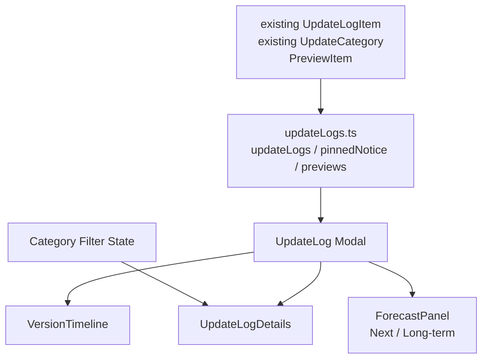

# 历史更新日志轻量重构 PRD

## 1. Executive Summary

**Problem Statement**：当前历史更新日志模块已经具备置顶公告和按版本展示能力，但整体仍偏长列表阅读，版本定位、当前版本详情阅读、下期预告与长期预告承载能力不足；如果直接升级成重型 Release Center，又会超出该弹窗的实际信息量和维护成本。

**Proposed Solution**：保留当前 `更新日志` 弹窗定位和现有置顶公告设计，在公告下方改为“可滚动版本时间线 + 单个版本详情”的轻量布局，并通过版本列表第一项承载 `下期预告` 与 `长期预告` 两个规划区。版本详情继续复用当前单次更新记录 schema，不新增摘要、重点更新或发布中心式 header。

**Success Criteria**：

- 用户打开更新日志后，顶部仍显示当前置顶公告，公告内容和现有 `pinnedNotice` 配置保持兼容。
- 最新版本详情默认展示，用户切换到任意历史版本不超过 1 次点击。
- 每个版本详情继续按当前 `updates.features`、`updates.perfs`、`updates.fixes`、`updates.docs`、`updates.others` 分组展示，不改变已有更新记录 schema。
- `下期预告` 展示 3-5 条短期计划，每条包含标题和状态；`长期预告` 展示 3-6 条方向性计划，每条包含主题和说明。
- 版本时间线默认展示全部历史版本，不做默认隐藏和“展开更早版本”交互；预告入口始终置于列表第一项，版本列表区域可滚动。
- 弹窗最大宽度应比初版实现更宽，整体内容区不滚动；版本列表与右侧更新信息使用统一高度并分别独立滚动。

**User Adjustment 2026-05-01**：

- 面板最大宽度继续增大，避免视觉上过窄。
- 置顶公告与日志条目之间的垂直间距收紧。
- 版本列表选中项不显示 `当前` 文案，背景/边框/`aria-current` 选中态即可。
- 整个日志 Modal body 不可滚动；左侧版本列表和右侧更新信息高度统一，并各自滚动。
- `下期预告` 与 `长期预告` 合并为版本列表中的第一项；打开面板时默认展示最新正式版本，而不是预告项。

## 2. User Experience & Functionality

**User Personas**：

- 普通使用者：升级前想快速知道新版本是否包含自己关心的功能、优化或修复。
- Pipeline 作者：关注编辑器、调试、节点能力、MaaFramework 兼容等变化是否影响现有项目。
- 项目维护者：需要低成本维护现有 `updateLogs` 数据，不希望为了 UI 重构批量迁移历史记录。
- 潜在贡献者：想了解项目近期方向和长期规划，从而判断是否参与开发或反馈需求。

**User Stories**：

- As a 普通使用者, I want to see the pinned notice first so that important usage guidance remains visible.
- As a 普通使用者, I want to click a version in the timeline so that I can read only that version's update records.
- As a Pipeline 作者, I want changelog entries grouped by the existing categories so that I can distinguish new features, optimizations, fixes, docs and other updates.
- As a 项目维护者, I want the refactor to preserve the current update log data schema so that existing release records do not need batch migration.
- As a 项目关注者, I want to view next and long-term preview cards so that I can understand what is likely to happen after the current release.

**Acceptance Criteria**：

- 顶部与置顶公告：
  - Modal 标题保持为 `更新日志`。
  - 不新增 `Release Center` 英文标题、副标题、最新版本卡片、最近更新卡片或 GitHub Releases hero 按钮。
  - 当前置顶公告设计必须保留，继续使用现有 `pinnedNotice` 数据源和 `Alert` 式视觉表达。
  - 置顶公告仍位于更新日志主体内容顶部，公告为空时不渲染该区域。

- 版本时间线：
  - 默认选中最新版本，即 `updateLogs[0]`。
  - 时间线按当前 `updateLogs` 顺序展示版本号、日期和版本类型标签。
  - 列表第一项固定为预告入口，聚合展示 `下期预告` 与 `长期预告`；该入口位于所有版本项之前。
  - 打开弹窗时默认选中最新正式版本，即 `updateLogs[0]`，不默认选中预告入口。
  - 点击版本项后，详情区切换到对应版本，页面不跳转、不刷新。
  - 当前选中版本必须有明确背景/边框选中态，并支持键盘焦点与回车选择；版本项不额外显示 `当前` 文案。
  - 版本时间线不做默认隐藏，不提供“展开更早版本 / 收起”交互。
  - 版本数量较多时，时间线容器自身滚动；滚动不影响右侧版本详情阅读。

- 版本详情：
  - 详情区展示版本号、发布日期、版本类型标签和当前单次更新记录内容。
  - 不新增 `summary`、`highlights`、`releaseUrl` 或重点更新卡片。
  - 更新条目继续按当前 `UpdateCategory` 分组：`features`、`perfs`、`fixes`、`docs`、`others`。
  - 没有内容的分组不渲染。
  - 当前 `UpdateLogItem.type` 保持 `major`、`feature`、`fix`、`perf`，不迁移为新的 entry type。
  - 保留现有轻量 Markdown 字符串解析能力，公告和更新条目中的链接、加粗显示行为不回退。

- 分类筛选：
  - 提供分类筛选：`全部`、`新功能`、`体验优化`、`问题修复`、`文档更新`、`其他更新`。
  - 筛选只影响当前选中版本详情中的条目分组，不隐藏版本时间线。
  - 当前版本在筛选后没有匹配条目时，展示空状态文案，例如“该版本没有此分类更新”。
  - 筛选控件使用现有 UI 体系，建议优先复用 Ant Design `Segmented`、`Tag`、`Card`、`Timeline` 或项目已有同类组件。

- 下期预告：
  - 通过版本列表第一项进入预告视图，定位为短期、相对确定的计划。
  - 每条预告包含 `title`、可选 `description`、`status`。
  - `status` 可取 `designing`、`developing`、`validating`、`planned`，中文标签分别为 `设计中`、`开发中`、`待验证`、`计划中`。
  - 预告区展示提示文案：“预告内容会随开发进度调整，不代表最终发布时间承诺。”

- 长期预告：
  - 在同一个预告视图中展示 `长期预告` 卡片，定位为方向性 roadmap，不绑定具体版本。
  - 每条长期预告包含 `title`、`description`、可选 `theme`。
  - 长期预告不使用具体日期，避免制造发布承诺。
  - 长期预告建议以主题标签区分，例如 `编辑体验`、`调试能力`、`MaaFramework 集成`、`文档与生态`。

- 响应式与可访问性：
  - 宽屏使用置顶公告 + 左侧列表/右侧内容双栏布局，预告作为左侧列表第一项对应的右侧内容视图。
  - 窄屏改为单列布局，版本时间线在详情上方，避免横向滚动。
  - 所有状态和类型必须有文字表达；选中态通过背景/边框和 `aria-current` 表达，不显示额外 `当前` 文案。
  - 列表项和筛选项应有可见 focus 样式。

**Non-Goals**：

- 不接入 GitHub Releases API，不做远程动态拉取。
- 不实现完整 Roadmap 管理系统、投票系统或 issue 关联面板。
- 不实现 Markdown 文件解析器；继续沿用当前轻量 Markdown 字符串解析能力。
- 不设计多阶段发布方案，本 PRD 范围内一次性完成轻量重构、筛选和预告栏。
- 不新增测试脚本或文档站改版；仅在现有更新日志模块内完成重构。
- 不改变项目实际版本发布流程，只改善展示与维护方式。
- 不将 `更新日志` 改造成带独立 hero 和版本元信息卡片的重型 Release Center。
- 不批量迁移现有 `updateLogs` 数据，不新增 `summary`、`highlights` 等字段。

## 3. Prototype / Wireframe

**Desktop Layout**：

```text
┌──────────────────────────────────────────────────────────────────────────────┐
│ 更新日志                                                                 [x] │
├──────────────────────────────────────────────────────────────────────────────┤
│ ┌──────────────────────────────────────────────────────────────────────────┐ │
│ │ 置顶公告                                                                 │ │
│ │ • 第一次使用？请务必完整预览快速上手。                                      │ │
│ │ • 正式版 LocalBridge 已上线，推荐尝试本地服务能力。                         │ │
│ │ • 本地一体编辑器 MaaPipelineExtremer 现已上线。                             │ │
│ └──────────────────────────────────────────────────────────────────────────┘ │
│                                                                              │
│ ┌──────────────────────────┬───────────────────────────────────────────────┐ │
│ │ 版本                     │ v1.5.0                         [重大更新]      │ │
│ │                          │ 2026-5-1                                      │ │
│ │ ★ 下期预告 / 长期预告 [预告]│                                               │ │
│ │ │ 近期计划与方向规划       │ [全部] [新功能] [体验优化] [问题修复] [其他更新] │ │
│ │ ● v1.5.0 重大更新         │                                               │ │
│ │ │ 2026-5-1               │                                               │ │
│ │ │                        │                                               │ │
│ │ ● v1.4.3 新功能          │ ┌──────────── 新功能 ────────────────────────┐ │ │
│ │ │ 2026-4-26              │ │ • 全新 MPE FlowScope 调试模块，支持 ...     │ │ │
│ │ │                        │ └───────────────────────────────────────────┘ │ │
│ │ ● v1.4.2 优化            │ ┌──────────── 体验优化 ──────────────────────┐ │ │
│ │ │ 2026-4-22              │ │ • 连接 LB 后，从本地导入行为改为 ...        │ │ │
│ │ │                        │ │ • 拆分顶部工具栏，优化页面视觉占用          │ │ │
│ │ ● v1.4.1 新功能          │ └───────────────────────────────────────────┘ │ │
│ │ │ 2026-4-8               │ ┌──────────── 问题修复 ──────────────────────┐ │ │
│ │ │                        │ │ • 修复 OpenAI 兼容 URL 解析逻辑 ...         │ │ │
│ │ │ 可滚动显示全部版本       │ └───────────────────────────────────────────┘ │ │
│ └──────────────────────────┴───────────────────────────────────────────────┘ │
│ 选择预告入口时，右侧详情区域切换为下期预告 + 长期预告双栏内容。                  │
└──────────────────────────────────────────────────────────────────────────────┘
```

**Mobile Layout**：

```text
┌──────────────────────────────┐
│ 更新日志                      │
└──────────────────────────────┘

┌──────────────────────────────┐
│ 置顶公告                      │
│ • 第一次使用？请务必完整预览。   │
│ • LocalBridge 已上线。         │
└──────────────────────────────┘

┌──────────────────────────────┐
│ 版本                          │
│ [下期预告 / 长期预告  预告]     │
│ [v1.5.0 重大更新  2026-5-1]    │
│ [v1.4.3 新功能    2026-4-26]   │
│ [v1.4.2 优化      2026-4-22]   │
│ 可滚动显示全部版本              │
└──────────────────────────────┘

┌──────────────────────────────┐
│ v1.5.0  [重大更新]             │
│ 2026-5-1                      │
│ [全部] [新功能] [体验优化]      │
│ [问题修复] [其他更新]           │
│                              │
│ 新功能                         │
│ • xxx                         │
│                              │
│ 体验优化                       │
│ • xxx                         │
└──────────────────────────────┘

选择预告入口时，下方内容区域切换为：
┌──────────────────────────────┐
│ 下期预告                       │
│ ┌──────────────────────────┐ │
│ │ 开发中  xxx               │ │
│ └──────────────────────────┘ │
│ 长期预告                       │
│ ┌──────────────────────────┐ │
│ │ 调试能力  xxx             │ │
│ └──────────────────────────┘ │
└──────────────────────────────┘
```

**Interaction States**：

```text
版本项状态：
[默认]     v1.4.3  新功能  2026-4-26
[悬停]     背景轻微高亮，显示可点击反馈
[选中]     左侧节点加粗 / 主色边框 / aria-current="true"
[类型]     版本号右侧展示 major / feature / fix / perf 对应中文标签

筛选状态：
[全部] [新功能] [体验优化] [问题修复] [文档更新] [其他更新]
  │
  └─ 当前选中项使用实心或高对比样式，其余为轻量描边

空状态：
┌────────────────────────────────────┐
│ 该版本没有此分类更新                 │
│ 可切换到“全部”查看完整更新内容。       │
└────────────────────────────────────┘
```

**Visual Direction**：

- 整体采用轻量弹窗式 `更新日志` 风格：清晰、克制、信息密度适中。
- 顶部不做独立 hero，只保留 Modal 标题和现有置顶公告。
- 时间线强调版本定位，详情区强调当前版本内容，预告区作为辅助信息，三者视觉权重应依次递减。
- 卡片圆角、边框、阴影使用现有项目 token；若没有 token，使用轻边框 + 微弱阴影，避免厚重卡片堆叠。

## 4. AI System Requirements (If Applicable)

本功能不包含 AI/LLM 生成、自动总结或自动路线图建议。

**Tool Requirements**：无 AI 工具依赖。所有展示内容来自现有 `updateLogs`、`pinnedNotice` 和新增预告静态数据。

**Evaluation Strategy**：不适用 AI 输出质量评估。质量通过数据类型约束、组件交互检查、响应式检查和局部语法检查验证。

## 5. Technical Specifications

**Architecture Overview**：



**Suggested File Organization**：

实际拆分以最小改动为准，优先保留当前入口和数据文件。

```text
src/data/updateLogs.ts
src/components/modals/UpdateLog.tsx
src/components/modals/update-log/
  VersionTimeline.tsx
  UpdateLogDetails.tsx
  ForecastPanel.tsx
```

实施建议：

- 保留现有 `UpdateLog` Modal 入口和 `src/data/updateLogs.ts` 数据源。
- 尽量复用现有 `PinnedNotice`、`UpdateCategory`、`UpdateLogItem` 类型。
- 将大块 UI 拆到同目录子组件；如果拆分导致改动过大，可以先在 `UpdateLog.tsx` 内完成轻量重构。
- 不为本次重构引入新的全局状态管理。

**Existing Data Model To Preserve**：

```ts
export interface PinnedNotice {
  title?: string;
  content: string[];
  type?: 'info' | 'warning' | 'success';
}

export interface UpdateCategory {
  features?: string[];
  fixes?: string[];
  perfs?: string[];
  docs?: string[];
  others?: string[];
}

export interface UpdateLogItem {
  version: string;
  date: string;
  type: 'major' | 'feature' | 'fix' | 'perf';
  updates: UpdateCategory;
}
```

**New Preview Data Model**：

```ts
export type PreviewStatus = 'designing' | 'developing' | 'validating' | 'planned';

export type NextPreviewItem = {
  title: string;
  description?: string;
  status: PreviewStatus;
};

export type LongTermPreviewItem = {
  title: string;
  description: string;
  theme?: string;
};
```

**Data Rules**：

- `updateLogs` 继续按日期倒序维护。
- `date` 保持当前字符串格式；本次不强制迁移历史日期格式。
- 每个 `UpdateLogItem` 至少包含 `version`、`date`、`type`、`updates`。
- `updates` 中的条目继续使用当前字符串数组，沿用现有轻量 Markdown 解析能力。
- 本次不新增 `summary`、`highlights`、`releaseUrl` 等字段。
- `nextPreview` 与 `longTermPreview` 独立于版本列表，避免把未来计划伪装成尚未发布版本。

**UI Layout**：

- 顶部：Modal 标题 `更新日志` + 当前置顶公告 Alert。
- 主体：左侧可滚动列表 + 右侧可滚动内容双栏；两栏高度统一，整体 Modal body 不滚动。
- 预告：下期预告与长期预告合并到左侧列表第一项对应的右侧预告视图中，不再作为主体下方的独立区域。
- 视觉风格：延续当前弹窗和 Ant Design 语义，适度美化但不过度包装。
- 类型色彩建议：
  - `major`：红，强调重大更新。
  - `feature`：蓝，强调新能力。
  - `fix`：橙，强调问题修复。
  - `perf`：绿，强调体验优化。

**Component Responsibilities**：

- `UpdateLog`：管理选中版本、分类筛选状态，组合 Modal 布局。
- `VersionTimeline`：只负责版本列表展示、选中态、滚动容器和选择事件。
- `UpdateLogDetails`：只负责当前版本的版本号、日期、类型标签、按 `updates` 分组条目和筛选空状态。
- `ForecastPanel`：展示下期预告和长期预告，不读取或修改版本选择状态。
- `updateLogs.ts`：继续集中维护置顶公告、更新日志和预告内容，不包含组件逻辑。

**Integration Points**：

- 更新现有历史更新日志模块入口，保持 Header 按钮、Modal open/close 行为不变。
- 如项目已使用 Ant Design，优先复用 `Alert`、`Card`、`Tag`、`Timeline`、`Segmented`、`Typography`，避免引入新 UI 依赖。
- 如项目已有主题 token 或 CSS 变量，颜色、圆角、阴影应接入现有 token，不硬编码大量孤立颜色。
- 如现有页面使用 inline style，重构时可继续使用；如改为 CSS module，应控制范围，不顺手改全局样式。
- 保留现有 `parseMarkdown` 能力或等价抽取为局部 helper，不改动公告和日志文本写法。

**State Management**：

- 本模块只需要组件本地状态：`selectedVersion`、`categoryFilter`。
- 不需要 Zustand、Redux 或持久化 store。
- 刷新后默认回到最新版本和 `全部` 筛选即可。
- 如当前模块已有 URL hash 或 query 选择版本能力，可以保留；没有则不新增 URL 状态。

**Performance Requirements**：

- 版本数量在 50 条以内时不需要虚拟列表，时间线容器滚动即可。
- 切换版本和筛选分类应为纯前端同步操作，不触发网络请求。
- 不渲染全部版本详情，只渲染当前选中版本详情。
- 不在 render 中做复杂日期解析或大对象排序；必要时在 data 导出前整理。

**Security & Privacy**：

- 公告和日志中的外链继续使用安全打开方式，例如 `target="_blank"` 时同时设置 `rel="noopener noreferrer"`。
- 更新条目默认作为文本渲染，不使用 `dangerouslySetInnerHTML`。
- 不展示本地绝对路径、开发者私有信息或未公开内部计划细节。

**Testing / Validation**：

- 验证默认选中最新版本。
- 验证点击历史版本后详情内容切换正确。
- 验证分类筛选只影响详情区条目，时间线不被过滤。
- 验证没有匹配分类条目时显示空状态。
- 验证时间线展示全部版本且容器可滚动，不出现展开/收起按钮。
- 验证置顶公告内容仍位于顶部且 Markdown 链接/加粗显示正常。
- 验证窄屏布局无横向滚动。
- 按项目习惯执行局部语法检查；不要求仓库级 build。

## 6. Risks & Roadmap

**Phased Rollout**：

本需求明确为一步到位实施，不设计 MVP -> v1.1 -> v2.0 多阶段路线。实施完成后即应包含：保留置顶公告、可滚动版本时间线、当前版本详情、分类筛选、下期预告、长期预告、响应式布局和基础可访问性。

**Technical Risks**：

- 当前 `UpdateLog.tsx` 使用较多 inline style，拆分组件时需要避免一次性引入大规模样式重写导致视觉回归。
- 当前更新日志内容已经依赖轻量 Markdown 字符串，拆分 helper 时需要保持链接和加粗解析行为一致。
- 预告内容容易被用户理解为确定发布时间，需要在 UI 中明确“不代表最终发布时间承诺”。
- 若历史版本数量快速增长，单纯滚动时间线可能仍显拥挤；50 条以内不引入虚拟列表，超过后再单独评估搜索能力。
- 分类筛选若和未来搜索、版本锚点混用，可能需要 URL 状态；本次先不引入，避免扩大范围。

**Open Questions**：

- 是否需要把 `UpdateLog.tsx` 拆出子组件目录，还是先在单文件内完成轻量重构。
- 下期预告和长期预告的初始内容需要由维护者根据真实计划填写，PRD 不虚构具体项目承诺。

## 7. Reference Notes

**Recommended Initial Preview Content Shape**：

```ts
export const nextPreview: NextPreviewItem[] = [
  {
    title: '示例：优化节点编辑体验',
    description: '将高频字段和排障信息放到更容易触达的位置。',
    status: 'designing',
  },
];

export const longTermPreview: LongTermPreviewItem[] = [
  {
    title: '示例：更完整的调试工作流',
    description: '围绕运行记录、节点归属、截图和 detail artifact 提供更连续的排障体验。',
    theme: '调试能力',
  },
];
```

示例内容只用于说明字段形态，实施时应替换为真实计划。
