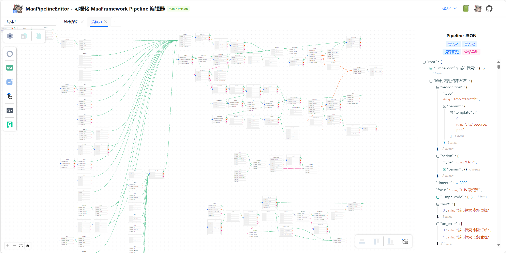
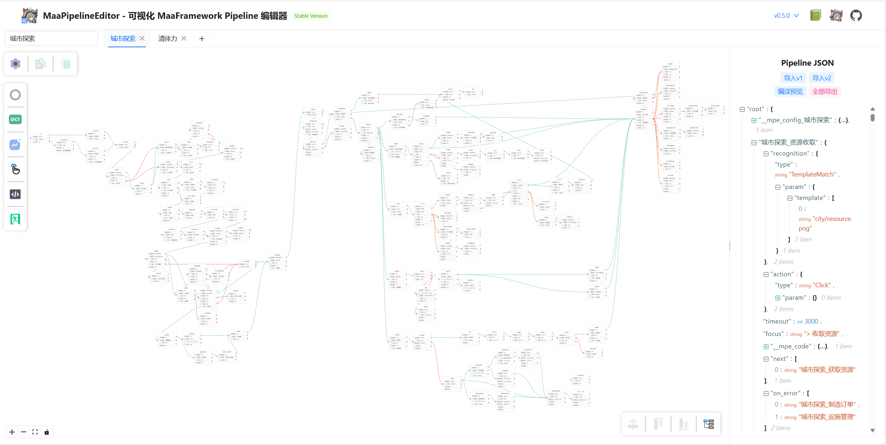

  

# MaaPipelineEditor

_✨ 基于 react-flow 的 MaaFramework Pipeline 工作流式可视化编辑器 ✨_

  
  
  <!--  -->
  
   
  
  
  

[🚀 在线使用](https://mpe.codax.site/stable) | [📖 文档](https://mpe.codax.site/docs) | [💬 讨论反馈](#讨论与帮助)

## 简介

**MaaPipelineEditor (MPE)** 是一款基于 Web 前端相关框架、运用 [YAMaaPE](https://github.com/kqcoxn/YAMaaPE) 开发经验去芜存菁、经过资源开发者充分微调、完全重写的 [MaaFramework](https://github.com/MaaXYZ/MaaFramework) [Pipeline](https://maafw.xyz/docs/3.1-PipelineProtocol.html) 工作流式可视化编辑器。

**_“由您设计，由我们支持。”_** 如您所需皆已存在：添加、配置、连接，只需稍作思考，想法之外尽在其中！

您可以使用 MPE 轻松构造出如下 Pipeline，兼具易用性与可读性：

（示例 Pipeline：[MNMA-清体力.json](https://github.com/kqcoxn/MaaNewMoonAccompanying/blob/v2.2.3/assets/resource/base/pipeline/%E6%97%A5%E5%B8%B8%E6%B4%BB%E5%8A%A8/%E6%B8%85%E4%BD%93%E5%8A%9B.json), 1996 lines）

（示例 Pipeline：[MNMA-城市探索.json](https://github.com/kqcoxn/MaaNewMoonAccompanying/blob/v2.2.3/assets/resource/base/pipeline/%E6%97%A5%E5%B8%B8%E6%B4%BB%E5%8A%A8/%E5%9F%8E%E5%B8%82%E6%8E%A2%E7%B4%A2.json), 2186 lines）

## 开箱即用

- [文档站](https://mpe.codax.site/docs)
- [稳定版](https://mpe.codax.site/stable)_**（推荐！）**_
- [预览版](https://kqcoxn.github.io/MaaPipelineEditor/)（最新 commit）
- [YAMaaPE](https://yamaape.codax.site)（重构前版本）

> [!IMPORTANT]
> 由于 MPE 本身不属于 [MaaXYZ](https://github.com/MaaXYZ) 官方维护项目，因此部分特性适配可能存在延迟或遗漏。若您发现相关问题，请提交 ISSUE 或 PR，或在集成开发交流群内指正。

## 讨论与帮助

MPE 项目没有单独的交流群，您可以在 MaaFramework 集成/开发交流 QQ 群（[595990173](https://qm.qq.com/q/gqSv6ukjV8)）询问相关问题或参与讨论。

## 鸣谢

### 开发者

感谢以下开发者对 MaaPipelineEditor 作出的贡献：

### 特别感谢

- [MaaFramework](https://github.com/MaaXYZ/MaaFramework)

### 框架/依赖

- [vite](https://github.com/vitejs/vite)  
  Next Generation Frontend Tooling.
- [TypeScript](https://github.com/microsoft/TypeScript)  
  JavaScript with syntax for types.
- [less.js](https://github.com/less/less.js)  
  It's CSS, with just a little more.
- [react](https://github.com/facebook/react)  
  A JavaScript library for building user interfaces.
- [zustand](https://github.com/pmndrs/zustand)  
  A small, fast and scalable bearbones state-management solution using simplified flux principles.
- [ahooks](https://github.com/alibaba/hooks)  
  A high-quality & reliable React Hooks library.
- [xyflow/react](https://github.com/xyflow/xyflow/tree/main/packages/react)  
  Powerful open source libraries for building node-based UIs with React.
- [ant-design](https://github.com/ant-design/ant-design)  
  An enterprise-class UI design language and React UI library.
- [react-json-view](https://github.com/microlinkhq/react-json-view)  
  A React component for displaying and editing javascript arrays and JSON objects.
- [dnd-kit](https://github.com/clauderic/dnd-kit)  
  The modern drag & drop toolkitfor React.
- [dagre](https://github.com/dagrejs/dagre)  
  A JavaScript library that makes it easy to lay out directed graphs on the client-side.
- [classnames](https://github.com/JedWatson/classnames)  
  A simple JavaScript utility for conditionally joining classNames together.
- [react-iconfont-cli](https://github.com/iconfont-cli/react-iconfont-cli)  
  Use pure JS to convert iconfont.cn icons into React components.
- [lodash](https://github.com/lodash/lodash)  
  A modern JavaScript utility library delivering modularity, performance & extras.
- [node-jsonc-parser](https://github.com/microsoft/node-jsonc-parser)  
  Scanner and parser for JSON with comments.
- [darkreader](https://github.com/darkreader/darkreader)  
  Dark Reader analyzes web pages and aims to reduce eyestrain while browsing the web.
- [vitepress](https://github.com/vuejs/vitepress)  
  Vite & Vue powered static site generator.
- [vue.js](https://github.com/vuejs/vue)  
  An approachable, performant and versatile framework for building web user interfaces.
- [sass](https://github.com/sass/sass)  
  An extension of CSS, adding nested rules, variables, mixins, selector inheritance, and more.
- [vitepress-theme-teek](https://github.com/Kele-Bingtang/vitepress-theme-teek)  
  A lightweight, simple and efficient VitePress theme that is flexible to configure and easy to expand.
- [vitepress-plugin-llms](https://github.com/okineadev/vitepress-plugin-llms)  
  A VitePress plugin for generating LLM-friendly documentation.
- ~~[pinia](https://github.com/vuejs/pinia)~~  
  ~~Intuitive, type safe and flexible Store for Vue~~
- ~~[vue-flow](https://github.com/bcakmakoglu/vue-flow)~~  
  ~~A highly customizable Flowchart component for Vue 3.~~
- ~~[element-plus](https://github.com/element-plus/element-plus)~~  
  ~~A Vue.js 3 UI library~~
- ~~[json-editor-vue](https://github.com/cloydlau/json-editor-vue)~~  
  ~~Vue and Nuxt 2/3 isomorphic JSON editor, viewer, formatter and validator.~~

## 其他

- 原项目备份仓库：https://github.com/kqcoxn/YAMaaPE
