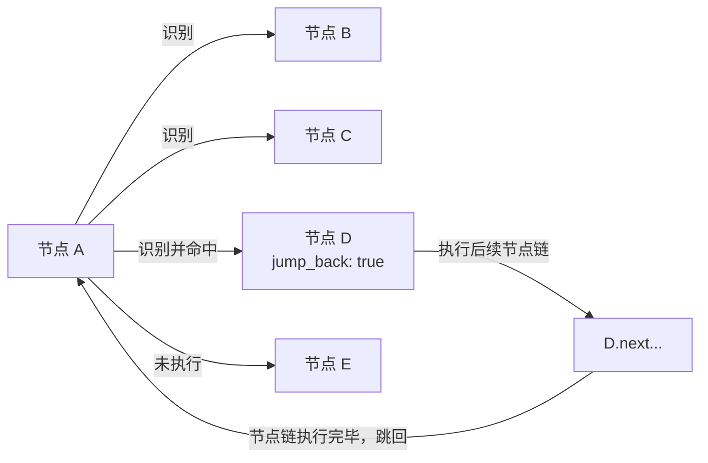

### 属性设置方式

#### 对象形式（Object Form）

使用 `NodeAttr` 对象显式指定节点名称和属性：

```jsonc
{
  "A": {
    "next": [
      "B",
      {
        "name": "C",
        "jump_back": true
      },
      "D"
    ]
  }
}
```

#### 前缀形式（Prefix Form）

使用方括号前缀在节点名称前直接指定属性：

```jsonc
{
  "A": {
    "next": ["B", "[JumpBack]C", "D"]
  }
}
```

两种形式功能等价，可根据实际需求选择。在数组中可混合使用两种形式，构成异质数组。

### 可用属性

#### `jump_back` / `[JumpBack]`

**类型**: _boolean_  
**默认值**: `false`  
**说明**: 启用跳回机制。当该节点识别命中，系统会在其后续节点链全部执行完毕后，重新返回到该节点所在的父节点，继续尝试识别该父节点的 `next` 列表。

**执行流程**：

1. 父节点按顺序识别 `next` 列表中的节点
2. 若识别命中带有 `jump_back` 属性的节点，执行该节点及其后续节点链
3. 该节点链执行完毕后，返回到父节点
4. 父节点继续从 `next` 列表的起始位置重新开始识别

**示例**：

```jsonc
{
  "A": {
    "next": ["B", "C", "[JumpBack]D", "E"]
  }
}
```

执行流程：

- 节点 A 依次尝试识别 B、C、D、E
- 若识别命中 D（假设 B、C 未识别到），执行 D 及其后续节点链
- D 的节点链执行完毕后，返回到节点 A
- 节点 A 重新从 B 开始识别，继续尝试 B、C、D、E

**应用场景**：  
适用于异常处理场景，例如识别并处理网络断开提示框、权限请求弹窗等临时性界面，处理完成后继续执行原有流程。

**兼容性说明**：  
功能类似已废弃的 `is_sub` 字段，但 `jump_back` 仅作用于当前 `next` 列表中的特定节点，而非整个节点定义。



#### `anchor` / `[Anchor]`

**类型**: _boolean_  
**默认值**: `false`  
**说明**: 启用锚点引用。当该属性为 true 时，`name` 字段将被视为锚点名称而非节点名称，运行时会解析为最后设置该锚点的节点。

**使用方式**：

1. 首先在节点中通过 `anchor` 字段设置锚点名称
2. 然后在 `next` 或 `on_error` 中通过 `[Anchor]` 或 `anchor` 引用该锚点

**示例**：

```jsonc
{
  "A": {
    "anchor": "X",
    "next": ["C"]
  },
  "B": {
    "anchor": "X",
    "next": ["C"]
  },
  "C": {
    "next": ["D", "[Anchor]X"]
  }
}
```

等价的对象形式：

```jsonc
{
  "C": {
    "next": ["D", { "name": "X", "anchor": true }]
  }
}
```

**应用场景**：  
适用于需要动态引用节点的场景，例如多个节点可能处理同一类事件，后续需要回到"最后处理该事件的节点"继续执行。
