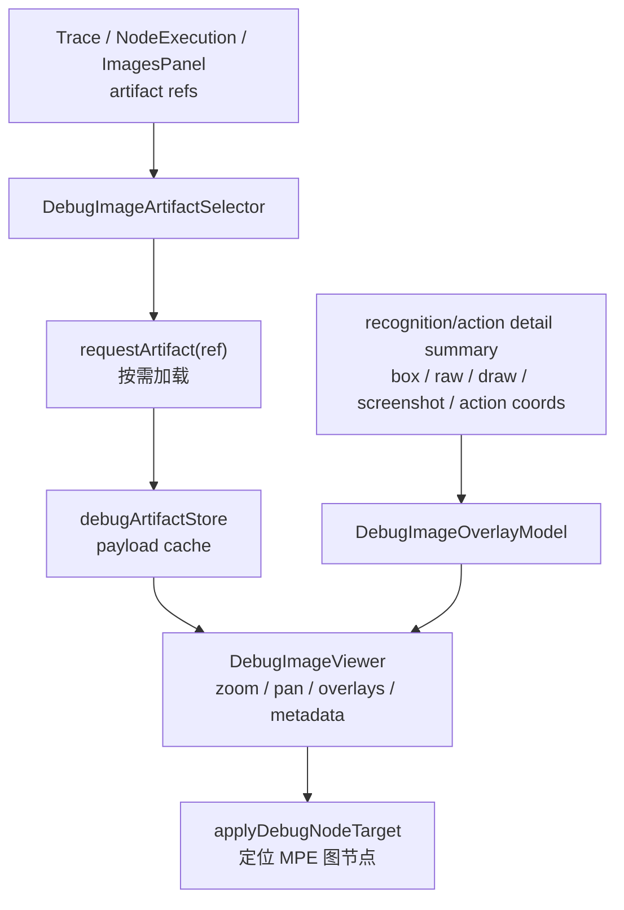

# Debug 图片查看与操作能力 PRD

## 1. Executive Summary

**Problem Statement**：debug-vNext 已经把截图、识别 raw/draw 图、action 前截图、性能摘要等大对象收敛为 artifact 引用，但前端图片查看仍停留在“加载后显示一张图”的阶段。当前 `ImagesPanel` 只能列出 artifact 并调用 `DebugArtifactPreview`，图片预览只支持自适应显示和单个 box overlay，不能放大、平移、全屏、比较 raw/draw，也不能把图片检查与节点执行、识别结果、动作坐标和画布上下文自然联动。

**Proposed Solution**：在不改变 LocalBridge artifact 基础契约的前提下，为 debug Modal 增加统一的图片检查体验：抽出可复用的 `DebugImageViewer`，支持缩放、平移、适配、全屏/大图查看、overlay 图层、结果列表 hover 联动、raw/draw/screenshot 切换和基础元数据查看；升级 `ImagesPanel` 为 artifact 图像中心，同时让 `NodeExecutionPanel`、识别详情和动作详情复用同一查看器。设计吸收 MaaDebugger 的实时截图 pan/zoom/fullscreen、RecognitionDrawCanvas 多层视图、ActionDrawCanvas 坐标可视化和图片按引用延迟读取，但保留 MPE 的图节点定位、跨文件节点上下文、debug artifact store、Modal 集中调试和固定图批量识别特色。

**Success Criteria**：

- 用户能在 debug Modal 中对任意已加载图片 artifact 执行放大、缩小、滚轮缩放、拖拽平移、重置、适配窗口和原始尺寸查看。
- recognition detail 的 raw/draw/screenshot 能在同一查看器内切换；draw 或 box overlay 与结果列表 hover/选择联动。
- action detail 对 Click/Swipe/MultiSwipe 等坐标动作显示点击点或路径 overlay；不提供重新执行危险动作入口。
- 图片查看入口在 `ImagesPanel`、`NodeExecutionPanel` artifact 区和性能/时间线相关入口中表现一致，不复制多套预览逻辑。
- 不在列表首屏批量拉取图片；仍由用户点击 artifact ref 后按需加载，避免长任务内存和传输峰值。

## 2. User Experience & Functionality

**User Personas**：

- Pipeline 作者：需要放大查看识别截图中的小图标、ROI、模板匹配结果和 next 跳转依据。
- 调试排障用户：需要从失败节点直接打开相关 raw/draw/screenshot，对照识别 box、动作坐标和原始 MaaFW detail。
- 固定图批量识别用户：需要在大量图片结果中快速查看失败样本、切换同一节点的不同图片，并回到 MPE 节点。
- 维护大型项目的用户：需要知道图片来自哪个 run、seq、节点、资源路径和 artifact 类型，而不是只看一个 base64 预览。

**MaaDebugger 可吸收能力**：

- 实时截图区域支持 zoom、pan 和 fullscreen；缩放范围约 `0.1` 到 `5.0`，平移只在放大后启用。
- ScreenshotService 区分 idle FPS 驱动和 task event 驱动，任务运行中尽量显示 MaaFW 正在看的图，而不是无意义地重复截图。
- RecognitionDrawCanvas 有 search/result 两类视图：可查看模板或 ROI，也可在截图上绘制识别结果 box。
- 识别结果列表可 hover 联动 canvas 高亮具体 box。
- ActionDrawCanvas 在 action 发生时的截图上绘制 Click/Swipe 坐标或路径。
- reco raw、reco draw、action raw 等图片通过缓存引用异步请求，不随事件直接传输大图。

**MPE 特色要求**：

- 图片查看器要保留 `fileId/nodeId/runtimeName/runId/seq/artifactId` 上下文，并提供“定位节点”入口；已映射节点使用现有 `applyDebugNodeTarget` 能力。
- `ImagesPanel` 不只是 artifact 列表，还应成为“图片检查台”：支持按 artifact type、run、节点、状态、来源面板筛选。
- `NodeExecutionPanel` 的 artifact 区应直接使用同一查看器，点击识别/动作 attempt 后保留节点执行上下文。
- 固定图识别和批量识别结果应可进入同一查看器，允许在目标节点和失败样本之间切换。
- 保留 MPE 现有 artifact 引用化模型，不把 MaaDebugger 的图片 URL cache 模型原样搬进前端。

**User Stories**：

- As a Pipeline 作者, I want to zoom and pan recognition screenshots so that I can inspect small UI elements and precise boxes.
- As a 调试排障用户, I want to switch between raw image, draw image, and current screenshot so that I can compare what MaaFW saw and what it drew.
- As a 节点调试用户, I want image artifacts to keep node/run/seq context so that I can jump back to the graph node from the image.
- As an action debugging user, I want click/swipe coordinates drawn over the action screenshot so that I can verify whether the action target is correct.
- As a batch recognition user, I want failed image samples to be browseable without loading every image upfront so that large batches remain responsive.

**Acceptance Criteria**：

- 统一查看器：新增或抽出一个 debug feature 内的图片查看组件，供 `ImagesPanel`、`DebugArtifactSelector`、节点执行详情等复用。
- 基础操作：支持 toolbar 按钮和鼠标操作完成 zoom in、zoom out、reset、fit、actual size、drag pan；缩放比例有文本显示。
- 全屏/大图：支持在 Modal 内打开更大的预览区域；不要求浏览器全屏 API，P0 可使用 Ant Design `Modal` 或 `Drawer`。
- 滚轮缩放：鼠标滚轮以指针位置为中心缩放；触控板滚动不得导致页面和图片双重乱跳。
- 平移边界：放大后拖拽平移，缩小时自动回到可见区域；切换图片或关闭查看器后状态可重置。
- Overlay：支持 box、点、路径、多 box 高亮、选中 box 与 hover box；状态不能只依赖颜色，必须有 label 或列表选中态。
- 多图切换：同一 detail 下的 raw/draw/screenshot 以 tab、segmented 或按钮组切换；切换不重新请求已加载 artifact。
- 元数据：展示 artifact id、type、mime、runId、eventSeq、node/runtimeName、图片自然尺寸、当前缩放比例。
- 节点联动：有 `nodeId` 时提供定位节点；无映射时显示 runtimeName-only，不能报错。
- 按需加载：列表和结果摘要只展示 ref；用户点击后才调用 `requestArtifact(ref)`。
- 空/错误状态：未加载、加载中、加载失败、非图片 artifact、图片缺失尺寸都有明确状态。
- 可访问性：toolbar 按钮有 icon 和 tooltip/aria label；键盘可聚焦，`+/-/0/F` 可作为非阻塞增强。

**Non-Goals**：

- 不实现图片编辑、标注保存、导出图片、复制到剪贴板等生产工具能力。
- 不新增后端图片协议或变更 debug protocol version，除非实施时发现现有 artifact payload 缺少必要元数据。
- 不实现 MaaDebugger 的完整独立截图流架构；MPE 继续使用 debug-vNext screenshot stream 与 artifact store。
- 不持久化历史图片库；图片仍只服务当前 debug session。
- 不引入新的大型图像处理依赖，除非后续性能验证证明 DOM/CSS transform 无法满足。

## 3. Technical Specifications

**Current State**：

- `src/features/debug/components/panels/ImagesPanel.tsx` 负责实时截图控制、固定图输入、artifact 列表、批量固定图识别和选中 artifact 预览。
- `src/features/debug/components/DebugArtifactPreview.tsx` 现在根据 artifact mime 渲染图片或 JSON；图片只设置 `maxWidth/maxHeight`，可画单个 box。
- `src/features/debug/components/DebugArtifactSelector.tsx` 在节点执行详情里按组展示 artifact 按钮，底层仍复用 `DebugArtifactPreview`。
- `src/features/debug/artifactDetailSummary.ts` 已能从 recognition/action detail 中归一化 box、raw/draw/screenshot refs，为增强 overlay 提供基础。
- debug-vNext 已有 `requestArtifact`、`debugArtifactStore`、`screenshotStream`、`node-execution`、批量识别和 performance summary，P0 应优先消费这些现有数据。

**Architecture Overview**：



**Suggested Component Boundary**：

- `DebugImageViewer.tsx`：纯查看器，输入 `src`、`mime`、`naturalSize?`、`overlays`、`metadata`、`toolbarOptions`，内部维护 zoom/pan/fullscreen 状态。
- `DebugImageArtifactViewer.tsx`：debug artifact 适配层，负责从 `DebugArtifactEntry` 取 base64 src、展示 artifact 状态、解析图片元数据。
- `DebugImageOverlay.tsx` 或同文件 helper：统一 box/point/path 的百分比定位，避免各面板重复计算。
- `DebugArtifactPreview.tsx`：保留为 artifact 通用预览入口，但图片分支委托给 `DebugImageArtifactViewer`。
- `ImagesPanel.tsx`：升级为图片中心，新增筛选与大图预览，但不直接实现底层 zoom/pan。
- `NodeExecutionRecordDetails.tsx` / `NodeExecutionAttemptFocus.tsx`：继续传入 artifact refs 和 box/action 数据，改用统一图片查看器。

**Data Model Draft**：

```ts
type DebugImageOverlay =
  | {
      id: string;
      kind: "box";
      label?: string;
      box: { x: number; y: number; width: number; height: number };
      status?: "hit" | "miss" | "selected" | "candidate";
    }
  | {
      id: string;
      kind: "point";
      label?: string;
      x: number;
      y: number;
      status?: "selected" | "candidate";
    }
  | {
      id: string;
      kind: "path";
      label?: string;
      points: Array<{ x: number; y: number }>;
      status?: "selected" | "candidate";
    };

type DebugImageViewerMetadata = {
  artifactId: string;
  artifactType: string;
  mime: string;
  runId?: string;
  eventSeq?: number;
  nodeId?: string;
  runtimeName?: string;
  naturalWidth?: number;
  naturalHeight?: number;
};
```

**Interaction Details**：

- 默认打开模式为 `fit`，图片完整可见；点击 `1:1` 切到原始像素比例。
- 缩放步进建议为 `1.2x`，范围可参考 MaaDebugger：`0.1` 到 `5.0`；如原图过大，P0 可限制最大缩放到 `8.0` 或自然尺寸上限。
- 鼠标滚轮缩放必须以当前图片容器坐标换算 transform origin，避免用户放大后丢失关注区域。
- 拖拽平移使用 pointer events；只有当前缩放下图片可超出容器时启用手型光标。
- overlay 坐标以图片自然像素为事实来源，再转换为 viewer 当前 transform 下的位置。
- 多结果列表 hover 时只改变 overlay 高亮，不重新渲染图片 base64。
- 大图 Modal 复用同一 viewer 初始状态；P0 可以不和内嵌 viewer 同步 pan/zoom 状态。

**Integration Points**：

- `src/features/debug/components/DebugArtifactPreview.tsx`
- `src/features/debug/components/DebugArtifactSelector.tsx`
- `src/features/debug/components/panels/ImagesPanel.tsx`
- `src/features/debug/components/panels/NodeExecutionRecordDetails.tsx`
- `src/features/debug/components/panels/NodeExecutionAttemptFocus.tsx`
- `src/features/debug/artifactDetailSummary.ts`
- `src/stores/debugArtifactStore.ts`
- `src/stores/debugModalMemoryStore.ts`（可选：保存查看器默认 fit/actualSize、ImagesPanel 筛选，不保存每张图 pan/zoom）

**Backend / Protocol Impact**：

- P0 不要求 LocalBridge 改动。
- 若实施时确认 artifact ref 缺少 `runId/nodeId/runtimeName/source`，优先在前端通过 trace/node execution record 补上下文；只有跨入口无法补齐时，再设计小型 metadata 扩展。
- 不变更 `DEBUG_PROTOCOL_VERSION`，除非 artifact payload wire contract 发生实际变化。

**Performance Requirements**：

- 图片列表不创建所有 base64 object URL 或隐藏 img；只渲染当前选中图片。
- 已加载 payload 继续由 `debugArtifactStore` 缓存，查看器不复制大字符串到额外全局 store。
- overlay 渲染目标支持 100 个 box 以内流畅 hover；超过阈值时只显示选中/hover 或分页结果。
- 不在每次 mousemove 时触发高层 debug store 更新；pan/hover 状态保持在 viewer 局部 state。

**Testing / Validation**：

- 单元或组件级验证 box/point/path 坐标转换、zoom clamp、fit/actual size 状态切换。
- 以现有 artifact fixture 验证 raw/draw/screenshot refs 去重、按需加载、不串联到其他 attempt。
- 验证非图片 artifact 仍走 JSON/text 预览，不被图片查看器破坏。
- 验证节点执行详情中点击图片后仍能定位节点，runtimeName-only 记录无异常。
- 按项目规则，本功能实施时不需要 `yarn dev` 或浏览器自动化；可使用 targeted lint/type/component logic tests。

## 4. Phased Rollout

**MVP / P0：图片查看器补齐**

- 抽出统一图片查看器并接入 `DebugArtifactPreview`。
- 支持 zoom、pan、reset、fit、actual size、大图 Modal、单 box overlay。
- `ImagesPanel` 使用统一查看器展示选中 artifact。
- 节点执行详情中的现有 artifact selector 不退化。

**P1：识别/动作调试视图**

- raw/draw/screenshot 多图切换。
- recognition result 列表 hover 高亮 box。
- action click/swipe/path overlay。
- viewer metadata 展示 run/seq/node/artifact 信息并提供定位节点。

**P2：MPE 图片检查台**

- `ImagesPanel` 增加按 run、node、artifact type、失败/成功来源筛选。
- 批量固定图识别结果支持失败样本浏览和同节点图片切换。
- 与 `NodeExecutionPanel` 的选中 attempt 联动，形成“节点 -> 图片 -> 图节点”的闭环。

**P3：后续增强**

- 对比视图：raw vs draw、前后截图、不同 attempt 的同一区域对比。
- ROI 放大镜或局部裁切预览。
- 可选快捷键和查看器偏好持久化。
- 如后端后续提供更丰富 image metadata，再补充来源链路和缓存策略。

## 5. Risks & Open Questions

**Risks**：

- 不同 MaaFW detail artifact 的 box 字段形态可能不一致，overlay 解析必须保守，不能因为解析失败影响图片显示。
- 大 base64 图片在 React state 中复制会造成内存峰值，查看器必须只消费 payload 引用。
- 滚轮缩放和 Modal 页面滚动容易冲突，需要明确事件拦截边界。
- 过多 overlay box 会影响交互，需要阈值和降级策略。
- action 坐标来源可能来自 detail、event data 或截图前采样，PRD 不应承诺不存在的数据；P1 实施前需再核对当前 artifact shape。

**Open Questions For Review**：

- P0 的“大图”是否使用 Modal 内预览即可，还是必须支持浏览器 fullscreen API？
- 图片查看器默认是否记住上次缩放模式（fit / actual size），还是每次打开都重置为 fit？
- P2 的批量固定图结果浏览是否应并入 `ImagesPanel`，还是单独做 `Batch Recognition` 子视图？

## 6. Reference Notes

- MaaDebugger `ScreenshotService.md`：五阶段截图 pipeline、idle/task capture mode、JPEG worker、overlay state、前端 screenshot store。
- MaaDebugger `Index View Task Execution Panel.md`：`usePanZoom`、inline/fullscreen 共用 pan/zoom、landscape/portrait aspect ratio、screenshot overlay states。
- MaaDebugger `Index View Task Detail Panel.md`：RecognitionDrawCanvas 的 search/result 模式、结果列表 hover 高亮、ActionDrawCanvas 坐标可视化。
- MaaDebugger `TaskerService  Task Execution.md`：reco raw、reco draw、action raw 图片缓存与异步引用读取。
- MPE `dev/design/debug-refactor-architecture.md`：debug-vNext 的 trace-first、artifact 引用化、Modal 优先、图节点映射和 capability-driven 原则。
- MPE `dev/design/debug-node-execution-panel-prd.md`：节点执行面板已经提供 artifact refs、recognition/action 摘要和画布联动，是图片查看增强的主要接入点。

## 7. Implementation Progress

### 2026-05-01 P0 完成范围

- 新增 `src/features/debug/components/DebugImageViewer.tsx`，提供 debug 图片查看器基础能力：
  - toolbar 放大、缩小、适配、原始尺寸、重置、大图查看；
  - 鼠标滚轮缩放、放大后 pointer 拖拽平移；
  - Modal 内大图预览；
  - 图片自然尺寸、缩放比例、artifact id/type/mime/seq 元数据展示；
  - 单个 box overlay 渲染，为后续多 box、point、path overlay 留出类型边界。
- `DebugArtifactPreview.tsx` 的图片分支改为复用 `DebugImageViewer`，JSON/text artifact 预览保持原逻辑。
- 现有 `ImagesPanel`、`DebugArtifactSelector`、`PerformancePanel` 和节点执行详情仍通过 `DebugArtifactPreview` 接入，因此已加载图片 artifact 自动获得 P0 查看能力。
- 未修改 LocalBridge、debug protocol、artifact wire contract，也未变更 artifact 按需加载语义。

### 验证

- 已执行 scoped eslint：
  - `cmd.exe /c "cd /d C:\programs\maa-pipeline-editor && yarn eslint src/features/debug/components/DebugImageViewer.tsx src/features/debug/components/DebugArtifactPreview.tsx"`
- 未执行 `yarn dev`、浏览器自动化或构建检查，符合本任务约束。

### 已知限制 / 后续项

- P0 仅把现有单个 `box` 输入转换为 overlay；recognition result 列表 hover、多 box、action point/path overlay 尚未实现。
- “大图查看”使用 Ant Design Modal，不使用浏览器 fullscreen API。
- 图片查看器每次切换图片默认重置为适配模式；未持久化 fit/actual size 偏好。
- `ImagesPanel` 还未增加按 run/node/type/失败来源筛选；这属于 P2 图片检查台范围。

### 2026-05-01 P1/P2 完成范围

- `DebugImageViewer` 的 overlay 类型从单 box 扩展到 `box` / `point` / `path`：
  - box 继续用于 recognition raw/draw/screenshot 的识别框；
  - point/path 用于动作截图中可解析的点击点、滑动路径或动作目标；
  - overlay label 与颜色按 selected/candidate/miss 状态展示。
- `DebugArtifactPreview` 和 `DebugArtifactSelector` 支持传入多 overlay，保持原有 `box` 兼容入口。
- `NodeExecutionAttemptFocus` 会基于现有 attempt/detail 数据生成图片 overlay：
  - recognition：使用 attempt/detail 主 box，并从 `combinedResult[].box` 中提取候选结果框；
  - action：从 action/detail 中保守解析 point/path，无法解析时回退到 box；
  - 所有解析失败都降级为普通图片查看，不影响 artifact 加载或详情展示。
- `ImagesPanel` 升级为“图片检查台（Artifacts）”：
  - 支持搜索 artifact id/type/mime/seq；
  - 支持按全部/图片/非图片、加载状态、artifact type 过滤；
  - 列表展示 mime、seq、size 和图片标记；
  - 仍通过点击单个 artifact 按需调用 `requestArtifact`。

### 追加验证

- 已执行 scoped eslint：
  - `cmd.exe /c "cd /d C:\programs\maa-pipeline-editor && yarn eslint src/features/debug/artifactDetailSummary.ts src/features/debug/components/DebugImageViewer.tsx src/features/debug/components/DebugArtifactPreview.tsx src/features/debug/components/DebugArtifactSelector.tsx src/features/debug/components/panels/NodeExecutionAttemptFocus.tsx src/features/debug/components/panels/ImagesPanel.tsx"`

### 剩余限制

- 未实现 recognition result 列表 hover 联动切换高亮；当前会同时显示可解析出的候选框。
- ImagesPanel 只能基于 artifact ref/payload 现有字段过滤 type/status/mime/seq，尚不能稳定按 run/node 过滤；后续如需要，应从 trace/node execution 上下文补索引，不应为此先改协议。
- 批量固定图结果已可通过 artifact 检查台和节点执行批量识别摘要查看，但还没有单独的批量样本浏览子视图。

### 2026-05-01 交互修订

用户反馈：图片不应在模块内直接可交互，模块内空间太小且容易误操作；模块内只保留一张可点击缩略图，所有缩放/平移/ROI 操作进入专门图片 Modal。

追加调研 MaaDebugger 源码后确认其 ROI 体验核心不只是 zoom/pan，而是 `RecognitionDrawCanvas.vue` 的“左控制、右画布”模型：

- 左侧结果面板按 `Best / Filtered / All` 切换结果集；
- `all` / `filtered` 模式支持搜索、全选/取消、逐项勾选；
- hover/focus 结果项会高亮对应 canvas box，非当前项降低透明度；
- canvas 侧有 hit-test，点中 label 或 box 边缘可聚焦结果；
- label 随 zoom 级别逐步增加信息密度，并做碰撞检测；
- ROI overlay 可单独显示/隐藏，hover 结果时 ROI 线宽和填充会增强；
- 详情区会显示当前结果 box/extra，并裁剪出当前 ROI 小图辅助检查。

MPE 本轮已吸收其中可基于现有 artifact 数据实现的部分：

- `DebugImageViewer` 改为缩略图触发专用 Modal：
  - 模块内只渲染静态缩略图、尺寸、ROI 数量和“点击预览”提示；
  - 缩略图区域不绑定 zoom/pan/wheel/drag；
  - Modal 内才提供 zoom、pan、fit、actual size 等操作。
- Modal 改为左 ROI 控制面板 + 右图片画布：
  - ROI 控制面板拆分为 `DebugImageRoiPanel`，避免 `DebugImageViewer` 继续膨胀；
  - ROI 列表支持搜索、显示/隐藏当前结果、逐项勾选；
  - ROI 列表 hover/focus 与画布 overlay 联动；
  - 画布 overlay hover/focus 与 ROI 列表状态联动；
  - 聚焦/hover 项增强显示，其他 overlay 降低透明度；
  - ROI 列表展示 kind/status/box/point/path 几何信息。

随后确认 MPE 的 recognition detail artifact 中，MaaFW `DetailJson` 已经被 LocalBridge 解析进 `detail` 字段，`detail.best` / `detail.filtered` / `detail.all` 可作为结果分组来源。因此追加实现：

- `artifactDetailSummary.ts` 解析 `detail.best`、`detail.filtered`、`detail.all` 为 `resultGroups`；
- `NodeExecutionAttemptFocus` 将这些分组转换为带 `groupKey` 的 ROI overlay；
- `DebugImageRoiPanel` 增加 Best / Filtered / All 分组快捷按钮，可一键切换当前显示结果集。

仍未照搬的 MaaDebugger 能力：

- 还未实现 canvas label 碰撞检测、zoom 分级 label 信息密度、点击 box 边缘命中优先级和 ROI 裁剪小图。
- 还未实现下载当前绘制图；当前任务仍聚焦查看与操作，不做导出。

追加验证：

- 已执行 scoped eslint：
  - `cmd.exe /c "cd /d C:\programs\maa-pipeline-editor && yarn eslint src/features/debug/artifactDetailSummary.ts src/features/debug/components/DebugImageViewer.tsx src/features/debug/components/DebugImageRoiPanel.tsx src/features/debug/components/DebugArtifactPreview.tsx src/features/debug/components/DebugArtifactSelector.tsx src/features/debug/components/panels/NodeExecutionAttemptFocus.tsx src/features/debug/components/panels/ImagesPanel.tsx"`
- 已使用临时 no-setup Vitest 配置验证纯函数测试：
  - `yarn vitest run src/features/debug/artifactDetailSummary.test.ts --config vitest.no-setup.tmp.config.mjs`
- `DebugImageViewer.tsx` 拆分后约 713 行，低于单文件 800 行建议线。

### 2026-05-01 Raw 底图与默认策略修订

- 默认 artifact policy 改为保存 raw image：`includeRawImage: true`。
- 图片检查优先使用 raw image 作为带 ROI overlay 的底图，识别 attempt 先加载 detail 发现 raw/draw，再自动加载 raw，避免初始只显示详情按钮。
- 移除独立“事件图像”组，将详情派生图片和去重后的截图统一收敛到“图像”组，避免 raw image 与 screenshot ref 相同或语义相近时重复出现。
- ROI Modal 默认只勾选 `filtered` 分组；如果没有 filtered，则回退到 best，再回退到全部 overlay。
- artifact 按钮布局改为标题与按钮同行，减少纵向空间占用。

### 2026-05-01 预览尺寸、图片按钮与调试入口修订

- 图片操作 Modal 限制为 `calc(100vw - 48px)` / `calc(100vh - 120px)` 内，画布和 ROI 列表分别使用基于视口的最大高度，避免大图或绘制图撑出页面。
- 识别 attempt 在 detail payload 未加载时先展示已有 screenshot refs 作为“图像”按钮兜底；自动加载逻辑会继续扫描后续未加载 detail，避免第一个 detail 已 ready 但无图时卡住。
- 调试中控台入口改为调用状态内当前 tab：页面刷新后 store 初始为 overview；当次使用期间关闭再打开仍保持最后 tab。`debugModalMemoryStore` 不再把 `lastPanel` 写入 localStorage。
