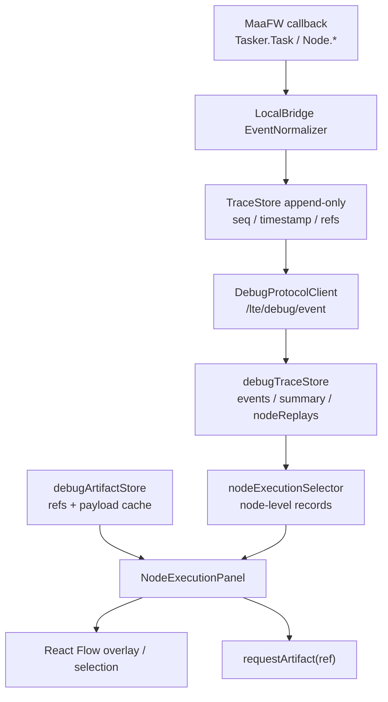

# Debug 节点执行面板 PRD

## 1. Executive Summary

**Problem Statement**：当前 debug-vNext 的 `时间线` 面板按 MaaFW callback 事件展示，信息完整但粒度过细；用户想理解一次调试“经过了哪些 MPE 图节点、每个节点识别/动作/next-list 的结果是什么、失败应从哪个节点继续排查”时，需要在大量事件中手动拼接上下文。

**Proposed Solution**：在 `DebugModal` 内新增 `节点执行` 面板，以 MPE 图节点为一等视图单位，将 append-only trace 聚合为实时节点执行序列、节点详情、识别/动作摘要、next 候选、artifact 入口和画布联动状态。面板吸收 MaaDebugger 的任务详情树/运行时服务分层、MSE Launch Panel 的事件缓冲和图片缓存思路，但保持 MPE 的图优先、节点映射、跨文件定位和 Modal 集中调试特色。

**Success Criteria**：

- 在一次 full run 或 run-from-node 中，面板能按执行顺序展示 >= 95% 已映射 MPE 节点，且每个节点显示 `runtimeName`、`fileId/nodeId`、状态、`seq` 范围和最近 MaaFW 原始事件名。
- 用户从失败事件定位到失败节点的平均操作不超过 2 次点击：打开 `节点执行` 面板，点击失败节点或失败摘要。
- 对具备 `detailRef` / `screenshotRef` 的识别和动作事件，面板提供按需加载入口，不把 raw/draw/base64 直接嵌入节点列表。
- 对同一节点多次命中场景，面板能展示多次执行记录，且记录顺序与后端 `seq` 一致。
- 面板在 1000 条 trace event、300 个节点执行记录以内保持可交互；列表渲染不得明显阻塞 Modal 其他面板切换。

## 2. User Experience & Functionality

**User Personas**：

- Pipeline 作者：在 MPE 图编辑器中编写和连接节点，需要快速知道一次运行路径是否符合预期。
- 调试排障用户：遇到识别失败、动作未执行、next 跳转错误时，需要从失败节点直接查看相关截图、detail JSON 和原始 MaaFW message。
- Agent / custom recognition 开发者：需要观察某个节点多次执行时的 recognition/action 结果和耗时变化。
- 维护大型跨文件项目的用户：需要把运行时 `runtimeName` 稳定映射回 MPE 的 `fileId/nodeId/sourcePath`，避免只看 MaaFW 节点名。

**User Stories**：

- As a Pipeline 作者, I want to view a node-level execution sequence so that I can understand the actual path through the graph without reading every callback event.
- As a 调试排障用户, I want to click a failed node and see recognition/action/next-list details so that I can determine whether the failure came from matching, action, or branch selection.
- As a 图编辑用户, I want node execution records to synchronize with React Flow selection so that I can jump between Modal and canvas without manually searching node names.
- As a custom recognition developer, I want repeated executions of the same node to be grouped but individually inspectable so that I can compare hit/box/detail differences.
- As a performance-sensitive user, I want slow nodes and repeated nodes highlighted so that I can focus on expensive or unstable parts of the pipeline.

**Acceptance Criteria**：

- 面板入口：`DebugModal` 左侧导航新增 `节点执行`，建议位于 `时间线` 前后；面板说明明确“按 MPE 节点聚合当前 session trace”。
- 空状态：无 trace 时展示“暂无节点执行记录”；只有 session/localbridge 事件但没有节点事件时展示“当前 trace 尚未出现可映射节点事件”。
- 节点列表：默认按执行顺序展示节点执行记录，而不是按节点字典排序；每条记录至少包含显示名、运行时名、状态、`seq first-last`、事件数、识别数、动作数、next-list 数、artifact 数。
- 当前节点：运行中节点显示 `running` 状态并置顶或高亮；回放模式下状态来自 `summary` 而非 `liveSummary`，并显示 `Replay #cursorSeq` 标签。
- 多次执行：同一 `nodeId + runId` 的多段执行必须可区分，至少显示第 N 次命中和各自 `seq` 范围；不能只保留最后一次。
- 详情区：点击节点执行记录后展示该记录的 recognition、action、next-list、wait-freezes、diagnostic、artifact refs 和 MaaFW 原始 message 列表。
- 识别摘要：识别事件展示 `phase`、`hit`、`algorithm`、`box`、`detailRef`、`screenshotRef`；字段从事件 data 与 artifact JSON 中优先读取，未加载 artifact 时只展示已有事件字段。
- 动作摘要：动作事件展示 `phase`、`action`、`success`、`box`、`detailRef`；危险动作只展示结果，不在详情区直接重新执行。
- next-list 摘要：展示候选 next 列表、jump_back、anchor，以及可映射到的 MPE edge；无法映射时保留 runtimeName。
- Artifact 行为：点击 `查看详情` 或 `查看图像` 才调用现有 `requestArtifact`；列表首屏不主动拉取所有 artifact。
- 画布联动：点击记录时调用现有节点选择/定位能力，选中对应 React Flow 节点；从画布选择节点时面板应可筛选或滚动到该节点最近执行记录。
- 筛选：支持按状态、runId、节点、event kind、是否含 artifact、是否失败筛选；P0 可先实现节点和状态筛选。
- 降级：未映射到 MPE 节点的事件仍可显示为 `runtimeName-only` 记录，不能丢失 trace。
- 可访问性：状态不能仅依赖颜色，必须有文字标签；列表项支持键盘焦点和回车打开详情。

**Non-Goals**：

- 不实现断点、暂停、继续、单步调试器语义。
- 不替代 `时间线` 面板；事件级排查仍由 TimelinePanel 承担。
- 不持久化历史调试记录；面板只展示当前 session 内 trace。
- 不在节点字段编辑面板中嵌入运行态详情。
- 不直接解析或展示所有 MaaFW 日志文件；日志仍由 `日志` 面板处理。
- 不在首版引入复杂图表、火焰图或完整性能剖析；性能面板继续负责运行后性能摘要。

## 3. AI System Requirements (If Applicable)

本面板首版不包含 AI 推理、LLM 诊断或自动修复建议。

**Tool Requirements**：无 AI 工具依赖。所有数据来自 `DebugEvent`、`DebugTraceSummary`、`DebugNodeReplay`、`DebugArtifactRef`、`DebugDiagnostic` 和 MaaFW detail artifact。

**Evaluation Strategy**：不适用 AI 输出质量评估。功能质量通过确定性 trace fixture、UI 交互和 artifact 按需加载行为验证。

## 4. Technical Specifications

**Architecture Overview**：



**Data Sources**：

- `summary.nodeReplays`：首选节点级聚合来源，已包含 `events`、`recognitionEvents`、`actionEvents`、`nextListEvents`、`waitFreezesEvents`、`detailRefs`、`screenshotRefs`、`firstSeq`、`lastSeq`。
- `summary.nodeStates`：用于当前节点状态、最新状态和画布 overlay 对齐。
- `events`：用于补齐未映射节点、diagnostic/log/session 辅助信息，以及在 selector 中处理跨 run 或 replay 过滤。
- `performanceSummary.nodes`：运行结束后可选增强，用于补充 `durationMs`、慢节点标记和统计，不作为首屏必要依赖。
- `artifacts`：只读取 ref 和已加载 payload；详情点击时通过 controller 的 `requestArtifact` 按需加载。
- `pipelineNodes` / resolver snapshot：用于显示名、文件路径、跨文件定位和 React Flow 节点选择。

**Suggested Data Model**：

```ts
type DebugNodeExecutionRecord = {
  id: string;
  sessionId?: string;
  runId: string;
  nodeId?: string;
  fileId?: string;
  runtimeName: string;
  label?: string;
  sourcePath?: string;
  status: "running" | "succeeded" | "failed" | "visited";
  occurrence: number;
  firstSeq: number;
  lastSeq: number;
  eventCount: number;
  recognitionCount: number;
  actionCount: number;
  nextListCount: number;
  waitFreezesCount: number;
  diagnosticCount: number;
  detailRefs: string[];
  screenshotRefs: string[];
  events: DebugEvent[];
};
```

**Selector Rules**：

- P0 优先复用 `summary.nodeReplays`，避免在 UI 组件内重复归约 trace。
- `DebugNodeExecutionRecord.id` 建议为 `${runId}:${nodeId ?? runtimeName}:${firstSeq}:${lastSeq}`，避免同一节点多次执行互相覆盖。
- 排序以 `firstSeq ASC` 为默认；UI 可提供 `lastSeq DESC` 或失败优先视图，但不得改变底层事实顺序。
- replay active 时使用 `summary` 生成记录；live 模式使用 `liveSummary` 或 `summary`，保持与现有回放语义一致。
- 未映射节点使用 `runtimeName` 作为稳定 key，并标记 `unmapped`，详情中显示 resolver miss 提示。
- 运行中的记录若只有 starting 事件，`lastSeq` 等于当前最后事件 seq，状态为 `running`。
- `durationMs` 首版可由 `firstTimestamp/lastTimestamp` 估算；若 performance summary 存在，以后端 summary 为准。

**UI Layout**：

- 顶部工具条：runId、实时/回放标签、节点搜索框、状态筛选、失败优先切换、只看选中节点。
- 左侧/上方列表：节点执行序列，支持紧凑卡片或表格；建议用列表卡片保留可读性。
- 右侧/下方详情：当前选中节点执行详情，包括概览、事件摘要、识别、动作、next-list、artifacts、raw MaaFW message。
- 移动或窄宽度：详情区改为列表下方，避免 Modal 横向溢出。
- 状态视觉：`running` 使用蓝色/动效点，`succeeded` 绿色，`failed` 红色，`visited` 灰色；同时保留文字。

**Integration Points**：

- `src/features/debug/types.ts`：新增 `DebugModalPanel` 值，例如 `node-execution` 或 `nodes`；如新增 `DebugNodeExecutionRecord` 类型，也放在 debug feature 内而非全局业务类型。
- `src/components/debug/DebugModal.tsx`：新增导航项和 `ActivePanel` 分支。
- `src/features/debug/components/panels/NodeExecutionPanel.tsx`：新增面板组件。
- `src/features/debug/traceReducer.ts`：优先不改；若现有 `nodeReplays` 无法表达多段执行，再最小扩展 reducer。
- `src/features/debug/hooks/useDebugModalController.ts`：暴露 selector 结果、选中执行记录、筛选状态、artifact 请求、节点定位 action。
- `src/stores/debugModalMemoryStore.ts`：持久化面板筛选偏好，例如状态筛选、只看失败、只看选中节点。
- `src/stores/debugOverlayStore.ts`：如需要高亮选中执行记录对应节点和边，可由面板触发 overlay selection。
- `LocalBridge/internal/debug/events/normalizer.go`：P0 不要求变更；P1 可补齐 wait-freezes、edge reason、duration 等 enrich 信息。
- `LocalBridge/internal/debug/performance/service.go`：运行后增强慢节点标记，不应成为面板 P0 的硬依赖。

**Dependency On MaaFW Official Capabilities**：

- MaaFW callback protocol 提供 `Tasker.Task.*`、`Node.PipelineNode.*`、`Node.Recognition.*`、`Node.Action.*`、`Node.NextList.*`、`Node.WaitFreezes.*` 等事件，面板不设计不存在的 callback。
- Go binding 的 `Tasker.GetTaskDetail`、`GetRecognitionDetail`、`GetActionDetail`、`GetLatestNode` 可用于 artifact/detail 补充；首屏只使用已有 event refs。
- Debug 图像依赖 MaaFW debug/save_draw/reco image cache 能力，面板只显示已存在的 raw/draw/screenshot ref。

**Security & Privacy**：

- 面板不得在列表中直接渲染大体积 raw/draw/base64 图像，避免泄漏和内存峰值。
- artifact payload 只在用户点击后加载；已加载 JSON 使用 `<pre>` 或安全 JSON viewer，不执行其中脚本。
- 路径展示应优先使用项目相对路径；绝对路径仅在已有调试数据中存在时展示，不额外采集。
- action-only 或危险动作的再次执行入口不放在详情区，避免用户误触。

**Performance Requirements**：

- 1000 条事件以内，节点记录 selector 单次计算目标 < 50ms；如超过，应使用 `useMemo`、selector 缓存或列表虚拟化。
- 节点列表首屏不得主动请求 artifact；artifact 请求数量由用户点击触发。
- 面板组件不应在每个事件到达时全量 JSON stringify 已加载 artifact；JSON 只在详情展开时渲染。
- 若记录数超过 300，启用分页、虚拟列表或只渲染可视区域。

**Testing / Validation**：

- 使用构造的 trace fixture 覆盖：完整成功路径、识别失败、动作失败、next-list 候选、同节点多次执行、未映射 runtimeName、replay cursor 过滤。
- 验证同一 run 中多个 `nodeId` 记录按 `firstSeq` 升序展示。
- 验证同一节点重复执行时 occurrence 正确递增，且 artifact refs 不串到其他 occurrence。
- 验证点击节点执行记录会选中/定位对应 React Flow 节点；未映射节点不会报错。
- 验证 artifact 只在点击详情按钮后请求。
- 局部语法/类型检查可针对新增文件执行，不要求仓库级 build。

## 5. Risks & Roadmap

**Phased Rollout**：

- MVP：新增 `节点执行` 面板，基于 `summary.nodeReplays` 渲染节点执行序列、状态、seq 范围、事件计数、详情事件列表和 artifact 按需入口；支持点击定位画布节点。
- v1.1：补充筛选、只看失败、只看选中节点、同节点多次执行折叠、next-list 到 edge 的可视映射、运行后 duration/slow node 标记。
- v1.2：补充 artifact JSON 轻量摘要解析，展示 recognition hit/algorithm/box、action success/action/box、draw/raw 缩略图入口。
- v2.0：支持节点级 trace replay 详情、与画布 overlay 的执行路径热力联动、批量识别结果按节点聚合、多 run 对比。

**Technical Risks**：

- `nodeReplays` 当前按 `nodeId:runId` 聚合，若同一节点在一次 run 中多次非连续执行，可能无法天然拆成多段 occurrence；需要确认 reducer 是否按连续执行段拆分，必要时扩展为 execution segment。
- MaaFW 的 `Node.RecognitionNode` / `Node.ActionNode` 与 `Node.Recognition` / `Node.Action` 可能在不同 run mode 下同时或分别出现，UI 需要避免重复计数。
- 部分事件没有 `node.nodeId`，只能用 `runtimeName` 显示，跨文件同名节点需要 resolver snapshot 兜底。
- detail artifact 的 JSON 结构随算法和 MaaFW binding 变化，UI 不应硬编码过深字段路径。
- 长任务 trace 高频更新可能导致列表抖动，需要保持选中记录稳定，不因 `lastSeq` 更新丢失展开状态。
- 如果后端未来补齐 wait-freezes 和 controller action events，面板筛选和计数需要兼容新增 kind。

**Open Questions**：

- 面板名称最终采用 `节点执行`、`节点视图` 还是 `执行树`；建议首版使用 `节点执行`，强调不是完整调用栈调试器。
- `nodeReplays` 是否需要从“每节点每 run 一组”调整为“连续执行段”；若要调整，应同步影响 PerformancePanel 和画布 overlay。
- 是否需要把失败摘要提升到 OverviewPanel 顶部，点击后直接跳转到 `节点执行` 面板的失败记录。
- 是否要在 P0 引入列表虚拟化；如果当前 trace 规模较小，可先保留普通 List，记录性能阈值后再优化。

## 6. Reference Notes

**MaaDebugger 可吸收设计**：

- 后端运行时分层清晰，TaskerService 维护任务执行状态和运行时节点数据。
- 任务详情树适合表达完整 task -> node -> recognition/action 层级。
- 图片、绘制图和截图应通过缓存或引用延迟读取，而不是嵌入事件。
- 前端运行树可由事件归约得到，不应由协议层直接改 UI 状态。

**MSE 可吸收设计**：

- Launch 流程把 controller、resource、tasker、debug session 和 panel 组合成一次明确运行。
- Launch Panel 的事件缓冲、图片缓存和 analyzer bridge 思路适合节点详情回放。
- 静态图调试和诊断先行对 MPE 的 recognition-only / fixed-image recognition 很关键。
- MSE 的 pause/continue/break 语义不纳入本 PRD，MPE 继续采用入口节点驱动的独立 run 模型。

**MPE 必须保留的特色**：

- 面板围绕 MPE 图节点而不是纯 MaaFW task name 展示。
- 每条节点记录必须尽量映射 `fileId/nodeId/runtimeName/displayName/sourcePath`。
- Modal 是全量调试入口；画布只做 overlay、选中和轻量右键 action。
- trace 是事实来源，artifact 是大对象引用，UI 只做 selector 和展示。

## 7. Implementation Progress

### 2026-04-29 MVP/P0：节点执行面板落地

已完成：

- 前端新增 `节点执行` 面板入口，位于 `DebugModal` 的 `时间线` 面板之后；面板名称采用 `节点执行`。
- 新增 `NodeExecutionPanel`，提供当前 run/replay 标签、节点筛选、状态筛选、只看画布选中节点、清空筛选、节点执行序列和节点详情区。
- `traceReducer` 的 `nodeReplays` 从“每 run 每 node 一个聚合桶”调整为“连续执行段数组”；同一节点在一次 run 中多次命中会生成独立 occurrence，不再互相覆盖。
- 节点执行 selector 新增 `DebugNodeExecutionRecord` 扁平记录，按 `firstSeq ASC` 输出，并补齐 displayName/sourcePath、状态、计数、artifact refs、unmapped 标记。
- 对缺少 `nodeId` 的 MaaFW 事件保留 `runtimeName-only` 记录；可映射记录点击后复用现有画布定位能力选中并聚焦 React Flow 节点。
- 识别、动作、next-list、wait-freezes、diagnostic、MaaFW 原始消息和 artifact refs 已纳入详情区；artifact 仍然只在点击 `查看详情` / `查看图像` 时通过现有 `requestArtifact` 按需加载。
- next-list 详情会用 resolver edge index 映射 `fromRuntimeName -> toRuntimeName`，能映射时展示 edgeId，不能映射时保留 runtimeName。
- 筛选偏好通过 `debugModalMemoryStore` 持久化，当前 P0 只持久化 `nodeId` 和 `status`。
- 本轮未改 LocalBridge wire protocol，未新增 MaaFW callback，`DEBUG_PROTOCOL_VERSION` / `ProtocolVersion` 保持 `0.17.0`。

主要文件：

- `src/components/debug/DebugModal.tsx`
- `src/features/debug/components/panels/NodeExecutionPanel.tsx`
- `src/features/debug/traceReducer.ts`
- `src/features/debug/nodeExecutionSelector.ts`
- `src/features/debug/hooks/useDebugNodeExecutionController.ts`
- `src/features/debug/hooks/useDebugModalController.ts`
- `src/stores/debugModalMemoryStore.ts`

验证记录：

- `yarn eslint src/components/debug/DebugModal.tsx src/features/debug/controllerDisplay.ts src/features/debug/confirmActionRun.ts src/features/debug/debugEventSelectors.ts src/features/debug/hooks/useDebugModalController.ts src/features/debug/hooks/useDebugNodeExecutionController.ts src/features/debug/traceReducer.ts src/features/debug/nodeExecutionSelector.ts src/features/debug/components/panels/NodeExecutionPanel.tsx src/stores/debugModalMemoryStore.ts src/features/debug/traceReducer.test.ts src/features/debug/nodeExecutionSelector.test.ts`：通过。
- `yarn vitest run src/features/debug/traceReducer.test.ts src/features/debug/nodeExecutionSelector.test.ts`：仓库当前 `vite.config.ts` 引用的 `tests/setup.ts` 不存在，命令在 setup 阶段失败，未进入测试逻辑。
- 使用临时无 setup 的 Vitest config 执行同一组测试：通过，`2 passed / 8 tests passed`。
- `yarn tsc -p tsconfig.app.json --noEmit`：仍失败于仓库既有 TypeScript 基线问题，例如 `src/components/iconfonts/*` 生成文件、`src/components/Flow.tsx` 和若干既有未使用变量；过滤本轮触碰文件后没有新增类型错误。
- `git diff --check -- src`：通过。
- 本轮没有触碰 `LocalBridge`，因此未运行 `go test ./...`。

已知限制与后续项：

- P0 未引入列表虚拟化；当前仍按普通 Ant Design List 渲染。若真实 trace 记录超过 300 条后出现交互卡顿，再进入 v1.1 的分页或虚拟列表。
- 识别/动作详情只读取事件字段和已加载 artifact JSON 的浅层字段，不做完整 detail schema 解析。
- 失败摘要未提升到 OverviewPanel；后续可在总览中增加失败节点快捷入口并跳转到 `节点执行` 面板。
- `wait-freezes` 仍受当前 MaaFW Go binding 暴露能力限制；面板兼容事件 kind，但不承诺不存在的 detail API。

### 2026-04-29 v1.1：筛选、失败快捷入口与性能标记

已完成：

- `DebugNodeExecutionRecord` 补充 `durationMs`、`durationSource`、`slow`、`hasFailure`、`hasArtifact` 和 `eventKinds`；耗时优先使用能按 `nodeId/runtimeName + seq` 精确匹配的 `performanceSummary`，否则由 trace timestamp 估算。
- `DebugNodeExecutionFilters` 扩展 `runId`、`eventKind`、`artifact`、`failedOnly`、`sortMode`、`groupRepeated`，并通过 `debugModalMemoryStore` 只持久化结构化筛选偏好；搜索框保持为 `NodeExecutionPanel` 本地状态。
- `节点执行` 面板补齐 runId、节点搜索、状态、事件类型、artifact、有失败、排序、只看选中节点和按节点折叠筛选；默认仍按执行顺序平铺，折叠模式按 `runId + nodeId/runtimeName` 分组且组内保留 occurrence 顺序。
- 节点记录列表补充耗时、慢节点、失败、artifact 和 event kind 标签；当过滤结果超过 300 条时使用 Ant Design List 分页，默认 page size 为 100，未引入新的虚拟列表依赖。
- 选中节点执行记录上移到 `useDebugNodeExecutionController`，`OverviewPanel` 新增失败节点快捷区，点击 `查看失败节点` 会设置失败筛选、切到 `节点执行` 面板并选中最近失败记录。
- 列表渲染拆分到 `NodeExecutionRecordList`，事件类型标签与耗时格式化拆分到 `nodeExecutionDisplay`，避免继续扩大 `NodeExecutionPanel` 单文件体积。

主要文件：

- `src/features/debug/types.ts`
- `src/features/debug/nodeExecutionSelector.ts`
- `src/features/debug/nodeExecutionDisplay.ts`
- `src/features/debug/hooks/useDebugNodeExecutionController.ts`
- `src/features/debug/hooks/useDebugModalController.ts`
- `src/features/debug/components/panels/NodeExecutionPanel.tsx`
- `src/features/debug/components/panels/NodeExecutionRecordList.tsx`
- `src/features/debug/components/panels/OverviewPanel.tsx`
- `src/stores/debugModalMemoryStore.ts`
- `src/features/debug/nodeExecutionSelector.test.ts`

验证记录：

- `yarn eslint src/features/debug/types.ts src/features/debug/nodeExecutionSelector.ts src/features/debug/nodeExecutionSelector.test.ts src/features/debug/nodeExecutionDisplay.ts src/features/debug/hooks/useDebugNodeExecutionController.ts src/features/debug/hooks/useDebugModalController.ts src/features/debug/components/panels/NodeExecutionPanel.tsx src/features/debug/components/panels/NodeExecutionRecordList.tsx src/features/debug/components/panels/OverviewPanel.tsx src/stores/debugModalMemoryStore.ts`：通过。
- `yarn vitest run src/features/debug/traceReducer.test.ts src/features/debug/nodeExecutionSelector.test.ts`：仓库当前 `vite.config.ts` 引用的 `tests/setup.ts` 不存在，命令仍在 setup 阶段失败，未进入测试逻辑。
- `git diff --check -- src dev/design/debug-node-execution-panel-prd.md`：通过。
- 本轮没有触碰 `LocalBridge`，也未修改 debug wire protocol，因此未运行 `go test ./...`。

已知限制与后续项：

- 本轮推进范围限定为 v1.1，未进入 v1.2 的 artifact JSON 深层 schema 摘要解析或 raw/draw 缩略图能力。
- 慢节点标记只来自 `performanceSummary.slowNodes` 精确匹配，不在前端自行发明耗时阈值。
- performance 耗时只在 `nodeId/runtimeName + firstSeq/lastSeq` 可明确匹配时覆盖 trace 估算；无法明确匹配的重复节点仍展示 trace timestamp 估算值。

### 2026-04-29 v1.2：Artifact 摘要与派生图像入口

已完成：

- 新增 `artifactDetailSummary` 纯 helper，基于现有 `recognition-detail` / `action-detail` artifact JSON 解析浅层摘要字段；识别摘要覆盖 `id/name/algorithm/hit/box/detail/detailJson/rawImageRef/drawImageRefs/screenshotRef/combinedResult`，动作摘要覆盖 `id/name/action/success/box/detail/detailJson`。
- 新增 `DebugArtifactPreview` 共享预览组件，统一处理 artifact 的 loading、error、image、JSON 和文本展示；`ImagesPanel` 与 `节点执行` 详情区复用同一预览逻辑。
- `NodeExecutionPanel` 的详情区拆分为 `NodeExecutionRecordDetails`，主面板只保留筛选、列表布局和选中记录状态；拆分后 `NodeExecutionPanel` 约 402 行，避免继续逼近单文件 800 行上限。
- 节点执行详情中的 recognition/action 摘要改为事件字段优先、已加载 artifact JSON 补齐；未知或 malformed payload 会安全降级，不绑定 MaaFW 算法私有深层结构。
- Artifact 区按 `详情 JSON`、`事件图像`、`详情派生图像` 分组；识别 detail 加载后会从 `rawImageRef`、`drawImageRefs`、`screenshotRef` 生成 `查看原图`、`查看绘制图`、`查看截图` 按钮。
- `registerProtocolListeners` 在收到 `recognition-detail` payload 后会把派生 raw/draw/screenshot 图像 ref 注册进 artifact store，确保派生图像仍通过现有 `requestArtifact(ref)` 按需拉取。
- 本轮未修改 LocalBridge wire protocol，未新增 MaaFW callback，未修改 `DEBUG_PROTOCOL_VERSION` / `ProtocolVersion`。

主要文件：

- `src/features/debug/artifactDetailSummary.ts`
- `src/features/debug/components/DebugArtifactPreview.tsx`
- `src/features/debug/components/panels/NodeExecutionRecordDetails.tsx`
- `src/features/debug/components/panels/NodeExecutionPanel.tsx`
- `src/features/debug/components/panels/ImagesPanel.tsx`
- `src/features/debug/registerProtocolListeners.ts`
- `src/features/debug/artifactDetailSummary.test.ts`

验证记录：

- `yarn eslint src/features/debug/artifactDetailSummary.ts src/features/debug/artifactDetailSummary.test.ts src/features/debug/components/DebugArtifactPreview.tsx src/features/debug/components/panels/NodeExecutionPanel.tsx src/features/debug/components/panels/NodeExecutionRecordDetails.tsx src/features/debug/components/panels/ImagesPanel.tsx src/features/debug/registerProtocolListeners.ts`：通过。
- `yarn vitest run src/features/debug/artifactDetailSummary.test.ts src/features/debug/traceReducer.test.ts src/features/debug/nodeExecutionSelector.test.ts`：仓库当前 `vite.config.ts` 引用的 `tests/setup.ts` 不存在，命令在 setup 阶段失败，未进入测试逻辑。

已知限制与后续项：

- 本轮只做 artifact JSON 浅层摘要和图像入口，不解析算法私有 detail schema，也不做 raw/draw 缩略图网格或批量预加载。
- 详情派生图像入口依赖用户先点击加载对应 detail artifact；列表首屏和节点详情展开时仍不会主动请求整批 artifact。
- v2.0 的节点级 trace replay、画布执行路径热力和多 run 对比仍未进入本轮范围。
