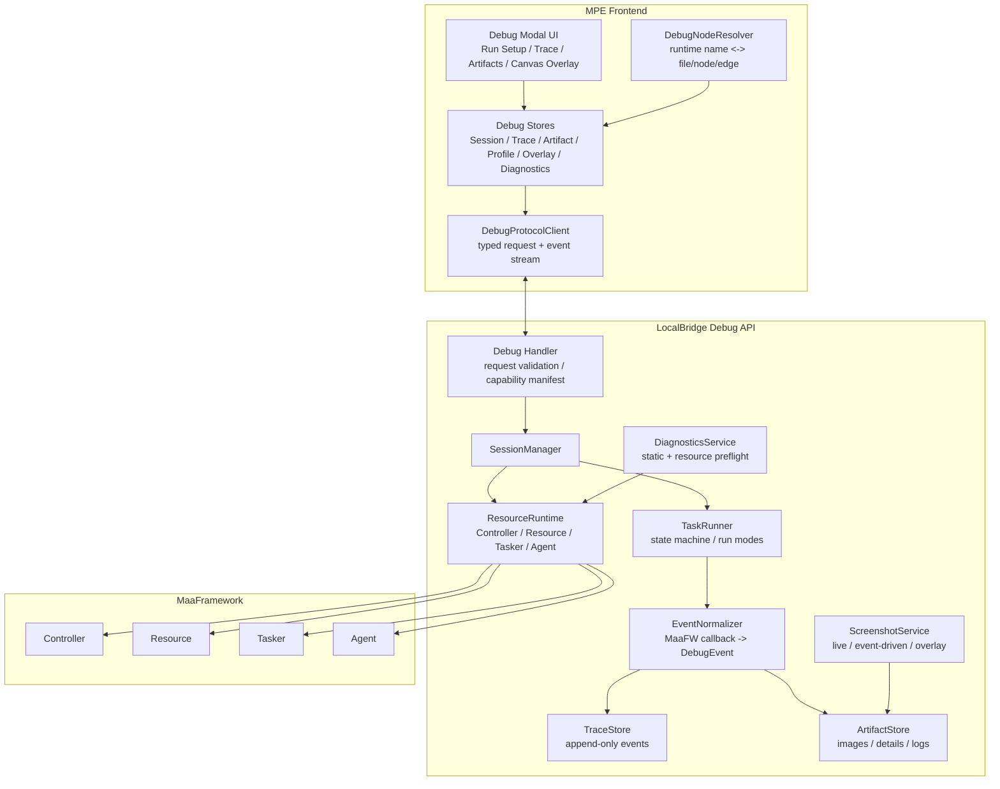

# MPE 调试系统重构方案

## 1. 目标与边界

本文档用于指导 MaaPipelineEditor 的调试功能重构。重构目标不是在现有 `debugStore + DebugProtocol + DebugPanel` 的基础上继续补丁式扩展，而是重新定义调试系统的业务边界、运行时边界、数据契约和前端体验。

本次重构采用破坏式切换：旧调试业务接口、旧调试 store、旧调试面板和 LocalBridge 旧调试 handler 不做兼容保留。用户通过下载最新版前端与 LocalBridge 获得新调试能力。只有被非调试业务复用的底层能力可以保留，例如通用 MaaFW adapter、文件导出、配置读取、资源路径解析等。

新架构还必须面向后续扩展。调试系统不能只满足第一批 full run、节点测试和识别测试，而应允许未来继续增加 replay/record、性能分析、批量识别验证、AI 辅助诊断等功能时，不再重新拆一遍基础模块。

本方案参考了两个同行产品：

- MaaDebugger：独立调试程序，后端运行时分层清晰，任务执行、截图、资源、Agent、WebSocket/HTTP 通信拆分明确。
- maa-support-extension：VS Code 插件，资源索引、Launch 流程、静态图调试、诊断、调试面板和扩展宿主隔离做得比较完整。

但 MPE 不应照搬任一方。MPE 的核心产品特性是“图形化编辑 pipeline”，调试系统必须服务于图节点、跨文件配置、可视化连线、编辑态未保存内容和节点级检查，而不是退化成一个通用 MaaFW 任务启动器。

非目标：

- 不重写编辑器、文件系统、导入导出、配置面板等已经可用的业务。
- 不在 `dev/instructions` 下写入任何项目设计文档，该目录视为只读参考资料。
- 不依赖浏览器自动化或 `yarn dev` 验证本文档。
- 不实现断点、暂停、继续、单步等完整调试器语义；用户通过指定入口节点、单节点运行、仅识别、仅动作完成节点级调试。

## 2. 当前调试模块的核心问题

当前调试模块已经失去清晰边界，主要问题如下：

- 前端状态过度集中：`src/stores/debugStore.tsx` 同时承担配置、启动保存、运行态、事件归约、识别缓存、节点测试结果、弹窗副作用等职责。
- 协议层混入业务和 UI：`src/services/protocols/DebugProtocol.ts` 不只是传输层，还处理节点名映射、Modal、资源错误提示和单节点测试结果生成。
- UI 与旧 store 绑定过深：`DebugPanel.tsx`、`DebugInfoTab.tsx`、`RecognitionPanel.tsx`、`RecognitionHistoryPanel.tsx` 依赖同一个大 store，无法独立演进。
- 后端 DebugService 职责混杂：`LocalBridge/internal/mfw/debug_service_v2.go` 同时处理 session、resource、tasker、agent、执行和事件输出。
- 事件模型不是 trace-first：前端收到事件后直接改当前状态，缺少可回放、可索引、可从事件推导 UI 的 append-only trace。
- 图片载荷过重：识别 raw/draw 图以 base64 跟随事件发送，长任务或高频识别时会造成内存和传输压力。
- 节点映射脆弱：运行时 node name 到 MPE flow node id 的映射依赖字符串处理，缺少一次运行开始时固定的 resolver snapshot。
- 调试入口与文件保存耦合：`saveFilesBeforeDebug` 是有用设置，但调试系统不应只能通过污染本地文件来执行当前编辑态图。
- 调试入口语义混乱：旧实现容易把调试模式做成一个可开启/关闭的全局状态，但实际需求是打开调试面板后按入口节点发起一次运行。

结论：旧调试模块应整体废弃。新架构不复用旧状态结构、旧前端协议对象、旧事件处理方式和旧调试 handler；只允许提取仍然干净、且被其他业务共享的底层函数。

## 3. 同行方案可吸收的部分

### 3.1 MaaDebugger 的可取点

MaaDebugger 更像一个独立运行时调试台，它的优势在于后端运行时边界清晰：

- Controller、Resource、Tasker、Screenshot、Agent、API 分层明确。
- TaskerService 作为任务执行中枢，维护执行状态机和运行时节点数据。
- 使用 WebSocket 推送高频事件和截图，命令与请求响应走更稳定的请求通道。
- 识别图片、绘制图、截图等大对象通过缓存或引用延迟读取，而不是全部塞进事件。
- 前端状态按 status、screenshot、launchGraph、debugSettings 等拆分，运行树由事件归约得到。
- ResourceService 负责资源加载、bundle 顺序、watcher 和 pipeline checker。
- ScreenshotService 将空闲截图、任务触发截图、压缩、overlay 状态拆成独立 pipeline。

MPE 应吸收这些思想，尤其是“运行时服务分层”和“事件 + artifact 引用”的模式。

不应照搬的部分：

- MaaDebugger 是独立调试程序，文件和资源管理以运行台为中心；MPE 应以图编辑器和项目文件为中心。
- MaaDebugger 的任务详情树适合全局时间线；MPE 还需要把事件直接投影到 React Flow 画布、节点详情抽屉和跨文件配置。
- MaaDebugger 的前端栈和 Pinia 组织方式不能直接迁移到 MPE。

### 3.2 maa-support-extension 的可取点

MSE 是 VS Code 插件，它的优势在于把调试、语言服务和资源索引绑定得很紧：

- Extension lifecycle 有清晰初始化顺序：状态、根目录、native/server、interface、diagnostic。
- ServerService 使用独立子进程隔离 native library，降低扩展宿主崩溃风险。
- InterfaceBundle 将 interface、resource、pipeline 索引成统一上下文，供启动、诊断和 webview 使用。
- LaunchService 将 controller、resource、tasker、debug session、launch panel 组合成一次运行。
- Launch Panel 有 break task、pause/continue/stop、事件缓冲、图片缓存和 analyzer bridge。
- 支持静态图或 fixed controller 进行识别、模板匹配和调试，这对 MPE 的“节点级识别测试”很有价值。
- Diagnostics、Pipeline Manager、语言智能把静态检查和运行时检查前置，减少启动后才发现错误。

MPE 应吸收这些思想，尤其是“统一资源索引”“静态图调试”“Launch 会话模型”“诊断先行”。

不应照搬的部分：

- MSE 的 UI 是 VS Code webview 和文本文件工作流；MPE 的主视图是 React Flow 图编辑器。
- MSE 的语言服务、hover、definition 等能力对 MPE 有启发，但不应成为调试重构的第一阶段核心。
- MSE 的扩展宿主隔离模型与 MPE 的 LocalBridge/Wails 边界不同，只能借鉴思想，不能照搬进程模型。
- MSE 的 break/pause/continue 调试器语义不作为 MPE 本次重构目标；MPE 通过指定入口节点发起新的运行来覆盖节点级调试。

### 3.3 MaaFW 官方能力边界

新调试模块必须以官方 MaaFW 能力为基础，禁止凭空设计不存在的 native API。需要优先使用以下官方能力：

- 初始化和全局选项：`Init`、`Release`、`IsInited`、`SetDebugMode`、`SetSaveDraw`、`SetSaveOnError`、`SetRecoImageCacheLimit`、`SetDrawQuality`。
- Controller：ADB、Win32、Dbg、Replay、Record 等 controller 类型。
- Resource：`NewResource`、`PostBundle`、`OverridePipeline`、`OverrideNext`、`OverrideImage`、`GetNode`、`GetNodeJSON`、`GetNodeList`、默认识别/动作参数查询和 resource event sink。
- Tasker：`NewTasker`、`BindResource`、`BindController`、`PostTask`、`PostRecognition`、`PostAction`、`PostStop`、`ClearCache`。
- Detail API：`TaskJob.GetDetail`、`GetTaskDetail`、`GetRecognitionDetail`、`GetActionDetail`、`GetLatestNode` 等 detail 查询能力。
- Context：`RunTask`、`RunRecognition`、`RunRecognitionDirect`、`RunAction`、`RunActionDirect`、`OverridePipeline`、`OverrideNext`、`OverrideImage`、状态查询和 hit count 等。
- Agent：`NewAgentClient`、`WithIdentifier`、`WithTcpPort`、`Connect`、`Disconnect`、`BindResource`、`SetTimeout`、custom recognition/action list introspection。
- 回调协议：内部事件应保留 MaaFW 官方事件名，并通过新版 Go binding 的 event sink 和 `OnNode*InContext` 便捷注册能力接入，例如 tasker lifecycle、pipeline node、recognition node、action node、next-list、recognition、action 等事件。

MPE 可以在 UI 边界翻译事件名，但后端和协议层应尽量保留官方语义，避免以后升级 MaaFW 时二次映射失真。

## 4. 新调试系统设计原则

1. 图优先：运行时事件必须能稳定映射回 MPE 的 file、flow node、edge、字段和跨文件 prefix。
2. Trace 优先：所有运行态先落成 append-only event trace，再由 selector/reducer 推导 UI 状态。
3. 运行时隔离：LocalBridge 是 MaaFW runtime 的唯一边界，前端不直接持有 native 细节。
4. 大对象引用化：截图、raw image、draw image、action detail 等大载荷以 artifact ref 形式传输，按需拉取。
5. Profile 驱动：interface 导入项、资源路径、controller、多 agent、entry、保存策略、debug mode 等组成可复用 run profile。
6. 编辑态无污染：默认可以基于当前图快照导出临时 debug sandbox；`saveFilesBeforeDebug` 不再作为调试入口设计中心，只作为可被新 profile 重新表达的旧设置来源。
7. 能力检测：replay、record、静态图调试、多 agent 等按后端 capability 显示，不做假 UI。
8. 破坏式切换：旧调试 route、旧调试 store 和旧事件模型直接废弃，不设计旧接口适配层。
9. 扩展优先：run mode、诊断器、事件处理器、artifact 类型、截图源、画布 overlay、详情面板都必须有明确注册边界，后续功能通过扩展点接入。
10. Modal 优先：点击调试按钮后直接打开调试 Modal。调试不再有开启/关闭状态，主画布不再显示常驻调试工具栏或 DebugPanel 工作栏，全量级调试能力集中在 Modal 内，画布只保留必要的节点状态投影和右键节点动作。
11. 本地记忆优先：调试 Modal 内的输入框、选择项、折叠状态和最近选择应本地持久化，避免每次打开重复填写；运行 trace 只服务于当前会话展示，不做 MPE 自有调试记录持久化，长期记录以 MaaFW 自动生成的 `maa.log` 为准。

## 5. 总体架构



关键变化：

- 前端 protocol client 只负责传输，不弹 Modal、不修改业务 store、不拼装测试结果。
- 后端 MaaFW callback 先归一化为 DebugEvent，再写入 TraceStore 和推送前端。
- 图片和 detail 不直接嵌进事件，事件只携带 `artifact_ref` 或 `detail_ref`。
- MPE 在每次 run start 前生成 `DebugNodeResolverSnapshot`，把图编辑态和运行时节点名固定下来。
- Debug API 可以继续使用 `/mpe/debug/...` 命名空间，但只接受新契约，不提供旧 `/mpe/debug/start`、`/mpe/debug/stop` 等旧业务 route 的兼容转发。
- 后端和前端都暴露 capability manifest，UI 根据能力加载功能，而不是把所有调试功能硬编码在一个面板里。
- 调试入口按钮只负责打开 `DebugModal`，不存在调试模式的开启/关闭状态。旧调试工具栏、旧 `DebugPanel` 工作栏和画布上的常驻调试控制区都应删除；运行控制、资源选择、agent 连接、trace、图像和诊断统一放在 Modal 内。打开 Modal 时如果 LocalBridge 未连接，再在 Modal 内提示连接或启动 LocalBridge。

### 5.1 扩展点模型

为了支持未来持续添加调试功能，新系统应采用内部扩展点，而不是把所有逻辑写死在 runner、store 或 UI 组件中。这里的“扩展点”不是面向第三方插件的公开 API，而是 MPE 内部模块化边界。

后端扩展点：

- `RunModeProvider`：注册一种运行模式，负责校验请求、准备 override、调用 MaaFW API、声明需要的 capability。
- `DiagnosticProvider`：注册一种启动前或运行中诊断，例如 pipeline 引用检查、图片资源检查、MaaFW 加载检查、性能阈值检查。
- `EventEnricher`：基于 MaaFW callback 补充 MPE 节点映射、耗时、边原因、detail/artifact 引用。
- `ArtifactProvider`：注册 artifact 类型和读取方式，例如识别图、动作详情、截图帧、日志片段、性能 profile。
- `ScreenshotSource`：注册 live、event-triggered、replay frame 等截图来源。

前端扩展点：

- `DebugModalContribution`：注册调试 Modal 内的功能面板，例如运行配置、interface 导入、资源、agent、时间线、节点详情、图像、诊断、性能。
- `CanvasDebugOverlay`：注册画布 overlay，例如当前节点、执行路径、next 候选、耗时热力图。
- `TraceEventRenderer`：注册事件列表中某类事件的展示方式。
- `ArtifactViewer`：注册 artifact 查看器，例如图片 overlay、JSON detail、日志、性能火焰图。
- `NodeDebugAction`：注册节点右键调试动作，例如从此运行、单节点运行、只测识别、只测动作、固定图识别、查看当前 session 内最近一次运行。

扩展点注册必须遵守三条规则：

- 所有扩展通过类型化 manifest 声明 `id`、`capability`、`requestSchema`、`eventKinds` 和 UI contribution。
- 扩展之间只能通过 trace、artifact、diagnostic、capability 这些公共模型通信，禁止互相直接改内部 store。
- 新功能优先新增 provider/contribution，不修改核心 session、trace、artifact 的数据语义。

## 6. 后端重构方案

建议新增 `LocalBridge/internal/debug` 作为调试系统主包，直接替换现有 `LocalBridge/internal/mfw/debug_service_v2.go`、`event_sink.go`、`handler_v2.go` 的调试职责。`internal/mfw` 可以继续保留 MaaFW adapter 和底层封装，但不再承担完整调试业务。

### 6.1 包与职责

建议模块：

- `internal/debug/api`：新协议 handler、请求校验、capability manifest 输出。
- `internal/debug/session`：session 创建、销毁、状态查询、并发保护、TTL 清理。
- `internal/debug/runtime`：controller、resource、tasker、agent 的生命周期组合，可复用现有 `mfw.Adapter`。
- `internal/debug/runner`：一次运行的状态机，处理 run mode、停止、能力检测、运行完成汇总。
- `internal/debug/events`：MaaFW callback 到 `DebugEvent` 的归一化、seq 分配、官方事件名保留。
- `internal/debug/artifact`：raw/draw/screenshot/action detail/log 的引用、LRU、TTL、按需读取。
- `internal/debug/screenshot`：实时截图、任务触发截图、压缩、节流、overlay metadata。
- `internal/debug/diagnostics`：运行前检查，包括图导出、资源加载、引用缺失、图片缺失、MPE config 检查。
- `internal/debug/registry`：注册 run mode、diagnostic、artifact、screenshot 等后端扩展点。

现有 `mfw.Adapter` 适合保留为 MaaFW 生命周期封装，但应避免继续向上暴露“调试业务”概念。

### 6.2 Session 模型

`DebugSession` 是后端调试运行的根对象：

```go
type DebugSession struct {
    ID           string
    CreatedAt    time.Time
    UpdatedAt    time.Time
    Status       SessionStatus
    Capabilities DebugCapabilities
    Profile      RunProfile
    Resolver     NodeResolverSnapshot
    Runtime      *ResourceRuntime
    Trace        *TraceStore
    Artifacts    *ArtifactStore
}
```

`SessionStatus` 建议保持简单：

- `idle`：已创建，尚未运行。
- `preparing`：导出快照、加载资源、初始化 tasker。
- `running`：任务执行中。
- `stopping`：用户停止或内部停止。
- `completed`：运行成功结束。
- `failed`：运行失败。
- `disposed`：资源已释放。

注意：状态机不包含 `paused`、`breaking`、`continued` 或 `stepping`。MPE 不提供断点、继续、单步语义；用户需要从指定入口节点重新发起一次新的调试运行。

### 6.3 RunProfile

RunProfile 是一次调试运行的可复用配置，前后端共享：

```ts
type DebugRunProfile = {
  id: string;
  name: string;
  interfaces: Array<{
    id: string;
    path: string;
    enabled: boolean;
  }>;
  resourcePaths: string[];
  controller: {
    type: "adb" | "win32" | "dbg" | "replay" | "record";
    options: Record<string, unknown>;
  };
  agents: Array<{
    id: string;
    enabled: boolean;
    transport: "identifier" | "tcp";
    identifier?: string;
    tcpPort?: number;
    bindResources?: string[];
  }>;
  entry: {
    fileId: string;
    nodeId: string;
    runtimeName: string;
  };
  savePolicy: "sandbox" | "save-open-files" | "use-disk";
  maaOptions: {
    debugMode?: boolean;
    saveDraw?: boolean;
    saveOnError?: boolean;
    recoImageCacheLimit?: number;
    drawQuality?: number;
  };
};
```

MPE 应将用户常用的 interface 导入项、资源路径、controller、agent 连接、入口节点和保存策略保存为 profile，而不是散落在旧 DebugPanel 内部状态里。多 resource 按顺序加载，多 agent 按配置分别连接并绑定到指定 resource；这些配置都属于全量级调试能力，应由 Debug Modal 统一管理。

### 6.4 运行请求

建议统一入口：

```ts
type DebugRunRequest = {
  sessionId?: string;
  profileId?: string;
  profile: DebugRunProfile;
  mode:
    | "full-run"
    | "run-from-node"
    | "single-node-run"
    | "recognition-only"
    | "action-only"
    | "fixed-image-recognition"
    | "replay";
  graphSnapshot: DebugGraphSnapshot;
  resolverSnapshot: DebugNodeResolverSnapshot;
  target?: {
    fileId: string;
    nodeId: string;
    runtimeName: string;
  };
  overrides?: PipelineOverride[];
  artifactPolicy?: {
    includeRawImage: boolean;
    includeDrawImage: boolean;
    includeActionDetail: boolean;
  };
};
```

第一阶段可以继续承载在当前 WebSocket path 协议上，例如：

- `/mpe/debug/session/create`
- `/mpe/debug/session/destroy`
- `/mpe/debug/run/start`
- `/mpe/debug/run/stop`
- `/mpe/debug/session/snapshot`
- `/mpe/debug/artifact/get`
- `/mpe/debug/screenshot/start`
- `/mpe/debug/screenshot/stop`

长期可以切换到 MaaDebugger 类似的 HTTP + WebSocket 双通道，但不是第一阶段必需项。当前 MPE 已有 path-based WebSocket，先把 payload 契约和响应 envelope 设计清楚即可。

### 6.5 DebugEvent

事件是调试系统的事实来源。建议所有事件具备统一 envelope：

```ts
type DebugEvent = {
  sessionId: string;
  runId: string;
  seq: number;
  timestamp: string;
  source: "maafw" | "mpe" | "localbridge";
  kind:
    | "session"
    | "task"
    | "node"
    | "next-list"
    | "recognition"
    | "action"
    | "wait-freezes"
    | "screenshot"
    | "diagnostic"
    | "artifact"
    | "log";
  maafwMessage?: string;
  phase?: "starting" | "succeeded" | "failed" | "completed";
  status?: string;
  taskId?: number;
  node?: {
    runtimeName: string;
    fileId?: string;
    nodeId?: string;
    label?: string;
  };
  edge?: {
    fromRuntimeName?: string;
    toRuntimeName?: string;
    edgeId?: string;
    reason?: "next" | "on_error" | "jump_back" | "anchor" | "candidate";
  };
  detailRef?: string;
  screenshotRef?: string;
  data?: Record<string, unknown>;
};
```

规则：

- `seq` 由后端 session 内单调递增分配，前端只按 `seq` 归并。
- `maafwMessage` 保存官方事件名，前端可在 UI 层展示友好名称。
- `node.runtimeName` 必填时尽量填；`fileId/nodeId` 由 resolver snapshot 映射，映射失败也不丢事件。
- `detailRef/screenshotRef` 指向 ArtifactStore，前端按需加载。
- 事件不直接携带大 base64 图片。

### 6.6 ArtifactStore

ArtifactStore 用来解决当前事件内联图片的问题。建议 artifact 类型：

- `screenshot/live`：实时画面帧。
- `screenshot/event`：某个事件对应截图。
- `recognition/raw`：识别原图。
- `recognition/draw`：带框绘制图。
- `recognition/detail`：算法、box、score、耗时等 detail JSON。
- `action/detail`：点击、滑动、目标点、执行结果等 detail JSON。
- `log/text`：运行日志片段。

Artifact ref 示例：

```ts
type DebugArtifactRef = {
  id: string;
  sessionId: string;
  type: string;
  mime: string;
  size?: number;
  createdAt: string;
  eventSeq?: number;
};
```

策略：

- 默认只在事件里发送 ref。
- 前端打开详情面板时再请求 artifact。
- ArtifactStore 需要 LRU 和 TTL，避免长时间调试内存无限增长。
- 对 raw/draw 图设置单独上限，和 MaaFW 的 `RecoImageCacheLimit` 配合。
- 后端可以对同一图片做去重，减少重复识别图片占用。

### 6.7 ResourceRuntime

ResourceRuntime 负责一次 session 的 MaaFW 运行时组合：

- interface 导入解析和运行上下文准备。
- controller 创建和连接。
- 多 resource bundle 顺序加载和加载状态汇总。
- tasker 初始化。
- 多 agent 连接、超时配置、资源绑定和自定义识别/动作能力读取。
- global option 设置。
- tasker override、cache clear。

它不负责 UI 事件归约，也不直接拼装前端展示数据。ResourceRuntime 只提供稳定能力给 Runner 调用。

### 6.8 TaskRunner

TaskRunner 管理一次 run 的生命周期：

1. 接收 `DebugRunRequest`。
2. 执行 preflight。
3. 根据 `savePolicy` 生成 debug sandbox 或使用磁盘文件。
4. 初始化 ResourceRuntime。
5. 注册 EventNormalizer。
6. 根据 mode 调用官方 MaaFW API：
   - full-run/run-from-node：`PostTask` 或 context `RunTask`。
   - recognition-only：`PostRecognition` 或 context `RunRecognition`。
   - action-only：`PostAction` 或 context `RunAction`。
   - fixed-image-recognition：Dbg controller 或 context override image。
   - replay：Replay controller。
7. 监听完成、失败、停止。
8. 输出 run summary。
9. 清理临时 sandbox 和过期 artifact。

TaskRunner 不应知道 React Flow，也不应处理前端弹窗。

### 6.9 DiagnosticsService

调试启动前应执行分层检查：

- MPE graph 检查：入口节点存在、跨文件引用可解析、prefix 不冲突、边关系可导出。
- pipeline 语义检查：next/on_error/jump_back/anchor 引用有效。
- resource 检查：resource 路径存在、bundle 加载顺序有效、图片路径存在。
- MaaFW 加载检查：resource load、tasker init、controller capability。
- MPE config 检查：分离配置、集成配置、额外节点字段、默认 pipeline。

诊断结果应进入 trace，也应进入单独 diagnostics store：

```ts
type DebugDiagnostic = {
  severity: "error" | "warning" | "info";
  code: string;
  message: string;
  fileId?: string;
  nodeId?: string;
  fieldPath?: string;
  sourcePath?: string;
};
```

错误级诊断阻止启动；警告级诊断允许用户确认后继续。

### 6.10 入口节点与单次调试

新调试系统不提供断点、继续、暂停或单步。所有调试都建模为一次明确入口的 run：

- full run：使用 profile 中的入口节点。
- run from node：使用用户在图上或 Modal 中选择的目标节点作为入口。
- single-node-run：以目标节点为入口执行单节点识别和动作组合。
- recognition-only：只执行目标节点的识别逻辑。
- action-only：只执行目标节点的动作逻辑，必须在 UI 中明确动作风险。
- fixed-image recognition：以目标节点为识别对象，使用当前截图或本地图片作为输入。

单个节点的调试动作也必须创建新的 `DebugRunRequest`，并作为独立 run 进入 trace。用户从节点右键触发“从此节点运行 / 仅测试识别 / 仅测试动作 / 固定图片识别”时，应自动打开 `DebugModal`，定位到 `节点与调试选项`，并展示这次单节点调试的运行状态、trace、artifact 和诊断。节点字段面板不承载这些调试状态。

## 7. 前端重构方案

### 7.1 删除旧大 store

目标是用多个小 store 替代 `src/stores/debugStore.tsx`。建议拆分：

- `debugRunProfileStore`：持久化 profile、interface 导入项、默认资源路径、controller、多 agent、save policy。
- `debugSessionStore`：当前 session、run 状态、capabilities、连接状态。
- `debugTraceStore`：append-only events、event index、run summary、launch graph。
- `debugArtifactStore`：artifact ref、加载状态、缓存、释放。
- `debugOverlayStore`：画布高亮、执行路径、hover/selection。
- `debugDiagnosticsStore`：preflight 和运行中诊断。
- `debugModalMemoryStore`：本地持久化 Modal 内输入和选择项，例如上次选中的 profile、interface、resource、controller、agent、entry node、run mode、artifactPolicy、面板折叠状态和筛选条件。

每个 store 只保存自己的状态，跨 store 数据通过 selector 组合，不在 store action 里互相深度修改。

本地记忆和调试记录必须分开：

- profile 和 Modal 表单值可以持久化到本地，确保每次打开 `DebugModal` 时恢复上次输入，不要求用户重复填写。
- 当前 run 的 trace、artifact index、diagnostic 和 summary 只保存在当前 session 内，用于 UI 展示和运行后临时回看。
- MPE 不设计自有调试记录库，也不持久化历史 trace；需要长期排查时使用 MaaFW 自动生成的 `maa.log`。

### 7.2 DebugProtocolClient

替换 `src/services/protocols/DebugProtocol.ts` 的职责：

- 只负责 request/response envelope。
- 只负责 subscribe/unsubscribe debug event stream。
- 只做最低限度的 transport error normalization。
- 不弹 Modal。
- 不直接读写 React store。
- 不做 node name 到 flow node id 的业务映射。

UI 的错误提示应由调用方或 session store 根据错误类型决定。

### 7.3 DebugNodeResolverSnapshot

这是 MPE 区别于同行产品的关键模块。每次启动调试前，前端基于当前图状态生成 resolver snapshot：

```ts
type DebugNodeResolverSnapshot = {
  generatedAt: string;
  rootFileId: string;
  nodes: Array<{
    fileId: string;
    nodeId: string;
    runtimeName: string;
    displayName: string;
    prefix?: string;
    sourcePath?: string;
    fieldMap?: Record<string, string>;
  }>;
  edges: Array<{
    edgeId: string;
    fromRuntimeName: string;
    toRuntimeName: string;
    reason: "next" | "on_error" | "jump_back" | "anchor";
  }>;
};
```

这个 snapshot 需要和导出的 pipeline sandbox 使用同一批数据生成，保证运行时事件和画布一致。不要在事件到达后再靠字符串临时猜测节点。

### 7.4 Trace reducer

前端不再由 protocol 直接设置“当前识别结果”或“当前节点”。应由 trace reducer 推导：

- 当前运行状态。
- 当前节点。
- 已访问节点集合。
- 成功路径和失败路径。
- next-list 候选。
- 识别历史。
- action 历史。
- 每个节点最后一次运行结果。
- launch graph 或执行树。

这能支持：

- 运行结束后回放。
- 切换 live/history。
- 点击画布节点查看该节点最近事件。
- 运行结束后临时查看本次 run 的节点详情，不把 trace 持久化为 MPE 自有调试记录。

### 7.5 UI 重新规划

调试 UI 改为 `DebugModal`，而不是单一 DebugPanel 或画布上的常驻调试工具栏。

入口规则：

- 用户点击调试入口按钮后，直接打开 `DebugModal`；不存在“开启调试模式 / 关闭调试模式”的状态。
- 不再显示旧调试工具栏、DebugPanel 工作栏或主画布常驻 command bar；相关组件和入口状态应直接删除。
- Modal 关闭后，主画布只保留调试运行产生的 overlay、节点状态和节点右键动作，不保留额外工作栏。
- Modal 内可以有局部运行控制区，但它属于 Modal 的内容，不是独立悬浮工具栏。
- 打开 Modal 时如果 LocalBridge 未连接，在 Modal 内显示连接/启动提示；主界面不因为未连接而阻止打开调试面板。
- Modal 内所有输入框、选择器和常用筛选条件应恢复上次本地记忆。

`DebugModal` 负责全量级调试，参考 MaaDebugger 左侧面板的组织方式，建议采用左侧导航 + 中央工作区 + 右侧详情/预览的结构：

- `总览`：当前 session、profile、capability、运行状态、最近诊断和快捷 run/stop。
- `接口`：导入 Maa interface，解析 interface 中的 resource、pipeline、entry、custom action/recognition 声明，并生成可复用 profile。
- `资源`：管理多 resource 路径、bundle 加载顺序、默认 pipeline、资源哈希、图片/模型存在性诊断。
- `控制器`：选择 ADB、Win32、Dbg、Replay、Record 等 controller，展示连接状态和 controller capability。
- `Agent`：管理多个 agent 连接，支持 identifier/TCP 配置、超时、连接/断开、绑定 resource、读取 custom recognition/action 列表。
- `节点与调试选项`：列出当前图节点和入口候选，提供与现有实现类似的节点级调试选项，包括从此节点运行、单节点运行、仅测试识别、仅测试动作、固定图片识别和查看本次运行详情。
- `时间线`：trace 列表，支持按 node、event kind、severity、run mode 过滤。
- `图像`：raw/draw/live screenshot、box overlay、target point、swipe path。
- `诊断`：preflight 和运行时诊断，可定位到文件、节点和字段。
- `日志`：结构化事件日志和原始 MaaFW message。

画布仍然是 MPE 的调试解释层：

- 显示当前节点、已执行路径、失败节点、next 候选和 on_error 分支。
- 点击画布节点时，Modal 的 `节点与调试选项` 面板同步选中该节点。
- 节点右键菜单保留轻量入口：从此节点运行、单节点运行、仅测试识别、仅测试动作、使用当前截图测试识别、使用本地图片测试识别、查看本次运行详情。
- 节点右键触发的单节点运行、仅识别、仅动作都算作一次新的独立调试，会自动打开 Modal 并定位到对应节点，不在画布上重新引入调试工具栏。
- 节点字段面板不再展示 debug 信息；字段面板只负责编辑态字段、静态校验和普通配置展示，运行态调试信息统一放在 Modal 与画布 overlay。

这套 UI 保留 MPE 的图编辑器特色：调试配置与全量运行集中在 Modal，运行解释和节点反馈投影到图上。

## 8. 调试业务功能重规划

### 8.1 Run Modes

| 模式 | 目标 | 首版优先级 |
| --- | --- | --- |
| Full run | 从 profile 入口执行完整 pipeline | P0 |
| Run from node | 以画布选中节点作为入口继续执行后续 pipeline | P0 |
| Single node run | 对选中节点执行一次单节点识别和动作组合 | P0 |
| Recognition only | 只验证选中节点的识别逻辑和结果框 | P0 |
| Action only | 只验证选中节点的动作参数，需明确风险提示 | P1 |
| Fixed-image recognition | 用当前截图或本地图片测试识别 | P1 |
| Replay | 使用 MaaFW Replay controller 复现 | P2 |
| Record | 使用 Record controller 录制问题现场 | P2 |
| Agent run | 连接指定 agent 运行 | P1 |

### 8.2 启动前流程

调试启动应统一走以下流程：

1. 前端读取当前图和文件状态。
2. 根据 `savePolicy` 选择 sandbox、保存打开文件或直接用磁盘内容。
3. 生成 pipeline export 和 `DebugNodeResolverSnapshot`。
4. 生成 `DebugRunRequest`。
5. 后端执行静态诊断和资源加载诊断。
6. 诊断通过后初始化 MaaFW runtime。
7. 推送 `session/preparing`、`diagnostic`、`session/running` 等事件。

这样可以避免“前端节点是新图，后端跑的是旧文件”的错位。

### 8.3 运行中体验

运行中应提供：

- 画布实时高亮当前节点。
- 识别开始、成功、失败可在节点上看到状态。
- next-list 候选在边上以不同样式展示。
- action 目标点、滑动路径显示在截图 overlay 上。
- 命中错误时定位到节点和字段。
- 支持 live screenshot，但按配置限频，不阻塞事件流。
- 支持一键打开当前事件的原始 MaaFW message 和 detail JSON。

### 8.4 运行后体验

运行结束后应保留 session summary：

- 成功/失败状态。
- 总耗时。
- 执行节点数。
- 失败节点和失败事件。
- 最后截图或最后识别 draw 图。
- 可点击回放 trace。
- 可从失败节点再次运行。

这部分只存在内存，不做 MPE 自有调试记录落盘保存。长期排查以 MaaFW 自动生成的 `maa.log` 为准，MPE 不额外维护调试历史库或调试报告导出流程。

## 9. 实施与删除计划

### Phase 0：切断旧调试边界

- 直接废弃旧调试入口，不再维护 `/mpe/debug/start`、`/mpe/debug/stop` 等旧业务契约。
- 停止使用 `debugStore.tsx` 作为调试状态来源。
- 停止使用旧 `DebugProtocol.ts` 作为新功能入口。
- 删除旧调试工具栏和旧 DebugPanel 工作栏入口；调试入口按钮只打开新 `DebugModal`。
- 梳理旧调试代码中可复用的非调试基础能力，例如 MaaFW adapter、路径处理、文件导出、配置读取。
- 新调试模块从类型契约、后端 session、扩展 registry 开始搭建。

### Phase 1：协议和数据契约

- 定义 `DebugRunRequest`、`DebugEvent`、`DebugArtifactRef`、`DebugDiagnostic`。
- 新增 DebugProtocolClient。
- 新增前端 debug 类型目录。
- 新增前后端 capability manifest。
- 不实现旧 route 适配层。

### Phase 2：后端核心

- 新建 `LocalBridge/internal/debug`。
- 实现 SessionManager、TaskRunner、EventNormalizer、ArtifactStore 的最小闭环。
- 实现后端 extension registry，首批注册 full run、run from node、recognition-only、基础 diagnostics、基础 artifact provider。
- 支持 full run、run from node、stop。
- 事件以 trace 推送，图片以 artifact ref 传输。

### Phase 3：前端最小闭环

- 实现 `debugSessionStore`、`debugTraceStore`、`debugRunProfileStore`、`debugModalMemoryStore`。
- 实现前端 contribution registry，首批注册 modal panels、trace panel、node detail、image viewer、canvas overlay、node debug options。
- 新建 `DebugModal` 作为调试入口按钮的唯一主界面，首批提供运行总览、profile、资源、agent、时间线、节点与调试选项、图像和诊断面板。
- React Flow 画布支持当前节点和已执行路径 overlay。
- 识别详情按 artifact ref 拉取。

### Phase 4：诊断、截图和节点级调试

- 支持 interface 导入生成 profile。
- 支持多 resource 顺序加载、资源诊断和加载状态展示。
- 支持多 agent 连接、绑定 resource 和 custom recognition/action 列表读取。
- 加入 DiagnosticsService。
- 加入 ScreenshotService。
- 支持 recognition-only 和 fixed-image recognition。
- 节点详情面板展示识别、动作、next-list 和 wait-freezes。

### Phase 5：高级调试能力

- Replay/Record controller。
- Agent run profile。
- 性能分析和批量识别验证。
- 运行后在当前 session 内临时 replay trace，不做持久化调试记录。

### Phase 6：清理旧代码

完成新闭环后删除：

- `src/stores/debugStore.tsx`
- `src/services/protocols/DebugProtocol.ts`
- 旧 `DebugPanel.tsx` 中的强耦合逻辑
- 旧调试工具栏、旧 `DebugCommandBar` 或任何主画布常驻调试工作栏
- 旧 `DebugInfoTab.tsx`
- 旧 `RecognitionPanel.tsx`
- 旧 `RecognitionHistoryPanel.tsx`
- `LocalBridge/internal/mfw/debug_service_v2.go` 中的调试业务职责
- `LocalBridge/internal/mfw/event_sink.go` 中直接面向前端的事件拼装职责
- `LocalBridge/internal/protocol/debug/handler_v2.go` 中的旧请求处理逻辑

不需要保留旧调试 adapter，也不需要支持旧前端调用新 LocalBridge 或新前端调用旧 LocalBridge。调试功能以最新版前端和最新版 LocalBridge 为唯一支持组合。

## 10. 破坏式切换与扩展治理

### 10.1 废弃策略

- 旧调试业务接口直接删除，不提供 deprecation warning 或转发。
- 旧调试设置不做强制导入；新版可以提供默认 profile，引导用户重新选择 interface、资源、controller、agent 和入口。
- `saveFilesBeforeDebug`、`enableLiveScreen`、`liveScreenRefreshRate` 等旧键只作为读取旧偏好的参考，不作为兼容契约。
- 调试协议不承担旧版本互通责任。前端和 LocalBridge 通过 capability manifest 判断是否为同一代调试系统，不匹配则提示用户更新。
- pipeline 文件格式和普通编辑保存逻辑不是调试业务接口，仍应保持正常编辑功能不被破坏。

### 10.2 扩展治理

为了避免新系统再次变成一个巨型调试 store，所有新调试功能必须回答四个问题后才能落地：

- 它新增的是 run mode、diagnostic、artifact、event enricher、overlay、panel 还是 node action。
- 它需要哪些 MaaFW 官方能力或 LocalBridge 能力。
- 它产生哪些 trace event、diagnostic 或 artifact。
- 它的 UI contribution 注册在哪里，是否只通过公共 store/selectors 读取状态。

新增功能不得直接修改核心 `DebugSession` 状态机语义，除非该功能改变的是所有调试模式都共享的基础能力。新增功能优先扩展 provider/contribution；只有公共模型不足时，才修改 `DebugEvent`、`DebugArtifactRef`、`DebugDiagnostic` 等基础契约。

### 10.3 Capability Manifest

LocalBridge 启动后应暴露当前调试能力：

```ts
type DebugCapabilityManifest = {
  generation: "debug-vNext";
  protocol: string;
  runModes: string[];
  diagnostics: string[];
  artifacts: string[];
  screenshotSources: string[];
  profileFeatures: Array<"interface-import" | "multi-resource" | "multi-agent">;
  maa: {
    mfwVersion: string;
    supportedControllers: string[];
    supportedTaskerApis: string[];
    supportedResourceApis: string[];
    supportedAgentTransports: Array<"identifier" | "tcp">;
  };
};
```

前端不根据旧版本号猜能力，只根据 manifest 决定显示哪些按钮、面板和节点动作。

## 11. 验收标准

第一版新调试系统至少满足：

- 点击调试入口按钮直接打开 `DebugModal`，不存在调试开启/关闭状态，主画布不再出现旧调试工具栏或 DebugPanel 工作栏。
- 可以从当前图入口启动 full run。
- 可以从选中节点启动 run from node、单节点运行、recognition-only 或 action-only；这些节点级动作都会自动打开 Modal，并作为独立 run 展示。
- 可以在 Modal 内配置入口节点、run mode、resource 顺序和 agent 连接。
- Modal 内输入和选择项具备本地记忆能力，再次打开时恢复上次配置。
- 运行事件按 `seq` 形成 append-only trace。
- 前端刷新 UI 时能从 trace 重新推导当前状态。
- MaaFW 官方事件名在后端事件中保留。
- raw/draw/screenshot 不再作为常规事件 base64 内联发送。
- 运行时节点能稳定映射回 MPE nodeId 和 fileId。
- 画布能显示当前节点、成功路径、失败节点。
- 资源加载和导出错误能定位到节点或文件。
- 用户停止任务后 session 能释放 MaaFW runtime 和 artifact。

高级验收：

- 支持 interface 导入并生成可复用 run profile。
- 支持多 resource 顺序加载和加载诊断。
- 支持多个 agent 连接、资源绑定和 custom recognition/action 能力展示。
- 支持固定图片识别测试。
- 支持 live screenshot 的节流和停止。
- 支持 replay controller。
- 支持当前 session 内 trace replay 和节点级详情回放，但不持久化调试记录。

## 12. 风险与待确认问题

- 入口节点驱动的调试方式需要在 UI 上表达清楚，否则用户可能误以为存在断点、暂停、继续或单步。
- ArtifactStore 需要严格内存上限，否则长任务会造成 LocalBridge 内存增长。
- 多资源 bundle 和 default pipeline 的加载顺序需要和 MPE 导出逻辑保持完全一致。
- interface 导入需要明确与 MPE 项目文件、profile 和资源路径的合并优先级，避免同一入口被多个来源覆盖。
- 临时 sandbox 需要处理跨文件相对路径、图片路径和用户未保存内容。
- 多 Agent 生命周期要避免 session 销毁后仍持有旧 resource 或 controller，并需要定义 agent 连接失败时是阻止启动还是降级运行。
- fixed-image recognition 需要明确使用 Dbg controller、context override image 或现有 custom controller 的可行路径。
- 运行时事件可能乱序到达前端，必须以后端 `seq` 作为唯一排序依据。
- 扩展 registry 如果缺少约束，后续功能仍可能绕过 trace/artifact 模型直接写 store，需要在代码评审中强制执行贡献边界。

## 13. 建议的第一批实现文件

前端：

- `src/services/protocols/DebugProtocolClient.ts`
- `src/features/debug/types.ts`
- `src/features/debug/nodeResolver.ts`
- `src/features/debug/traceReducer.ts`
- `src/features/debug/contributions/registry.ts`
- `src/features/debug/contributions/runModes.ts`
- `src/features/debug/contributions/artifactViewers.ts`
- `src/features/debug/contributions/canvasOverlays.ts`
- `src/stores/debugSessionStore.ts`
- `src/stores/debugTraceStore.ts`
- `src/stores/debugRunProfileStore.ts`
- `src/stores/debugArtifactStore.ts`
- `src/stores/debugOverlayStore.ts`
- `src/stores/debugDiagnosticsStore.ts`
- `src/stores/debugModalMemoryStore.ts`
- `src/components/debug/DebugModal.tsx`
- `src/components/debug/DebugModalSidebar.tsx`
- `src/components/debug/DebugRunOverviewPanel.tsx`
- `src/components/debug/DebugInterfacePanel.tsx`
- `src/components/debug/DebugResourcePanel.tsx`
- `src/components/debug/DebugAgentPanel.tsx`
- `src/components/debug/DebugNodeOptionsPanel.tsx`
- `src/components/debug/DebugTracePanel.tsx`
- `src/components/debug/DebugNodeDetailPanel.tsx`
- `src/components/debug/DebugImageViewer.tsx`

后端：

- `LocalBridge/internal/debug/api/handler.go`
- `LocalBridge/internal/debug/session/manager.go`
- `LocalBridge/internal/debug/runtime/runtime.go`
- `LocalBridge/internal/debug/runner/runner.go`
- `LocalBridge/internal/debug/registry/registry.go`
- `LocalBridge/internal/debug/registry/run_modes.go`
- `LocalBridge/internal/debug/registry/diagnostics.go`
- `LocalBridge/internal/debug/events/normalizer.go`
- `LocalBridge/internal/debug/artifact/store.go`
- `LocalBridge/internal/debug/screenshot/service.go`
- `LocalBridge/internal/debug/diagnostics/service.go`

这批文件只代表建议边界，不要求一次性全部落地。第一批实现应优先打通 run request、trace event、artifact ref、capability manifest、扩展 registry 和画布映射。

## 14. 参考资料

本方案参考以下本地资料：

- `dev/instructions/.tmp/MaaDebugger-wiki/MaaDebugger Overview.md`
- `dev/instructions/.tmp/MaaDebugger-wiki/Backend Architecture.md`
- `dev/instructions/.tmp/MaaDebugger-wiki/TaskerService  Task Execution.md`
- `dev/instructions/.tmp/MaaDebugger-wiki/RealTime Communication WebSocket  HTTP.md`
- `dev/instructions/.tmp/MaaDebugger-wiki/ResourceService  Pipeline Checker.md`
- `dev/instructions/.tmp/MaaDebugger-wiki/ScreenshotService.md`
- `dev/instructions/.tmp/MaaDebugger-wiki/Pinia State Stores.md`
- `dev/instructions/.tmp/MaaDebugger-wiki/Index View Task Detail Panel.md`
- `dev/instructions/.tmp/maa-support-extension-wiki/Overview.md`
- `dev/instructions/.tmp/maa-support-extension-wiki/Extension Lifecycle and Core Services.md`
- `dev/instructions/.tmp/maa-support-extension-wiki/Interface Service and Launch Service.md`
- `dev/instructions/.tmp/maa-support-extension-wiki/Server Service and RPC Bridge.md`
- `dev/instructions/.tmp/maa-support-extension-wiki/Launch Panel Webview.md`
- `dev/instructions/.tmp/maa-support-extension-wiki/Check and Test Workflows.md`
- `dev/instructions/maafw-guide/1.1-QuickStarted.md`
- `dev/instructions/maafw-guide/2.1-Integration.md`
- `dev/instructions/maafw-guide/2.2-IntegratedInterfaceOverview.md`
- `dev/instructions/maafw-guide/2.3-CallbackProtocol.md`
- `dev/instructions/maafw-guide/2.4-ControlMethods.md`
- `dev/instructions/maafw-guide/3.1-PipelineProtocol.md`
- `dev/instructions/maafw-guide/3.3-ProjectInterfaceV2.md`
- `dev/instructions/maafw-guide/5.1-Troubleshooting.md`
- `dev/instructions/maafw-golang-binding/Installation and Initialization.md`
- `dev/instructions/maafw-golang-binding/Tasker.md`
- `dev/instructions/maafw-golang-binding/Context.md`
- `dev/instructions/maafw-golang-binding/Resource.md`
- `dev/instructions/maafw-golang-binding/Controller.md`
- `dev/instructions/maafw-golang-binding/Agent Client and Server.md`
- `dev/instructions/maafw-golang-binding/Event System and Monitoring.md`
- `dev/instructions/maafw-golang-binding/Recognition Result Handling.md`

## 15. 重构进度

### 2026-04-27 P0：切断旧调试边界

已完成：

- 前端新增 debug-vNext 最小骨架：共享类型、run mode contribution registry、`debugSessionStore`、`debugModalMemoryStore`、`DebugProtocolClient` 和 `DebugModal`。
- 全局调试入口改为打开 `DebugModal`；主应用不再渲染旧 `ToolPanel.Debug`、`DebugPanel` 或 `RecognitionHistoryPanel`。
- `FieldPanel`、节点、边、节点右键菜单已移除对旧 `useDebugStore` 调试态、旧 debug CSS 状态和旧 `/mpe/debug/start` 主动调用的依赖。
- WebSocket 初始化改为注册 `DebugProtocolClient`；旧 `debugProtocol` 只保留轻量兼容占位，不再静态导入旧 `DebugProtocol` 实现。
- LocalBridge 新增 `internal/debug/api`、`session`、`registry` 最小包，并由 `cmd/lb/main.go` 注册 vNext debug handler。
- vNext handler 已支持 `/mpe/debug/capabilities`、`/mpe/debug/session/create`、`/mpe/debug/session/destroy`、`/mpe/debug/session/snapshot`；`/mpe/debug/run/start`、`/mpe/debug/run/stop` 暂返回 `debug_not_implemented`；旧 `/mpe/debug/start`、`/mpe/debug/stop` 返回 `debug_legacy_route_removed`。
- 前后端协议版本已同步到 `0.9.0`。
- 为保证 `go test ./...` 可通过，顺手修复了 LocalBridge 三处既有非字面量 logger 格式参数的 vet 报错。

验证记录：

- `yarn build`：通过。构建产物中不再出现旧 `debugStore.tsx` 或旧 `DebugProtocol.ts` 被主包拉入的迹象。
- `yarn eslint src/features/debug/types.ts src/features/debug/contributions/registry.ts src/features/debug/contributions/runModes.ts src/stores/debugSessionStore.ts src/stores/debugModalMemoryStore.ts src/components/debug/DebugModal.tsx src/services/protocols/DebugProtocolClient.ts`：通过。
- `yarn lint`：仓库级命令仍失败，当前为既有 lint 基线问题（约 690 个问题，包含 `Extremer/wailsjs` 生成文件、`docsite/.vitepress/cache`、大量历史 `any` 和未使用变量），不属于本次 P0 新增骨架。
- `go test ./...`（工作目录 `LocalBridge`）：通过。
- `rg` 检查主链路：未发现 `ToolPanel.Debug`、`debugProtocol.register`、`NewDebugHandlerV2`、旧 debug handler 注册或主动旧 `/mpe/debug/start` 调用；保留的旧源码仍待 Phase 6 物理清理。

遗留到 Phase 1+：

- 真实 run/start、run/stop 闭环和 MaaFW runtime 生命周期。
- trace event、trace reducer、diagnostic、artifact store、截图和图像查看链路。
- 节点解析、MPE nodeId/fileId 映射、画布 overlay 和节点级 action contribution。
- run profile、interface 导入、多 resource、多 agent、fixed-image recognition 与 replay controller。
- 仓库级 lint 基线治理；当前 P0 只保证新增 debug-vNext 骨架局部 lint 通过。

### 2026-04-27 P1：协议和数据契约

已完成：

- 前端 `src/features/debug/types.ts` 补齐 debug-vNext 共享契约：`DebugRunProfile`、`DebugRunRequest`、`DebugGraphSnapshot`、`DebugNodeResolverSnapshot`、`DebugEvent`、`DebugArtifactRef`、`DebugDiagnostic`、`DebugRunStopRequest`、`DebugArtifactGetRequest` 等类型。
- LocalBridge 新增 `internal/debug/protocol` 镜像契约包，Go struct 的 JSON 字段统一使用 camelCase，并集中维护 `debug-vNext` generation、协议版本和 run mode 常量。
- 前后端 debug-vNext 协议版本同步升级到 `0.10.0`；后端 capability manifest 改为使用 protocol 常量，当前仍只暴露首批可见 run modes：`full-run`、`run-from-node`、`single-node-run`、`recognition-only`。
- `DebugProtocolClient` 新增 `startRun`、`stopRun`、`requestArtifact`，并新增 `onDebugEvent`、`onArtifact` 监听器；客户端只负责传输和分发，不写 store、不弹 UI。
- 后端 vNext handler 新增 `/mpe/debug/artifact/get`，并对 `/mpe/debug/run/start`、`/mpe/debug/run/stop`、artifact 请求执行 P1 最小解码和字段校验；校验通过后仍返回 `debug_not_implemented`，不接入真实 MaaFW runtime。
- `session` 状态枚举补齐为 `idle/preparing/running/stopping/completed/failed/disposed`；P1 仍只实际创建 `idle` session，并在销毁时释放为 `disposed`。
- 修正本轮触碰到的 debug-vNext Modal 和 run mode 文案乱码；未扩大为全仓编码清理。

验证记录：

- `yarn eslint src/features/debug/types.ts src/features/debug/contributions/registry.ts src/features/debug/contributions/runModes.ts src/stores/debugSessionStore.ts src/stores/debugModalMemoryStore.ts src/components/debug/DebugModal.tsx src/services/protocols/DebugProtocolClient.ts`：通过。
- `yarn build`：通过；仅保留既有 Vite chunk/dynamic import 警告。
- `go test ./...`（工作目录 `LocalBridge`）：通过。
- `git diff -- src LocalBridge | rg '^\\+.*(ToolPanel\\.Debug|debugProtocol\\.register|NewDebugHandlerV2|sendStartDebug\\(|/mpe/debug/start|useDebugStore|debugStore)'`：无输出，确认本次未新增旧调试入口依赖。旧 `DebugPanel` 源码中残留的历史调用仍待 Phase 6 物理清理。

遗留到 Phase 2+：

- 真实 `run/start`、`run/stop` 闭环、TaskRunner、ResourceRuntime 和 MaaFW 生命周期管理。
- EventNormalizer、TraceStore、ArtifactStore、artifact 读取响应、截图服务和图像查看链路。
- 前端 trace reducer、debugTraceStore、debugArtifactStore、debugDiagnosticsStore、debugRunProfileStore 和画布 overlay。
- 节点 resolver snapshot 的真实生成、pipeline sandbox 导出一致性、节点级 action contribution。

### 2026-04-27 P2：后端核心闭环

已完成：

- LocalBridge 新增 debug-vNext 后端核心包：`trace`、`artifact`、`events`、`runtime`、`runner`，形成 session 内 append-only trace、内存 artifact、MaaFW event 归一化、ResourceRuntime 和 TaskRunner 最小闭环。
- `session.Manager` 增加受锁保护的状态迁移方法，支持 `preparing/running/stopping/completed/failed`，并在内部记录当前 `runId`。
- `/mpe/debug/run/start` 已接入真实运行：支持 `full-run` 和 `run-from-node`，复用 `profile.controller.options.controllerId` 指向的已连接 MFW controller，加载 `profile.resourcePaths`，用 `graphSnapshot.files[*].pipeline` 与 `overrides` 生成本次运行 override 后提交 `PostTask`。
- `/mpe/debug/run/stop` 已接入 `PostStop`，受理后进入 `stopping`，最终由 wait goroutine 更新 session 状态并释放 runtime。
- `/mpe/debug/artifact/get` 已接入 ArtifactStore，成功返回 `/lte/debug/artifact`；session destroy 会先停止 active run，再释放 trace 和 artifact。
- MaaFW task/node/recognition/action/next-list 事件会先写入 trace，再推送 `/lte/debug/event`；事件保留官方 `maafwMessage`，并按 resolver snapshot 补齐 MPE `fileId/nodeId/label`。
- recognition/action/task detail 改为 JSON artifact；recognition raw/draw 图像仅在 artifact policy 允许时以 PNG artifact ref 写入，不再内联进事件。
- 前后端 debug-vNext 协议版本同步升级到 `0.11.0`；capability manifest 当前仅暴露 P2 可运行模式 `full-run` 和 `run-from-node`，前端 DebugModal 文案更新为 P2 边界。

验证记录：

- `go test ./...`（工作目录 `LocalBridge`）：通过。
- `yarn eslint src/features/debug/types.ts src/services/protocols/DebugProtocolClient.ts src/components/debug/DebugModal.tsx`：通过。
- `yarn build`：通过；仍保留既有 Vite dynamic import/chunk size 警告。
- `git diff -- src LocalBridge | rg '^\\+.*(ToolPanel\\.Debug|debugProtocol\\.register|NewDebugHandlerV2|sendStartDebug\\(|/mpe/debug/start|useDebugStore|debugStore)'`：无输出，确认本次未新增旧调试入口依赖。
- `rg 'debug_not_implemented|debug-vNext P1|ProtocolVersion = "0\\.10\\.0"|DEBUG_PROTOCOL_VERSION = "0\\.10\\.0"|return "0\\.10\\.0"' src LocalBridge -n`：无输出，确认 P1 未实现提示和旧 debug-vNext 协议版本已从代码主链路移除。

遗留到 Phase 3+：

- 前端 trace reducer、debugTraceStore、debugArtifactStore、debugDiagnosticsStore、debugRunProfileStore、图像查看和画布 overlay。
- DebugModal 内的 profile/resource/controller/run 启动表单与真实 `DebugRunRequest` 生成链路。
- 节点 resolver snapshot 的前端真实生成、pipeline sandbox 导出一致性和节点级 action contribution。
- `recognition-only`、`single-node-run`、`action-only`、fixed-image recognition、截图服务、diagnostics、multi-agent、replay/record 和长期旧代码物理清理。

### 2026-04-27 P3：前端最小闭环

已完成：

- 前端新增 P3 调试状态闭环：`debugTraceStore`、`debugArtifactStore`、`debugDiagnosticsStore`、`debugRunProfileStore`、`debugOverlayStore`，并由 `DebugProtocolClient` 事件监听统一写入 session、trace、artifact、diagnostic 和 overlay 状态。
- 新增 `traceReducer`，基于 append-only `DebugEvent` 推导当前节点、访问节点、成功/失败节点、执行边、recognition/action 历史、artifact ref、diagnostic 和 run summary。
- 新增 `DebugGraphSnapshot` 与 `DebugNodeResolverSnapshot` 前端生成链路，基于当前 `fileStore.files`、当前 flow 状态和现有 `flowToPipeline` 导出规则生成运行请求；runtimeName 与导出 prefix 规则保持一致。
- `DebugModal` 从 P2 占位界面改造为 P3 主界面，提供总览、Profile、资源、控制器、Agent 占位、节点、时间线、图像、诊断和日志面板；当前实际启动能力仍限定为 `full-run` 和 `run-from-node`。
- Modal 内已接入真实 `DebugRunRequest` 生成与 `/mpe/debug/run/start`、`/mpe/debug/run/stop`、`/mpe/debug/artifact/get` 调用；profile、resourcePaths、artifactPolicy 和入口节点具备本地持久化。
- React Flow Pipeline 节点接入当前节点、已访问、成功、失败 overlay；边接入已执行路径和 candidate overlay。
- Pipeline 节点右键菜单新增“从此节点运行”，会打开 `DebugModal`、选中节点并在 capability 支持、LocalBridge 已连接且 controller 可用时发起 `run-from-node`。
- 前端 contribution registry 补齐 P3 内部扩展点：modal panels、artifact viewers、canvas overlays、node debug action；未开放的 run mode 在 UI 中保留但不发送请求。
- 前后端 debug-vNext 协议版本同步升级到 `0.12.0`；后端 run mode 能力边界不扩展，仍只暴露并执行 `full-run` 与 `run-from-node`。

验证记录：

- `yarn eslint src/features/debug/types.ts src/features/debug/traceReducer.ts src/features/debug/snapshot.ts src/features/debug/registerProtocolListeners.ts src/features/debug/contributions/registry.ts src/features/debug/contributions/runModes.ts src/features/debug/contributions/p3.ts src/stores/debugSessionStore.ts src/stores/debugModalMemoryStore.ts src/stores/debugTraceStore.ts src/stores/debugArtifactStore.ts src/stores/debugDiagnosticsStore.ts src/stores/debugOverlayStore.ts src/stores/debugRunProfileStore.ts src/components/debug/DebugModal.tsx src/components/flow/nodes/PipelineNode/index.tsx src/components/flow/nodes/nodeContextMenu.tsx src/components/flow/edges.tsx src/services/protocols/DebugProtocolClient.ts src/services/server.ts`：通过。
- `yarn build`：通过；仍保留既有 Vite dynamic import/chunk size 警告。
- `go test ./...`（工作目录 `LocalBridge`）：通过。
- `git diff -- src LocalBridge | rg '^\\+.*(ToolPanel\\.Debug|debugProtocol\\.register|NewDebugHandlerV2|sendStartDebug\\(|/mpe/debug/start|useDebugStore|debugStore)'`：无输出，确认本次未新增旧调试入口依赖。

遗留到 Phase 4+：

- `single-node-run`、`recognition-only`、`action-only`、fixed-image recognition 的真实后端执行链路与 UI 危险操作确认。
- interface 导入生成 profile、多 resource 加载诊断、多 agent 连接和 custom recognition/action 能力展示。
- DiagnosticsService、ScreenshotService、live screenshot、固定图识别和更完整的节点详情回放。
- replay/record、性能分析、长期旧调试源码物理清理和仓库级 lint 基线治理。
