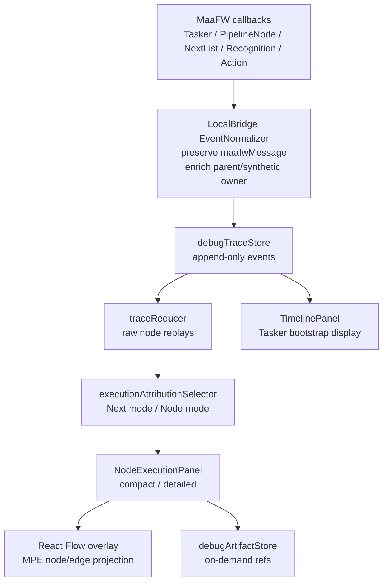

# Debug 时间线归属与节点记录 PRD

## 0.原始问题

```md
目前调试模块的时间线有个问题，就是在初次运行时，实际上mfw是执行了一次“虚空next”。例如，我有个入口节点是A，那在tasker启动时，实际上是执行了一个虚空节点，这个节点没有命中，没有行动，然后next列表为["A"]。
体现在session线上，就是先Tasker.Task.Starting，然后Node.PipelineNode.Starting（这是虚空节点的start），然后Node.NextList.Starting（直接检查next，但next中只有入口节点），然后Node.Recognition.Starting（这是识别入口节点的reco），后续正常。
这个特性可以这么理解：

1. 为了方便的进入task线，mfw选择建立了一个没有识别与行动的“虚空节点”，直接next（实际上底层就是直接走next，不过不用管，我们需要站在用户角度上理解）
2. reco可以有两种归属：作为前置节点的NextList元素，或作为本节点的reco事件。
   因此，我们可以这么改：
3. 对于初个next，不要归属于任何一个实际节点，而是虚空节点，标记为（Tasker），这个对session级与节点级的显示都改一下
4. 参考一下mse与debugger的文档（dev\instructions\.tmp），看看他们是如何展示每个节点的动作与识别的，学习借鉴一下，（目前mpe的做法是，把这个节点NextList的识别都归纳到这个节点。这从mfw的原理上是对的，但是对于用户来说非常不直观、不好理解）至少在一个节点记录下面显示一下识别了哪些next节点。不过我觉得可以做成双模式，即现有模式改进后作为“Next模式”，再新增一个“节点模式”，即一个节点的识别与执行这一对做为一个节点记录（当然识别失败的节点不会发生动作），用户可以切换（默认Next模式）
5. 对于当前的节点执行面板，一个节点上展示的信息太多了，而且基本上用户都用不到，且有很多有用的信息没展示，交互也是有点难受（例如现在没法选择某一次识别，只看某次识别的信息。这个要跟上面第二条配合）。还是得学习一下mse与debugger，看看他们都展示了什么东西，怎么交互。我们推出一个精简模式与详细模式，详细模式即现在这些，精简模式就展示同行给他们展示的关键信息，依旧双模式可切换（默认精简），当然也要有我们的特色，不要全搬过来（那叫抄袭），特别是交互上，可以进一步优化一下，方便用户。
   以上内容可能较多，你先分步骤调研一下，并形成一个prd文档，方便后续落地。
```

## 1. Executive Summary

**Problem Statement**：当前 debug-vNext 时间线和节点执行面板仍偏向 MaaFW callback 的底层事件归属，初次运行时 MaaFW 先经过一个没有真实 pipeline 节点、只负责进入 task 线的“虚空 next”阶段，MPE 现在无法把它稳定展示为用户可理解的 `(Tasker)` 记录；同时，NextList 中对候选节点的识别会被归到前置节点，虽然符合 MaaFW 原理，但用户排查“某个节点本身识别/动作是否正确”时不直观。

**Proposed Solution**：在现有 trace-first 架构上新增“执行归属（Attribution）”显示层。默认保留并改进 `Next 模式`，把前置节点的 next-list 识别、候选 next、命中/失败关系讲清楚；新增 `节点模式`，把某个实际节点的识别与动作作为一条节点记录展示。初始虚空 next 统一作为 synthetic `(Tasker)` 节点显示在 session 时间线和节点执行视图中。节点执行详情新增 `精简 / 详细` 双信息密度，默认精简，只展示识别、动作、next、artifact 和截图排障所需的关键信息，并允许选择某一次识别或动作单独查看。

**Success Criteria**：

- 对入口节点 `A` 的首次 full run，session 时间线和节点执行视图都能显示 `(Tasker)` 记录，且该记录包含初始 next 候选 `A`，不会被误显示为空 runtimeName 或归属于真实节点 `A`。
- `Next 模式` 下，前置节点记录能直接展示它检查了哪些 next 候选节点、每个候选识别的 hit/box/algorithm/artifact、最终 next-list 结果和可映射 edge。
- `节点模式` 下，节点记录按实际节点的 recognition/action 对展示；识别失败的节点仍有记录，但不会伪造动作。
- 节点执行详情支持选中某一次 recognition/action，详情区和 artifact 预览只聚焦该次事件；用户定位一次识别详情不超过 2 次点击。
- 默认 `精简模式` 中列表和详情区的可见字段减少到关键排障信息；`详细模式` 保留当前原始 MaaFW message、seq、全部事件、JSON artifact 和诊断信息。

**Discovery Findings**：

- MaaFW callback 文档把 task、pipeline node、next-list、recognition、action 拆成不同事件族；`Node.NextList.*` 表示“识别 next 节点列表”，`Node.Recognition.*` 表示单次识别，`Node.Action.*` 表示单次动作。
- 当前 LocalBridge `EventNormalizer` 直接用 MaaFW `detail.Name` 做 `Event.node.runtimeName`，并在 recognition 事件上通过 `data.parentNode` 记录当时的 `currentNode`。
- 当前 `traceReducer` 在有 active parent replay 时会把 recognition 事件归到前置节点，这构成了事实上的 `Next 模式`，但 UI 还没有把“识别目标是谁”和“前置 next 归属”讲清楚。
- MaaDebugger 的任务详情面板把 task -> pipeline node -> recognition/action 组织成可导航树，并提供 recognition/action 专门详情与图像 canvas；MSE Launch Panel 通过 session、事件缓冲、requestReco/requestAct 和 image cache 支撑实时调试查看。MPE 应借鉴“可选中一次识别/动作”和“图片/详情按需加载”，但继续保持图节点优先、Modal 集中调试、不引入 break/pause/continue 语义。

## 2. User Experience & Functionality

**User Personas**：

- Pipeline 作者：关心入口节点、next 跳转、节点识别和动作是否符合图上设计。
- 识别排障用户：需要对比多个候选 next 的识别结果，快速判断是前置 next 判断错误，还是目标节点自身识别错误。
- 大型项目维护者：需要把 runtimeName、MPE nodeId、sourcePath、edge 映射起来，避免在跨文件节点中迷失。
- Agent/custom recognition 开发者：需要逐次查看 recognition/action detail、raw/draw image 和 action 坐标。

**User Stories**：

- As a Pipeline 作者, I want the initial task bootstrap to appear as `(Tasker)` so that I can understand why the first next happens before the entry node's normal record.
- As a 调试排障用户, I want to switch between `Next 模式` and `节点模式` so that I can inspect either branch-selection behavior or a node's own recognition/action pair.
- As a 识别排障用户, I want to select one recognition attempt inside a node record so that I can view only that attempt's hit, box, algorithm, detail JSON and images.
- As a 图编辑用户, I want next candidates to map back to MPE edges where possible so that I can confirm whether runtime branches match the canvas.
- As a 重度调试用户, I want compact details by default and raw details on demand so that routine debugging is readable while advanced diagnosis remains possible.

**Acceptance Criteria**：

- `(Tasker)` 归属：
  - 当 `Tasker.Task.Starting` 后出现无法映射到真实 MPE 节点的初始 `Node.PipelineNode.*` / `Node.NextList.*`，UI 必须显示为 `(Tasker)`。
  - `(Tasker)` 记录只能表示 task bootstrap / initial next，不进入 MPE 画布定位，不伪造 fileId/nodeId。
  - `(Tasker)` 的 next-list 中若只有入口节点 `A`，应展示“入口候选 A”，并能链接到 `A` 的 MPE 节点记录或节点详情。
  - session 时间线、节点执行列表、节点执行详情、搜索/筛选都要使用同一显示名，不能一个位置显示 `(Tasker)`、另一个位置显示空字符串或 runtimeName-only。

- 归属模式：
  - `Next 模式` 为默认值，并持久化在 `debugModalMemoryStore`。
  - `Next 模式` 中，`data.parentNode` 指向的前置节点是 recognition 事件的 owner；recognition 事件的 `event.node.runtimeName` 是被识别的 next 候选。
  - `节点模式` 中，recognition 事件归属于 `event.node.runtimeName` 对应的实际节点；action 事件仍归属于执行动作的节点。
  - `节点模式` 中，来自前置 next-list 的 recognition 需要标记来源，例如“由 X 的 NextList 检查进入”，而不是伪装成普通节点内部事件。
  - 两种模式切换只改变 selector/view model，不改变 append-only trace 的原始事件顺序，不删除 MaaFW 原始事件名。

- Next 可读性：
  - 每条 node record 至少显示 next 候选数量、命中候选、失败候选、jump_back/anchor 标记和可映射 edge 数。
  - 对每个 next 候选，若存在关联 recognition 事件或 detail artifact，详情区展示 hit、algorithm、box、detailRef、screenshotRef、seq 范围。
  - 无法映射到 resolver edge 的 next 候选仍显示 runtimeName，并标记“未映射 edge”。
  - 初始 `(Tasker)` next 候选不显示为画布边，因为它没有真实前置节点。

- 节点模式可读性：
  - 一个节点记录以“识别 -> 动作”为主线展示；识别失败时状态为 failed/visited，动作区显示“未发生动作”。
  - 多次识别同一节点时必须保留 occurrence，不允许只保留最后一次。
  - 用户选择节点模式后，画布定位仍定位到实际 MPE 节点；选择 `(Tasker)` 记录时不尝试定位画布。

- 精简 / 详细模式：
  - 默认 `精简模式`，持久化在 `debugModalMemoryStore`。
  - 精简列表字段：显示名、状态、运行名、occurrence、耗时、hit/miss、action 类型、next 命中、artifact 标记和失败标记。
  - 精简详情字段：识别摘要、动作摘要、next 摘要、相关截图/draw/raw/detail 按钮、必要诊断。
  - 详细模式保留当前事件列表、MaaFW 原始消息、seq、timestamp、detail JSON preview、diagnostic 和全部 artifact refs。
  - 切换模式不得丢失当前选中的 record 和 recognition/action attempt。

- 单次 recognition/action 选择：
  - 详情区中 recognition/action 以可选条目展示，选中后右侧或下方只展示该次事件的 artifact preview 与摘要。
  - 支持“上一条 / 下一条”在当前 record 的 recognition/action attempts 之间切换。
  - artifact 仍然按需加载；展开详情或切换 attempt 不应批量请求所有 raw/draw 图片。

**Non-Goals**：

- 不实现断点、暂停、继续、单步等调试器语义。
- 不持久化 MPE 自有调试历史；仍只展示当前 session trace，长期记录以 `maa.log` 为准。
- 不改动 `dev/instructions` 只读参考文档。
- 不把运行态 debug 信息塞回节点字段编辑面板。
- 不照搬 MaaDebugger/MSE 的 UI 和术语；只吸收事件树、detail 按需、图像交互和实时/历史查看思路。
- 不在本 PRD 中设计新的 MaaFW native API；只能使用已有 callback、detail API、artifact ref 和 MPE resolver snapshot。

## 3. AI System Requirements (If Applicable)

本功能不包含 AI/LLM 生成、自动诊断或自动修复建议。

**Tool Requirements**：无 AI 工具依赖。数据来源限定为现有 `DebugEvent`、`DebugTraceSummary`、`DebugNodeReplay`、`DebugArtifactRef`、`DebugDiagnostic`、MaaFW detail artifact、resolver snapshot 和当前 MPE 图节点。

**Evaluation Strategy**：不适用 AI 输出质量评估。质量通过 deterministic trace fixture、selector 单元测试、组件交互检查和局部 eslint 验证。

## 4. Technical Specifications

**Architecture Overview**：



**Current Implementation Map**：

- `LocalBridge/internal/debug/events/normalizer.go`
  - `OnTaskerTask` 发出 task 事件。
  - `OnNodePipelineNode` 设置 `currentNode = detail.Name` 并发出 node 事件。
  - `OnNodeNextList` 发出 next-list 事件，data 仅包含 `next` 与 `focus`。
  - `OnNodeRecognition` 发出 recognition 事件，若 `currentNode` 非空则写入 `data.parentNode`。
- `src/features/debug/traceReducer.ts`
  - `ensureNodeReplayForEvent` / `findActiveNodeReplay` 当前优先复用 active node replay；当 recognition 有 `parentNode` 且目标节点还没有 active replay 时，会把 recognition 归到 parent record。
  - 这套逻辑应保留为 `Next 模式` 的底层来源，但需要显式化为可切换 attribution model。
- `src/features/debug/nodeExecutionSelector.ts`
  - 当前输出 `DebugNodeExecutionRecord`，可扩展出 attribution mode、synthetic owner、next candidate attempts 和 selected attempt。
- `src/features/debug/components/panels/NodeExecutionPanel.tsx`
  - 当前已有筛选、回放、列表和详情双栏，适合增加顶部 segmented controls 和详情密度切换。
- `src/features/debug/components/panels/TimelinePanel.tsx`
  - 当前只按事件倒序展示，需要补充 display helper，避免 synthetic/empty runtimeName 不可读。

**Data Contract Extensions**：

建议新增可选字段，允许破坏式协议升级；如能完全从前端推导，也可以先在前端 view model 内落地。

```ts
type DebugSyntheticNodeKind = "tasker-bootstrap";
type DebugExecutionAttributionMode = "next" | "node";
type DebugExecutionDetailMode = "compact" | "detailed";

type DebugEventNode = {
  runtimeName: string;
  fileId?: string;
  nodeId?: string;
  label?: string;
  syntheticKind?: DebugSyntheticNodeKind;
};

type DebugRecognitionAttribution = {
  origin: "node-recognition" | "next-list-candidate";
  ownerRuntimeName?: string;
  targetRuntimeName: string;
  ownerSyntheticKind?: DebugSyntheticNodeKind;
};
```

推荐约定：

- `(Tasker)` 的 synthetic runtime key 使用内部常量，例如 `__mpe_tasker_bootstrap__`；UI 永远显示为 `(Tasker)`。
- `syntheticKind` 仅用于展示和 selector，不参与 MPE nodeId 画布定位。
- recognition 事件如果来自 next-list 候选，保留 `event.node` 为被识别目标，同时在 `data.parentNode` 或新增 `data.attribution.ownerRuntimeName` 中记录 owner。
- `maafwMessage` 不修改，仍保留 `Node.PipelineNode.Starting`、`Node.NextList.Starting`、`Node.Recognition.Starting` 等官方事件名。

**Backend Normalizer Requirements**：

- 识别 task bootstrap：
  - `Tasker.Task.Starting` 后、第一个可映射真实 pipeline node 之前，如果收到 `Node.PipelineNode.*` / `Node.NextList.*` 且 `detail.Name` 为空、无法映射，或满足“初始 next 候选仅指向 entry”的条件，则将事件 owner 标记为 `tasker-bootstrap`。
  - 对这个 bootstrap 阶段设置 `currentNode = "__mpe_tasker_bootstrap__"`，使随后入口候选的 `Node.Recognition.*` 可以在 `Next 模式` 下归属到 `(Tasker)`。
  - 一旦出现可映射真实 node 的 `Node.PipelineNode.Starting`，bootstrap 阶段结束，`currentNode` 回到真实 runtimeName。
- next-list enrichment：
  - `Node.NextList.*` 的 `data.next` 继续保留 `{ name, jumpBack, anchor }`。
  - 如果 resolver snapshot 能解析 `fromRuntimeName -> next.name`，可在事件或前端 selector 中补充 edgeId；初始 `(Tasker)` 不生成 edgeId。
  - 不在后端把 raw/draw 图片塞进事件，继续走 artifact ref。

**Frontend Selector Requirements**：

新增 attribution selector，输入为 `DebugTraceSummary`、resolver nodes/edges、filters、`attributionMode`、performance/artifact context。

`Next 模式` 规则：

- record owner = `data.parentNode` 优先，其次 `event.node.runtimeName`。
- 当 owner 为 `__mpe_tasker_bootstrap__` 时，输出 synthetic `(Tasker)` record。
- recognition attempt 的 `targetRuntimeName = event.node.runtimeName`；如果 target 与 owner 不同，显示为“Next 候选识别”。
- next-list event 与它后续直到第一个真实 node start 之间的 candidate recognition 建立关系；如果无法严格按事件闭包匹配，则使用 `parentNode + seq` 兜底。
- record 的 next summary 来自 next-list `data.next`、candidate recognition attempts、resolver edge index。

`节点模式` 规则：

- record owner = `event.node.runtimeName` 对应真实节点；`parentNode` 只作为来源说明。
- recognition/action pair 以同一真实节点的连续 execution segment 聚合。
- 如果 recognition 来自 `(Tasker)` 或前置 node 的 next-list，则在节点记录中标记 `sourceNextOwner`，例如“由 `(Tasker)` 初始 NextList 检查”或“由 B 的 NextList 检查”。
- `(Tasker)` record 在节点模式中可以默认隐藏，但 session 时间线仍显示；若用户开启“显示系统记录”，节点模式也能看到 `(Tasker)`。

**View Model Shape**：

```ts
type DebugExecutionRecord = {
  id: string;
  attributionMode: DebugExecutionAttributionMode;
  owner: {
    runtimeName: string;
    nodeId?: string;
    fileId?: string;
    label: string;
    syntheticKind?: DebugSyntheticNodeKind;
  };
  runId: string;
  status: DebugNodeExecutionStatus;
  occurrence: number;
  firstSeq: number;
  lastSeq: number;
  recognitionAttempts: DebugRecognitionAttempt[];
  actionAttempts: DebugActionAttempt[];
  nextAttempts: DebugNextAttempt[];
  events: DebugEvent[];
};

type DebugRecognitionAttempt = {
  id: string;
  seqRange: [number, number];
  origin: "node-recognition" | "next-list-candidate";
  ownerRuntimeName?: string;
  targetRuntimeName: string;
  targetNodeId?: string;
  phase?: DebugEventPhase;
  hit?: boolean;
  algorithm?: string;
  box?: unknown;
  detailRef?: string;
  screenshotRef?: string;
  events: DebugEvent[];
};
```

**UI Layout**：

- `NodeExecutionPanel` 顶部工具条：
  - `归属模式` segmented control：`Next 模式` / `节点模式`。
  - `信息密度` segmented control：`精简` / `详细`。
  - 保留 runId、搜索、节点、状态、event kind、artifact、排序、按节点折叠等现有筛选。
- 列表区：
  - 精简模式按 record 展示关键字段，减少 `fileId/nodeId/seq/eventKinds` 的常驻 tag。
  - 详细模式保留当前 tag 密度和 seq/event kind 信息。
  - `(Tasker)` 使用系统记录样式，不能和未映射 runtimeName 混淆。
- 详情区：
  - 精简模式使用“概要 + 可选 attempt 列表 + artifact 预览”结构。
  - 详细模式展示事件组、MaaFW 原始消息、全部 refs、诊断、JSON preview。
  - recognition attempt 选中后，自动展示 hit/algorithm/box/detail/image buttons，并在图像预览中高亮当前 attempt 的 raw/draw/screenshot。
- `TimelinePanel`：
  - 使用统一 `formatDebugEventDisplayName(event)` helper。
  - 对 bootstrap 事件显示 `(Tasker)`、`入口 next`、`候选 A` 这样的用户语义，同时保留 `maafwMessage` tag。
  - 保持事件级倒序/回放控制，不把 TimelinePanel 改成节点面板。

**Integration Points**：

- `LocalBridge/internal/debug/events/normalizer.go`：识别 bootstrap synthetic owner、稳定设置 parent owner。
- `LocalBridge/internal/debug/protocol/types.go`：如采用 wire 字段，增加 optional `syntheticKind` 或 attribution metadata，并升级 debug protocol。
- `src/features/debug/types.ts`：新增 attribution mode、detail mode、synthetic node type、attempt view model 类型。
- `src/stores/debugModalMemoryStore.ts`：持久化 `nodeExecutionAttributionMode`、`nodeExecutionDetailMode`、可选 `showSystemRecords`。
- `src/features/debug/traceReducer.ts`：尽量少改，继续负责 raw trace summary；不要把 UI 模式写进 reducer。
- `src/features/debug/nodeExecutionSelector.ts`：拆出或扩展 attribution selector。
- `src/features/debug/nodeExecutionAnalysis.ts`：扩展 overlay/edge 关系，支持 `(Tasker)` 不定位画布。
- `src/features/debug/components/panels/NodeExecutionPanel.tsx`：增加模式切换和精简/详细布局。
- `src/features/debug/components/panels/NodeExecutionRecordDetails.tsx`：增加 selected attempt 状态与 compact details。
- `src/features/debug/components/panels/TimelinePanel.tsx`：统一 display helper。
- `src/features/debug/nodeExecutionSelector.test.ts` / `traceReducer.test.ts`：增加 deterministic trace fixtures。

**Testing / Validation**：

- Selector fixtures：
  - `Tasker.Task.Starting -> virtual PipelineNode -> virtual NextList[next=A] -> Recognition(A)`。
  - 普通节点 `B` 的 next-list 检查候选 `C/D`，其中 `C` hit、`D` miss。
  - 节点模式下 `C` 的 recognition/action pair 正确成 record，`B` record 只保留 next 来源说明。
  - Next 模式下 `B` record 含 next candidate recognition attempts，`C` record 从自身 pipeline/action 段开始。
  - repeated node、unmapped runtimeName、fixed-image recognition、recognition-only/action-only 不回归。
- UI behavior：
  - 切换归属模式不丢 selected record；若 selected record 不存在，选择最近 seq 对应 record。
  - 切换精简/详细不触发 artifact 批量请求。
  - 选择 attempt 后只请求用户点击的 artifact。
- 项目约束：
  - 不运行 `yarn dev`。
  - 不使用浏览器测试。
  - 后续实现时仅对触碰文件跑 targeted eslint / 必要单元测试；前后端不用跑完整构建，除非后续任务明确要求。

**Reference Notes**：

- MaaFW callback / Go binding：`dev/instructions/maafw-guide/2.3-CallbackProtocol.md`、`dev/instructions/maafw-golang-binding/Event System and Monitoring.md`、`dev/instructions/maafw-golang-binding/Tasker.md`。
- MaaDebugger 可借鉴：`dev/instructions/.tmp/MaaDebugger-wiki/Index View Task Detail Panel.md`、`TaskerService  Task Execution.md`、`Pinia State Stores.md`。
- MSE 可借鉴：`dev/instructions/.tmp/maa-support-extension-wiki/Launch Panel Webview.md`、`Interface Service and Launch Service.md`、`Check and Test Workflows.md`。
- MPE 当前基线：`dev/design/debug-refactor-architecture.md`、`dev/design/debug-node-execution-panel-prd.md`、`src/features/debug/traceReducer.ts`、`src/features/debug/nodeExecutionSelector.ts`、`LocalBridge/internal/debug/events/normalizer.go`。

## 5. Risks & Roadmap

**Phased Rollout**：

- P0：调研与 PRD 固化。
  - 完成当前问题、同行资料、MaaFW 事件语义和 MPE 当前实现的归纳，追加在 PRD 中，作为后续阶段的参考。
  - 不改运行代码。
- P1：`(Tasker)` bootstrap 归属闭环。
  - 后端或前端 selector 能稳定识别初始虚空 next。
  - session 时间线和节点执行视图都显示 `(Tasker)`。
  - 增加入口节点 `A` 的 bootstrap trace fixture。
- P2：Next / 节点双归属模式。
  - 新增 attribution selector 和 modal memory。
  - `Next 模式` 默认，改进 next candidate recognition 展示。
  - `节点模式` 按实际节点 recognition/action pair 展示，识别失败无动作。
- P3：精简 / 详细信息密度与单次 attempt 选择。
  - 默认精简详情。
  - 详情区支持选择 recognition/action attempt。
  - artifact 仍按需加载，现有详细视图保留。
- P4：画布与图像交互增强。
  - Next 模式高亮候选 edge；节点模式高亮实际节点 record。
  - recognition attempt 选中后联动图像 artifact / overlay。
  - 大 trace 下保持现有分页或进一步虚拟化。

**Promotion Records**：

> 每阶段完成后，需要记录完成情况、遗留问题、特殊说明等必要信息

### P0 完成记录（2026-04-30）

- 状态：完成。
- 本阶段产物：固化本 PRD 的问题定义、MaaFW 事件语义、同行资料参考、MPE 当前实现归纳和后续阶段拆分；不包含运行代码变更。
- 调研核对：
  - MaaFW callback 语义已对齐 `Tasker.Task`、`Node.PipelineNode`、`Node.NextList`、`Node.Recognition`、`Node.Action` 的事件族划分，初始虚空 next 应作为 task bootstrap 显示。
  - MaaDebugger / MSE 参考资料已归纳为“任务树 + recognition/action 专门详情 + 图像/详情按需加载”的交互启发，不照搬其 UI、术语或 break/pause/continue 语义。
  - MPE 当前实现已核对：`LocalBridge/internal/debug/events/normalizer.go` 通过 `currentNode` 与 `data.parentNode` 形成 recognition owner 线索；`src/features/debug/traceReducer.ts` 已有事实上的 Next 归属基础；`src/features/debug/nodeExecutionSelector.ts`、`NodeExecutionPanel.tsx`、`TimelinePanel.tsx` 仍缺少显式 attribution view model 与统一显示 helper。
- 阶段边界：P1 只做 `(Tasker)` bootstrap 归属闭环；P2 再做 Next / 节点双归属模式；P3 再做精简 / 详细信息密度与单次 attempt 选择；P4 再做画布与图像交互增强。
- 遗留问题：保留 Open Questions，不在 P0 决定节点模式是否默认显示系统记录、next-list recognition 的节点模式分段方式、缩略图默认加载策略或 `Next 模式` 命名替换。

### P1 完成记录（2026-04-30）

- 状态：完成。
- 本阶段产物：
  - LocalBridge normalizer 新增 task bootstrap 状态机；`Tasker.Task.Starting` 后、首个真实可映射 `Node.PipelineNode.Starting` 前的 unmapped/empty pipeline-node 与 next-list 会输出 synthetic `(Tasker)` owner。
  - Debug wire protocol 升级到 `0.18.0`，`EventNode` / `DebugEvent.node` 增加 optional `syntheticKind: "tasker-bootstrap"`；不改 run modes，不恢复 Interface / managed-Agent 行为。
  - 前端 trace reducer、node execution selector 和节点执行 / 时间线展示透传 synthetic owner；`(Tasker)` 不携带 `fileId/nodeId`，不显示为普通 `runtimeName-only`，选择时不定位画布。
  - Timeline 对 `(Tasker)` next-list 显示入口候选；候选 recognition 保留目标节点 `A`，通过 `parentNode = "__mpe_tasker_bootstrap__"` 归属到 `(Tasker)` record。
- 测试与验证：
  - `go test ./internal/debug/events ./internal/debug/protocol`：通过。
  - `yarn eslint src/features/debug/types.ts src/features/debug/traceReducer.ts src/features/debug/nodeExecutionSelector.ts src/features/debug/components/panels/TimelinePanel.tsx src/features/debug/components/panels/NodeExecutionRecordList.tsx src/features/debug/components/panels/NodeExecutionRecordDetails.tsx src/features/debug/components/panels/NodeExecutionPanel.tsx`：通过。
  - `yarn eslint src/features/debug/syntheticNode.ts src/features/debug/traceReducer.test.ts src/features/debug/nodeExecutionSelector.test.ts`：通过。
  - `yarn vitest run src/features/debug/traceReducer.test.ts src/features/debug/nodeExecutionSelector.test.ts`：受当前 repo 既有 `vite.config.ts` 引用缺失的 `tests/setup.ts` 影响，未进入测试本体；使用临时等价 Vitest config 跳过缺失 setup 后，`traceReducer.test.ts` 与 `nodeExecutionSelector.test.ts` 共 20 条用例通过。
  - `git diff --check`：通过。
- 已知边界：
  - 本阶段未实现 P2 的 Next / 节点双归属模式，仍沿用当前默认 Next 归属。
  - 本阶段未实现 P3 的精简 / 详细信息密度切换与单次 recognition/action attempt 选择。
  - 未运行 `yarn dev`，未使用浏览器测试，未跑完整前后端 build。

**Technical Risks**：

- MaaFW 初始虚空节点的 `detail.Name` / `node_id` 具体表现可能随 binding 版本变化；实现应以“Tasker start 后第一个真实节点前的 unmapped next-list”作为行为特征，而不是只判断空字符串。
- 只在前端推导 `(Tasker)` 可能无法让 TimelinePanel 和 NodeExecutionPanel 完全一致；更稳妥方案是在 normalizer 输出 optional synthetic metadata。
- `parentNode` 当前既用于 Next 归属，也可能影响节点模式聚合；需要避免修改 raw reducer 后破坏现有回放、overlay 和性能统计。
- Recognition detail 的 algorithm/hit/box 字段存在算法差异；精简模式只能读取通用浅层字段，不能硬编码算法私有 detail schema。
- `(Tasker)` synthetic record 没有 fileId/nodeId，任何画布定位、edge 映射和筛选逻辑都必须显式跳过。
- 双模式可能让用户困惑；UI 必须用短标签说明“Next 模式看跳转判断，节点模式看节点自身识别/动作”。

**Open Questions**：

- `(Tasker)` 是否始终显示在 `节点模式` 中：建议默认隐藏系统记录，但提供“显示系统记录”开关；`TimelinePanel` 永远显示。
- 节点模式中，来自 next-list 的 recognition 是否算作该节点“第 0 阶段”还是普通 recognition：建议显示为“来源：X 的 NextList”，不直接与节点自身 pipeline start 混成同一段。
- 精简模式是否需要默认显示 screenshot 缩略图：建议不默认加载缩略图，只显示最近图像按钮；用户点击后再预览。
- 是否将 `Next 模式 / 节点模式` 命名为更用户化的 `跳转模式 / 节点模式`：当前沿用用户提出的 `Next 模式`，后续可在 UI 文案中加说明。

> 以上内容需要在执行到对应阶段时提示回答这些问题，以确定方案。
