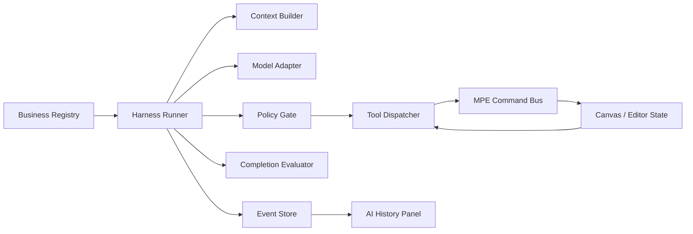

# AI Harness 需求与设计

> 状态：草案（Draft）
> 版本：v0.1
> 日期：2026-08-15
> 范围：MaaPipelineEditor（MPE）中的 AI 基础设施

## 1. 文档目的

本文记录 MPE 将 AI 从“单次请求客户端”升级为 Harness 系统的需求、边界和第一版架构，作为后续实现、评审和测试的共同依据。

本文描述的是 MPE 内部的 AI 运行时设计，不是面向普通用户的 Skill 使用文档。

## 2. 背景

当前 AI 能力主要由以下部分组成：

- `AIClient`：负责模型配置、请求发送、流式响应、重试和 Provider 适配。
- AI 提示词：按具体业务构建完整请求内容。
- AI 历史记录：按内存 Session 保存请求与响应。
- 业务调用方：自行准备上下文、调用 AI、解析结果并修改编辑器状态。

这种方式适合单轮节点预测，但随着 AI 需要操作画布、节点、文件和调试能力，业务调用方会逐渐承担上下文编排、工具权限、循环控制、失败恢复和结果判断等职责，难以形成统一边界。

因此需要在现有模型客户端之上增加统一 Harness：

- MPE 分配业务可使用的能力和工具。
- AI 在允许的范围内自主选择工具和组织步骤。
- MPE 负责权限、状态修改、校验和最终验收。
- 运行过程以结构化事件记录，支持历史查看和问题诊断。

## 3. 目标与非目标

### 3.1 目标

1. 提供统一的 AI 业务执行入口，业务不再自行实现 Agent 循环。
2. 支持为不同业务分配不同的内部能力包和工具集合。
3. 业务固定初始提示词、输入输出契约和成功条件，具体执行流程由 AI 动态决定。
4. 将画布和编辑器修改限制在 MPE 命令层内，禁止 AI 直接修改内部状态。
5. 支持多 Session，Session 之间上下文完全隔离。
6. 运行过程可取消、可限额、可观察，并能区分成功、失败、取消和部分完成。
7. 在不做持久化的前提下，为历史面板和开发诊断提供结构化运行记录。
8. 尽量复用现有 Provider 适配和 `AIClient` 的网络能力。

### 3.2 非目标

- 暂不提供普通用户创建、编辑或组合 Skill 的能力。
- 暂不实现 Skill 市场、远程 Skill 分发或跨设备同步。
- 暂不引入多 Agent 协作、复杂 DAG 编排或通用工作流设计器。
- 不要求保存模型的原始 CoT，也不在普通界面展示原始 CoT。
- 不将 AI 设计成可以绕过 MPE 权限直接执行任意代码的通用代理。
- 历史记录和 Harness 运行状态暂不持久化，页面刷新后丢失是可接受行为。

## 4. 核心原则

### 4.1 权力与策略分离

AI 负责理解目标、选择下一步动作和组织执行顺序；MPE 负责授予能力、校验参数、执行副作用、维护状态和判断结果是否有效。

> AI 负责策略，MPE 负责权力；AI 负责选择动作，MPE 负责执行和验收。

### 4.2 流程开放，边界固定

业务不预先写死每一步流程，但以下内容必须在运行开始前固定并在本次运行中不可被 AI 修改：

- Harness 系统规则
- 业务初始提示词
- 能力包和工具白名单
- 工具权限与副作用等级
- 运行预算
- 输入输出契约
- 成功条件和终止条件

`canvas-chat` 业务使用特殊能力包 ID `*`。Runner 在创建 Run 时将 Registry 中全部已注册 MPE 工具冻结为本次能力快照，后续新增注册不会改变正在执行的 Run。该约定表示 AI 对话默认启用全部内部 Skill 与工具，但不包含未注册或没有受控实现的系统能力。

### 4.3 能力包不是普通提示词

内部 Skill 使用“能力包（Capability Pack）”概念表示。能力包至少包含能力说明、工具集合、使用约束和校验规则；提示词只是其中的一部分。

### 4.4 工具结果不是可信指令

画布文本、节点内容、文件内容和外部服务返回值都属于不可信数据。它们可以作为上下文提供给模型，但不能改变 Harness 规则、工具权限或业务目标。

### 4.5 结构化事件优先于文本日志

运行状态、模型响应、工具调用、工具结果、校验结果和错误都应形成结构化事件。用户界面展示的是事件的安全摘要，而不是依赖字符串解析日志。

## 5. 核心概念

| 概念 | 定义 | 生命周期 |
| --- | --- | --- |
| Harness | 统一的 AI 执行运行时，负责上下文、模型循环、策略检查、工具调度和终止 | 应用级 |
| Business Profile | 业务定义，包含初始提示词、输入输出契约、能力包和成功条件 | 注册时定义，运行时快照 |
| Capability Pack | 由 MPE 分配给业务的内部能力包，类似系统可控的 Skill | 注册时定义，运行时只读 |
| Tool | AI 可以请求的最小操作单元，拥有输入输出 Schema 和副作用声明 | 注册时定义 |
| Session | 上下文隔离边界，可承载多次业务运行 | 内存级 |
| Run | 一次完整的业务执行 | 请求级 |
| Turn | 一次模型决策循环，可能产生文本或工具调用 | Run 内 |
| Event | Run 内发生的结构化事件 | Turn 内 |
| Completion Evaluator | 判断业务目标是否实际达成的校验器 | 业务级 |

Session、Run、Turn、Event 的关系如下：

```text
Session
└── Run：一次业务执行
    ├── Turn：一次模型决策
    │   ├── tool.requested
    │   ├── tool.completed
    │   └── tool.failed
    └── Run 结果
```

## 6. 功能需求

### FR-01 业务定义

Harness 应能根据业务 ID 找到对应的 Business Profile，并在 Run 创建时冻结本次运行所使用的提示词、能力、模型配置和策略版本。

Business Profile 至少包含：

- `id` 和显示名称
- 初始提示词
- 输入 Schema
- 可选的输出 Schema
- 能力包 ID 列表
- 完成度校验器
- 运行策略

### FR-02 能力分配

能力包由 MPE 预先分配，AI 不得在运行过程中自行请求或扩大能力范围。

AI 对话 Profile 默认分配 `*` 能力包，即 Run 创建时的全部已注册能力；其他专用业务仍可使用显式能力包限制范围。

能力包应能声明：

- 能力说明和必要的指导文本
- 允许使用的工具
- 工具调用约束
- 前置条件
- 结果校验器
- 默认确认策略

### FR-03 工具注册与调用

每个工具必须具备稳定名称、输入 Schema、输出 Schema、副作用等级和作用范围。

工具副作用等级至少包括：

- `read`：只读，不改变编辑器状态
- `write`：修改可撤销的编辑器状态
- `destructive`：可能造成较大范围或不可逆影响

工具调用必须经过：解析、Schema 校验、能力校验、权限校验、状态校验和执行结果标准化。

### FR-04 动态执行循环

Harness 应支持类似 ReAct 的受限执行循环：

1. 创建 Run 并加载业务定义。
2. 构建系统规则、业务提示词、用户目标和上下文。
3. 请求模型返回文本或结构化工具调用。
4. 对工具调用执行策略和参数校验。
5. 通过工具调度器执行工具，并将结构化结果返回模型。
6. 调用完成度校验器，判断是否成功、继续、失败或需要用户确认。
7. 达到终止条件后生成 Run 结果。

流程不应依赖固定的业务步骤，但必须受运行策略约束。

### FR-05 运行限制

每个 Run 必须支持以下限制：

- 最大 Turn 数
- 最大工具调用次数
- 最大运行时间
- 最大 Token 预算
- 取消运行
- 重复工具调用检测
- 工具错误的重试次数

建议的状态集合：`queued`、`running`、`waiting_tool`、`waiting_approval`、`succeeded`、`failed`、`cancelled`、`partial`。

### FR-06 完成度与结果校验

业务完成不能只依据模型最后一段文本。Harness 必须调用业务定义中的 Completion Evaluator，校验目标状态、输出格式和必要的编辑器状态。

Evaluator 至少需要返回：

- 是否完成
- 是否允许继续执行
- 失败原因
- 可展示给用户的摘要

### FR-07 Session 隔离

不同 Session 的对话历史、运行上下文和模型消息不得互相混入。Harness 需要显式接收 `sessionId`，不能依赖全局当前 Session 推断业务上下文。

同一 Session 可以包含多个 Run，但每个 Run 仍需保存自己的业务定义和配置快照。

### FR-08 运行记录

内存 Event Store 应记录至少以下事件：

- `run.started`
- `model.requested`
- `model.responded`
- `tool.requested`
- `tool.rejected`
- `tool.completed`
- `tool.failed`
- `completion.checked`
- `run.completed`
- `run.failed`
- `run.cancelled`

历史面板展示 Session、Run 和事件摘要。普通用户看到的是目标、工具动作、结果和错误，不展示原始隐式推理过程。

### FR-09 错误与恢复

工具错误必须结构化区分为参数错误、权限错误、状态冲突、可重试错误和不可重试错误。Harness 负责根据策略决定重试、要求模型修正、等待用户确认或终止 Run。

### FR-10 模型适配

现有 `AIClient` 继续负责 Provider 配置、网络请求、代理和基础响应解析；Harness 通过统一的 Model Adapter 获取标准化的文本、工具调用和 Token 用量。

Provider 差异不得泄漏到业务定义和工具实现中。若 Provider 不支持原生工具调用，需要由 Adapter 提供结构化 JSON 兼容方案，并由 MPE 侧严格校验。

## 7. 非功能需求

- **安全性**：工具白名单、参数校验、作用域限制和副作用等级必须在 MPE 侧执行。
- **可控性**：每个 Run 都能取消、超时和限制预算。
- **可观测性**：所有关键状态变化都有结构化事件和关联 ID。
- **可测试性**：模型、工具和命令层可以分别 Mock，支持重放固定事件。
- **可扩展性**：新增业务主要增加 Profile 和能力组合，不修改 Harness 主循环。
- **可维护性**：模型传输、Agent 循环、能力注册和领域操作分层，避免业务代码直接依赖 Provider。
- **内存约束**：历史记录不保存大体积图片 Base64；事件和记录需要有明确的内存上限。

## 8. 总体架构



### 8.1 Business Registry

注册和查询 Business Profile。业务定义应与具体 UI 入口解耦，入口只负责收集用户目标和业务输入，然后创建 Run。

### 8.2 Harness Runner

负责整个 Run 生命周期、模型循环、预算、取消、错误恢复和最终状态。Runner 不应包含具体画布业务逻辑。

### 8.3 Context Builder

按固定顺序构建模型上下文：

```text
Harness 系统规则
> MPE 安全与工具规则
> Business Profile 初始提示词
> Capability Pack 指导文本
> 用户目标和业务输入
> 当前可信编辑器上下文
> 工具返回数据（不可信）
```

模型上下文不能直接复用全部历史记录。Session 历史是可选上下文来源，是否注入以及注入多少应由 Business Profile 的上下文策略决定。

### 8.4 Model Adapter

将现有 Provider 适配为 Harness 可用的统一接口，至少输出：

- 文本内容
- 工具调用列表
- 结束原因
- Token 用量
- 原始响应的诊断信息（仅开发诊断使用）

### 8.5 Policy Gate

在工具执行前检查：工具是否属于当前能力包、参数是否符合 Schema、当前状态是否允许、预算是否充足以及是否需要确认。

AI 不得绕过 Policy Gate 直接访问任何领域 API。

### 8.6 Tool Dispatcher

将标准化工具调用映射到具体 Tool 实现，统一处理执行上下文、超时、错误转换和事件写入。

### 8.7 MPE Command Bus

所有画布和编辑器写操作都必须通过命令层执行。命令层负责状态版本、校验、撤销重做、批量原子性和变更结果。

### 8.8 Event Store 与历史投影

Event Store 是一次运行的结构化记录来源；AI 历史面板只是面向用户的投影，不应成为 Harness 的运行状态来源。

现有 `AIHistoryManager` 可以继续承载 Session 和用户可读记录，但后续应逐步增加 Run 标识和事件摘要，避免把工具执行状态全部塞进单条请求/响应记录。

## 9. 核心数据模型草案

以下为设计方向，不要求一次性按最终形式实现：

```ts
type BusinessProfile = {
  id: string;
  name: string;
  initialPrompt: string;
  inputSchema: JsonSchema;
  outputSchema?: JsonSchema;
  capabilityPackIds: string[];
  completionCheckerId: string;
  runtimePolicy: RuntimePolicy;
};

type CapabilityPack = {
  id: string;
  name: string;
  instructions: string;
  toolIds: string[];
  constraints?: string[];
  completionCheckerIds?: string[];
};

type ToolDefinition<Input = unknown, Output = unknown> = {
  id: string;
  description: string;
  inputSchema: JsonSchema;
  outputSchema: JsonSchema;
  effect: "read" | "write" | "destructive";
  scope: string;
  approval?: "auto" | "confirm" | "deny";
  execute(input: Input, context: ToolExecutionContext): Promise<Output>;
};

type RuntimePolicy = {
  maxTurns: number;
  maxToolCalls: number;
  maxDurationMs: number;
  maxTokens?: number;
  approval: "auto" | "confirm" | "deny";
  retryLimit: number;
};

type HarnessRun = {
  id: string;
  sessionId: string;
  businessId: string;
  status: RunStatus;
  createdAt: number;
  updatedAt: number;
  configSnapshot: ConfigSnapshot;
  capabilitySnapshot: string[];
};
```

工具上下文中应包含 `runId`、`sessionId`、当前编辑器状态版本、取消信号和必要的权限信息，不能将完整的全局 Store 直接传给工具。

## 10. 画布能力设计边界

画布能力分为两类：

### 10.1 只读能力

- 查询当前节点、选中节点和邻接关系
- 查询节点字段和协议状态
- 查询画布结构、文件和版本
- 获取可供模型判断的结构化上下文

只读能力不应产生编辑器副作用。

### 10.2 写入能力

- 创建、修改、删除节点
- 创建、修改、删除连接
- 批量应用结构化变更
- 校验和修复指定范围的 Pipeline

写入能力必须返回至少以下信息：

- 是否执行成功
- 实际变更摘要或 diff
- 修改后的状态版本
- 校验错误
- 是否支持撤销

初期建议所有写入操作都以结构化命令执行，并支持单次 Run 内的批量原子提交。破坏性操作通过 `approval` 策略控制，而不是交给模型自行判断。

## 11. 提示词与推理记录策略

Harness 可以采用 ReAct-like 的工具循环，但不要求业务暴露或保存模型的原始 CoT。

建议记录以下结构化信息：

- 当前目标
- 模型选择的工具
- 工具调用参数摘要
- 工具执行结果摘要
- 继续、成功或失败的原因摘要

不建议将“完整推理过程”作为产品承诺。这样既不能稳定代表模型内部过程，也会增加敏感上下文暴露和内存占用风险。

## 12. 历史面板演进

当前独立左侧 AI 历史面板的 Session 列表设计可以保留，后续信息层级建议调整为：

```text
Session 列表
  -> 当前 Session 的 Run 列表
      -> Run 摘要、状态、耗时、Token 用量
      -> 展开后查看工具调用和结果事件
```

需要保持的行为：

- Session 创建、切换、清空和删除
- Session 之间不共享上下文
- 数据只保存在内存
- 不保存图片 Base64，仅保存是否包含图片或必要的引用信息

需要新增的运行信息：

- `businessId`
- `runId`
- Run 状态
- 使用的能力包摘要
- Turn 数与工具调用数
- 完成度校验结果
- 失败或取消原因

普通用户看到的是可理解的操作摘要；开发诊断可额外查看版本、事件关联 ID、Provider 响应和策略拒绝原因。

## 13. 分阶段落地

### Phase 0：契约与运行模型

- 定义 Business Profile、Capability Pack、Tool Definition、Runtime Policy、Run Event。
- 定义 Run 状态和错误分类。
- 让模型、工具和命令层可以被 Mock。
- 确定 Event Store 与历史面板的投影关系。

### Phase 1：最小 Harness

- 实现单业务、单 Session 的 Harness Runner。
- 支持文本响应、取消、超时、最大 Turn 和结构化事件。
- 使用 Mock Tool 验证循环，不接入具体画布业务。
- 将现有 `AIClient` 接入 Model Adapter。

### Phase 2：工具与能力包

- 实现能力包注册和工具白名单。
- 实现 Tool Dispatcher 与 Policy Gate。
- 支持原生工具调用和结构化 JSON 兼容方案。
- 完成工具参数、权限和错误测试。

### Phase 3：MPE 领域命令

- 将画布读取能力封装为只读工具。
- 将节点和连接修改封装为 MPE Command。
- 加入状态版本、diff、撤销和批量原子提交。
- 接入完成度校验器。

### Phase 4：历史与诊断完善

- 将历史面板升级为 Session → Run → Event 展示。
- 增加运行取消、失败恢复和开发诊断视图。
- 增加事件重放和固定模型响应测试。
- 评估是否需要把部分本地能力下沉到 LocalBridge。

## 14. 测试要求

至少覆盖以下场景：

- 业务只能看到被分配的工具。
- 非法工具名和非法参数会被拒绝。
- 工具返回错误后能按策略重试或终止。
- 超出 Turn、工具次数、时间和 Token 预算后 Run 能终止。
- 取消操作不会继续执行后续工具。
- Session 历史不会混入其他 Session。
- 画布写入一定经过命令层，并能返回 diff 和版本。
- 重复工具调用不会造成非预期重复修改。
- 完成度校验失败时，模型不能直接将 Run 标记为成功。
- 页面刷新后内存历史消失，且不存在额外持久化路径。

## 15. 待决策项

以下问题不阻塞文档和基础框架，但在进入具体业务前需要确定：

1. 第一个接入 Harness 的业务是节点配置预测、流程探索，还是先使用纯 Mock 业务验证运行时。
2. Provider 工具调用优先使用原生协议，还是统一使用 MPE 自己的结构化响应格式。
3. 画布写入默认采用自动执行、预览后确认，还是按副作用等级分别处理。
4. 是否允许同一 Session 同时运行多个 Run，以及并发时如何处理画布状态冲突。
5. Event Store 的每个 Session 和 Run 的具体事件上限。
6. 哪些需要设备、文件系统或外部进程的工具应由 Editor 执行，哪些应由 LocalBridge 执行。

在这些问题明确前，默认采用以下建议：单 Run 串行执行、工具白名单由 MPE 固定、低风险写入可自动执行、高风险写入需要确认、历史与事件只保存在内存。

## 16. 第一版完成标准

第一版 Harness 架构完成时，应满足：

- 可以通过一个 Business Profile 创建并运行 Run。
- Run 可以在限定能力范围内完成至少一次工具调用。
- 工具调用经过 Schema、权限和运行策略校验。
- 工具结果可以回传模型并驱动下一 Turn。
- Run 可以成功、失败、取消或因预算终止。
- 所有关键过程都有结构化 Event。
- Session 之间上下文隔离，历史面板能够查看运行摘要。
- 画布写操作没有绕过 MPE 命令层。
- 没有引入历史持久化，也没有向普通用户暴露内部能力配置。
