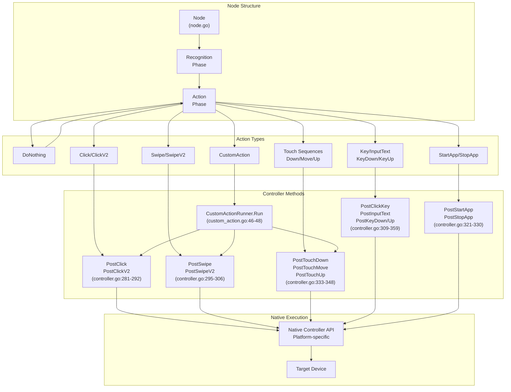
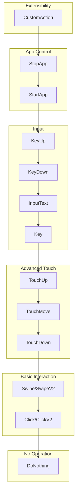

# Action Types

Relevant source files

* [CHANGELOG.md](https://github.com/MaaXYZ/maa-framework-go/blob/5f9c965c/CHANGELOG.md?plain=1)
* [context\_test.go](https://github.com/MaaXYZ/maa-framework-go/blob/5f9c965c/context_test.go)
* [controller.go](https://github.com/MaaXYZ/maa-framework-go/blob/5f9c965c/controller.go)
* [internal/native/framework.go](https://github.com/MaaXYZ/maa-framework-go/blob/5f9c965c/internal/native/framework.go)
* [recognition\_result\_test.go](https://github.com/MaaXYZ/maa-framework-go/blob/5f9c965c/recognition_result_test.go)
* [resource\_test.go](https://github.com/MaaXYZ/maa-framework-go/blob/5f9c965c/resource_test.go)
* [tasker\_test.go](https://github.com/MaaXYZ/maa-framework-go/blob/5f9c965c/tasker_test.go)

This page documents the action types available in the MaaFramework pipeline system. Actions define what operation to perform when a node's recognition phase succeeds. Each action type corresponds to specific device interaction capabilities provided by the Controller component.

For information about the Recognition phase that precedes action execution, see [Recognition Types](/MaaXYZ/maa-framework-go/4.2-recognition-types). For details about the Node structure that contains action configuration, see [Pipeline and Nodes](/MaaXYZ/maa-framework-go/3.5-pipeline-and-nodes). For implementing user-defined action logic, see [Custom Actions](/MaaXYZ/maa-framework-go/5.1-custom-actions).

---

## Overview

Actions are the execution phase of a pipeline node. After recognition successfully identifies a target on the screen, the framework invokes the configured action. Actions are executed through the bound Controller, which provides platform-specific implementations for device interaction.

The framework supports the following action categories:

| Action Category | Action Types | Purpose |
| --- | --- | --- |
| No Operation | `DoNothing` | Recognition-only nodes, no action performed |
| Click/Tap | `Click`, `ClickV2` | Single-point touch or mouse click |
| Swipe/Drag | `Swipe`, `SwipeV2` | Gesture between two points |
| Touch Sequences | `TouchDown`, `TouchMove`, `TouchUp` | Multi-touch gesture composition |
| Keyboard Input | `Key`, `InputText`, `KeyDown`, `KeyUp` | Text and keycode input |
| App Control | `StartApp`, `StopApp` | Application lifecycle management |
| Custom Logic | `CustomAction` | User-defined action implementations |

**Sources:** [node.go1-71](https://github.com/MaaXYZ/maa-framework-go/blob/5f9c965c/node.go#L1-L71) [controller.go1-512](https://github.com/MaaXYZ/maa-framework-go/blob/5f9c965c/controller.go#L1-L512)

---

## Action Execution Architecture



**Sources:** [node.go9-52](https://github.com/MaaXYZ/maa-framework-go/blob/5f9c965c/node.go#L9-L52) [controller.go26-512](https://github.com/MaaXYZ/maa-framework-go/blob/5f9c965c/controller.go#L26-L512) [custom\_action.go46-48](https://github.com/MaaXYZ/maa-framework-go/blob/5f9c965c/custom_action.go#L46-L48)

---

## DoNothing Action

The `DoNothing` action type performs no operation after recognition succeeds. This is useful for:

* Pure recognition nodes that only need to detect a target's presence
* Conditional branching based on screen state without interaction
* Synchronization points that wait for specific screen content

When `DoNothing` is configured, the node completes immediately after successful recognition, and execution proceeds to the next node in the sequence.

**Sources:** [node.go18-20](https://github.com/MaaXYZ/maa-framework-go/blob/5f9c965c/node.go#L18-L20)

---

## Click and Tap Actions

### Click

Basic single-point click or tap action. The framework determines the target coordinates based on the recognition result's bounding box.

**Controller Method:** [controller.go281-284](https://github.com/MaaXYZ/maa-framework-go/blob/5f9c965c/controller.go#L281-L284)

```
```
// PostClick posts a click action at the specified coordinates


func (c *Controller) PostClick(x, y int32) *Job
```
```

**Parameters:**

* `x`, `y`: Target screen coordinates (pixels)

**Returns:** `*Job` for asynchronous status tracking

### ClickV2

Extended click action with contact and pressure parameters, enabling multi-finger or multi-button interaction.

**Controller Method:** [controller.go287-292](https://github.com/MaaXYZ/maa-framework-go/blob/5f9c965c/controller.go#L287-L292)

```
```
// PostClickV2 posts a click with contact and pressure


// For adb controller: contact = finger id (0, 1, 2, ...)


// For win32 controller: contact = mouse button (0=left, 1=right, 2=middle)


func (c *Controller) PostClickV2(x, y, contact, pressure int32) *Job
```
```

**Parameters:**

* `x`, `y`: Target screen coordinates
* `contact`: Finger ID (ADB) or mouse button ID (Win32)
* `pressure`: Touch pressure value

**Platform-Specific Behavior:**

| Platform | Contact Parameter | Pressure Parameter |
| --- | --- | --- |
| ADB (Android) | Finger ID (0 for first finger, 1 for second, etc.) | Touch pressure |
| Win32 (Windows) | Mouse button (0=left, 1=right, 2=middle) | Pressure value |
| PlayCover (iOS) | Finger ID | Touch pressure |

**Sources:** [controller.go281-292](https://github.com/MaaXYZ/maa-framework-go/blob/5f9c965c/controller.go#L281-L292)

---

## Swipe and Drag Actions

### Swipe

Basic swipe gesture between two points with configurable duration.

**Controller Method:** [controller.go295-298](https://github.com/MaaXYZ/maa-framework-go/blob/5f9c965c/controller.go#L295-L298)

```
```
// PostSwipe posts a swipe from (x1,y1) to (x2,y2)


func (c *Controller) PostSwipe(x1, y1, x2, y2 int32, duration time.Duration) *Job
```
```

**Parameters:**

* `x1`, `y1`: Starting coordinates
* `x2`, `y2`: Ending coordinates
* `duration`: Swipe duration (converted to milliseconds)

### SwipeV2

Extended swipe with contact and pressure parameters.

**Controller Method:** [controller.go301-306](https://github.com/MaaXYZ/maa-framework-go/blob/5f9c965c/controller.go#L301-L306)

```
```
// PostSwipeV2 posts a swipe with contact and pressure


func (c *Controller) PostSwipeV2(x1, y1, x2, y2 int32, duration time.Duration, contact, pressure int32) *Job
```
```

**Parameters:**

* Same as `Swipe`, plus:
* `contact`: Finger/button ID (platform-specific)
* `pressure`: Touch pressure value

**Common Use Cases:**

* Screen scrolling
* Drag-and-drop operations
* Gesture navigation
* Slider adjustments

**Sources:** [controller.go295-306](https://github.com/MaaXYZ/maa-framework-go/blob/5f9c965c/controller.go#L295-L306)

---

## Touch Sequence Actions

Touch sequences enable fine-grained multi-touch gesture composition by separating the touch lifecycle into discrete phases.

### Touch Lifecycle

```
#mermaid-qufurjxcqa{font-family:ui-sans-serif,-apple-system,system-ui,Segoe UI,Helvetica;font-size:16px;fill:#333;}@keyframes edge-animation-frame{from{stroke-dashoffset:0;}}@keyframes dash{to{stroke-dashoffset:0;}}#mermaid-qufurjxcqa .edge-animation-slow{stroke-dasharray:9,5!important;stroke-dashoffset:900;animation:dash 50s linear infinite;stroke-linecap:round;}#mermaid-qufurjxcqa .edge-animation-fast{stroke-dasharray:9,5!important;stroke-dashoffset:900;animation:dash 20s linear infinite;stroke-linecap:round;}#mermaid-qufurjxcqa .error-icon{fill:#dddddd;}#mermaid-qufurjxcqa .error-text{fill:#222222;stroke:#222222;}#mermaid-qufurjxcqa .edge-thickness-normal{stroke-width:1px;}#mermaid-qufurjxcqa .edge-thickness-thick{stroke-width:3.5px;}#mermaid-qufurjxcqa .edge-pattern-solid{stroke-dasharray:0;}#mermaid-qufurjxcqa .edge-thickness-invisible{stroke-width:0;fill:none;}#mermaid-qufurjxcqa .edge-pattern-dashed{stroke-dasharray:3;}#mermaid-qufurjxcqa .edge-pattern-dotted{stroke-dasharray:2;}#mermaid-qufurjxcqa .marker{fill:#999;stroke:#999;}#mermaid-qufurjxcqa .marker.cross{stroke:#999;}#mermaid-qufurjxcqa svg{font-family:ui-sans-serif,-apple-system,system-ui,Segoe UI,Helvetica;font-size:16px;}#mermaid-qufurjxcqa p{margin:0;}#mermaid-qufurjxcqa defs #statediagram-barbEnd{fill:#999;stroke:#999;}#mermaid-qufurjxcqa g.stateGroup text{fill:#dddddd;stroke:none;font-size:10px;}#mermaid-qufurjxcqa g.stateGroup text{fill:#333;stroke:none;font-size:10px;}#mermaid-qufurjxcqa g.stateGroup .state-title{font-weight:bolder;fill:#333;}#mermaid-qufurjxcqa g.stateGroup rect{fill:#ffffff;stroke:#dddddd;}#mermaid-qufurjxcqa g.stateGroup line{stroke:#999;stroke-width:1;}#mermaid-qufurjxcqa .transition{stroke:#999;stroke-width:1;fill:none;}#mermaid-qufurjxcqa .stateGroup .composit{fill:#f4f4f4;border-bottom:1px;}#mermaid-qufurjxcqa .stateGroup .alt-composit{fill:#e0e0e0;border-bottom:1px;}#mermaid-qufurjxcqa .state-note{stroke:#e6d280;fill:#fff5ad;}#mermaid-qufurjxcqa .state-note text{fill:#333;stroke:none;font-size:10px;}#mermaid-qufurjxcqa .stateLabel .box{stroke:none;stroke-width:0;fill:#ffffff;opacity:0.5;}#mermaid-qufurjxcqa .edgeLabel .label rect{fill:#ffffff;opacity:0.5;}#mermaid-qufurjxcqa .edgeLabel{background-color:#ffffff;text-align:center;}#mermaid-qufurjxcqa .edgeLabel p{background-color:#ffffff;}#mermaid-qufurjxcqa .edgeLabel rect{opacity:0.5;background-color:#ffffff;fill:#ffffff;}#mermaid-qufurjxcqa .edgeLabel .label text{fill:#333;}#mermaid-qufurjxcqa .label div .edgeLabel{color:#333;}#mermaid-qufurjxcqa .stateLabel text{fill:#333;font-size:10px;font-weight:bold;}#mermaid-qufurjxcqa .node circle.state-start{fill:#999;stroke:#999;}#mermaid-qufurjxcqa .node .fork-join{fill:#999;stroke:#999;}#mermaid-qufurjxcqa .node circle.state-end{fill:#dddddd;stroke:#f4f4f4;stroke-width:1.5;}#mermaid-qufurjxcqa .end-state-inner{fill:#f4f4f4;stroke-width:1.5;}#mermaid-qufurjxcqa .node rect{fill:#ffffff;stroke:#dddddd;stroke-width:1px;}#mermaid-qufurjxcqa .node polygon{fill:#ffffff;stroke:#dddddd;stroke-width:1px;}#mermaid-qufurjxcqa #statediagram-barbEnd{fill:#999;}#mermaid-qufurjxcqa .statediagram-cluster rect{fill:#ffffff;stroke:#dddddd;stroke-width:1px;}#mermaid-qufurjxcqa .cluster-label,#mermaid-qufurjxcqa .nodeLabel{color:#333;}#mermaid-qufurjxcqa .statediagram-cluster rect.outer{rx:5px;ry:5px;}#mermaid-qufurjxcqa .statediagram-state .divider{stroke:#dddddd;}#mermaid-qufurjxcqa .statediagram-state .title-state{rx:5px;ry:5px;}#mermaid-qufurjxcqa .statediagram-cluster.statediagram-cluster .inner{fill:#f4f4f4;}#mermaid-qufurjxcqa .statediagram-cluster.statediagram-cluster-alt .inner{fill:#f8f8f8;}#mermaid-qufurjxcqa .statediagram-cluster .inner{rx:0;ry:0;}#mermaid-qufurjxcqa .statediagram-state rect.basic{rx:5px;ry:5px;}#mermaid-qufurjxcqa .statediagram-state rect.divider{stroke-dasharray:10,10;fill:#f8f8f8;}#mermaid-qufurjxcqa .note-edge{stroke-dasharray:5;}#mermaid-qufurjxcqa .statediagram-note rect{fill:#fff5ad;stroke:#e6d280;stroke-width:1px;rx:0;ry:0;}#mermaid-qufurjxcqa .statediagram-note rect{fill:#fff5ad;stroke:#e6d280;stroke-width:1px;rx:0;ry:0;}#mermaid-qufurjxcqa .statediagram-note text{fill:#333;}#mermaid-qufurjxcqa .statediagram-note .nodeLabel{color:#333;}#mermaid-qufurjxcqa .statediagram .edgeLabel{color:red;}#mermaid-qufurjxcqa #dependencyStart,#mermaid-qufurjxcqa #dependencyEnd{fill:#999;stroke:#999;stroke-width:1;}#mermaid-qufurjxcqa .statediagramTitleText{text-anchor:middle;font-size:18px;fill:#333;}#mermaid-qufurjxcqa :root{--mermaid-font-family:"trebuchet ms",verdana,arial,sans-serif;}

TouchDown


TouchMove


TouchUp


PostTouchDown(contact, x, y, pressure)  
Initiates touch at coordinates


PostTouchMove(contact, x, y, pressure)  
Updates touch position  
Can be called multiple times


PostTouchUp(contact)  
Releases touch
```

### TouchDown

Initiates a touch contact at the specified coordinates.

**Controller Method:** [controller.go333-336](https://github.com/MaaXYZ/maa-framework-go/blob/5f9c965c/controller.go#L333-L336)

```
```
// PostTouchDown posts a touch-down event


func (c *Controller) PostTouchDown(contact, x, y, pressure int32) *Job
```
```

### TouchMove

Updates the position of an active touch contact.

**Controller Method:** [controller.go339-342](https://github.com/MaaXYZ/maa-framework-go/blob/5f9c965c/controller.go#L339-L342)

```
```
// PostTouchMove posts a touch-move event


func (c *Controller) PostTouchMove(contact, x, y, pressure int32) *Job
```
```

### TouchUp

Releases a touch contact.

**Controller Method:** [controller.go345-348](https://github.com/MaaXYZ/maa-framework-go/blob/5f9c965c/controller.go#L345-L348)

```
```
// PostTouchUp posts a touch-up event


func (c *Controller) PostTouchUp(contact int32) *Job
```
```

**Parameters:**

* `contact`: Touch contact identifier (0-based index)
* `x`, `y`: Touch coordinates (for Down and Move)
* `pressure`: Touch pressure value (for Down and Move)

**Multi-Touch Example Pattern:**

To simulate a two-finger pinch gesture:

1. `TouchDown(contact=0, x=x1, y=y1, pressure=100)`
2. `TouchDown(contact=1, x=x2, y=y2, pressure=100)`
3. `TouchMove(contact=0, x=x1+dx, y=y1+dy, pressure=100)`
4. `TouchMove(contact=1, x=x2-dx, y=y2-dy, pressure=100)`
5. `TouchUp(contact=0)`
6. `TouchUp(contact=1)`

**Sources:** [controller.go333-348](https://github.com/MaaXYZ/maa-framework-go/blob/5f9c965c/controller.go#L333-L348)

---

## Keyboard Input Actions

### Key (ClickKey)

Sends a single keycode event (key press + release).

**Controller Method:** [controller.go309-312](https://github.com/MaaXYZ/maa-framework-go/blob/5f9c965c/controller.go#L309-L312)

```
```
// PostClickKey posts a key click event


func (c *Controller) PostClickKey(keycode int32) *Job
```
```

**Parameters:**

* `keycode`: Platform-specific key code (e.g., Android keycodes for ADB)

### InputText

Sends a text string to the target application.

**Controller Method:** [controller.go315-318](https://github.com/MaaXYZ/maa-framework-go/blob/5f9c965c/controller.go#L315-L318)

```
```
// PostInputText posts text input


func (c *Controller) PostInputText(text string) *Job
```
```

**Parameters:**

* `text`: UTF-8 encoded text string

**Platform Behavior:**

| Platform | Implementation |
| --- | --- |
| ADB | Uses `input text` or IME |
| Win32 | Simulates keyboard input via SendInput API |
| PlayCover | Simulates keyboard events |

### KeyDown / KeyUp

Separate key press and release for advanced input sequences.

**Controller Methods:** [controller.go351-359](https://github.com/MaaXYZ/maa-framework-go/blob/5f9c965c/controller.go#L351-L359)

```
```
// PostKeyDown posts a key-down event


func (c *Controller) PostKeyDown(keycode int32) *Job


// PostKeyUp posts a key-up event


func (c *Controller) PostKeyUp(keycode int32) *Job
```
```

**Use Cases:**

* Key combinations (e.g., Ctrl+C)
* Long press detection
* Key chord sequences

**Sources:** [controller.go309-359](https://github.com/MaaXYZ/maa-framework-go/blob/5f9c965c/controller.go#L309-L359)

---

## App Management Actions

### StartApp

Launches or brings an application to the foreground.

**Controller Method:** [controller.go321-324](https://github.com/MaaXYZ/maa-framework-go/blob/5f9c965c/controller.go#L321-L324)

```
```
// PostStartApp posts an app start command


func (c *Controller) PostStartApp(intent string) *Job
```
```

**Parameters:**

* `intent`: Platform-specific app identifier
  + ADB: Android package name or activity intent (e.g., `com.example.app/.MainActivity`)
  + Win32: Executable path or window class name
  + PlayCover: Bundle identifier

### StopApp

Terminates or closes an application.

**Controller Method:** [controller.go327-330](https://github.com/MaaXYZ/maa-framework-go/blob/5f9c965c/controller.go#L327-L330)

```
```
// PostStopApp posts an app stop command


func (c *Controller) PostStopApp(intent string) *Job
```
```

**Parameters:**

* `intent`: Same format as `StartApp`

**Common Patterns:**

| Use Case | Pattern |
| --- | --- |
| App restart | `StopApp` → delay → `StartApp` |
| Task initialization | `StartApp` → wait for UI → continue pipeline |
| Cleanup | Execute tasks → `StopApp` at end |

**Sources:** [controller.go321-330](https://github.com/MaaXYZ/maa-framework-go/blob/5f9c965c/controller.go#L321-L330)

---

## Custom Actions

Custom actions enable user-defined action logic with full access to the Context and Controller APIs.

### CustomActionRunner Interface

**Definition:** [custom\_action.go46-48](https://github.com/MaaXYZ/maa-framework-go/blob/5f9c965c/custom_action.go#L46-L48)

```
```
type CustomActionRunner interface {


Run(ctx *Context, arg *CustomActionArg) bool


}
```
```

**Method:**

* `Run`: Executes custom action logic
  + Returns `true` if action succeeds
  + Returns `false` if action fails (triggers node error handling)

### CustomActionArg Structure

**Definition:** [custom\_action.go37-44](https://github.com/MaaXYZ/maa-framework-go/blob/5f9c965c/custom_action.go#L37-L44)

```
```
type CustomActionArg struct {


TaskID            int64              // Task ID for retrieving task details


CurrentTaskName   string             // Name of current task node


CustomActionName  string             // Registered name of this action


CustomActionParam string             // JSON parameter string from pipeline


RecognitionDetail *RecognitionDetail // Recognition result that triggered action


Box               Rect               // Recognition bounding box


}
```
```

**Fields:**

* `TaskID`: Reference to the parent task (use `Tasker.GetTaskDetail(id)`)
* `CurrentTaskName`: Name of the node being executed
* `CustomActionName`: Name used when registering this action
* `CustomActionParam`: JSON-encoded parameters from pipeline definition
* `RecognitionDetail`: Complete recognition result (see [Recognition Result Handling](/MaaXYZ/maa-framework-go/4.5-recognition-result-handling))
* `Box`: Bounding box of recognized target

### Registration and Invocation

```mermaid
sequenceDiagram
  participant User Application
  participant Resource
  participant Custom Action Registry
  participant (custom_action.go:12-13)
  participant Pipeline Execution
  participant CustomActionRunner

  User Application->>CustomActionRunner: Implement CustomActionRunner
  User Application->>Resource: RegisterCustomAction(name, runner)
  Resource->>Custom Action Registry: registerCustomAction(runner)
  Custom Action Registry-->>Resource: action ID
  note over Pipeline Execution: Node with action.type="CustomAction"
  Pipeline Execution->>Custom Action Registry: Lookup by name
  Custom Action Registry-->>Pipeline Execution: CustomActionRunner instance
  Pipeline Execution->>CustomActionRunner: Run(ctx, arg)
  CustomActionRunner->>CustomActionRunner: Execute custom logic
  CustomActionRunner-->>Pipeline Execution: bool (success/failure)
```

**Registration:** [custom\_action.go16-24](https://github.com/MaaXYZ/maa-framework-go/blob/5f9c965c/custom_action.go#L16-L24)

Custom actions are registered through the Resource component before task execution:

```
```
func registerCustomAction(action CustomActionRunner) uint64 {


id := atomic.AddUint64(&customActionRunnerCallbackID, 1)


customActionRunnerCallbackAgentsMutex.Lock()


customActionRunnerCallbackAgents[id] = action


customActionRunnerCallbackAgentsMutex.Unlock()


return id


}
```
```

**Callback Execution:** [custom\_action.go50-93](https://github.com/MaaXYZ/maa-framework-go/blob/5f9c965c/custom_action.go#L50-L93)

The framework invokes custom actions through the FFI callback agent:

```
```
func _MaaCustomActionCallbackAgent(


context uintptr,


taskId int64,


currentTaskName, customActionName, customActionParam *byte,


recoId int64,


box uintptr,


transArg uintptr,


) uintptr
```
```

**Implementation Capabilities:**

Custom actions have full access to:

* **Context API**: Run nested tasks, recognition, or actions
* **Controller API**: Execute any controller operation
* **Task State**: Query task details, recognition results
* **Custom Logic**: Arbitrary Go code execution

**Common Use Cases:**

| Use Case | Implementation |
| --- | --- |
| Conditional clicks | Parse recognition result, decide click position |
| Complex gestures | Compose multiple TouchDown/Move/Up sequences |
| State management | Update external state, logs, or databases |
| Dynamic parameters | Calculate action parameters from recognition data |
| Error recovery | Implement custom fallback logic |

**Sources:** [custom\_action.go1-94](https://github.com/MaaXYZ/maa-framework-go/blob/5f9c965c/custom_action.go#L1-L94)

---

## Action Timing and Control

Actions are subject to timing controls configured at the node level:

| Timing Parameter | Effect | Default |
| --- | --- | --- |
| `PreDelay` | Delay before action execution | 200ms |
| `PostDelay` | Delay after action execution | 200ms |
| `PreWaitFreezes` | Wait for screen stability before action | None |
| `PostWaitFreezes` | Wait for screen stability after action | None |

These timing controls are configured in the Node structure and documented in [Flow Control and Timing](/MaaXYZ/maa-framework-go/4.4-flow-control-and-timing).

**Sources:** [node.go34-47](https://github.com/MaaXYZ/maa-framework-go/blob/5f9c965c/node.go#L34-L47)

---

## Action Type Summary



**Complexity Progression:**

1. **DoNothing**: No device interaction
2. **Click/Swipe**: Single-gesture operations
3. **Touch Sequences**: Multi-step gesture composition
4. **Keyboard Input**: Text and keycode injection
5. **App Control**: Application lifecycle management
6. **Custom Actions**: Arbitrary user-defined logic

**Sources:** [controller.go281-359](https://github.com/MaaXYZ/maa-framework-go/blob/5f9c965c/controller.go#L281-L359) [custom\_action.go46-48](https://github.com/MaaXYZ/maa-framework-go/blob/5f9c965c/custom_action.go#L46-L48)