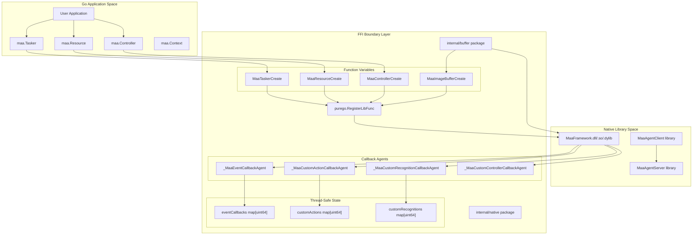
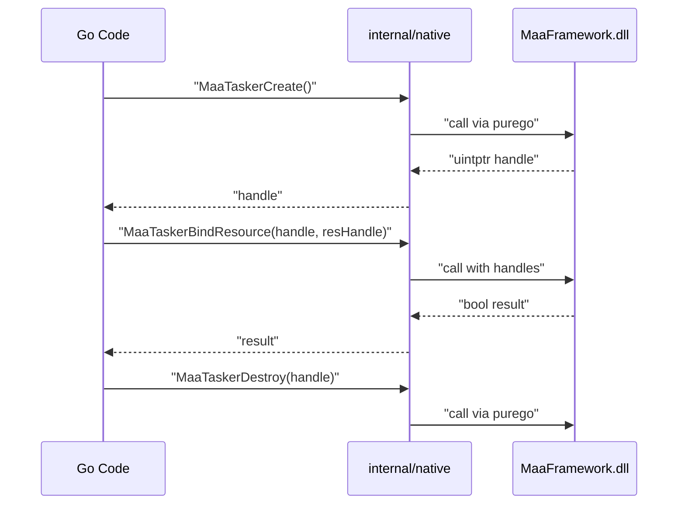

# Advanced Topics

Relevant source files

* [README.md](https://github.com/MaaXYZ/maa-framework-go/blob/5f9c965c/README.md?plain=1)
* [README\_zh.md](https://github.com/MaaXYZ/maa-framework-go/blob/5f9c965c/README_zh.md?plain=1)
* [examples/custom-action/main.go](https://github.com/MaaXYZ/maa-framework-go/blob/5f9c965c/examples/custom-action/main.go)
* [examples/quick-start/main.go](https://github.com/MaaXYZ/maa-framework-go/blob/5f9c965c/examples/quick-start/main.go)

This section documents the internal mechanics of `maa-framework-go` for advanced users and contributors. These topics are typically not needed for routine automation tasks but become essential when:

* Understanding how Go interfaces with the native MaaFramework C/C++ library
* Debugging FFI-related issues or extending the binding
* Building out-of-process components using the agent system
* Optimizing inference performance across different hardware
* Reasoning about thread safety and concurrent usage patterns

For routine usage, refer to [Core Components](/MaaXYZ/maa-framework-go/3-core-components) and [Extension System](/MaaXYZ/maa-framework-go/5-extension-system). The advanced topics covered here include:

| Topic | Purpose |
| --- | --- |
| [Native FFI Integration](/MaaXYZ/maa-framework-go/7.1-native-ffi-integration) | How `purego` loads libraries and registers 100+ native functions without CGO |
| [Buffer and Data Exchange](/MaaXYZ/maa-framework-go/7.2-buffer-and-data-exchange) | Memory-safe data transfer between Go and native code, including image format conversion |
| [Callback and FFI Bridge Architecture](/MaaXYZ/maa-framework-go/7.3-callback-and-ffi-bridge-architecture) | How native code invokes Go callbacks through agent dispatch functions |
| [Agent Client and Server](/MaaXYZ/maa-framework-go/7.4-agent-client-and-server) | Out-of-process architecture for custom recognitions and actions |
| [Inference Configuration](/MaaXYZ/maa-framework-go/7.5-inference-configuration) | Configuring ONNX execution providers (CPU, DirectML, CoreML, CUDA) |
| [Thread Safety and Concurrency](/MaaXYZ/maa-framework-go/7.6-thread-safety-and-concurrency) | Concurrency guarantees, atomic operations, and mutex-protected state |

## Architecture Overview

The following diagram illustrates how the advanced topics relate to the overall system architecture:

<old\_str>
Three dynamic libraries are loaded at initialization:

| Library | Purpose | Initializer Function |
| --- | --- | --- |
| `MaaFramework` | Core automation engine | `initFramework` in [internal/native/framework.go336-354](https://github.com/MaaXYZ/maa-framework-go/blob/5f9c965c/internal/native/framework.go#L336-L354) |
| `MaaAgentClient` | Client-side agent communication | `initAgentClient` in [internal/native/agent\_client.go31-49](https://github.com/MaaXYZ/maa-framework-go/blob/5f9c965c/internal/native/agent_client.go#L31-L49) |
| `MaaAgentServer` | Server-side agent hosting | `initAgentServer` in [internal/native/agent\_server.go27-45](https://github.com/MaaXYZ/maa-framework-go/blob/5f9c965c/internal/native/agent_server.go#L27-L45) |

**Library filename resolution by platform:**

| OS | MaaFramework | MaaAgentClient | MaaAgentServer |
| --- | --- | --- | --- |
| Linux | `libMaaFramework.so` | `libMaaAgentClient.so` | `libMaaAgentServer.so` |
| macOS | `libMaaFramework.dylib` | `libMaaAgentClient.dylib` | `libMaaAgentServer.dylib` |
| Windows | `MaaFramework.dll` | `MaaAgentClient.dll` | `MaaAgentServer.dll` |

The `maa.Init()` function triggers library loading and function registration. Over 100 native functions are bound to Go function variables using `purego.RegisterLibFunc`. For complete details, see [Native FFI Integration](/MaaXYZ/maa-framework-go/7.1-native-ffi-integration).

**Sources**: [internal/native/framework.go336-354](https://github.com/MaaXYZ/maa-framework-go/blob/5f9c965c/internal/native/framework.go#L336-L354) [internal/native/agent\_client.go31-49](https://github.com/MaaXYZ/maa-framework-go/blob/5f9c965c/internal/native/agent_client.go#L31-L49) [internal/native/agent\_server.go27-45](https://github.com/MaaXYZ/maa-framework-go/blob/5f9c965c/internal/native/agent_server.go#L27-L45)
</old\_str>
<new\_str>

# Advanced Topics

This section documents the internal mechanics of `maa-framework-go` for advanced users and contributors. These topics are typically not needed for routine automation tasks but become essential when:

* Understanding how Go interfaces with the native MaaFramework C/C++ library
* Debugging FFI-related issues or extending the binding
* Building out-of-process components using the agent system
* Optimizing inference performance across different hardware
* Reasoning about thread safety and concurrent usage patterns

For routine usage, refer to [Core Components](/MaaXYZ/maa-framework-go/3-core-components) and [Extension System](/MaaXYZ/maa-framework-go/5-extension-system). The advanced topics covered here include:

| Topic | Purpose |
| --- | --- |
| [Native FFI Integration](/MaaXYZ/maa-framework-go/7.1-native-ffi-integration) | How `purego` loads libraries and registers 100+ native functions without CGO |
| [Buffer and Data Exchange](/MaaXYZ/maa-framework-go/7.2-buffer-and-data-exchange) | Memory-safe data transfer between Go and native code, including image format conversion |
| [Callback and FFI Bridge Architecture](/MaaXYZ/maa-framework-go/7.3-callback-and-ffi-bridge-architecture) | How native code invokes Go callbacks through agent dispatch functions |
| [Agent Client and Server](/MaaXYZ/maa-framework-go/7.4-agent-client-and-server) | Out-of-process architecture for custom recognitions and actions |
| [Inference Configuration](/MaaXYZ/maa-framework-go/7.5-inference-configuration) | Configuring ONNX execution providers (CPU, DirectML, CoreML, CUDA) |
| [Thread Safety and Concurrency](/MaaXYZ/maa-framework-go/7.6-thread-safety-and-concurrency) | Concurrency guarantees, atomic operations, and mutex-protected state |

## Architecture Overview

The binding's advanced features are built on a carefully designed FFI (Foreign Function Interface) layer that bridges Go and native C/C++ code without using CGO. Understanding this architecture is key to working with the advanced topics.

**FFI Layer and Component Relationships**

**Sources**: [internal/native/framework.go1-354](https://github.com/MaaXYZ/maa-framework-go/blob/5f9c965c/internal/native/framework.go#L1-L354) [internal/buffer/image\_buffer.go1-139](https://github.com/MaaXYZ/maa-framework-go/blob/5f9c965c/internal/buffer/image_buffer.go#L1-L139) [agent\_server.go1-120](https://github.com/MaaXYZ/maa-framework-go/blob/5f9c965c/agent_server.go#L1-L120)

## Key Design Patterns

### 1. No CGO Requirement

The binding uses `github.com/ebitengine/purego` to dynamically load and call C functions at runtime. This eliminates CGO's compile-time C dependencies and cross-compilation complexity. See [Native FFI Integration](/MaaXYZ/maa-framework-go/7.1-native-ffi-integration) for details.

### 2. Handle-Based Object Model

Native objects are represented as `uintptr` handles (opaque pointers). The Go layer never dereferences these; they are passed back to native functions for all operations. This maintains clear ownership boundaries between Go and native code.

**Handle lifecycle pattern:**

**Sources**: [internal/native/framework.go116-354](https://github.com/MaaXYZ/maa-framework-go/blob/5f9c965c/internal/native/framework.go#L116-L354) [tasker.go1-200](https://github.com/MaaXYZ/maa-framework-go/blob/5f9c965c/tasker.go#L1-L200)

### 3. Bidirectional Callback System

The native library can invoke Go code through callback agents. Each agent function is created with `purego.NewCallback` and registered with the native library along with a unique ID (`transArg`). When invoked, the agent looks up the ID in a thread-safe map to find the Go handler. See [Callback and FFI Bridge Architecture](/MaaXYZ/maa-framework-go/7.3-callback-and-ffi-bridge-architecture).

### 4. Memory-Safe Data Exchange

All data crossing the FFI boundary flows through buffer objects that wrap native memory. The `internal/buffer` package provides type-safe accessors and handles format conversion (e.g., BGR ↔ RGBA for images). See [Buffer and Data Exchange](/MaaXYZ/maa-framework-go/7.2-buffer-and-data-exchange).

## Subsections

Each subsection below links to a detailed page covering that topic:

* **[7.1 Native FFI Integration](/MaaXYZ/maa-framework-go/7.1-native-ffi-integration)**: Library loading, function registration, and the handle-based object model
* **[7.2 Buffer and Data Exchange](/MaaXYZ/maa-framework-go/7.2-buffer-and-data-exchange)**: Image/string/rect buffers, color space conversion, and memory safety
* **[7.3 Callback and FFI Bridge Architecture](/MaaXYZ/maa-framework-go/7.3-callback-and-ffi-bridge-architecture)**: Agent functions, ID-based dispatch, and callback lifecycle
* **[7.4 Agent Client and Server](/MaaXYZ/maa-framework-go/7.4-agent-client-and-server)**: Out-of-process custom logic via IPC or TCP
* **[7.5 Inference Configuration](/MaaXYZ/maa-framework-go/7.5-inference-configuration)**: Neural network execution providers and device selection
* **[7.6 Thread Safety and Concurrency](/MaaXYZ/maa-framework-go/7.6-thread-safety-and-concurrency)**: Mutex patterns, atomic operations, and concurrent usage guarantees

---

## Library Loading Overview

---

## Library Loading and the FFI Layer

---

## Data Exchange Between Go and Native Code

Communication with the native library uses buffer objects that wrap native memory allocations. The `internal/buffer` package provides five main buffer types:

| Buffer Type | Native Constructor | Go Type Equivalent | Primary Use Case |
| --- | --- | --- | --- |
| `ImageBuffer` | `MaaImageBufferCreate` | `image.Image` | Screenshot capture, template images |
| `RectBuffer` | `MaaRectCreate` | `Rect` struct | Recognition bounding boxes |
| `StringBuffer` | `MaaStringBufferCreate` | `string` | Node names, JSON payloads, log messages |
| `StringListBuffer` | `MaaStringListBufferCreate` | `[]string` | Pipeline node lists, hash arrays |
| `ImageListBuffer` | `MaaImageListBufferCreate` | `[]image.Image` | Debug visualization sequences |

**Critical implementation detail:** The native library stores images in BGR format (OpenCV `CV_8UC3`), while Go's `image` package uses RGBA. Every `ImageBuffer.Get()` and `ImageBuffer.Set()` call performs explicit channel reordering. This conversion happens in [internal/buffer/image\_buffer.go49-97](https://github.com/MaaXYZ/maa-framework-go/blob/5f9c965c/internal/buffer/image_buffer.go#L49-L97)

For complete coverage of buffer types, memory management, stride optimization, and performance considerations, see [Buffer and Data Exchange](/MaaXYZ/maa-framework-go/7.2-buffer-and-data-exchange).

**Sources**: [internal/buffer/image\_buffer.go1-139](https://github.com/MaaXYZ/maa-framework-go/blob/5f9c965c/internal/buffer/image_buffer.go#L1-L139) [internal/buffer/string\_buffer.go1-50](https://github.com/MaaXYZ/maa-framework-go/blob/5f9c965c/internal/buffer/string_buffer.go#L1-L50) [internal/buffer/rect\_buffer.go1-40](https://github.com/MaaXYZ/maa-framework-go/blob/5f9c965c/internal/buffer/rect_buffer.go#L1-L40)

---

## Callback Bridge Architecture

Native code can invoke Go functions through a callback bridge system built on `purego.NewCallback`. This enables the native MaaFramework to call custom actions, custom recognitions, and event sinks written in Go.

**Four callback categories:**

| Callback Type | Native Function Signature | Agent Function | Registration Map |
| --- | --- | --- | --- |
| Event Sink | `MaaEventCallback` | `_MaaEventCallbackAgent` | `eventCallbacks map[uint64]` |
| Custom Action | `MaaCustomActionCallback` | `_MaaCustomActionCallbackAgent` | `customActions map[uint64]` |
| Custom Recognition | `MaaCustomRecognitionCallback` | `_MaaCustomRecognitionCallbackAgent` | `customRecognitions map[uint64]` |
| Custom Controller | `MaaCustomControllerCallback` | Various `_Maa*ControllerCallbackAgent` | Per-method agent functions |

**ID-based dispatch mechanism:**

Each Go callback is assigned a unique `uint64` ID (via `atomic.AddUint64`) and stored in a `sync.RWMutex`-protected map. When the native library invokes the callback, it passes the ID as the `transArg` parameter. The agent function looks up the ID to find the registered Go handler.

For full details on the dispatch flow, thread safety, and `unsafe.Pointer(uintptr(id))` casting, see [Callback and FFI Bridge Architecture](/MaaXYZ/maa-framework-go/7.3-callback-and-ffi-bridge-architecture).

**Sources**: [agent\_server.go10-46](https://github.com/MaaXYZ/maa-framework-go/blob/5f9c965c/agent_server.go#L10-L46) [internal/native/framework.go18-19](https://github.com/MaaXYZ/maa-framework-go/blob/5f9c965c/internal/native/framework.go#L18-L19) [internal/native/framework.go54-56](https://github.com/MaaXYZ/maa-framework-go/blob/5f9c965c/internal/native/framework.go#L54-L56)

---

## Out-of-Process Architecture (Agent System)

The agent system enables running custom actions and recognitions in a separate process. This is useful for isolating complex logic, using different programming languages, or distributing computation.

**Two-process model:**

| Process | Component | Key Functions |
| --- | --- | --- |
| Main Process | `AgentClient` | `NewAgentClient`, `Connect`, `BindResource` |
| Helper Process | Agent Server | `AgentServerStartUp`, `AgentServerRegisterCustomAction`, `AgentServerRegisterCustomRecognition` |

**Communication transports:**

* **IPC**: Unix domain sockets (Linux/macOS) or named pipes (Windows ≥17063)
* **TCP**: Fallback for older Windows or network distribution

The main process creates an `AgentClient` and binds it to a `Resource` using `BindResource`. The helper process registers custom handlers and starts the server with `AgentServerStartUp(identifier)`. Communication happens transparently through the native MaaFramework agent libraries.

For complete API documentation, transport options, and lifecycle management, see [Agent Client and Server](/MaaXYZ/maa-framework-go/7.4-agent-client-and-server).

**Sources**: [agent\_client.go1-267](https://github.com/MaaXYZ/maa-framework-go/blob/5f9c965c/agent_client.go#L1-L267) [agent\_server.go1-120](https://github.com/MaaXYZ/maa-framework-go/blob/5f9c965c/agent_server.go#L1-L120) [internal/native/agent\_client.go1-84](https://github.com/MaaXYZ/maa-framework-go/blob/5f9c965c/internal/native/agent_client.go#L1-L84)

---

## Neural Network Inference Configuration

For ONNX-based recognition (OCR, neural network classify/detect), the execution provider and device must be configured on the `Resource` *before* loading models via `PostBundle` or `PostOcrModel`.

**Available execution providers:**

| Provider | Constant | Platform Support | Performance Notes |
| --- | --- | --- | --- |
| CPU | `MaaInferenceExecutionProvider_CPU` | All platforms | Baseline performance |
| DirectML | `MaaInferenceExecutionProvider_DirectML` | Windows | GPU acceleration via DirectX |
| CoreML | `MaaInferenceExecutionProvider_CoreML` | macOS | Neural Engine on Apple Silicon |
| CUDA | `MaaInferenceExecutionProvider_CUDA` | Linux/Windows | NVIDIA GPU (future support) |

**Device selection constants:**

| Constant | Value | Meaning |
| --- | --- | --- |
| `MaaInferenceDevice_CPU` | `-2` | Force CPU inference |
| `MaaInferenceDevice_Auto` | `-1` | Automatic device selection |
| `MaaInferenceDevice_0` through `MaaInferenceDevice_N` | `0...N` | Specific GPU index |

Public API methods include `UseCPU()`, `UseDirectml(deviceID)`, `UseCoreml(device)`, and `UseAutoExecutionProvider()`. These must be called before loading any neural network models.

For detailed usage examples and performance implications, see [Inference Configuration](/MaaXYZ/maa-framework-go/7.5-inference-configuration).

**Sources**: [internal/native/framework.go58-112](https://github.com/MaaXYZ/maa-framework-go/blob/5f9c965c/internal/native/framework.go#L58-L112) [resource.go250-300](https://github.com/MaaXYZ/maa-framework-go/blob/5f9c965c/resource.go#L250-L300)

---

## Concurrency and Thread Safety

The binding provides strong thread-safety guarantees through a combination of atomic operations and read-write mutexes.

**Thread-safe operations:**

| Operation Category | Mechanism | Implementation |
| --- | --- | --- |
| Callback registration | `atomic.AddUint64` for ID generation | Ensures unique IDs without locking |
| Callback storage | `sync.RWMutex` protecting maps | Concurrent reads, exclusive writes |
| Native function calls | Direct pass-through | Native library handles internal synchronization |
| Event delivery | RWMutex-protected callback map | Multiple events can be dispatched concurrently |

**Key concurrency properties:**

1. All `Post*` methods (`PostTask`, `PostClick`, `PostConnect`, etc.) are safe to call from multiple goroutines
2. Callback registration/unregistration can happen concurrently with callback invocation
3. The native library manages its own internal queues and thread pools
4. Event sinks can be added/removed while events are being delivered

**Best practices:**

* Callback implementations should be reentrant (may be called from multiple threads)
* Avoid long-blocking operations in callbacks to prevent queue buildup
* Use `Context` methods for sub-operations rather than direct native calls
* Custom controller implementations must handle concurrent method invocations

For complete details on the atomic operations, mutex patterns, and the `store` package for thread-safe state management, see [Thread Safety and Concurrency](/MaaXYZ/maa-framework-go/7.6-thread-safety-and-concurrency).

**Sources**: [agent\_server.go10-46](https://github.com/MaaXYZ/maa-framework-go/blob/5f9c965c/agent_server.go#L10-L46) [internal/native/framework.go18-56](https://github.com/MaaXYZ/maa-framework-go/blob/5f9c965c/internal/native/framework.go#L18-L56) [tasker.go150-200](https://github.com/MaaXYZ/maa-framework-go/blob/5f9c965c/tasker.go#L150-L200)

---

## Thread Safety and Concurrency

The binding's concurrency guarantees come from two mechanisms:

**1. Atomic ID generation**

All registration functions (`registerCustomAction`, `registerCustomRecognition`, `registerEventCallback`) assign IDs using `atomic.AddUint64`. This ensures unique IDs without locking when multiple goroutines register handlers concurrently.

**2. `sync.RWMutex`-protected maps**

Each registration map (custom actions, custom recognitions, event callbacks) is paired with a `sync.RWMutex`. Writes (register/unregister) take an exclusive lock; reads inside dispatch agents take a read lock. This allows many concurrent callback invocations to proceed without blocking each other.

**Concurrency model diagram:**

```mermaid
flowchart TD

D1["_MaaCustomActionCallbackAgent(transArg=id)"]
D2["mu.RLock()"]
D3["runner = customActions[id]"]
D4["mu.RUnlock()"]
D5["runner.Run(ctx, arg)"]
R1["RegisterCustomAction(runner)"]
R2["atomic.AddUint64(&nextID, 1)"]
R3["mu.Lock()"]
R4["customActions[id] = runner"]
R5["mu.Unlock()"]


subgraph subGraph1 ["Dispatch path (read, concurrent)"]
    D1
    D2
    D3
    D4
    D5
    D1 --> D2
    D2 --> D3
    D3 --> D4
    D4 --> D5
end

subgraph subGraph0 ["Registration path (write)"]
    R1
    R2
    R3
    R4
    R5
    R1 --> R2
    R2 --> R3
    R3 --> R4
    R4 --> R5
end
```

**`Post` method concurrency:** All `Post*` methods (e.g., `MaaTaskerPostTask`, `MaaControllerPostClick`) are safe to call from multiple goroutines. The native library manages its own internal queuing. The Go binding does not add any serialization around these calls.

**`AddSink` / `RemoveSink`:** These pass through to `MaaTaskerAddSink`, `MaaResourceAddSink`, etc., which are thread-safe in the native library. The Go-side `registerEventCallback` and map mutation are protected by the same `RWMutex` pattern.

Sources: [internal/native/framework.go18-56](https://github.com/MaaXYZ/maa-framework-go/blob/5f9c965c/internal/native/framework.go#L18-L56) [agent\_server.go10-46](https://github.com/MaaXYZ/maa-framework-go/blob/5f9c965c/agent_server.go#L10-L46)

See [Thread Safety and Concurrency](/MaaXYZ/maa-framework-go/7.6-thread-safety-and-concurrency) for a full analysis.