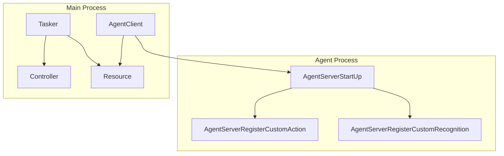
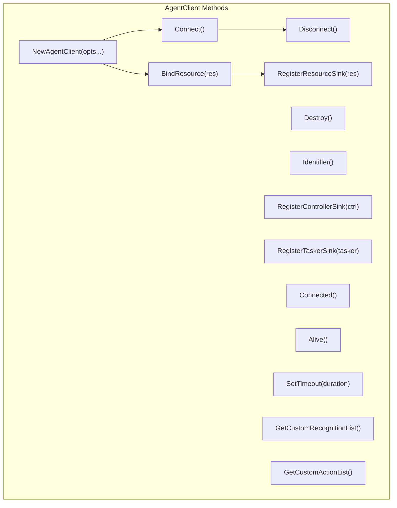
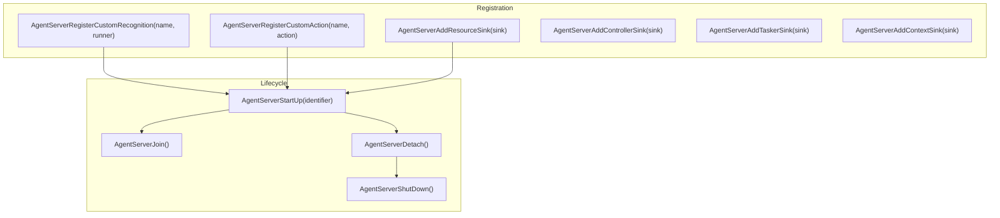
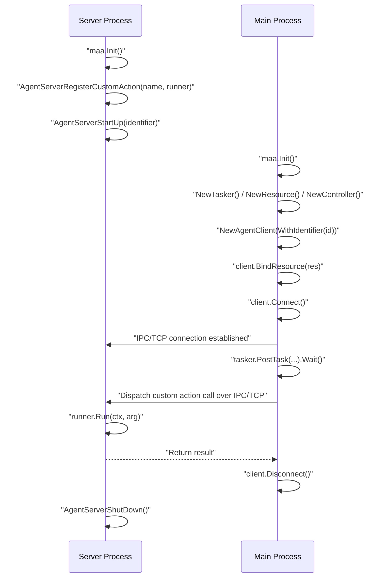

# Agent Client and Server

Relevant source files

* [CHANGELOG.md](https://github.com/MaaXYZ/maa-framework-go/blob/5f9c965c/CHANGELOG.md?plain=1)
* [README.md](https://github.com/MaaXYZ/maa-framework-go/blob/5f9c965c/README.md?plain=1)
* [README\_zh.md](https://github.com/MaaXYZ/maa-framework-go/blob/5f9c965c/README_zh.md?plain=1)
* [examples/custom-action/main.go](https://github.com/MaaXYZ/maa-framework-go/blob/5f9c965c/examples/custom-action/main.go)
* [examples/quick-start/main.go](https://github.com/MaaXYZ/maa-framework-go/blob/5f9c965c/examples/quick-start/main.go)
* [recognition\_result\_test.go](https://github.com/MaaXYZ/maa-framework-go/blob/5f9c965c/recognition_result_test.go)
* [resource.go](https://github.com/MaaXYZ/maa-framework-go/blob/5f9c965c/resource.go)

## Purpose and Scope

This page covers the out-of-process agent system: `AgentClient` and the `AgentServer*` package-level functions. These allow custom recognition and action logic to run in a **separate process** from the MaaFramework core, communicating over IPC (AF\_UNIX) or TCP.

This page is specifically about the transport and lifecycle of the agent IPC channel. For how custom recognitions and actions are implemented and registered in-process, see [Custom Actions](/MaaXYZ/maa-framework-go/5.1-custom-actions) and [Custom Recognition](/MaaXYZ/maa-framework-go/5.2-custom-recognition). For the underlying FFI callback mechanism that both in-process and agent server handlers share, see [Callback and FFI Bridge Architecture](/MaaXYZ/maa-framework-go/7.3-callback-and-ffi-bridge-architecture).

---

## Conceptual Overview

In the standard setup, custom recognitions and actions run in the same process as MaaFramework. The agent system splits that model:

* The **client** runs in the main process alongside MaaFramework core (Tasker, Resource, Controller).
* The **server** runs in a separate process and registers custom recognitions and actions.

When MaaFramework encounters a custom action or recognition during task execution, it delegates the call across the IPC/TCP channel to the server process.

**Process Split Diagram**



Sources: [agent\_client.go1-268](https://github.com/MaaXYZ/maa-framework-go/blob/5f9c965c/agent_client.go#L1-L268) [agent\_server.go1-121](https://github.com/MaaXYZ/maa-framework-go/blob/5f9c965c/agent_server.go#L1-L121)

---

## Transport Modes

`AgentClient` supports two transport modes, controlled by the option passed to `NewAgentClient`.

| Option | Function | Native API | Transport |
| --- | --- | --- | --- |
| `WithIdentifier(id)` | IPC (AF\_UNIX) | `MaaAgentClientCreateV2` | Unix socket / falls back to TCP on Windows < 17063 |
| `WithTcpPort(port)` | TCP | `MaaAgentClientCreateTcp` | TCP socket at given port |

When **both** options are supplied, the **last one specified** wins. The `agentClientConfig.lastSet` field ([agent\_client.go33-36](https://github.com/MaaXYZ/maa-framework-go/blob/5f9c965c/agent_client.go#L33-L36)) tracks which was set most recently.

If neither option is provided, `NewAgentClient` defaults to identifier mode with an empty string (an auto-generated identifier).

Sources: [agent\_client.go27-98](https://github.com/MaaXYZ/maa-framework-go/blob/5f9c965c/agent_client.go#L27-L98)

---

## AgentClient

`AgentClient` lives in [agent\_client.go](https://github.com/MaaXYZ/maa-framework-go/blob/5f9c965c/agent_client.go) and wraps a native handle returned by `MaaAgentClientCreateV2` or `MaaAgentClientCreateTcp`.

**AgentClient Method Map**



Sources: [agent\_client.go112-267](https://github.com/MaaXYZ/maa-framework-go/blob/5f9c965c/agent_client.go#L112-L267)

### Constructor

```
NewAgentClient(opts ...AgentClientOption) (*AgentClient, error)
```

Accepts `AgentClientOption` functional options. Returns `ErrInvalidAgentClient` if the native handle is zero.

### Lifecycle

| Method | Description |
| --- | --- |
| `Destroy()` | Frees the native handle via `MaaAgentClientDestroy`. |
| `Connect()` | Connects to the agent server. Returns an error on failure. |
| `Disconnect()` | Disconnects from the agent server. |
| `Connected()` | Returns `true` if currently connected. |
| `Alive()` | Returns `true` if the server process is still responsive. |

### Resource and Sink Registration

`BindResource(res *Resource)` links the client to a `Resource` so the server-side custom logic can operate on it ([agent\_client.go131-142](https://github.com/MaaXYZ/maa-framework-go/blob/5f9c965c/agent_client.go#L131-L142)).

The three sink registration methods forward events from the server process back to the client process's existing event sinks:

| Method | Forwards events from... |
| --- | --- |
| `RegisterResourceSink(res *Resource)` | Resource events |
| `RegisterControllerSink(ctrl Controller)` | Controller events |
| `RegisterTaskerSink(tasker Tasker)` | Tasker events |

These call `MaaAgentClientRegisterResourceSink`, `MaaAgentClientRegisterControllerSink`, and `MaaAgentClientRegisterTaskerSink` respectively ([agent\_client.go145-184](https://github.com/MaaXYZ/maa-framework-go/blob/5f9c965c/agent_client.go#L145-L184)).

### Status and Timeout

* `SetTimeout(duration time.Duration)` — Converts `duration` to milliseconds and calls `MaaAgentClientSetTimeout`. Returns `ErrInvalidTimeout` if `duration` is negative ([agent\_client.go225-239](https://github.com/MaaXYZ/maa-framework-go/blob/5f9c965c/agent_client.go#L225-L239)).
* `Identifier()` — Retrieves the effective identifier string via a `StringBuffer` ([agent\_client.go117-128](https://github.com/MaaXYZ/maa-framework-go/blob/5f9c965c/agent_client.go#L117-L128)).

### Introspection

* `GetCustomRecognitionList()` — Returns the names of custom recognitions registered on the connected server ([agent\_client.go242-253](https://github.com/MaaXYZ/maa-framework-go/blob/5f9c965c/agent_client.go#L242-L253)).
* `GetCustomActionList()` — Returns the names of custom actions registered on the connected server ([agent\_client.go256-267](https://github.com/MaaXYZ/maa-framework-go/blob/5f9c965c/agent_client.go#L256-L267)).

Both use `StringListBuffer` to receive results from the native layer.

Sources: [agent\_client.go100-267](https://github.com/MaaXYZ/maa-framework-go/blob/5f9c965c/agent_client.go#L100-L267) [internal/native/agent\_client.go13-29](https://github.com/MaaXYZ/maa-framework-go/blob/5f9c965c/internal/native/agent_client.go#L13-L29)

---

## AgentServer

The agent server side is a collection of **package-level functions** in [agent\_server.go](https://github.com/MaaXYZ/maa-framework-go/blob/5f9c965c/agent_server.go) There is no `AgentServer` struct. The server is backed by the `MaaAgentServer` shared library loaded by `internal/native/agent_server.go`.

**AgentServer Function Map**



Sources: [agent\_server.go1-121](https://github.com/MaaXYZ/maa-framework-go/blob/5f9c965c/agent_server.go#L1-L121)

### Registering Custom Handlers

```
AgentServerRegisterCustomRecognition(name string, recognition CustomRecognitionRunner) error
AgentServerRegisterCustomAction(name string, action CustomActionRunner) error
```

Both functions reuse the same in-process registration mechanism from the extension system:

* They call `registerCustomRecognition` / `registerCustomAction` to obtain an integer ID.
* They pass `_MaaCustomRecognitionCallbackAgent` / `_MaaCustomActionCallbackAgent` as the C callback, with the ID embedded as the `transArg` pointer.
* If the native registration fails, the ID is immediately unregistered.

The `name` must match the `custom_recognition` or `custom_action` field in the pipeline node definition.

Sources: [agent\_server.go12-46](https://github.com/MaaXYZ/maa-framework-go/blob/5f9c965c/agent_server.go#L12-L46)

### Adding Event Sinks

These add event observers on the server side. They mirror the in-process `AddSink` pattern but use the `MaaAgentServer*` native functions:

| Function | Sink Interface | Returns |
| --- | --- | --- |
| `AgentServerAddResourceSink(sink)` | `ResourceEventSink` | `int64` sink ID |
| `AgentServerAddControllerSink(sink)` | `ControllerEventSink` | `int64` sink ID |
| `AgentServerAddTaskerSink(sink)` | `TaskerEventSink` | `int64` sink ID |
| `AgentServerAddContextSink(sink)` | `ContextEventSink` | `int64` sink ID |

All pass `_MaaEventCallbackAgent` as the callback and an encoded sink ID as `transArg` ([agent\_server.go49-94](https://github.com/MaaXYZ/maa-framework-go/blob/5f9c965c/agent_server.go#L49-L94)).

### Server Lifecycle

| Function | Behavior |
| --- | --- |
| `AgentServerStartUp(identifier string)` | Starts the agent service. `identifier` must match what the client was created with. Blocking until the server is ready. |
| `AgentServerShutDown()` | Signals the server to stop. |
| `AgentServerJoin()` | Blocks the current goroutine until the server service ends. |
| `AgentServerDetach()` | Lets the server service run in the background without blocking. |

Sources: [agent\_server.go96-120](https://github.com/MaaXYZ/maa-framework-go/blob/5f9c965c/agent_server.go#L96-L120)

---

## Native Library Loading

Each side loads a separate shared library:

| Side | Linux | macOS | Windows |
| --- | --- | --- | --- |
| Client | `libMaaAgentClient.so` | `libMaaAgentClient.dylib` | `MaaAgentClient.dll` |
| Server | `libMaaAgentServer.so` | `libMaaAgentServer.dylib` | `MaaAgentServer.dll` |

Loading is handled by `initAgentClient` and `initAgentServer` in [internal/native/agent\_client.go31-49](https://github.com/MaaXYZ/maa-framework-go/blob/5f9c965c/internal/native/agent_client.go#L31-L49) and [internal/native/agent\_server.go27-45](https://github.com/MaaXYZ/maa-framework-go/blob/5f9c965c/internal/native/agent_server.go#L27-L45) respectively. Function pointers are bound via `purego.RegisterLibFunc`. For the general FFI loading mechanism, see [Native FFI Integration](/MaaXYZ/maa-framework-go/7.1-native-ffi-integration).

---

## End-to-End Sequence

**Full Agent Interaction Sequence**



Sources: [examples/agent-client/main.go1-71](https://github.com/MaaXYZ/maa-framework-go/blob/5f9c965c/examples/agent-client/main.go#L1-L71) [examples/agent-server/main.go1-42](https://github.com/MaaXYZ/maa-framework-go/blob/5f9c965c/examples/agent-server/main.go#L1-L42)

---

## Usage Pattern

The following describes the structure of each process, based on the examples.

**Server process** ([examples/agent-server/main.go1-42](https://github.com/MaaXYZ/maa-framework-go/blob/5f9c965c/examples/agent-server/main.go#L1-L42)):

1. Call `maa.Init()`.
2. Register custom actions and/or recognitions with `AgentServerRegisterCustomAction` / `AgentServerRegisterCustomRecognition`.
3. Call `AgentServerStartUp(socketID)` where `socketID` is passed as a command-line argument.
4. Call `AgentServerJoin()` to block until the session ends.
5. Call `AgentServerShutDown()` for cleanup.

**Client process** ([examples/agent-client/main.go1-71](https://github.com/MaaXYZ/maa-framework-go/blob/5f9c965c/examples/agent-client/main.go#L1-L71)):

1. Call `maa.Init()`.
2. Create and bind `Tasker`, `Resource`, and `Controller` normally.
3. Create an `AgentClient` — for example, `NewAgentClient(maa.WithTcpPort(7788))`.
4. Call `client.BindResource(res)`.
5. Call `client.Connect()`.
6. Post tasks referencing custom actions/recognitions by name (e.g., `"TestAgentServer"`).
7. Call `client.Disconnect()` when done.

---

## Error Sentinel Values

| Sentinel | Source | Triggered when |
| --- | --- | --- |
| `ErrInvalidAgentClient` | [agent\_client.go21](https://github.com/MaaXYZ/maa-framework-go/blob/5f9c965c/agent_client.go#L21-L21) | `ac == nil` or `ac.handle == 0` |
| `ErrInvalidResource` | [agent\_client.go22](https://github.com/MaaXYZ/maa-framework-go/blob/5f9c965c/agent_client.go#L22-L22) | `res == nil` or `res.handle == 0` |
| `ErrInvalidController` | [agent\_client.go23](https://github.com/MaaXYZ/maa-framework-go/blob/5f9c965c/agent_client.go#L23-L23) | `ctrl.handle == 0` |
| `ErrInvalidTasker` | [agent\_client.go24](https://github.com/MaaXYZ/maa-framework-go/blob/5f9c965c/agent_client.go#L24-L24) | `tasker.handle == 0` |
| `ErrInvalidTimeout` | [agent\_client.go25](https://github.com/MaaXYZ/maa-framework-go/blob/5f9c965c/agent_client.go#L25-L25) | `duration < 0` in `SetTimeout` |

All other failures produce a formatted error via `agentClientOpError(op string)` ([agent\_client.go107-109](https://github.com/MaaXYZ/maa-framework-go/blob/5f9c965c/agent_client.go#L107-L109)).