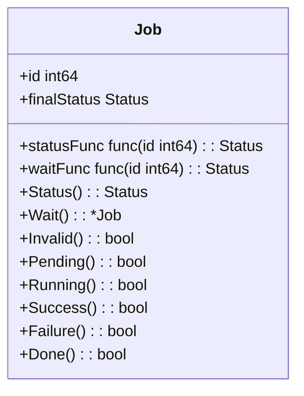
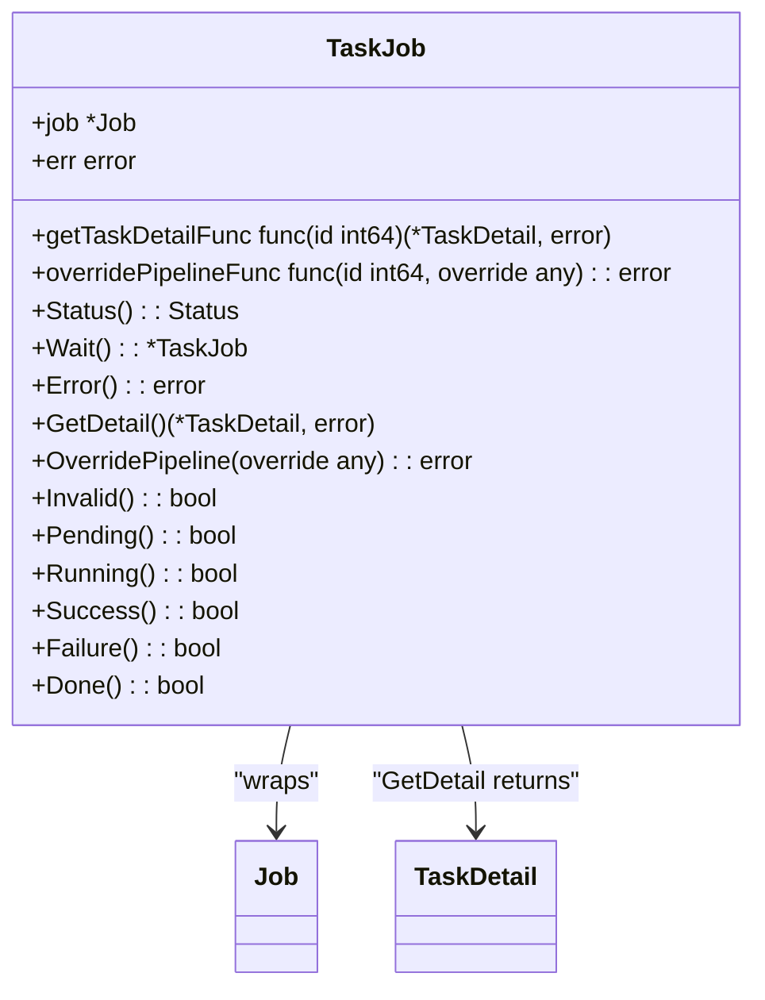
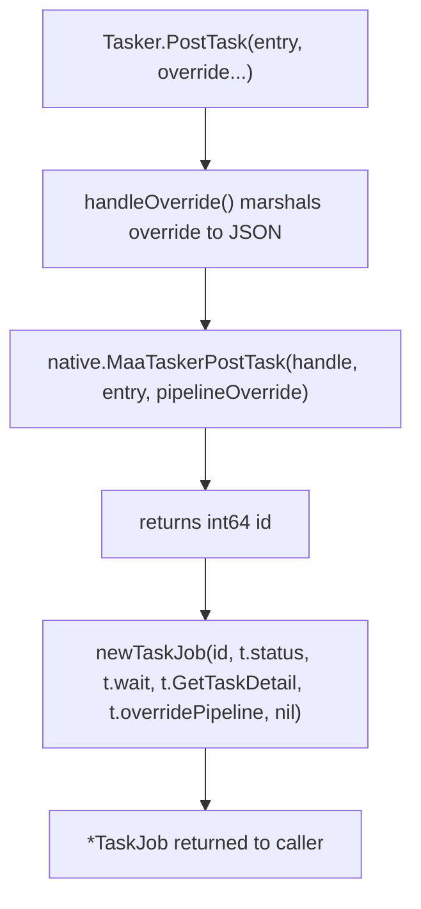
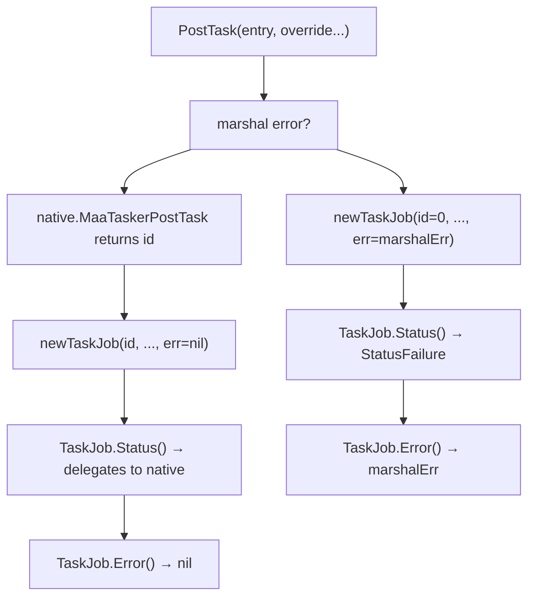

# Async Operations and Job Management

Relevant source files

* [context.go](https://github.com/MaaXYZ/maa-framework-go/blob/5f9c965c/context.go)
* [controller.go](https://github.com/MaaXYZ/maa-framework-go/blob/5f9c965c/controller.go)
* [internal/native/framework.go](https://github.com/MaaXYZ/maa-framework-go/blob/5f9c965c/internal/native/framework.go)
* [resource.go](https://github.com/MaaXYZ/maa-framework-go/blob/5f9c965c/resource.go)
* [tasker.go](https://github.com/MaaXYZ/maa-framework-go/blob/5f9c965c/tasker.go)

This page covers how asynchronous operations are submitted to MaaFramework, the `Job` and `TaskJob` handle types returned by `Post` methods, the `Status` enumeration used to track lifecycle state, blocking wait semantics, and how errors propagate through job handles.

For the event-driven observation of these same operations, see the Event System ([6.1](/MaaXYZ/maa-framework-go/6.1-event-architecture) and [6.2](/MaaXYZ/maa-framework-go/6.2-implementing-event-sinks)). For the full Tasker API reference and result detail structures, see [3.1](/MaaXYZ/maa-framework-go/3.1-tasker).

---

## The Async Post Pattern

All long-running operations in the framework are submitted asynchronously via `Post` methods. Each `Post` call dispatches work to the native MaaFramework engine immediately, assigns an integer ID to the queued job, and returns a Go handle to track it. The caller is never blocked at submission time.

The three main categories of async operations on `Tasker` are:

| Method | Return type | Native call |
| --- | --- | --- |
| `Tasker.PostTask` | `*TaskJob` | `MaaTaskerPostTask` |
| `Tasker.PostRecognition` | `*TaskJob` | `MaaTaskerPostRecognition` |
| `Tasker.PostAction` | `*TaskJob` | `MaaTaskerPostAction` |
| `Tasker.PostStop` | `*TaskJob` | `MaaTaskerPostStop` |

Controller `Post` methods (e.g. `PostConnect`, `PostClick`, `PostScreenshot`) follow the same model but return a plain `*Job` instead of `*TaskJob`. Resource operations such as `PostBundle` and `PostPipeline` also return `*Job`.

Sources: [tasker.go106-181](https://github.com/MaaXYZ/maa-framework-go/blob/5f9c965c/tasker.go#L106-L181)

---

## The `Status` Type

`Status` is an `int32` alias defined in [status.go4-12](https://github.com/MaaXYZ/maa-framework-go/blob/5f9c965c/status.go#L4-L12) It has five named constants that describe a job's lifecycle:

| Constant | Value | Meaning |
| --- | --- | --- |
| `StatusInvalid` | `0` | Uninitialized, or native call returned an invalid ID |
| `StatusPending` | `1000` | Queued in the framework, not yet executing |
| `StatusRunning` | `2000` | Actively executing |
| `StatusSuccess` | `3000` | Completed successfully |
| `StatusFailure` | `4000` | Completed with a failure |

`Status` provides predicate methods `Invalid()`, `Pending()`, `Running()`, `Success()`, `Failure()`, and `Done()` (which is `Success() || Failure()`). See [status.go14-42](https://github.com/MaaXYZ/maa-framework-go/blob/5f9c965c/status.go#L14-L42)

**State transition diagram:**

Sources: [status.go1-61](https://github.com/MaaXYZ/maa-framework-go/blob/5f9c965c/status.go#L1-L61)

---

## `Job`: The Base Handle

`Job` ([job.go7-66](https://github.com/MaaXYZ/maa-framework-go/blob/5f9c965c/job.go#L7-L66)) is the low-level handle returned for non-task async operations (e.g. controller connections, resource bundle loads).

**`Job` struct internals:**



* `id`: the integer identifier returned by the native `Post` call.
* `statusFunc`: closure that calls the native status query (e.g. `MaaTaskerStatus`).
* `waitFunc`: closure that calls the native blocking wait (e.g. `MaaTaskerWait`).
* `finalStatus`: cached terminal status after `Wait()` is called. Once set to a non-`Invalid` value, `Status()` returns the cached result without hitting the native layer again.

`Wait()` delegates to `waitFunc(id)`, stores the returned status in `finalStatus`, and returns `j` for chaining. Calling `Wait()` a second time is a no-op because `finalStatus` is already set ([job.go61-66](https://github.com/MaaXYZ/maa-framework-go/blob/5f9c965c/job.go#L61-L66)).

Sources: [job.go7-66](https://github.com/MaaXYZ/maa-framework-go/blob/5f9c965c/job.go#L7-L66)

---

## `TaskJob`: The Task-Specific Handle

`TaskJob` ([job.go68-167](https://github.com/MaaXYZ/maa-framework-go/blob/5f9c965c/job.go#L68-L167)) wraps a `*Job` and adds two task-specific capabilities: detail retrieval and pipeline override.

**`TaskJob` struct internals:**



Sources: [job.go68-167](https://github.com/MaaXYZ/maa-framework-go/blob/5f9c965c/job.go#L68-L167)

---

## How `Post` Methods Construct Job Handles

Each `Post` method on `Tasker` calls the native function, gets back an `int64` ID, then calls `newTaskJob` with closed-over references to the tasker's own `status`, `wait`, `GetTaskDetail`, and `overridePipeline` methods:

**`newTaskJob` call flow diagram:**



The closures capture `t` (the `Tasker` pointer), so every call on `TaskJob` routes back to the originating `Tasker` instance. See [tasker.go106-114](https://github.com/MaaXYZ/maa-framework-go/blob/5f9c965c/tasker.go#L106-L114)

If JSON marshaling of the override fails, `newTaskJob` is called with `id = 0` and a non-nil `err`, immediately putting the job into a permanent failure state ([tasker.go97-103](https://github.com/MaaXYZ/maa-framework-go/blob/5f9c965c/tasker.go#L97-L103)).

Sources: [tasker.go81-131](https://github.com/MaaXYZ/maa-framework-go/blob/5f9c965c/tasker.go#L81-L131) [job.go77-92](https://github.com/MaaXYZ/maa-framework-go/blob/5f9c965c/job.go#L77-L92)

---

## `Status()` and Error Interaction

`TaskJob.Status()` has a special rule: if `j.err != nil`, it unconditionally returns `StatusFailure`, bypassing the native status query entirely ([job.go96-101](https://github.com/MaaXYZ/maa-framework-go/blob/5f9c965c/job.go#L96-L101)). This means a `TaskJob` that could not even be submitted (e.g. due to a marshaling error) presents as a failed job, and all predicate methods (`Success()`, `Failure()`, `Done()`, etc.) behave consistently with that.

| `j.err` | `j.job.Status()` | `TaskJob.Status()` |
| --- | --- | --- |
| `nil` | `StatusPending` | `StatusPending` |
| `nil` | `StatusSuccess` | `StatusSuccess` |
| non-nil | (irrelevant) | `StatusFailure` |

`TaskJob.Wait()` skips the blocking call when `j.err != nil` ([job.go104-108](https://github.com/MaaXYZ/maa-framework-go/blob/5f9c965c/job.go#L104-L108)), so it is always safe to call `Wait()` without checking `Error()` first.

Sources: [job.go94-114](https://github.com/MaaXYZ/maa-framework-go/blob/5f9c965c/job.go#L94-L114)

---

## `Wait()` Blocking Semantics

Calling `Wait()` on a `Job` or `TaskJob` blocks the calling goroutine until the native framework reports that the operation is complete. Internally it invokes `MaaTaskerWait(handle, id)` via the stored `waitFunc` closure.

```mermaid
sequenceDiagram
  participant Caller goroutine
  participant TaskJob.Wait()
  participant Job.Wait()
  participant native.MaaTaskerWait

  Caller goroutine->>TaskJob.Wait(): "Wait()"
  TaskJob.Wait()->>Job.Wait(): "j.job.Wait()"
  Job.Wait()->>native.MaaTaskerWait: "waitFunc(id)"
  native.MaaTaskerWait-->>Job.Wait(): "Status (terminal)"
  Job.Wait()-->>TaskJob.Wait(): "stores in finalStatus"
  TaskJob.Wait()-->>Caller goroutine: "returns *TaskJob"
```

`Wait()` returns the same `*TaskJob` instance, enabling method chaining:

```
detail, err := tasker.PostTask("MyEntry").Wait().GetDetail()
```

Sources: [job.go61-66](https://github.com/MaaXYZ/maa-framework-go/blob/5f9c965c/job.go#L61-L66) [job.go104-109](https://github.com/MaaXYZ/maa-framework-go/blob/5f9c965c/job.go#L104-L109)

---

## `GetDetail()`: Retrieving Task Results

`TaskJob.GetDetail()` calls `Tasker.GetTaskDetail(id)`, which queries the native layer and assembles a `TaskDetail` struct containing the entry name, the ordered list of executed nodes, and the final `Status`.

The `TaskDetail` and its nested structures are defined in `tasker.go`:

| Type | Field | Description |
| --- | --- | --- |
| `TaskDetail` | `ID`, `Entry`, `NodeDetails`, `Status` | Top-level task summary |
| `NodeDetail` | `ID`, `Name`, `Recognition`, `Action`, `RunCompleted` | Per-node execution record |
| `RecognitionDetail` | `ID`, `Name`, `Algorithm`, `Hit`, `Box`, `Results`, ... | Recognition result |
| `ActionDetail` | `ID`, `Name`, `Action`, `Box`, `Success`, `Result` | Action result |

`GetDetail()` can be called before or after `Wait()`. Calling it while the task is still running returns the partial state at the time of the call. For a complete result set, call `Wait()` first.

If `j.err != nil`, `GetDetail()` returns `nil, j.err` immediately ([job.go148-154](https://github.com/MaaXYZ/maa-framework-go/blob/5f9c965c/job.go#L148-L154)).

Sources: [job.go147-155](https://github.com/MaaXYZ/maa-framework-go/blob/5f9c965c/job.go#L147-L155) [tasker.go407-467](https://github.com/MaaXYZ/maa-framework-go/blob/5f9c965c/tasker.go#L407-L467) [tasker.go362-413](https://github.com/MaaXYZ/maa-framework-go/blob/5f9c965c/tasker.go#L362-L413)

---

## `OverridePipeline()`: Modifying a Running Task

`TaskJob.OverridePipeline(override any)` allows changing the pipeline definition for a task that is already queued or running. The `override` parameter accepts:

* A raw JSON `string`
* `[]byte` containing JSON
* Any Go value that marshals to a JSON object (e.g. a `*Pipeline`, `map[string]any`)
* `nil` (treated as `{}`)

Internally it calls `Tasker.overridePipeline(taskId, override)`, which marshals the value and passes it to `native.MaaTaskerOverridePipeline` ([tasker.go204-227](https://github.com/MaaXYZ/maa-framework-go/blob/5f9c965c/tasker.go#L204-L227)).

If the `TaskJob` has an error, `OverridePipeline` returns that error immediately without hitting the native layer ([job.go159-163](https://github.com/MaaXYZ/maa-framework-go/blob/5f9c965c/job.go#L159-L163)).

Sources: [job.go157-167](https://github.com/MaaXYZ/maa-framework-go/blob/5f9c965c/job.go#L157-L167) [tasker.go204-227](https://github.com/MaaXYZ/maa-framework-go/blob/5f9c965c/tasker.go#L204-L227)

---

## `Context.GetTaskJob()`

Within a custom action or recognition callback, the current running task's `TaskJob` can be retrieved from the `Context`:

```
func (ctx *Context) GetTaskJob() *TaskJob
```

This constructs a new `TaskJob` handle wrapping the current task's ID with closed-over references to the parent `Tasker`'s methods ([context.go394-405](https://github.com/MaaXYZ/maa-framework-go/blob/5f9c965c/context.go#L394-L405)). This handle can be used to call `OverridePipeline` or `GetDetail` on the currently executing task from inside a callback.

Sources: [context.go394-405](https://github.com/MaaXYZ/maa-framework-go/blob/5f9c965c/context.go#L394-L405)

---

## Error Propagation Summary

The error path through `TaskJob` is designed so that a failed submission is indistinguishable from a failed execution from the caller's perspective, unless the caller explicitly checks `Error()`.



The pattern to handle both cases:

```
job := tasker.PostTask("MyEntry", override)
if err := job.Error(); err != nil {
    // submission-time error (e.g. JSON marshal failure)
}
job.Wait()
if job.Failure() {
    // native execution failure
}
detail, err := job.GetDetail()
```

Sources: [job.go77-167](https://github.com/MaaXYZ/maa-framework-go/blob/5f9c965c/job.go#L77-L167) [tasker.go97-103](https://github.com/MaaXYZ/maa-framework-go/blob/5f9c965c/tasker.go#L97-L103)