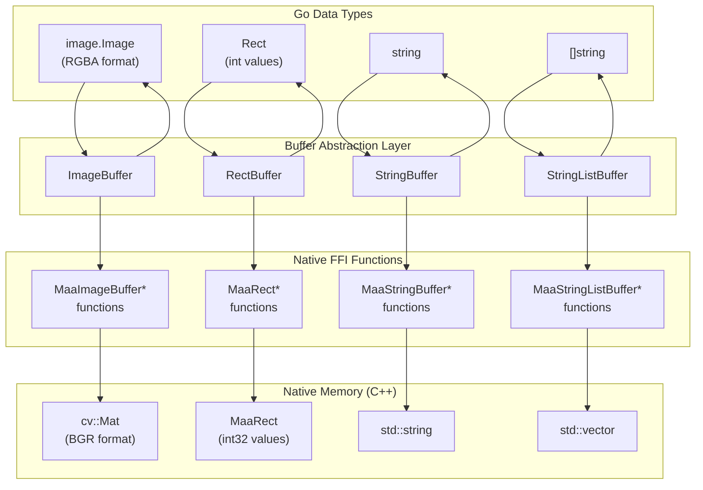
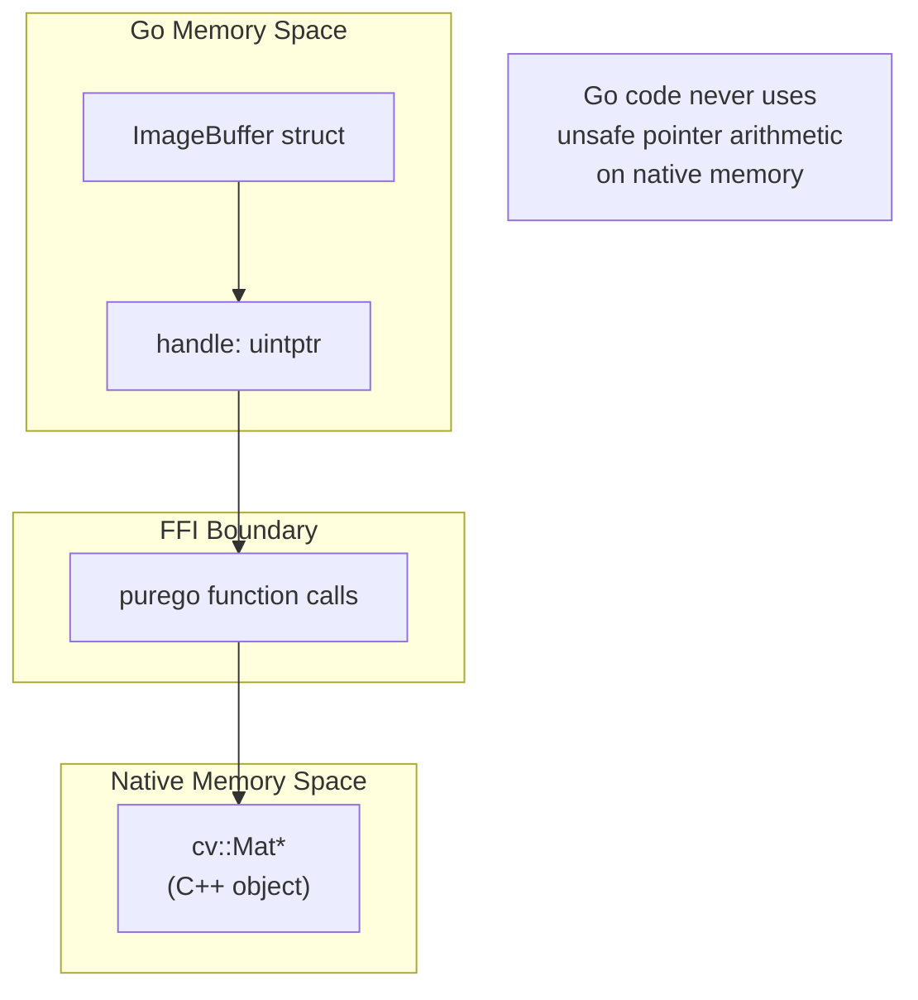

# Buffer and Data Exchange

Relevant source files

* [.github/workflows/test.yml](https://github.com/MaaXYZ/maa-framework-go/blob/5f9c965c/.github/workflows/test.yml)
* [.gitignore](https://github.com/MaaXYZ/maa-framework-go/blob/5f9c965c/.gitignore)
* [controller.go](https://github.com/MaaXYZ/maa-framework-go/blob/5f9c965c/controller.go)
* [internal/buffer/image\_buffer.go](https://github.com/MaaXYZ/maa-framework-go/blob/5f9c965c/internal/buffer/image_buffer.go)
* [internal/buffer/image\_buffer\_bench\_test.go](https://github.com/MaaXYZ/maa-framework-go/blob/5f9c965c/internal/buffer/image_buffer_bench_test.go)
* [internal/buffer/image\_buffer\_test.go](https://github.com/MaaXYZ/maa-framework-go/blob/5f9c965c/internal/buffer/image_buffer_test.go)
* [internal/buffer/image\_list\_buffer\_test.go](https://github.com/MaaXYZ/maa-framework-go/blob/5f9c965c/internal/buffer/image_list_buffer_test.go)
* [internal/native/framework.go](https://github.com/MaaXYZ/maa-framework-go/blob/5f9c965c/internal/native/framework.go)
* [test/classifier.onnx](https://github.com/MaaXYZ/maa-framework-go/blob/5f9c965c/test/classifier.onnx)

## Purpose and Scope

This document covers the buffer abstraction layer that manages data marshaling between Go and the native MaaFramework C/C++ library. Buffers provide type-safe wrappers around native memory handles and perform necessary format conversions when exchanging data across the FFI boundary.

For information about the underlying FFI integration mechanism, see [Native FFI Integration](/MaaXYZ/maa-framework-go/7.1-native-ffi-integration). For callback data passing, see [Callback and FFI Bridge Architecture](/MaaXYZ/maa-framework-go/7.3-callback-and-ffi-bridge-architecture).

**Sources:** [internal/buffer/image\_buffer.go1-134](https://github.com/MaaXYZ/maa-framework-go/blob/5f9c965c/internal/buffer/image_buffer.go#L1-L134) [internal/buffer/rect\_buffer.go1-59](https://github.com/MaaXYZ/maa-framework-go/blob/5f9c965c/internal/buffer/rect_buffer.go#L1-L59) [internal/native/framework.go234-283](https://github.com/MaaXYZ/maa-framework-go/blob/5f9c965c/internal/native/framework.go#L234-L283)

---

## Buffer Architecture

The buffer system provides a clean abstraction layer between idiomatic Go data types and native C/C++ memory structures. Each buffer type encapsulates a native handle (`uintptr`) and provides methods to convert between Go and native representations.



**Sources:** [internal/buffer/image\_buffer.go12-24](https://github.com/MaaXYZ/maa-framework-go/blob/5f9c965c/internal/buffer/image_buffer.go#L12-L24) [internal/buffer/rect\_buffer.go8-20](https://github.com/MaaXYZ/maa-framework-go/blob/5f9c965c/internal/buffer/rect_buffer.go#L8-L20) [internal/native/framework.go234-283](https://github.com/MaaXYZ/maa-framework-go/blob/5f9c965c/internal/native/framework.go#L234-L283)

---

## Buffer Types

### ImageBuffer

`ImageBuffer` provides conversion between Go's `image.Image` type and the native OpenCV `cv::Mat` format used by MaaFramework. The key operation is color channel reordering: Go uses RGBA format while OpenCV uses BGR.

**Core Methods:**

| Method | Description |
| --- | --- |
| `NewImageBuffer()` | Creates a new buffer, calls `MaaImageBufferCreate()` |
| `Destroy()` | Releases native memory, calls `MaaImageBufferDestroy()` |
| `Get()` | Retrieves image as `image.Image`, converts BGR→RGBA |
| `Set(img image.Image)` | Stores image, converts RGBA→BGR |
| `IsEmpty()` | Checks if buffer contains data |
| `Clear()` | Clears buffer contents |
| `Handle()` | Returns underlying `uintptr` handle |

**Color Conversion Algorithm:**

The `Get()` method [internal/buffer/image\_buffer.go49-69](https://github.com/MaaXYZ/maa-framework-go/blob/5f9c965c/internal/buffer/image_buffer.go#L49-L69) performs BGR→RGBA conversion:

```
For each pixel (x, y):
  offset = (y * width + x) * 3
  R = raw[offset + 2]  // OpenCV stores as BGR
  G = raw[offset + 1]
  B = raw[offset + 0]
  A = 255
```

The `Set()` method [internal/buffer/image\_buffer.go72-97](https://github.com/MaaXYZ/maa-framework-go/blob/5f9c965c/internal/buffer/image_buffer.go#L72-L97) performs the inverse RGBA→BGR conversion:

```
For each pixel (x, y):
  Extract R, G, B from NRGBA.Pix
  Store as: B, G, R (3 bytes per pixel)
  imageType = 16  // CV_8UC3 (8-bit unsigned, 3 channels)
```

**Sources:** [internal/buffer/image\_buffer.go12-134](https://github.com/MaaXYZ/maa-framework-go/blob/5f9c965c/internal/buffer/image_buffer.go#L12-L134) [internal/native/framework.go253-264](https://github.com/MaaXYZ/maa-framework-go/blob/5f9c965c/internal/native/framework.go#L253-L264)

---

### RectBuffer

`RectBuffer` wraps the native `MaaRect` structure and handles conversion between Go's `int`-based `Rect` type and the native `int32`-based representation.

**Core Methods:**

| Method | Description |
| --- | --- |
| `NewRectBuffer()` | Creates a new buffer, calls `MaaRectCreate()` |
| `Destroy()` | Releases native memory, calls `MaaRectDestroy()` |
| `Get()` | Returns `Rect` with int32→int conversion |
| `Set(rect Rect)` | Stores rectangle with int→int32 conversion |
| `GetX()`, `GetY()`, `GetW()`, `GetH()` | Individual component access as `int32` |
| `Handle()` | Returns underlying `uintptr` handle |

**Type Conversion:**

The `Rect` type [internal/rect/rect.go3-21](https://github.com/MaaXYZ/maa-framework-go/blob/5f9c965c/internal/rect/rect.go#L3-L21) is defined as `[4]int` representing `[X, Y, Width, Height]`. The buffer performs conversions:

* **Set:** `int` → `int32` via `int32(rect.X())` [internal/buffer/rect\_buffer.go56-58](https://github.com/MaaXYZ/maa-framework-go/blob/5f9c965c/internal/buffer/rect_buffer.go#L56-L58)
* **Get:** `int32` → `int` via `int(r.GetX())` [internal/buffer/rect\_buffer.go36-38](https://github.com/MaaXYZ/maa-framework-go/blob/5f9c965c/internal/buffer/rect_buffer.go#L36-L38)

**Sources:** [internal/buffer/rect\_buffer.go8-59](https://github.com/MaaXYZ/maa-framework-go/blob/5f9c965c/internal/buffer/rect_buffer.go#L8-L59) [internal/rect/rect.go3-21](https://github.com/MaaXYZ/maa-framework-go/blob/5f9c965c/internal/rect/rect.go#L3-L21) [internal/native/framework.go276-283](https://github.com/MaaXYZ/maa-framework-go/blob/5f9c965c/internal/native/framework.go#L276-L283)

---

### StringBuffer

`StringBuffer` in [internal/buffer/string\_buffer.go1-57](https://github.com/MaaXYZ/maa-framework-go/blob/5f9c965c/internal/buffer/string_buffer.go#L1-L57) provides string exchange between Go and native code.

| Go Method | Native FFI | Purpose |
| --- | --- | --- |
| `NewStringBuffer()` | `MaaStringBufferCreate` | Allocates native string buffer |
| `NewStringBufferByHandle(handle)` | — | Wraps an existing native handle (no ownership) |
| `Destroy()` | `MaaStringBufferDestroy` | Frees native memory |
| `Handle()` | — | Returns the underlying `uintptr` handle |
| `Get()` | `MaaStringBufferGet` | Returns buffer content as a Go `string` |
| `Set(str)` | `MaaStringBufferSet` | Copies a Go `string` to the native buffer |
| `SetWithSize(str, size)` | `MaaStringBufferSetEx` | Copies with an explicit byte length |
| `Size()` | `MaaStringBufferSize` | Returns byte length as `uint64` |
| `IsEmpty()` | `MaaStringBufferIsEmpty` | Checks for empty content |
| `Clear()` | `MaaStringBufferClear` | Clears buffer contents |

**Sources:** [internal/buffer/string\_buffer.go1-57](https://github.com/MaaXYZ/maa-framework-go/blob/5f9c965c/internal/buffer/string_buffer.go#L1-L57) [internal/native/framework.go235-243](https://github.com/MaaXYZ/maa-framework-go/blob/5f9c965c/internal/native/framework.go#L235-L243)

---

### StringListBuffer

`StringListBuffer` in [internal/buffer/string\_list\_buffer.go1-68](https://github.com/MaaXYZ/maa-framework-go/blob/5f9c965c/internal/buffer/string_list_buffer.go#L1-L68) manages arrays of strings, mapping to native `std::vector<std::string>`. The `Get()` and `GetAll()` methods wrap element handles in a transient `StringBuffer` to extract Go strings.

| Go Method | Native FFI | Purpose |
| --- | --- | --- |
| `NewStringListBuffer()` | `MaaStringListBufferCreate` | Allocates native list buffer |
| `NewStringListBufferByHandle(handle)` | — | Wraps an existing native handle |
| `Destroy()` | `MaaStringListBufferDestroy` | Frees native memory |
| `Handle()` | — | Returns the underlying `uintptr` handle |
| `Size()` | `MaaStringListBufferSize` | Returns element count as `uint64` |
| `IsEmpty()` | `MaaStringListBufferIsEmpty` | Checks for empty list |
| `Get(index)` | `MaaStringListBufferAt` | Returns `string` at index |
| `GetAll()` | — | Returns all elements as `[]string` |
| `Append(value *StringBuffer)` | `MaaStringListBufferAppend` | Appends a `StringBuffer`'s handle |
| `Remove(index)` | `MaaStringListBufferRemove` | Removes element at index |
| `Clear()` | `MaaStringListBufferClear` | Clears all elements |

**Sources:** [internal/buffer/string\_list\_buffer.go1-68](https://github.com/MaaXYZ/maa-framework-go/blob/5f9c965c/internal/buffer/string_list_buffer.go#L1-L68) [internal/native/framework.go245-252](https://github.com/MaaXYZ/maa-framework-go/blob/5f9c965c/internal/native/framework.go#L245-L252)

---

## Type Conversion Summary

The buffer layer performs these conversions when crossing the Go/native boundary:

| Go Type | Buffer Type | Native Type | Conversion |
| --- | --- | --- | --- |
| `image.Image` | `ImageBuffer` | `cv::Mat` (BGR) | Channel reorder: RGBA ↔ BGR |
| `Rect` (`[4]int`) | `RectBuffer` | `MaaRect` (4× `int32`) | Width conversion: `int` ↔ `int32` |
| `string` | `StringBuffer` | `std::string` | C string handling via purego |
| `[]string` | `StringListBuffer` | `std::vector<std::string>` | Element-wise buffer handles |

**Rationale for Conversions:**

* **RGBA ↔ BGR:** OpenCV uses BGR ordering, while Go's `image` package uses RGBA. This is the most common image format in Go's standard library.
* **int ↔ int32:** Go's `int` is platform-dependent (32/64-bit), while the C API explicitly uses `int32_t`. The binding normalizes to Go's `int` for ergonomics.

**Sources:** [internal/buffer/image\_buffer.go49-97](https://github.com/MaaXYZ/maa-framework-go/blob/5f9c965c/internal/buffer/image_buffer.go#L49-L97) [internal/buffer/rect\_buffer.go36-58](https://github.com/MaaXYZ/maa-framework-go/blob/5f9c965c/internal/buffer/rect_buffer.go#L36-L58)

---

## Memory Management Lifecycle

All buffers follow the RAII-style **create-use-destroy** pattern to prevent memory leaks. Native objects are never garbage-collected by Go's runtime.

```mermaid
sequenceDiagram
  participant Application Code
  participant Buffer Wrapper
  participant (Go)
  participant Native FFI
  participant Native Memory
  participant (C++)

  Application Code->>Buffer Wrapper: "NewImageBuffer()"
  Buffer Wrapper->>Native FFI: "MaaImageBufferCreate()"
  Native FFI->>Native Memory: "new cv::Mat"
  Native Memory-->>Native FFI: "native handle"
  Native FFI-->>Buffer Wrapper: "uintptr handle"
  Buffer Wrapper-->>Application Code: "*ImageBuffer"
  note over Application Code,(C++): Buffer is ready for use
  Application Code->>Buffer Wrapper: "Set(img)"
  Buffer Wrapper->>Buffer Wrapper: "RGBA→BGR conversion"
  Buffer Wrapper->>Native FFI: "MaaImageBufferSetRawData()"
  Native FFI->>Native Memory: "copy data to cv::Mat"
  Application Code->>Buffer Wrapper: "Get()"
  Buffer Wrapper->>Native FFI: "MaaImageBufferGetRawData()"
  Native FFI->>Native Memory: "access cv::Mat data"
  Native Memory-->>Native FFI: "raw pointer"
  Native FFI-->>Buffer Wrapper: "unsafe.Pointer"
  Buffer Wrapper->>Buffer Wrapper: "BGR→RGBA conversion"
  Buffer Wrapper-->>Application Code: "image.Image"
  note over Application Code,(C++): Must cleanup when done
  Application Code->>Buffer Wrapper: "Destroy()"
  Buffer Wrapper->>Native FFI: "MaaImageBufferDestroy()"
  Native FFI->>Native Memory: "delete cv::Mat"
  Native Memory-->>Native FFI: "freed"
```

**Best Practice:** Call `Destroy()` using `defer` immediately after successful creation. This ensures cleanup regardless of how the function exits. This pattern is demonstrated in [internal/buffer/rect\_buffer\_test.go22-26](https://github.com/MaaXYZ/maa-framework-go/blob/5f9c965c/internal/buffer/rect_buffer_test.go#L22-L26)

**Sources:** [internal/buffer/image\_buffer.go16-34](https://github.com/MaaXYZ/maa-framework-go/blob/5f9c965c/internal/buffer/image_buffer.go#L16-L34) [internal/buffer/rect\_buffer.go12-30](https://github.com/MaaXYZ/maa-framework-go/blob/5f9c965c/internal/buffer/rect_buffer.go#L12-L30) [internal/buffer/rect\_buffer\_test.go16-26](https://github.com/MaaXYZ/maa-framework-go/blob/5f9c965c/internal/buffer/rect_buffer_test.go#L16-L26)

---

## Handle System

Buffers encapsulate native memory as opaque `uintptr` handles. The Go binding never dereferences native pointers directly; all access goes through FFI function calls.



**Key Properties:**

1. **Opaque References:** The `uintptr` value is meaningless to Go; it's only valid when passed to native functions
2. **No Direct Access:** Go code never uses `unsafe.Pointer` arithmetic on native memory
3. **FFI-Only Operations:** All data access requires FFI function calls (e.g., `MaaImageBufferGetRawData()`)
4. **Type Safety:** The buffer wrapper types prevent misuse of handles

**Handle Access:**

Every buffer exposes its handle via a `Handle()` method [internal/buffer/image\_buffer.go36-38](https://github.com/MaaXYZ/maa-framework-go/blob/5f9c965c/internal/buffer/image_buffer.go#L36-L38) which returns the underlying `uintptr`. This is used when passing buffers to FFI functions or other framework components.

**Sources:** [internal/buffer/image\_buffer.go12-38](https://github.com/MaaXYZ/maa-framework-go/blob/5f9c965c/internal/buffer/image_buffer.go#L12-L38) [internal/buffer/rect\_buffer.go8-34](https://github.com/MaaXYZ/maa-framework-go/blob/5f9c965c/internal/buffer/rect_buffer.go#L8-L34)

---

## Common Usage Patterns

### Pattern 1: Creating and Populating an ImageBuffer

Call `NewImageBuffer()` to allocate a buffer, then `defer Destroy()` to ensure cleanup. Load an `image.Image` using Go's standard library and pass it to `Set()` — the RGBA→BGR channel swap happens automatically inside [internal/buffer/image\_buffer.go72-97](https://github.com/MaaXYZ/maa-framework-go/blob/5f9c965c/internal/buffer/image_buffer.go#L72-L97) Pass the buffer's `Handle()` to any native function that expects an image handle (such as `MaaControllerCachedImage`).

**Sources:** [internal/buffer/image\_buffer.go16-97](https://github.com/MaaXYZ/maa-framework-go/blob/5f9c965c/internal/buffer/image_buffer.go#L16-L97)

---

### Pattern 2: Reading Data from Native into Go

Create an empty `RectBuffer` and pass its `Handle()` as an out-parameter to a native function such as `MaaTaskerGetRecognitionDetail` ([internal/native/framework.go46](https://github.com/MaaXYZ/maa-framework-go/blob/5f9c965c/internal/native/framework.go#L46-L46)). The native layer writes into the buffer; call `Get()` afterward to retrieve a `rect.Rect` with automatic `int32`→`int` conversion [internal/buffer/rect\_buffer.go36-38](https://github.com/MaaXYZ/maa-framework-go/blob/5f9c965c/internal/buffer/rect_buffer.go#L36-L38)

**Sources:** [internal/buffer/rect\_buffer.go36-58](https://github.com/MaaXYZ/maa-framework-go/blob/5f9c965c/internal/buffer/rect_buffer.go#L36-L58) [internal/native/framework.go46](https://github.com/MaaXYZ/maa-framework-go/blob/5f9c965c/internal/native/framework.go#L46-L46)

---

### Pattern 3: RectBuffer Round-Trip (Test Example)

The test at [internal/buffer/rect\_buffer\_test.go28-46](https://github.com/MaaXYZ/maa-framework-go/blob/5f9c965c/internal/buffer/rect_buffer_test.go#L28-L46) demonstrates the full round-trip: a `rect.Rect` (with `int` fields) is written to a `RectBuffer` via `Set()`, and read back either as individual `int32` components via `GetX()`, `GetY()`, `GetW()`, `GetH()`, or as a complete `rect.Rect` via `Get()` (which applies `int32`→`int` conversion). The test asserts that the round-trip is lossless.

**Sources:** [internal/buffer/rect\_buffer\_test.go28-46](https://github.com/MaaXYZ/maa-framework-go/blob/5f9c965c/internal/buffer/rect_buffer_test.go#L28-L46)

---

### Pattern 4: Passing Buffer Handles to Custom Callbacks

The `MaaCustomRecognitionCallback` type at [internal/native/framework.go54](https://github.com/MaaXYZ/maa-framework-go/blob/5f9c965c/internal/native/framework.go#L54-L54) passes image (`image`), region of interest (`roi`), and output parameters (`outBox`, `outDetail`) as raw `uintptr` handles. Inside a callback implementation, wrap incoming handles with `NewImageBufferByHandle()` or `NewRectBufferByHandle()` — do **not** call `Destroy()` on these wrappers, because the native layer owns those allocations. For output handles, similarly wrap with `NewRectBufferByHandle()` or `NewStringBufferByHandle()` and call `Set()` to write results back through the FFI boundary.

**Sources:** [internal/native/framework.go54-56](https://github.com/MaaXYZ/maa-framework-go/blob/5f9c965c/internal/native/framework.go#L54-L56) [internal/buffer/image\_buffer.go26-30](https://github.com/MaaXYZ/maa-framework-go/blob/5f9c965c/internal/buffer/image_buffer.go#L26-L30) [internal/buffer/rect\_buffer.go22-26](https://github.com/MaaXYZ/maa-framework-go/blob/5f9c965c/internal/buffer/rect_buffer.go#L22-L26)

---

## Buffer FFI Function Reference

### ImageBuffer Functions

| Function | Signature | Purpose |
| --- | --- | --- |
| `MaaImageBufferCreate` | `() uintptr` | Allocates native cv::Mat |
| `MaaImageBufferDestroy` | `(handle uintptr)` | Frees native memory |
| `MaaImageBufferGetRawData` | `(handle uintptr) unsafe.Pointer` | Returns raw pixel data pointer |
| `MaaImageBufferSetRawData` | `(handle uintptr, data unsafe.Pointer, w, h, type int32) bool` | Copies pixel data to native |
| `MaaImageBufferWidth` | `(handle uintptr) int32` | Returns image width |
| `MaaImageBufferHeight` | `(handle uintptr) int32` | Returns image height |
| `MaaImageBufferChannels` | `(handle uintptr) int32` | Returns channel count (typically 3 for BGR) |
| `MaaImageBufferType` | `(handle uintptr) int32` | Returns OpenCV type code (16 = CV\_8UC3) |
| `MaaImageBufferIsEmpty` | `(handle uintptr) bool` | Checks if buffer is empty |
| `MaaImageBufferClear` | `(handle uintptr) bool` | Clears buffer contents |

**Note:** Encoded image functions (`MaaImageBufferGetEncoded`, `MaaImageBufferSetEncoded`) are intentionally not bound. Go's standard library (`image/png`, `image/jpeg`) handles encoding/decoding natively [internal/buffer/image\_buffer.go131-133](https://github.com/MaaXYZ/maa-framework-go/blob/5f9c965c/internal/buffer/image_buffer.go#L131-L133)

**Sources:** [internal/native/framework.go253-264](https://github.com/MaaXYZ/maa-framework-go/blob/5f9c965c/internal/native/framework.go#L253-L264) [internal/buffer/image\_buffer.go99-129](https://github.com/MaaXYZ/maa-framework-go/blob/5f9c965c/internal/buffer/image_buffer.go#L99-L129)

---

### RectBuffer Functions

| Function | Signature | Purpose |
| --- | --- | --- |
| `MaaRectCreate` | `() uintptr` | Allocates native MaaRect |
| `MaaRectDestroy` | `(handle uintptr)` | Frees native memory |
| `MaaRectGetX` | `(handle uintptr) int32` | Returns X coordinate |
| `MaaRectGetY` | `(handle uintptr) int32` | Returns Y coordinate |
| `MaaRectGetW` | `(handle uintptr) int32` | Returns width |
| `MaaRectGetH` | `(handle uintptr) int32` | Returns height |
| `MaaRectSet` | `(handle uintptr, x, y, w, h int32) bool` | Sets all four values |

**Sources:** [internal/native/framework.go276-283](https://github.com/MaaXYZ/maa-framework-go/blob/5f9c965c/internal/native/framework.go#L276-L283) [internal/buffer/rect\_buffer.go28-58](https://github.com/MaaXYZ/maa-framework-go/blob/5f9c965c/internal/buffer/rect_buffer.go#L28-L58)

---

### StringBuffer and StringListBuffer Functions

**StringBuffer:**

| Function | Signature | Purpose |
| --- | --- | --- |
| `MaaStringBufferCreate` | `() uintptr` | Allocates native std::string |
| `MaaStringBufferDestroy` | `(handle uintptr)` | Frees native memory |
| `MaaStringBufferGet` | `(handle uintptr) string` | Returns Go string copy |
| `MaaStringBufferSet` | `(handle uintptr, str string) bool` | Copies string to native |
| `MaaStringBufferSize` | `(handle uintptr) uint64` | Returns byte length |
| `MaaStringBufferIsEmpty` | `(handle uintptr) bool` | Checks for empty |
| `MaaStringBufferClear` | `(handle uintptr) bool` | Clears contents |

**StringListBuffer:**

| Function | Signature | Purpose |
| --- | --- | --- |
| `MaaStringListBufferCreate` | `() uintptr` | Allocates native std::vectorstd::string |
| `MaaStringListBufferDestroy` | `(handle uintptr)` | Frees native memory |
| `MaaStringListBufferAt` | `(handle uintptr, index uint64) uintptr` | Returns StringBuffer handle at index |
| `MaaStringListBufferAppend` | `(handle uintptr, value uintptr) bool` | Appends StringBuffer handle |
| `MaaStringListBufferRemove` | `(handle uintptr, index uint64) bool` | Removes element |
| `MaaStringListBufferSize` | `(handle uintptr) uint64` | Returns element count |
| `MaaStringListBufferIsEmpty` | `(handle uintptr) bool` | Checks for empty |
| `MaaStringListBufferClear` | `(handle uintptr) bool` | Clears all elements |

**Sources:** [internal/native/framework.go235-251](https://github.com/MaaXYZ/maa-framework-go/blob/5f9c965c/internal/native/framework.go#L235-L251)

---

## ImageListBuffer

While not commonly used in Go bindings, `ImageListBuffer` is available for managing arrays of images (native `std::vector<cv::Mat>`):

| Function | Purpose |
| --- | --- |
| `MaaImageListBufferCreate()` | Allocates native vector |
| `MaaImageListBufferAt(handle, index)` | Returns ImageBuffer handle at index |
| `MaaImageListBufferAppend(handle, imageHandle)` | Appends ImageBuffer handle |
| `MaaImageListBufferSize(handle)` | Returns image count |

**Sources:** [internal/native/framework.go267-274](https://github.com/MaaXYZ/maa-framework-go/blob/5f9c965c/internal/native/framework.go#L267-L274)