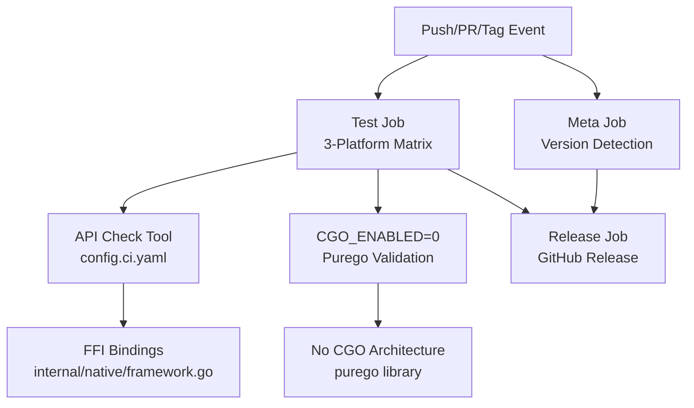
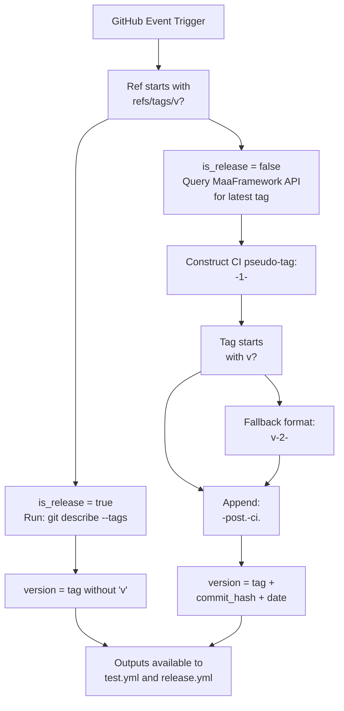
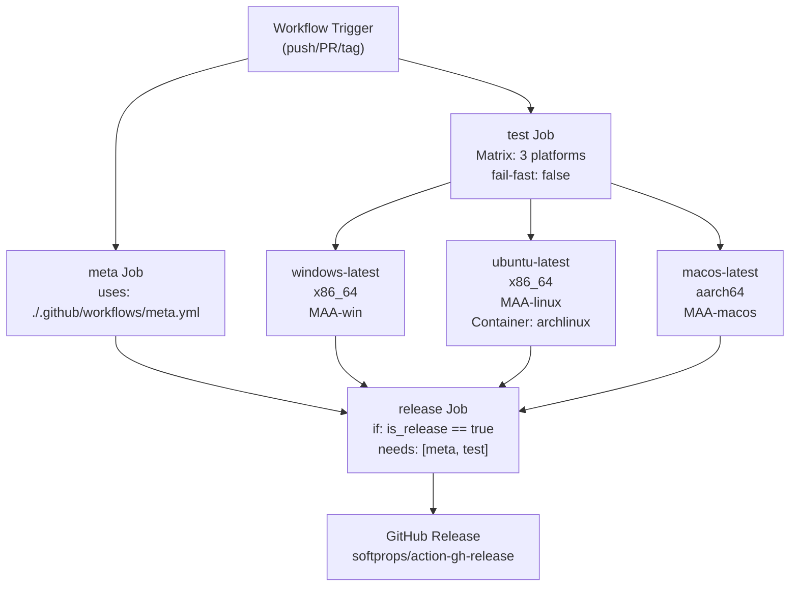
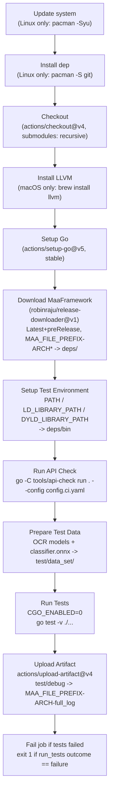
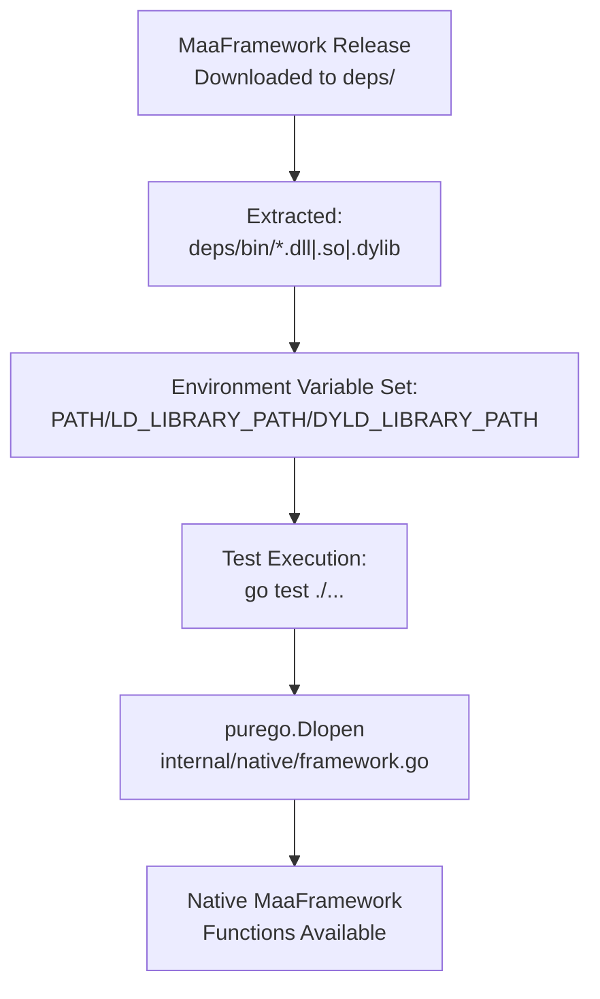
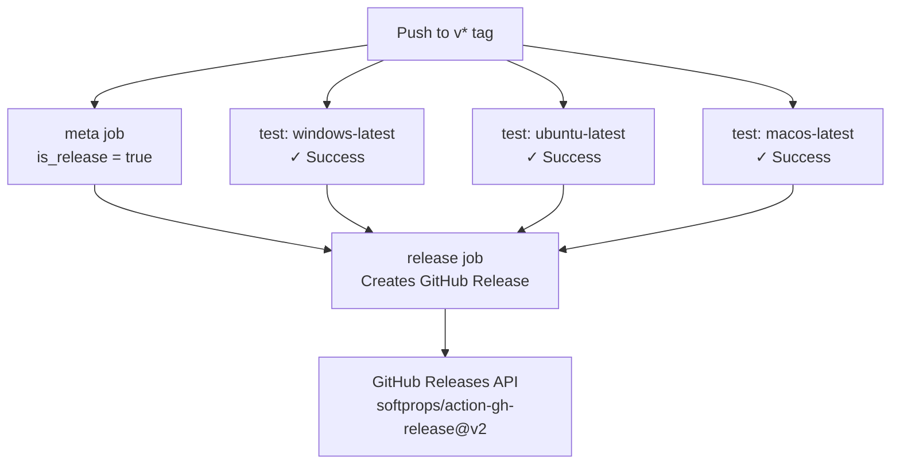

# CI/CD Pipeline

Relevant source files

* [.github/workflows/test.yml](https://github.com/MaaXYZ/maa-framework-go/blob/5f9c965c/.github/workflows/test.yml)
* [.gitignore](https://github.com/MaaXYZ/maa-framework-go/blob/5f9c965c/.gitignore)
* [README.md](https://github.com/MaaXYZ/maa-framework-go/blob/5f9c965c/README.md?plain=1)
* [README\_zh.md](https://github.com/MaaXYZ/maa-framework-go/blob/5f9c965c/README_zh.md?plain=1)
* [examples/custom-action/main.go](https://github.com/MaaXYZ/maa-framework-go/blob/5f9c965c/examples/custom-action/main.go)
* [examples/quick-start/main.go](https://github.com/MaaXYZ/maa-framework-go/blob/5f9c965c/examples/quick-start/main.go)
* [test/classifier.onnx](https://github.com/MaaXYZ/maa-framework-go/blob/5f9c965c/test/classifier.onnx)

The `maa-framework-go` CI/CD system validates cross-platform compatibility, ensures API consistency with the native MaaFramework library, and automates release creation. The pipeline verifies the core design principle of "No CGO Required" by running all tests with `CGO_ENABLED=0`, confirming that the purego-based FFI integration works correctly on Windows, Linux, and macOS.

**Related Documentation:**

* For test utilities and debug controllers used by CI: see [Testing Utilities](/MaaXYZ/maa-framework-go/8.1-testing-utilities)
* For FFI architecture verified by CI: see [Native FFI Integration](/MaaXYZ/maa-framework-go/7.1-native-ffi-integration)
* For test patterns exercised by the pipeline: see [Test Examples and Patterns](/MaaXYZ/maa-framework-go/8.3-test-examples-and-patterns)

---

## Overview

The CI/CD system consists of two workflow files:

| File | Type | Purpose |
| --- | --- | --- |
| `.github/workflows/meta.yml` | Reusable workflow | Computes `is_release`, `tag`, and `version` outputs |
| `.github/workflows/test.yml` | Main workflow | Matrix testing, API validation, artifact collection, conditional release |

**Key Validation Points:**



Sources: [.github/workflows/test.yml1-141](https://github.com/MaaXYZ/maa-framework-go/blob/5f9c965c/.github/workflows/test.yml#L1-L141)

---

## Meta Workflow — Version and Tag Determination

The `.github/workflows/meta.yml` reusable workflow is invoked by the `test.yml` main workflow [.github/workflows/test.yml24](https://github.com/MaaXYZ/maa-framework-go/blob/5f9c965c/.github/workflows/test.yml#L24-L24) It determines whether the current run represents a release build and computes semantic version strings.

**Outputs:**

| Output | Type | Example Value | Usage |
| --- | --- | --- | --- |
| `is_release` | bool string | `"true"` / `"false"` | Controls whether `release` job executes |
| `tag` | string | `v1.7.0` or `v1.7.0-post.0512-ci.8678478007` | Used as Git tag for release |
| `version` | string | `1.7.0` or `1.7.0-post.0512-ci.8678478007+gf5e12a1c.20240413` | Semantic version string |

### Tag Resolution Logic

**Diagram: meta.yml Tag Resolution Flow**



**Pre-release Detection:** The `release` job determines if a release is a pre-release by checking for `-alpha`, `-beta`, or `-rc` in the tag string [.github/workflows/test.yml141](https://github.com/MaaXYZ/maa-framework-go/blob/5f9c965c/.github/workflows/test.yml#L141-L141)

Sources: [.github/workflows/test.yml24](https://github.com/MaaXYZ/maa-framework-go/blob/5f9c965c/.github/workflows/test.yml#L24-L24) [.github/workflows/test.yml141](https://github.com/MaaXYZ/maa-framework-go/blob/5f9c965c/.github/workflows/test.yml#L141-L141)

---

## Test Workflow — Main Pipeline

### Trigger Conditions

The workflow executes on the following events [.github/workflows/test.yml3-20](https://github.com/MaaXYZ/maa-framework-go/blob/5f9c965c/.github/workflows/test.yml#L3-L20):

| Event Type | Branches | Excluded Paths | Tags |
| --- | --- | --- | --- |
| `push` | All branches | `README.md`, `README_zh.md` | `v*` |
| `pull_request` | All branches | `README.md`, `README_zh.md` | N/A |
| `workflow_dispatch` | Manual trigger | N/A | N/A |

### Job Dependency Graph

The workflow contains three jobs with the following dependencies:

**Diagram: Job Execution Flow**



**Key Characteristics:**

* `fail-fast: false` ensures all platform tests complete even if one fails [.github/workflows/test.yml44](https://github.com/MaaXYZ/maa-framework-go/blob/5f9c965c/.github/workflows/test.yml#L44-L44)
* `release` job only executes when `meta.outputs.is_release == 'true'` [.github/workflows/test.yml132](https://github.com/MaaXYZ/maa-framework-go/blob/5f9c965c/.github/workflows/test.yml#L132-L132)
* Release requires successful completion of all test matrix legs [.github/workflows/test.yml133](https://github.com/MaaXYZ/maa-framework-go/blob/5f9c965c/.github/workflows/test.yml#L133-L133)

Sources: [.github/workflows/test.yml3-20](https://github.com/MaaXYZ/maa-framework-go/blob/5f9c965c/.github/workflows/test.yml#L3-L20) [.github/workflows/test.yml22-44](https://github.com/MaaXYZ/maa-framework-go/blob/5f9c965c/.github/workflows/test.yml#L22-L44) [.github/workflows/test.yml131-133](https://github.com/MaaXYZ/maa-framework-go/blob/5f9c965c/.github/workflows/test.yml#L131-L133)

---

## Platform Matrix Configuration

The `test` job uses a matrix strategy to validate compatibility across operating systems and architectures [.github/workflows/test.yml29-44](https://github.com/MaaXYZ/maa-framework-go/blob/5f9c965c/.github/workflows/test.yml#L29-L44):

| OS | Architecture | MaaFramework Binary Prefix | Container | Notes |
| --- | --- | --- | --- | --- |
| `windows-latest` | `x86_64` | `MAA-win` | *(none)* | Native Windows runner |
| `ubuntu-latest` | `x86_64` | `MAA-linux` | `archlinux:base-devel` | All steps execute in container |
| `macos-latest` | `aarch64` | `MAA-macos` | *(none)* | Apple Silicon (M1/M2) |

**Container Usage:** The Linux configuration uses `container: archlinux:base-devel` [.github/workflows/test.yml39](https://github.com/MaaXYZ/maa-framework-go/blob/5f9c965c/.github/workflows/test.yml#L39-L39) This means:

* GitHub provides an `ubuntu-latest` host for infrastructure
* All job steps execute inside the Arch Linux container
* System updates and package installation use `pacman` [.github/workflows/test.yml50-59](https://github.com/MaaXYZ/maa-framework-go/blob/5f9c965c/.github/workflows/test.yml#L50-L59)

**Matrix Environment Variables:**

```
```
ARCH: ${{ matrix.arch }}              # Used in download filename


MAA_FILE_PREFIX: ${{ matrix.maa_prefix }}  # Used in download filename and artifact name
```
```

Sources: [.github/workflows/test.yml29-48](https://github.com/MaaXYZ/maa-framework-go/blob/5f9c965c/.github/workflows/test.yml#L29-L48)

---

### Step-by-Step Breakdown

**Diagram: test job step sequence (per matrix leg)**



Sources: [.github/workflows/test.yml49-129](https://github.com/MaaXYZ/maa-framework-go/blob/5f9c965c/.github/workflows/test.yml#L49-L129)

---

## Test Execution Steps

### 1. Environment Setup

Platform-specific setup occurs before checkout:

**Linux (Arch Container):**

```
```
pacman -Syu --noconfirm  # System update


pacman -S --noconfirm git  # Install Git
```
```

**macOS:**

```
```
brew install llvm  # LLVM toolchain
```
```

Sources: [.github/workflows/test.yml50-68](https://github.com/MaaXYZ/maa-framework-go/blob/5f9c965c/.github/workflows/test.yml#L50-L68)

### 2. Code Checkout and Go Setup

```
```
- uses: actions/checkout@v4


with:


submodules: recursive


- uses: actions/setup-go@v5


with:


go-version: 'stable'
```
```

Sources: [.github/workflows/test.yml62-73](https://github.com/MaaXYZ/maa-framework-go/blob/5f9c965c/.github/workflows/test.yml#L62-L73)

### 3. MaaFramework Dependency Download

The pipeline downloads the latest MaaFramework release (including pre-releases) using `robinraju/release-downloader@v1` [.github/workflows/test.yml75-83](https://github.com/MaaXYZ/maa-framework-go/blob/5f9c965c/.github/workflows/test.yml#L75-L83):

**Configuration:**

```
```
repository: MaaXYZ/MaaFramework


latest: true


preRelease: true


fileName: "${{ env.MAA_FILE_PREFIX }}-${{ env.ARCH }}*"


out-file-path: "deps"


extract: true
```
```

**Filename Resolution Examples:**

* Windows x86\_64: `MAA-win-x86_64-*.zip`
* Linux x86\_64: `MAA-linux-x86_64-*.tar.gz`
* macOS aarch64: `MAA-macos-aarch64-*.tar.gz`

The `deps/` directory is gitignored [.gitignore5](https://github.com/MaaXYZ/maa-framework-go/blob/5f9c965c/.gitignore#L5-L5)

### 4. Dynamic Library Path Configuration

After extraction, the workflow adds `deps/bin` to the OS-specific dynamic library search path [.github/workflows/test.yml85-98](https://github.com/MaaXYZ/maa-framework-go/blob/5f9c965c/.github/workflows/test.yml#L85-L98):

| Operating System | Environment Variable | Method | Shell |
| --- | --- | --- | --- |
| Windows | `PATH` | Append to `$env:GITHUB_PATH` | PowerShell |
| Linux | `LD_LIBRARY_PATH` | Set in `$GITHUB_ENV` | Bash |
| macOS | `DYLD_LIBRARY_PATH` | Set in `$GITHUB_ENV` | Bash |

**Purpose:** This enables `purego`'s dynamic library loading ([Native FFI Integration](/MaaXYZ/maa-framework-go/7.1-native-ffi-integration)) to locate MaaFramework shared libraries at runtime without requiring `WithLibDir()` option in test code.

**Diagram: Library Loading Path Resolution**



Sources: [.github/workflows/test.yml75-98](https://github.com/MaaXYZ/maa-framework-go/blob/5f9c965c/.github/workflows/test.yml#L75-L98) [.gitignore5](https://github.com/MaaXYZ/maa-framework-go/blob/5f9c965c/.gitignore#L5-L5)

### 5. API Compatibility Validation

The `api-check` tool validates FFI binding consistency [.github/workflows/test.yml100-102](https://github.com/MaaXYZ/maa-framework-go/blob/5f9c965c/.github/workflows/test.yml#L100-L102):

```
```
go -C tools/api-check run . --config config.ci.yaml
```
```

**Validation Scope:**

* Verifies Go function signatures match native MaaFramework API
* Checks that all `MaaXXX` functions registered via `purego.RegisterLibFunc` align with the downloaded release
* Prevents runtime FFI call failures due to signature mismatches

Sources: [.github/workflows/test.yml100-102](https://github.com/MaaXYZ/maa-framework-go/blob/5f9c965c/.github/workflows/test.yml#L100-L102)

### 6. Test Data Preparation

Model files required for recognition tests are staged into the test resource directory [.github/workflows/test.yml104-109](https://github.com/MaaXYZ/maa-framework-go/blob/5f9c965c/.github/workflows/test.yml#L104-L109):

| Destination Path | Source | Purpose |
| --- | --- | --- |
| `test/data_set/PipelineSmoking/resource/model/ocr/` | `test/data_set/MaaCommonAssets/OCR/ppocr_v4/zh_cn/*` | OCR recognition tests |
| `test/data_set/PipelineSmoking/resource/model/classify/` | `test/classifier.onnx` | Neural network classification tests |

**`test/classifier.onnx`** is a minimal ONNX model stub for validation [test/classifier.onnx1-13](https://github.com/MaaXYZ/maa-framework-go/blob/5f9c965c/test/classifier.onnx#L1-L13) It defines a dummy classifier with constant output for smoke testing the neural network inference pipeline.

Sources: [.github/workflows/test.yml104-109](https://github.com/MaaXYZ/maa-framework-go/blob/5f9c965c/.github/workflows/test.yml#L104-L109) [test/classifier.onnx1-13](https://github.com/MaaXYZ/maa-framework-go/blob/5f9c965c/test/classifier.onnx#L1-L13)

### 7. Test Execution with No CGO Validation

Tests execute with `CGO_ENABLED=0`, confirming the entire system operates without CGO dependencies [.github/workflows/test.yml111-117](https://github.com/MaaXYZ/maa-framework-go/blob/5f9c965c/.github/workflows/test.yml#L111-L117):

```
```
- name: Run Tests


id: run_tests


continue-on-error: true


env:


CGO_ENABLED: 0


run: |


go test -v ./...
```
```

**Key Design Validation:**

* Confirms `purego`-based FFI works correctly on all platforms
* Validates that no C dependencies are required at compile or runtime
* Tests the same code path users will experience in production

The `continue-on-error: true` setting ensures the artifact upload step always executes, even if tests fail. A subsequent step explicitly checks the outcome and fails the job if necessary [.github/workflows/test.yml125-129](https://github.com/MaaXYZ/maa-framework-go/blob/5f9c965c/.github/workflows/test.yml#L125-L129)

Sources: [.github/workflows/test.yml111-129](https://github.com/MaaXYZ/maa-framework-go/blob/5f9c965c/.github/workflows/test.yml#L111-L129)

### 8. Debug Artifact Collection

Debug logs are unconditionally uploaded for post-mortem analysis [.github/workflows/test.yml119-123](https://github.com/MaaXYZ/maa-framework-go/blob/5f9c965c/.github/workflows/test.yml#L119-L123):

```
```
- uses: actions/upload-artifact@v4


if: always()


with:


name: ${{ env.MAA_FILE_PREFIX }}-${{ env.ARCH }}-full_log


path: "test/debug"
```
```

**Artifact Names:**

* `MAA-win-x86_64-full_log`
* `MAA-linux-x86_64-full_log`
* `MAA-macos-aarch64-full_log`

The `test/debug/` directory is gitignored [.gitignore3](https://github.com/MaaXYZ/maa-framework-go/blob/5f9c965c/.gitignore#L3-L3) and contains framework-generated log files.

### 9. Test Result Enforcement

A final step ensures job failure if tests failed [.github/workflows/test.yml125-129](https://github.com/MaaXYZ/maa-framework-go/blob/5f9c965c/.github/workflows/test.yml#L125-L129):

```
```
- name: Fail job if tests failed


if: always() && steps.run_tests.outcome == 'failure'


run: |


echo "Tests failed. Check uploaded logs for details."


exit 1
```
```

This pattern allows artifacts to upload before marking the job as failed.

Sources: [.github/workflows/test.yml119-129](https://github.com/MaaXYZ/maa-framework-go/blob/5f9c965c/.github/workflows/test.yml#L119-L129) [.gitignore3](https://github.com/MaaXYZ/maa-framework-go/blob/5f9c965c/.gitignore#L3-L3)

---

## Release Job

The `release` job executes only when all conditions are met [.github/workflows/test.yml131-141](https://github.com/MaaXYZ/maa-framework-go/blob/5f9c965c/.github/workflows/test.yml#L131-L141):

1. `meta.outputs.is_release == 'true'` (workflow triggered by a `v*` tag)
2. `meta` job completed successfully
3. All `test` matrix legs completed successfully

**Configuration:**

```
```
release:


if: ${{ needs.meta.outputs.is_release == 'true' }}


needs: [meta, test]


runs-on: ubuntu-latest


steps:


- name: Release


uses: softprops/action-gh-release@v2


with:


tag_name: ${{ needs.meta.outputs.tag }}


prerelease: ${{ contains(needs.meta.outputs.tag, '-alpha') ||


contains(needs.meta.outputs.tag, '-beta') ||


contains(needs.meta.outputs.tag, '-rc') }}
```
```

**Pre-release Detection Logic:**

* Checks for `-alpha`, `-beta`, or `-rc` in tag string
* Example: `v1.7.0-beta.1` → `prerelease: true`
* Example: `v1.7.0` → `prerelease: false`

**Diagram: Release Job Conditions**



Sources: [.github/workflows/test.yml131-141](https://github.com/MaaXYZ/maa-framework-go/blob/5f9c965c/.github/workflows/test.yml#L131-L141)

---

## Environment Variable Reference

| Variable | Set in | Value |
| --- | --- | --- |
| `ARCH` | `test` job `env` | `matrix.arch` |
| `MAA_FILE_PREFIX` | `test` job `env` | `matrix.maa_prefix` |
| `CGO_ENABLED` | `Run Tests` step `env` | `0` |
| `LD_LIBRARY_PATH` | Linux env step | `deps/bin:$LD_LIBRARY_PATH` |
| `DYLD_LIBRARY_PATH` | macOS env step | `deps/bin:$DYLD_LIBRARY_PATH` |

Sources: [.github/workflows/test.yml45-48](https://github.com/MaaXYZ/maa-framework-go/blob/5f9c965c/.github/workflows/test.yml#L45-L48) [.github/workflows/test.yml85-117](https://github.com/MaaXYZ/maa-framework-go/blob/5f9c965c/.github/workflows/test.yml#L85-L117)