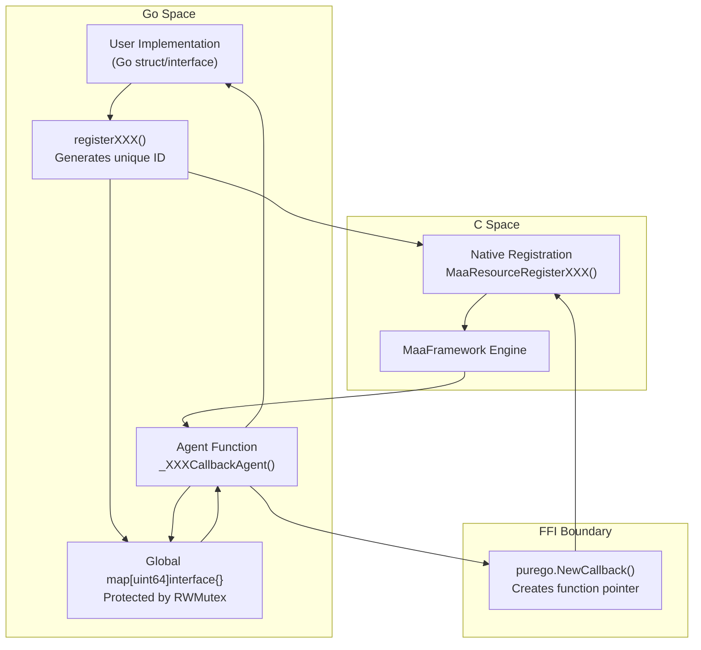
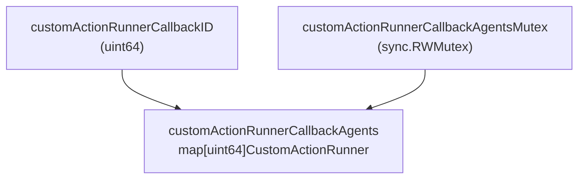
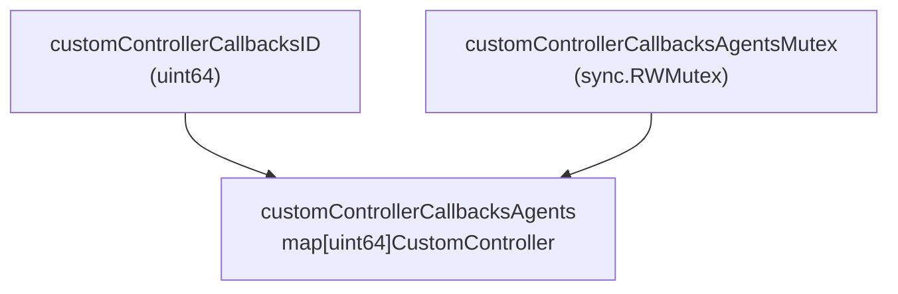
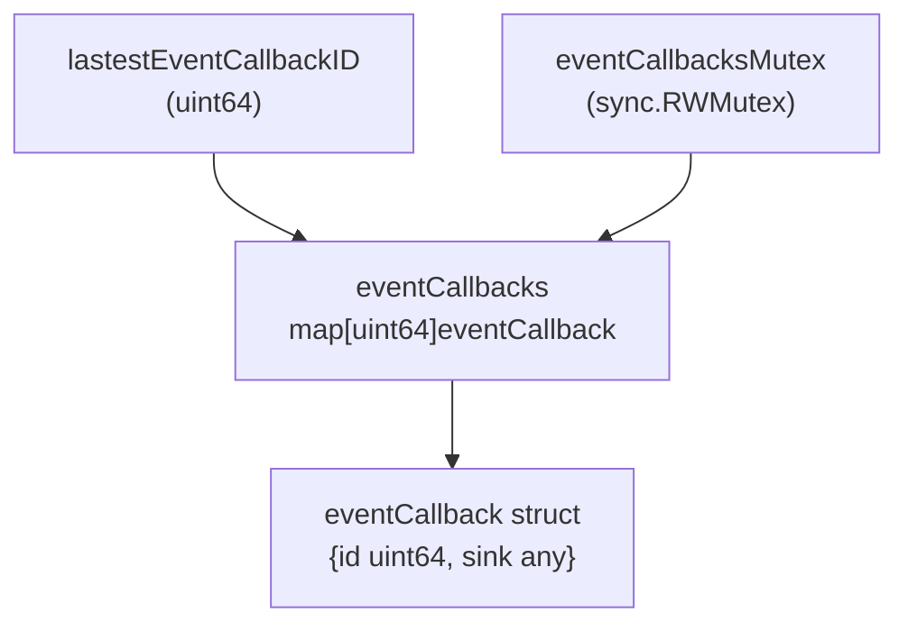
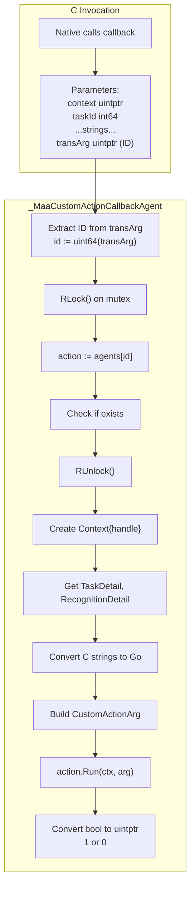
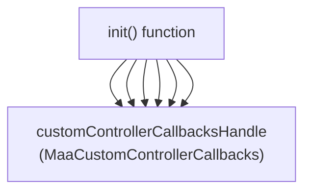
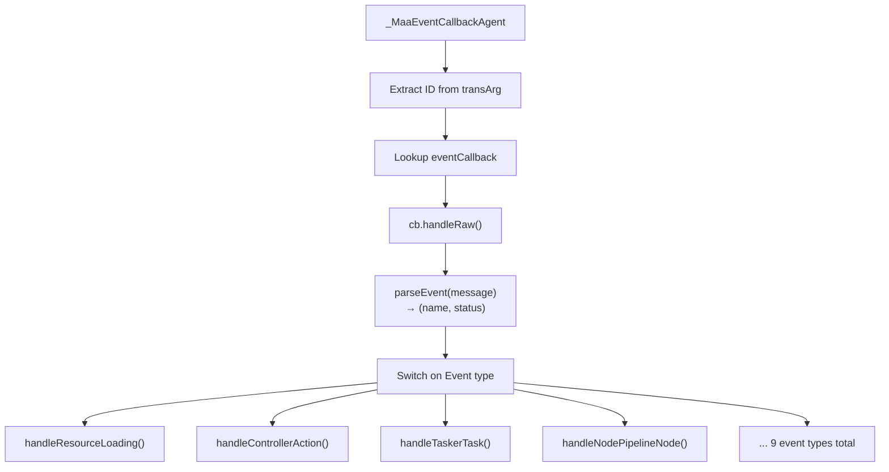
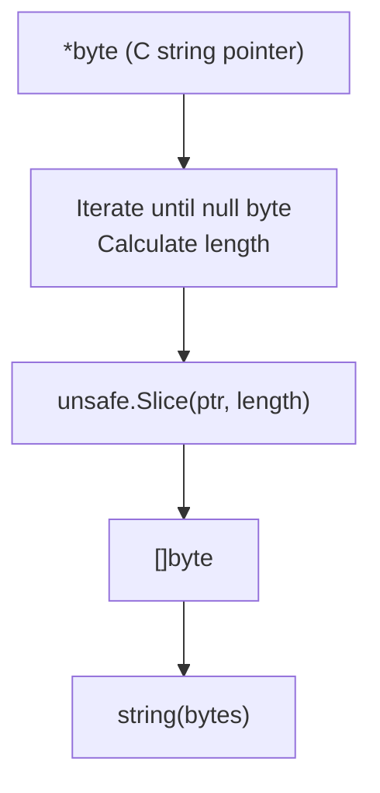
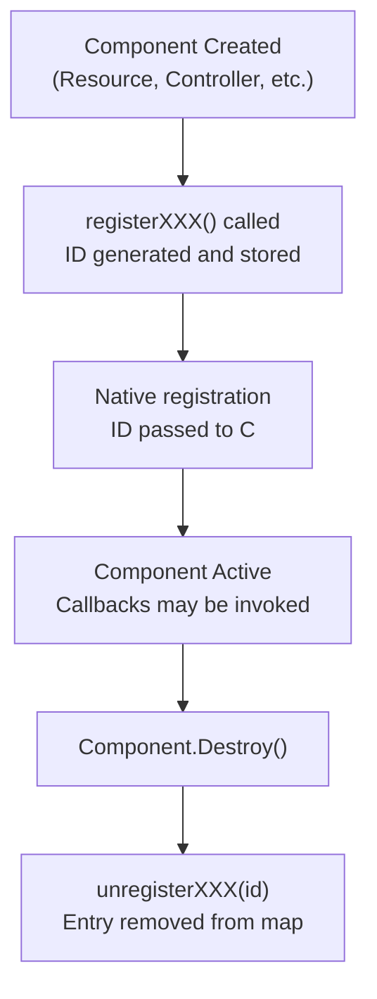

# Callback and FFI Bridge Architecture

Relevant source files

* [controller\_test.go](https://github.com/MaaXYZ/maa-framework-go/blob/5f9c965c/controller_test.go)
* [custom\_action.go](https://github.com/MaaXYZ/maa-framework-go/blob/5f9c965c/custom_action.go)
* [custom\_controller.go](https://github.com/MaaXYZ/maa-framework-go/blob/5f9c965c/custom_controller.go)
* [dbg\_controller.go](https://github.com/MaaXYZ/maa-framework-go/blob/5f9c965c/dbg_controller.go)
* [event.go](https://github.com/MaaXYZ/maa-framework-go/blob/5f9c965c/event.go)
* [recognition\_result.go](https://github.com/MaaXYZ/maa-framework-go/blob/5f9c965c/recognition_result.go)

## Purpose and Scope

This document explains the callback architecture that enables C code in MaaFramework to invoke Go functions without using CGO. The system uses an ID-based dispatch pattern with agent functions registered via `purego.NewCallback` to bridge the FFI boundary.

This page covers:

* The ID-based callback registration pattern
* Agent functions that serve as C-to-Go bridges
* Thread-safe callback storage and lifecycle management
* Concrete implementations for custom actions, custom controllers, and event sinks

For general FFI concepts and library loading, see [Native FFI Integration](/MaaXYZ/maa-framework-go/7.1-native-ffi-integration). For buffer management across the FFI boundary, see [Buffer and Data Exchange](/MaaXYZ/maa-framework-go/7.2-buffer-and-data-exchange). For thread safety details, see [Thread Safety and Concurrency](/MaaXYZ/maa-framework-go/7.4-agent-client-and-server).

## The Callback Challenge

The Go bindings must solve a fundamental problem: native MaaFramework (C++) needs to call user-defined Go code during task execution, but the bindings use `purego` for FFI without CGO. The challenge is that Go functions cannot be directly passed as function pointers to C code without CGO's special handling.

The solution is an **ID-based dispatch pattern**:

1. User registers a Go implementation (e.g., `CustomActionRunner`)
2. Go generates a unique ID and stores the implementation in a map
3. The ID is passed to native code as a `uintptr` "trans\_arg" parameter
4. When native code needs to invoke the callback, it calls a static agent function, passing the ID back
5. The agent looks up the ID in the map and invokes the actual Go implementation

This pattern enables bidirectional communication across the FFI boundary while maintaining type safety and avoiding memory corruption.



**Sources:** [custom\_action.go10-35](https://github.com/MaaXYZ/maa-framework-go/blob/5f9c965c/custom_action.go#L10-L35) [custom\_controller.go12-32](https://github.com/MaaXYZ/maa-framework-go/blob/5f9c965c/custom_controller.go#L12-L32) [event.go11-39](https://github.com/MaaXYZ/maa-framework-go/blob/5f9c965c/event.go#L11-L39)

## Callback Storage Architecture

All three callback systems (custom actions, custom controllers, events) follow the same storage pattern with slight variations in complexity.

### Storage Pattern Components

| Component | Type | Purpose |
| --- | --- | --- |
| ID Counter | `uint64` | Atomic counter for generating unique IDs |
| Callback Map | `map[uint64]T` | Stores callback implementations keyed by ID |
| Mutex | `sync.RWMutex` | Protects concurrent access to the map |

### Custom Action Storage

The simplest implementation, storing a single interface per ID.



**Sources:** [custom\_action.go10-14](https://github.com/MaaXYZ/maa-framework-go/blob/5f9c965c/custom_action.go#L10-L14)

### Custom Controller Storage

Identical pattern but for controller implementations.



**Sources:** [custom\_controller.go12-16](https://github.com/MaaXYZ/maa-framework-go/blob/5f9c965c/custom_controller.go#L12-L16)

### Event Callback Storage

More complex: stores both ID and sink in a struct wrapper to support multiple event types.



**Sources:** [event.go11-19](https://github.com/MaaXYZ/maa-framework-go/blob/5f9c965c/event.go#L11-L19)

## Registration and Unregistration

### Registration Flow

All registration functions follow this atomic pattern:

1. **Generate ID**: Use `atomic.AddUint64` to get a unique ID
2. **Lock Map**: Acquire write lock on the mutex
3. **Store**: Add the callback implementation to the map
4. **Unlock**: Release the mutex
5. **Return ID**: Return the ID to be passed to native code

#### Example: Custom Action Registration

```mermaid
sequenceDiagram
  participant User Code
  participant registerCustomAction()
  participant atomic.AddUint64()
  participant RWMutex
  participant customActionRunnerCallbackAgents

  User Code->>registerCustomAction(): action (CustomActionRunner)
  registerCustomAction()->>atomic.AddUint64(): Increment counter
  atomic.AddUint64()-->>registerCustomAction(): id (uint64)
  registerCustomAction()->>RWMutex: Lock()
  registerCustomAction()->>customActionRunnerCallbackAgents: agents[id] = action
  registerCustomAction()->>RWMutex: Unlock()
  registerCustomAction()-->>User Code: id (uint64)
```

**Sources:** [custom\_action.go16-24](https://github.com/MaaXYZ/maa-framework-go/blob/5f9c965c/custom_action.go#L16-L24)

### Unregistration Flow

Cleanup functions remove entries from the map:

1. **Lock Map**: Acquire write lock
2. **Check Existence**: Verify the ID exists (for actions/events)
3. **Delete**: Remove the entry from the map
4. **Unlock**: Release the mutex via defer
5. **Return Status**: Return success/failure (for actions)

**Sources:** [custom\_action.go26-35](https://github.com/MaaXYZ/maa-framework-go/blob/5f9c965c/custom_action.go#L26-L35) [custom\_controller.go28-32](https://github.com/MaaXYZ/maa-framework-go/blob/5f9c965c/custom_controller.go#L28-L32) [event.go35-39](https://github.com/MaaXYZ/maa-framework-go/blob/5f9c965c/event.go#L35-L39)

## Agent Functions: The FFI Bridge

Agent functions are the critical component that enables C-to-Go calls. They are registered at initialization using `purego.NewCallback()` and serve as static entry points that C code can invoke.

### Custom Action Agent

The custom action agent demonstrates the core pattern:



**Key Implementation Details:**

| Line Range | Purpose |
| --- | --- |
| [50-57](https://github.com/MaaXYZ/maa-framework-go/blob/5f9c965c/50-57) | Function signature matching C callback expectations |
| [60](https://github.com/MaaXYZ/maa-framework-go/blob/5f9c965c/60) | ID extraction: `id := uint64(transArg)` |
| [62-64](https://github.com/MaaXYZ/maa-framework-go/blob/5f9c965c/62-64) | Thread-safe lookup with RLock/RUnlock |
| [66-68](https://github.com/MaaXYZ/maa-framework-go/blob/5f9c965c/66-68) | Early return if callback not found |
| [70-91](https://github.com/MaaXYZ/maa-framework-go/blob/5f9c965c/70-91) | Build Context and CustomActionArg from raw parameters |
| [82-92](https://github.com/MaaXYZ/maa-framework-go/blob/5f9c965c/82-92) | Invoke user implementation and convert result |

**Sources:** [custom\_action.go50-97](https://github.com/MaaXYZ/maa-framework-go/blob/5f9c965c/custom_action.go#L50-L97)

### Custom Controller Agent Functions

Custom controllers require **17 different agent functions**, one for each controller method. All follow the same pattern but with method-specific parameters.

#### Agent Function Table

| Agent Function | Purpose | Return Type |
| --- | --- | --- |
| `_ConnectAgent` | Establish connection | `uintptr` (bool) |
| `_ConnectedAgent` | Check connection status | `uintptr` (bool) |
| `_RequestUUIDAgent` | Get device UUID | `uintptr` (bool) + StringBuffer |
| `_GetFeatureAgent` | Query controller features | `ControllerFeature` |
| `_StartAppAgent` | Launch application | `uintptr` (bool) |
| `_StopAppAgent` | Stop application | `uintptr` (bool) |
| `_ScreencapAgent` | Capture screenshot | `uintptr` (bool) + ImageBuffer |
| `_ClickAgent` | Perform click | `uintptr` (bool) |
| `_SwipeAgent` | Perform swipe | `uintptr` (bool) |
| `_TouchDownAgent` | Touch press | `uintptr` (bool) |
| `_TouchMoveAgent` | Touch move | `uintptr` (bool) |
| `_TouchUpAgent` | Touch release | `uintptr` (bool) |
| `_ClickKey` | Press key | `uintptr` (bool) |
| `_InputText` | Input text | `uintptr` (bool) |
| `_KeyDown` | Key press | `uintptr` (bool) |
| `_KeyUp` | Key release | `uintptr` (bool) |
| `_ScrollAgent` | Scroll | `uintptr` (bool) |

#### Agent Initialization

All agent function pointers are created during `init()`:



**Sources:** [custom\_controller.go90-108](https://github.com/MaaXYZ/maa-framework-go/blob/5f9c965c/custom_controller.go#L90-L108)

#### Example Agent Implementation: Click

```mermaid
sequenceDiagram
  participant Native Code
  participant _ClickAgent
  participant customControllerCallbacksAgents
  participant CustomController.Click()

  Native Code->>_ClickAgent: (x=100, y=200, handleArg=42)
  _ClickAgent->>_ClickAgent: id := uint64(handleArg)
  _ClickAgent->>customControllerCallbacksAgents: RLock, agents[42]
  customControllerCallbacksAgents-->>_ClickAgent: ctrl (CustomController)
  _ClickAgent->>customControllerCallbacksAgents: RUnlock
  _ClickAgent->>CustomController.Click(): ctrl.Click(100, 200)
  CustomController.Click()-->>_ClickAgent: true
  _ClickAgent->>_ClickAgent: Convert to uintptr(1)
  _ClickAgent-->>Native Code: uintptr(1)
```

**Sources:** [custom\_controller.go247-264](https://github.com/MaaXYZ/maa-framework-go/blob/5f9c965c/custom_controller.go#L247-L264)

### Event Callback Agent

The event system uses a single agent function that dispatches to different handlers based on event type.



**Event Parsing**: The agent converts event message strings like `"Resource.Loading.Succeeded"` into structured data:

| Component | Purpose |
| --- | --- |
| `parseEvent()` | Splits message into name and status by last dot |
| Event Name | Base event type (e.g., `"Resource.Loading"`) |
| Event Status | `Starting`, `Succeeded`, or `Failed` |

**Dispatch Logic**: Each event type has a dedicated handler function that:

1. Type-asserts the sink to the appropriate interface (e.g., `ResourceEventSink`)
2. Unmarshals JSON details into the event-specific struct
3. Invokes the interface method with typed parameters

**Sources:** [event.go338-357](https://github.com/MaaXYZ/maa-framework-go/blob/5f9c965c/event.go#L338-L357) [event.go153-170](https://github.com/MaaXYZ/maa-framework-go/blob/5f9c965c/event.go#L153-L170) [event.go172-296](https://github.com/MaaXYZ/maa-framework-go/blob/5f9c965c/event.go#L172-L296)

## Data Marshaling in Agents

Agent functions must convert between C and Go data representations. This involves several patterns:

### C String Conversion

C strings are null-terminated byte arrays. The conversion process:



**Implementation Details:**

* `cStringToBytes()`: Finds null terminator and creates a Go slice
* `cStringToString()`: Wraps `cStringToBytes()` and converts to string
* Uses `unsafe.Pointer` and `unsafe.Add` for iteration
* Returns empty string/nil for nil pointers

**Sources:** [event.go359-384](https://github.com/MaaXYZ/maa-framework-go/blob/5f9c965c/event.go#L359-L384)

### Buffer Handling

Buffers are passed as `uintptr` handles and wrapped in buffer objects:

| Buffer Type | Agent Usage | Source Reference |
| --- | --- | --- |
| `StringBuffer` | UUID output in `_RequestUUIDAgent` | [custom\_controller.go163-164](https://github.com/MaaXYZ/maa-framework-go/blob/5f9c965c/custom_controller.go#L163-L164) |
| `ImageBuffer` | Screenshot in `_ScreencapAgent` | [custom\_controller.go239-240](https://github.com/MaaXYZ/maa-framework-go/blob/5f9c965c/custom_controller.go#L239-L240) |
| `RectBuffer` | Bounding box in custom actions | [custom\_action.go80](https://github.com/MaaXYZ/maa-framework-go/blob/5f9c965c/custom_action.go#L80-L80) |

The pattern:

1. Receive `uintptr` buffer handle
2. Create buffer wrapper: `buffer.NewXXXBufferByHandle(handle)`
3. Use `Set()` or `Get()` methods
4. Return success/failure

**Sources:** [custom\_controller.go148-168](https://github.com/MaaXYZ/maa-framework-go/blob/5f9c965c/custom_controller.go#L148-L168) [custom\_controller.go224-245](https://github.com/MaaXYZ/maa-framework-go/blob/5f9c965c/custom_controller.go#L224-L245)

### Boolean Conversion

Go `bool` values must be converted to C-compatible `uintptr`:

```
```
if result {


return uintptr(1)


}


return uintptr(0)
```
```

This pattern appears in all agent functions that return boolean results.

**Sources:** [custom\_action.go93-96](https://github.com/MaaXYZ/maa-framework-go/blob/5f9c965c/custom_action.go#L93-L96) [custom\_controller.go123-126](https://github.com/MaaXYZ/maa-framework-go/blob/5f9c965c/custom_controller.go#L123-L126)

## Callback Lifecycle Management

### Registration Lifetime

Callbacks remain registered for the lifetime of their associated component:



### Memory Safety Considerations

The ID-based dispatch pattern provides several safety guarantees:

1. **No Pointer Escaping**: Go objects never escape to C as pointers
2. **Existence Checking**: Agents check `exists` before invoking
3. **Nil Safety**: Agents check `!= nil` before calling methods
4. **Map Ownership**: Go retains complete ownership of callback objects
5. **Controlled Cleanup**: Explicit unregistration prevents dangling references

### Concurrent Access Protection

All callback maps use `sync.RWMutex` for thread-safe access:

| Operation | Lock Type | Purpose |
| --- | --- | --- |
| Registration | Write Lock | Exclusive access for map modification |
| Unregistration | Write Lock | Exclusive access for deletion |
| Agent Lookup | Read Lock | Concurrent access for callback invocation |

The pattern allows multiple simultaneous callback invocations while preventing race conditions during registration/unregistration.

**Sources:** [custom\_action.go19-21](https://github.com/MaaXYZ/maa-framework-go/blob/5f9c965c/custom_action.go#L19-L21) [custom\_action.go27-28](https://github.com/MaaXYZ/maa-framework-go/blob/5f9c965c/custom_action.go#L27-L28) [custom\_action.go62-64](https://github.com/MaaXYZ/maa-framework-go/blob/5f9c965c/custom_action.go#L62-L64)

## Complete Callback Flow Example

This diagram shows the complete lifecycle of a custom action callback:

```mermaid
sequenceDiagram
  participant User Code
  participant Resource.RegisterCustomAction()
  participant registerCustomAction()
  participant Global Map
  participant Native MaaFramework
  participant _MaaCustomActionCallbackAgent
  participant CustomActionRunner.Run()

  User Code->>Resource.RegisterCustomAction(): RegisterCustomAction("MyAction", runner)
  Resource.RegisterCustomAction()->>registerCustomAction(): registerCustomAction(runner)
  registerCustomAction()->>Global Map: atomic.AddUint64, store[id]=runner
  registerCustomAction()-->>Resource.RegisterCustomAction(): id
  Resource.RegisterCustomAction()->>Native MaaFramework: MaaResourceRegisterCustomAction(..., id)
  note over Native MaaFramework: Store id as trans_arg
  note over Native MaaFramework: Later: Task executes
  Native MaaFramework->>_MaaCustomActionCallbackAgent: callback(context, ..., id)
  _MaaCustomActionCallbackAgent->>Global Map: RLock, lookup agents[id]
  Global Map-->>_MaaCustomActionCallbackAgent: runner
  _MaaCustomActionCallbackAgent->>Global Map: RUnlock
  _MaaCustomActionCallbackAgent->>_MaaCustomActionCallbackAgent: Build Context and CustomActionArg
  _MaaCustomActionCallbackAgent->>CustomActionRunner.Run(): runner.Run(ctx, arg)
  CustomActionRunner.Run()-->>_MaaCustomActionCallbackAgent: true/false
  _MaaCustomActionCallbackAgent->>_MaaCustomActionCallbackAgent: Convert to uintptr
  _MaaCustomActionCallbackAgent-->>Native MaaFramework: uintptr(1/0)
  note over User Code: Later: Cleanup
  User Code->>Resource.RegisterCustomAction(): Destroy()
  Resource.RegisterCustomAction()->>registerCustomAction(): unregisterCustomAction(id)
  registerCustomAction()->>Global Map: delete(agents, id)
```

**Sources:** [custom\_action.go16-97](https://github.com/MaaXYZ/maa-framework-go/blob/5f9c965c/custom_action.go#L16-L97) [resource.go](https://github.com/MaaXYZ/maa-framework-go/blob/5f9c965c/resource.go) (referenced but not provided)

## Implementation Summary

### Callback Systems Comparison

| System | Agent Count | Storage Type | Primary Use Case |
| --- | --- | --- | --- |
| Custom Actions | 1 | `CustomActionRunner` | Execute user logic during tasks |
| Custom Controllers | 17 | `CustomController` | Implement device control interfaces |
| Event Callbacks | 1 | `eventCallback{any}` | Monitor framework events |

### Key Design Principles

1. **ID-based Dispatch**: All callbacks use opaque `uint64` IDs as handles
2. **Static Agents**: Agent functions registered once at `init()` time
3. **Thread-safe Storage**: All maps protected by `sync.RWMutex`
4. **Atomic ID Generation**: `atomic.AddUint64` ensures unique IDs
5. **Explicit Cleanup**: Components unregister callbacks on destruction
6. **Type Safety**: Go maintains full type information, C sees only IDs
7. **Error Tolerance**: Agents gracefully handle missing/nil callbacks

This architecture enables seamless C-to-Go communication without CGO's complexity or overhead, maintaining memory safety and thread safety throughout the callback lifecycle.

**Sources:** [custom\_action.go](https://github.com/MaaXYZ/maa-framework-go/blob/5f9c965c/custom_action.go) [custom\_controller.go](https://github.com/MaaXYZ/maa-framework-go/blob/5f9c965c/custom_controller.go) [event.go](https://github.com/MaaXYZ/maa-framework-go/blob/5f9c965c/event.go)