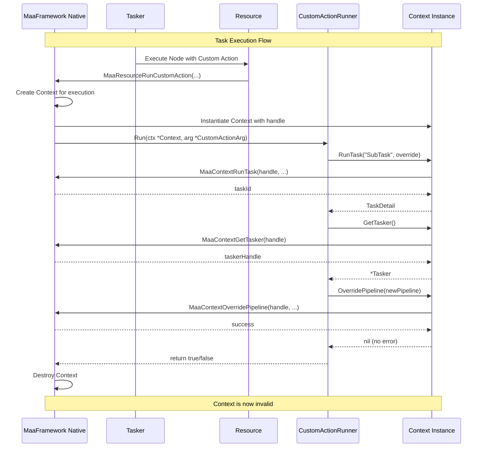
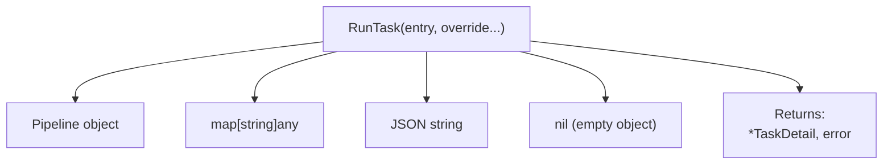
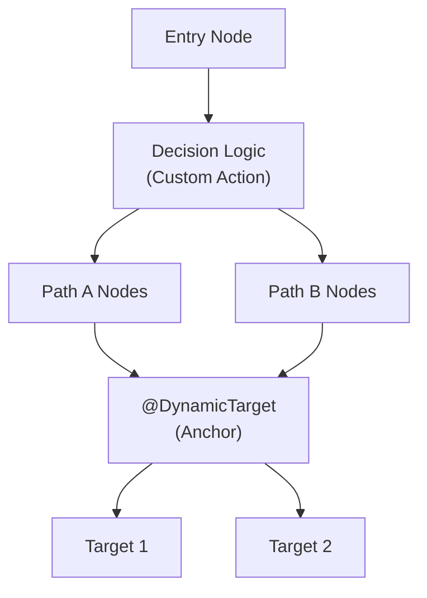
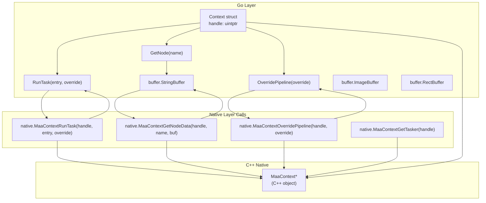

# Context

Relevant source files

* [README.md](https://github.com/MaaXYZ/maa-framework-go/blob/5f9c965c/README.md?plain=1)
* [README\_zh.md](https://github.com/MaaXYZ/maa-framework-go/blob/5f9c965c/README_zh.md?plain=1)
* [context.go](https://github.com/MaaXYZ/maa-framework-go/blob/5f9c965c/context.go)
* [context\_test.go](https://github.com/MaaXYZ/maa-framework-go/blob/5f9c965c/context_test.go)
* [examples/custom-action/main.go](https://github.com/MaaXYZ/maa-framework-go/blob/5f9c965c/examples/custom-action/main.go)
* [examples/quick-start/main.go](https://github.com/MaaXYZ/maa-framework-go/blob/5f9c965c/examples/quick-start/main.go)
* [resource\_test.go](https://github.com/MaaXYZ/maa-framework-go/blob/5f9c965c/resource_test.go)
* [tasker.go](https://github.com/MaaXYZ/maa-framework-go/blob/5f9c965c/tasker.go)
* [tasker\_test.go](https://github.com/MaaXYZ/maa-framework-go/blob/5f9c965c/tasker_test.go)

## Purpose and Scope

The `Context` struct provides a runtime environment that is passed to custom actions and custom recognitions during task execution. It enables custom code to interact with the framework's components, execute operations, query and modify pipeline definitions, and access execution state. This page documents the Context API, its lifecycle, and usage patterns within custom extensions.

For information about implementing custom actions that receive Context, see [Custom Actions](/MaaXYZ/maa-framework-go/5.1-custom-actions). For custom recognitions, see [Custom Recognition](/MaaXYZ/maa-framework-go/5.2-custom-recognition). For the Tasker that orchestrates execution and creates Context instances, see [Tasker](/MaaXYZ/maa-framework-go/3.1-tasker).

**Sources:** [context.go1-472](https://github.com/MaaXYZ/maa-framework-go/blob/5f9c965c/context.go#L1-L472)

---

## Overview

Context acts as a bridge between user-defined custom code and the framework's internal execution engine. When the MaaFramework native library invokes a custom action or custom recognition, it provides a Context instance that encapsulates the current execution environment. This Context allows custom code to:

* Execute sub-tasks, recognitions, and actions programmatically
* Dynamically modify pipeline definitions during runtime
* Query node configurations and execution state
* Access the current Tasker and Controller instances
* Manage execution flow through anchors and hit counts

**Key Characteristics:**

| Property | Description |
| --- | --- |
| **Availability** | Only available during custom action/recognition execution |
| **Scope** | Bound to a specific task execution context |
| **Thread Safety** | Methods are safe to call from the callback thread |
| **Ownership** | Managed by the native framework; cannot be manually created |
| **Lifecycle** | Valid only during the callback invocation |

**Sources:** [context.go13-17](https://github.com/MaaXYZ/maa-framework-go/blob/5f9c965c/context.go#L13-L17) High-level system diagrams

---

## Context in System Architecture

The following diagram shows how Context integrates with other core components:

```mermaid
flowchart TD

CustomAction["CustomActionRunner.Run(ctx, arg)"]
CustomReco["CustomRecognitionRunner.Run(ctx, arg)"]
Context["Context<br>(uintptr handle)"]
RunTask["RunTask(entry, override)"]
RunReco["RunRecognition(entry, img, override)"]
RunAction["RunAction(entry, box, detail, override)"]
RunRecoDirect["RunRecognitionDirect(type, param, img)"]
RunActDirect["RunActionDirect(type, param, box, detail)"]
OverridePipe["OverridePipeline(override)"]
OverrideNext["OverrideNext(name, nextList)"]
OverrideImg["OverrideImage(name, img)"]
GetNode["GetNode(name)"]
GetNodeJSON["GetNodeJSON(name)"]
GetTasker["GetTasker()"]
GetTaskJob["GetTaskJob()"]
SetAnchor["SetAnchor(name, node)"]
GetAnchor["GetAnchor(name)"]
GetHitCount["GetHitCount(node)"]
ClearHitCount["ClearHitCount(node)"]
WaitFreezes["WaitFreezes(duration, box, param)"]
Tasker["Tasker<br>handle: uintptr"]
Controller["Controller<br>handle: uintptr"]
Resource["Resource<br>handle: uintptr"]
NativeContext["native.MaaContext*<br>(C++ handle)"]

CustomAction --> Context
CustomReco --> Context
GetTasker --> Tasker
Context --> NativeContext
RunTask --> NativeContext
RunReco --> NativeContext
RunAction --> NativeContext

subgraph subGraph6 ["Framework Components"]
    Tasker
    Controller
    Resource
    NativeContext
    Tasker --> Controller
    Tasker --> Resource
end

subgraph subGraph5 ["Context Operations"]
    Context
    Context --> RunTask
    Context --> RunReco
    Context --> RunAction
    Context --> RunRecoDirect
    Context --> RunActDirect
    Context --> OverridePipe
    Context --> OverrideNext
    Context --> OverrideImg
    Context --> GetNode
    Context --> GetNodeJSON
    Context --> GetTasker
    Context --> GetTaskJob
    Context --> SetAnchor
    Context --> GetAnchor
    Context --> GetHitCount
    Context --> ClearHitCount
    Context --> WaitFreezes

subgraph subGraph4 ["State Management"]
    SetAnchor
    GetAnchor
    GetHitCount
    ClearHitCount
    WaitFreezes
end

subgraph subGraph3 ["Query Methods"]
    GetNode
    GetNodeJSON
    GetTasker
    GetTaskJob
end

subgraph subGraph2 ["Pipeline Modification"]
    OverridePipe
    OverrideNext
    OverrideImg
end

subgraph subGraph1 ["Execution Methods"]
    RunTask
    RunReco
    RunAction
    RunRecoDirect
    RunActDirect
end
end

subgraph subGraph0 ["Custom User Code"]
    CustomAction
    CustomReco
end
```



**Sources:** [context.go1-472](https://github.com/MaaXYZ/maa-framework-go/blob/5f9c965c/context.go#L1-L472) Diagram 2 and Diagram 3 from high-level architecture

---

## Context Lifecycle and Availability

Context instances are created by the framework and passed to custom code during specific callback invocations:



**Important Lifecycle Rules:**

1. **Never Store Context**: Context is only valid during the callback. Storing it for later use results in undefined behavior
2. **Thread Affinity**: Context methods should only be called from the thread that invoked the callback
3. **Cloning**: Use `Clone()` if you need a separate context instance, but it still shares the same underlying execution environment
4. **No Manual Creation**: Context cannot be instantiated by user code - only received from callbacks

**Sources:** [context.go15-17](https://github.com/MaaXYZ/maa-framework-go/blob/5f9c965c/context.go#L15-L17) [context\_test.go9-26](https://github.com/MaaXYZ/maa-framework-go/blob/5f9c965c/context_test.go#L9-L26)

---

## Method Categories

### Execution Methods

These methods execute tasks, recognitions, or actions programmatically. They are the primary way to compose complex workflows from custom code.

#### Task Execution



| Method | Parameters | Return | Description |
| --- | --- | --- | --- |
| `RunTask` | `entry string` `override ...any` | `*TaskDetail, error` | Executes a pipeline task by entry node name. Override can be Pipeline, map, JSON string, or nil |

**Sources:** [context.go38-77](https://github.com/MaaXYZ/maa-framework-go/blob/5f9c965c/context.go#L38-L77)

#### Recognition Execution

| Method | Parameters | Return | Description |
| --- | --- | --- | --- |
| `RunRecognition` | `entry string` `img image.Image` `override ...any` | `*RecognitionDetail, error` | Executes recognition by entry node name on provided image |
| `RunRecognitionDirect` | `recoType NodeRecognitionType` `recoParam NodeRecognitionParam` `img image.Image` | `*RecognitionDetail, error` | Executes recognition directly without pipeline entry, using type and parameters |

**Sources:** [context.go79-130](https://github.com/MaaXYZ/maa-framework-go/blob/5f9c965c/context.go#L79-L130) [context.go200-235](https://github.com/MaaXYZ/maa-framework-go/blob/5f9c965c/context.go#L200-L235)

#### Action Execution

| Method | Parameters | Return | Description |
| --- | --- | --- | --- |
| `RunAction` | `entry string` `box Rect` `recognitionDetail string` `override ...any` | `*ActionDetail, error` | Executes action by entry node name. `recognitionDetail` should be JSON from previous recognition or `""` |
| `RunActionDirect` | `actionType NodeActionType` `actionParam NodeActionParam` `box Rect` `recoDetail *RecognitionDetail` | `*ActionDetail, error` | Executes action directly without pipeline entry, using type and parameters |

**Sources:** [context.go132-198](https://github.com/MaaXYZ/maa-framework-go/blob/5f9c965c/context.go#L132-L198) [context.go237-279](https://github.com/MaaXYZ/maa-framework-go/blob/5f9c965c/context.go#L237-L279)

#### Override Parameter Handling

All execution methods that accept `override` parameters support multiple input formats:

```
```
// 1. Pipeline object


pipeline := maa.NewPipeline()


node := maa.NewNode("MyNode", maa.WithAction(maa.ActClick(...)))


pipeline.AddNode(node)


ctx.RunTask("MyNode", pipeline)


// 2. Map structure


ctx.RunTask("MyNode", map[string]any{


"MyNode": map[string]any{


"action": "Click",


"target": []int{100, 200, 50, 50},


},


})


// 3. JSON string


ctx.RunTask("MyNode", `{"MyNode":{"action":"Click"}}`)


// 4. Nil or no parameter (uses empty object)


ctx.RunTask("MyNode")


ctx.RunTask("MyNode", nil)
```
```

**Sources:** [context.go19-36](https://github.com/MaaXYZ/maa-framework-go/blob/5f9c965c/context.go#L19-L36) [context.go47-75](https://github.com/MaaXYZ/maa-framework-go/blob/5f9c965c/context.go#L47-L75)

---

### Pipeline Modification Methods

These methods dynamically modify the pipeline definition during execution, enabling adaptive behavior.

| Method | Parameters | Return | Description |
| --- | --- | --- | --- |
| `OverridePipeline` | `override any` | `error` | Replaces entire pipeline. Accepts Pipeline, map, JSON string, or []byte |
| `OverrideNext` | `name string` `nextList []NodeNextItem` | `error` | Overrides the `next` list of a specific node |
| `OverrideImage` | `imageName string` `image image.Image` | `error` | Replaces a named image resource |

**Example: Dynamic Pipeline Override**

```
```
func (a *MyAction) Run(ctx *Context, arg *CustomActionArg) bool {


// Create alternative pipeline based on runtime condition


newPipeline := maa.NewPipeline()


node := maa.NewNode("DynamicNode",


maa.WithAction(maa.ActClick(...)),


)


newPipeline.AddNode(node)


// Override the entire pipeline


if err := ctx.OverridePipeline(newPipeline); err != nil {


return false


}


// Execute with new pipeline


detail, err := ctx.RunTask("DynamicNode")


return err == nil && detail.Succeeded()


}
```
```

**Sources:** [context.go281-352](https://github.com/MaaXYZ/maa-framework-go/blob/5f9c965c/context.go#L281-L352) [context\_test.go157-216](https://github.com/MaaXYZ/maa-framework-go/blob/5f9c965c/context_test.go#L157-L216) [context\_test.go218-272](https://github.com/MaaXYZ/maa-framework-go/blob/5f9c965c/context_test.go#L218-L272)

---

### Query Methods

These methods retrieve information about nodes, execution state, and system components.

| Method | Parameters | Return | Description |
| --- | --- | --- | --- |
| `GetNode` | `name string` | `*Node, error` | Returns node definition deserialized into Node struct |
| `GetNodeJSON` | `name string` | `string, error` | Returns raw JSON string of node definition |
| `GetTasker` | - | `*Tasker` | Returns the Tasker instance managing this execution |
| `GetTaskJob` | - | `*TaskJob` | Returns the TaskJob for the current task |

**Example: Querying Node Configuration**

```
```
func (a *MyAction) Run(ctx *Context, arg *CustomActionArg) bool {


// Get node definition to check its configuration


node, err := ctx.GetNode("TargetNode")


if err != nil {


return false


}


// Examine node properties


if node.Action.Type == maa.NodeActionTypeClick {


clickParam := node.Action.Param.(*maa.NodeClickParam)


// Use click parameters...


}


return true


}
```
```

**Sources:** [context.go365-404](https://github.com/MaaXYZ/maa-framework-go/blob/5f9c965c/context.go#L365-L404) [context\_test.go274-409](https://github.com/MaaXYZ/maa-framework-go/blob/5f9c965c/context_test.go#L274-L409)

---

### State Management Methods

These methods manage execution state including anchors, hit counts, and screen stabilization.

| Method | Parameters | Return | Description |
| --- | --- | --- | --- |
| `SetAnchor` | `anchorName string` `nodeName string` | `error` | Sets an anchor to point to a specific node |
| `GetAnchor` | `anchorName string` | `string, error` | Returns the node name that an anchor points to |
| `GetHitCount` | `nodeName string` | `uint64, error` | Returns how many times a node has been hit |
| `ClearHitCount` | `nodeName string` | `error` | Resets the hit count for a node |
| `WaitFreezes` | `duration time.Duration` `box *Rect` `waitFreezesParam ...any` | `bool` | Waits until screen stabilizes (no changes) |
| `Clone` | - | `*Context` | Creates a copy of the context |

#### Anchor Usage Pattern

Anchors enable dynamic navigation within pipelines:



**Sources:** [context.go406-471](https://github.com/MaaXYZ/maa-framework-go/blob/5f9c965c/context.go#L406-L471)

---

## Integration with Custom Code

### Custom Action Pattern

Custom actions receive Context as the first parameter:

```
```
type MyCustomAction struct {


config string


}


func (a *MyCustomAction) Run(ctx *Context, arg *CustomActionArg) bool {


// Access current controller to get screenshot


img, err := ctx.GetTasker().GetController().CacheImage()


if err != nil {


return false


}


// Run recognition on the image


detail, err := ctx.RunRecognition("FindTarget", img, nil)


if err != nil || !detail.Hit {


return false


}


// Execute action based on recognition result


_, err = ctx.RunAction("ClickTarget", detail.Box, detail.DetailJson)


return err == nil


}
```
```

**Sources:** [context\_test.go9-26](https://github.com/MaaXYZ/maa-framework-go/blob/5f9c965c/context_test.go#L9-L26) [context\_test.go111-128](https://github.com/MaaXYZ/maa-framework-go/blob/5f9c965c/context_test.go#L111-L128)

### Custom Recognition Pattern

Custom recognitions also receive Context:

```
```
type MyCustomRecognition struct{}


func (r *MyCustomRecognition) Run(


ctx *Context,


arg *CustomRecognitionArg,


) (*CustomRecognitionResult, bool) {


// Access node configuration


node, err := ctx.GetNode(arg.NodeName)


if err != nil {


return nil, false


}


// Perform custom recognition logic...


result := &CustomRecognitionResult{


Box: Rect{100, 100, 50, 50},


Detail: "Custom detection result",


}


return result, true


}
```
```

**Sources:** [resource\_test.go22-27](https://github.com/MaaXYZ/maa-framework-go/blob/5f9c965c/resource_test.go#L22-L27)

---

## Common Usage Patterns

### Pattern 1: Conditional Sub-Task Execution

Execute different sub-tasks based on runtime conditions:

```
```
func (a *ConditionalAction) Run(ctx *Context, arg *CustomActionArg) bool {


// Check current state


state := determineCurrentState(arg)


var taskName string


switch state {


case StateA:


taskName = "HandleStateA"


case StateB:


taskName = "HandleStateB"


default:


return false


}


// Execute appropriate sub-task


detail, err := ctx.RunTask(taskName)


return err == nil && detail.Succeeded()


}
```
```

**Sources:** [context\_test.go157-189](https://github.com/MaaXYZ/maa-framework-go/blob/5f9c965c/context_test.go#L157-L189)

### Pattern 2: Dynamic Pipeline Modification

Modify pipeline based on execution results:

```
```
func (a *AdaptiveAction) Run(ctx *Context, arg *CustomActionArg) bool {


// Try initial approach


detail, err := ctx.RunTask("InitialAttempt")


if err != nil || !detail.Succeeded() {


// Initial approach failed, modify pipeline


alternativePipeline := createAlternativePipeline()


if err := ctx.OverridePipeline(alternativePipeline); err != nil {


return false


}


// Retry with modified pipeline


detail, err = ctx.RunTask("AlternativeAttempt")


}


return err == nil && detail.Succeeded()


}
```
```

**Sources:** [context\_test.go157-216](https://github.com/MaaXYZ/maa-framework-go/blob/5f9c965c/context_test.go#L157-L216)

### Pattern 3: Screen Stabilization

Wait for screen to stabilize before proceeding:

```
```
func (a *WaitAction) Run(ctx *Context, arg *CustomActionArg) bool {


// Wait for screen to freeze (no changes for 2 seconds)


stabilized := ctx.WaitFreezes(


2*time.Second,


&arg.Box,  // Region to monitor


map[string]any{


"threshold": 0.95,  // Similarity threshold


},


)


if !stabilized {


return false


}


// Screen is stable, proceed with action


_, err := ctx.RunAction("NextStep", arg.Box, "")


return err == nil


}
```
```

**Sources:** [context.go412-428](https://github.com/MaaXYZ/maa-framework-go/blob/5f9c965c/context.go#L412-L428)

### Pattern 4: Accessing System Components

Leverage Tasker and Controller through Context:

```
```
func (a *SystemAccessAction) Run(ctx *Context, arg *CustomActionArg) bool {


// Get Tasker


tasker := ctx.GetTasker()


// Access Controller through Tasker


controller := tasker.GetController()


// Capture current screen


img, err := controller.CacheImage()


if err != nil {


return false


}


// Get controller UUID


uuid, err := controller.GetUUID()


if err != nil {


return false


}


// Use information for custom logic...


processImage(img, uuid)


return true


}
```
```

**Sources:** [context.go406-410](https://github.com/MaaXYZ/maa-framework-go/blob/5f9c965c/context.go#L406-L410) [context\_test.go55-76](https://github.com/MaaXYZ/maa-framework-go/blob/5f9c965c/context_test.go#L55-L76)

---

## FFI Layer Integration

Context wraps a native C++ handle and marshals data across the FFI boundary:



**Key FFI Operations:**

1. **Handle Wrapping**: Context stores a `uintptr` handle to the C++ `MaaContext*` object
2. **JSON Marshaling**: Override parameters are marshaled to JSON before crossing FFI boundary
3. **Buffer Usage**: Buffers are used to receive string and structured data from native layer
4. **ID Return Values**: Native methods return numeric IDs (taskId, recId, actId) that are used to retrieve details

**Sources:** [context.go15-17](https://github.com/MaaXYZ/maa-framework-go/blob/5f9c965c/context.go#L15-L17) [context.go38-45](https://github.com/MaaXYZ/maa-framework-go/blob/5f9c965c/context.go#L38-L45) [context.go79-94](https://github.com/MaaXYZ/maa-framework-go/blob/5f9c965c/context.go#L79-L94)

---

## Error Handling

All Context methods that can fail return errors following Go conventions:

```
```
func (a *MyAction) Run(ctx *Context, arg *CustomActionArg) bool {


// Check errors from execution methods


detail, err := ctx.RunTask("SubTask")


if err != nil {


log.Printf("Failed to run task: %v", err)


return false


}


// Check errors from query methods


node, err := ctx.GetNode("TargetNode")


if err != nil {


log.Printf("Failed to get node: %v", err)


return false


}


// Check errors from modification methods


if err := ctx.OverridePipeline(newPipeline); err != nil {


log.Printf("Failed to override pipeline: %v", err)


return false


}


return true


}
```
```

**Common Error Conditions:**

| Error | Cause | Solution |
| --- | --- | --- |
| `"failed to run task"` | Native execution failed, invalid entry node | Verify node exists in pipeline |
| `"failed to get node JSON"` | Node name not found | Check node name spelling |
| `"failed to override pipeline"` | Invalid JSON structure | Validate pipeline structure |
| `"failed to set anchor"` | Invalid anchor or node name | Verify both names are valid |
| JSON marshal errors | Invalid override parameter | Ensure override is JSON-serializable |

**Sources:** [context.go38-45](https://github.com/MaaXYZ/maa-framework-go/blob/5f9c965c/context.go#L38-L45) [context.go88-94](https://github.com/MaaXYZ/maa-framework-go/blob/5f9c965c/context.go#L88-L94) [context.go281-286](https://github.com/MaaXYZ/maa-framework-go/blob/5f9c965c/context.go#L281-L286)

---

## Testing Context Usage

Test Context functionality using the test utilities:

```
```
func TestMyCustomAction(t *testing.T) {


// Setup test environment


ctrl := createCarouselImageController(t)


defer ctrl.Destroy()


ctrl.PostConnect().Wait()


res := createResource(t)


defer res.Destroy()


tasker := createTasker(t)


defer tasker.Destroy()


taskerBind(t, tasker, ctrl, res)


// Register custom action


err := res.RegisterCustomAction("MyAction", &MyCustomAction{})


require.NoError(t, err)


// Create pipeline that uses the custom action


pipeline := NewPipeline()


node := NewNode("TestNode",


WithAction(ActCustom("MyAction")),


)


pipeline.AddNode(node)


// Execute and verify


success := tasker.PostTask(node.Name, pipeline).Wait().Success()


require.True(t, success)


}
```
```

**Sources:** [context\_test.go28-53](https://github.com/MaaXYZ/maa-framework-go/blob/5f9c965c/context_test.go#L28-L53) [context\_test.go78-109](https://github.com/MaaXYZ/maa-framework-go/blob/5f9c965c/context_test.go#L78-L109)

---

## Summary

The Context provides a comprehensive API for custom code to interact with the MaaFramework execution environment:

* **Execution**: Run tasks, recognitions, and actions programmatically
* **Modification**: Dynamically alter pipeline definitions during runtime
* **Query**: Access node configurations and execution state
* **State**: Manage anchors, hit counts, and screen stabilization
* **Access**: Reach Tasker and Controller for system-level operations

Context is only valid during the callback invocation and should never be stored for later use. All operations follow standard Go error handling conventions. Use Context to build adaptive, intelligent automation workflows that respond to runtime conditions.