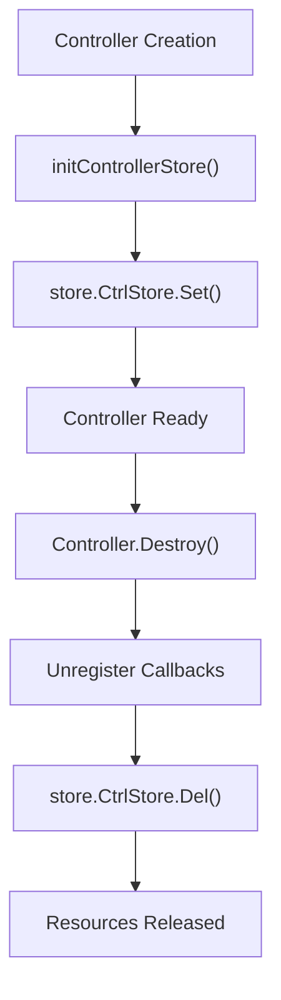

# Controller

Relevant source files

* [README.md](https://github.com/MaaXYZ/maa-framework-go/blob/5f9c965c/README.md?plain=1)
* [README\_zh.md](https://github.com/MaaXYZ/maa-framework-go/blob/5f9c965c/README_zh.md?plain=1)
* [controller.go](https://github.com/MaaXYZ/maa-framework-go/blob/5f9c965c/controller.go)
* [controller\_test.go](https://github.com/MaaXYZ/maa-framework-go/blob/5f9c965c/controller_test.go)
* [custom\_controller.go](https://github.com/MaaXYZ/maa-framework-go/blob/5f9c965c/custom_controller.go)
* [dbg\_controller.go](https://github.com/MaaXYZ/maa-framework-go/blob/5f9c965c/dbg_controller.go)
* [examples/custom-action/main.go](https://github.com/MaaXYZ/maa-framework-go/blob/5f9c965c/examples/custom-action/main.go)
* [examples/quick-start/main.go](https://github.com/MaaXYZ/maa-framework-go/blob/5f9c965c/examples/quick-start/main.go)
* [internal/native/framework.go](https://github.com/MaaXYZ/maa-framework-go/blob/5f9c965c/internal/native/framework.go)

The Controller component provides an abstraction for device interaction in maa-framework-go. It encapsulates platform-specific methods for capturing screenshots, sending input events, and controlling applications. Controllers must be created, connected, and bound to a [Tasker](/MaaXYZ/maa-framework-go/3.1-tasker) before they can be used in task execution.

For information about implementing custom controllers, see [Custom Controllers](/MaaXYZ/maa-framework-go/5.3-custom-controllers). For device discovery utilities, see [Device Discovery and Connection](/MaaXYZ/maa-framework-go/2.3-device-discovery-and-connection).

---

## Overview

The `Controller` struct wraps a native MaaFramework controller handle and provides Go-idiomatic methods for device automation. Controllers are responsible for:

* Establishing and managing connections to target devices or applications
* Capturing screenshots for image recognition
* Executing input actions (clicks, swipes, keyboard input)
* Managing application lifecycle (start/stop apps)
* Providing event callbacks for monitoring controller operations

**Sources:** [controller.go26-28](https://github.com/MaaXYZ/maa-framework-go/blob/5f9c965c/controller.go#L26-L28)

### Controller Architecture

```mermaid
flowchart TD

Controller["Controller struct<br>(controller.go)"]
NewAdbController["NewAdbController()"]
NewWin32Controller["NewWin32Controller()"]
NewPlayCoverController["NewPlayCoverController()"]
NewGamepadController["NewGamepadController()"]
NewCustomController["NewCustomController()"]
MaaAdbControllerCreate["native.MaaAdbControllerCreate"]
MaaWin32ControllerCreate["native.MaaWin32ControllerCreate"]
MaaPlayCoverControllerCreate["native.MaaPlayCoverControllerCreate"]
MaaGamepadControllerCreate["native.MaaGamepadControllerCreate"]
MaaCustomControllerCreate["native.MaaCustomControllerCreate"]
MaaControllerPostConnect["native.MaaControllerPostConnection"]
MaaControllerPostClick["native.MaaControllerPostClick"]
MaaControllerPostScreencap["native.MaaControllerPostScreencap"]
AdbController["ADB Controller"]
Win32Controller["Win32 Controller"]
PlayCoverController["PlayCover Controller"]
GamepadController["Gamepad Controller"]
CustomControllerImpl["Custom Controller"]
Android["Android Device<br>(via ADB)"]
Windows["Windows App<br>(via Win32 API)"]
MacOS["iOS App<br>(via PlayCover)"]
VirtualGamepad["Virtual Gamepad<br>(via ViGEm)"]

NewAdbController --> MaaAdbControllerCreate
NewWin32Controller --> MaaWin32ControllerCreate
NewPlayCoverController --> MaaPlayCoverControllerCreate
NewGamepadController --> MaaGamepadControllerCreate
NewCustomController --> MaaCustomControllerCreate
MaaAdbControllerCreate --> AdbController
MaaWin32ControllerCreate --> Win32Controller
MaaPlayCoverControllerCreate --> PlayCoverController
MaaGamepadControllerCreate --> GamepadController
MaaCustomControllerCreate --> CustomControllerImpl
Controller --> MaaControllerPostConnect
Controller --> MaaControllerPostClick
Controller --> MaaControllerPostScreencap
AdbController --> Android
Win32Controller --> Windows
PlayCoverController --> MacOS
GamepadController --> VirtualGamepad

subgraph subGraph3 ["Target Platforms"]
    Android
    Windows
    MacOS
    VirtualGamepad
end

subgraph subGraph2 ["Native MaaFramework"]
    AdbController
    Win32Controller
    PlayCoverController
    GamepadController
    CustomControllerImpl
end

subgraph subGraph1 ["Native FFI Layer"]
    MaaAdbControllerCreate
    MaaWin32ControllerCreate
    MaaPlayCoverControllerCreate
    MaaGamepadControllerCreate
    MaaCustomControllerCreate
    MaaControllerPostConnect
    MaaControllerPostClick
    MaaControllerPostScreencap
end

subgraph subGraph0 ["Go Binding Layer"]
    Controller
    NewAdbController
    NewWin32Controller
    NewPlayCoverController
    NewGamepadController
    NewCustomController
end
```



**Sources:** [controller.go30-158](https://github.com/MaaXYZ/maa-framework-go/blob/5f9c965c/controller.go#L30-L158)

---

## Controller Types

### ADB Controller

The ADB controller automates Android devices via the Android Debug Bridge protocol. It supports multiple screencap and input methods for optimal performance.

```
```
func NewAdbController(


adbPath, address string,


screencapMethod adb.ScreencapMethod,


inputMethod adb.InputMethod,


config, agentPath string,


) (*Controller, error)
```
```

**Parameters:**

* `adbPath`: Path to the ADB executable
* `address`: Device address (e.g., "127.0.0.1:5555" or device serial)
* `screencapMethod`: Screenshot capture method (see `controller/adb` package)
* `inputMethod`: Input method for touch/keyboard events
* `config`: JSON configuration string for controller options
* `agentPath`: Path to MaaAgentBinary for enhanced functionality

**Sources:** [controller.go30-54](https://github.com/MaaXYZ/maa-framework-go/blob/5f9c965c/controller.go#L30-L54)

### Win32 Controller

The Win32 controller automates Windows desktop applications using Win32 APIs.

```
```
func NewWin32Controller(


hWnd unsafe.Pointer,


screencapMethod win32.ScreencapMethod,


mouseMethod win32.InputMethod,


keyboardMethod win32.InputMethod,


) (*Controller, error)
```
```

**Parameters:**

* `hWnd`: Window handle (HWND) of the target application
* `screencapMethod`: Screenshot capture method (see `controller/win32` package)
* `mouseMethod`: Mouse input method
* `keyboardMethod`: Keyboard input method

**Sources:** [controller.go72-94](https://github.com/MaaXYZ/maa-framework-go/blob/5f9c965c/controller.go#L72-L94)

### PlayCover Controller

The PlayCover controller automates iOS applications running via PlayCover on macOS.

```
```
func NewPlayCoverController(


address, uuid string,


) (*Controller, error)
```
```

**Parameters:**

* `address`: Address of the PlayCover application
* `uuid`: UUID identifier for the target application

**Sources:** [controller.go56-70](https://github.com/MaaXYZ/maa-framework-go/blob/5f9c965c/controller.go#L56-L70)

### Gamepad Controller

The Gamepad controller creates virtual gamepad devices on Windows using the ViGEm Bus Driver. It supports Xbox 360 and DualShock 4 controller emulation.

```
```
func NewGamepadController(


hWnd unsafe.Pointer,


gamepadType GamepadType,


screencapMethod win32.ScreencapMethod,


) (*Controller, error)
```
```

**Parameters:**

* `hWnd`: Window handle for screenshot capture (optional, can be nil)
* `gamepadType`: `GamepadTypeXbox360` or `GamepadTypeDualShock4`
* `screencapMethod`: Screenshot method to use if hWnd is provided

**Requirements:** ViGEm Bus Driver must be installed on the system.

**Sources:** [controller.go96-128](https://github.com/MaaXYZ/maa-framework-go/blob/5f9c965c/controller.go#L96-L128)

### Custom Controller

Custom controllers allow users to implement their own device interaction logic by implementing the `CustomController` interface.

```
```
func NewCustomController(


ctrl CustomController,


) (*Controller, error)
```
```

The `CustomController` interface defines methods for connection, screenshot, input, and app control. See [Custom Controllers](/MaaXYZ/maa-framework-go/5.3-custom-controllers) for detailed documentation on implementing this interface.

**Sources:** [controller.go130-158](https://github.com/MaaXYZ/maa-framework-go/blob/5f9c965c/controller.go#L130-L158)

### Debug Controllers

`MaaDbgController` is intentionally not exposed in the Go binding. Instead, two debug implementations are provided for testing purposes:

* `CarouselImageController`: replays a directory of image files as screenshots, cycling through them on each screencap call.
* `BlankController`: a no-op implementation that accepts all operations without connecting to any device.

These are documented in [Testing Utilities](/MaaXYZ/maa-framework-go/8.1-testing-utilities) and used in tests via `NewCarouselImageController`.

**Sources:** [controller.go160-161](https://github.com/MaaXYZ/maa-framework-go/blob/5f9c965c/controller.go#L160-L161) [controller\_test.go10-16](https://github.com/MaaXYZ/maa-framework-go/blob/5f9c965c/controller_test.go#L10-L16)

---

## Lifecycle Management

### Creation and Initialization

Controllers are created using type-specific constructor functions. Each constructor returns a `*Controller` instance or an error if creation fails.

Create the controller using the appropriate constructor (e.g., `NewAdbController`), check for errors, and defer `Destroy`. See the constructor documentation above for parameter details.

**Sources:** [controller.go30-54](https://github.com/MaaXYZ/maa-framework-go/blob/5f9c965c/controller.go#L30-L54) [controller.go165-176](https://github.com/MaaXYZ/maa-framework-go/blob/5f9c965c/controller.go#L165-L176)

### Connection

After creation, controllers must be connected before use. The `PostConnect` method initiates connection asynchronously and returns a `Job` that can be waited on.

```
```
job := ctrl.PostConnect()


status := job.Wait()  // Blocks until connection completes
```
```

Check connection status with the `Connected` method:

```
```
if ctrl.Connected() {


// Controller is ready


}
```
```

**Sources:** [controller.go276-279](https://github.com/MaaXYZ/maa-framework-go/blob/5f9c965c/controller.go#L276-L279) [controller.go402-404](https://github.com/MaaXYZ/maa-framework-go/blob/5f9c965c/controller.go#L402-L404)

### Destruction

Controllers must be explicitly destroyed to release native resources and unregister callbacks:

```
```
defer ctrl.Destroy()
```
```

The `Destroy` method:

1. Unregisters custom controller callbacks (if applicable)
2. Unregisters all event callback sinks
3. Removes controller from internal store
4. Calls native `MaaControllerDestroy`

**Sources:** [controller.go165-176](https://github.com/MaaXYZ/maa-framework-go/blob/5f9c965c/controller.go#L165-L176)

---

## Action Methods

Controllers provide numerous methods for posting actions to the target device. All action methods return a `*Job` that can be used to track operation status.

### Basic Input Actions

| Method | Description |
| --- | --- |
| `PostClick(x, y int32)` | Posts a click at coordinates (x, y) |
| `PostClickV2(x, y, contact, pressure int32)` | Posts a click with contact/pressure parameters |
| `PostSwipe(x1, y1, x2, y2 int32, duration time.Duration)` | Posts a swipe from (x1, y1) to (x2, y2) |
| `PostSwipeV2(x1, y1, x2, y2 int32, duration time.Duration, contact, pressure int32)` | Posts a swipe with contact/pressure |
| `PostClickKey(keycode int32)` | Posts a combined key-down and key-up event |
| `PostInputText(text string)` | Posts text input |
| `PostScroll(dx, dy int32)` | Posts a scroll action |

**Sources:** [controller.go282-371](https://github.com/MaaXYZ/maa-framework-go/blob/5f9c965c/controller.go#L282-L371)

### Extended Input Actions

V2 versions of click and swipe support additional parameters:

```
```
PostClickV2(x, y, contact, pressure int32) *Job


PostSwipeV2(x1, y1, x2, y2 int32, duration time.Duration, contact, pressure int32) *Job
```
```

* **ADB controllers:** `contact` represents finger ID (0 for first finger, 1 for second, etc.)
* **Win32 controllers:** `contact` represents mouse button ID (0 for left, 1 for right, 2 for middle)

**Sources:** [controller.go287-307](https://github.com/MaaXYZ/maa-framework-go/blob/5f9c965c/controller.go#L287-L307)

### Touch Events

Low-level touch control for multi-touch scenarios:

| Method | Description |
| --- | --- |
| `PostTouchDown(contact, x, y, pressure int32)` | Begin a touch at the specified position |
| `PostTouchMove(contact, x, y, pressure int32)` | Move an active touch contact |
| `PostTouchUp(contact int32)` | Release a touch contact |

### Keyboard Events

Low-level key control (separate down/up for held keys):

| Method | Description |
| --- | --- |
| `PostKeyDown(keycode int32)` | Posts a key-down event |
| `PostKeyUp(keycode int32)` | Posts a key-up event |

**Sources:** [controller.go334-358](https://github.com/MaaXYZ/maa-framework-go/blob/5f9c965c/controller.go#L334-L358)

### Application Control

| Method | Description |
| --- | --- |
| `PostStartApp(intent string)` | Launches an application by intent/identifier |
| `PostStopApp(intent string)` | Stops an application by intent/identifier |

The `intent` parameter format is platform-specific:

* **ADB:** Android package name or activity intent
* **Other platforms:** Application-specific identifier

**Sources:** [controller.go322-330](https://github.com/MaaXYZ/maa-framework-go/blob/5f9c965c/controller.go#L322-L330)

### Screenshot

```
```
PostScreencap() *Job
```
```

After posting a screencap, retrieve the result with `CacheImage()`.

**Sources:** [controller.go362-365](https://github.com/MaaXYZ/maa-framework-go/blob/5f9c965c/controller.go#L362-L365)

### Shell Commands (ADB Only)

```
```
PostShell(cmd string, timeout time.Duration) *Job
```
```

Executes an ADB shell command. This method only works with ADB controllers.

Retrieve shell output after command execution using `GetShellOutput()` after the job completes.

**Sources:** [controller.go374-390](https://github.com/MaaXYZ/maa-framework-go/blob/5f9c965c/controller.go#L374-L390)

---

## Screenshot Configuration

Controllers can be configured to resize screenshots using the `SetScreenshot` method. This is useful for optimizing recognition performance.

### Screenshot Options

| Option | Description |
| --- | --- |
| `WithScreenshotTargetLongSide(int32)` | Set target long side in pixels; short side scales proportionally |
| `WithScreenshotTargetShortSide(int32)` | Set target short side in pixels; long side scales proportionally |
| `WithScreenshotUseRawSize(bool)` | Disable screenshot scaling |

```
```
// Scale to 1280px on the long side


ctrl.SetScreenshot(maa.WithScreenshotTargetLongSide(1280))


// Scale to 720px on the short side


ctrl.SetScreenshot(maa.WithScreenshotTargetShortSide(720))


// Use raw device resolution


ctrl.SetScreenshot(maa.WithScreenshotUseRawSize(true))
```
```

Only the last option is applied when multiple options are provided.

**Sources:** [controller.go203-273](https://github.com/MaaXYZ/maa-framework-go/blob/5f9c965c/controller.go#L203-L273)

---

## Status and Information Queries

### Connection and Resolution

```
```
// Check connection status


connected := ctrl.Connected()


// Get controller UUID


uuid, err := ctrl.GetUUID()


// Get raw device resolution


width, height, err := ctrl.GetResolution()
```
```

The `GetResolution` method returns the actual device screen resolution before any scaling. Screenshots obtained via `CacheImage` are scaled according to screenshot target size settings.

**Sources:** [controller.go402-442](https://github.com/MaaXYZ/maa-framework-go/blob/5f9c965c/controller.go#L402-L442)

### Cached Screenshot

Retrieve the image from the last screencap request:

```
```
img, err := ctrl.CacheImage()


if err != nil {


// Handle error


}


// img is an image.Image
```
```

**Sources:** [controller.go406-419](https://github.com/MaaXYZ/maa-framework-go/blob/5f9c965c/controller.go#L406-L419)

---

## Event System

Controllers support event callbacks for monitoring operations. The event system uses the sink pattern described in [Event Architecture](/MaaXYZ/maa-framework-go/6.1-event-architecture).

### Adding Event Sinks

Implement the `ControllerEventSink` interface:

```
```
type ControllerEventSink interface {


OnControllerAction(ctrl *Controller, event EventStatus, detail ControllerActionDetail)


}
```
```

Register the sink:

```
```
sinkID := ctrl.AddSink(mySink)


// Later, remove the sink


ctrl.RemoveSink(sinkID)
```
```

For convenience, use `OnControllerAction` to register a function directly:

```
```
sinkID := ctrl.OnControllerAction(func(status maa.EventStatus, detail maa.ControllerActionDetail) {


fmt.Printf("Action: %s, Status: %d\n", detail.Action, status)


})
```
```

**Sources:** [controller.go446-511](https://github.com/MaaXYZ/maa-framework-go/blob/5f9c965c/controller.go#L446-L511)

### Event Sink Management

```
```
// Remove specific sink


ctrl.RemoveSink(sinkID)


// Clear all sinks


ctrl.ClearSinks()
```
```

**Sources:** [controller.go462-481](https://github.com/MaaXYZ/maa-framework-go/blob/5f9c965c/controller.go#L462-L481)

---

## Controller Store Management

The controller store tracks internal state for each controller instance. This includes:

* Event callback registrations
* Custom controller callback IDs

Store initialization occurs automatically during controller creation, and cleanup happens during destruction.



**Sources:** [controller.go17-24](https://github.com/MaaXYZ/maa-framework-go/blob/5f9c965c/controller.go#L17-L24) [controller.go165-176](https://github.com/MaaXYZ/maa-framework-go/blob/5f9c965c/controller.go#L165-L176)

---

## Integration with Tasker

Controllers must be bound to a `Tasker` before task execution via `Tasker.BindController`. The typical sequence is:

1. Create the controller using the appropriate constructor.
2. Optionally call `SetScreenshot` to configure resolution scaling.
3. Call `PostConnect().Wait()` and verify success.
4. Call `tasker.BindController(ctrl)`.

See [Tasker](/MaaXYZ/maa-framework-go/3.1-tasker) for full details on `BindController` and the Tasker lifecycle.

**Sources:** [controller.go276-279](https://github.com/MaaXYZ/maa-framework-go/blob/5f9c965c/controller.go#L276-L279)

---

## Usage Patterns

### Basic Controller Setup

The standard lifecycle is:

1. `NewAdbController` (or other constructor) — create the controller handle
2. `SetScreenshot(WithScreenshotTargetLongSide(...))` — configure scaling (optional)
3. `PostConnect().Wait()` — establish connection
4. `Connected()` — verify connection state
5. `tasker.BindController(ctrl)` — attach to tasker for task execution
6. `defer ctrl.Destroy()` — clean up on exit

**Sources:** [controller.go30-54](https://github.com/MaaXYZ/maa-framework-go/blob/5f9c965c/controller.go#L30-L54) [controller.go238-273](https://github.com/MaaXYZ/maa-framework-go/blob/5f9c965c/controller.go#L238-L273) [controller.go276-404](https://github.com/MaaXYZ/maa-framework-go/blob/5f9c965c/controller.go#L276-L404)

### Manual Action Execution

Controllers can execute actions independently of tasks. Post methods return a `*Job`; call `.Wait()` on the job to block until the action completes, then check `.Success()`. After `PostScreencap().Wait()`, call `CacheImage()` to retrieve the image.

**Sources:** [controller.go282-284](https://github.com/MaaXYZ/maa-framework-go/blob/5f9c965c/controller.go#L282-L284) [controller.go362-365](https://github.com/MaaXYZ/maa-framework-go/blob/5f9c965c/controller.go#L362-L365) [controller.go406-419](https://github.com/MaaXYZ/maa-framework-go/blob/5f9c965c/controller.go#L406-L419)

### Event Monitoring

Use `OnControllerAction` to register a callback function directly, or implement `ControllerEventSink` and use `AddSink` for more control. Both return a sink ID that can be passed to `RemoveSink`.

**Sources:** [controller.go504-511](https://github.com/MaaXYZ/maa-framework-go/blob/5f9c965c/controller.go#L504-L511)

---

## Type Definitions

### Controller Struct

```
```
type Controller struct {


handle uintptr  // Native controller handle


}
```
```

**Sources:** [controller.go26-28](https://github.com/MaaXYZ/maa-framework-go/blob/5f9c965c/controller.go#L26-L28)

### Job Status Tracking

All action methods return a `*Job` which provides status tracking:

```
```
type Job struct {


id         int64


statusFunc func(int64) Status


waitFunc   func(int64) Status


}
```
```

See [Async Operations and Job Management](/MaaXYZ/maa-framework-go/6.3-async-operations-and-job-management) for complete documentation.

**Sources:** [controller.go277-278](https://github.com/MaaXYZ/maa-framework-go/blob/5f9c965c/controller.go#L277-L278)

---

## Error Handling

Controller creation and operations can fail for various reasons:

| Error Scenario | Cause |
| --- | --- |
| Creation failure | Invalid parameters, native library issues |
| Connection failure | Device unavailable, incorrect configuration |
| Action failure | Device disconnected, invalid coordinates |
| Screenshot failure | Screen capture method not available |

Example error handling:

```
```
ctrl, err := maa.NewAdbController(...)


if err != nil {


return fmt.Errorf("failed to create controller: %w", err)


}


job := ctrl.PostConnect()


if job.Wait() != maa.StatusSuccess {


return errors.New("connection failed")


}


if !ctrl.Connected() {


return errors.New("controller not connected")


}
```
```

**Sources:** [controller.go36-54](https://github.com/MaaXYZ/maa-framework-go/blob/5f9c965c/controller.go#L36-L54) [controller.go276-279](https://github.com/MaaXYZ/maa-framework-go/blob/5f9c965c/controller.go#L276-L279)

---

## Platform-Specific Considerations

### Android (ADB)

* Requires ADB server running
* Supports multiple screencap methods for compatibility
* Shell commands only available on ADB controllers
* Agent binary enhances performance for some operations

### Windows (Win32)

* Requires valid window handle (HWND)
* Contact parameter in V2 methods represents mouse buttons
* Some screencap methods require elevated privileges

### macOS (PlayCover)

* Requires PlayCover installed and configured
* Limited to iOS apps running under PlayCover

### Virtual Gamepad

* Requires ViGEm Bus Driver installed
* Windows only
* Can optionally include screenshot capability via window handle

**Sources:** [controller.go30-128](https://github.com/MaaXYZ/maa-framework-go/blob/5f9c965c/controller.go#L30-L128) [README.md42-45](https://github.com/MaaXYZ/maa-framework-go/blob/5f9c965c/README.md?plain=1#L42-L45)