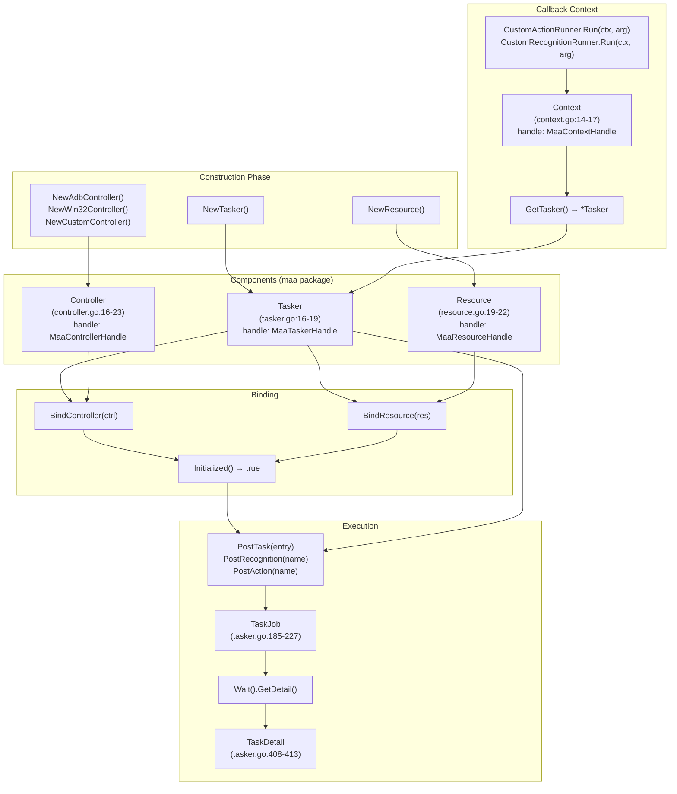
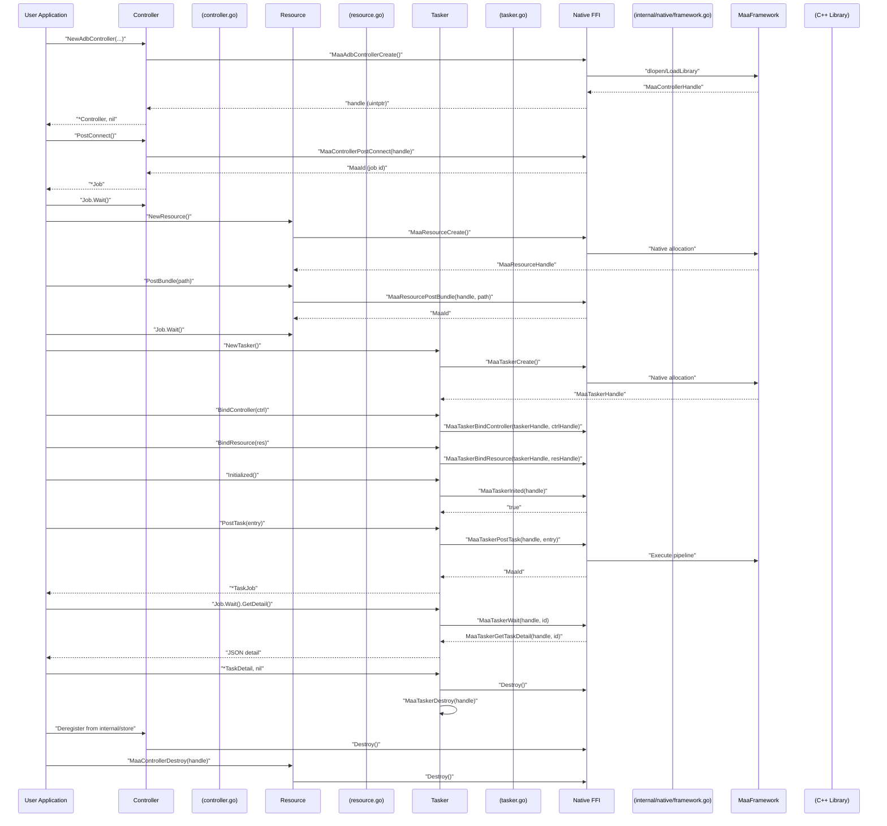
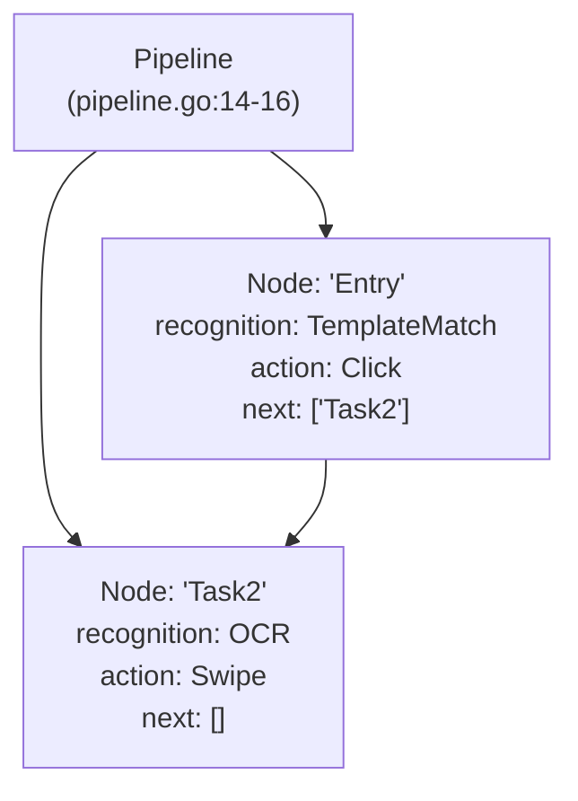
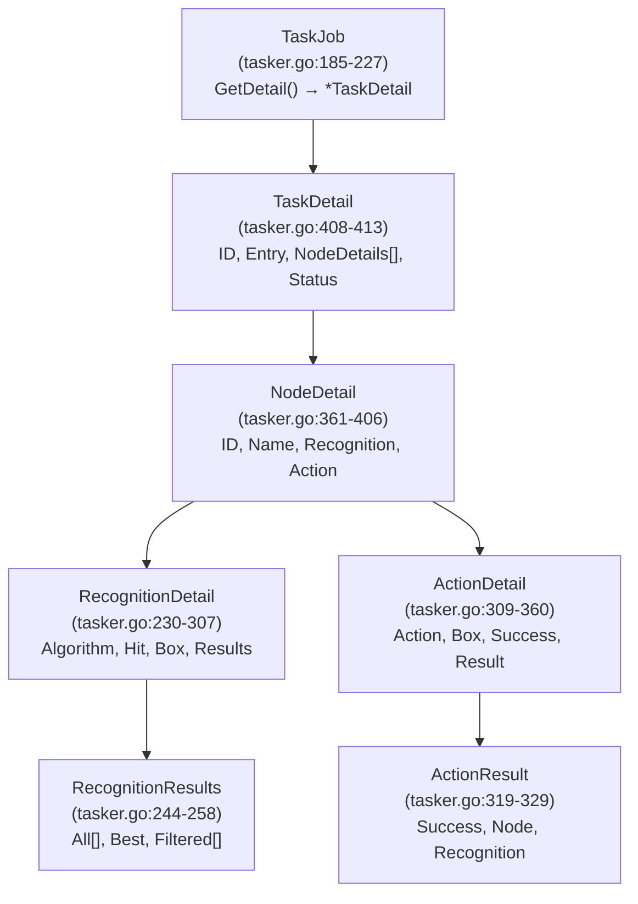

# Core Components

Relevant source files

* [README.md](https://github.com/MaaXYZ/maa-framework-go/blob/5f9c965c/README.md?plain=1)
* [README\_zh.md](https://github.com/MaaXYZ/maa-framework-go/blob/5f9c965c/README_zh.md?plain=1)
* [examples/custom-action/main.go](https://github.com/MaaXYZ/maa-framework-go/blob/5f9c965c/examples/custom-action/main.go)
* [examples/quick-start/main.go](https://github.com/MaaXYZ/maa-framework-go/blob/5f9c965c/examples/quick-start/main.go)

This section documents the four primary components in `maa-framework-go`: `Tasker`, `Controller`, `Resource`, and `Context`. These components form the foundation of the automation framework, with `Tasker` orchestrating task execution, `Controller` managing device interaction, `Resource` holding pipeline definitions and assets, and `Context` providing runtime execution capabilities to custom callbacks.

Detailed API reference is provided in subsections: [Tasker](/MaaXYZ/maa-framework-go/3.1-tasker), [Controller](/MaaXYZ/maa-framework-go/3.2-controller), [Resource](/MaaXYZ/maa-framework-go/3.3-resource), [Context](/MaaXYZ/maa-framework-go/3.4-context), and [Pipeline and Nodes](/MaaXYZ/maa-framework-go/3.5-pipeline-and-nodes). For task execution flow and pipeline protocols, see [Task Definition and Execution](/MaaXYZ/maa-framework-go/4-task-definition-and-execution). For custom extensions (custom actions, recognitions, controllers), see [Extension System](/MaaXYZ/maa-framework-go/5-extension-system).

---

## Component Overview

The four core components form a layered architecture. `Tasker` orchestrates task execution and requires both a `Controller` (device interface) and `Resource` (pipeline/asset container) to be bound before initialization completes. `Context` is not user-constructed—the framework creates it during task execution and passes it to custom callbacks.

**Component Roles and Native Handles**

| Struct | File | Native Type | Role |
| --- | --- | --- | --- |
| `Tasker` | [tasker.go16-19](https://github.com/MaaXYZ/maa-framework-go/blob/5f9c965c/tasker.go#L16-L19) | `MaaTaskerHandle` | Task executor. Orchestrates recognitions and actions using bound controller and resource. |
| `Controller` | [controller.go16-23](https://github.com/MaaXYZ/maa-framework-go/blob/5f9c965c/controller.go#L16-L23) | `MaaControllerHandle` | Device interface. Manages connection, input injection, screen capture. Multiple platform-specific implementations. |
| `Resource` | [resource.go19-22](https://github.com/MaaXYZ/maa-framework-go/blob/5f9c965c/resource.go#L19-L22) | `MaaResourceHandle` | Asset container. Holds pipeline JSON, image templates, OCR models, and custom extension registrations. |
| `Context` | [context.go14-17](https://github.com/MaaXYZ/maa-framework-go/blob/5f9c965c/context.go#L14-L17) | `MaaContextHandle` | Execution context. Passed to custom callbacks; exposes synchronous task and pipeline operations within the current execution scope. |

Each component wraps a native handle (`uintptr`) that references a C++ object in the MaaFramework library. The Go layer communicates with native code via `purego` FFI calls defined in [internal/native/framework.go](https://github.com/MaaXYZ/maa-framework-go/blob/5f9c965c/internal/native/framework.go)

Sources: [tasker.go16-19](https://github.com/MaaXYZ/maa-framework-go/blob/5f9c965c/tasker.go#L16-L19) [controller.go16-23](https://github.com/MaaXYZ/maa-framework-go/blob/5f9c965c/controller.go#L16-L23) [resource.go19-22](https://github.com/MaaXYZ/maa-framework-go/blob/5f9c965c/resource.go#L19-L22) [context.go14-17](https://github.com/MaaXYZ/maa-framework-go/blob/5f9c965c/context.go#L14-L17) [internal/native/framework.go](https://github.com/MaaXYZ/maa-framework-go/blob/5f9c965c/internal/native/framework.go)

---

## Component Relationships and Construction Flow

**Component construction, binding, and execution flow**



The diagram shows the complete lifecycle: construction → binding → initialization check → task execution → callback context access. All operations with native code use the handle-based object model where Go structs wrap `uintptr` handles referencing native MaaFramework objects.

Sources: [tasker.go16-79](https://github.com/MaaXYZ/maa-framework-go/blob/5f9c965c/tasker.go#L16-L79) [controller.go16-82](https://github.com/MaaXYZ/maa-framework-go/blob/5f9c965c/controller.go#L16-L82) [resource.go19-64](https://github.com/MaaXYZ/maa-framework-go/blob/5f9c965c/resource.go#L19-L64) [context.go14-17](https://github.com/MaaXYZ/maa-framework-go/blob/5f9c965c/context.go#L14-L17) [tasker.go185-227](https://github.com/MaaXYZ/maa-framework-go/blob/5f9c965c/tasker.go#L185-L227) [tasker.go408-413](https://github.com/MaaXYZ/maa-framework-go/blob/5f9c965c/tasker.go#L408-L413)

---

## Component Lifecycle

All three user-constructed components (`Tasker`, `Controller`, `Resource`) follow a consistent lifecycle pattern from creation through destruction:

1. **Create** – Constructor allocates native handle via FFI: `NewTasker()`, `NewAdbController()`, `NewResource()`. Returns `(*T, error)`.
2. **Configure** – Post async operations (`PostConnect`, `PostBundle`) and wait for completion via `Job.Wait()`.
3. **Bind** – Attach `Controller` and `Resource` to `Tasker` via `BindController()` and `BindResource()`.
4. **Use** – Execute tasks with `PostTask()`, `PostRecognition()`, `PostAction()`. Returns `*TaskJob` for async result tracking.
5. **Destroy** – Call `Destroy()` to release native handle (`MaaDestroy` FFI call) and deregister all callbacks from internal registries.

Failure to call `Destroy()` results in native memory leaks and orphaned callback registrations in [internal/store](https://github.com/MaaXYZ/maa-framework-go/blob/5f9c965c/internal/store) maps.

**Complete lifecycle sequence with native FFI calls**



This sequence shows how each Go method maps to specific FFI calls in [internal/native/framework.go](https://github.com/MaaXYZ/maa-framework-go/blob/5f9c965c/internal/native/framework.go) and how handles are passed between layers.

Sources: [tasker.go22-55](https://github.com/MaaXYZ/maa-framework-go/blob/5f9c965c/tasker.go#L22-L55) [controller.go28-82](https://github.com/MaaXYZ/maa-framework-go/blob/5f9c965c/controller.go#L28-L82) [resource.go27-64](https://github.com/MaaXYZ/maa-framework-go/blob/5f9c965c/resource.go#L27-L64) [internal/native/framework.go](https://github.com/MaaXYZ/maa-framework-go/blob/5f9c965c/internal/native/framework.go) [internal/store/store.go](https://github.com/MaaXYZ/maa-framework-go/blob/5f9c965c/internal/store/store.go)

---

## Tasker

`Tasker` is the central orchestrator defined in [tasker.go16-19](https://github.com/MaaXYZ/maa-framework-go/blob/5f9c965c/tasker.go#L16-L19) It executes tasks by coordinating recognition (via `Controller` screen capture) and actions (via `Controller` input injection) according to pipeline definitions loaded in the bound `Resource`.

**Key methods and FFI mappings**

| Method | Native FFI Call | Purpose |
| --- | --- | --- |
| `NewTasker()` | `MaaTaskerCreate` | Allocate native tasker handle |
| `BindController(ctrl)` | `MaaTaskerBindController` | Attach controller for device I/O |
| `BindResource(res)` | `MaaTaskerBindResource` | Attach resource for pipeline definitions |
| `Initialized()` | `MaaTaskerInited` | Check if both controller and resource bound |
| `PostTask(entry)` | `MaaTaskerPostTask` | Queue task execution, returns `*TaskJob` |
| `PostRecognition(name)` | `MaaTaskerPostRecognition` | Run recognition only, returns `*TaskJob` |
| `PostAction(name)` | `MaaTaskerPostAction` | Run action only, returns `*TaskJob` |
| `PostStop()` | `MaaTaskerPostStop` | Request task cancellation |
| `Running()` | `MaaTaskerRunning` | Check if any tasks executing |
| `GetTaskDetail(id)` | `MaaTaskerGetTaskDetail` | Retrieve task execution details |
| `ClearCache()` | `MaaTaskerClearCache` | Clear recognition template cache |
| `Destroy()` | `MaaTaskerDestroy` | Release native handle |

`Initialized()` returns `true` only after successful `BindController` and `BindResource` calls. Task posting before initialization produces failed jobs.

**Task execution state machine**

```
#mermaid-xw4wusqkmwh{font-family:ui-sans-serif,-apple-system,system-ui,Segoe UI,Helvetica;font-size:16px;fill:#333;}@keyframes edge-animation-frame{from{stroke-dashoffset:0;}}@keyframes dash{to{stroke-dashoffset:0;}}#mermaid-xw4wusqkmwh .edge-animation-slow{stroke-dasharray:9,5!important;stroke-dashoffset:900;animation:dash 50s linear infinite;stroke-linecap:round;}#mermaid-xw4wusqkmwh .edge-animation-fast{stroke-dasharray:9,5!important;stroke-dashoffset:900;animation:dash 20s linear infinite;stroke-linecap:round;}#mermaid-xw4wusqkmwh .error-icon{fill:#dddddd;}#mermaid-xw4wusqkmwh .error-text{fill:#222222;stroke:#222222;}#mermaid-xw4wusqkmwh .edge-thickness-normal{stroke-width:1px;}#mermaid-xw4wusqkmwh .edge-thickness-thick{stroke-width:3.5px;}#mermaid-xw4wusqkmwh .edge-pattern-solid{stroke-dasharray:0;}#mermaid-xw4wusqkmwh .edge-thickness-invisible{stroke-width:0;fill:none;}#mermaid-xw4wusqkmwh .edge-pattern-dashed{stroke-dasharray:3;}#mermaid-xw4wusqkmwh .edge-pattern-dotted{stroke-dasharray:2;}#mermaid-xw4wusqkmwh .marker{fill:#999;stroke:#999;}#mermaid-xw4wusqkmwh .marker.cross{stroke:#999;}#mermaid-xw4wusqkmwh svg{font-family:ui-sans-serif,-apple-system,system-ui,Segoe UI,Helvetica;font-size:16px;}#mermaid-xw4wusqkmwh p{margin:0;}#mermaid-xw4wusqkmwh defs #statediagram-barbEnd{fill:#999;stroke:#999;}#mermaid-xw4wusqkmwh g.stateGroup text{fill:#dddddd;stroke:none;font-size:10px;}#mermaid-xw4wusqkmwh g.stateGroup text{fill:#333;stroke:none;font-size:10px;}#mermaid-xw4wusqkmwh g.stateGroup .state-title{font-weight:bolder;fill:#333;}#mermaid-xw4wusqkmwh g.stateGroup rect{fill:#ffffff;stroke:#dddddd;}#mermaid-xw4wusqkmwh g.stateGroup line{stroke:#999;stroke-width:1;}#mermaid-xw4wusqkmwh .transition{stroke:#999;stroke-width:1;fill:none;}#mermaid-xw4wusqkmwh .stateGroup .composit{fill:#f4f4f4;border-bottom:1px;}#mermaid-xw4wusqkmwh .stateGroup .alt-composit{fill:#e0e0e0;border-bottom:1px;}#mermaid-xw4wusqkmwh .state-note{stroke:#e6d280;fill:#fff5ad;}#mermaid-xw4wusqkmwh .state-note text{fill:#333;stroke:none;font-size:10px;}#mermaid-xw4wusqkmwh .stateLabel .box{stroke:none;stroke-width:0;fill:#ffffff;opacity:0.5;}#mermaid-xw4wusqkmwh .edgeLabel .label rect{fill:#ffffff;opacity:0.5;}#mermaid-xw4wusqkmwh .edgeLabel{background-color:#ffffff;text-align:center;}#mermaid-xw4wusqkmwh .edgeLabel p{background-color:#ffffff;}#mermaid-xw4wusqkmwh .edgeLabel rect{opacity:0.5;background-color:#ffffff;fill:#ffffff;}#mermaid-xw4wusqkmwh .edgeLabel .label text{fill:#333;}#mermaid-xw4wusqkmwh .label div .edgeLabel{color:#333;}#mermaid-xw4wusqkmwh .stateLabel text{fill:#333;font-size:10px;font-weight:bold;}#mermaid-xw4wusqkmwh .node circle.state-start{fill:#999;stroke:#999;}#mermaid-xw4wusqkmwh .node .fork-join{fill:#999;stroke:#999;}#mermaid-xw4wusqkmwh .node circle.state-end{fill:#dddddd;stroke:#f4f4f4;stroke-width:1.5;}#mermaid-xw4wusqkmwh .end-state-inner{fill:#f4f4f4;stroke-width:1.5;}#mermaid-xw4wusqkmwh .node rect{fill:#ffffff;stroke:#dddddd;stroke-width:1px;}#mermaid-xw4wusqkmwh .node polygon{fill:#ffffff;stroke:#dddddd;stroke-width:1px;}#mermaid-xw4wusqkmwh #statediagram-barbEnd{fill:#999;}#mermaid-xw4wusqkmwh .statediagram-cluster rect{fill:#ffffff;stroke:#dddddd;stroke-width:1px;}#mermaid-xw4wusqkmwh .cluster-label,#mermaid-xw4wusqkmwh .nodeLabel{color:#333;}#mermaid-xw4wusqkmwh .statediagram-cluster rect.outer{rx:5px;ry:5px;}#mermaid-xw4wusqkmwh .statediagram-state .divider{stroke:#dddddd;}#mermaid-xw4wusqkmwh .statediagram-state .title-state{rx:5px;ry:5px;}#mermaid-xw4wusqkmwh .statediagram-cluster.statediagram-cluster .inner{fill:#f4f4f4;}#mermaid-xw4wusqkmwh .statediagram-cluster.statediagram-cluster-alt .inner{fill:#f8f8f8;}#mermaid-xw4wusqkmwh .statediagram-cluster .inner{rx:0;ry:0;}#mermaid-xw4wusqkmwh .statediagram-state rect.basic{rx:5px;ry:5px;}#mermaid-xw4wusqkmwh .statediagram-state rect.divider{stroke-dasharray:10,10;fill:#f8f8f8;}#mermaid-xw4wusqkmwh .note-edge{stroke-dasharray:5;}#mermaid-xw4wusqkmwh .statediagram-note rect{fill:#fff5ad;stroke:#e6d280;stroke-width:1px;rx:0;ry:0;}#mermaid-xw4wusqkmwh .statediagram-note rect{fill:#fff5ad;stroke:#e6d280;stroke-width:1px;rx:0;ry:0;}#mermaid-xw4wusqkmwh .statediagram-note text{fill:#333;}#mermaid-xw4wusqkmwh .statediagram-note .nodeLabel{color:#333;}#mermaid-xw4wusqkmwh .statediagram .edgeLabel{color:red;}#mermaid-xw4wusqkmwh #dependencyStart,#mermaid-xw4wusqkmwh #dependencyEnd{fill:#999;stroke:#999;stroke-width:1;}#mermaid-xw4wusqkmwh .statediagramTitleText{text-anchor:middle;font-size:18px;fill:#333;}#mermaid-xw4wusqkmwh :root{--mermaid-font-family:"trebuchet ms",verdana,arial,sans-serif;}

"NewTasker()"


"BindController()"


"BindResource()"


"BindResource()"


"BindController()"


"PostTask()"


"Multiple tasks"


"All tasks complete"


"PostStop()"


"Stopped"


"Destroy()"


"Destroy()"


"Destroy()"


"Destroy()"


Created


Bound_Controller


Bound_Resource


Initialized


Running


Stopping


Destroyed
```

Full API reference: [Tasker](/MaaXYZ/maa-framework-go/3.1-tasker)

Sources: [tasker.go16-79](https://github.com/MaaXYZ/maa-framework-go/blob/5f9c965c/tasker.go#L16-L79) [tasker.go81-182](https://github.com/MaaXYZ/maa-framework-go/blob/5f9c965c/tasker.go#L81-L182) [internal/native/framework.go](https://github.com/MaaXYZ/maa-framework-go/blob/5f9c965c/internal/native/framework.go)

---

## Controller

`Controller` manages device I/O and is defined in [controller.go16-23](https://github.com/MaaXYZ/maa-framework-go/blob/5f9c965c/controller.go#L16-L23) Platform-specific constructors create controllers with appropriate native backend handles.

**Platform-specific constructors and native types**

| Constructor | Native FFI Call | Platform | Native Backend |
| --- | --- | --- | --- |
| `NewAdbController` | `MaaAdbControllerCreate` | All | ADB connection (Android) |
| `NewWin32Controller` | `MaaWin32ControllerCreate` | Windows | Win32 API (Desktop window) |
| `NewPlayCoverController` | `MaaPlayCoverControllerCreate` | macOS | PlayCover bridge (iOS apps) |
| `NewWlRootsController` | `MaaWlRootsControllerCreate` | Linux | wlroots protocol (Wayland) |
| `NewGamepadController` | `MaaGamepadControllerCreate` | Windows | ViGEm driver (Virtual gamepad) |
| `NewCarouselImageController` | `MaaCarouselImageControllerCreate` | All | Testing (cycles images) |
| `NewBlankController` | `MaaBlankControllerCreate` | All | Testing (blank images) |
| `NewCustomController` | `MaaCustomControllerCreate` + callbacks | All | User-supplied implementation |

After construction, `PostConnect().Wait()` must succeed before binding to `Tasker`. The controller provides async input methods (`PostClick`, `PostSwipe`, `PostKey`) that return `*Job`, screenshot configuration (`SetScreenshotTargetLongSide`, `CacheImage`), and status queries (`Connected`, `GetUUID`, `GetResolution`).

**Controller method categories**

| Category | Methods | Purpose |
| --- | --- | --- |
| Connection | `PostConnect()`, `Connected()` | Establish/check device connection |
| Input | `PostClick()`, `PostSwipe()`, `PostKey()`, `PostInputText()`, `PostTouchDown/Move/Up()` | Inject user input events |
| Screen | `PostScreencap()`, `CacheImage()`, `GetCachedImage()` | Capture and cache screenshots |
| Configuration | `SetScreenshotTargetLongSide()`, `SetScreenshotTargetShortSide()` | Configure screenshot dimensions |
| Status | `GetUUID()`, `GetResolution()` | Query device properties |

Full API reference: [Controller](/MaaXYZ/maa-framework-go/3.2-controller)

Sources: [controller.go16-82](https://github.com/MaaXYZ/maa-framework-go/blob/5f9c965c/controller.go#L16-L82) [controller.go84-228](https://github.com/MaaXYZ/maa-framework-go/blob/5f9c965c/controller.go#L84-L228) [internal/native/framework.go](https://github.com/MaaXYZ/maa-framework-go/blob/5f9c965c/internal/native/framework.go)

---

## Resource

`Resource` is the asset and pipeline container defined in [resource.go19-22](https://github.com/MaaXYZ/maa-framework-go/blob/5f9c965c/resource.go#L19-L22) It loads pipeline JSON files, image templates, OCR models, and manages custom extension registrations.

**Core resource operations**

| Method | Native FFI Call | Purpose |
| --- | --- | --- |
| `NewResource()` | `MaaResourceCreate` | Allocate native resource handle |
| `PostBundle(path)` | `MaaResourcePostBundle` | Load pipeline directory, returns `*Job` |
| `PostOcrModel(path, name)` | `MaaResourcePostOcrModel` | Load OCR model (ppocr\_v4, etc.) |
| `PostPipeline(name, json)` | `MaaResourcePostPipeline` | Register pipeline from JSON string |
| `PostImage(name, path)` | `MaaResourcePostImage` | Register image template |
| `Loaded()` | `MaaResourceLoaded` | Check if bundle loaded successfully |
| `GetHash()` | `MaaResourceGetHash` | Get resource content hash |
| `GetNode(name)` | `MaaResourceGetNode` | Retrieve node JSON definition |
| `GetNodeList()` | `MaaResourceGetNodeList` | List all node names |
| `Destroy()` | `MaaResourceDestroy` | Release native handle |

**Runtime override operations**

| Method | Native FFI Call | Purpose |
| --- | --- | --- |
| `OverridePipeline(name, json)` | `MaaResourceSetPipelineOverride` | Modify pipeline without reloading |
| `OverrideNext(name, nextList)` | `MaaResourceSetNextOverride` | Change node navigation |
| `OverrideImage(name, path)` | `MaaResourceSetImageOverride` | Replace template image |

**Inference backend configuration**

| Method | Native FFI Call | Purpose |
| --- | --- | --- |
| `UseCPU()` | `MaaResourceUseCPU` | CPU-only inference |
| `UseDirectml(device)` | `MaaResourceUseDirectml` | DirectML (Windows GPU) |
| `UseCoreml(device)` | `MaaResourceUseCoreml` | CoreML (Apple Neural Engine) |
| `UseAutoExecutionProvider()` | `MaaResourceUseAutoExecutionProvider` | Automatic backend selection |

**Custom extension registration**

Custom actions and recognitions are registered via `RegisterCustomAction(name, impl)` and `RegisterCustomRecognition(name, impl)`. These store Go implementations in [internal/store](https://github.com/MaaXYZ/maa-framework-go/blob/5f9c965c/internal/store) maps, indexed by auto-generated IDs. The native layer receives a callback function pointer and the ID, which it uses to invoke the correct Go implementation during pipeline execution.

`PostBundle` is asynchronous. The returned `*Job` must complete (`Wait()`) before binding to `Tasker`, otherwise pipeline nodes are unavailable.

Full API reference: [Resource](/MaaXYZ/maa-framework-go/3.3-resource)

Sources: [resource.go19-155](https://github.com/MaaXYZ/maa-framework-go/blob/5f9c965c/resource.go#L19-L155) [resource.go157-253](https://github.com/MaaXYZ/maa-framework-go/blob/5f9c965c/resource.go#L157-L253) [internal/store/store.go](https://github.com/MaaXYZ/maa-framework-go/blob/5f9c965c/internal/store/store.go) [internal/native/framework.go](https://github.com/MaaXYZ/maa-framework-go/blob/5f9c965c/internal/native/framework.go)

---

## Context

`Context` is the runtime execution environment defined in [context.go14-17](https://github.com/MaaXYZ/maa-framework-go/blob/5f9c965c/context.go#L14-L17) It is never constructed by user code—the framework creates it during task execution and passes it to `CustomActionRunner.Run` and `CustomRecognitionRunner.Run` callbacks.

**Context execution methods**

| Method | Native FFI Call | Purpose |
| --- | --- | --- |
| `RunTask(entry)` | `MaaContextRunTask` | Synchronously execute pipeline from entry node |
| `RunRecognition(name, image)` | `MaaContextRunRecognition` | Run recognition node |
| `RunAction(name, box, detail)` | `MaaContextRunAction` | Run action node |
| `RunRecognitionDirect(...)` | `MaaContextRunRecognitionDirect` | Direct recognition (no pipeline lookup) |
| `RunActionDirect(...)` | `MaaContextRunActionDirect` | Direct action (no pipeline lookup) |

**Context state access and modification**

| Method | Native FFI Call | Purpose |
| --- | --- | --- |
| `GetTasker()` | `MaaContextGetTasker` | Get owning `*Tasker` handle |
| `GetTaskJob()` | `MaaContextGetTaskJob` | Get current `*TaskJob` |
| `OverridePipeline(name, json)` | `MaaContextOverridePipeline` | Modify pipeline at runtime |
| `OverrideNext(name, list)` | `MaaContextOverrideNext` | Change node navigation |
| `OverrideImage(name, path)` | `MaaContextOverrideImage` | Replace template image |

**Anchor and hit count management**

Anchors mark specific nodes for later reference. Hit counts track how many times a node has matched.

| Method | Native FFI Call | Purpose |
| --- | --- | --- |
| `SetAnchor(name, nodeName)` | `MaaContextSetAnchor` | Mark node with anchor name |
| `GetAnchor(name)` | `MaaContextGetAnchor` | Retrieve anchored node name |
| `GetHitCount(nodeName)` | `MaaContextGetHitCount` | Get recognition match count |
| `ClearHitCount(nodeName)` | `MaaContextClearHitCount` | Reset match count |

**Screen stability detection**

| Method | Native FFI Call | Purpose |
| --- | --- | --- |
| `WaitFreezes(target, timeout, threshold)` | `MaaContextWaitFreezes` | Block until screen stabilizes (pixel difference below threshold) |

All `Context` operations are synchronous and execute within the callback's thread context. They block until completion or timeout.

**Context lifetime and thread safety**

The `Context` handle is valid only during the callback invocation. Storing it and accessing it after the callback returns causes undefined behavior. All operations must complete before the callback returns.

Full API reference: [Context](/MaaXYZ/maa-framework-go/3.4-context)

Sources: [context.go14-17](https://github.com/MaaXYZ/maa-framework-go/blob/5f9c965c/context.go#L14-L17) [context.go38-157](https://github.com/MaaXYZ/maa-framework-go/blob/5f9c965c/context.go#L38-L157) [context.go393-411](https://github.com/MaaXYZ/maa-framework-go/blob/5f9c965c/context.go#L393-L411) [internal/native/framework.go](https://github.com/MaaXYZ/maa-framework-go/blob/5f9c965c/internal/native/framework.go)

---

## Pipeline and Nodes

Pipeline definitions describe task flow as a graph of nodes. Each node specifies recognition criteria, actions to perform on match, and navigation to subsequent nodes. Pipelines are loaded from JSON files via `Resource.PostBundle()` and referenced by entry node name in `Tasker.PostTask()`.

The `Pipeline` type defined in [pipeline.go14-16](https://github.com/MaaXYZ/maa-framework-go/blob/5f9c965c/pipeline.go#L14-L16) provides a programmatic way to construct node graphs without JSON. Nodes can be added via `AddNode()` and the pipeline can be posted to a `Resource` via `PostPipeline()`.

**Pipeline construction example structure**



Detailed pipeline structure, node configuration, recognition types, and action types are documented in [Pipeline and Nodes](/MaaXYZ/maa-framework-go/3.5-pipeline-and-nodes) and [Task Definition and Execution](/MaaXYZ/maa-framework-go/4-task-definition-and-execution).

Sources: [pipeline.go14-40](https://github.com/MaaXYZ/maa-framework-go/blob/5f9c965c/pipeline.go#L14-L40) [resource.go66-84](https://github.com/MaaXYZ/maa-framework-go/blob/5f9c965c/resource.go#L66-L84) [tasker.go106-115](https://github.com/MaaXYZ/maa-framework-go/blob/5f9c965c/tasker.go#L106-L115)

---

## Task Result Structures

Task execution produces a hierarchical result structure retrieved via `TaskJob.GetDetail()`. The structure captures execution flow, recognition results, and action outcomes.

**Result struct hierarchy and file locations**



**Key result structures**

| Struct | File Location | Key Fields | Description |
| --- | --- | --- | --- |
| `TaskDetail` | [tasker.go408-413](https://github.com/MaaXYZ/maa-framework-go/blob/5f9c965c/tasker.go#L408-L413) | `ID`, `Entry`, `NodeDetails`, `Status` | Complete task execution record |
| `NodeDetail` | [tasker.go361-406](https://github.com/MaaXYZ/maa-framework-go/blob/5f9c965c/tasker.go#L361-L406) | `ID`, `Name`, `Recognition`, `Action`, `RunCompleted` | Single node execution |
| `RecognitionDetail` | [tasker.go230-307](https://github.com/MaaXYZ/maa-framework-go/blob/5f9c965c/tasker.go#L230-L307) | `Algorithm`, `Hit`, `Box`, `DetailJson`, `Results`, `Raw`, `Draws` | Recognition operation result |
| `ActionDetail` | [tasker.go309-360](https://github.com/MaaXYZ/maa-framework-go/blob/5f9c965c/tasker.go#L309-L360) | `Action`, `Box`, `Success`, `DetailJson`, `Result` | Action operation result |
| `RecognitionResults` | [tasker.go244-258](https://github.com/MaaXYZ/maa-framework-go/blob/5f9c965c/tasker.go#L244-L258) | `All`, `Best`, `Filtered` | Multiple recognition matches |
| `ActionResult` | [tasker.go319-329](https://github.com/MaaXYZ/maa-framework-go/blob/5f9c965c/tasker.go#L319-L329) | `Success`, `Node`, `Recognition` | Action execution outcome |

`TaskDetail.NodeDetails` contains the complete execution trace. Each `NodeDetail` includes both recognition and action results. Recognition can produce multiple matches (`Results.All`), with the framework selecting the best match (`Results.Best`) or applying filters (`Results.Filtered`).

Sources: [tasker.go185-227](https://github.com/MaaXYZ/maa-framework-go/blob/5f9c965c/tasker.go#L185-L227) [tasker.go230-413](https://github.com/MaaXYZ/maa-framework-go/blob/5f9c965c/tasker.go#L230-L413)

---

## Event Sinks

All three user-constructed components support attaching event listeners via sink interfaces. `Tasker` has two sink types:

* `TaskerEventSink` — receives `OnTaskerTask` events at the task level
* `ContextEventSink` — receives node-level events (`OnNodePipelineNode`, `OnNodeRecognition`, `OnNodeAction`, etc.)

Convenience one-liner registration methods (`OnTaskerTask`, `OnNodePipelineNodeInContext`, etc.) are available directly on `Tasker` and return a `sinkId` for later removal.

For full event system documentation, see [Event System and Monitoring](/MaaXYZ/maa-framework-go/6-event-system-and-monitoring).

Sources: [tasker.go480-554](https://github.com/MaaXYZ/maa-framework-go/blob/5f9c965c/tasker.go#L480-L554) [tasker.go556-677](https://github.com/MaaXYZ/maa-framework-go/blob/5f9c965c/tasker.go#L556-L677)