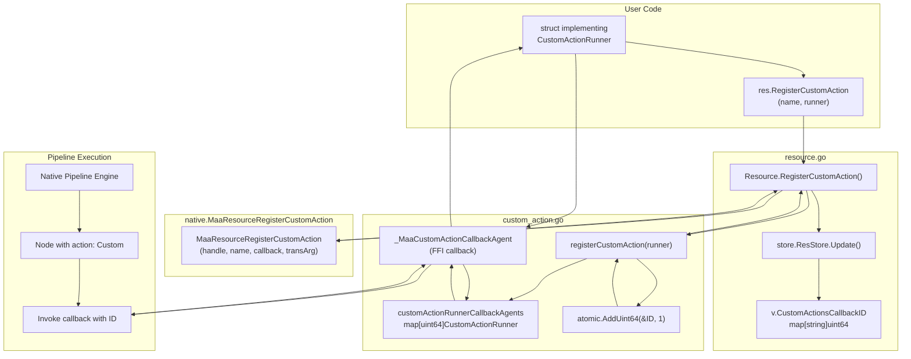
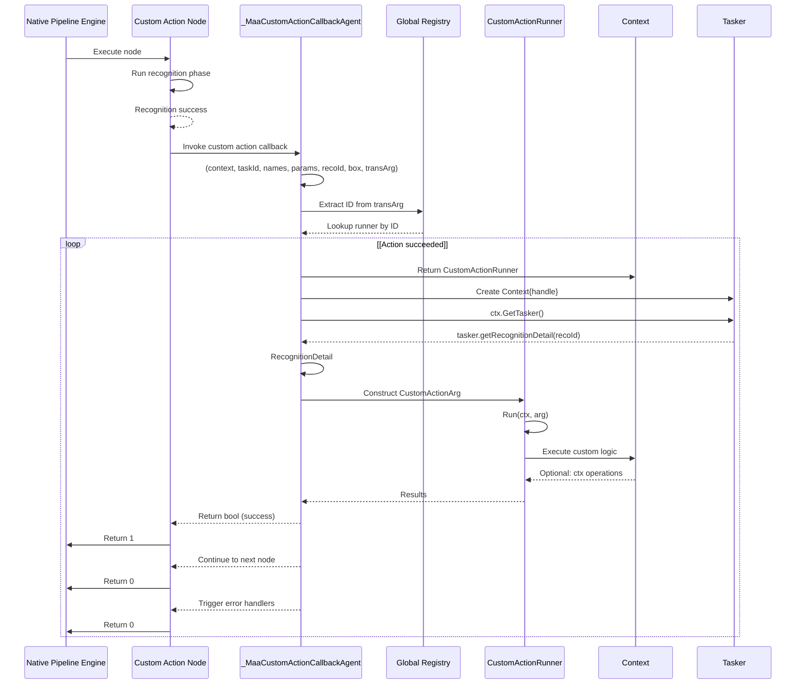
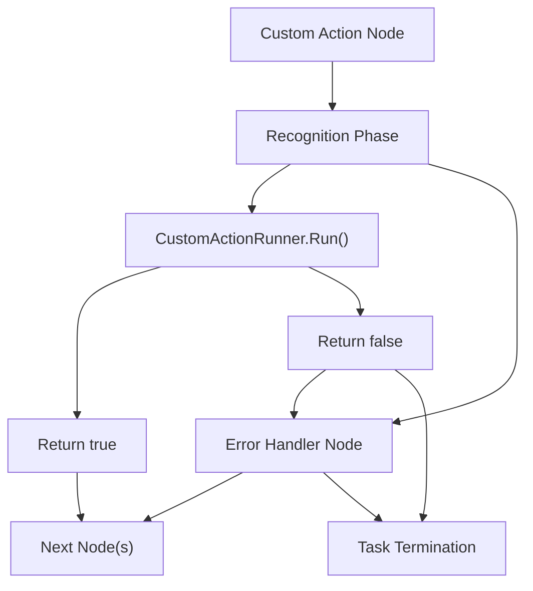

# Custom Actions

Relevant source files

* [context\_test.go](https://github.com/MaaXYZ/maa-framework-go/blob/5f9c965c/context_test.go)
* [custom\_action.go](https://github.com/MaaXYZ/maa-framework-go/blob/5f9c965c/custom_action.go)
* [resource.go](https://github.com/MaaXYZ/maa-framework-go/blob/5f9c965c/resource.go)
* [resource\_test.go](https://github.com/MaaXYZ/maa-framework-go/blob/5f9c965c/resource_test.go)
* [tasker\_test.go](https://github.com/MaaXYZ/maa-framework-go/blob/5f9c965c/tasker_test.go)

This page provides detailed technical documentation for implementing and registering custom actions in maa-framework-go. Custom actions allow users to inject custom Go code that executes during pipeline node execution, enabling complex behaviors beyond the built-in action types.

For a beginner-friendly tutorial on creating your first custom action, see [Your First Custom Action](/MaaXYZ/maa-framework-go/2.4-your-first-custom-action). For information about custom recognition algorithms, see [Custom Recognition](/MaaXYZ/maa-framework-go/5.2-custom-recognition). For custom device control logic, see [Custom Controllers](/MaaXYZ/maa-framework-go/5.3-custom-controllers).

## Overview

Custom actions are user-defined Go functions that execute during the action phase of a pipeline node. They are registered by name through the [Resource](/MaaXYZ/maa-framework-go/3.3-resource) component and invoked by the native framework when a node with `"action": "Custom"` and a matching `"custom_action"` name is encountered during pipeline execution.

Custom actions receive a [Context](/MaaXYZ/maa-framework-go/3.4-context) runtime environment and a `CustomActionArg` structure containing task information, recognition results, and custom parameters. They return a boolean indicating success or failure, which affects pipeline flow control.



**Diagram: Custom Action Registration and Invocation Architecture**

This diagram shows the complete registration flow from user code through the Resource API to the native framework, and the callback invocation path during pipeline execution. Key code entities: `customActionRunnerCallbackAgents` (global map), `_MaaCustomActionCallbackAgent` (FFI bridge function), `store.ResStore` (per-resource storage), and `MaaResourceRegisterCustomAction` (native binding).

Sources: [custom\_action.go10-24](https://github.com/MaaXYZ/maa-framework-go/blob/5f9c965c/custom_action.go#L10-L24) [custom\_action.go50-93](https://github.com/MaaXYZ/maa-framework-go/blob/5f9c965c/custom_action.go#L50-L93) [resource.go214-243](https://github.com/MaaXYZ/maa-framework-go/blob/5f9c965c/resource.go#L214-L243) [internal/store/store.go](https://github.com/MaaXYZ/maa-framework-go/blob/5f9c965c/internal/store/store.go)

## CustomActionRunner Interface

Custom actions must implement the `CustomActionRunner` interface, which defines a single method:

```
```
type CustomActionRunner interface {


Run(ctx *Context, arg *CustomActionArg) bool


}
```
```

### Method Signature

| Component | Type | Description |
| --- | --- | --- |
| `ctx` | `*Context` | Runtime execution context providing access to the tasker, controller, and context operations |
| `arg` | `*CustomActionArg` | Argument structure containing task metadata, recognition results, and custom parameters |
| Return value | `bool` | `true` indicates action success (continue pipeline), `false` indicates failure (may trigger error handlers) |

The `Context` parameter provides methods to interact with the running task:

* Access the tasker via `ctx.GetTasker()`
* Access the controller via `ctx.GetController()`
* Override runtime configurations via `ctx.OverridePipeline()`, `ctx.OverrideNext()`
* Run sub-tasks via `ctx.RunTask()`, `ctx.RunRecognition()`, `ctx.RunAction()`
* Query node information via `ctx.GetNodeName()`, `ctx.GetNodeId()`

Sources: [custom\_action.go46-48](https://github.com/MaaXYZ/maa-framework-go/blob/5f9c965c/custom_action.go#L46-L48)

## CustomActionArg Structure

The `CustomActionArg` structure provides comprehensive information about the current execution context:

```
```
type CustomActionArg struct {


TaskID            int64


CurrentTaskName   string


CustomActionName  string


CustomActionParam string


RecognitionDetail *RecognitionDetail


Box               Rect


}
```
```

### Field Descriptions

| Field | Type | Description |
| --- | --- | --- |
| `TaskID` | `int64` | Unique identifier for the current task. Can be used to retrieve task details via `Tasker.GetTaskDetail(taskId)` |
| `CurrentTaskName` | `string` | Name of the currently executing pipeline node |
| `CustomActionName` | `string` | Name of the custom action as registered via `RegisterCustomAction` |
| `CustomActionParam` | `string` | Custom parameter string from the node's `"custom_action_param"` field. Typically JSON that the action can parse |
| `RecognitionDetail` | `*RecognitionDetail` | Complete recognition result from the node's recognition phase. Contains algorithm-specific results |
| `Box` | `Rect` | Bounding box of the recognized target. Format: `{X, Y, Width, Height}` |

### Recognition Detail Structure

The `RecognitionDetail` field provides access to the full recognition result, including:

* Algorithm type (TemplateMatch, OCR, FeatureMatch, etc.)
* Algorithm-specific results (text for OCR, confidence scores, etc.)
* Raw image data
* Hit status and best match information

For complete documentation of recognition result types, see [Recognition Result Handling](/MaaXYZ/maa-framework-go/4.5-recognition-result-handling).

Sources: [custom\_action.go37-44](https://github.com/MaaXYZ/maa-framework-go/blob/5f9c965c/custom_action.go#L37-L44)

## Registration and Lifecycle

Custom actions are registered through the `Resource` component, which manages the mapping between action names and implementations.

```mermaid
sequenceDiagram
  participant User Code
  participant Resource
  participant registerCustomAction()
  participant Global Registry
  participant store.ResStore
  participant Native Framework

  User Code->>Resource: RegisterCustomAction("ActionName", runner)
  Resource->>registerCustomAction(): registerCustomAction(runner)
  registerCustomAction()->>Global Registry: Store runner with ID
  Global Registry-->>registerCustomAction(): Return ID
  registerCustomAction()-->>Resource: Return ID
  Resource->>Native Framework: MaaResourceRegisterCustomAction(name, callback, ID)
  loop [Registration Success]
    Native Framework-->>Resource: true
    Resource->>store.ResStore: Store name->ID mapping
    store.ResStore-->>Resource: Success
    Resource-->>User Code: nil (success)
    Native Framework-->>Resource: false
    Resource->>Global Registry: unregisterCustomAction(ID)
    Global Registry-->>Resource: Removed
    Resource-->>User Code: error
  end
  note over User Code,Native Framework: Later: Unregistration
  User Code->>Resource: UnregisterCustomAction("ActionName")
  Resource->>store.ResStore: Lookup ID by name
  store.ResStore-->>Resource: ID found
  Resource->>Native Framework: MaaResourceUnregisterCustomAction(name)
  Native Framework-->>Resource: true
  Resource->>store.ResStore: Delete name mapping
  Resource->>Global Registry: unregisterCustomAction(ID)
  Global Registry-->>Resource: Removed
  Resource-->>User Code: nil (success)
```

**Diagram: Custom Action Registration and Unregistration Lifecycle**

### Registration Methods

#### Resource.RegisterCustomAction

```
```
func (r *Resource) RegisterCustomAction(name string, action CustomActionRunner) error
```
```

Registers a custom action runner with the specified name. The name must match the `"custom_action"` field in pipeline nodes that reference this action.

**Behavior:**

* Creates a unique internal ID for the runner
* Stores the runner in the global registry `customActionRunnerCallbackAgents`
* Registers the callback agent with the native framework
* Stores the name-to-ID mapping in the resource's store
* If a custom action with the same name already exists, replaces it and cleans up the old registration

**Returns:** `error` if registration fails with the native framework, `nil` on success.

**Registration replaces:** If a custom action with the same name already exists, it replaces the old registration and cleans up the old callback ID (lines 232-241 in [resource.go214-243](https://github.com/MaaXYZ/maa-framework-go/blob/5f9c965c/resource.go#L214-L243)).

**Example:**

```
```
type MyAction struct{}


func (a *MyAction) Run(ctx *Context, arg *CustomActionArg) bool {


// Implementation


return true


}


resource, _ := maa.NewResource()


err := resource.RegisterCustomAction("MyCustomAction", &MyAction{})


if err != nil {


// Handle error


}
```
```

Sources: [resource.go214-243](https://github.com/MaaXYZ/maa-framework-go/blob/5f9c965c/resource.go#L214-L243)

#### Resource.UnregisterCustomAction

```
```
func (r *Resource) UnregisterCustomAction(name string) error
```
```

Unregisters a previously registered custom action by name.

**Behavior:**

* Looks up the internal ID associated with the name
* Unregisters from the native framework
* Removes the name-to-ID mapping
* Cleans up the global registry entry

**Returns:** `error` if the name is not found or unregistration fails, `nil` on success.

Sources: [resource.go247-269](https://github.com/MaaXYZ/maa-framework-go/blob/5f9c965c/resource.go#L247-L269)

#### Resource.ClearCustomAction

```
```
func (r *Resource) ClearCustomAction() error
```
```

Clears all registered custom actions from the resource.

**Behavior:**

* Calls native framework to clear all custom actions
* Iterates through all stored mappings and unregisters each callback
* Resets the internal mapping table

**Returns:** `error` if the native clear operation fails, `nil` on success.

Sources: [resource.go273-288](https://github.com/MaaXYZ/maa-framework-go/blob/5f9c965c/resource.go#L273-L288)

#### Resource.GetCustomActionList

```
```
func (r *Resource) GetCustomActionList() ([]string, error)
```
```

Retrieves a list of all registered custom action names.

**Returns:** A string slice containing all registered action names, or an error if the query fails.

Sources: [resource.go472-482](https://github.com/MaaXYZ/maa-framework-go/blob/5f9c965c/resource.go#L472-L482)

## Execution Flow

Custom actions are invoked during pipeline execution when a node with custom action configuration is reached.



**Diagram: Custom Action Invocation Flow During Pipeline Execution**

### Callback Agent Function

The `_MaaCustomActionCallbackAgent` function serves as the FFI bridge between native C code and Go implementations:

```
```
func _MaaCustomActionCallbackAgent(


context uintptr,


taskId int64,


currentTaskName, customActionName, customActionParam *byte,


recoId int64,


box uintptr,


transArg uintptr,


) uintptr
```
```

**Parameters from Native Framework:**

* `context`: Handle to the native execution context (MaaContext\*)
* `taskId`: Current task ID
* `currentTaskName`, `customActionName`, `customActionParam`: C string pointers (\*byte)
* `recoId`: Recognition result ID for retrieving detail via `MaaTaskerGetRecognitionDetail`
* `box`: Handle to native `MaaRectHandle` buffer
* `transArg`: The registered callback ID (uint64 passed as uintptr, never dereferenced)

**Internal Operations:**

1. **ID Extraction** (line 60): Converts `transArg` back to uint64 callback ID
2. **Lookup** (lines 62-64): Acquires read lock and looks up `CustomActionRunner` from `customActionRunnerCallbackAgents[id]`
3. **Context Creation** (line 70): Wraps native context handle in `Context{handle: context}`
4. **Recognition Detail** (lines 71-75): Calls `tasker.GetRecognitionDetail(recoId)` to retrieve full recognition result
5. **Buffer Wrapping** (line 76): Creates `RectBuffer` wrapper via `buffer.NewRectBufferByHandle(box)`
6. **String Conversion** (lines 82-84): Converts C string pointers to Go strings using `cStringToString()`
7. **Argument Construction** (lines 78-87): Builds `CustomActionArg` struct
8. **Invocation** (line 78): Calls `action.Run(ctx, &CustomActionArg{...})`
9. **Return Mapping** (lines 89-92): Returns 1 for `true`, 0 for `false`

The key FFI safety mechanism: the callback ID is passed as a `uintptr` value through native code but is never dereferenced as a pointer. It's simply treated as an opaque uint64 identifier for registry lookup.

Sources: [custom\_action.go50-93](https://github.com/MaaXYZ/maa-framework-go/blob/5f9c965c/custom_action.go#L50-L93)

## Return Values and Control Flow

The boolean return value from `CustomActionRunner.Run()` affects pipeline execution:

| Return Value | Native Value | Behavior |
| --- | --- | --- |
| `true` | `1` | Action succeeded. Pipeline continues to the next node as defined in the `"next"` list |
| `false` | `0` | Action failed. Pipeline may invoke error handlers defined in the node's `"on_error"` field |

### Flow Control Implications



**Diagram: Custom Action Return Value Impact on Pipeline Flow**

### Error Handling Patterns

When a custom action returns `false`:

1. If the node defines `"on_error"` handlers, those nodes are executed
2. If no error handlers exist, the task terminates with a failure status
3. Error handlers can either recover (by eventually reaching a valid next node) or propagate the failure

For comprehensive error handling documentation, see [Error Handling](/MaaXYZ/maa-framework-go/4.6-error-handling).

Sources: [custom\_action.go89-92](https://github.com/MaaXYZ/maa-framework-go/blob/5f9c965c/custom_action.go#L89-L92)

## Thread Safety and Concurrency

The custom action registration system uses mutex-based synchronization to ensure thread-safe access to the global callback registry:

```
```
var (


customActionRunnerCallbackID          uint64


customActionRunnerCallbackAgents      = make(map[uint64]CustomActionRunner)


customActionRunnerCallbackAgentsMutex sync.RWMutex


)
```
```

### Thread Safety Guarantees

| Operation | Synchronization | Details |
| --- | --- | --- |
| Registration | Atomic ID generation + Write lock | `atomic.AddUint64` for ID, `sync.RWMutex.Lock()` for map modification |
| Unregistration | Write lock | `sync.RWMutex.Lock()` for map deletion |
| Lookup (during execution) | Read lock | `sync.RWMutex.RLock()` for map access in callback agent |

### Concurrent Execution Considerations

1. **Multiple Tasks:** The same custom action can be invoked concurrently by different tasks. Implementations must be thread-safe if they access shared state.
2. **Resource Store Updates:** The `store.ResStore` uses its own mutex for managing name-to-ID mappings per resource handle.
3. **Callback Lifecycle:** The callback ID is treated as an opaque `uintptr` when passed to native code. The actual uint64 value is never dereferenced as a pointer, avoiding unsafe memory access.

Sources: [custom\_action.go10-35](https://github.com/MaaXYZ/maa-framework-go/blob/5f9c965c/custom_action.go#L10-L35)

## Context Operations

Custom actions receive a `Context` parameter that provides access to the runtime environment. Key operations available within custom actions:

### Accessing Components

```
```
func (a *MyAction) Run(ctx *Context, arg *CustomActionArg) bool {


// Get the tasker


tasker := ctx.GetTasker()


// Get the controller for direct device interaction


controller := ctx.GetController()


// Use controller operations


controller.Click(100, 200)


return true


}
```
```

### Running Sub-Tasks

```
```
func (a *MyAction) Run(ctx *Context, arg *CustomActionArg) bool {


// Run another pipeline node


success := ctx.RunTask("SubTaskNode")


if !success {


return false


}


// Run a recognition without action


recoDetail := ctx.RunRecognition("ImageNode")


if recoDetail != nil {


// Use recognition result


}


return true


}
```
```

### Runtime Overrides

```
```
func (a *MyAction) Run(ctx *Context, arg *CustomActionArg) bool {


// Override next node list dynamically


ctx.OverrideNext("CurrentNode", []maa.NodeNextItem{


{Name: "DynamicNextNode"},


})


// Override pipeline configuration


overrideJSON := `{"SomeNode": {"timeout": 10000}}`


ctx.OverridePipeline(overrideJSON)


return true


}
```
```

For complete Context API documentation, see [Context](/MaaXYZ/maa-framework-go/3.4-context).

Sources: [custom\_action.go46-48](https://github.com/MaaXYZ/maa-framework-go/blob/5f9c965c/custom_action.go#L46-L48)

## Custom Action Parameters

The `CustomActionParam` field in `CustomActionArg` receives the value from the node's `"custom_action_param"` field. This is typically a JSON string that the action can parse for configuration:

**Pipeline Definition:**

```
```
{


"MyNode": {


"recognition": "DirectHit",


"action": "Custom",


"custom_action": "ProcessData",


"custom_action_param": "{\"mode\": \"fast\", \"threshold\": 0.8}"


}


}
```
```

**Custom Action Implementation:**

```
```
type ProcessDataAction struct{}


type ProcessDataParams struct {


Mode      string  `json:"mode"`


Threshold float64 `json:"threshold"`


}


func (a *ProcessDataAction) Run(ctx *Context, arg *CustomActionArg) bool {


var params ProcessDataParams


if err := json.Unmarshal([]byte(arg.CustomActionParam), &params); err != nil {


// Handle parse error


return false


}


// Use params.Mode and params.Threshold


// ...


return true


}
```
```

This pattern allows the same custom action implementation to be reused with different configurations across multiple nodes.

Sources: [custom\_action.go37-44](https://github.com/MaaXYZ/maa-framework-go/blob/5f9c965c/custom_action.go#L37-L44)

## Practical Examples

For complete working examples and step-by-step tutorials on implementing custom actions, see [Your First Custom Action](/MaaXYZ/maa-framework-go/2.4-your-first-custom-action).

Common patterns include:

* **Controller Operations:** Performing complex input sequences not expressible in declarative actions
* **State Management:** Maintaining state across multiple node executions
* **Dynamic Flow Control:** Changing next node lists based on runtime conditions
* **External Integration:** Calling external APIs, databases, or services
* **Data Processing:** Analyzing recognition results and making decisions
* **Logging and Monitoring:** Recording custom metrics or events

## Relationship with Recognition

Custom actions always execute after the recognition phase. The `RecognitionDetail` field in `CustomActionArg` contains the complete recognition result, regardless of the recognition algorithm used (template matching, OCR, custom recognition, etc.).

For nodes using custom recognition, both the custom recognizer and custom action can be from user code, allowing complete control over both phases of node execution.

See [Custom Recognition](/MaaXYZ/maa-framework-go/5.2-custom-recognition) for details on implementing custom recognition algorithms.

Sources: [custom\_action.go37-44](https://github.com/MaaXYZ/maa-framework-go/blob/5f9c965c/custom_action.go#L37-L44)

## Best Practices

1. **Stateless Design:** Design custom actions to be stateless when possible, storing any required state in the Context or external storage.
2. **Error Handling:** Return `false` for actionable errors that should halt pipeline execution. Log warnings for non-critical issues.
3. **Timeout Awareness:** Be aware of node timeout settings. Long-running actions should complete within the configured timeout or risk task termination.
4. **Resource Cleanup:** If your action allocates resources (file handles, connections), ensure they are properly cleaned up before returning.
5. **Parameter Validation:** Always validate `CustomActionParam` input to prevent crashes from malformed configuration.
6. **Thread Safety:** If your action accesses shared state, use appropriate synchronization mechanisms.
7. **Context Usage:** Leverage Context operations (RunTask, GetController) rather than storing references to components.

## Summary

Custom actions provide a powerful extension mechanism for maa-framework-go, enabling:

* Execution of arbitrary Go code during pipeline execution
* Access to recognition results and runtime context
* Control over pipeline flow through return values
* Integration with external systems and services

The registration system is thread-safe, supports multiple custom actions per resource, and allows dynamic registration/unregistration. Custom actions integrate seamlessly with the pipeline execution model, receiving rich context information and providing boolean success/failure feedback that affects flow control.

Sources: [custom\_action.go1-94](https://github.com/MaaXYZ/maa-framework-go/blob/5f9c965c/custom_action.go#L1-L94) [resource.go215-290](https://github.com/MaaXYZ/maa-framework-go/blob/5f9c965c/resource.go#L215-L290)