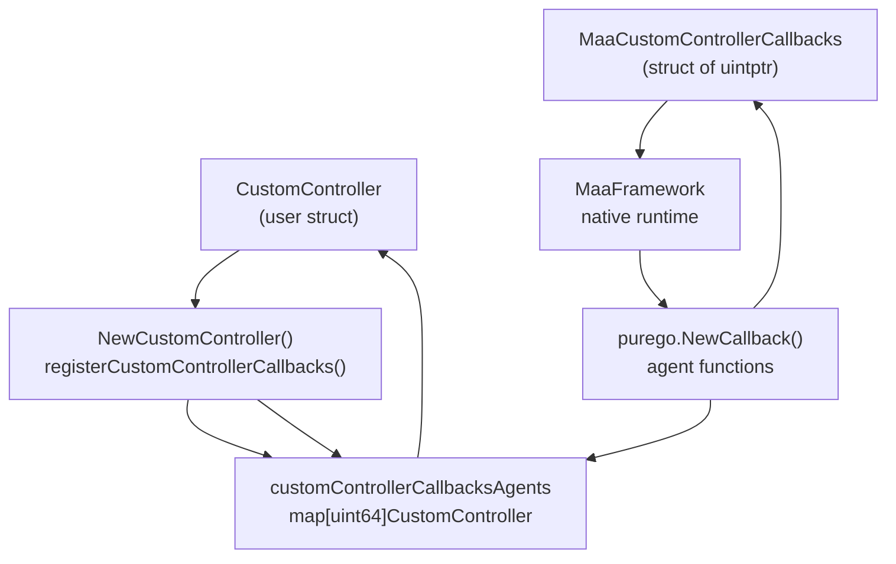
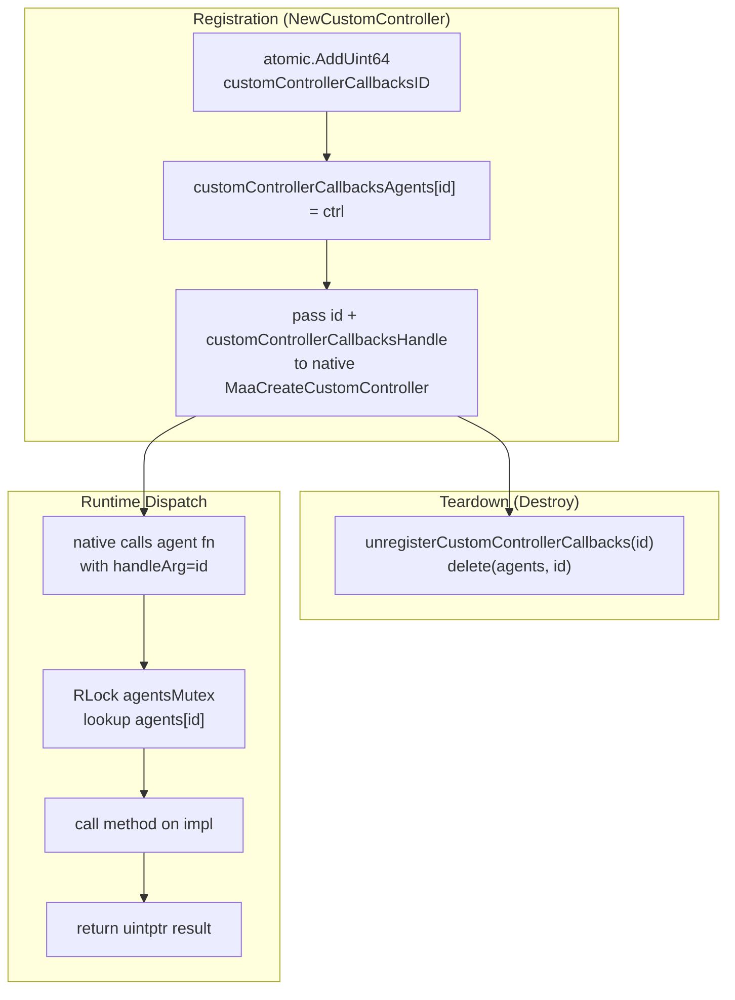
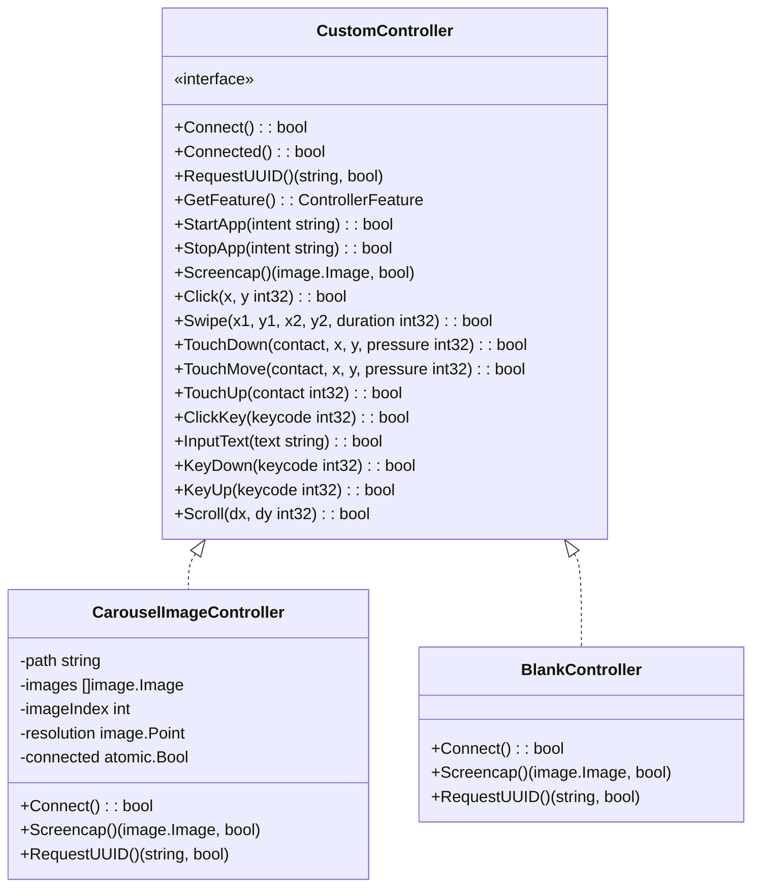

# Custom Controllers

Relevant source files

* [README.md](https://github.com/MaaXYZ/maa-framework-go/blob/5f9c965c/README.md?plain=1)
* [README\_zh.md](https://github.com/MaaXYZ/maa-framework-go/blob/5f9c965c/README_zh.md?plain=1)
* [controller.go](https://github.com/MaaXYZ/maa-framework-go/blob/5f9c965c/controller.go)
* [controller\_test.go](https://github.com/MaaXYZ/maa-framework-go/blob/5f9c965c/controller_test.go)
* [custom\_controller.go](https://github.com/MaaXYZ/maa-framework-go/blob/5f9c965c/custom_controller.go)
* [dbg\_controller.go](https://github.com/MaaXYZ/maa-framework-go/blob/5f9c965c/dbg_controller.go)
* [examples/custom-action/main.go](https://github.com/MaaXYZ/maa-framework-go/blob/5f9c965c/examples/custom-action/main.go)
* [examples/quick-start/main.go](https://github.com/MaaXYZ/maa-framework-go/blob/5f9c965c/examples/quick-start/main.go)
* [internal/native/framework.go](https://github.com/MaaXYZ/maa-framework-go/blob/5f9c965c/internal/native/framework.go)

This page covers the `CustomController` interface, the `ControllerFeature` bitmask, the internal callback bridge that connects Go implementations to MaaFramework's native C layer, and the two built-in debug implementations (`CarouselImageController` and `BlankController`).

For the built-in controller variants (ADB, Win32, PlayCover, Gamepad) that MaaFramework provides directly, see [Controller (3.2)](/MaaXYZ/maa-framework-go/3.2-controller). For the callback and FFI bridge architecture used by all extension points, see [Callback and FFI Bridge Architecture (7.3)](/MaaXYZ/maa-framework-go/7.3-callback-and-ffi-bridge-architecture).

---

## Overview

A custom controller allows you to replace the device interaction layer entirely — screen capture, touch input, keyboard input, app lifecycle — with a Go implementation. This is useful for testing (replaying image sequences), simulator integration, or any device backend not natively supported by MaaFramework.

The flow from a Go `CustomController` to MaaFramework's native runtime is:

**Diagram: CustomController Integration Flow**



Sources: [custom\_controller.go1-108](https://github.com/MaaXYZ/maa-framework-go/blob/5f9c965c/custom_controller.go#L1-L108)

---

## The `CustomController` Interface

Defined in [custom\_controller.go48-66](https://github.com/MaaXYZ/maa-framework-go/blob/5f9c965c/custom_controller.go#L48-L66) `CustomController` is a 17-method interface. Every method maps directly to a native callback slot in `MaaCustomControllerCallbacks`.

| Method | Signature | Description |
| --- | --- | --- |
| `Connect` | `() bool` | Establish the device connection. Called once when `PostConnect` is invoked. |
| `Connected` | `() bool` | Check if the device is currently connected. |
| `RequestUUID` | `() (string, bool)` | Return a stable unique identifier for this device. |
| `GetFeature` | `() ControllerFeature` | Declare which optional input features this controller supports. |
| `StartApp` | `(intent string) bool` | Launch an application by intent/package name. |
| `StopApp` | `(intent string) bool` | Stop an application by intent/package name. |
| `Screencap` | `() (image.Image, bool)` | Capture the current screen. Returns a Go `image.Image`. |
| `Click` | `(x, y int32) bool` | Perform a single tap at screen coordinates. |
| `Swipe` | `(x1, y1, x2, y2, duration int32) bool` | Swipe from one point to another over a given duration (ms). |
| `TouchDown` | `(contact, x, y, pressure int32) bool` | Begin a multi-touch contact. |
| `TouchMove` | `(contact, x, y, pressure int32) bool` | Move a multi-touch contact. |
| `TouchUp` | `(contact int32) bool` | Release a multi-touch contact. |
| `ClickKey` | `(keycode int32) bool` | Press and release a key. |
| `InputText` | `(text string) bool` | Type a string of text. |
| `KeyDown` | `(keycode int32) bool` | Press and hold a key. |
| `KeyUp` | `(keycode int32) bool` | Release a held key. |
| `Scroll` | `(dx, dy int32) bool` | Scroll by a relative offset. |

All methods that fail should return `false`; all successful methods return `true` (or `(value, true)` for methods that produce a value).

Sources: [custom\_controller.go48-66](https://github.com/MaaXYZ/maa-framework-go/blob/5f9c965c/custom_controller.go#L48-L66)

---

## `ControllerFeature` Bitmask

`ControllerFeature` ([custom\_controller.go34-40](https://github.com/MaaXYZ/maa-framework-go/blob/5f9c965c/custom_controller.go#L34-L40)) is a `uint64` bitmask returned by `GetFeature()`. It tells MaaFramework which alternative input styles the controller supports.

| Constant | Value | Meaning |
| --- | --- | --- |
| `ControllerFeatureNone` | `0` | No special features; use default behavior. |
| `ControllerFeatureUseMouseDownAndUpInsteadOfClick` | `1` | Use `TouchDown`/`TouchUp` instead of `Click`. |
| `ControllerFeatureUseKeyboardDownAndUpInsteadOfClick` | `1 << 1` | Use `KeyDown`/`KeyUp` instead of `ClickKey`. |

Features can be combined with bitwise OR if both apply.

Sources: [custom\_controller.go34-40](https://github.com/MaaXYZ/maa-framework-go/blob/5f9c965c/custom_controller.go#L34-L40)

---

## Internal Architecture

### Registration

`NewCustomController` calls `registerCustomControllerCallbacks` ([custom\_controller.go18-26](https://github.com/MaaXYZ/maa-framework-go/blob/5f9c965c/custom_controller.go#L18-L26)), which:

1. Atomically increments `customControllerCallbacksID` to generate a unique `uint64` ID.
2. Stores the `CustomController` implementation in `customControllerCallbacksAgents` under that ID, protected by `customControllerCallbacksAgentsMutex` (`sync.RWMutex`).
3. Returns the ID, which is passed as the `handleArg` parameter to every native callback.

Cleanup (`unregisterCustomControllerCallbacks`, [custom\_controller.go28-32](https://github.com/MaaXYZ/maa-framework-go/blob/5f9c965c/custom_controller.go#L28-L32)) deletes the entry from the map when the controller is destroyed.

### `MaaCustomControllerCallbacks` Struct

`MaaCustomControllerCallbacks` ([custom\_controller.go68-86](https://github.com/MaaXYZ/maa-framework-go/blob/5f9c965c/custom_controller.go#L68-L86)) is a plain struct of `uintptr` fields, one per method. It is passed directly to the native MaaFramework API. The single shared instance `customControllerCallbacksHandle` ([custom\_controller.go88](https://github.com/MaaXYZ/maa-framework-go/blob/5f9c965c/custom_controller.go#L88-L88)) is populated once in `init()` with function pointers created by `purego.NewCallback`.

```
MaaCustomControllerCallbacks
├── Connect     uintptr  → _ConnectAgent
├── Connected   uintptr  → _ConnectedAgent
├── RequestUUID uintptr  → _RequestUUIDAgent
├── GetFeature  uintptr  → _GetFeatureAgent
├── StartApp    uintptr  → _StartAppAgent
├── StopApp     uintptr  → _StopAppAgent
├── Screencap   uintptr  → _ScreencapAgent
├── Click       uintptr  → _ClickAgent
├── Swipe       uintptr  → _SwipeAgent
├── TouchDown   uintptr  → _TouchDownAgent
├── TouchMove   uintptr  → _TouchMoveAgent
├── TouchUp     uintptr  → _TouchUpAgent
├── ClickKey    uintptr  → _ClickKey
├── InputText   uintptr  → _InputText
├── KeyDown     uintptr  → _KeyDown
├── KeyUp       uintptr  → _KeyUp
└── Scroll      uintptr  → _ScrollAgent
```

Sources: [custom\_controller.go68-108](https://github.com/MaaXYZ/maa-framework-go/blob/5f9c965c/custom_controller.go#L68-L108)

### Agent Dispatch Functions

Each agent function follows the same pattern. The native runtime passes the registered numeric ID as the `handleArg` parameter (as a `uintptr`, reinterpreted as `uint64` — it is never dereferenced as a pointer). The agent:

1. Casts `handleArg` to `uint64`.
2. Acquires a read lock on `customControllerCallbacksAgentsMutex`.
3. Looks up the `CustomController` in `customControllerCallbacksAgents`.
4. Calls the corresponding interface method.
5. Returns `uintptr(1)` for success, `uintptr(0)` for failure.

Two agents handle native buffer conversion:

* `_RequestUUIDAgent` ([custom\_controller.go148-168](https://github.com/MaaXYZ/maa-framework-go/blob/5f9c965c/custom_controller.go#L148-L168)): Receives a `uuidBuffer uintptr`, wraps it in `buffer.NewStringBufferByHandle`, and calls `.Set(uuid)` to write the result back.
* `_ScreencapAgent` ([custom\_controller.go224-245](https://github.com/MaaXYZ/maa-framework-go/blob/5f9c965c/custom_controller.go#L224-L245)): Receives an `imgBuffer uintptr`, wraps it in `buffer.NewImageBufferByHandle`, and calls `.Set(img)` to transfer pixel data.

**Diagram: Agent Dispatch for a Single Method**

Sources: [custom\_controller.go110-435](https://github.com/MaaXYZ/maa-framework-go/blob/5f9c965c/custom_controller.go#L110-L435)

---

## Lifecycle Diagram

**Diagram: CustomController Registration and Dispatch Lifecycle**



Sources: [custom\_controller.go18-32](https://github.com/MaaXYZ/maa-framework-go/blob/5f9c965c/custom_controller.go#L18-L32) [custom\_controller.go88-108](https://github.com/MaaXYZ/maa-framework-go/blob/5f9c965c/custom_controller.go#L88-L108)

---

## Debug Implementations

Both implementations live in [dbg\_controller.go](https://github.com/MaaXYZ/maa-framework-go/blob/5f9c965c/dbg_controller.go) and are used in the test suite (see [8.1](/MaaXYZ/maa-framework-go/8.1-testing-utilities)).

### `CarouselImageController`

`CarouselImageController` ([dbg\_controller.go13-173](https://github.com/MaaXYZ/maa-framework-go/blob/5f9c965c/dbg_controller.go#L13-L173)) is a `CustomController` that:

* **On `Connect`**: Reads image files from a path (file or directory, recursively). Supports any format registered with the standard `image` package (PNG, JPEG, GIF decoders are blank-imported). Stores all decoded images in memory.
* **On `Screencap`**: Returns images from its slice in order, wrapping back to the beginning after the last image.
* **UUID**: Returns the configured path string.
* **Feature**: Returns `ControllerFeatureNone`.
* **All input methods** (`Click`, `Swipe`, `TouchDown`, `TouchMove`, `TouchUp`, `ClickKey`, `InputText`, `KeyDown`, `KeyUp`, `Scroll`): Return `true` without any action.

The constructor is `NewCarouselImageController(path string) (*Controller, error)` ([dbg\_controller.go21-25](https://github.com/MaaXYZ/maa-framework-go/blob/5f9c965c/dbg_controller.go#L21-L25)).

`connected` state is tracked with an `atomic.Bool` to make `Connect`/`Connected` thread-safe ([dbg\_controller.go18](https://github.com/MaaXYZ/maa-framework-go/blob/5f9c965c/dbg_controller.go#L18-L18)).

### `BlankController`

`BlankController` ([dbg\_controller.go175-264](https://github.com/MaaXYZ/maa-framework-go/blob/5f9c965c/dbg_controller.go#L175-L264)) is the minimal stub implementation:

* **`Connect`** / **`Connected`**: Always return `true`.
* **`RequestUUID`**: Returns the fixed string `"blank-controller"`.
* **`Screencap`**: Returns a blank 1280×720 `image.RGBA`.
* **All other methods**: Return `true` immediately.

The constructor is `NewBlankController() (*Controller, error)` ([dbg\_controller.go177-179](https://github.com/MaaXYZ/maa-framework-go/blob/5f9c965c/dbg_controller.go#L177-L179)).

**Diagram: Debug Controller Hierarchy**



Sources: [dbg\_controller.go13-264](https://github.com/MaaXYZ/maa-framework-go/blob/5f9c965c/dbg_controller.go#L13-L264)

---

## Summary Table

| Component | File | Role |
| --- | --- | --- |
| `CustomController` | `custom_controller.go` | Interface that callers implement |
| `ControllerFeature` | `custom_controller.go` | Bitmask declaring supported input modes |
| `MaaCustomControllerCallbacks` | `custom_controller.go` | Native callback vtable (struct of `uintptr`) |
| `customControllerCallbacksAgents` | `custom_controller.go` | `map[uint64]CustomController` dispatch table |
| `registerCustomControllerCallbacks` | `custom_controller.go` | Assigns ID and inserts into agent map |
| `unregisterCustomControllerCallbacks` | `custom_controller.go` | Removes from agent map on destroy |
| `_*Agent` functions | `custom_controller.go` | Per-method dispatch functions registered with `purego.NewCallback` |
| `CarouselImageController` | `dbg_controller.go` | Test controller that replays image files |
| `BlankController` | `dbg_controller.go` | Minimal no-op controller for unit tests |

Sources: [custom\_controller.go1-435](https://github.com/MaaXYZ/maa-framework-go/blob/5f9c965c/custom_controller.go#L1-L435) [dbg\_controller.go1-264](https://github.com/MaaXYZ/maa-framework-go/blob/5f9c965c/dbg_controller.go#L1-L264)