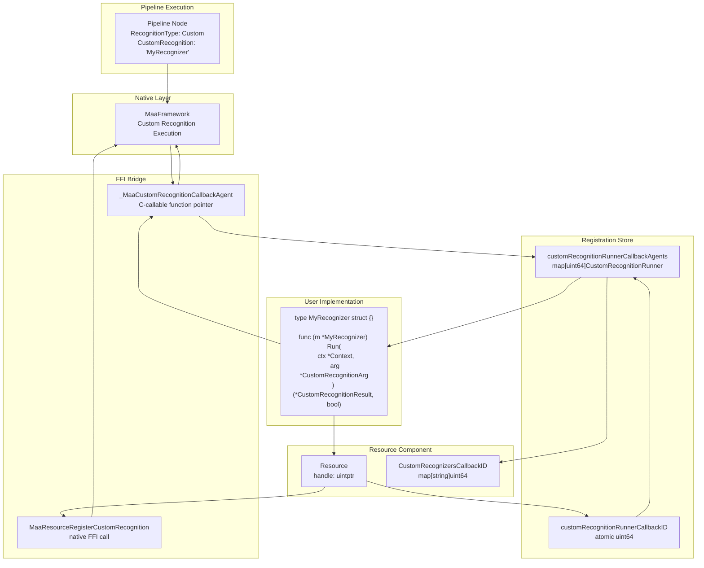
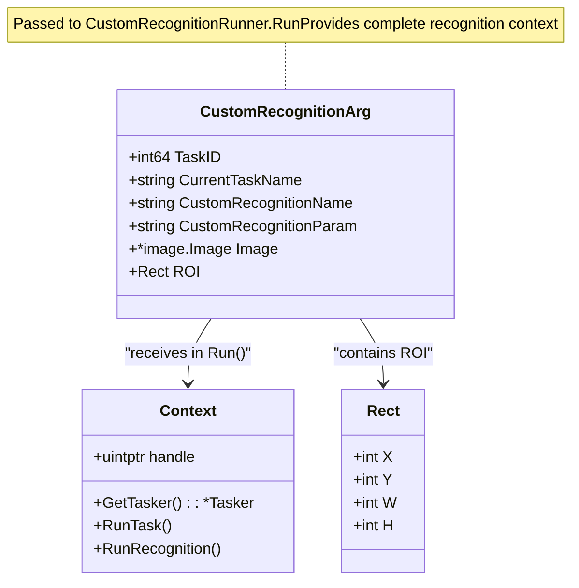
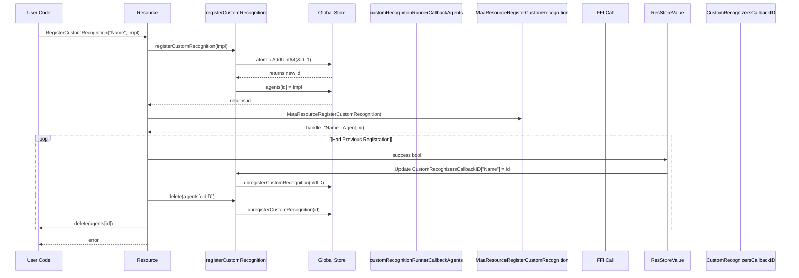
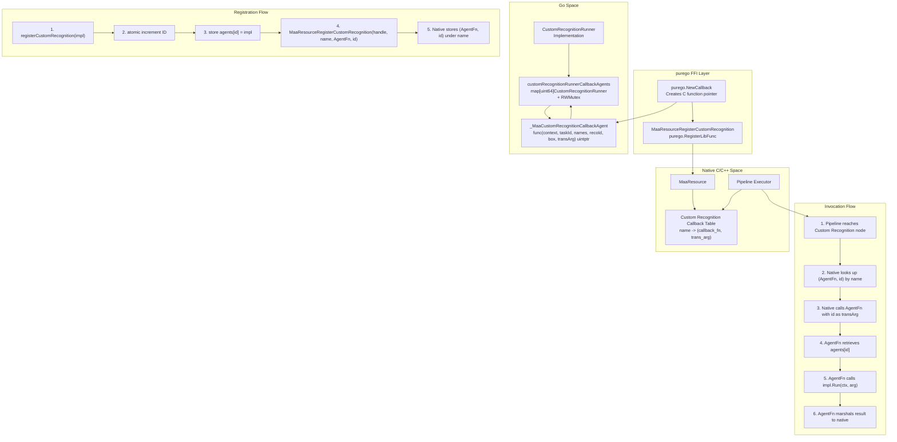
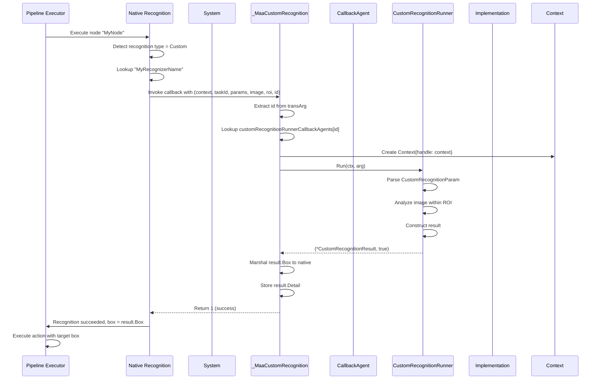

# Custom Recognition

Relevant source files

* [CHANGELOG.md](https://github.com/MaaXYZ/maa-framework-go/blob/5f9c965c/CHANGELOG.md?plain=1)
* [custom\_action.go](https://github.com/MaaXYZ/maa-framework-go/blob/5f9c965c/custom_action.go)
* [recognition\_result\_test.go](https://github.com/MaaXYZ/maa-framework-go/blob/5f9c965c/recognition_result_test.go)
* [resource.go](https://github.com/MaaXYZ/maa-framework-go/blob/5f9c965c/resource.go)

This page provides a detailed technical reference for implementing custom recognition logic in maa-framework-go. Custom recognitions allow users to extend the framework's recognition capabilities beyond the built-in algorithms (template matching, OCR, feature detection, etc.) by providing their own image analysis implementations.

For a beginner-friendly tutorial on creating your first custom recognition, see [Your First Custom Recognition](/MaaXYZ/maa-framework-go/2.5-your-first-custom-recognition). For information about custom actions that often work alongside custom recognitions, see [Custom Actions](/MaaXYZ/maa-framework-go/5.1-custom-actions). For an overview of all recognition types including custom, see [Recognition Types](/MaaXYZ/maa-framework-go/4.2-recognition-types).

---

## Overview

Custom recognition enables user-defined image recognition algorithms to be seamlessly integrated into the framework's pipeline execution. When a pipeline node specifies `RecognitionTypeCustom`, the framework invokes the registered Go function through an FFI callback bridge, passing a `Context` object and recognition parameters. The custom implementation analyzes the image and returns recognition results that the framework uses to determine the next action.

**Key Components:**

* **`CustomRecognitionRunner` interface**: Go interface that custom implementations must satisfy
* **`CustomRecognitionArg`**: Input parameters passed to the recognition function
* **`CustomRecognitionResult`**: Output structure containing bounding box and detail string
* **`Resource.RegisterCustomRecognition`**: Registration method that maps recognition names to implementations
* **FFI callback bridge**: Bidirectional communication layer between native code and Go



**Sources:**

* [resource.go137-212](https://github.com/MaaXYZ/maa-framework-go/blob/5f9c965c/resource.go#L137-L212)
* [custom\_action.go1-94](https://github.com/MaaXYZ/maa-framework-go/blob/5f9c965c/custom_action.go#L1-L94) (similar pattern)
* Diagram 1 (Overall System Layered Architecture)
* Diagram 4 (Resource Management and Extension System)

---

## CustomRecognitionRunner Interface

The `CustomRecognitionRunner` interface defines the contract for custom recognition implementations. It consists of a single method that receives runtime context and recognition parameters, returning a result structure and success status.

### Interface Definition

```
```
type CustomRecognitionRunner interface {


Run(ctx *Context, arg *CustomRecognitionArg) (*CustomRecognitionResult, bool)


}
```
```

**Method Signature:**

* **`ctx *Context`**: Runtime context providing access to framework operations (see [Context](/MaaXYZ/maa-framework-go/3.4-context))
* **`arg *CustomRecognitionArg`**: Input parameters including task details, image, and custom parameters
* **Returns `*CustomRecognitionResult`**: Recognition result containing bounding box and detail data
* **Returns `bool`**: Success indicator; `true` if recognition succeeded, `false` if failed

The `bool` return value determines whether the recognition is considered successful. When `false`, the framework treats it as a recognition failure and may proceed to error handling or retry logic based on the node configuration.

**Sources:**

* Inferred from [custom\_action.go46-48](https://github.com/MaaXYZ/maa-framework-go/blob/5f9c965c/custom_action.go#L46-L48) (parallel interface pattern)
* [recognition\_result\_test.go46-53](https://github.com/MaaXYZ/maa-framework-go/blob/5f9c965c/recognition_result_test.go#L46-L53) (example implementation)

---

## CustomRecognitionArg Structure

The `CustomRecognitionArg` structure provides all necessary input data for the custom recognition function to perform image analysis.



### Field Descriptions

| Field | Type | Description |
| --- | --- | --- |
| `TaskID` | `int64` | Unique identifier for the current task execution. Use with `Tasker.GetTaskDetail(taskID)` to retrieve full task details if needed. |
| `CurrentTaskName` | `string` | Name of the pipeline node currently executing. |
| `CustomRecognitionName` | `string` | Name used when registering this recognition (e.g., "MyRecognizer"). |
| `CustomRecognitionParam` | `string` | JSON string containing custom parameters from the node definition's `custom_recognition_param` field. Parse this to extract algorithm-specific configuration. |
| `Image` | `*image.Image` | Current screenshot captured by the controller. Analyze this image to detect target patterns. |
| `ROI` | `Rect` | Region of Interest - the area within the image where recognition should be performed. Specified by the node's `roi` field. |

**Usage Pattern:**

```
```
func (r *MyRecognizer) Run(ctx *Context, arg *CustomRecognitionArg) (*CustomRecognitionResult, bool) {


// Parse custom parameters


var params struct {


Threshold float64 `json:"threshold"`


}


if err := json.Unmarshal([]byte(arg.CustomRecognitionParam), &params); err != nil {


return nil, false


}


// Access image within ROI


img := (*arg.Image).(*image.RGBA)


roiBounds := image.Rect(arg.ROI.X, arg.ROI.Y,


arg.ROI.X+arg.ROI.W, arg.ROI.Y+arg.ROI.H)


// Perform recognition logic...


return &CustomRecognitionResult{...}, true


}
```
```

**Sources:**

* Inferred from [custom\_action.go37-44](https://github.com/MaaXYZ/maa-framework-go/blob/5f9c965c/custom_action.go#L37-L44) (parallel structure for CustomActionArg)
* [recognition\_result\_test.go48-52](https://github.com/MaaXYZ/maa-framework-go/blob/5f9c965c/recognition_result_test.go#L48-L52) (usage in test)

---

## CustomRecognitionResult Structure

The `CustomRecognitionResult` structure encapsulates the output of a custom recognition operation. The framework uses this result to determine the target area for subsequent actions and to populate recognition detail events.

### Structure Definition

```
```
type CustomRecognitionResult struct {


Box    Rect


Detail string


}
```
```

| Field | Type | Description |
| --- | --- | --- |
| `Box` | `Rect` | Bounding box of the recognized target. Coordinates are absolute within the full image (not relative to ROI). Used as the target for actions like clicks. |
| `Detail` | `string` | JSON string containing additional recognition details. This value is stored in the recognition detail and can be retrieved for debugging or event handling. |

### Bounding Box Requirements

* **Coordinate System**: Absolute coordinates within the full captured image, not relative to the ROI
* **Format**: `Rect{X, Y, W, H}` where `(X, Y)` is the top-left corner and `W, H` are width and height
* **Empty Box**: A box with zero width or height is valid and indicates a point target

**Example:**

```
```
return &CustomRecognitionResult{


Box: Rect{X: 100, Y: 200, W: 50, H: 30},


Detail: `{"confidence": 0.95, "method": "custom_algorithm"}`,


}, true
```
```

**Sources:**

* [recognition\_result\_test.go49-52](https://github.com/MaaXYZ/maa-framework-go/blob/5f9c965c/recognition_result_test.go#L49-L52) (example result construction)
* Inferred from system architecture

---

## Registration and Lifecycle Management

Custom recognition implementations are registered with a `Resource` instance using name-based mapping. The registration process establishes an FFI bridge that enables the native framework to invoke the Go implementation.



### Registration Methods

#### `Resource.RegisterCustomRecognition`

Registers a custom recognition implementation with a given name.

```
```
func (r *Resource) RegisterCustomRecognition(name string, recognition CustomRecognitionRunner) error
```
```

**Parameters:**

* `name`: Unique identifier for this recognition. Referenced in pipeline nodes via `CustomRecognition` field.
* `recognition`: Implementation of `CustomRecognitionRunner` interface.

**Behavior:**

* Generates a unique callback ID via atomic increment [resource.go139](https://github.com/MaaXYZ/maa-framework-go/blob/5f9c965c/resource.go#L139-L139)
* Stores implementation in thread-safe global map [inferred from custom\_action.go16-23](https://github.com/MaaXYZ/maa-framework-go/blob/5f9c965c/inferred from custom_action.go#L16-L23)
* Registers FFI callback with native framework [resource.go141-148](https://github.com/MaaXYZ/maa-framework-go/blob/5f9c965c/resource.go#L141-L148)
* Updates resource-local name→ID mapping [resource.go156-161](https://github.com/MaaXYZ/maa-framework-go/blob/5f9c965c/resource.go#L156-L161)
* If a recognition with the same name was previously registered, unregisters the old implementation [resource.go163-165](https://github.com/MaaXYZ/maa-framework-go/blob/5f9c965c/resource.go#L163-L165)
* On registration failure, cleans up allocated ID [resource.go150](https://github.com/MaaXYZ/maa-framework-go/blob/5f9c965c/resource.go#L150-L150)

**Returns:** `error` if registration fails, `nil` on success.

**Sources:** [resource.go137-167](https://github.com/MaaXYZ/maa-framework-go/blob/5f9c965c/resource.go#L137-L167)

---

#### `Resource.UnregisterCustomRecognition`

Removes a previously registered custom recognition by name.

```
```
func (r *Resource) UnregisterCustomRecognition(name string) error
```
```

**Parameters:**

* `name`: Name of the recognition to unregister.

**Behavior:**

* Looks up callback ID from resource store [resource.go175-180](https://github.com/MaaXYZ/maa-framework-go/blob/5f9c965c/resource.go#L175-L180)
* Calls native unregister function [resource.go184](https://github.com/MaaXYZ/maa-framework-go/blob/5f9c965c/resource.go#L184-L184)
* Removes entry from resource-local mapping [resource.go188-190](https://github.com/MaaXYZ/maa-framework-go/blob/5f9c965c/resource.go#L188-L190)
* Cleans up global callback map [resource.go191](https://github.com/MaaXYZ/maa-framework-go/blob/5f9c965c/resource.go#L191-L191)

**Returns:** `error` if recognition not found or unregistration fails.

**Sources:** [resource.go169-193](https://github.com/MaaXYZ/maa-framework-go/blob/5f9c965c/resource.go#L169-L193)

---

#### `Resource.ClearCustomRecognition`

Removes all custom recognitions registered on this resource.

```
```
func (r *Resource) ClearCustomRecognition() error
```
```

**Behavior:**

* Calls native clear function [resource.go197-199](https://github.com/MaaXYZ/maa-framework-go/blob/5f9c965c/resource.go#L197-L199)
* Collects all callback IDs [resource.go201-206](https://github.com/MaaXYZ/maa-framework-go/blob/5f9c965c/resource.go#L201-L206)
* Clears resource-local mapping [resource.go206](https://github.com/MaaXYZ/maa-framework-go/blob/5f9c965c/resource.go#L206-L206)
* Unregisters all callbacks from global map [resource.go208-210](https://github.com/MaaXYZ/maa-framework-go/blob/5f9c965c/resource.go#L208-L210)

**Returns:** `error` if clearing fails.

**Sources:** [resource.go195-212](https://github.com/MaaXYZ/maa-framework-go/blob/5f9c965c/resource.go#L195-L212)

---

#### `Resource.GetCustomRecognitionList`

Retrieves the list of all registered custom recognition names.

```
```
func (r *Resource) GetCustomRecognitionList() ([]string, error)
```
```

**Returns:** String slice of registered names, or error if retrieval fails.

**Sources:** [resource.go458-469](https://github.com/MaaXYZ/maa-framework-go/blob/5f9c965c/resource.go#L458-L469)

---

### Lifecycle Considerations

1. **Registration Order**: Custom recognitions must be registered before loading pipelines that reference them
2. **Resource Destruction**: When `Resource.Destroy()` is called, all registered custom recognitions are automatically unregistered [resource.go44-60](https://github.com/MaaXYZ/maa-framework-go/blob/5f9c965c/resource.go#L44-L60)
3. **Re-registration**: Registering a name that already exists replaces the previous implementation and cleans up the old callback
4. **Thread Safety**: All registration operations are protected by `sync.RWMutex` on the store [inferred from custom\_action.go19-28](https://github.com/MaaXYZ/maa-framework-go/blob/5f9c965c/inferred from custom_action.go#L19-L28)

**Sources:**

* [resource.go44-60](https://github.com/MaaXYZ/maa-framework-go/blob/5f9c965c/resource.go#L44-L60) (Destroy method)
* [resource.go137-212](https://github.com/MaaXYZ/maa-framework-go/blob/5f9c965c/resource.go#L137-L212) (registration methods)

---

## FFI Bridge Architecture

The custom recognition system uses an FFI callback bridge to enable bidirectional communication between native C/C++ code and Go implementations without CGO. This architecture is built on the `purego` library for dynamic function loading and callback registration.



### Agent Function

The `_MaaCustomRecognitionCallbackAgent` is a C-callable function created using `purego.NewCallback`. It serves as the bridge between native invocations and Go implementations.

**Function Signature** (inferred from [custom\_action.go50-56](https://github.com/MaaXYZ/maa-framework-go/blob/5f9c965c/custom_action.go#L50-L56)):

```
```
func _MaaCustomRecognitionCallbackAgent(


context uintptr,


taskId int64,


currentTaskName *byte,


customRecognitionName *byte,


customRecognitionParam *byte,


image uintptr,


roi uintptr,


transArg uintptr,


) uintptr
```
```

**Parameters:**

* `context`: Handle to native `Context` object
* `taskId`: Current task ID
* `currentTaskName`, `customRecognitionName`, `customRecognitionParam`: C strings (null-terminated byte pointers)
* `image`: Handle to image buffer
* `roi`: Handle to ROI rect buffer
* `transArg`: The callback ID as a pointer (actual uint64 value, not dereferenced)

**Return Value:** `uintptr` where `1` = success, `0` = failure

**Execution Flow:**

1. **ID Extraction**: Extract callback ID from `transArg` [custom\_action.go60](https://github.com/MaaXYZ/maa-framework-go/blob/5f9c965c/custom_action.go#L60-L60)
2. **Lookup**: Retrieve implementation from global map with read lock [custom\_action.go62-64](https://github.com/MaaXYZ/maa-framework-go/blob/5f9c965c/custom_action.go#L62-L64)
3. **Context Creation**: Wrap native context handle in Go `Context` [custom\_action.go70](https://github.com/MaaXYZ/maa-framework-go/blob/5f9c965c/custom_action.go#L70-L70)
4. **Buffer Access**: Convert native image/ROI handles to Go structures
5. **Invocation**: Call `impl.Run(ctx, arg)` [custom\_action.go78-88](https://github.com/MaaXYZ/maa-framework-go/blob/5f9c965c/custom_action.go#L78-L88)
6. **Result Marshaling**: Convert Go result to native format
7. **Return**: Return success indicator [custom\_action.go89-92](https://github.com/MaaXYZ/maa-framework-go/blob/5f9c965c/custom_action.go#L89-L92)

**Sources:**

* [custom\_action.go50-93](https://github.com/MaaXYZ/maa-framework-go/blob/5f9c965c/custom_action.go#L50-L93) (parallel implementation for CustomAction)
* Diagram 5 (FFI Architecture and Native Integration)

---

### Callback ID Management

The system uses atomic counters and thread-safe maps to manage callback registration:

**Global State** (inferred from [custom\_action.go10-14](https://github.com/MaaXYZ/maa-framework-go/blob/5f9c965c/custom_action.go#L10-L14)):

```
```
var (


customRecognitionRunnerCallbackID          uint64  // Atomic counter


customRecognitionRunnerCallbackAgents      map[uint64]CustomRecognitionRunner


customRecognitionRunnerCallbackAgentsMutex sync.RWMutex


)
```
```

**ID Generation** [custom\_action.go16-24](https://github.com/MaaXYZ/maa-framework-go/blob/5f9c965c/custom_action.go#L16-L24):

```
```
func registerCustomRecognition(recognition CustomRecognitionRunner) uint64 {


id := atomic.AddUint64(&customRecognitionRunnerCallbackID, 1)


customRecognitionRunnerCallbackAgentsMutex.Lock()


customRecognitionRunnerCallbackAgents[id] = recognition


customRecognitionRunnerCallbackAgentsMutex.Unlock()


return id


}
```
```

**Cleanup** [custom\_action.go26-35](https://github.com/MaaXYZ/maa-framework-go/blob/5f9c965c/custom_action.go#L26-L35):

```
```
func unregisterCustomRecognition(id uint64) bool {


customRecognitionRunnerCallbackAgentsMutex.Lock()


defer customRecognitionRunnerCallbackAgentsMutex.Unlock()


if _, ok := customRecognitionRunnerCallbackAgents[id]; !ok {


return false


}


delete(customRecognitionRunnerCallbackAgents, id)


return true


}
```
```

**Sources:**

* [custom\_action.go10-35](https://github.com/MaaXYZ/maa-framework-go/blob/5f9c965c/custom_action.go#L10-L35) (parallel pattern)
* Diagram 5 (FFI Architecture)

---

## Thread Safety and Concurrency

Custom recognition implementations may be invoked concurrently by multiple task executions or from different pipeline nodes. The framework provides thread-safe registration, but implementations must handle concurrent access to shared state.

### Framework-Provided Safety

1. **Registration Lock**: All map operations use `sync.RWMutex` to prevent data races during registration/unregistration [custom\_action.go19-28](https://github.com/MaaXYZ/maa-framework-go/blob/5f9c965c/custom_action.go#L19-L28)
2. **Read Lock on Invocation**: Agent function acquires read lock when looking up implementation [custom\_action.go62-64](https://github.com/MaaXYZ/maa-framework-go/blob/5f9c965c/custom_action.go#L62-L64)
3. **Atomic ID Generation**: Callback IDs are generated using `atomic.AddUint64` [custom\_action.go17](https://github.com/MaaXYZ/maa-framework-go/blob/5f9c965c/custom_action.go#L17-L17)
4. **Per-Resource Isolation**: Each `Resource` maintains its own name→ID mapping in `ResStoreValue` with mutex protection

### Implementation Requirements

Custom recognition implementations must be **safe for concurrent invocation**:

```
```
type ConcurrentSafeRecognizer struct {


mu     sync.Mutex


config SafeConfig  // Protected by mu


}


func (r *ConcurrentSafeRecognizer) Run(ctx *Context, arg *CustomRecognitionArg) (*CustomRecognitionResult, bool) {


// If accessing shared mutable state:


r.mu.Lock()


localConfig := r.config  // Make local copy


r.mu.Unlock()


// Perform recognition with local data (no locks held)


// ...


return result, true


}
```
```

**Best Practices:**

* Avoid shared mutable state when possible
* Use local variables or immutable configuration
* If shared state is necessary, protect with `sync.Mutex` or `sync.RWMutex`
* Do not hold locks while performing I/O or expensive operations
* Consider using `sync.Map` for concurrent read-heavy scenarios

**Sources:**

* [custom\_action.go3-35](https://github.com/MaaXYZ/maa-framework-go/blob/5f9c965c/custom_action.go#L3-L35) (thread-safe registration pattern)
* General Go concurrency best practices

---

## Integration with Pipelines

Custom recognitions are referenced in pipeline nodes through the `RecognitionTypeCustom` recognition type and the `CustomRecognition` field.

### Node Configuration

**JSON Pipeline Definition:**

```
```
{


"MyNode": {


"recognition": {


"type": "Custom",


"custom_recognition": "MyRecognizerName",


"custom_recognition_param": {


"threshold": 0.8,


"method": "enhanced"


}


},


"action": {


"type": "Click",


"target": "self"


}


}


}
```
```

**Go Pipeline Construction:**

```
```
import "github.com/MaaXYZ/maa-framework-go/v4"


// Register recognition first


err := resource.RegisterCustomRecognition("MyRecognizerName", &MyRecognizer{})


if err != nil {


return err


}


// Create node with custom recognition


node := maa.NewNode("MyNode").


SetRecognition(maa.RecCustom(maa.CustomRecognitionParam{


CustomRecognition: "MyRecognizerName",


CustomRecognitionParam: map[string]any{


"threshold": 0.8,


"method": "enhanced",


},


})).


SetAction(maa.ActClick(maa.ClickParam{Target: "self"}))


pipeline := maa.NewPipeline()


pipeline.AddNode(node)
```
```

### Execution Flow



### Recognition Result Usage

The `Box` returned by custom recognition becomes the target for subsequent actions:

| Action Type | How Box is Used |
| --- | --- |
| `Click` | Click center of box when `target` is `"self"` |
| `Swipe` | Use box as swipe start/end calculation anchor |
| `DoNothing` | Box stored in recognition detail but not used |
| `Custom` | Box passed to custom action in `CustomActionArg.Box` |

The `Detail` string is stored in the `RecognitionDetail` and accessible through:

* Event callbacks: `RecognitionDetail.DetailJson` field
* Direct query: `Tasker.GetRecognitionDetail(recoId)`
* Test assertions: [recognition\_result\_test.go248](https://github.com/MaaXYZ/maa-framework-go/blob/5f9c965c/recognition_result_test.go#L248-L248)

**Sources:**

* Diagram 2 (Task Execution Flow)
* [recognition\_result\_test.go46-174](https://github.com/MaaXYZ/maa-framework-go/blob/5f9c965c/recognition_result_test.go#L46-L174) (example usage)
* [resource.go137-167](https://github.com/MaaXYZ/maa-framework-go/blob/5f9c965c/resource.go#L137-L167) (registration)

---

## Example Implementation

The test suite provides a working example of custom recognition implementation and testing.

### Minimal Implementation

```
```
type SimpleColorDetector struct{}


func (d *SimpleColorDetector) Run(ctx *Context, arg *CustomRecognitionArg) (*CustomRecognitionResult, bool) {


// Parse custom parameters


var params struct {


TargetColor [3]int `json:"target_color"`


}


if err := json.Unmarshal([]byte(arg.CustomRecognitionParam), &params); err != nil {


return nil, false


}


// Access image


img, ok := (*arg.Image).(*image.RGBA)


if !ok {


return nil, false


}


// Analyze within ROI


roiBounds := image.Rect(arg.ROI.X, arg.ROI.Y,


arg.ROI.X+arg.ROI.W, arg.ROI.Y+arg.ROI.H)


// Simple color detection (example logic)


found := false


var foundX, foundY int


for y := roiBounds.Min.Y; y < roiBounds.Max.Y; y++ {


for x := roiBounds.Min.X; x < roiBounds.Max.X; x++ {


r, g, b, _ := img.At(x, y).RGBA()


if int(r>>8) == params.TargetColor[0] &&


int(g>>8) == params.TargetColor[1] &&


int(b>>8) == params.TargetColor[2] {


foundX, foundY = x, y


found = true


break


}


}


if found {


break


}


}


if !found {


return nil, false


}


// Return result with bounding box and detail


return &CustomRecognitionResult{


Box: Rect{X: foundX, Y: foundY, W: 10, H: 10},


Detail: fmt.Sprintf(`{"confidence": 1.0, "position": [%d, %d]}`, foundX, foundY),


}, true


}
```
```

### Test Example from Codebase

The test suite includes a custom recognition example [recognition\_result\_test.go46-53](https://github.com/MaaXYZ/maa-framework-go/blob/5f9c965c/recognition_result_test.go#L46-L53):

```
```
type testRecognitionDetailCustomRec struct{}


func (t *testRecognitionDetailCustomRec) Run(_ *Context, _ *CustomRecognitionArg) (*CustomRecognitionResult, bool) {


return &CustomRecognitionResult{


Box:    Rect{10, 20, 30, 40},


Detail: "custom-recognition-detail",


}, true


}
```
```

**Usage in test** [recognition\_result\_test.go384-385](https://github.com/MaaXYZ/maa-framework-go/blob/5f9c965c/recognition_result_test.go#L384-L385):

```
```
err := res.RegisterCustomRecognition("TestRecognitionDetail_Custom", &testRecognitionDetailCustomRec{})


require.NoError(t, err)
```
```

**Pipeline node configuration** [recognition\_result\_test.go167-174](https://github.com/MaaXYZ/maa-framework-go/blob/5f9c965c/recognition_result_test.go#L167-L174):

```
```
{


name: "custom",


typ:  RecognitionTypeCustom,


param: &CustomRecognitionParam{


CustomRecognition:      "TestRecognitionDetail_Custom",


CustomRecognitionParam: map[string]any{"key": "value"},


},


}
```
```

**Result verification** [recognition\_result\_test.go241-249](https://github.com/MaaXYZ/maa-framework-go/blob/5f9c965c/recognition_result_test.go#L241-L249):

```
```
"custom": func(t *testing.T, detail *RecognitionDetail) {


if len(detail.Results.All) == 0 {


return


}


val, ok := detail.Results.All[0].AsCustom()


require.True(t, ok)


require.NotNil(t, val)


require.Equal(t, "custom-recognition-detail", val.Detail)


},
```
```

**Sources:**

* [recognition\_result\_test.go46-53](https://github.com/MaaXYZ/maa-framework-go/blob/5f9c965c/recognition_result_test.go#L46-L53) (implementation)
* [recognition\_result\_test.go167-174](https://github.com/MaaXYZ/maa-framework-go/blob/5f9c965c/recognition_result_test.go#L167-L174) (configuration)
* [recognition\_result\_test.go241-249](https://github.com/MaaXYZ/maa-framework-go/blob/5f9c965c/recognition_result_test.go#L241-L249) (verification)
* [recognition\_result\_test.go384-385](https://github.com/MaaXYZ/maa-framework-go/blob/5f9c965c/recognition_result_test.go#L384-L385) (registration)

---

## Common Patterns and Best Practices

### Pattern: Stateful Configuration

```
```
type ConfigurableRecognizer struct {


threshold float64


method    string


}


func NewConfigurableRecognizer(threshold float64, method string) *ConfigurableRecognizer {


return &ConfigurableRecognizer{


threshold: threshold,


method:    method,


}


}


func (r *ConfigurableRecognizer) Run(ctx *Context, arg *CustomRecognitionArg) (*CustomRecognitionResult, bool) {


// Use r.threshold and r.method as defaults


// Override with arg.CustomRecognitionParam if provided


// ...


}
```
```

**When to use:** Configuration that rarely changes but is different per recognition instance.

---

### Pattern: Context-Driven Recognition

```
```
func (r *ContextAwareRecognizer) Run(ctx *Context, arg *CustomRecognitionArg) (*CustomRecognitionResult, bool) {


// Get additional context from tasker


tasker := ctx.GetTasker()


// Run preliminary recognition to guide main recognition


prelimResult, err := ctx.RunRecognitionDirect(


maa.RecognitionTypeOCR,


&maa.OCRParam{Expected: []string{"Label"}},


arg.Image,


)


if err != nil {


return nil, false


}


// Use preliminary result to refine recognition


// ...


}
```
```

**When to use:** Multi-stage recognition where one algorithm informs another.

---

### Pattern: Error Reporting via Detail

```
```
func (r *RobustRecognizer) Run(ctx *Context, arg *CustomRecognitionArg) (*CustomRecognitionResult, bool) {


result, err := r.performRecognition(arg)


if err != nil {


// Return failure but provide diagnostic info


return &CustomRecognitionResult{


Box: Rect{},


Detail: fmt.Sprintf(`{"error": "%s"}`, err.Error()),


}, false


}


return result, true


}
```
```

**When to use:** Debugging complex recognition failures in production.

---

### Anti-Pattern: Long-Running Operations

❌ **Avoid:**

```
```
func (r *SlowRecognizer) Run(ctx *Context, arg *CustomRecognitionArg) (*CustomRecognitionResult, bool) {


time.Sleep(5 * time.Second)  // Bad: blocks pipeline execution


// ...


}
```
```

✅ **Instead:** Optimize algorithms or use timeouts in node configuration.

**Sources:** General best practices and system design

---

## Related Documentation

* **[Your First Custom Recognition](/MaaXYZ/maa-framework-go/2.5-your-first-custom-recognition)**: Tutorial for beginners
* **[Custom Actions](/MaaXYZ/maa-framework-go/5.1-custom-actions)**: Complementary extension for custom actions
* **[Recognition Types](/MaaXYZ/maa-framework-go/4.2-recognition-types)**: Overview of all recognition types
* **[Context](/MaaXYZ/maa-framework-go/3.4-context)**: Runtime operations available during recognition
* **[Resource](/MaaXYZ/maa-framework-go/3.3-resource)**: Resource management and registration details
* **[Event System and Monitoring](/MaaXYZ/maa-framework-go/6-event-system-and-monitoring)**: Monitoring recognition events

---

**Document Version:** Based on maa-framework-go v4 API
**Last Updated:** Inferred from [CHANGELOG.md88-96](https://github.com/MaaXYZ/maa-framework-go/blob/5f9c965c/CHANGELOG.md?plain=1#L88-L96) API changes