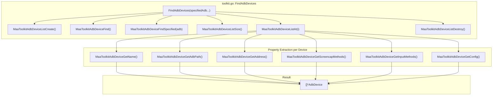
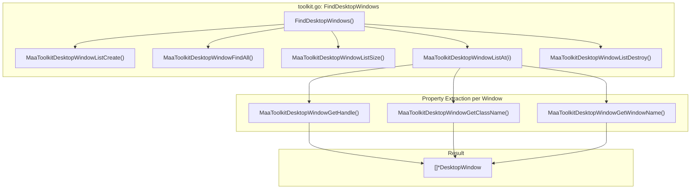
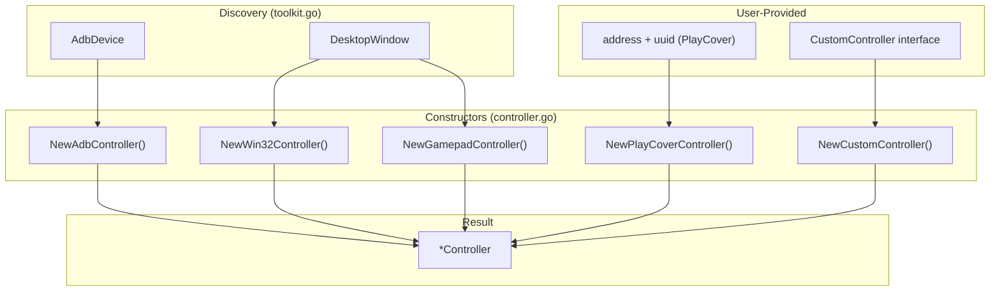
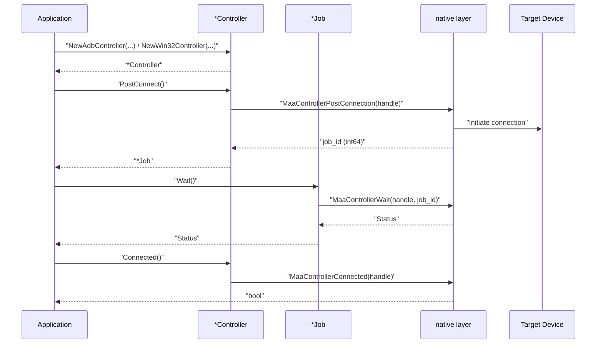
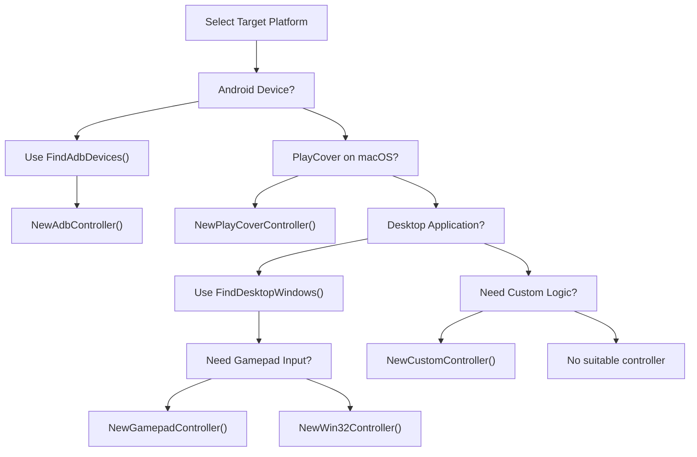

# Device Discovery and Connection

Relevant source files

* [README.md](https://github.com/MaaXYZ/maa-framework-go/blob/5f9c965c/README.md?plain=1)
* [README\_zh.md](https://github.com/MaaXYZ/maa-framework-go/blob/5f9c965c/README_zh.md?plain=1)
* [controller.go](https://github.com/MaaXYZ/maa-framework-go/blob/5f9c965c/controller.go)
* [examples/custom-action/main.go](https://github.com/MaaXYZ/maa-framework-go/blob/5f9c965c/examples/custom-action/main.go)
* [examples/quick-start/main.go](https://github.com/MaaXYZ/maa-framework-go/blob/5f9c965c/examples/quick-start/main.go)
* [internal/native/framework.go](https://github.com/MaaXYZ/maa-framework-go/blob/5f9c965c/internal/native/framework.go)
* [toolkit.go](https://github.com/MaaXYZ/maa-framework-go/blob/5f9c965c/toolkit.go)

## Purpose and Scope

This page explains how to discover target devices and windows, and how to create and connect controllers to them. The framework provides two discovery mechanisms: **ADB device discovery** for Android devices and **desktop window discovery** for Windows/macOS applications. After discovery, you create a controller instance appropriate for your target platform and establish a connection before binding it to a Tasker.

For information about controller operations (clicks, swipes, screenshots) after connection, see [Controller](/MaaXYZ/maa-framework-go/3.2-controller). For details on binding controllers to a Tasker, see [Tasker](/MaaXYZ/maa-framework-go/3.1-tasker).

**Sources:** [README.md89-156](https://github.com/MaaXYZ/maa-framework-go/blob/5f9c965c/README.md?plain=1#L89-L156) [toolkit.go1-96](https://github.com/MaaXYZ/maa-framework-go/blob/5f9c965c/toolkit.go#L1-L96) [controller.go1-512](https://github.com/MaaXYZ/maa-framework-go/blob/5f9c965c/controller.go#L1-L512)

---

## Discovery Mechanisms Overview

The framework provides two main discovery functions that scan for available automation targets:

| Function | Purpose | Returns | Platform Support |
| --- | --- | --- | --- |
| `FindAdbDevices()` | Discovers connected Android devices via ADB | `[]*AdbDevice` | All platforms |
| `FindDesktopWindows()` | Discovers desktop application windows | `[]*DesktopWindow` | Windows, macOS, Linux |

Both functions perform scanning operations and return structured information about discovered targets, which can then be used to create appropriate controller instances.

**Sources:** [toolkit.go36-95](https://github.com/MaaXYZ/maa-framework-go/blob/5f9c965c/toolkit.go#L36-L95)

---

## ADB Device Discovery

### Discovery Function

```
```
func FindAdbDevices(specifiedAdb ...string) ([]*AdbDevice, error)
```
```

The `FindAdbDevices()` function scans for Android devices connected via ADB. It accepts an optional `specifiedAdb` parameter to use a specific ADB executable path. If not provided, the function searches for ADB in standard system locations.

**Sources:** [toolkit.go36-70](https://github.com/MaaXYZ/maa-framework-go/blob/5f9c965c/toolkit.go#L36-L70)

### AdbDevice Structure

Each discovered device is represented by an `AdbDevice` struct containing:

| Field | Type | Description |
| --- | --- | --- |
| `Name` | `string` | Device name/model identifier |
| `AdbPath` | `string` | Full path to ADB executable used for this device |
| `Address` | `string` | Device address (e.g., "127.0.0.1:5555" or serial number) |
| `ScreencapMethod` | `adb.ScreencapMethod` | Bitmap of supported screenshot methods |
| `InputMethod` | `adb.InputMethod` | Bitmap of supported input methods |
| `Config` | `string` | JSON configuration string for device-specific settings |

The `ScreencapMethod` and `InputMethod` fields are bitmaps that may contain multiple supported methods. The framework automatically selects the optimal method during controller creation.

**Sources:** [toolkit.go11-19](https://github.com/MaaXYZ/maa-framework-go/blob/5f9c965c/toolkit.go#L11-L19)

### Discovery Architecture

**ADB Device Discovery Flow** — `FindAdbDevices` in `toolkit.go`



The discovery process creates a native list handle, performs the search (either `MaaToolkitAdbDeviceFind` or `MaaToolkitAdbDeviceFindSpecified`), iterates the list to extract all device properties, constructs `AdbDevice` structs, then destroys the native list handle via `defer`.

Sources: [toolkit.go37-70](https://github.com/MaaXYZ/maa-framework-go/blob/5f9c965c/toolkit.go#L37-L70)

### Example Usage

`FindAdbDevices` is called before controller creation. See [examples/quick-start/main.go27-35](https://github.com/MaaXYZ/maa-framework-go/blob/5f9c965c/examples/quick-start/main.go#L27-L35) and [examples/custom-action/main.go23-28](https://github.com/MaaXYZ/maa-framework-go/blob/5f9c965c/examples/custom-action/main.go#L23-L28) for representative usage patterns. The optional `specifiedAdb` parameter allows pointing to a specific ADB executable; without it, the native layer searches standard locations.

Sources: [toolkit.go37-70](https://github.com/MaaXYZ/maa-framework-go/blob/5f9c965c/toolkit.go#L37-L70) [examples/quick-start/main.go27-35](https://github.com/MaaXYZ/maa-framework-go/blob/5f9c965c/examples/quick-start/main.go#L27-L35) [examples/custom-action/main.go23-28](https://github.com/MaaXYZ/maa-framework-go/blob/5f9c965c/examples/custom-action/main.go#L23-L28)

---

## Desktop Window Discovery

### Discovery Function

```
```
func FindDesktopWindows() ([]*DesktopWindow, error)
```
```

The `FindDesktopWindows()` function scans for all visible desktop application windows. On Windows, this uses the Win32 API to enumerate windows. On macOS and Linux, platform-specific window management APIs are used.

**Sources:** [toolkit.go72-95](https://github.com/MaaXYZ/maa-framework-go/blob/5f9c965c/toolkit.go#L72-L95)

### DesktopWindow Structure

Each discovered window is represented by a `DesktopWindow` struct containing:

| Field | Type | Description |
| --- | --- | --- |
| `Handle` | `unsafe.Pointer` | Native window handle (HWND on Windows) |
| `ClassName` | `string` | Window class name |
| `WindowName` | `string` | Window title text |

The `Handle` field is an opaque pointer that must be passed to `NewWin32Controller()` when creating a controller for the window.

**Sources:** [toolkit.go21-26](https://github.com/MaaXYZ/maa-framework-go/blob/5f9c965c/toolkit.go#L21-L26)

### Discovery Architecture

**Desktop Window Discovery Flow** — `FindDesktopWindows` in `toolkit.go`



Similar to ADB discovery, a native list handle is created, all windows are enumerated via `MaaToolkitDesktopWindowFindAll`, properties are extracted per window, and `DesktopWindow` structs are constructed.

Sources: [toolkit.go73-95](https://github.com/MaaXYZ/maa-framework-go/blob/5f9c965c/toolkit.go#L73-L95)

### Example Usage

Call `FindDesktopWindows()`, iterate the returned `[]*DesktopWindow` slice, filter by `ClassName` or `WindowName`, and pass `Handle` to `NewWin32Controller()` or `NewGamepadController()`. See [toolkit.go73-95](https://github.com/MaaXYZ/maa-framework-go/blob/5f9c965c/toolkit.go#L73-L95) for the full implementation.

Sources: [toolkit.go72-95](https://github.com/MaaXYZ/maa-framework-go/blob/5f9c965c/toolkit.go#L72-L95)

---

## Controller Creation

After discovering a target device or window, you create a controller instance appropriate for your platform. The framework provides five controller types, each with a specialized constructor.

### Controller Types and Creation Functions

**Controller Creation Paths** — `controller.go`



All constructors internally call `initControllerStore(handle)` to set up event-sink and custom-controller tracking for the new handle, then return a `*Controller` wrapping that handle.

Sources: [controller.go17-158](https://github.com/MaaXYZ/maa-framework-go/blob/5f9c965c/controller.go#L17-L158)

### NewAdbController

```
```
func NewAdbController(


adbPath, address string,


screencapMethod adb.ScreencapMethod,


inputMethod adb.InputMethod,


config, agentPath string,


) (*Controller, error)
```
```

Creates a controller for Android devices via ADB. Typically used with `AdbDevice` obtained from `FindAdbDevices()`.

**Parameters:**

* `adbPath`: Full path to ADB executable
* `address`: Device address (serial number or IP:port)
* `screencapMethod`: Screenshot method bitmap from discovered device
* `inputMethod`: Input method bitmap from discovered device
* `config`: JSON configuration string from discovered device
* `agentPath`: Path to MaaAgentBinary for enhanced capabilities (can be empty)

Sources: [controller.go30-54](https://github.com/MaaXYZ/maa-framework-go/blob/5f9c965c/controller.go#L30-L54) [README.md120-127](https://github.com/MaaXYZ/maa-framework-go/blob/5f9c965c/README.md?plain=1#L120-L127) [examples/quick-start/main.go29-37](https://github.com/MaaXYZ/maa-framework-go/blob/5f9c965c/examples/quick-start/main.go#L29-L37)

### NewWin32Controller

```
```
func NewWin32Controller(


hWnd unsafe.Pointer,


screencapMethod win32.ScreencapMethod,


mouseMethod win32.InputMethod,


keyboardMethod win32.InputMethod,


) (*Controller, error)
```
```

Creates a controller for Windows desktop applications. Used with `DesktopWindow.Handle` from `FindDesktopWindows()`.

**Parameters:**

* `hWnd`: Window handle from `DesktopWindow.Handle`
* `screencapMethod`: Screenshot capture method (e.g., `GDI`, `DXGI`)
* `mouseMethod`: Mouse input method (e.g., `SendMessage`, `Sendinput`)
* `keyboardMethod`: Keyboard input method

**Sources:** [controller.go72-94](https://github.com/MaaXYZ/maa-framework-go/blob/5f9c965c/controller.go#L72-L94)

### NewPlayCoverController

```
```
func NewPlayCoverController(


address, uuid string,


) (*Controller, error)
```
```

Creates a controller for iOS apps running via PlayCover on macOS. The `address` is typically the PlayCover server address, and `uuid` identifies the specific app instance.

**Sources:** [controller.go56-70](https://github.com/MaaXYZ/maa-framework-go/blob/5f9c965c/controller.go#L56-L70)

### NewGamepadController

```
```
func NewGamepadController(


hWnd unsafe.Pointer,


gamepadType GamepadType,


screencapMethod win32.ScreencapMethod,


) (*Controller, error)
```
```

Creates a virtual gamepad controller for Windows using ViGEm Bus Driver. The `hWnd` parameter is optional (can be `nil`) if screenshot capture is not needed.

**Parameters:**

* `hWnd`: Window handle for screencap (optional, from `DesktopWindow.Handle`)
* `gamepadType`: `GamepadTypeXbox360` or `GamepadTypeDualShock4`
* `screencapMethod`: Win32 screenshot method (ignored if `hWnd` is `nil`)

**Note:** Requires ViGEm Bus Driver to be installed on the system.

**Sources:** [controller.go96-128](https://github.com/MaaXYZ/maa-framework-go/blob/5f9c965c/controller.go#L96-L128)

### NewCustomController

```
```
func NewCustomController(


ctrl CustomController,


) (*Controller, error)
```
```

Creates a controller with user-defined control logic. The `ctrl` parameter must implement the `CustomController` interface. For details on implementing custom controllers, see [Custom Controllers](/MaaXYZ/maa-framework-go/5.3-custom-controllers).

**Sources:** [controller.go130-158](https://github.com/MaaXYZ/maa-framework-go/blob/5f9c965c/controller.go#L130-L158)

---

## Connection Workflow

After creating a controller, you must establish a connection before it can be used. The connection process is asynchronous and uses the Job pattern.

### Connection Sequence

**`PostConnect` / `Connected` Workflow** — `controller.go`



Sources: [controller.go276-279](https://github.com/MaaXYZ/maa-framework-go/blob/5f9c965c/controller.go#L276-L279) [controller.go402-404](https://github.com/MaaXYZ/maa-framework-go/blob/5f9c965c/controller.go#L402-L404)

### PostConnect Method

```
```
func (c *Controller) PostConnect() *Job
```
```

Initiates an asynchronous connection to the target device or window. Returns a `Job` handle that can be used to monitor the connection status.

**Sources:** [controller.go275-279](https://github.com/MaaXYZ/maa-framework-go/blob/5f9c965c/controller.go#L275-L279)

### Connection Verification

```
```
func (c *Controller) Connected() bool
```
```

Returns `true` if the controller is currently connected and ready for operations.

**Sources:** [controller.go401-404](https://github.com/MaaXYZ/maa-framework-go/blob/5f9c965c/controller.go#L401-L404)

### Example Connection Flow

```
```
// Create controller


ctrl, err := maa.NewAdbController(


device.AdbPath,


device.Address,


device.ScreencapMethod,


device.InputMethod,


device.Config,


"",


)


if err != nil {


// Handle creation error


}


defer ctrl.Destroy()


// Initiate connection


job := ctrl.PostConnect()


// Wait for connection to complete


status := job.Wait()


if status != maa.StatusSuccess {


// Handle connection failure


}


// Verify connection


if !ctrl.Connected() {


// Connection verification failed


}


// Controller is now ready for use
```
```

**Sources:** [README.md120-134](https://github.com/MaaXYZ/maa-framework-go/blob/5f9c965c/README.md?plain=1#L120-L134) [examples/custom-action/main.go29-43](https://github.com/MaaXYZ/maa-framework-go/blob/5f9c965c/examples/custom-action/main.go#L29-L43)

### Binding to Tasker

After successful connection, the controller must be bound to a Tasker before task execution. This is covered in detail in [Tasker](/MaaXYZ/maa-framework-go/3.1-tasker).

```
```
tasker.BindController(ctrl)
```
```

The binding creates an association between the controller and tasker, allowing the tasker to use the controller for screen capture and input operations during task execution.

**Sources:** [README.md134](https://github.com/MaaXYZ/maa-framework-go/blob/5f9c965c/README.md?plain=1#L134-L134)

---

## Decision Tree: Choosing the Right Controller



**Controller Selection Guide**: This decision tree helps determine which controller type and discovery mechanism to use based on your target platform and requirements.

**Sources:** [controller.go30-158](https://github.com/MaaXYZ/maa-framework-go/blob/5f9c965c/controller.go#L30-L158) [toolkit.go36-95](https://github.com/MaaXYZ/maa-framework-go/blob/5f9c965c/toolkit.go#L36-L95)

---

## Configuration and Initialization

Before using discovery functions, you should initialize the toolkit configuration:

```
```
func ConfigInitOption(userPath, defaultJson string) error
```
```

This function initializes toolkit configuration options that affect device discovery behavior.

**Parameters:**

* `userPath`: Path to user configuration directory
* `defaultJson`: Default configuration as JSON string

**Example:**

```
```
if err := maa.ConfigInitOption("./", "{}"); err != nil {


// Handle initialization error


}
```
```

**Sources:** [toolkit.go28-34](https://github.com/MaaXYZ/maa-framework-go/blob/5f9c965c/toolkit.go#L28-L34) [README.md103-106](https://github.com/MaaXYZ/maa-framework-go/blob/5f9c965c/README.md?plain=1#L103-L106)

---

## Complete Discovery and Connection Example

A runnable end-to-end example covering `maa.Init`, `ConfigInitOption`, `FindAdbDevices`, `NewAdbController`, `PostConnect().Wait()`, and `BindController` is available at [examples/quick-start/main.go1-64](https://github.com/MaaXYZ/maa-framework-go/blob/5f9c965c/examples/quick-start/main.go#L1-L64) and [README.md91-156](https://github.com/MaaXYZ/maa-framework-go/blob/5f9c965c/README.md?plain=1#L91-L156)

Sources: [README.md91-156](https://github.com/MaaXYZ/maa-framework-go/blob/5f9c965c/README.md?plain=1#L91-L156) [examples/quick-start/main.go1-64](https://github.com/MaaXYZ/maa-framework-go/blob/5f9c965c/examples/quick-start/main.go#L1-L64) [examples/custom-action/main.go10-69](https://github.com/MaaXYZ/maa-framework-go/blob/5f9c965c/examples/custom-action/main.go#L10-L69)

---

## Summary Table: Discovery and Controller Functions

| Function | Purpose | Returns | Related Constructor |
| --- | --- | --- | --- |
| `FindAdbDevices()` | Discover ADB devices | `[]*AdbDevice` | `NewAdbController()` |
| `FindDesktopWindows()` | Discover desktop windows | `[]*DesktopWindow` | `NewWin32Controller()`, `NewGamepadController()` |
| `ConfigInitOption()` | Initialize toolkit config | `error` | N/A |
| `NewAdbController()` | Create ADB controller | `*Controller` | From `AdbDevice` |
| `NewWin32Controller()` | Create Win32 controller | `*Controller` | From `DesktopWindow` |
| `NewPlayCoverController()` | Create PlayCover controller | `*Controller` | Manual parameters |
| `NewGamepadController()` | Create gamepad controller | `*Controller` | From `DesktopWindow` |
| `NewCustomController()` | Create custom controller | `*Controller` | From `CustomController` interface |
| `PostConnect()` | Initiate connection | `*Job` | N/A |
| `Connected()` | Verify connection | `bool` | N/A |

**Sources:** [toolkit.go1-96](https://github.com/MaaXYZ/maa-framework-go/blob/5f9c965c/toolkit.go#L1-L96) [controller.go26-404](https://github.com/MaaXYZ/maa-framework-go/blob/5f9c965c/controller.go#L26-L404)