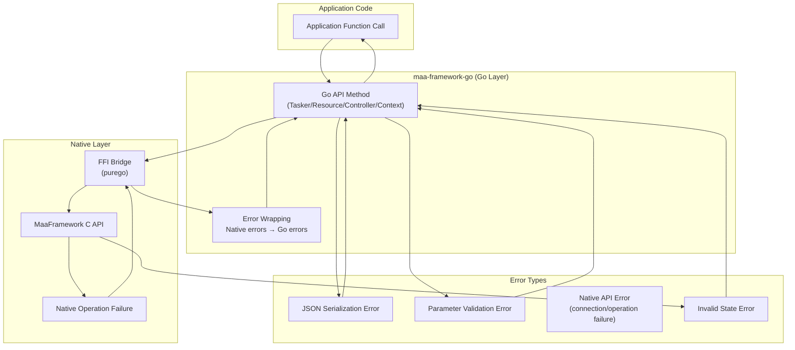
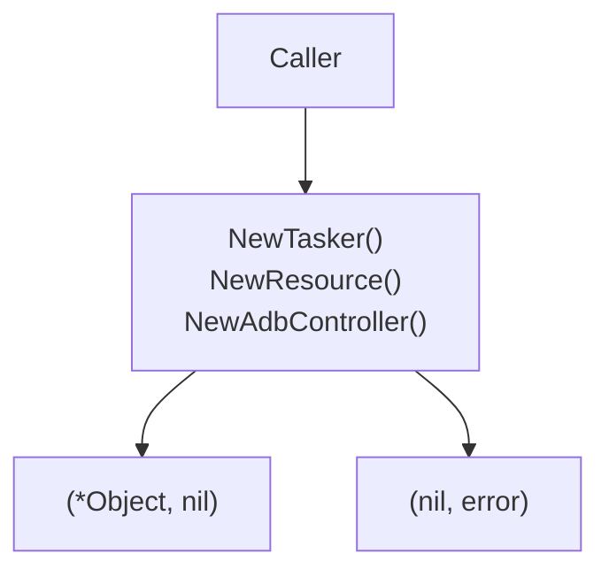
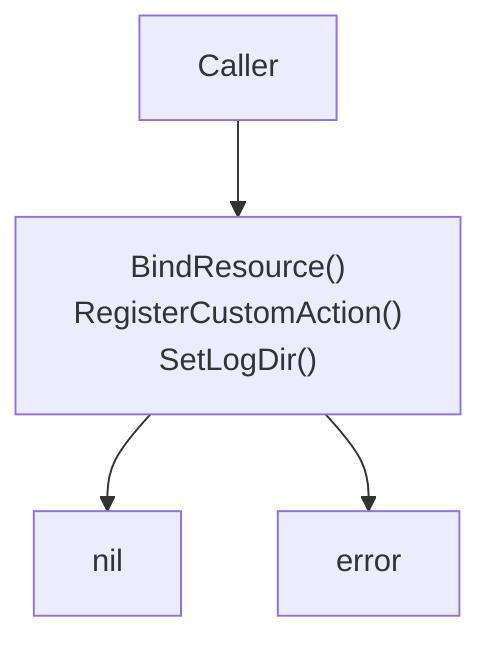
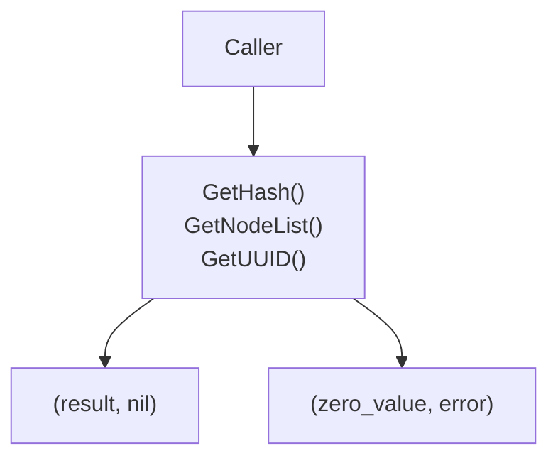
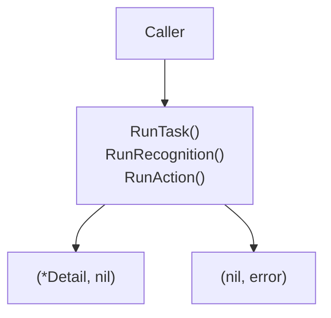
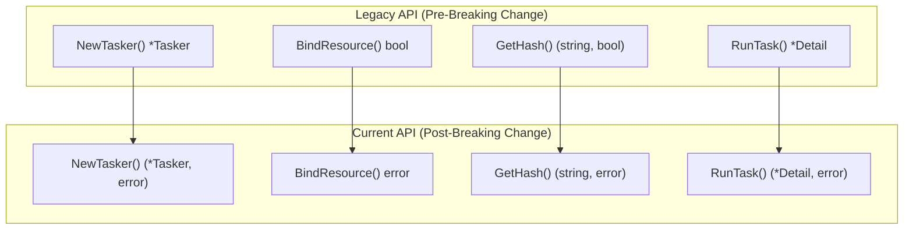
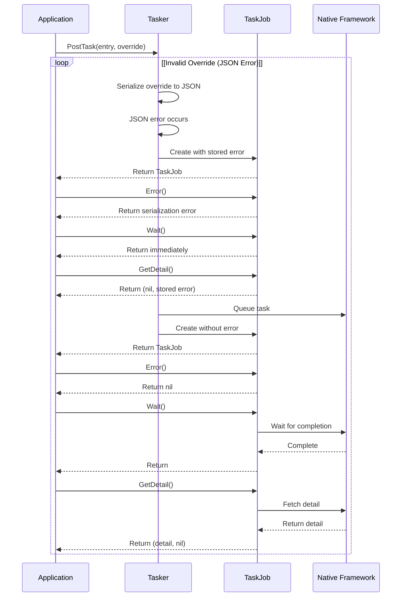
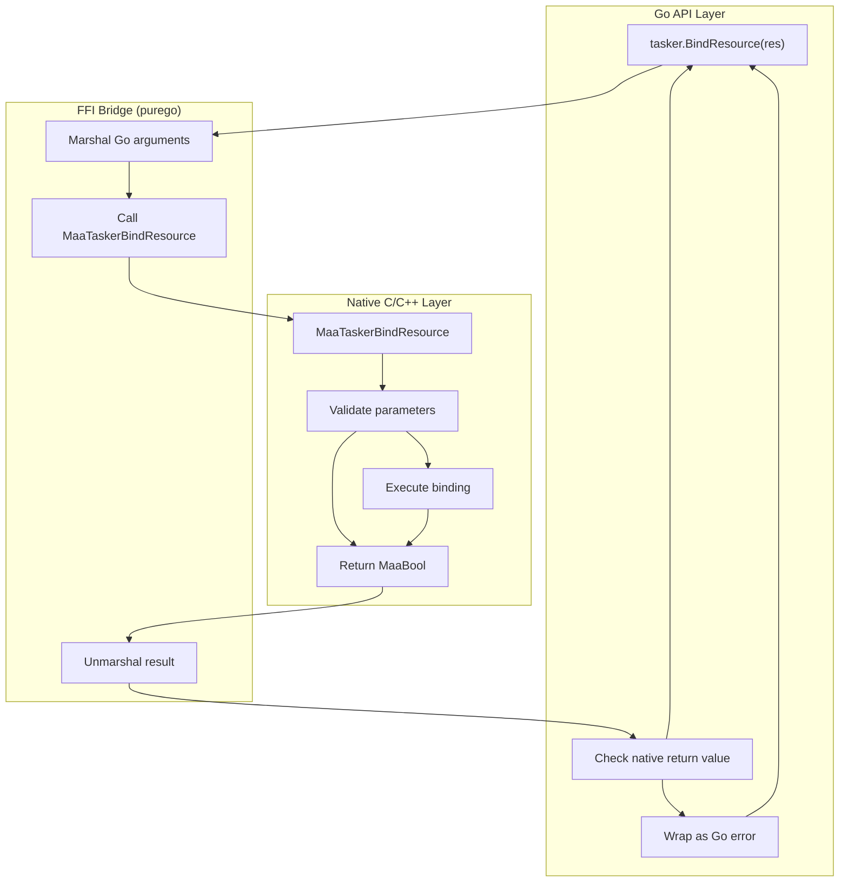

# Error Handling

Relevant source files

* [CHANGELOG.md](https://github.com/MaaXYZ/maa-framework-go/blob/5f9c965c/CHANGELOG.md?plain=1)
* [context.go](https://github.com/MaaXYZ/maa-framework-go/blob/5f9c965c/context.go)
* [context\_test.go](https://github.com/MaaXYZ/maa-framework-go/blob/5f9c965c/context_test.go)
* [recognition\_result\_test.go](https://github.com/MaaXYZ/maa-framework-go/blob/5f9c965c/recognition_result_test.go)
* [resource\_test.go](https://github.com/MaaXYZ/maa-framework-go/blob/5f9c965c/resource_test.go)
* [tasker.go](https://github.com/MaaXYZ/maa-framework-go/blob/5f9c965c/tasker.go)
* [tasker\_test.go](https://github.com/MaaXYZ/maa-framework-go/blob/5f9c965c/tasker_test.go)

This page documents the error handling patterns and practices used throughout maa-framework-go. The framework follows standard Go idioms for error handling, consistently returning `error` values that must be checked by application code. This page covers error return patterns, migration from the legacy bool-based API, TaskJob error handling, and component-specific error behavior.

For information about event callbacks and monitoring task execution status, see [Event System and Monitoring](/MaaXYZ/maa-framework-go/6-event-system-and-monitoring).

---

## Overview

maa-framework-go uses Go's standard error handling pattern throughout its API. All operations that can fail return an `error` value as the last return parameter. This replaces the legacy bool-based return pattern that was used in earlier versions of the framework.

**Key Principles:**

1. **Explicit Error Checking**: Errors must be explicitly checked by the caller; they are never silently ignored
2. **Standard Go Idioms**: The framework follows `(result, error)` return patterns consistently
3. **Error Propagation**: Errors from the native C/C++ layer are wrapped and returned as Go errors
4. **Immediate Failure**: Operations fail fast and return errors immediately rather than deferring them

**Error Sources:**



Sources: [CHANGELOG.md1-257](https://github.com/MaaXYZ/maa-framework-go/blob/5f9c965c/CHANGELOG.md?plain=1#L1-L257)

---

## Error Return Patterns

The framework uses four distinct error return patterns depending on the method category:

### Constructor Pattern

**Signature**: `func NewX(...) (*X, error)`

Constructors return a pointer to the created object and an error. If construction fails, the pointer is `nil` and the error describes the failure.



**Affected Functions:**

| Component | Constructor Functions |
| --- | --- |
| **Tasker** | `NewTasker() (*Tasker, error)` |
| **Resource** | `NewResource() (*Resource, error)` |
| **Controller** | `NewAdbController(...)` → `(*AdbController, error)` `NewWin32Controller(...)` → `(*Win32Controller, error)` `NewPlayCoverController(...)` → `(*PlayCoverController, error)` `NewGamepadController(...)` → `(*GamepadController, error)` `NewCustomController(...)` → `(*CustomController, error)` `NewCarouselImageController(...)` → `(*CarouselImageController, error)` `NewBlankController()` → `(*BlankController, error)` |
| **AgentClient** | `NewAgentClient(...AgentClientOption) (*AgentClient, error)` |

**Example Usage:**

```
```
// Create a tasker with error checking


tasker, err := maa.NewTasker()


if err != nil {


return fmt.Errorf("failed to create tasker: %w", err)


}


defer tasker.Destroy()
```
```

Sources: [CHANGELOG.md7-10](https://github.com/MaaXYZ/maa-framework-go/blob/5f9c965c/CHANGELOG.md?plain=1#L7-L10) [CHANGELOG.md55-76](https://github.com/MaaXYZ/maa-framework-go/blob/5f9c965c/CHANGELOG.md?plain=1#L55-L76)

### Setter Pattern

**Signature**: `func (x *X) SetY(...) error`

Setter methods configure object state and return only an error. A `nil` return indicates success.



**Affected Methods by Component:**

| Component | Setter Methods |
| --- | --- |
| **Tasker** | `BindResource(res *Resource) error` `BindController(ctrl Controller) error` `ClearCache() error` |
| **Resource** | `RegisterCustomRecognition(name string, runner CustomRecognitionRunner) error` `UnregisterCustomRecognition(name string) error` `ClearCustomRecognition() error` `RegisterCustomAction(name string, runner CustomActionRunner) error` `UnregisterCustomAction(name string) error` `ClearCustomAction() error` `OverridePipeline(pipeline any) error` `OverrideNext(name string, next []NodeNextItem) error` `OverrideImage(name string, imgs []string) error` `Clear() error` |
| **Context** | `OverridePipeline(pipeline any) error` `OverrideNext(name string, next []NodeNextItem) error` `OverrideImage(name string, imgs []string) error` `SetAnchor(anchor, target string) error` `ClearHitCount(name string) error` |
| **Controller** | `SetScreenshot(opts ...ScreenshotOption) error` |
| **Global** | `SetLogDir(path string) error` `SetSaveDraw(enabled bool) error` `SetStdoutLevel(level LoggingLevel) error` `SetDebugMode(enabled bool) error` `SetSaveOnError(enabled bool) error` `SetDrawQuality(quality int) error` `SetRecoImageCacheLimit(limit int) error` `LoadPlugin(path string) error` |

**Example Usage:**

```
```
// Bind resource with error checking


err := tasker.BindResource(resource)


if err != nil {


return fmt.Errorf("failed to bind resource: %w", err)


}
```
```

Sources: [CHANGELOG.md7-10](https://github.com/MaaXYZ/maa-framework-go/blob/5f9c965c/CHANGELOG.md?plain=1#L7-L10) [CHANGELOG.md23-24](https://github.com/MaaXYZ/maa-framework-go/blob/5f9c965c/CHANGELOG.md?plain=1#L23-L24) [CHANGELOG.md72-79](https://github.com/MaaXYZ/maa-framework-go/blob/5f9c965c/CHANGELOG.md?plain=1#L72-L79)

### Query Pattern

**Signature**: `func (x *X) GetY() (T, error)`

Query methods retrieve information and return the result along with an error. On failure, the result may be a zero value and the error is non-nil.



**Affected Methods by Component:**

| Component | Query Methods |
| --- | --- |
| **Resource** | `GetHash() (string, error)` `GetNodeList() ([]string, error)` `GetNode(name string) (*Node, error)` `GetCustomRecognitionList() ([]string, error)` `GetCustomActionList() ([]string, error)` `GetDefaultRecognitionParam(recType NodeRecognitionType) (any, error)` `GetDefaultActionParam(actType NodeActionType) (any, error)` |
| **Tasker** | `GetLatestNode(detail *TaskDetail) (string, error)` `GetTaskDetail(id int64) (*TaskDetail, error)` |
| **Controller** | `GetUUID() (string, error)` `GetResolution() (Size, error)` `CacheImage() (image.Image, error)` `GetShellOutput() (string, error)` |
| **Context** | `GetNode(name string) (*Node, error)` `GetAnchor(anchor string) (string, error)` `GetHitCount(name string) (uint64, error)` |
| **AgentClient** | `Identifier() (string, error)` `GetCustomRecognitionList() ([]string, error)` `GetCustomActionList() ([]string, error)` |
| **TaskJob** | `GetDetail() (*TaskDetail, error)` |
| **Toolkit** | `FindAdbDevices() ([]*AdbDevice, error)` `FindDesktopWindows() ([]*DesktopWindow, error)` |

**Example Usage:**

```
```
// Query with error checking


uuid, err := controller.GetUUID()


if err != nil {


return fmt.Errorf("failed to get controller UUID: %w", err)


}


log.Printf("Controller UUID: %s", uuid)
```
```

Sources: [CHANGELOG.md7-10](https://github.com/MaaXYZ/maa-framework-go/blob/5f9c965c/CHANGELOG.md?plain=1#L7-L10) [CHANGELOG.md25](https://github.com/MaaXYZ/maa-framework-go/blob/5f9c965c/CHANGELOG.md?plain=1#L25-L25) [CHANGELOG.md79-80](https://github.com/MaaXYZ/maa-framework-go/blob/5f9c965c/CHANGELOG.md?plain=1#L79-L80)

### Run Pattern

**Signature**: `func (x *X) RunY(...) (T, error)`

Run methods execute operations and return both a result and an error. These are used for context operations like running tasks, recognition, or actions.



**Affected Methods (Context):**

| Method | Signature |
| --- | --- |
| **RunTask** | `RunTask(entry string, pipeline ...any) (*RecognitionDetail, error)` |
| **RunRecognition** | `RunRecognition(entry string, img image.Image, pipeline ...any) (*RecognitionDetail, error)` |
| **RunAction** | `RunAction(entry string, box Rect, detailJson string, pipeline ...any) (*NodeDetail, error)` |
| **RunRecognitionDirect** | `RunRecognitionDirect(recType NodeRecognitionType, param any, img image.Image) (*RecognitionDetail, error)` |
| **RunActionDirect** | `RunActionDirect(actType NodeActionType, param any, box Rect, detail *RecognitionDetail) (*NodeDetail, error)` |

**Example Usage:**

```
```
// Run task with error checking


detail, err := ctx.RunTask("MyTask", pipeline)


if err != nil {


return fmt.Errorf("task execution failed: %w", err)


}


log.Printf("Task completed: hit=%v", detail.Hit)
```
```

Sources: [CHANGELOG.md7-10](https://github.com/MaaXYZ/maa-framework-go/blob/5f9c965c/CHANGELOG.md?plain=1#L7-L10) [CHANGELOG.md32-38](https://github.com/MaaXYZ/maa-framework-go/blob/5f9c965c/CHANGELOG.md?plain=1#L32-L38) [context\_test.go22-25](https://github.com/MaaXYZ/maa-framework-go/blob/5f9c965c/context_test.go#L22-L25) [context\_test.go72-75](https://github.com/MaaXYZ/maa-framework-go/blob/5f9c965c/context_test.go#L72-L75) [context\_test.go124-127](https://github.com/MaaXYZ/maa-framework-go/blob/5f9c965c/context_test.go#L124-L127)

---

## Migration from Bool-Based Returns

Prior to the breaking change documented in the CHANGELOG, the framework used bool-based return patterns where `false` indicated failure but provided no information about the cause. The migration to error-based returns provides several benefits:

**Migration Overview:**



**Migration Examples:**

| Pattern | Legacy Code | Current Code |
| --- | --- | --- |
| **Constructor** | `client := maa.NewAgentClient("7788")` | `client, err := maa.NewAgentClient(maa.WithIdentifier("7788"))` `if err != nil { ... }` |
| **Setter** | `ok := maa.SetLogDir("./logs")` `if !ok { ... }` | `err := maa.SetLogDir("./logs")` `if err != nil { ... }` |
| **Query** | `id, ok := client.Identifier()` `if !ok { ... }` | `id, err := client.Identifier()` `if err != nil { ... }` |
| **Run** | `detail := ctx.RunTask("MyTask", pipeline)` `if detail == nil { ... }` | `detail, err := ctx.RunTask("MyTask", pipeline)` `if err != nil { ... }` |

**Benefits of Error-Based Returns:**

1. **Error Context**: Errors carry descriptive messages explaining what went wrong
2. **Error Wrapping**: Errors can be wrapped with additional context using `fmt.Errorf("context: %w", err)`
3. **Type Safety**: The compiler enforces error checking (unused values generate warnings)
4. **Go Idioms**: Consistent with standard Go library patterns

Sources: [CHANGELOG.md1-222](https://github.com/MaaXYZ/maa-framework-go/blob/5f9c965c/CHANGELOG.md?plain=1#L1-L222)

---

## TaskJob Error Handling

`TaskJob` represents an asynchronous task execution and has special error handling behavior. Unlike other components, a `TaskJob` can store errors that occur during task creation (before execution begins), such as JSON serialization failures when posting a task with invalid pipeline overrides.

### TaskJob Error States

```
#mermaid-2ph60m09vgg{font-family:ui-sans-serif,-apple-system,system-ui,Segoe UI,Helvetica;font-size:16px;fill:#333;}@keyframes edge-animation-frame{from{stroke-dashoffset:0;}}@keyframes dash{to{stroke-dashoffset:0;}}#mermaid-2ph60m09vgg .edge-animation-slow{stroke-dasharray:9,5!important;stroke-dashoffset:900;animation:dash 50s linear infinite;stroke-linecap:round;}#mermaid-2ph60m09vgg .edge-animation-fast{stroke-dasharray:9,5!important;stroke-dashoffset:900;animation:dash 20s linear infinite;stroke-linecap:round;}#mermaid-2ph60m09vgg .error-icon{fill:#dddddd;}#mermaid-2ph60m09vgg .error-text{fill:#222222;stroke:#222222;}#mermaid-2ph60m09vgg .edge-thickness-normal{stroke-width:1px;}#mermaid-2ph60m09vgg .edge-thickness-thick{stroke-width:3.5px;}#mermaid-2ph60m09vgg .edge-pattern-solid{stroke-dasharray:0;}#mermaid-2ph60m09vgg .edge-thickness-invisible{stroke-width:0;fill:none;}#mermaid-2ph60m09vgg .edge-pattern-dashed{stroke-dasharray:3;}#mermaid-2ph60m09vgg .edge-pattern-dotted{stroke-dasharray:2;}#mermaid-2ph60m09vgg .marker{fill:#999;stroke:#999;}#mermaid-2ph60m09vgg .marker.cross{stroke:#999;}#mermaid-2ph60m09vgg svg{font-family:ui-sans-serif,-apple-system,system-ui,Segoe UI,Helvetica;font-size:16px;}#mermaid-2ph60m09vgg p{margin:0;}#mermaid-2ph60m09vgg defs #statediagram-barbEnd{fill:#999;stroke:#999;}#mermaid-2ph60m09vgg g.stateGroup text{fill:#dddddd;stroke:none;font-size:10px;}#mermaid-2ph60m09vgg g.stateGroup text{fill:#333;stroke:none;font-size:10px;}#mermaid-2ph60m09vgg g.stateGroup .state-title{font-weight:bolder;fill:#333;}#mermaid-2ph60m09vgg g.stateGroup rect{fill:#ffffff;stroke:#dddddd;}#mermaid-2ph60m09vgg g.stateGroup line{stroke:#999;stroke-width:1;}#mermaid-2ph60m09vgg .transition{stroke:#999;stroke-width:1;fill:none;}#mermaid-2ph60m09vgg .stateGroup .composit{fill:#f4f4f4;border-bottom:1px;}#mermaid-2ph60m09vgg .stateGroup .alt-composit{fill:#e0e0e0;border-bottom:1px;}#mermaid-2ph60m09vgg .state-note{stroke:#e6d280;fill:#fff5ad;}#mermaid-2ph60m09vgg .state-note text{fill:#333;stroke:none;font-size:10px;}#mermaid-2ph60m09vgg .stateLabel .box{stroke:none;stroke-width:0;fill:#ffffff;opacity:0.5;}#mermaid-2ph60m09vgg .edgeLabel .label rect{fill:#ffffff;opacity:0.5;}#mermaid-2ph60m09vgg .edgeLabel{background-color:#ffffff;text-align:center;}#mermaid-2ph60m09vgg .edgeLabel p{background-color:#ffffff;}#mermaid-2ph60m09vgg .edgeLabel rect{opacity:0.5;background-color:#ffffff;fill:#ffffff;}#mermaid-2ph60m09vgg .edgeLabel .label text{fill:#333;}#mermaid-2ph60m09vgg .label div .edgeLabel{color:#333;}#mermaid-2ph60m09vgg .stateLabel text{fill:#333;font-size:10px;font-weight:bold;}#mermaid-2ph60m09vgg .node circle.state-start{fill:#999;stroke:#999;}#mermaid-2ph60m09vgg .node .fork-join{fill:#999;stroke:#999;}#mermaid-2ph60m09vgg .node circle.state-end{fill:#dddddd;stroke:#f4f4f4;stroke-width:1.5;}#mermaid-2ph60m09vgg .end-state-inner{fill:#f4f4f4;stroke-width:1.5;}#mermaid-2ph60m09vgg .node rect{fill:#ffffff;stroke:#dddddd;stroke-width:1px;}#mermaid-2ph60m09vgg .node polygon{fill:#ffffff;stroke:#dddddd;stroke-width:1px;}#mermaid-2ph60m09vgg #statediagram-barbEnd{fill:#999;}#mermaid-2ph60m09vgg .statediagram-cluster rect{fill:#ffffff;stroke:#dddddd;stroke-width:1px;}#mermaid-2ph60m09vgg .cluster-label,#mermaid-2ph60m09vgg .nodeLabel{color:#333;}#mermaid-2ph60m09vgg .statediagram-cluster rect.outer{rx:5px;ry:5px;}#mermaid-2ph60m09vgg .statediagram-state .divider{stroke:#dddddd;}#mermaid-2ph60m09vgg .statediagram-state .title-state{rx:5px;ry:5px;}#mermaid-2ph60m09vgg .statediagram-cluster.statediagram-cluster .inner{fill:#f4f4f4;}#mermaid-2ph60m09vgg .statediagram-cluster.statediagram-cluster-alt .inner{fill:#f8f8f8;}#mermaid-2ph60m09vgg .statediagram-cluster .inner{rx:0;ry:0;}#mermaid-2ph60m09vgg .statediagram-state rect.basic{rx:5px;ry:5px;}#mermaid-2ph60m09vgg .statediagram-state rect.divider{stroke-dasharray:10,10;fill:#f8f8f8;}#mermaid-2ph60m09vgg .note-edge{stroke-dasharray:5;}#mermaid-2ph60m09vgg .statediagram-note rect{fill:#fff5ad;stroke:#e6d280;stroke-width:1px;rx:0;ry:0;}#mermaid-2ph60m09vgg .statediagram-note rect{fill:#fff5ad;stroke:#e6d280;stroke-width:1px;rx:0;ry:0;}#mermaid-2ph60m09vgg .statediagram-note text{fill:#333;}#mermaid-2ph60m09vgg .statediagram-note .nodeLabel{color:#333;}#mermaid-2ph60m09vgg .statediagram .edgeLabel{color:red;}#mermaid-2ph60m09vgg #dependencyStart,#mermaid-2ph60m09vgg #dependencyEnd{fill:#999;stroke:#999;stroke-width:1;}#mermaid-2ph60m09vgg .statediagramTitleText{text-anchor:middle;font-size:18px;fill:#333;}#mermaid-2ph60m09vgg :root{--mermaid-font-family:"trebuchet ms",verdana,arial,sans-serif;}

PostTask() called


Creation successful


Creation failed  
(JSON error, etc.)


Native execution starts


Task completes successfully


Task execution fails


Error() returns error


Status() = StatusSuccess


Status() = StatusFailure


Creating


Ready


ErrorState


Running


Success


Failure


- Status() returns StatusFailure
        - Error() returns creation error
        - Wait() returns immediately
        - GetDetail() returns saved error
        - OverridePipeline() returns saved error
```

**TaskJob Error Method:**

```
```
func (j *TaskJob) Error() error
```
```

This method returns any error that occurred during task creation. If the task was created successfully, it returns `nil`. If task creation failed, subsequent operations on the TaskJob will fail with the same error.

**Error Behavior When TaskJob Has Creation Error:**

| Method | Behavior with Error |
| --- | --- |
| `Status()` | Returns `StatusFailure` |
| `Error()` | Returns the stored creation error |
| `Wait()` | Returns immediately without waiting |
| `GetDetail()` | Returns `(nil, error)` with the stored error |
| `OverridePipeline()` | Returns the stored error |
| `Success()` | Returns `false` |
| `Failure()` | Returns `true` |

**Example Usage:**

```
```
// Post a task with potential invalid data


job := tasker.PostTask("entry", invalidPipelineOverride)


// Check for creation errors immediately


if err := job.Error(); err != nil {


// Task creation failed (e.g., JSON serialization error)


return fmt.Errorf("failed to create task: %w", err)


}


// Wait for execution to complete


job.Wait()


// Check execution status


if job.Failure() {


detail, err := job.GetDetail()


if err != nil {


return fmt.Errorf("failed to get task detail: %w", err)


}


log.Printf("Task failed: %v", detail)


}
```
```

**TaskJob Error Flow:**



Sources: [CHANGELOG.md40-53](https://github.com/MaaXYZ/maa-framework-go/blob/5f9c965c/CHANGELOG.md?plain=1#L40-L53) [CHANGELOG.md213-221](https://github.com/MaaXYZ/maa-framework-go/blob/5f9c965c/CHANGELOG.md?plain=1#L213-L221)

---

## Error Checking Best Practices

### Immediate Error Checking

Always check errors immediately after the operation that produces them. Do not defer error checking or accumulate errors for later handling.

**Correct Pattern:**

```
```
// Check error immediately


tasker, err := maa.NewTasker()


if err != nil {


return fmt.Errorf("failed to create tasker: %w", err)


}


defer tasker.Destroy()


// Use tasker...
```
```

**Incorrect Pattern:**

```
```
// DON'T: Defer error checking


tasker, err := maa.NewTasker()


resource, err2 := maa.NewResource()


if err != nil || err2 != nil {  // Too late!


return errors.New("something failed")


}
```
```

Sources: [context\_test.go22-25](https://github.com/MaaXYZ/maa-framework-go/blob/5f9c965c/context_test.go#L22-L25) [resource\_test.go11-14](https://github.com/MaaXYZ/maa-framework-go/blob/5f9c965c/resource_test.go#L11-L14)

### Error Wrapping

Use `fmt.Errorf` with `%w` to wrap errors with additional context. This preserves the error chain for debugging.

**Example:**

```
```
err := tasker.BindResource(resource)


if err != nil {


return fmt.Errorf("failed to bind resource to tasker: %w", err)


}
```
```

### Resource Cleanup with Defer

Use `defer` for cleanup operations immediately after successful resource creation to ensure cleanup happens even if errors occur later.

**Example:**

```
```
tasker, err := maa.NewTasker()


if err != nil {


return fmt.Errorf("failed to create tasker: %w", err)


}


defer tasker.Destroy()  // Cleanup guaranteed


// Use tasker...
```
```

Sources: [context\_test.go28-52](https://github.com/MaaXYZ/maa-framework-go/blob/5f9c965c/context_test.go#L28-L52) [resource\_test.go17-20](https://github.com/MaaXYZ/maa-framework-go/blob/5f9c965c/resource_test.go#L17-L20)

### Testing Error Cases

When writing tests, use assertion libraries like `testify/require` to check errors consistently:

**Example from Tests:**

```
```
// Constructor error checking


tasker, err := maa.NewTasker()


require.NoError(t, err)


require.NotNil(t, tasker)


// Setter error checking


err = tasker.BindResource(resource)


require.NoError(t, err)


// Query error checking


uuid, err := controller.GetUUID()


require.NoError(t, err)


require.NotEmpty(t, uuid)


// Run error checking


detail, err := ctx.RunTask("MyTask", pipeline)


require.NoError(t, err)


require.NotNil(t, detail)
```
```

Sources: [context\_test.go22-25](https://github.com/MaaXYZ/maa-framework-go/blob/5f9c965c/context_test.go#L22-L25) [context\_test.go60-62](https://github.com/MaaXYZ/maa-framework-go/blob/5f9c965c/context_test.go#L60-L62) [context\_test.go72-75](https://github.com/MaaXYZ/maa-framework-go/blob/5f9c965c/context_test.go#L72-L75) [resource\_test.go11-14](https://github.com/MaaXYZ/maa-framework-go/blob/5f9c965c/resource_test.go#L11-L14) [resource\_test.go41-42](https://github.com/MaaXYZ/maa-framework-go/blob/5f9c965c/resource_test.go#L41-L42)

---

## Component-Specific Error Handling

### Tasker Errors

**Common Error Scenarios:**

| Scenario | Method | Error Type |
| --- | --- | --- |
| Creation failure | `NewTasker()` | Native initialization error |
| Resource not bound | `PostTask()` | TaskJob stores error |
| Controller not bound | `PostTask()` | TaskJob stores error |
| Invalid task ID | `GetTaskDetail()` | Query returns error |

**Example:**

```
```
tasker, err := maa.NewTasker()


if err != nil {


return fmt.Errorf("tasker creation failed: %w", err)


}


defer tasker.Destroy()


err = tasker.BindResource(resource)


if err != nil {


return fmt.Errorf("bind resource failed: %w", err)


}


err = tasker.BindController(controller)


if err != nil {


return fmt.Errorf("bind controller failed: %w", err)


}
```
```

Sources: [context\_test.go37-39](https://github.com/MaaXYZ/maa-framework-go/blob/5f9c965c/context_test.go#L37-L39)

### Resource Errors

**Common Error Scenarios:**

| Scenario | Method | Error Type |
| --- | --- | --- |
| Creation failure | `NewResource()` | Native initialization error |
| Asset loading failure | `PostBundle().Wait()` | Job returns failure status |
| Invalid pipeline override | `OverridePipeline()` | JSON serialization error |
| Custom logic registration conflict | `RegisterCustomAction()` | Duplicate name error |
| Node not found | `GetNode()` | Query returns error |

**Example:**

```
```
resource, err := maa.NewResource()


if err != nil {


return fmt.Errorf("resource creation failed: %w", err)


}


defer resource.Destroy()


err = resource.RegisterCustomAction("MyAction", &myAction{})


if err != nil {


return fmt.Errorf("action registration failed: %w", err)


}


node, err := resource.GetNode("StartUp")


if err != nil {


return fmt.Errorf("failed to get node: %w", err)


}
```
```

Sources: [resource\_test.go11-14](https://github.com/MaaXYZ/maa-framework-go/blob/5f9c965c/resource_test.go#L11-L14) [resource\_test.go41-42](https://github.com/MaaXYZ/maa-framework-go/blob/5f9c965c/resource_test.go#L41-L42) [resource\_test.go158-159](https://github.com/MaaXYZ/maa-framework-go/blob/5f9c965c/resource_test.go#L158-L159) [resource\_test.go354-359](https://github.com/MaaXYZ/maa-framework-go/blob/5f9c965c/resource_test.go#L354-L359)

### Controller Errors

**Common Error Scenarios:**

| Scenario | Method | Error Type |
| --- | --- | --- |
| Creation failure | `NewAdbController()` | Platform-specific error |
| Connection failure | `PostConnect().Wait()` | Job returns failure status |
| Screenshot failure | `CacheImage()` | Query returns error |
| Device not found | `GetUUID()` | Query returns error |

**Example:**

```
```
ctrl, err := maa.NewAdbController(


adbPath, deviceSerial, config,


maa.NewDefaultController(),


)


if err != nil {


return fmt.Errorf("controller creation failed: %w", err)


}


defer ctrl.Destroy()


// Connection is async - check job status


job := ctrl.PostConnect()


if !job.Wait().Success() {


return errors.New("connection failed")


}


img, err := ctrl.CacheImage()


if err != nil {


return fmt.Errorf("screenshot failed: %w", err)


}
```
```

Sources: [context\_test.go29-32](https://github.com/MaaXYZ/maa-framework-go/blob/5f9c965c/context_test.go#L29-L32) [context\_test.go60-62](https://github.com/MaaXYZ/maa-framework-go/blob/5f9c965c/context_test.go#L60-L62)

### Context Errors

**Common Error Scenarios:**

| Scenario | Method | Error Type |
| --- | --- | --- |
| Task execution failure | `RunTask()` | Run returns error |
| Recognition failure | `RunRecognition()` | Run returns error |
| Action execution failure | `RunAction()` | Run returns error |
| Invalid pipeline override | `OverridePipeline()` | JSON serialization error |
| Node not found | `GetNode()` | Query returns error |

**Example:**

```
```
// Context is passed to custom actions/recognitions


func (a *MyAction) Run(ctx *maa.Context, arg *maa.CustomActionArg) bool {


// Run nested task


detail, err := ctx.RunTask("SubTask", nestedPipeline)


if err != nil {


log.Printf("subtask failed: %v", err)


return false


}


// Query node information


node, err := ctx.GetNode("TargetNode")


if err != nil {


log.Printf("node query failed: %v", err)


return false


}


return true


}
```
```

Sources: [context\_test.go22-25](https://github.com/MaaXYZ/maa-framework-go/blob/5f9c965c/context_test.go#L22-L25) [context\_test.go72-75](https://github.com/MaaXYZ/maa-framework-go/blob/5f9c965c/context_test.go#L72-L75) [context\_test.go124-127](https://github.com/MaaXYZ/maa-framework-go/blob/5f9c965c/context_test.go#L124-L127) [context\_test.go182-187](https://github.com/MaaXYZ/maa-framework-go/blob/5f9c965c/context_test.go#L182-L187) [context\_test.go426-433](https://github.com/MaaXYZ/maa-framework-go/blob/5f9c965c/context_test.go#L426-L433)

---

## Error Propagation Through FFI Layer

The FFI bridge layer (see [Native FFI Integration](/MaaXYZ/maa-framework-go/7.1-native-ffi-integration)) translates native C/C++ errors into Go errors. This involves checking return values from native functions and creating appropriate Go error objects.



**Native Status Translation:**

| Native Return | Native Value | Go Return |
| --- | --- | --- |
| `MaaTrue` | 1 | `nil` (no error) |
| `MaaFalse` | 0 | `error` object with message |

**Example Error Flow:**

1. Go code calls `tasker.BindResource(res)`
2. FFI marshals resource handle to native pointer
3. Native function `MaaTaskerBindResource` executes
4. Native function returns `MaaBool` (0 or 1)
5. FFI unmarshals return value
6. Go code checks: if 0, wrap as error; if 1, return nil
7. Caller receives `error` or `nil`

Sources: [CHANGELOG.md1-257](https://github.com/MaaXYZ/maa-framework-go/blob/5f9c965c/CHANGELOG.md?plain=1#L1-L257) (for overall pattern)

---

## Summary

The error handling in maa-framework-go follows these principles:

1. **Consistent Patterns**: Four distinct patterns (constructor, setter, query, run) applied uniformly
2. **Explicit Checking**: Errors must be checked immediately by callers
3. **Error Context**: Errors carry descriptive messages about failures
4. **TaskJob Special Case**: TaskJob stores creation errors for later retrieval
5. **FFI Translation**: Native errors are translated to Go errors at the boundary

**Error Handling Checklist:**

* ✓ Check errors immediately after operations
* ✓ Use `defer` for cleanup after successful creation
* ✓ Wrap errors with context using `fmt.Errorf(..., %w, ...)`
* ✓ Check `TaskJob.Error()` before waiting on async jobs
* ✓ Handle both creation errors and execution errors
* ✓ Use consistent error checking in tests with assertion libraries

Sources: [CHANGELOG.md1-257](https://github.com/MaaXYZ/maa-framework-go/blob/5f9c965c/CHANGELOG.md?plain=1#L1-L257) [context\_test.go1-1472](https://github.com/MaaXYZ/maa-framework-go/blob/5f9c965c/context_test.go#L1-L1472) [resource\_test.go1-398](https://github.com/MaaXYZ/maa-framework-go/blob/5f9c965c/resource_test.go#L1-L398)