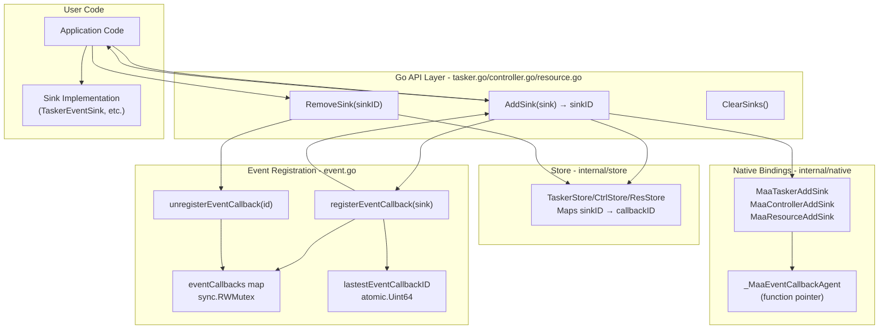
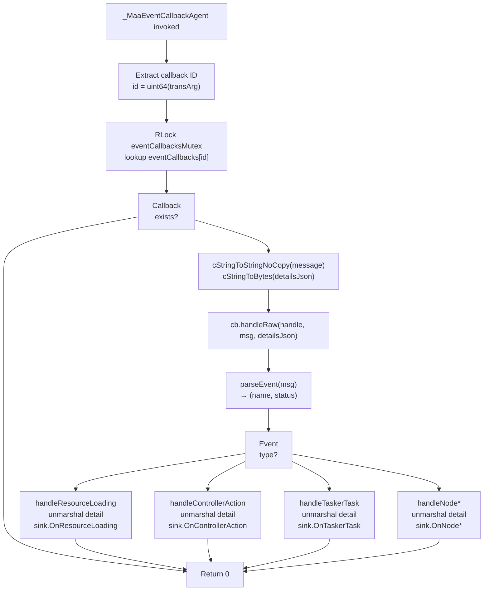
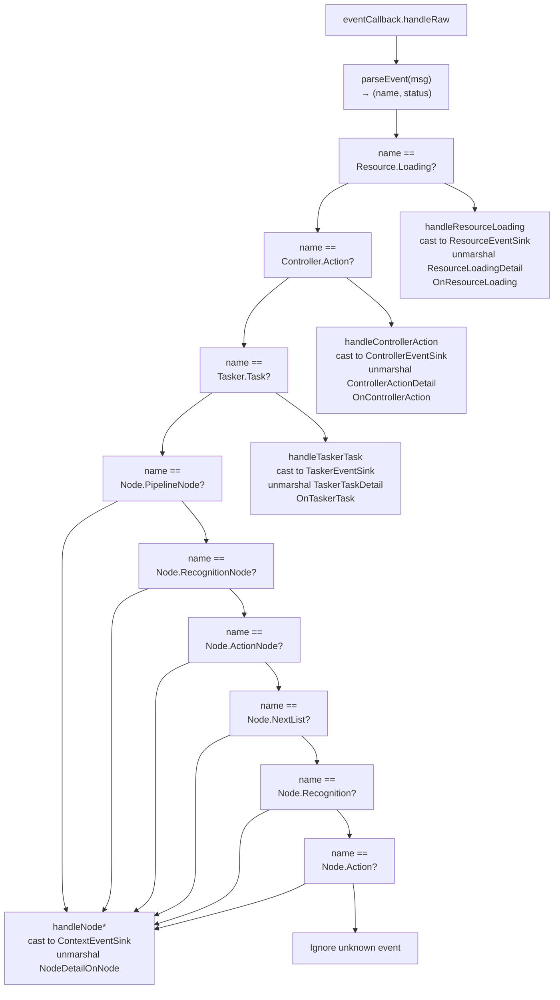

# Event Architecture

Relevant source files

* [context.go](https://github.com/MaaXYZ/maa-framework-go/blob/5f9c965c/context.go)
* [controller.go](https://github.com/MaaXYZ/maa-framework-go/blob/5f9c965c/controller.go)
* [event.go](https://github.com/MaaXYZ/maa-framework-go/blob/5f9c965c/event.go)
* [internal/native/framework.go](https://github.com/MaaXYZ/maa-framework-go/blob/5f9c965c/internal/native/framework.go)
* [recognition\_result.go](https://github.com/MaaXYZ/maa-framework-go/blob/5f9c965c/recognition_result.go)
* [tasker.go](https://github.com/MaaXYZ/maa-framework-go/blob/5f9c965c/tasker.go)

This document describes the event-driven architecture used throughout maa-framework-go for monitoring and reacting to framework operations. The event system enables asynchronous notification of state changes in Resources, Controllers, Taskers, and task execution nodes.

For implementing event listeners, see [Implementing Event Sinks](/MaaXYZ/maa-framework-go/6.2-implementing-event-sinks). For understanding the Job pattern that events complement, see [Async Operations and Job Management](/MaaXYZ/maa-framework-go/6.3-async-operations-and-job-management).

---

## Event Types and Status

The framework defines eight event types organized hierarchically across four component levels:

| Event Constant | Component Level | Description |
| --- | --- | --- |
| `EventResourceLoading` | Resource | Resource bundle/model/pipeline loading operations |
| `EventControllerAction` | Controller | Controller operations (connect, click, swipe, screencap, etc.) |
| `EventTaskerTask` | Tasker | Top-level task execution lifecycle |
| `EventNodePipelineNode` | Node | Pipeline node entry |
| `EventNodeRecognitionNode` | Node | Recognition phase of node execution |
| `EventNodeActionNode` | Node | Action phase of node execution |
| `EventNodeNextList` | Node | Next list evaluation |
| `EventNodeRecognition` | Node | Recognition result availability |
| `EventNodeAction` | Node | Action result availability |

Each event transitions through up to three states represented by `EventStatus`:

| EventStatus | Value | Meaning |
| --- | --- | --- |
| `EventStatusUnknown` | 0 | Status could not be parsed |
| `EventStatusStarting` | 1 | Operation has begun |
| `EventStatusSucceeded` | 2 | Operation completed successfully |
| `EventStatusFailed` | 3 | Operation failed |

Sources: [event.go40-79](https://github.com/MaaXYZ/maa-framework-go/blob/5f9c965c/event.go#L40-L79)

---

## Event Detail Structures

Each event type has an associated detail structure containing contextual information:

### Resource Events

```
```
type ResourceLoadingDetail struct {


ResID uint64  // Resource handle ID


Hash  string  // Content hash


Path  string  // File path being loaded


}
```
```

### Controller Events

```
```
type ControllerActionDetail struct {


CtrlID uint64         // Controller handle ID


UUID   string         // Controller UUID


Action string         // Action name (e.g., "Click", "Swipe")


Param  map[string]any // Action parameters


Info   map[string]any // Additional controller info


}
```
```

### Tasker Events

```
```
type TaskerTaskDetail struct {


TaskID uint64  // Task ID from PostTask


Entry  string  // Entry node name


UUID   string  // Controller UUID


Hash   string  // Resource hash


}
```
```

### Node Events

```
```
type NodePipelineNodeDetail struct {


TaskID uint64  // Parent task ID


NodeID uint64  // Node ID


Name   string  // Node name


Focus  any     // Custom focus data


}


type NodeRecognitionNodeDetail struct {


TaskID uint64


NodeID uint64


Name   string


Focus  any


}


type NodeActionNodeDetail struct {


TaskID uint64


NodeID uint64


Name   string


Focus  any


}


type NodeNextListDetail struct {


TaskID uint64


Name   string


List   []NextItem  // Evaluated next list


Focus  any


}


type NodeRecognitionDetail struct {


TaskID        uint64


RecognitionID uint64  // Recognition detail ID


Name          string


Focus         any


}


type NodeActionDetail struct {


TaskID   uint64


ActionID uint64  // Action detail ID


Name     string


Focus    any


}
```
```

All detail structures are unmarshaled from JSON strings provided by the native framework.

Sources: [event.go81-151](https://github.com/MaaXYZ/maa-framework-go/blob/5f9c965c/event.go#L81-L151)

---

## Event Flow Architecture

The following diagram illustrates the complete event flow from the native framework to user-defined Go sink implementations:

```mermaid
sequenceDiagram
  participant Native Framework
  participant (C/C++)
  participant _MaaEventCallbackAgent
  participant (FFI Callback)
  participant eventCallbacks Map
  participant (Thread-Safe)
  participant eventCallback
  participant (Wrapper)
  participant Event Sink
  participant (User Implementation)

  Native Framework->>_MaaEventCallbackAgent: Invoke callback
  note over _MaaEventCallbackAgent,(FFI Callback): transArg = callback ID
  _MaaEventCallbackAgent->>eventCallbacks Map: handle, message, detailsJson, transArg
  eventCallbacks Map-->>_MaaEventCallbackAgent: RLock + lookup by ID
  _MaaEventCallbackAgent->>_MaaEventCallbackAgent: eventCallback wrapper
  note over _MaaEventCallbackAgent,(FFI Callback): Extract event name
  _MaaEventCallbackAgent->>_MaaEventCallbackAgent: Parse message string
  note over _MaaEventCallbackAgent,(FFI Callback): Type-specific detail
  _MaaEventCallbackAgent->>eventCallback: parseEvent(msg)
  loop [Event: Resource.Loading]
    eventCallback->>Event Sink: Parse detailsJson
    eventCallback->>Event Sink: unmarshalJSON(detailsJson, &detail)
    eventCallback->>Event Sink: handleRaw(handle, msg, detailsJson)
    eventCallback->>Event Sink: OnResourceLoading(resource, status, detail)
    eventCallback->>Event Sink: OnControllerAction(controller, status, detail)
    eventCallback->>Event Sink: OnTaskerTask(tasker, status, detail)
    eventCallback->>Event Sink: OnNodePipelineNode(context, status, detail)
    eventCallback->>Event Sink: OnNodeRecognitionNode(context, status, detail)
    eventCallback->>Event Sink: OnNodeActionNode(context, status, detail)
  end
  _MaaEventCallbackAgent-->>Native Framework: OnNodeNextList(context, status, detail)
```

Sources: [event.go298-358](https://github.com/MaaXYZ/maa-framework-go/blob/5f9c965c/event.go#L298-L358)

---

## Callback Registration System

### Registration Flow

The event callback registration system maintains a thread-safe mapping from callback IDs to sink implementations:



### Key Data Structures

**Global Callback Registry** [event.go15-18](https://github.com/MaaXYZ/maa-framework-go/blob/5f9c965c/event.go#L15-L18):

```
```
var (


lastestEventCallbackID uint64


eventCallbacks         = make(map[uint64]eventCallback)


eventCallbacksMutex    sync.RWMutex


)


type eventCallback struct {


id   uint64


sink any  // Interface to actual sink implementation


}
```
```

**Component-Level Sink Mapping** [tasker.go27-31](https://github.com/MaaXYZ/maa-framework-go/blob/5f9c965c/tasker.go#L27-L31):

```
```
// In TaskerStore (example)


type TaskerStoreValue struct {


SinkIDToEventCallbackID        map[int64]uint64


ContextSinkIDToEventCallbackID map[int64]uint64


}
```
```

The two-level mapping exists because:

1. Native framework returns a `sinkID` (int64) when registering callbacks
2. Go maintains a separate `callbackID` (uint64) for the global registry
3. When removing sinks, Go must translate `sinkID` → `callbackID` → actual callback

### Registration Example

**For Tasker** [tasker.go479-493](https://github.com/MaaXYZ/maa-framework-go/blob/5f9c965c/tasker.go#L479-L493):

```
```
func (t *Tasker) AddSink(sink TaskerEventSink) int64 {


id := registerEventCallback(sink)


sinkId := native.MaaTaskerAddSink(


t.handle,


_MaaEventCallbackAgent,


uintptr(id),  // Pass ID as pointer value


)


store.TaskerStore.Update(t.handle, func(v *store.TaskerStoreValue) {


v.SinkIDToEventCallbackID[sinkId] = id


})


return sinkId


}
```
```

The `registerEventCallback` function [event.go21-32](https://github.com/MaaXYZ/maa-framework-go/blob/5f9c965c/event.go#L21-L32):

```
```
func registerEventCallback(sink any) uint64 {


id := atomic.AddUint64(&lastestEventCallbackID, 1)


eventCallbacksMutex.Lock()


eventCallbacks[id] = eventCallback{


id:   id,


sink: sink,


}


eventCallbacksMutex.Unlock()


return id


}
```
```

Sources: [event.go10-38](https://github.com/MaaXYZ/maa-framework-go/blob/5f9c965c/event.go#L10-L38) [tasker.go479-515](https://github.com/MaaXYZ/maa-framework-go/blob/5f9c965c/tasker.go#L479-L515) [controller.go490-527](https://github.com/MaaXYZ/maa-framework-go/blob/5f9c965c/controller.go#L490-L527)

---

## Event Message Format and Parsing

### Message Format

Event messages from the native framework follow a hierarchical naming convention with status suffixes:

```
<Component>.<Event>[.<Status>]
```

Examples:

* `Resource.Loading.Starting`
* `Resource.Loading.Succeeded`
* `Resource.Loading.Failed`
* `Controller.Action.Starting`
* `Tasker.Task.Succeeded`
* `Node.PipelineNode.Starting`
* `Node.Recognition.Succeeded`

### Parsing Logic

The `parseEvent` function [event.go153-170](https://github.com/MaaXYZ/maa-framework-go/blob/5f9c965c/event.go#L153-L170) extracts event name and status:

```
```
func parseEvent(msg string) (name string, status EventStatus) {


lastDot := strings.LastIndexByte(msg, '.')


if lastDot == -1 {


return msg, EventStatusUnknown


}


switch msg[lastDot:] {


case ".Starting":


return msg[:lastDot], EventStatusStarting


case ".Succeeded":


return msg[:lastDot], EventStatusSucceeded


case ".Failed":


return msg[:lastDot], EventStatusFailed


default:


return msg, EventStatusUnknown


}


}
```
```

This parsing separates `"Resource.Loading.Succeeded"` into:

* Name: `"Resource.Loading"`
* Status: `EventStatusSucceeded`

Sources: [event.go153-170](https://github.com/MaaXYZ/maa-framework-go/blob/5f9c965c/event.go#L153-L170)

---

## FFI Callback Agent

### Agent Function Signature

The central FFI bridge is `_MaaEventCallbackAgent` [event.go338-358](https://github.com/MaaXYZ/maa-framework-go/blob/5f9c965c/event.go#L338-L358) registered with the native framework via `purego.NewCallback`:

```
```
func _MaaEventCallbackAgent(


handle uintptr,        // Component handle (Tasker/Resource/Controller/Context)


message *byte,         // C string: event message


detailsJson *byte,     // C string: JSON detail


transArg uintptr,      // Callback ID disguised as pointer


) uintptr
```
```

**Parameter Meanings:**

| Parameter | Type | Purpose |
| --- | --- | --- |
| `handle` | `uintptr` | Native handle to the component that generated the event |
| `message` | `*byte` | C string containing the event message (e.g., "Resource.Loading.Succeeded") |
| `detailsJson` | `*byte` | C string containing JSON-encoded event details |
| `transArg` | `uintptr` | Callback ID passed as a pointer value (not an actual pointer) |

### Agent Implementation Flow



### C String Conversion

The agent uses optimized C string conversion [event.go360-398](https://github.com/MaaXYZ/maa-framework-go/blob/5f9c965c/event.go#L360-L398):

**Zero-Copy for Message** (consumed immediately):

```
```
func cStringToStringNoCopy(b *byte) string {


if b == nil {


return ""


}


return unsafe.String(b, cStringLen(b))


}
```
```

**Copy for Details** (stored in structures):

```
```
func cStringToBytes(b *byte) []byte {


if b == nil {


return nil


}


return unsafe.Slice(b, cStringLen(b))


}
```
```

The `cStringLen` function [event.go385-398](https://github.com/MaaXYZ/maa-framework-go/blob/5f9c965c/event.go#L385-L398) walks memory until finding null terminator:

```
```
func cStringLen(b *byte) int {


ptr := unsafe.Pointer(b)


length := 0


for {


if *(*byte)(ptr) == 0 {


break


}


ptr = unsafe.Add(ptr, 1)


length++


}


return length


}
```
```

Sources: [event.go338-398](https://github.com/MaaXYZ/maa-framework-go/blob/5f9c965c/event.go#L338-L398)

---

## Native FFI Callback Type

The native framework expects callbacks matching this signature [internal/native/framework.go18](https://github.com/MaaXYZ/maa-framework-go/blob/5f9c965c/internal/native/framework.go#L18-L18):

```
```
type MaaEventCallback func(


handle uintptr,


message, detailsJson *byte,


transArg uintptr,


) uintptr
```
```

This type is passed to native registration functions:

| Native Function | Component | File Reference |
| --- | --- | --- |
| `MaaTaskerAddSink` | Tasker | [framework.go25](https://github.com/MaaXYZ/maa-framework-go/blob/5f9c965c/framework.go#L25-L25) |
| `MaaResourceAddSink` | Resource | [framework.go117](https://github.com/MaaXYZ/maa-framework-go/blob/5f9c965c/framework.go#L117-L117) |
| `MaaControllerAddSink` | Controller | [framework.go184](https://github.com/MaaXYZ/maa-framework-go/blob/5f9c965c/framework.go#L184-L184) |
| `MaaTaskerAddContextSink` | Context | [framework.go28](https://github.com/MaaXYZ/maa-framework-go/blob/5f9c965c/framework.go#L28-L28) |

All registration functions accept:

1. Component handle (`uintptr`)
2. Callback function pointer (`MaaEventCallback`)
3. Transparent argument (`uintptr`) - the callback ID

Sources: [internal/native/framework.go18-31](https://github.com/MaaXYZ/maa-framework-go/blob/5f9c965c/internal/native/framework.go#L18-L31)

---

## Event Dispatch Mapping

The `handleRaw` method [event.go298-331](https://github.com/MaaXYZ/maa-framework-go/blob/5f9c965c/event.go#L298-L331) dispatches to type-specific handlers:



Each handler follows this pattern [event.go172-296](https://github.com/MaaXYZ/maa-framework-go/blob/5f9c965c/event.go#L172-L296):

1. **Type assertion**: Cast sink to expected interface
2. **JSON unmarshaling**: Parse `detailsJSON` into detail structure
3. **Sink invocation**: Call appropriate method with typed parameters

Example for Resource events [event.go172-184](https://github.com/MaaXYZ/maa-framework-go/blob/5f9c965c/event.go#L172-L184):

```
```
func handleResourceLoading(sink any, handle uintptr, status EventStatus, detailsJSON []byte) {


s, ok := sink.(ResourceEventSink)


if !ok {


return  // Sink doesn't implement this interface


}


var detail ResourceLoadingDetail


if err := unmarshalJSON(detailsJSON, &detail); err != nil {


return  // Invalid JSON


}


s.OnResourceLoading(&Resource{handle: handle}, status, detail)


}
```
```

Sources: [event.go172-331](https://github.com/MaaXYZ/maa-framework-go/blob/5f9c965c/event.go#L172-L331)

---

## Component-Specific Event Handling

### Tasker Events

**Tasker-Level Events** fire for task lifecycle [tasker.go479-493](https://github.com/MaaXYZ/maa-framework-go/blob/5f9c965c/tasker.go#L479-L493):

* `Tasker.Task.Starting`: Task posted and execution beginning
* `Tasker.Task.Succeeded`: Task completed successfully
* `Tasker.Task.Failed`: Task failed

**Context-Level Events** fire during node execution [tasker.go517-530](https://github.com/MaaXYZ/maa-framework-go/blob/5f9c965c/tasker.go#L517-L530):

* `Node.PipelineNode`: Pipeline node entry
* `Node.RecognitionNode`: Recognition phase
* `Node.ActionNode`: Action phase
* `Node.NextList`: Next list evaluation
* `Node.Recognition`: Recognition complete with ID
* `Node.Action`: Action complete with ID

Taskers support two sink types via separate registration:

* `AddSink(TaskerEventSink)` for Tasker.Task events
* `AddContextSink(ContextEventSink)` for Node.\* events

### Controller Events

Controllers fire `Controller.Action` events for all operations [controller.go490-505](https://github.com/MaaXYZ/maa-framework-go/blob/5f9c965c/controller.go#L490-L505):

* `PostConnect`, `PostClick`, `PostSwipe`, `PostScreencap`, etc.
* Each operation generates Starting/Succeeded/Failed sequence

### Resource Events

Resources fire `Resource.Loading` events for asset loading [resource.go - not provided but referenced in event.go]:

* `PostBundle`, `PostOcrModel`, `PostPipeline`, `PostImage`
* Loading operations report progress and completion

Sources: [tasker.go479-553](https://github.com/MaaXYZ/maa-framework-go/blob/5f9c965c/tasker.go#L479-L553) [controller.go490-527](https://github.com/MaaXYZ/maa-framework-go/blob/5f9c965c/controller.go#L490-L527)

---

## Thread Safety Guarantees

The event system maintains thread safety through:

1. **Atomic ID Generation** [event.go16](https://github.com/MaaXYZ/maa-framework-go/blob/5f9c965c/event.go#L16-L16):

   ```
   ```
   lastestEventCallbackID uint64  // Atomic counter


   id := atomic.AddUint64(&lastestEventCallbackID, 1)
   ```
   ```
2. **Mutex-Protected Callback Map** [event.go17-18](https://github.com/MaaXYZ/maa-framework-go/blob/5f9c965c/event.go#L17-L18):

   ```
   ```
   eventCallbacks      = make(map[uint64]eventCallback)


   eventCallbacksMutex sync.RWMutex
   ```
   ```

   * Write operations (register/unregister) take exclusive lock
   * Read operations (lookup during callback) take shared lock
3. **Component Store Updates** [tasker.go488-490](https://github.com/MaaXYZ/maa-framework-go/blob/5f9c965c/tasker.go#L488-L490):

   ```
   ```
   store.TaskerStore.Update(t.handle, func(v *store.TaskerStoreValue) {


   v.SinkIDToEventCallbackID[sinkId] = id


   })
   ```
   ```

   The store package provides thread-safe update operations.
4. **No Callback During Destruction** [tasker.go42-51](https://github.com/MaaXYZ/maa-framework-go/blob/5f9c965c/tasker.go#L42-L51):

   ```
   ```
   func (t *Tasker) Destroy() {


   store.TaskerStore.Lock()


   // Unregister all callbacks before destroying


   for _, id := range value.SinkIDToEventCallbackID {


   unregisterEventCallback(id)


   }


   store.TaskerStore.Unlock()


   native.MaaTaskerDestroy(t.handle)


   }
   ```
   ```

These mechanisms ensure callbacks cannot be invoked after unregistration or component destruction.

Sources: [event.go15-38](https://github.com/MaaXYZ/maa-framework-go/blob/5f9c965c/event.go#L15-L38) [tasker.go39-54](https://github.com/MaaXYZ/maa-framework-go/blob/5f9c965c/tasker.go#L39-L54)