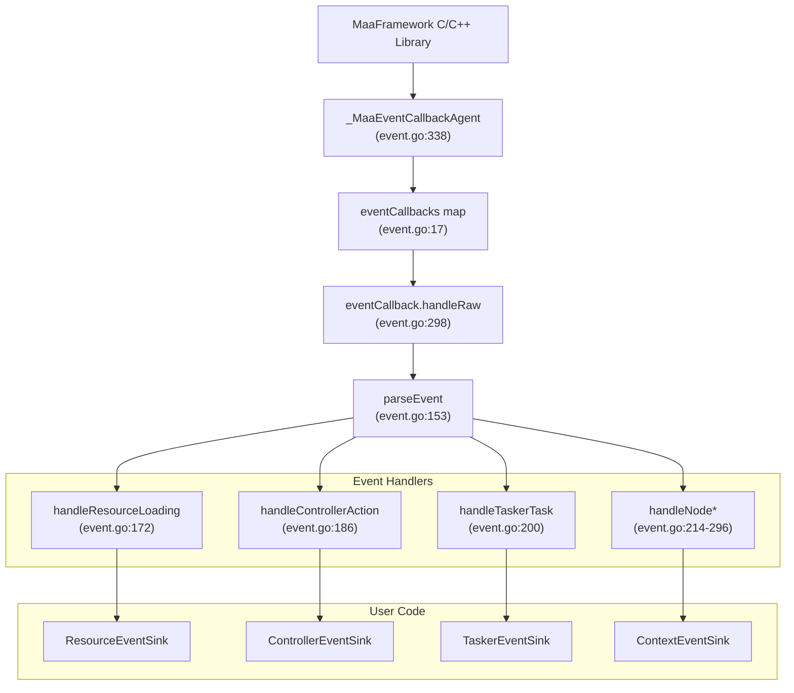
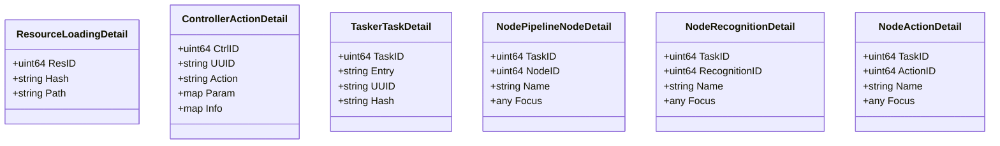
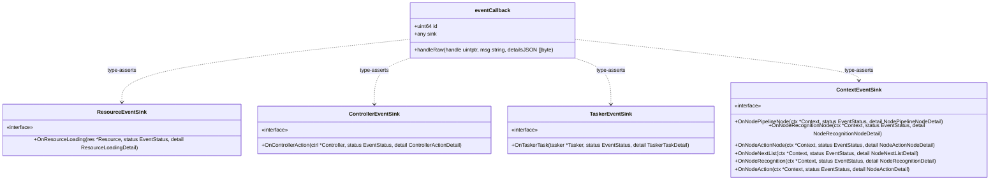
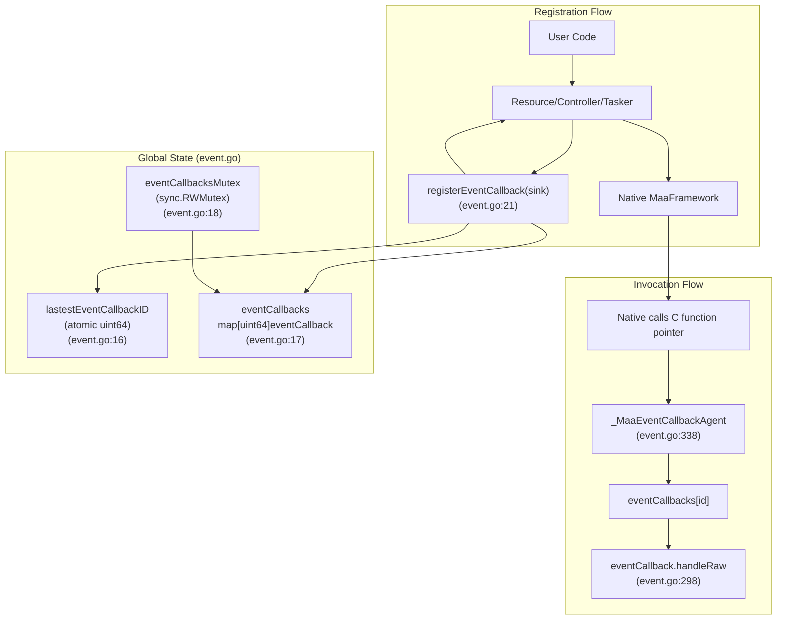
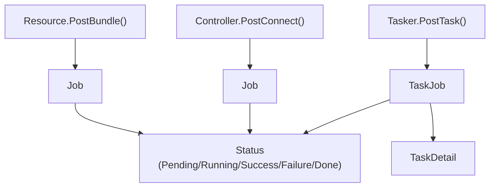

# Event System and Monitoring

Relevant source files

* [event.go](https://github.com/MaaXYZ/maa-framework-go/blob/5f9c965c/event.go)
* [recognition\_result.go](https://github.com/MaaXYZ/maa-framework-go/blob/5f9c965c/recognition_result.go)

The event system in `maa-framework-go` provides real-time monitoring and reactive programming capabilities through a callback-based architecture. The native MaaFramework library emits events during execution, which are captured by the Go binding via FFI and dispatched to user-implemented event sink interfaces. This page provides an overview of the event system architecture and its integration with async operations.

Detailed sub-topics are covered in child pages:

* **Event Architecture** (page 6.1) — event types, sink interfaces, detail structs, and the `_MaaEventCallbackAgent` dispatch loop
* **Implementing Event Sinks** (page 6.2) — how to implement each sink interface and register it with components
* **Async Operations and Job Management** (page 6.3) — `Job` and `TaskJob` handles, `Status` enumeration, and `Wait()` semantics

---

## Event-Driven Architecture

MaaFramework emits events for all significant operations. The Go binding translates C-level callbacks into typed Go interface calls through a multi-stage dispatch mechanism:

**Event dispatch flow:**



**Key components:**

* **`_MaaEventCallbackAgent`** [event.go338-358](https://github.com/MaaXYZ/maa-framework-go/blob/5f9c965c/event.go#L338-L358) — FFI callback function registered with native library via `purego.NewCallback`
* **`eventCallbacks` map** [event.go17](https://github.com/MaaXYZ/maa-framework-go/blob/5f9c965c/event.go#L17-L17) — thread-safe registry mapping `uint64` IDs to sink objects
* **`parseEvent`** [event.go153-170](https://github.com/MaaXYZ/maa-framework-go/blob/5f9c965c/event.go#L153-L170) — extracts event name and status from message string
* **`eventCallback.handleRaw`** [event.go298-331](https://github.com/MaaXYZ/maa-framework-go/blob/5f9c965c/event.go#L298-L331) — routes parsed events to type-specific handlers
* **Event sink interfaces** — `ResourceEventSink`, `ControllerEventSink`, `TaskerEventSink`, `ContextEventSink`

Sources: [event.go1-399](https://github.com/MaaXYZ/maa-framework-go/blob/5f9c965c/event.go#L1-L399)

---

## Event Types and Lifecycle

The `Event` type [event.go40-56](https://github.com/MaaXYZ/maa-framework-go/blob/5f9c965c/event.go#L40-L56) is a string alias with methods that generate lifecycle variants. Each event progresses through states indicated by message suffixes:

**Event lifecycle state machine:**

```
#mermaid-pnwpo5pi2mb{font-family:ui-sans-serif,-apple-system,system-ui,Segoe UI,Helvetica;font-size:16px;fill:#333;}@keyframes edge-animation-frame{from{stroke-dashoffset:0;}}@keyframes dash{to{stroke-dashoffset:0;}}#mermaid-pnwpo5pi2mb .edge-animation-slow{stroke-dasharray:9,5!important;stroke-dashoffset:900;animation:dash 50s linear infinite;stroke-linecap:round;}#mermaid-pnwpo5pi2mb .edge-animation-fast{stroke-dasharray:9,5!important;stroke-dashoffset:900;animation:dash 20s linear infinite;stroke-linecap:round;}#mermaid-pnwpo5pi2mb .error-icon{fill:#dddddd;}#mermaid-pnwpo5pi2mb .error-text{fill:#222222;stroke:#222222;}#mermaid-pnwpo5pi2mb .edge-thickness-normal{stroke-width:1px;}#mermaid-pnwpo5pi2mb .edge-thickness-thick{stroke-width:3.5px;}#mermaid-pnwpo5pi2mb .edge-pattern-solid{stroke-dasharray:0;}#mermaid-pnwpo5pi2mb .edge-thickness-invisible{stroke-width:0;fill:none;}#mermaid-pnwpo5pi2mb .edge-pattern-dashed{stroke-dasharray:3;}#mermaid-pnwpo5pi2mb .edge-pattern-dotted{stroke-dasharray:2;}#mermaid-pnwpo5pi2mb .marker{fill:#999;stroke:#999;}#mermaid-pnwpo5pi2mb .marker.cross{stroke:#999;}#mermaid-pnwpo5pi2mb svg{font-family:ui-sans-serif,-apple-system,system-ui,Segoe UI,Helvetica;font-size:16px;}#mermaid-pnwpo5pi2mb p{margin:0;}#mermaid-pnwpo5pi2mb defs #statediagram-barbEnd{fill:#999;stroke:#999;}#mermaid-pnwpo5pi2mb g.stateGroup text{fill:#dddddd;stroke:none;font-size:10px;}#mermaid-pnwpo5pi2mb g.stateGroup text{fill:#333;stroke:none;font-size:10px;}#mermaid-pnwpo5pi2mb g.stateGroup .state-title{font-weight:bolder;fill:#333;}#mermaid-pnwpo5pi2mb g.stateGroup rect{fill:#ffffff;stroke:#dddddd;}#mermaid-pnwpo5pi2mb g.stateGroup line{stroke:#999;stroke-width:1;}#mermaid-pnwpo5pi2mb .transition{stroke:#999;stroke-width:1;fill:none;}#mermaid-pnwpo5pi2mb .stateGroup .composit{fill:#f4f4f4;border-bottom:1px;}#mermaid-pnwpo5pi2mb .stateGroup .alt-composit{fill:#e0e0e0;border-bottom:1px;}#mermaid-pnwpo5pi2mb .state-note{stroke:#e6d280;fill:#fff5ad;}#mermaid-pnwpo5pi2mb .state-note text{fill:#333;stroke:none;font-size:10px;}#mermaid-pnwpo5pi2mb .stateLabel .box{stroke:none;stroke-width:0;fill:#ffffff;opacity:0.5;}#mermaid-pnwpo5pi2mb .edgeLabel .label rect{fill:#ffffff;opacity:0.5;}#mermaid-pnwpo5pi2mb .edgeLabel{background-color:#ffffff;text-align:center;}#mermaid-pnwpo5pi2mb .edgeLabel p{background-color:#ffffff;}#mermaid-pnwpo5pi2mb .edgeLabel rect{opacity:0.5;background-color:#ffffff;fill:#ffffff;}#mermaid-pnwpo5pi2mb .edgeLabel .label text{fill:#333;}#mermaid-pnwpo5pi2mb .label div .edgeLabel{color:#333;}#mermaid-pnwpo5pi2mb .stateLabel text{fill:#333;font-size:10px;font-weight:bold;}#mermaid-pnwpo5pi2mb .node circle.state-start{fill:#999;stroke:#999;}#mermaid-pnwpo5pi2mb .node .fork-join{fill:#999;stroke:#999;}#mermaid-pnwpo5pi2mb .node circle.state-end{fill:#dddddd;stroke:#f4f4f4;stroke-width:1.5;}#mermaid-pnwpo5pi2mb .end-state-inner{fill:#f4f4f4;stroke-width:1.5;}#mermaid-pnwpo5pi2mb .node rect{fill:#ffffff;stroke:#dddddd;stroke-width:1px;}#mermaid-pnwpo5pi2mb .node polygon{fill:#ffffff;stroke:#dddddd;stroke-width:1px;}#mermaid-pnwpo5pi2mb #statediagram-barbEnd{fill:#999;}#mermaid-pnwpo5pi2mb .statediagram-cluster rect{fill:#ffffff;stroke:#dddddd;stroke-width:1px;}#mermaid-pnwpo5pi2mb .cluster-label,#mermaid-pnwpo5pi2mb .nodeLabel{color:#333;}#mermaid-pnwpo5pi2mb .statediagram-cluster rect.outer{rx:5px;ry:5px;}#mermaid-pnwpo5pi2mb .statediagram-state .divider{stroke:#dddddd;}#mermaid-pnwpo5pi2mb .statediagram-state .title-state{rx:5px;ry:5px;}#mermaid-pnwpo5pi2mb .statediagram-cluster.statediagram-cluster .inner{fill:#f4f4f4;}#mermaid-pnwpo5pi2mb .statediagram-cluster.statediagram-cluster-alt .inner{fill:#f8f8f8;}#mermaid-pnwpo5pi2mb .statediagram-cluster .inner{rx:0;ry:0;}#mermaid-pnwpo5pi2mb .statediagram-state rect.basic{rx:5px;ry:5px;}#mermaid-pnwpo5pi2mb .statediagram-state rect.divider{stroke-dasharray:10,10;fill:#f8f8f8;}#mermaid-pnwpo5pi2mb .note-edge{stroke-dasharray:5;}#mermaid-pnwpo5pi2mb .statediagram-note rect{fill:#fff5ad;stroke:#e6d280;stroke-width:1px;rx:0;ry:0;}#mermaid-pnwpo5pi2mb .statediagram-note rect{fill:#fff5ad;stroke:#e6d280;stroke-width:1px;rx:0;ry:0;}#mermaid-pnwpo5pi2mb .statediagram-note text{fill:#333;}#mermaid-pnwpo5pi2mb .statediagram-note .nodeLabel{color:#333;}#mermaid-pnwpo5pi2mb .statediagram .edgeLabel{color:red;}#mermaid-pnwpo5pi2mb #dependencyStart,#mermaid-pnwpo5pi2mb #dependencyEnd{fill:#999;stroke:#999;stroke-width:1;}#mermaid-pnwpo5pi2mb .statediagramTitleText{text-anchor:middle;font-size:18px;fill:#333;}#mermaid-pnwpo5pi2mb :root{--mermaid-font-family:"trebuchet ms",verdana,arial,sans-serif;}

".Starting suffix"


".Succeeded suffix"


".Failed suffix"


Event Type  
(e.g. Resource.Loading)


Starting  
(EventStatusStarting)


Succeeded  
(EventStatusSucceeded)


Failed  
(EventStatusFailed)
```

**Event type constants and routing:**

| Constant | Base String | Emitter | Sink Interface | Handler Function |
| --- | --- | --- | --- | --- |
| `EventResourceLoading` | `"Resource.Loading"` | `Resource` | `ResourceEventSink` | `handleResourceLoading` [event.go172](https://github.com/MaaXYZ/maa-framework-go/blob/5f9c965c/event.go#L172-L172) |
| `EventControllerAction` | `"Controller.Action"` | `Controller` | `ControllerEventSink` | `handleControllerAction` [event.go186](https://github.com/MaaXYZ/maa-framework-go/blob/5f9c965c/event.go#L186-L186) |
| `EventTaskerTask` | `"Tasker.Task"` | `Tasker` | `TaskerEventSink` | `handleTaskerTask` [event.go200](https://github.com/MaaXYZ/maa-framework-go/blob/5f9c965c/event.go#L200-L200) |
| `EventNodePipelineNode` | `"Node.PipelineNode"` | `Context` | `ContextEventSink` | `handleNodePipelineNode` [event.go214](https://github.com/MaaXYZ/maa-framework-go/blob/5f9c965c/event.go#L214-L214) |
| `EventNodeRecognitionNode` | `"Node.RecognitionNode"` | `Context` | `ContextEventSink` | `handleNodeRecognitionNode` [event.go228](https://github.com/MaaXYZ/maa-framework-go/blob/5f9c965c/event.go#L228-L228) |
| `EventNodeActionNode` | `"Node.ActionNode"` | `Context` | `ContextEventSink` | `handleNodeActionNode` [event.go242](https://github.com/MaaXYZ/maa-framework-go/blob/5f9c965c/event.go#L242-L242) |
| `EventNodeNextList` | `"Node.NextList"` | `Context` | `ContextEventSink` | `handleNodeNextList` [event.go256](https://github.com/MaaXYZ/maa-framework-go/blob/5f9c965c/event.go#L256-L256) |
| `EventNodeRecognition` | `"Node.Recognition"` | `Context` | `ContextEventSink` | `handleNodeRecognition` [event.go270](https://github.com/MaaXYZ/maa-framework-go/blob/5f9c965c/event.go#L270-L270) |
| `EventNodeAction` | `"Node.Action"` | `Context` | `ContextEventSink` | `handleNodeAction` [event.go284](https://github.com/MaaXYZ/maa-framework-go/blob/5f9c965c/event.go#L284-L284) |

The `parseEvent` function [event.go153-170](https://github.com/MaaXYZ/maa-framework-go/blob/5f9c965c/event.go#L153-L170) extracts the base event name and status by parsing the suffix:

```
```
// Example: "Resource.Loading.Succeeded" → ("Resource.Loading", EventStatusSucceeded)
```
```

| `EventStatus` | Value | Suffix |
| --- | --- | --- |
| `EventStatusUnknown` | 0 | (none) |
| `EventStatusStarting` | 1 | `.Starting` |
| `EventStatusSucceeded` | 2 | `.Succeeded` |
| `EventStatusFailed` | 3 | `.Failed` |

Sources: [event.go40-80](https://github.com/MaaXYZ/maa-framework-go/blob/5f9c965c/event.go#L40-L80) [event.go153-170](https://github.com/MaaXYZ/maa-framework-go/blob/5f9c965c/event.go#L153-L170) [event.go298-331](https://github.com/MaaXYZ/maa-framework-go/blob/5f9c965c/event.go#L298-L331)

---

## Event Detail Structures

Each event type has an associated detail struct that carries operation-specific information. The native library provides this data as JSON, which is unmarshaled into strongly-typed Go structs:

**Event detail struct mapping:**



| Detail Struct | JSON Fields | Purpose |
| --- | --- | --- |
| `ResourceLoadingDetail` [event.go82-86](https://github.com/MaaXYZ/maa-framework-go/blob/5f9c965c/event.go#L82-L86) | `res_id`, `hash`, `path` | Resource bundle loading progress |
| `ControllerActionDetail` [event.go89-95](https://github.com/MaaXYZ/maa-framework-go/blob/5f9c965c/event.go#L89-L95) | `ctrl_id`, `uuid`, `action`, `param`, `info` | Controller action execution (click, swipe, etc.) |
| `TaskerTaskDetail` [event.go98-103](https://github.com/MaaXYZ/maa-framework-go/blob/5f9c965c/event.go#L98-L103) | `task_id`, `entry`, `uuid`, `hash` | Task execution lifecycle |
| `NodePipelineNodeDetail` [event.go106-111](https://github.com/MaaXYZ/maa-framework-go/blob/5f9c965c/event.go#L106-L111) | `task_id`, `node_id`, `name`, `focus` | Pipeline node entry/exit |
| `NodeRecognitionNodeDetail` [event.go114-119](https://github.com/MaaXYZ/maa-framework-go/blob/5f9c965c/event.go#L114-L119) | `task_id`, `node_id`, `name`, `focus` | Recognition evaluation phase |
| `NodeActionNodeDetail` [event.go122-127](https://github.com/MaaXYZ/maa-framework-go/blob/5f9c965c/event.go#L122-L127) | `task_id`, `node_id`, `name`, `focus` | Action execution phase |
| `NodeNextListDetail` [event.go130-135](https://github.com/MaaXYZ/maa-framework-go/blob/5f9c965c/event.go#L130-L135) | `task_id`, `name`, `list`, `focus` | Next node list determination |
| `NodeRecognitionDetail` [event.go138-143](https://github.com/MaaXYZ/maa-framework-go/blob/5f9c965c/event.go#L138-L143) | `task_id`, `reco_id`, `name`, `focus` | Individual recognition operation |
| `NodeActionDetail` [event.go146-151](https://github.com/MaaXYZ/maa-framework-go/blob/5f9c965c/event.go#L146-L151) | `task_id`, `action_id`, `name`, `focus` | Individual action operation |

The `focus` field in node events is an arbitrary JSON value (type `any`) that can carry context-specific data from pipeline definitions.

Sources: [event.go82-151](https://github.com/MaaXYZ/maa-framework-go/blob/5f9c965c/event.go#L82-L151)

---

## Event Sink Interfaces

Event sinks are Go interfaces that receive typed callbacks. User code implements one or more of these interfaces to react to framework operations:

**Event sink interface hierarchy:**



**Interface-to-component binding:**

| Sink Interface | Registered With | Method Count | Primary Use Case |
| --- | --- | --- | --- |
| `ResourceEventSink` | `Resource` | 1 | Monitor resource loading operations |
| `ControllerEventSink` | `Controller` | 1 | Track device control actions |
| `TaskerEventSink` | `Tasker` | 1 | Observe task lifecycle |
| `ContextEventSink` | `Tasker` | 6 | Monitor node-level execution details |

The `eventCallback.handleRaw` method [event.go298-331](https://github.com/MaaXYZ/maa-framework-go/blob/5f9c965c/event.go#L298-L331) performs runtime type assertions to determine which interfaces the sink object implements, then invokes the corresponding handler functions. A single user struct can implement multiple interfaces to receive events from different components.

Sources: [event.go10-13](https://github.com/MaaXYZ/maa-framework-go/blob/5f9c965c/event.go#L10-L13) [event.go172-296](https://github.com/MaaXYZ/maa-framework-go/blob/5f9c965c/event.go#L172-L296) [event.go298-331](https://github.com/MaaXYZ/maa-framework-go/blob/5f9c965c/event.go#L298-L331)

---

## Callback Registration and Thread Safety

Event sinks are registered in a thread-safe global registry using atomic ID generation and mutex-protected map access:

**Registration mechanism:**



**Key functions:**

* **`registerEventCallback(sink any) uint64`** [event.go21-32](https://github.com/MaaXYZ/maa-framework-go/blob/5f9c965c/event.go#L21-L32) — generates unique ID via `atomic.AddUint64`, stores sink in map under write lock
* **`unregisterEventCallback(id uint64)`** [event.go34-38](https://github.com/MaaXYZ/maa-framework-go/blob/5f9c965c/event.go#L34-L38) — removes sink from map under write lock
* **`_MaaEventCallbackAgent`** [event.go338-358](https://github.com/MaaXYZ/maa-framework-go/blob/5f9c965c/event.go#L338-L358) — FFI callback agent registered with native library, looks up sink by ID under read lock

The `transArg` parameter passed through the FFI boundary carries the registration ID as a `uintptr`. The agent converts it back to `uint64` to perform the map lookup. This design ensures that:

1. Multiple goroutines can register sinks concurrently (atomic counter)
2. Multiple events can be dispatched concurrently (read lock allows parallel access)
3. Sink removal is safe (write lock for deletion)

Sources: [event.go15-39](https://github.com/MaaXYZ/maa-framework-go/blob/5f9c965c/event.go#L15-L39) [event.go338-358](https://github.com/MaaXYZ/maa-framework-go/blob/5f9c965c/event.go#L338-L358)

---

## Async Operations Summary

All `Post*` methods (e.g., `Tasker.PostTask`, `Resource.PostBundle`, `Controller.PostConnect`) return a `Job` or `TaskJob` handle rather than blocking. These handles expose a `Status` enumeration and a `Wait()` method. See [Async Operations and Job Management](/MaaXYZ/maa-framework-go/6.3-async-operations-and-job-management) for the full reference.



Sources: [event.go1-9](https://github.com/MaaXYZ/maa-framework-go/blob/5f9c965c/event.go#L1-L9)