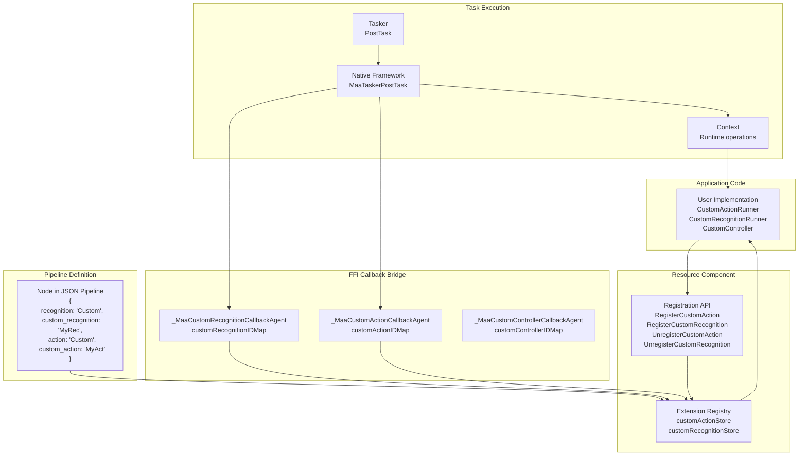
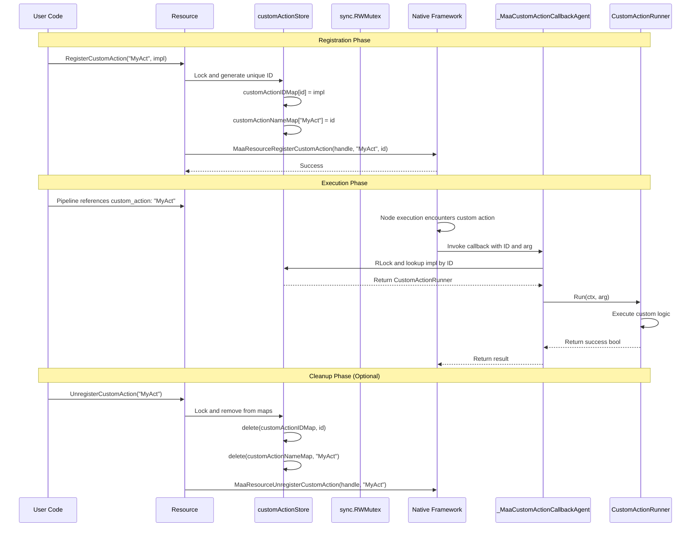
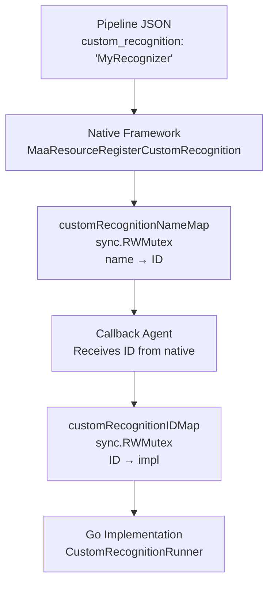
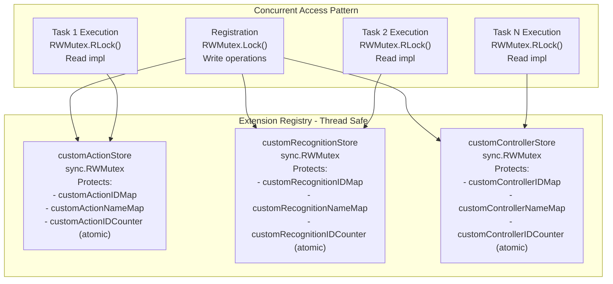
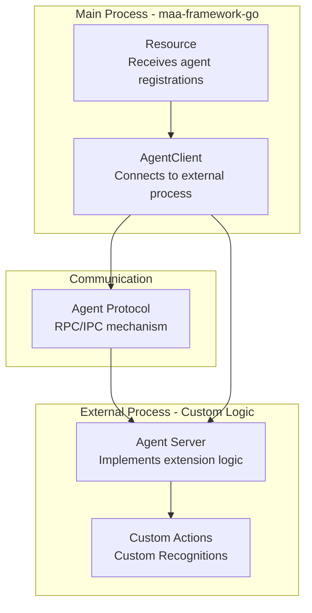

# Extension System

Relevant source files

* [README.md](https://github.com/MaaXYZ/maa-framework-go/blob/5f9c965c/README.md?plain=1)
* [README\_zh.md](https://github.com/MaaXYZ/maa-framework-go/blob/5f9c965c/README_zh.md?plain=1)
* [examples/custom-action/main.go](https://github.com/MaaXYZ/maa-framework-go/blob/5f9c965c/examples/custom-action/main.go)
* [examples/quick-start/main.go](https://github.com/MaaXYZ/maa-framework-go/blob/5f9c965c/examples/quick-start/main.go)

## Purpose and Scope

The Extension System provides three primary interfaces for extending maa-framework-go with custom logic:

* **Custom Actions** - Define custom automation behaviors beyond the built-in action types ([see 5.1](/MaaXYZ/maa-framework-go/5.1-custom-actions))
* **Custom Recognition** - Implement specialized image recognition algorithms ([see 5.2](/MaaXYZ/maa-framework-go/5.2-custom-recognition))
* **Custom Controllers** - Create device control implementations for new platforms ([see 5.3](/MaaXYZ/maa-framework-go/5.3-custom-controllers))

This page provides an architectural overview of how the extension system operates. For implementation details of each extension type, refer to the respective subsections. For agent-based extensions that run in external processes, see [Agent Client and Server](/MaaXYZ/maa-framework-go/7.4-agent-client-and-server).

**Sources**: [README.md40-49](https://github.com/MaaXYZ/maa-framework-go/blob/5f9c965c/README.md?plain=1#L40-L49) [examples/custom-action/main.go1-76](https://github.com/MaaXYZ/maa-framework-go/blob/5f9c965c/examples/custom-action/main.go#L1-L76)

---

## Extension Architecture

The extension system operates through a name-based registration and lookup mechanism. Custom implementations are registered with the `Resource` component, then referenced by name in pipeline JSON configurations. When the native framework encounters a custom extension reference during task execution, it invokes the Go implementation through an FFI callback bridge.



**Diagram**: Extension System Architecture - Registration to Invocation Flow

This diagram illustrates how user implementations are registered, stored, and invoked during pipeline execution. The FFI callback bridge enables the native C++ code to safely call Go implementations.

**Sources**: [README.md47-49](https://github.com/MaaXYZ/maa-framework-go/blob/5f9c965c/README.md?plain=1#L47-L49) [examples/custom-action/main.go58-61](https://github.com/MaaXYZ/maa-framework-go/blob/5f9c965c/examples/custom-action/main.go#L58-L61)

---

## Extension Interfaces

The framework defines three extension interfaces, each serving a distinct purpose in the automation pipeline:

| Interface | Purpose | Registration Method | Invocation Context |
| --- | --- | --- | --- |
| `CustomActionRunner` | Execute custom automation logic (e.g., complex interactions, API calls, state management) | `Resource.RegisterCustomAction(name, impl)` | After recognition succeeds, as part of node action |
| `CustomRecognitionRunner` | Perform specialized image analysis or non-visual recognition | `Resource.RegisterCustomRecognition(name, impl)` | During node recognition phase, before action |
| `CustomController` | Implement device control for new platforms or protocols | `NewCustomController(impl, name)` | Throughout task execution for screenshots and input |

### Interface Signatures

**CustomActionRunner**:

```
```
type CustomActionRunner interface {


Run(ctx *Context, arg *CustomActionArg) bool


}
```
```

**CustomRecognitionRunner**:

```
```
type CustomRecognitionRunner interface {


Run(ctx *Context, arg *CustomRecognitionArg) (*CustomRecognitionResult, bool)


}
```
```

**CustomController**:

```
```
type CustomController interface {


Connect() bool


PostImage(buffer *buffer.ImageBuffer) bool


PostClick(x, y int32) bool


PostSwipe(x1, y1, x2, y2, duration int32) bool


// ... additional methods


}
```
```

**Sources**: [examples/custom-action/main.go71-75](https://github.com/MaaXYZ/maa-framework-go/blob/5f9c965c/examples/custom-action/main.go#L71-L75)

---

## Registration and Invocation Flow

Custom implementations follow a specific lifecycle from registration to invocation:



**Diagram**: Custom Action Registration and Invocation Sequence

### Key Characteristics

1. **Unique ID Assignment**: Each registered implementation receives a monotonically increasing ID (using `atomic.AddUint64`)
2. **Dual Mapping**: The framework maintains both name→ID and ID→implementation mappings for efficient lookup
3. **Thread-Safe Storage**: All maps are protected by `sync.RWMutex`, allowing concurrent reads during execution
4. **FFI Bridge Pattern**: The native framework holds opaque IDs, never direct Go pointers, ensuring memory safety across the FFI boundary
5. **Context Injection**: Each invocation receives a fresh `Context` object providing controlled access to framework capabilities

**Sources**: [examples/custom-action/main.go58-69](https://github.com/MaaXYZ/maa-framework-go/blob/5f9c965c/examples/custom-action/main.go#L58-L69)

---

## Name-Based Resolution System

Custom extensions are referenced in pipeline JSON by name. The framework resolves these names at runtime:

### Pipeline JSON Example

```
```
{


"MyTask": {


"recognition": "Custom",


"custom_recognition": "MyRecognizer",


"custom_recognition_param": {


"threshold": 0.8


},


"action": "Custom",


"custom_action": "MyAction",


"custom_action_param": {


"click_count": 3


}


}


}
```
```

### Resolution Process



**Diagram**: Name Resolution Flow from Pipeline to Implementation

### Name Uniqueness

* **Custom Actions/Recognitions**: Names must be unique within their respective registries on a single `Resource` instance
* **Registration returns error** if attempting to register a name that already exists
* **Unregistration is idempotent**: Unregistering a non-existent name is a no-op
* **Multiple Resources**: Different `Resource` instances maintain independent registries

**Sources**: [examples/custom-action/main.go58-61](https://github.com/MaaXYZ/maa-framework-go/blob/5f9c965c/examples/custom-action/main.go#L58-L61)

---

## The Context Object

Custom implementations receive a `Context` object that provides controlled access to framework capabilities. This ensures extensions cannot perform unsafe operations while enabling powerful nested behaviors.

### Context Capabilities

| Method Category | Available Operations |
| --- | --- |
| **Task Execution** | `RunTask(entry, pipeline)` - Execute sub-pipelines |
| **Recognition** | `RunRecognition(image, entry, pipeline)` - Perform recognition without device interaction |
| **Actions** | `RunAction(entry, pipeline, recDetail, recRect)` - Execute actions with recognition results |
| **State Query** | `GetTasker()` - Access parent tasker, `ClickRecResult()` - Helper for clicking recognition results |
| **Pipeline Control** | `OverridePipeline(entry, pipeline)`, `OverrideNext(entry, nextItems)` - Dynamic pipeline modification |
| **Synchronization** | Various `WaitFreezes()` methods - Wait for screen stability |

### Usage Example from Custom Action

```
```
type ComplexAction struct{}


func (a *ComplexAction) Run(ctx *maa.Context, arg *maa.CustomActionArg) bool {


// Parse custom parameters


var params struct {


SubTask string `json:"sub_task"`


Retries int    `json:"retries"`


}


if err := json.Unmarshal(arg.CustomParam, &params); err != nil {


return false


}


// Execute sub-pipeline


pipeline := maa.NewPipeline()


defer pipeline.Destroy()


// ... configure pipeline ...


for i := 0; i < params.Retries; i++ {


job := ctx.RunTask(params.SubTask, pipeline)


if job.Wait().Success() {


return true


}


}


return false


}
```
```

### Context Lifecycle

* **Creation**: A new `Context` is created by the native framework for each custom extension invocation
* **Scope**: The context is valid only during the `Run` method call
* **Thread Safety**: Each invocation receives its own context; no sharing between concurrent calls
* **Cleanup**: The context is automatically released after the `Run` method returns

**Sources**: [examples/custom-action/main.go73-75](https://github.com/MaaXYZ/maa-framework-go/blob/5f9c965c/examples/custom-action/main.go#L73-L75)

---

## Thread Safety and Concurrency

The extension system is designed for concurrent execution with multiple tasks running simultaneously:

### Thread-Safe Components



**Diagram**: Thread-Safe Extension Registry Access Patterns

### Implementation Guidelines

1. **Stateless Implementations Recommended**: Custom implementations should be stateless or use their own synchronization

   * The same implementation instance may be invoked concurrently by multiple tasks
   * Use goroutine-safe data structures if maintaining state
2. **Context is Not Thread-Safe**: Each `Context` object is specific to one invocation

   * Do not share context objects between goroutines
   * Do not store context objects for later use
3. **Atomic ID Generation**: ID counters use `atomic.AddUint64` to ensure unique IDs without lock contention
4. **Read-Write Lock Pattern**:

   * Registrations acquire write lock (`Lock()`)
   * Lookups during execution acquire read lock (`RLock()`)
   * Allows concurrent task execution while preventing registration races

### Example Thread-Safe Custom Action

```
```
type ThreadSafeAction struct {


mu      sync.Mutex


counter int64


}


func (a *ThreadSafeAction) Run(ctx *maa.Context, arg *maa.CustomActionArg) bool {


// Safely increment counter


a.mu.Lock()


a.counter++


currentCount := a.counter


a.mu.Unlock()


// Use context (safe - context is per-invocation)


job := ctx.RunTask("SomeTask", nil)


return job.Wait().Success()


}
```
```

**Sources**: [examples/custom-action/main.go71-75](https://github.com/MaaXYZ/maa-framework-go/blob/5f9c965c/examples/custom-action/main.go#L71-L75)

---

## Agent-Based Extensions

The extension system supports mounting custom logic from external processes via the agent architecture. This enables:

* **Language Independence**: Implement extensions in languages other than Go
* **Process Isolation**: Run untrusted or experimental code in separate processes
* **Resource Management**: Separate memory and CPU usage from main process
* **Hot Reloading**: Update extension logic without restarting the main application

### Agent Architecture Overview



**Diagram**: Agent-Based Extension Communication

For detailed documentation on implementing and using agent-based extensions, see [Agent Client and Server](/MaaXYZ/maa-framework-go/7.4-agent-client-and-server).

**Sources**: [README.md49](https://github.com/MaaXYZ/maa-framework-go/blob/5f9c965c/README.md?plain=1#L49-L49)

---

## Extension System Summary

The extension system provides three flexible integration points for customizing maa-framework-go behavior:

| Extension Type | Use Case | Complexity | Thread Safety |
| --- | --- | --- | --- |
| **Custom Actions** | Automate behaviors not covered by built-in actions | Low - Simple interface | Registry is thread-safe; implementation should handle own state |
| **Custom Recognition** | Implement specialized detection algorithms | Medium - Must return structured results | Same as actions |
| **Custom Controllers** | Support new device types or protocols | High - Full controller interface | FFI bridge handles concurrency; implementation must be thread-safe |

### Design Principles

1. **Name-Based Indirection**: Extensions are referenced by name, not direct pointers, maintaining clean separation between JSON pipelines and Go code
2. **FFI-Safe Callback Bridge**: The agent functions use opaque IDs to safely cross the Go/C boundary without exposing Go pointers
3. **Context-Scoped Capabilities**: Extensions receive controlled access to framework features through the `Context` object
4. **Concurrent Execution Support**: Thread-safe registries enable multiple tasks to invoke extensions simultaneously

For implementation guides, proceed to:

* [Custom Actions](/MaaXYZ/maa-framework-go/5.1-custom-actions) - Detailed guide on implementing `CustomActionRunner`
* [Custom Recognition](/MaaXYZ/maa-framework-go/5.2-custom-recognition) - Detailed guide on implementing `CustomRecognitionRunner`
* [Custom Controllers](/MaaXYZ/maa-framework-go/5.3-custom-controllers) - Detailed guide on implementing `CustomController`

**Sources**: [README.md40-49](https://github.com/MaaXYZ/maa-framework-go/blob/5f9c965c/README.md?plain=1#L40-L49) [examples/custom-action/main.go1-76](https://github.com/MaaXYZ/maa-framework-go/blob/5f9c965c/examples/custom-action/main.go#L1-L76)