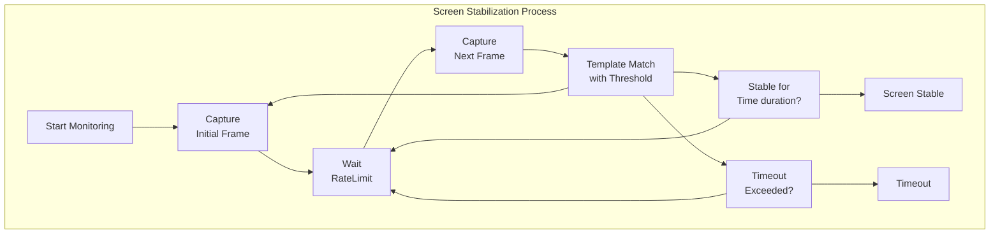

# Flow Control and Timing

Relevant source files

* [CHANGELOG.md](https://github.com/MaaXYZ/maa-framework-go/blob/5f9c965c/CHANGELOG.md?plain=1)
* [context.go](https://github.com/MaaXYZ/maa-framework-go/blob/5f9c965c/context.go)
* [context\_test.go](https://github.com/MaaXYZ/maa-framework-go/blob/5f9c965c/context_test.go)
* [recognition\_result\_test.go](https://github.com/MaaXYZ/maa-framework-go/blob/5f9c965c/recognition_result_test.go)
* [resource\_test.go](https://github.com/MaaXYZ/maa-framework-go/blob/5f9c965c/resource_test.go)
* [tasker.go](https://github.com/MaaXYZ/maa-framework-go/blob/5f9c965c/tasker.go)
* [tasker\_test.go](https://github.com/MaaXYZ/maa-framework-go/blob/5f9c965c/tasker_test.go)

This page documents the timing and flow control attributes available on pipeline nodes. These attributes control when and how nodes execute, including recognition rate limiting, action delays, repetition, and conditional branching. For information about the overall pipeline architecture and node chaining, see [Pipeline Architecture](/MaaXYZ/maa-framework-go/4.1-pipeline-architecture). For details on the recognition and action types themselves, see [Recognition Types](/MaaXYZ/maa-framework-go/4.2-recognition-types) and [Action Types](/MaaXYZ/maa-framework-go/4.3-action-types).

## Overview

Flow control and timing attributes in maa-framework-go provide fine-grained control over node execution behavior. These attributes are defined on the `Node` struct and control:

* **Recognition timing**: How frequently recognition attempts occur and when they timeout
* **Action timing**: Delays before and after action execution
* **Repetition**: How many times a node repeats and delays between repetitions
* **Execution control**: Whether nodes are enabled, inverted, or limited by hit count
* **Screen stabilization**: Waiting for screen content to freeze before/after actions
* **Error handling**: Alternative execution paths when recognition fails

All timing attributes are optional and have sensible defaults defined by the underlying MaaFramework library.

## Node Timing Attributes

The following diagram shows how timing attributes relate to the node execution lifecycle:

```mermaid
flowchart TD

Start["Node Entered"]
CheckEnabled["Enabled?"]
Failure["Failure Path<br>(OnError list)"]
CheckRate["Within<br>RateLimit?"]
WaitRate["Wait for<br>RateLimit"]
Recognition["Recognition Attempt"]
CheckTimeout["Timeout<br>Exceeded?"]
CheckInverse["Inverse?"]
InvertResult["Invert Result"]
PreDelay["PreDelay<br>(default: 200ms)"]
PreWait["PreWaitFreezes<br>(optional)"]
ExecuteAction["Execute Action"]
PostDelay["PostDelay<br>(default: 200ms)"]
PostWait["PostWaitFreezes<br>(optional)"]
CheckRepeat["Repeat<br>Count?"]
RepeatDelay["RepeatDelay<br>(default: 0ms)"]
RepeatWait["RepeatWaitFreezes<br>(optional)"]
Success["Success Path<br>(Next list)"]


subgraph NodeExecution ["Node Execution Lifecycle"]
    Start
    CheckEnabled
    Failure
    CheckRate
    WaitRate
    Recognition
    CheckTimeout
    CheckInverse
    InvertResult
    PreDelay
    PreWait
    ExecuteAction
    PostDelay
    PostWait
    CheckRepeat
    RepeatDelay
    RepeatWait
    Success
    Start --> CheckEnabled
    CheckEnabled --> Failure
    CheckEnabled --> CheckRate
    CheckRate --> WaitRate
    WaitRate --> Recognition
    CheckRate --> Recognition
    Recognition --> CheckTimeout
    CheckTimeout --> Failure
    CheckTimeout --> CheckRate
    Recognition --> CheckInverse
    CheckInverse --> InvertResult
    CheckInverse --> PreDelay
    InvertResult --> PreDelay
    PreDelay --> PreWait
    PreWait --> ExecuteAction
    ExecuteAction --> PostDelay
    PostDelay --> PostWait
    PostWait --> CheckRepeat
    CheckRepeat --> RepeatDelay
    RepeatDelay --> RepeatWait
    RepeatWait --> PreDelay
    CheckRepeat --> Success
end
```



Sources: [node.go8-51](https://github.com/MaaXYZ/maa-framework-go/blob/5f9c965c/node.go#L8-L51) [context\_test.go1118-1232](https://github.com/MaaXYZ/maa-framework-go/blob/5f9c965c/context_test.go#L1118-L1232)

### Timing Attribute Code Mapping

The following table maps conceptual timing attributes to their code representations:

| Attribute | Type | Field | Default | Description |
| --- | --- | --- | --- | --- |
| Rate Limit | `*int64` | `Node.RateLimit` | 1000ms | Minimum interval between recognition attempts |
| Timeout | `*int64` | `Node.Timeout` | 20000ms | Maximum time to wait for recognition success |
| Pre-Action Delay | `*int64` | `Node.PreDelay` | 200ms | Delay before executing action |
| Post-Action Delay | `*int64` | `Node.PostDelay` | 200ms | Delay after executing action |
| Repeat Count | `*uint64` | `Node.Repeat` | 1 | Number of times to repeat the node |
| Repeat Delay | `*int64` | `Node.RepeatDelay` | 0ms | Delay between repetitions |
| Inverse Recognition | `bool` | `Node.Inverse` | false | Invert recognition result |
| Enabled | `*bool` | `Node.Enabled` | true | Whether node is active |
| Max Hit Count | `*uint64` | `Node.MaxHit` | unlimited | Maximum execution count for this node |

Sources: [node.go21-46](https://github.com/MaaXYZ/maa-framework-go/blob/5f9c965c/node.go#L21-L46)

## Rate Limiting and Timeouts

### RateLimit

`RateLimit` controls the minimum interval between consecutive recognition attempts. This prevents excessive CPU usage and controller command flooding.

**Field Definition**: [node.go22](https://github.com/MaaXYZ/maa-framework-go/blob/5f9c965c/node.go#L22-L22)

```
```
// RateLimit sets the minimum interval between recognition attempts in milliseconds. Default: 1000.


RateLimit *int64 `json:"rate_limit,omitempty"`
```
```

**Usage Example**:

```
```
node := maa.NewNode("WaitForButton",


maa.WithRateLimit(500 * time.Millisecond), // Check twice per second


)
```
```

When a recognition attempt completes, the framework waits for the remaining time in the rate limit window before attempting the next recognition. For example, if `RateLimit` is 1000ms and recognition completes in 100ms, the framework waits 900ms before the next attempt.

Sources: [node.go22](https://github.com/MaaXYZ/maa-framework-go/blob/5f9c965c/node.go#L22-L22) [node.go78-83](https://github.com/MaaXYZ/maa-framework-go/blob/5f9c965c/node.go#L78-L83) [context\_test.go1194-1195](https://github.com/MaaXYZ/maa-framework-go/blob/5f9c965c/context_test.go#L1194-L1195)

### Timeout

`Timeout` defines the maximum time to wait for recognition to succeed before considering the node failed and executing the `OnError` path.

**Field Definition**: [node.go24](https://github.com/MaaXYZ/maa-framework-go/blob/5f9c965c/node.go#L24-L24)

```
```
// Timeout sets the maximum time to wait for recognition in milliseconds. Default: 20000.


Timeout *int64 `json:"timeout,omitempty"`
```
```

**Usage Example**:

```
```
node := maa.NewNode("OptionalButton",


maa.WithTimeout(5 * time.Second), // Give up after 5 seconds


maa.WithOnError([]maa.NodeNextItem{{Name: "Fallback"}}),


)
```
```

Setting `Timeout` to 0 disables timeout completely, causing the node to fail immediately if recognition does not succeed on the first attempt. This is useful for optional recognitions.

Sources: [node.go24](https://github.com/MaaXYZ/maa-framework-go/blob/5f9c965c/node.go#L24-L24) [node.go86-91](https://github.com/MaaXYZ/maa-framework-go/blob/5f9c965c/node.go#L86-L91) [resource\_test.go74](https://github.com/MaaXYZ/maa-framework-go/blob/5f9c965c/resource_test.go#L74-L74) [context\_test.go1196-1197](https://github.com/MaaXYZ/maa-framework-go/blob/5f9c965c/context_test.go#L1196-L1197)

## Delays and Wait Freezes

### PreDelay and PostDelay

These attributes insert fixed delays before and after action execution, allowing time for UI animations or state changes to complete.

**Field Definitions**: [node.go34-36](https://github.com/MaaXYZ/maa-framework-go/blob/5f9c965c/node.go#L34-L36)

```
```
// PreDelay sets the delay before action execution in milliseconds. Default: 200.


PreDelay *int64 `json:"pre_delay,omitempty"`


// PostDelay sets the delay after action execution in milliseconds. Default: 200.


PostDelay *int64 `json:"post_delay,omitempty"`
```
```

**Usage Example**:

```
```
node := maa.NewNode("ClickButton",


maa.WithAction(maa.ActClick(


maa.WithClickTarget(maa.NewTargetRect(maa.Rect{100, 100, 50, 50})),


)),


maa.WithPreDelay(500 * time.Millisecond),  // Wait before clicking


maa.WithPostDelay(1 * time.Second),        // Wait after clicking


)
```
```

Sources: [node.go34-36](https://github.com/MaaXYZ/maa-framework-go/blob/5f9c965c/node.go#L34-L36) [node.go121-135](https://github.com/MaaXYZ/maa-framework-go/blob/5f9c965c/node.go#L121-L135) [context\_test.go1211-1214](https://github.com/MaaXYZ/maa-framework-go/blob/5f9c965c/context_test.go#L1211-L1214)

### WaitFreezes

`PreWaitFreezes`, `PostWaitFreezes`, and `RepeatWaitFreezes` provide intelligent screen stabilization by waiting until the screen content stops changing. This is more reliable than fixed delays for animations or loading screens.

**NodeWaitFreezes Structure**: [node.go470-487](https://github.com/MaaXYZ/maa-framework-go/blob/5f9c965c/node.go#L470-L487)



Sources: [node.go470-487](https://github.com/MaaXYZ/maa-framework-go/blob/5f9c965c/node.go#L470-L487)

**NodeWaitFreezes Fields**:

| Field | Type | Default | Description |
| --- | --- | --- | --- |
| `Time` | `int64` | 1ms | Duration screen must remain stable |
| `Target` | `Target` | Full screen | Region to monitor for changes |
| `TargetOffset` | `Rect` | (0,0,0,0) | Offset applied to target |
| `Threshold` | `float64` | 0.95 | Template match threshold for detecting changes |
| `Method` | `int` | 5 | Template matching algorithm (cv::TemplateMatchModes) |
| `RateLimit` | `int64` | 1000ms | Interval between stability checks |
| `Timeout` | `int64` | 20000ms | Maximum wait time |

**Usage Example**:

```
```
node := maa.NewNode("WaitForAnimation",


maa.WithPostWaitFreezes(maa.WaitFreezes(


maa.WithWaitFreezesTime(500 * time.Millisecond),  // Stable for 500ms


maa.WithWaitFreezesThreshold(0.98),               // 98% similarity


maa.WithWaitFreezesTimeout(10 * time.Second),     // Give up after 10s


)),


)
```
```

Sources: [node.go470-548](https://github.com/MaaXYZ/maa-framework-go/blob/5f9c965c/node.go#L470-L548) [context\_test.go1216-1221](https://github.com/MaaXYZ/maa-framework-go/blob/5f9c965c/context_test.go#L1216-L1221)

## Repetition Control

### Repeat and RepeatDelay

The `Repeat` attribute causes a node to execute multiple times. `RepeatDelay` inserts a delay between repetitions. The recognition phase is **not** repeated; only the action and timing sequence.

**Field Definitions**: [node.go42-44](https://github.com/MaaXYZ/maa-framework-go/blob/5f9c965c/node.go#L42-L44)

```
```
// Repeat specifies the number of times to repeat the node. Default: 1.


Repeat *uint64 `json:"repeat,omitempty"`


// RepeatDelay sets the delay between repetitions in milliseconds. Default: 0.


RepeatDelay *int64 `json:"repeat_delay,omitempty"`
```
```

**Repetition Execution Flow**:

```
```
flowchart TD

Recognition["Recognition<br>(once)"]
RepeatLoop["Repeat<br>Counter"]
PreDelay1["PreDelay"]
PreWaitFreezes1["PreWaitFreezes"]
Action1["Execute Action"]
PostDelay1["PostDelay"]
PostWaitFreezes1["PostWaitFreezes"]
RepeatDelay1["RepeatDelay"]
RepeatWaitFreezes1["RepeatWaitFreezes"]
NextNode["Next Node"]

Recognition --> RepeatLoop
RepeatLoop --> PreDelay1
PreDelay1 --> PreWaitFreezes1
PreWaitFreezes1 --> Action1
Action1 --> PostDelay1
PostDelay1 --> PostWaitFreezes1
PostWaitFreezes1 --> RepeatDelay1
RepeatDelay1 --> RepeatWaitFreezes1
RepeatWaitFreezes1 --> RepeatLoop
RepeatLoop --> NextNode
```
```

**Usage Example**:

```
```
// Click a button 5 times with 300ms between clicks


node := maa.NewNode("MultiClick",


maa.WithAction(maa.ActClick(


maa.WithClickTarget(maa.NewTargetRect(maa.Rect{100, 100, 50, 50})),


)),


maa.WithRepeat(5),


maa.WithRepeatDelay(300 * time.Millisecond),


)
```
```

Sources: [node.go42-44](https://github.com/MaaXYZ/maa-framework-go/blob/5f9c965c/node.go#L42-L44) [node.go151-171](https://github.com/MaaXYZ/maa-framework-go/blob/5f9c965c/node.go#L151-L171) [node.go288-305](https://github.com/MaaXYZ/maa-framework-go/blob/5f9c965c/node.go#L288-L305)

### RepeatWaitFreezes

Similar to `PreWaitFreezes` and `PostWaitFreezes`, but executes between repetitions. Useful for waiting for animations to settle before the next repetition.

**Field Definition**: [node.go46](https://github.com/MaaXYZ/maa-framework-go/blob/5f9c965c/node.go#L46-L46)

```
```
// RepeatWaitFreezes waits for screen to stabilize between repetitions.


RepeatWaitFreezes *NodeWaitFreezes `json:"repeat_wait_freezes,omitempty"`
```
```

Sources: [node.go46](https://github.com/MaaXYZ/maa-framework-go/blob/5f9c965c/node.go#L46-L46) [node.go166-171](https://github.com/MaaXYZ/maa-framework-go/blob/5f9c965c/node.go#L166-L171)

## Execution Control Flags

### Enabled

`Enabled` allows nodes to be conditionally activated or deactivated. When `false`, the node is skipped entirely as if it were not in the pipeline.

**Field Definition**: [node.go30](https://github.com/MaaXYZ/maa-framework-go/blob/5f9c965c/node.go#L30-L30)

```
```
// Enabled determines whether this node is active. Default: true.


Enabled *bool `json:"enabled,omitempty"`
```
```

**Usage Example**:

```
```
enabled := false


node := maa.NewNode("OptionalFeature",


maa.WithEnabled(enabled), // Dynamically control execution


)
```
```

Sources: [node.go30](https://github.com/MaaXYZ/maa-framework-go/blob/5f9c965c/node.go#L30-L30) [node.go108-113](https://github.com/MaaXYZ/maa-framework-go/blob/5f9c965c/node.go#L108-L113) [context\_test.go1205-1206](https://github.com/MaaXYZ/maa-framework-go/blob/5f9c965c/context_test.go#L1205-L1206)

### Inverse

`Inverse` flips the recognition result. If recognition succeeds, it's treated as failure (triggering `OnError`). If recognition fails, it's treated as success (proceeding to action and `Next`).

**Field Definition**: [node.go28](https://github.com/MaaXYZ/maa-framework-go/blob/5f9c965c/node.go#L28-L28)

```
```
// Inverse inverts the recognition result. Default: false.


Inverse bool `json:"inverse,omitempty"`
```
```

**Usage Example**:

```
```
// Proceed only when button is NOT visible


node := maa.NewNode("WaitForButtonDisappear",


maa.WithRecognition(maa.RecTemplateMatch([]string{"button.png"})),


maa.WithInverse(true),


maa.WithTimeout(10 * time.Second),


)
```
```

Sources: [node.go28](https://github.com/MaaXYZ/maa-framework-go/blob/5f9c965c/node.go#L28-L28) [node.go100-105](https://github.com/MaaXYZ/maa-framework-go/blob/5f9c965c/node.go#L100-L105) [context\_test.go1203](https://github.com/MaaXYZ/maa-framework-go/blob/5f9c965c/context_test.go#L1203-L1203)

### MaxHit

`MaxHit` limits how many times a node can be executed across the entire pipeline run. After reaching the limit, the node is treated as if its recognition failed, triggering the `OnError` path.

**Field Definition**: [node.go32](https://github.com/MaaXYZ/maa-framework-go/blob/5f9c965c/node.go#L32-L32)

```
```
// MaxHit sets the maximum hit count of the node. Default: unlimited.


MaxHit *uint64 `json:"max_hit,omitempty"`
```
```

**Usage Example**:

```
```
// Only execute this node once, even if revisited


node := maa.NewNode("OneTimeSetup",


maa.WithMaxHit(1),


maa.WithAction(maa.ActCustom("InitializeState")),


)
```
```

This is particularly useful in loops with `JumpBack` to prevent infinite execution.

Sources: [node.go32](https://github.com/MaaXYZ/maa-framework-go/blob/5f9c965c/node.go#L32-L32) [node.go114-119](https://github.com/MaaXYZ/maa-framework-go/blob/5f9c965c/node.go#L114-L119) [context\_test.go1207-1208](https://github.com/MaaXYZ/maa-framework-go/blob/5f9c965c/context_test.go#L1207-L1208)

## Flow Control Attributes

### Next List

The `Next` field defines the success path - which nodes to attempt after this node completes successfully. Nodes are attempted in list order until one succeeds. See [Pipeline Architecture](/MaaXYZ/maa-framework-go/4.1-pipeline-architecture) for detailed flow control semantics.

**Field Definition**: [node.go20](https://github.com/MaaXYZ/maa-framework-go/blob/5f9c965c/node.go#L20-L20)

```
```
// Next specifies the list of possible next nodes to execute.


Next []NodeNextItem `json:"next,omitempty"`
```
```

**NodeNextItem Structure**: [node.go319-339](https://github.com/MaaXYZ/maa-framework-go/blob/5f9c965c/node.go#L319-L339)

| Field | Type | Description |
| --- | --- | --- |
| `Name` | `string` | Target node name |
| `JumpBack` | `bool` | Return to parent node after this chain completes |
| `Anchor` | `bool` | Resolve name as anchor at runtime |

**Usage Example**:

```
```
node := maa.NewNode("EntryPoint",


maa.WithNext([]maa.NodeNextItem{


{Name: "TaskA"},


{Name: "TaskB", JumpBack: true},  // Loop back after TaskB


{Name: "ExitPoint", Anchor: true}, // Dynamic anchor resolution


}),


)
```
```

Sources: [node.go20](https://github.com/MaaXYZ/maa-framework-go/blob/5f9c965c/node.go#L20-L20) [node.go70-75](https://github.com/MaaXYZ/maa-framework-go/blob/5f9c965c/node.go#L70-L75) [node.go319-358](https://github.com/MaaXYZ/maa-framework-go/blob/5f9c965c/node.go#L319-L358) [context\_test.go1185-1191](https://github.com/MaaXYZ/maa-framework-go/blob/5f9c965c/context_test.go#L1185-L1191)

### OnError List

`OnError` defines the failure path - which nodes to execute when recognition times out or action execution fails.

**Field Definition**: [node.go26](https://github.com/MaaXYZ/maa-framework-go/blob/5f9c965c/node.go#L26-L26)

```
```
// OnError specifies nodes to execute when recognition times out or action execution fails.


OnError []NodeNextItem `json:"on_error,omitempty"`
```
```

**Usage Example**:

```
```
node := maa.NewNode("MainTask",


maa.WithRecognition(maa.RecTemplateMatch([]string{"target.png"})),


maa.WithTimeout(5 * time.Second),


maa.WithOnError([]maa.NodeNextItem{


{Name: "ErrorHandler"},


{Name: "Retry"},


}),


)
```
```

Sources: [node.go26](https://github.com/MaaXYZ/maa-framework-go/blob/5f9c965c/node.go#L26-L26) [node.go94-99](https://github.com/MaaXYZ/maa-framework-go/blob/5f9c965c/node.go#L94-L99) [context\_test.go1199-1201](https://github.com/MaaXYZ/maa-framework-go/blob/5f9c965c/context_test.go#L1199-L1201)

## Complete Attribute Integration Example

The following comprehensive example demonstrates multiple timing and flow control attributes working together:

```
```
flowchart TD

Start["Pipeline Entry"]
Check1["Enabled?<br>true"]
Rate1["Wait RateLimit<br>500ms"]
Rec1["Recognition<br>Template Match"]
Timeout1["Timeout?<br>30s"]
Inverse1["Inverse?<br>false"]
PreDelay1["PreDelay<br>1000ms"]
PreWait1["PreWaitFreezes<br>500ms stable"]
Action1["Click Action"]
PostDelay1["PostDelay<br>500ms"]
PostWait1["PostWaitFreezes<br>1000ms stable"]
Repeat1["Repeat?<br>3 times"]
RepeatDelay1["RepeatDelay<br>2000ms"]
MaxHit1["MaxHit?<br>5 total"]
Next1["Next: TaskA"]
Error1["OnError: Fallback"]

Start --> Check1

subgraph Example ["ComplexNode Execution"]
    Check1
    Rate1
    Rec1
    Timeout1
    Inverse1
    PreDelay1
    PreWait1
    Action1
    PostDelay1
    PostWait1
    Repeat1
    RepeatDelay1
    MaxHit1
    Next1
    Error1
    Check1 --> Rate1
    Rate1 --> Rec1
    Rec1 --> Inverse1
    Rec1 --> Timeout1
    Timeout1 --> Error1
    Timeout1 --> Rate1
    Inverse1 --> PreDelay1
    PreDelay1 --> PreWait1
    PreWait1 --> Action1
    Action1 --> PostDelay1
    PostDelay1 --> PostWait1
    PostWait1 --> Repeat1
    Repeat1 --> RepeatDelay1
    RepeatDelay1 --> PreDelay1
    Repeat1 --> MaxHit1
    MaxHit1 --> Next1
    MaxHit1 --> Error1
end
```
```

**Code Implementation**:

```
```
node := maa.NewNode("ComplexNode",


// Recognition configuration


maa.WithRecognition(maa.RecTemplateMatch([]string{"button.png"})),


// Timing attributes


maa.WithRateLimit(500 * time.Millisecond),


maa.WithTimeout(30 * time.Second),


// Delays


maa.WithPreDelay(1 * time.Second),


maa.WithPostDelay(500 * time.Millisecond),


// Screen stabilization


maa.WithPreWaitFreezes(maa.WaitFreezes(


maa.WithWaitFreezesTime(500 * time.Millisecond),


)),


maa.WithPostWaitFreezes(maa.WaitFreezes(


maa.WithWaitFreezesTime(1 * time.Second),


)),


// Repetition


maa.WithRepeat(3),


maa.WithRepeatDelay(2 * time.Second),


// Execution control


maa.WithEnabled(true),


maa.WithInverse(false),


maa.WithMaxHit(5),


// Action


maa.WithAction(maa.ActClick(


maa.WithClickTarget(maa.NewTargetRect(maa.Rect{100, 100, 50, 50})),


)),


// Flow control


maa.WithNext([]maa.NodeNextItem{{Name: "TaskA"}}),


maa.WithOnError([]maa.NodeNextItem{{Name: "Fallback"}}),


)
```
```

Sources: [node.go8-51](https://github.com/MaaXYZ/maa-framework-go/blob/5f9c965c/node.go#L8-L51) [context\_test.go1118-1232](https://github.com/MaaXYZ/maa-framework-go/blob/5f9c965c/context_test.go#L1118-L1232)

## Test Coverage

The framework includes comprehensive test coverage for all timing and flow control attributes. The test suite validates:

* Recognition timing with `RateLimit` and `Timeout`
* Action delays with `PreDelay` and `PostDelay`
* Screen stabilization with all `WaitFreezes` variants
* Repetition behavior with `Repeat` and `RepeatDelay`
* Execution control with `Enabled`, `Inverse`, and `MaxHit`
* Flow control with `Next` and `OnError` lists
* Anchor resolution and `JumpBack` mechanisms

Key test implementations:

* [context\_test.go1118-1232](https://github.com/MaaXYZ/maa-framework-go/blob/5f9c965c/context_test.go#L1118-L1232) - Complete attribute testing
* [resource\_test.go262-303](https://github.com/MaaXYZ/maa-framework-go/blob/5f9c965c/resource_test.go#L262-L303) - `OverrideNext` with flow attributes
* [tasker\_test.go66-93](https://github.com/MaaXYZ/maa-framework-go/blob/5f9c965c/tasker_test.go#L66-L93) - Pipeline execution with timing

Sources: [context\_test.go1118-1232](https://github.com/MaaXYZ/maa-framework-go/blob/5f9c965c/context_test.go#L1118-L1232) [resource\_test.go262-303](https://github.com/MaaXYZ/maa-framework-go/blob/5f9c965c/resource_test.go#L262-L303) [tasker\_test.go66-93](https://github.com/MaaXYZ/maa-framework-go/blob/5f9c965c/tasker_test.go#L66-L93)