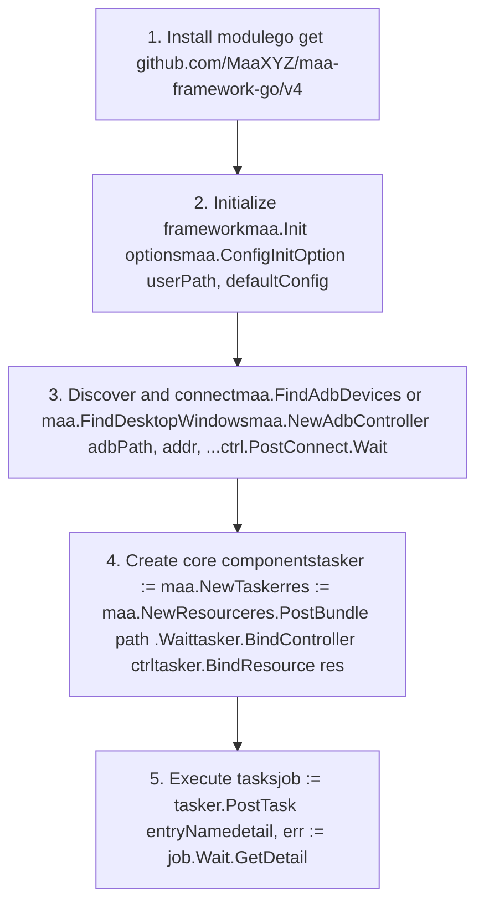
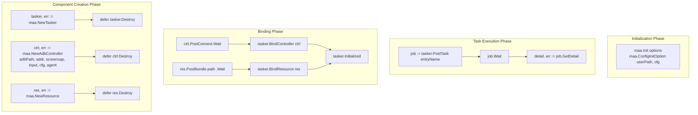

# Getting Started

Relevant source files

* [README.md](https://github.com/MaaXYZ/maa-framework-go/blob/5f9c965c/README.md?plain=1)
* [README\_zh.md](https://github.com/MaaXYZ/maa-framework-go/blob/5f9c965c/README_zh.md?plain=1)
* [examples/custom-action/main.go](https://github.com/MaaXYZ/maa-framework-go/blob/5f9c965c/examples/custom-action/main.go)
* [examples/quick-start/main.go](https://github.com/MaaXYZ/maa-framework-go/blob/5f9c965c/examples/quick-start/main.go)

This section covers everything a new user needs to get `maa-framework-go` running: installing the Go module and native libraries, initializing the framework, connecting a controller to a device, loading resources, and executing tasks. Each subsection drills into one phase of this sequence.

For architectural background on the components referenced here (Tasker, Controller, Resource, Context), see [Overview](/MaaXYZ/maa-framework-go/1-overview). For detailed API reference on each component, see [Core Components](/MaaXYZ/maa-framework-go/3-core-components).

---

## What You Need

`maa-framework-go` is a pure-Go binding for the MaaFramework native automation library. It uses [`purego`](https://github.com/MaaXYZ/maa-framework-go/blob/5f9c965c/`purego`) to load the shared library at runtime — no CGO is required. This means your program has two distinct runtime dependencies:

| Dependency | What it provides | How you get it |
| --- | --- | --- |
| Go module `github.com/MaaXYZ/maa-framework-go/v4` | Go API layer (Tasker, Controller, Resource, etc.) | `go get github.com/MaaXYZ/maa-framework-go/v4` |
| MaaFramework native shared libraries | Image recognition, OCR, device control backends | Download platform-specific archive from [MaaFramework releases](https://github.com/MaaXYZ/maa-framework-go/blob/5f9c965c/MaaFramework releases) |

The native libraries must be available at runtime via one of four methods: `maa.Init(maa.WithLibDir(...))`, working directory, environment variables (`PATH`/`LD_LIBRARY_PATH`), or system library paths.

Sources: [README.md36-88](https://github.com/MaaXYZ/maa-framework-go/blob/5f9c965c/README.md?plain=1#L36-L88)

---

## Platform and Library Downloads

Download the MaaFramework release archive for your platform from [MaaFramework releases](https://github.com/MaaXYZ/maa-framework-go/blob/5f9c965c/MaaFramework releases) The archive contains the native shared libraries (`.dll` on Windows, `.so` on Linux, `.dylib` on macOS) that must be present at runtime.

| Platform | Architecture | Archive name | Library files |
| --- | --- | --- | --- |
| Windows | amd64 | `MAA-win-x86_64-*.zip` | `MaaFramework.dll`, `MaaToolkit.dll` |
| Windows | arm64 | `MAA-win-aarch64-*.zip` | `MaaFramework.dll`, `MaaToolkit.dll` |
| Linux | amd64 | `MAA-linux-x86_64-*.zip` | `libMaaFramework.so`, `libMaaToolkit.so` |
| Linux | arm64 | `MAA-linux-aarch64-*.zip` | `libMaaFramework.so`, `libMaaToolkit.so` |
| macOS | amd64 | `MAA-macos-x86_64-*.zip` | `libMaaFramework.dylib`, `libMaaToolkit.dylib` |
| macOS | arm64 | `MAA-macos-aarch64-*.zip` | `libMaaFramework.dylib`, `libMaaToolkit.dylib` |

Extract the archive and note the `bin` directory path — you will pass it to `maa.Init(maa.WithLibDir("path/to/bin"))`.

Sources: [README.md60-88](https://github.com/MaaXYZ/maa-framework-go/blob/5f9c965c/README.md?plain=1#L60-L88)

---

## Onboarding Sequence

Every integration follows the same five-step sequence. The diagram below maps each step to the primary Go construct involved.

**Diagram: Onboarding sequence mapped to API calls**



This sequence appears in every example. Each step returns `(T, error)` or a `Job` handle. The `defer component.Destroy()` pattern is used to ensure cleanup.

Sources: [examples/quick-start/main.go10-64](https://github.com/MaaXYZ/maa-framework-go/blob/5f9c965c/examples/quick-start/main.go#L10-L64) [examples/custom-action/main.go10-69](https://github.com/MaaXYZ/maa-framework-go/blob/5f9c965c/examples/custom-action/main.go#L10-L69) [README.md89-156](https://github.com/MaaXYZ/maa-framework-go/blob/5f9c965c/README.md?plain=1#L89-L156)

---

## Step 1 — Install the Go Module

```
go get github.com/MaaXYZ/maa-framework-go/v4
```

Sources: [README.md54-58](https://github.com/MaaXYZ/maa-framework-go/blob/5f9c965c/README.md?plain=1#L54-L58)

---

## Step 2 — Initialize the Framework

`maa.Init()` loads the MaaFramework shared libraries using `purego` and registers all native function symbols. It must be the first MAA call your program makes. Calling any other MAA function before `maa.Init()` causes a panic.

### Basic Initialization Pattern

```
```
maa.Init()


if err := maa.ConfigInitOption("./", "{}"); err != nil {


fmt.Println("Failed to init config:", err)


os.Exit(1)


}
```
```

`maa.Init()` accepts functional options of type `InitOption`:

| Option constructor | Effect | Default |
| --- | --- | --- |
| `WithLibDir(path string)` | Directory containing `MaaFramework.dll`/`.so`/`.dylib` | System search paths |
| `WithLogDir(path string)` | Directory for `MaaFramework.log` output | Current directory |
| `WithStdoutLevel(level LoggingLevel)` | Console log verbosity (`LoggingLevelOff`, `LoggingLevelError`, `LoggingLevelWarn`, `LoggingLevelInfo`, `LoggingLevelDebug`, `LoggingLevelTrace`, `LoggingLevelAll`) | `LoggingLevelInfo` |
| `WithSaveDraw(enabled bool)` | Save recognition visualization images to `{LogDir}/vision/` | `false` |
| `WithDebugMode(enabled bool)` | Enable comprehensive debug logging | `false` |

`maa.Init()` can only be called once per process (guarded by package-level `inited` flag). Calling it again returns `ErrAlreadyInitialized`. Call `maa.Release()` when shutting down to unload the native library.

`maa.ConfigInitOption(userPath, defaultConfig)` must be called after `maa.Init()` and before creating any components. It configures per-user settings.

For detailed installation and initialization documentation, see [Installation and Initialization](/MaaXYZ/maa-framework-go/2.1-installation-and-initialization).

Sources: [examples/quick-start/main.go11-15](https://github.com/MaaXYZ/maa-framework-go/blob/5f9c965c/examples/quick-start/main.go#L11-L15) [examples/custom-action/main.go11-15](https://github.com/MaaXYZ/maa-framework-go/blob/5f9c965c/examples/custom-action/main.go#L11-L15) [README.md77-81](https://github.com/MaaXYZ/maa-framework-go/blob/5f9c965c/README.md?plain=1#L77-L81)

---

## Step 3 — Connect a Controller

A `Controller` wraps a device or window connection. Create the appropriate controller type for your target, then call `PostConnect().Wait()` to establish the connection before binding to the `Tasker`.

### Controller Lifecycle Pattern

```
```
// 1. Discover devices


devices, err := maa.FindAdbDevices()


if err != nil {


// handle error


}


device := devices[0]


// 2. Create controller


ctrl, err := maa.NewAdbController(


device.AdbPath,


device.Address,


device.ScreencapMethod,


device.InputMethod,


device.Config,


"path/to/MaaAgentBinary",


)


if err != nil {


// handle error


}


defer ctrl.Destroy()


// 3. Connect


ctrl.PostConnect().Wait()
```
```

### Controller Types

| Constructor | Target platform | Discovery function |
| --- | --- | --- |
| `maa.NewAdbController(adbPath, address, screencapMethod, inputMethod, config, agentPath)` | Android devices via ADB | `maa.FindAdbDevices()` returns `[]AdbDevice` |
| `maa.NewWin32Controller(hWnd, screencapMethod, inputMethod)` | Windows desktop windows | `maa.FindDesktopWindows()` returns `[]Win32Window` |
| `maa.NewPlayCoverController(path)` | iOS apps via PlayCover on macOS | Manual path to `.app` bundle |
| `maa.NewWlRootsController(path)` | Wayland compositors | Manual path to compositor |
| `maa.NewGamepadController(gamepadType)` | Virtual gamepad via ViGEm (Windows) | No discovery needed |

All controllers expose the same interface: `PostConnect()`, `PostClick(x, y)`, `PostSwipe(x1, y1, x2, y2, duration)`, `PostScreencap()`, etc. Each `Post*` method returns a `Job` handle.

For detailed device discovery and controller construction, see [Device Discovery and Connection](/MaaXYZ/maa-framework-go/2.3-device-discovery-and-connection). For controller API reference, see [Controller](/MaaXYZ/maa-framework-go/3.2-controller).

Sources: [examples/quick-start/main.go23-43](https://github.com/MaaXYZ/maa-framework-go/blob/5f9c965c/examples/quick-start/main.go#L23-L43) [README.md42-46](https://github.com/MaaXYZ/maa-framework-go/blob/5f9c965c/README.md?plain=1#L42-L46)

---

## Step 4 — Load a Resource

A `Resource` holds pipeline definitions (JSON/JSONC files), image assets, and neural network models (OCR, classifier). Create one with `maa.NewResource()`, load a bundle directory with `PostBundle(path).Wait()`, then bind it to the `Tasker`.

### Resource Lifecycle Pattern

```
```
res, err := maa.NewResource()


if err != nil {


// handle error


}


defer res.Destroy()


// Load pipeline bundle (contains pipeline.json and assets)


res.PostBundle("./resource").Wait()


// Bind to tasker


tasker.BindResource(res)
```
```

The `PostBundle(path)` method asynchronously loads all resources in the directory. The returned `Job` can be waited on to ensure loading completes before task execution. A resource bundle typically contains:

* `pipeline.json` or `pipeline.jsonc` — task node definitions
* `image/` directory — template images for recognition
* `model/` directory — neural network models (optional)

For detailed resource management, see [Resource](/MaaXYZ/maa-framework-go/3.3-resource). For pipeline structure, see [Pipeline and Nodes](/MaaXYZ/maa-framework-go/3.5-pipeline-and-nodes).

Sources: [examples/quick-start/main.go45-52](https://github.com/MaaXYZ/maa-framework-go/blob/5f9c965c/examples/quick-start/main.go#L45-L52) [examples/custom-action/main.go45-56](https://github.com/MaaXYZ/maa-framework-go/blob/5f9c965c/examples/custom-action/main.go#L45-L56) [README.md136-143](https://github.com/MaaXYZ/maa-framework-go/blob/5f9c965c/README.md?plain=1#L136-L143)

---

## Step 5 — Run Tasks

With both controller and resource bound, verify `tasker.Initialized()` returns `true`, then dispatch tasks. Each task execution follows this pattern:

```
```
if !tasker.Initialized() {


fmt.Println("Failed to init MAA.")


os.Exit(1)


}


// PostTask returns TaskJob immediately (non-blocking)


job := tasker.PostTask("Startup")


// Wait blocks until task completes


job.Wait()


// GetDetail retrieves execution results


detail, err := job.GetDetail()


if err != nil {


// handle error


}


fmt.Println(detail)
```
```

### Task Execution API

| Method | Returns | Behavior |
| --- | --- | --- |
| `tasker.PostTask(entryName string)` | `TaskJob` | Dispatches task asynchronously, returns immediately |
| `job.Wait()` | `TaskJob` | Blocks until task completes, returns self for chaining |
| `job.Status()` | `TaskStatus` | Non-blocking status query (`TaskStatusPending`, `TaskStatusRunning`, `TaskStatusSuccess`, `TaskStatusFailure`) |
| `job.GetDetail()` | `(TaskDetail, error)` | Retrieves execution results (recognized nodes, actions performed) |

The entry name (`"Startup"` in the example) must match a node name in the loaded pipeline. The pipeline interpreter starts at this entry node and follows `Next` chains. For pipeline structure, see [Pipeline and Nodes](/MaaXYZ/maa-framework-go/3.5-pipeline-and-nodes). For task execution details, see [Task Definition and Execution](/MaaXYZ/maa-framework-go/4-task-definition-and-execution).

Sources: [examples/quick-start/main.go53-63](https://github.com/MaaXYZ/maa-framework-go/blob/5f9c965c/examples/quick-start/main.go#L53-L63) [examples/custom-action/main.go63-68](https://github.com/MaaXYZ/maa-framework-go/blob/5f9c965c/examples/custom-action/main.go#L63-L68) [README.md149-155](https://github.com/MaaXYZ/maa-framework-go/blob/5f9c965c/README.md?plain=1#L149-L155)

---

## Component Relationships and Lifecycle

**Diagram: Component creation, binding, and task execution flow**



### Ownership and Cleanup

All components (`Tasker`, `Controller`, `Resource`) are heap-allocated native objects referenced by `uintptr` handles. Each has a `Destroy()` method that must be called to prevent memory leaks. The `defer` pattern ensures cleanup:

```
```
tasker, err := maa.NewTasker()


if err != nil {


return err


}


defer tasker.Destroy()  // Guaranteed cleanup on function exit
```
```

The binding methods (`BindController`, `BindResource`) do not transfer ownership — both the `Tasker` and the bound component must be explicitly destroyed.

Sources: [examples/quick-start/main.go10-64](https://github.com/MaaXYZ/maa-framework-go/blob/5f9c965c/examples/quick-start/main.go#L10-L64) [examples/custom-action/main.go10-69](https://github.com/MaaXYZ/maa-framework-go/blob/5f9c965c/examples/custom-action/main.go#L10-L69)

---

## Subsection Guide

| Subsection | What it covers |
| --- | --- |
| [Installation and Initialization](/MaaXYZ/maa-framework-go/2.1-installation-and-initialization) | `go get`, library download, `maa.Init` options, `maa.Release` |
| [Quick Start Guide](/MaaXYZ/maa-framework-go/2.2-quick-start-guide) | Full end-to-end walkthrough with all constructor calls |
| [Device Discovery and Connection](/MaaXYZ/maa-framework-go/2.3-device-discovery-and-connection) | `FindAdbDevices`, `FindDesktopWindows`, controller construction |
| [Your First Custom Action](/MaaXYZ/maa-framework-go/2.4-your-first-custom-action) | Implementing `CustomActionRunner`, registering with `Resource.RegisterCustomAction` |
| [Your First Custom Recognition](/MaaXYZ/maa-framework-go/2.5-your-first-custom-recognition) | Implementing `CustomRecognitionRunner`, returning `CustomRecognitionResult` |