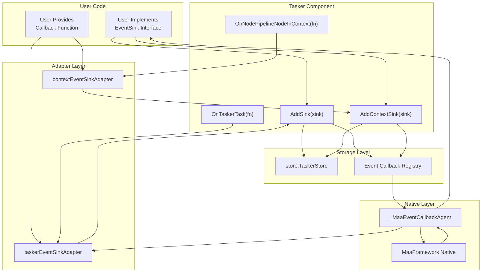
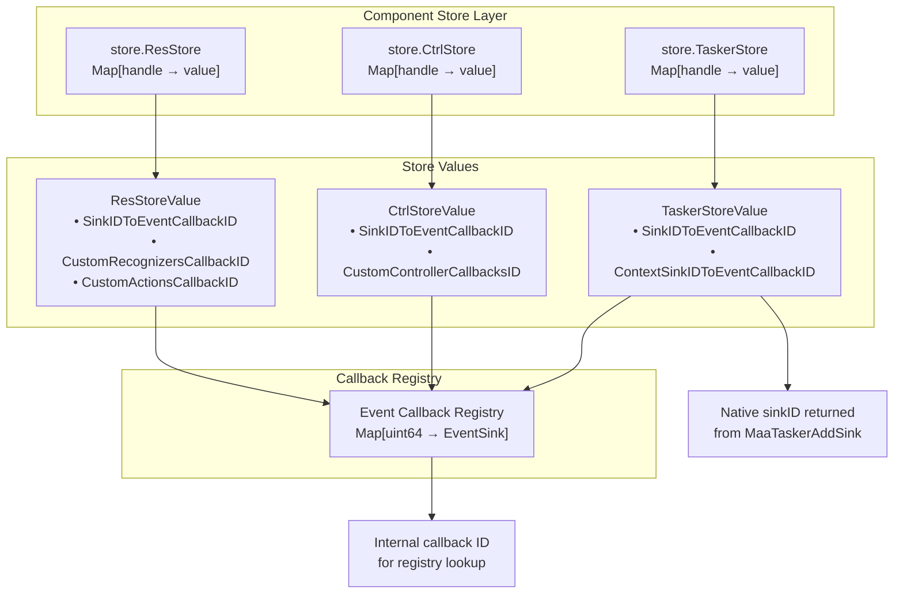
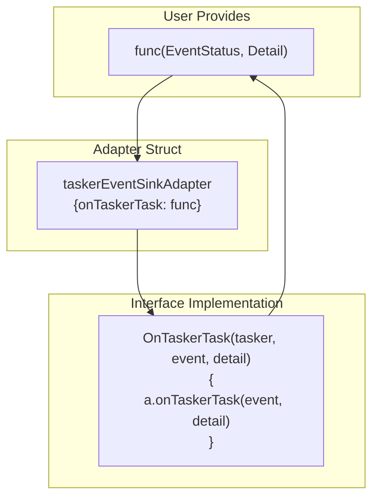

# Implementing Event Sinks

Relevant source files

* [context.go](https://github.com/MaaXYZ/maa-framework-go/blob/5f9c965c/context.go)
* [controller.go](https://github.com/MaaXYZ/maa-framework-go/blob/5f9c965c/controller.go)
* [event.go](https://github.com/MaaXYZ/maa-framework-go/blob/5f9c965c/event.go)
* [internal/native/framework.go](https://github.com/MaaXYZ/maa-framework-go/blob/5f9c965c/internal/native/framework.go)
* [recognition\_result.go](https://github.com/MaaXYZ/maa-framework-go/blob/5f9c965c/recognition_result.go)
* [resource.go](https://github.com/MaaXYZ/maa-framework-go/blob/5f9c965c/resource.go)
* [tasker.go](https://github.com/MaaXYZ/maa-framework-go/blob/5f9c965c/tasker.go)

This page provides a practical guide to implementing event sinks for monitoring component lifecycle and task execution. Event sinks allow user code to receive notifications about asynchronous operations, pipeline execution, and component state changes.

For architectural overview and event types, see [Event Architecture](/MaaXYZ/maa-framework-go/6.1-event-architecture). For managing asynchronous operations, see [Async Operations and Job Management](/MaaXYZ/maa-framework-go/6.3-async-operations-and-job-management).

## Event Sink Interfaces

The framework provides three event sink interfaces corresponding to the core components:

| Interface | Component | Primary Event | Purpose |
| --- | --- | --- | --- |
| `TaskerEventSink` | `Tasker` | `OnTaskerTask` | Monitor task-level execution (start, completion, failure) |
| `ContextEventSink` | `Tasker` (Context) | Multiple node events | Monitor detailed pipeline node execution |
| `ControllerEventSink` | `Controller` | `OnControllerAction` | Monitor device control operations |
| `ResourceEventSink` | `Resource` | `OnResourceLoading` | Monitor resource loading progress |

**Sources:** [tasker.go557-588](https://github.com/MaaXYZ/maa-framework-go/blob/5f9c965c/tasker.go#L557-L588) [controller.go483-485](https://github.com/MaaXYZ/maa-framework-go/blob/5f9c965c/controller.go#L483-L485) [resource.go642-644](https://github.com/MaaXYZ/maa-framework-go/blob/5f9c965c/resource.go#L642-L644)

## Sink Implementation Architecture



**Sources:** [tasker.go481-494](https://github.com/MaaXYZ/maa-framework-go/blob/5f9c965c/tasker.go#L481-L494) [tasker.go519-532](https://github.com/MaaXYZ/maa-framework-go/blob/5f9c965c/tasker.go#L519-L532) [tasker.go574-578](https://github.com/MaaXYZ/maa-framework-go/blob/5f9c965c/tasker.go#L574-L578) [tasker.go643-647](https://github.com/MaaXYZ/maa-framework-go/blob/5f9c965c/tasker.go#L643-L647)

## TaskerEventSink Interface

### Interface Definition

The `TaskerEventSink` interface monitors task-level execution events:

```
```
type TaskerEventSink interface {


OnTaskerTask(tasker *Tasker, event EventStatus, detail TaskerTaskDetail)


}
```
```

**Parameters:**

* `tasker *Tasker` - The tasker instance that generated the event
* `event EventStatus` - Event status (Running, Completed, Failed, etc.)
* `detail TaskerTaskDetail` - Event-specific detail containing task information

**Sources:** [tasker.go557-559](https://github.com/MaaXYZ/maa-framework-go/blob/5f9c965c/tasker.go#L557-L559)

### Implementation Example

```
```
type MyTaskerSink struct {


// Custom fields for state tracking


}


func (s *MyTaskerSink) OnTaskerTask(tasker *Tasker, event EventStatus, detail TaskerTaskDetail) {


switch event {


case EventStatusStarted:


fmt.Printf("Task started: ID=%d, Entry=%s\n", detail.ID, detail.Entry)


case EventStatusCompleted:


fmt.Printf("Task completed: ID=%d\n", detail.ID)


case EventStatusFailed:


fmt.Printf("Task failed: ID=%d\n", detail.ID)


}


}


// Register the sink


sink := &MyTaskerSink{}


sinkID := tasker.AddSink(sink)


defer tasker.RemoveSink(sinkID)
```
```

### Convenience Method

For single-callback scenarios, use `OnTaskerTask`:

```
```
sinkID := tasker.OnTaskerTask(func(event EventStatus, detail TaskerTaskDetail) {


fmt.Printf("Task event: %v, ID=%d\n", event, detail.ID)


})


defer tasker.RemoveSink(sinkID)
```
```

The convenience method creates a `taskerEventSinkAdapter` internally that wraps the function callback.

**Sources:** [tasker.go574-578](https://github.com/MaaXYZ/maa-framework-go/blob/5f9c965c/tasker.go#L574-L578) [tasker.go563-572](https://github.com/MaaXYZ/maa-framework-go/blob/5f9c965c/tasker.go#L563-L572)

## ContextEventSink Interface

### Interface Definition

The `ContextEventSink` interface provides fine-grained monitoring of pipeline execution:

```
```
type ContextEventSink interface {


OnNodePipelineNode(ctx *Context, event EventStatus, detail NodePipelineNodeDetail)


OnNodeRecognitionNode(ctx *Context, event EventStatus, detail NodeRecognitionNodeDetail)


OnNodeActionNode(ctx *Context, event EventStatus, detail NodeActionNodeDetail)


OnNodeNextList(ctx *Context, event EventStatus, detail NodeNextListDetail)


OnNodeRecognition(ctx *Context, event EventStatus, detail NodeRecognitionDetail)


OnNodeAction(ctx *Context, event EventStatus, detail NodeActionDetail)


}
```
```

All methods receive:

* `ctx *Context` - The execution context
* `event EventStatus` - Event status
* `detail` - Type-specific detail structure

**Sources:** [tasker.go581-588](https://github.com/MaaXYZ/maa-framework-go/blob/5f9c965c/tasker.go#L581-L588)

### Implementation Example

```
```
type MyContextSink struct{}


func (s *MyContextSink) OnNodePipelineNode(ctx *Context, event EventStatus, detail NodePipelineNodeDetail) {


fmt.Printf("Pipeline node: %s, event=%v\n", detail.Name, event)


}


func (s *MyContextSink) OnNodeRecognitionNode(ctx *Context, event EventStatus, detail NodeRecognitionNodeDetail) {


fmt.Printf("Recognition node: %s\n", detail.Name)


}


func (s *MyContextSink) OnNodeActionNode(ctx *Context, event EventStatus, detail NodeActionNodeDetail) {


fmt.Printf("Action node: %s\n", detail.Name)


}


func (s *MyContextSink) OnNodeNextList(ctx *Context, event EventStatus, detail NodeNextListDetail) {


fmt.Printf("Next list: current=%s, next=%v\n", detail.Name, detail.Next)


}


func (s *MyContextSink) OnNodeRecognition(ctx *Context, event EventStatus, detail NodeRecognitionDetail) {


if event == EventStatusCompleted {


fmt.Printf("Recognition: %s, hit=%v\n", detail.Name, detail.Hit)


}


}


func (s *MyContextSink) OnNodeAction(ctx *Context, event EventStatus, detail NodeActionDetail) {


if event == EventStatusCompleted {


fmt.Printf("Action: %s, success=%v\n", detail.Name, detail.Success)


}


}


// Register the context sink


sink := &MyContextSink{}


sinkID := tasker.AddContextSink(sink)


defer tasker.RemoveContextSink(sinkID)
```
```

### Convenience Methods

Each event type has a corresponding convenience method:

| Method | Event Type | Adapter Field |
| --- | --- | --- |
| `OnNodePipelineNodeInContext` | Pipeline node execution | `onNodePipelineNode` |
| `OnNodeRecognitionNodeInContext` | Recognition node execution | `onNodeRecognitionNode` |
| `OnNodeActionNodeInContext` | Action node execution | `onNodeActionNode` |
| `OnNodeNextListInContext` | Next list evaluation | `onNodeNextList` |
| `OnNodeRecognitionInContext` | Recognition phase | `onNodeRecognition` |
| `OnNodeActionInContext` | Action phase | `onNodeAction` |

Example usage:

```
```
// Monitor only recognition results


sinkID := tasker.OnNodeRecognitionInContext(func(ctx *Context, event EventStatus, detail NodeRecognitionDetail) {


if event == EventStatusCompleted && detail.Hit {


fmt.Printf("Recognition hit: %s at %v\n", detail.Name, detail.Box)


}


})


defer tasker.RemoveContextSink(sinkID)
```
```

**Sources:** [tasker.go643-677](https://github.com/MaaXYZ/maa-framework-go/blob/5f9c965c/tasker.go#L643-L677) [tasker.go592-641](https://github.com/MaaXYZ/maa-framework-go/blob/5f9c965c/tasker.go#L592-L641)

## ControllerEventSink Interface

### Interface Definition

The `ControllerEventSink` interface monitors device control operations:

```
```
type ControllerEventSink interface {


OnControllerAction(ctrl *Controller, event EventStatus, detail ControllerActionDetail)


}
```
```

**Sources:** [controller.go483-485](https://github.com/MaaXYZ/maa-framework-go/blob/5f9c965c/controller.go#L483-L485)

### Implementation Example

```
```
type MyControllerSink struct{}


func (s *MyControllerSink) OnControllerAction(ctrl *Controller, event EventStatus, detail ControllerActionDetail) {


switch event {


case EventStatusStarted:


fmt.Printf("Action started: %s\n", detail.Action)


case EventStatusCompleted:


fmt.Printf("Action completed: %s (uuid=%s)\n", detail.Action, detail.UUID)


case EventStatusFailed:


fmt.Printf("Action failed: %s\n", detail.Action)


}


}


// Register the sink


sink := &MyControllerSink{}


sinkID := controller.AddSink(sink)


defer controller.RemoveSink(sinkID)
```
```

### Convenience Method

```
```
sinkID := controller.OnControllerAction(func(event EventStatus, detail ControllerActionDetail) {


fmt.Printf("Controller action: %s, status=%v\n", detail.Action, event)


})


defer controller.RemoveSink(sinkID)
```
```

**Sources:** [controller.go504-511](https://github.com/MaaXYZ/maa-framework-go/blob/5f9c965c/controller.go#L504-L511) [controller.go489-502](https://github.com/MaaXYZ/maa-framework-go/blob/5f9c965c/controller.go#L489-L502)

## ResourceEventSink Interface

### Interface Definition

The `ResourceEventSink` interface monitors resource loading operations:

```
```
type ResourceEventSink interface {


OnResourceLoading(res *Resource, event EventStatus, detail ResourceLoadingDetail)


}
```
```

**Sources:** [resource.go642-644](https://github.com/MaaXYZ/maa-framework-go/blob/5f9c965c/resource.go#L642-L644)

### Implementation Example

```
```
type MyResourceSink struct{}


func (s *MyResourceSink) OnResourceLoading(res *Resource, event EventStatus, detail ResourceLoadingDetail) {


switch event {


case EventStatusStarted:


fmt.Printf("Loading started: %s\n", detail.Path)


case EventStatusCompleted:


fmt.Printf("Loading completed: %s (hash=%s)\n", detail.Path, detail.Hash)


case EventStatusFailed:


fmt.Printf("Loading failed: %s\n", detail.Path)


}


}


// Register the sink


sink := &MyResourceSink{}


sinkID := resource.AddSink(sink)


defer resource.RemoveSink(sinkID)
```
```

### Convenience Method

```
```
sinkID := resource.OnResourceLoading(func(event EventStatus, detail ResourceLoadingDetail) {


if event == EventStatusCompleted {


fmt.Printf("Loaded: %s\n", detail.Path)


}


})


defer resource.RemoveSink(sinkID)
```
```

**Sources:** [resource.go659-664](https://github.com/MaaXYZ/maa-framework-go/blob/5f9c965c/resource.go#L659-L664) [resource.go648-657](https://github.com/MaaXYZ/maa-framework-go/blob/5f9c965c/resource.go#L648-L657)

## Sink Lifecycle Management

```
#mermaid-27f11r6olqg{font-family:ui-sans-serif,-apple-system,system-ui,Segoe UI,Helvetica;font-size:16px;fill:#333;}@keyframes edge-animation-frame{from{stroke-dashoffset:0;}}@keyframes dash{to{stroke-dashoffset:0;}}#mermaid-27f11r6olqg .edge-animation-slow{stroke-dasharray:9,5!important;stroke-dashoffset:900;animation:dash 50s linear infinite;stroke-linecap:round;}#mermaid-27f11r6olqg .edge-animation-fast{stroke-dasharray:9,5!important;stroke-dashoffset:900;animation:dash 20s linear infinite;stroke-linecap:round;}#mermaid-27f11r6olqg .error-icon{fill:#dddddd;}#mermaid-27f11r6olqg .error-text{fill:#222222;stroke:#222222;}#mermaid-27f11r6olqg .edge-thickness-normal{stroke-width:1px;}#mermaid-27f11r6olqg .edge-thickness-thick{stroke-width:3.5px;}#mermaid-27f11r6olqg .edge-pattern-solid{stroke-dasharray:0;}#mermaid-27f11r6olqg .edge-thickness-invisible{stroke-width:0;fill:none;}#mermaid-27f11r6olqg .edge-pattern-dashed{stroke-dasharray:3;}#mermaid-27f11r6olqg .edge-pattern-dotted{stroke-dasharray:2;}#mermaid-27f11r6olqg .marker{fill:#999;stroke:#999;}#mermaid-27f11r6olqg .marker.cross{stroke:#999;}#mermaid-27f11r6olqg svg{font-family:ui-sans-serif,-apple-system,system-ui,Segoe UI,Helvetica;font-size:16px;}#mermaid-27f11r6olqg p{margin:0;}#mermaid-27f11r6olqg defs #statediagram-barbEnd{fill:#999;stroke:#999;}#mermaid-27f11r6olqg g.stateGroup text{fill:#dddddd;stroke:none;font-size:10px;}#mermaid-27f11r6olqg g.stateGroup text{fill:#333;stroke:none;font-size:10px;}#mermaid-27f11r6olqg g.stateGroup .state-title{font-weight:bolder;fill:#333;}#mermaid-27f11r6olqg g.stateGroup rect{fill:#ffffff;stroke:#dddddd;}#mermaid-27f11r6olqg g.stateGroup line{stroke:#999;stroke-width:1;}#mermaid-27f11r6olqg .transition{stroke:#999;stroke-width:1;fill:none;}#mermaid-27f11r6olqg .stateGroup .composit{fill:#f4f4f4;border-bottom:1px;}#mermaid-27f11r6olqg .stateGroup .alt-composit{fill:#e0e0e0;border-bottom:1px;}#mermaid-27f11r6olqg .state-note{stroke:#e6d280;fill:#fff5ad;}#mermaid-27f11r6olqg .state-note text{fill:#333;stroke:none;font-size:10px;}#mermaid-27f11r6olqg .stateLabel .box{stroke:none;stroke-width:0;fill:#ffffff;opacity:0.5;}#mermaid-27f11r6olqg .edgeLabel .label rect{fill:#ffffff;opacity:0.5;}#mermaid-27f11r6olqg .edgeLabel{background-color:#ffffff;text-align:center;}#mermaid-27f11r6olqg .edgeLabel p{background-color:#ffffff;}#mermaid-27f11r6olqg .edgeLabel rect{opacity:0.5;background-color:#ffffff;fill:#ffffff;}#mermaid-27f11r6olqg .edgeLabel .label text{fill:#333;}#mermaid-27f11r6olqg .label div .edgeLabel{color:#333;}#mermaid-27f11r6olqg .stateLabel text{fill:#333;font-size:10px;font-weight:bold;}#mermaid-27f11r6olqg .node circle.state-start{fill:#999;stroke:#999;}#mermaid-27f11r6olqg .node .fork-join{fill:#999;stroke:#999;}#mermaid-27f11r6olqg .node circle.state-end{fill:#dddddd;stroke:#f4f4f4;stroke-width:1.5;}#mermaid-27f11r6olqg .end-state-inner{fill:#f4f4f4;stroke-width:1.5;}#mermaid-27f11r6olqg .node rect{fill:#ffffff;stroke:#dddddd;stroke-width:1px;}#mermaid-27f11r6olqg .node polygon{fill:#ffffff;stroke:#dddddd;stroke-width:1px;}#mermaid-27f11r6olqg #statediagram-barbEnd{fill:#999;}#mermaid-27f11r6olqg .statediagram-cluster rect{fill:#ffffff;stroke:#dddddd;stroke-width:1px;}#mermaid-27f11r6olqg .cluster-label,#mermaid-27f11r6olqg .nodeLabel{color:#333;}#mermaid-27f11r6olqg .statediagram-cluster rect.outer{rx:5px;ry:5px;}#mermaid-27f11r6olqg .statediagram-state .divider{stroke:#dddddd;}#mermaid-27f11r6olqg .statediagram-state .title-state{rx:5px;ry:5px;}#mermaid-27f11r6olqg .statediagram-cluster.statediagram-cluster .inner{fill:#f4f4f4;}#mermaid-27f11r6olqg .statediagram-cluster.statediagram-cluster-alt .inner{fill:#f8f8f8;}#mermaid-27f11r6olqg .statediagram-cluster .inner{rx:0;ry:0;}#mermaid-27f11r6olqg .statediagram-state rect.basic{rx:5px;ry:5px;}#mermaid-27f11r6olqg .statediagram-state rect.divider{stroke-dasharray:10,10;fill:#f8f8f8;}#mermaid-27f11r6olqg .note-edge{stroke-dasharray:5;}#mermaid-27f11r6olqg .statediagram-note rect{fill:#fff5ad;stroke:#e6d280;stroke-width:1px;rx:0;ry:0;}#mermaid-27f11r6olqg .statediagram-note rect{fill:#fff5ad;stroke:#e6d280;stroke-width:1px;rx:0;ry:0;}#mermaid-27f11r6olqg .statediagram-note text{fill:#333;}#mermaid-27f11r6olqg .statediagram-note .nodeLabel{color:#333;}#mermaid-27f11r6olqg .statediagram .edgeLabel{color:red;}#mermaid-27f11r6olqg #dependencyStart,#mermaid-27f11r6olqg #dependencyEnd{fill:#999;stroke:#999;stroke-width:1;}#mermaid-27f11r6olqg .statediagramTitleText{text-anchor:middle;font-size:18px;fill:#333;}#mermaid-27f11r6olqg :root{--mermaid-font-family:"trebuchet ms",verdana,arial,sans-serif;}

AddSink(sink)  
returns sinkID


Native callback  
invocation starts


Events dispatched  
to sink methods


RemoveSink(sinkID)


ClearSinks()


Component.Destroy()


Unregistered


Registered


Active


SinkID stored in:  
- TaskerStore.SinkIDToEventCallbackID  
- CtrlStore.SinkIDToEventCallbackID  
- ResStore.SinkIDToEventCallbackID


Callbacks invoked via:  
- _MaaEventCallbackAgent  
- Event callback registry
```

**Sources:** [tasker.go481-516](https://github.com/MaaXYZ/maa-framework-go/blob/5f9c965c/tasker.go#L481-L516) [controller.go444-481](https://github.com/MaaXYZ/maa-framework-go/blob/5f9c965c/controller.go#L444-L481) [resource.go603-640](https://github.com/MaaXYZ/maa-framework-go/blob/5f9c965c/resource.go#L603-L640)

### Adding Sinks

Each component provides `AddSink` and component-specific sink addition methods:

| Component | Method | Sink Type | Returns |
| --- | --- | --- | --- |
| `Tasker` | `AddSink(sink)` | `TaskerEventSink` | `int64` sink ID |
| `Tasker` | `AddContextSink(sink)` | `ContextEventSink` | `int64` sink ID |
| `Controller` | `AddSink(sink)` | `ControllerEventSink` | `int64` sink ID |
| `Resource` | `AddSink(sink)` | `ResourceEventSink` | `int64` sink ID |

The returned sink ID is used for later removal.

**Implementation details:**

1. Registers callback with native framework via `registerEventCallback`
2. Stores mapping from sink ID to callback ID in component store
3. Native framework invokes `_MaaEventCallbackAgent` when events occur
4. Agent dispatches to registered sink methods

**Sources:** [tasker.go481-494](https://github.com/MaaXYZ/maa-framework-go/blob/5f9c965c/tasker.go#L481-L494) [tasker.go519-532](https://github.com/MaaXYZ/maa-framework-go/blob/5f9c965c/tasker.go#L519-L532) [controller.go444-459](https://github.com/MaaXYZ/maa-framework-go/blob/5f9c965c/controller.go#L444-L459) [resource.go603-618](https://github.com/MaaXYZ/maa-framework-go/blob/5f9c965c/resource.go#L603-L618)

### Removing Sinks

Sinks can be removed individually or all at once:

```
```
// Individual removal


sinkID := tasker.AddSink(sink)


tasker.RemoveSink(sinkID)


// Remove all sinks


tasker.ClearSinks()
```
```

**Removal process:**

1. Looks up callback ID from sink ID in component store
2. Unregisters callback via `unregisterEventCallback`
3. Removes mapping from component store
4. Calls native framework to remove sink

**Sources:** [tasker.go496-516](https://github.com/MaaXYZ/maa-framework-go/blob/5f9c965c/tasker.go#L496-L516) [controller.go461-481](https://github.com/MaaXYZ/maa-framework-go/blob/5f9c965c/controller.go#L461-L481) [resource.go620-640](https://github.com/MaaXYZ/maa-framework-go/blob/5f9c965c/resource.go#L620-L640)

### Automatic Cleanup on Destroy

When a component is destroyed, all registered sinks are automatically cleaned up:

```
```
tasker.Destroy()  // Automatically calls ClearSinks() and ClearContextSinks()


controller.Destroy()  // Automatically calls ClearSinks()


resource.Destroy()  // Automatically calls ClearSinks()
```
```

The cleanup process:

1. Iterates over all registered sink callback IDs
2. Unregisters each callback
3. Removes component from store
4. Destroys native component handle

**Sources:** [tasker.go42-55](https://github.com/MaaXYZ/maa-framework-go/blob/5f9c965c/tasker.go#L42-L55) [controller.go165-176](https://github.com/MaaXYZ/maa-framework-go/blob/5f9c965c/controller.go#L165-L176) [resource.go44-61](https://github.com/MaaXYZ/maa-framework-go/blob/5f9c965c/resource.go#L44-L61)

## Storage Implementation



**Sources:** [tasker.go28-33](https://github.com/MaaXYZ/maa-framework-go/blob/5f9c965c/tasker.go#L28-L33) [tasker.go489-493](https://github.com/MaaXYZ/maa-framework-go/blob/5f9c965c/tasker.go#L489-L493) [controller.go17-24](https://github.com/MaaXYZ/maa-framework-go/blob/5f9c965c/controller.go#L17-L24) [resource.go31-37](https://github.com/MaaXYZ/maa-framework-go/blob/5f9c965c/resource.go#L31-L37)

## Adapter Pattern Details

The adapter pattern allows using simple function callbacks instead of implementing full interfaces:



**Key characteristics:**

1. Adapter stores user function in a field
2. Adapter implements full sink interface
3. Interface method unwraps and calls user function
4. Nil checks prevent panics on nil functions

**Adapter implementations:**

* `taskerEventSinkAdapter` - Wraps single `onTaskerTask` function
* `contextEventSinkAdapter` - Wraps up to six node event functions
* `ctrlEventSinkAdapter` - Wraps single `onControllerAction` function
* `resourceEventSinkAdapter` - Wraps single `onResourceLoading` function

**Sources:** [tasker.go563-572](https://github.com/MaaXYZ/maa-framework-go/blob/5f9c965c/tasker.go#L563-L572) [tasker.go592-641](https://github.com/MaaXYZ/maa-framework-go/blob/5f9c965c/tasker.go#L592-L641) [controller.go489-502](https://github.com/MaaXYZ/maa-framework-go/blob/5f9c965c/controller.go#L489-L502) [resource.go648-657](https://github.com/MaaXYZ/maa-framework-go/blob/5f9c965c/resource.go#L648-L657)

## Practical Patterns

### Pattern 1: Selective Event Monitoring

Monitor only specific events using convenience methods:

```
```
// Monitor only task completion


taskSinkID := tasker.OnTaskerTask(func(event EventStatus, detail TaskerTaskDetail) {


if event == EventStatusCompleted {


fmt.Printf("Task %d completed successfully\n", detail.ID)


}


})


// Monitor only recognition hits


recSinkID := tasker.OnNodeRecognitionInContext(func(ctx *Context, event EventStatus, detail NodeRecognitionDetail) {


if event == EventStatusCompleted && detail.Hit {


fmt.Printf("Found: %s at (%d,%d)\n", detail.Name, detail.Box.X, detail.Box.Y)


}


})


defer tasker.RemoveSink(taskSinkID)


defer tasker.RemoveContextSink(recSinkID)
```
```

### Pattern 2: Stateful Event Processing

Use struct-based sinks to maintain state across events:

```
```
type PipelineMonitor struct {


nodesExecuted int


nodesFailed   int


}


func (m *PipelineMonitor) OnNodePipelineNode(ctx *Context, event EventStatus, detail NodePipelineNodeDetail) {


switch event {


case EventStatusCompleted:


m.nodesExecuted++


case EventStatusFailed:


m.nodesFailed++


}


}


func (m *PipelineMonitor) OnNodeRecognitionNode(ctx *Context, event EventStatus, detail NodeRecognitionNodeDetail) {}


func (m *PipelineMonitor) OnNodeActionNode(ctx *Context, event EventStatus, detail NodeActionNodeDetail) {}


func (m *PipelineMonitor) OnNodeNextList(ctx *Context, event EventStatus, detail NodeNextListDetail) {}


func (m *PipelineMonitor) OnNodeRecognition(ctx *Context, event EventStatus, detail NodeRecognitionDetail) {}


func (m *PipelineMonitor) OnNodeAction(ctx *Context, event EventStatus, detail NodeActionDetail) {}


monitor := &PipelineMonitor{}


sinkID := tasker.AddContextSink(monitor)


defer tasker.RemoveContextSink(sinkID)


// Access monitor state after execution


fmt.Printf("Executed: %d, Failed: %d\n", monitor.nodesExecuted, monitor.nodesFailed)
```
```

### Pattern 3: Multiple Sink Coordination

Register multiple sinks for different purposes:

```
```
// Progress logging sink


logSinkID := tasker.OnTaskerTask(func(event EventStatus, detail TaskerTaskDetail) {


log.Printf("[%v] Task %d: %s\n", event, detail.ID, detail.Entry)


})


// Metrics collection sink


metricsSinkID := tasker.OnNodeRecognitionInContext(func(ctx *Context, event EventStatus, detail NodeRecognitionDetail) {


if event == EventStatusCompleted {


metrics.RecordRecognition(detail.Name, detail.Hit)


}


})


// Error tracking sink


errorSinkID := tasker.OnNodeActionInContext(func(ctx *Context, event EventStatus, detail NodeActionDetail) {


if event == EventStatusFailed {


errors.Track(detail.Name)


}


})


defer func() {


tasker.RemoveSink(logSinkID)


tasker.RemoveContextSink(metricsSinkID)


tasker.RemoveContextSink(errorSinkID)


}()
```
```

### Pattern 4: Scoped Monitoring

Use `ClearSinks` for bulk cleanup:

```
```
func runMonitoredTask(tasker *Tasker, entry string) error {


// Register all monitoring sinks


tasker.OnTaskerTask(func(event EventStatus, detail TaskerTaskDetail) {


fmt.Printf("Task event: %v\n", event)


})


tasker.OnNodeRecognitionInContext(func(ctx *Context, event EventStatus, detail NodeRecognitionDetail) {


fmt.Printf("Recognition: %s\n", detail.Name)


})


// Ensure cleanup


defer tasker.ClearSinks()


defer tasker.ClearContextSinks()


// Run task


job := tasker.PostTask(entry)


return job.Wait().Error()


}
```
```

**Sources:** [tasker.go507-516](https://github.com/MaaXYZ/maa-framework-go/blob/5f9c965c/tasker.go#L507-L516) [tasker.go544-554](https://github.com/MaaXYZ/maa-framework-go/blob/5f9c965c/tasker.go#L544-L554)