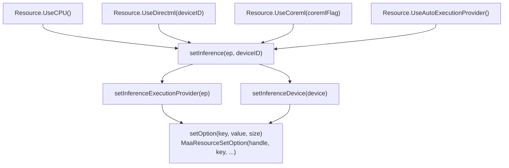
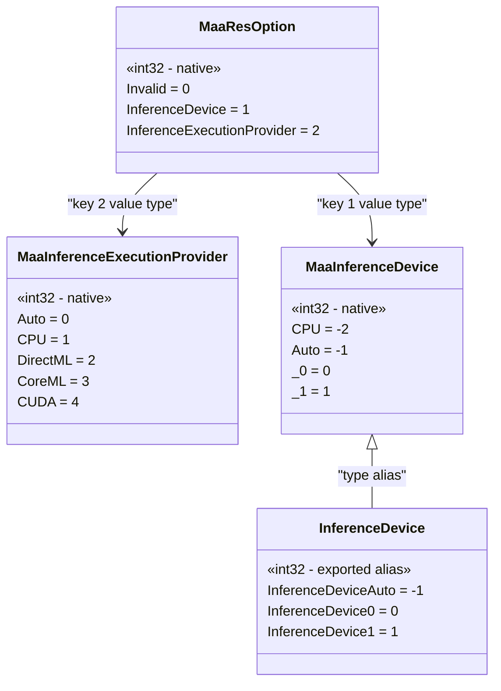

# Inference Configuration

Relevant source files

* [README.md](https://github.com/MaaXYZ/maa-framework-go/blob/5f9c965c/README.md?plain=1)
* [README\_zh.md](https://github.com/MaaXYZ/maa-framework-go/blob/5f9c965c/README_zh.md?plain=1)
* [examples/custom-action/main.go](https://github.com/MaaXYZ/maa-framework-go/blob/5f9c965c/examples/custom-action/main.go)
* [examples/quick-start/main.go](https://github.com/MaaXYZ/maa-framework-go/blob/5f9c965c/examples/quick-start/main.go)
* [resource.go](https://github.com/MaaXYZ/maa-framework-go/blob/5f9c965c/resource.go)

This page covers how to configure the ONNX inference backend on a `Resource` instance: which execution provider (CPU, DirectML, CoreML, Auto) to use and which device index or flag to pass. It describes the relevant enumeration types, exported constants, and the `Resource` methods that compose them.

For broader context on `Resource` and how it loads models and pipelines, see [3.3](/MaaXYZ/maa-framework-go/3.3-resource). For how `Resource` is created and bound to a `Tasker`, see [2.2](/MaaXYZ/maa-framework-go/2.2-quick-start-guide).

---

## Overview

MaaFramework uses ONNX Runtime internally to run neural-network models (OCR, classify, detect). The inference backend is selected per `Resource` by setting two orthogonal options:

| Option | Native constant | Controls |
| --- | --- | --- |
| Execution Provider | `MaaResOption_InferenceExecutionProvider` | Which runtime to use (CPU, DirectML, CoreML, CUDA, Auto) |
| Device | `MaaResOption_InferenceDevice` | Which hardware device/adapter index or flag to pass to that runtime |

Both options must be set **before** loading models — that is, before calling `PostOcrModel` or `PostBundle` with model files.

Sources: [internal/native/framework.go96-112](https://github.com/MaaXYZ/maa-framework-go/blob/5f9c965c/internal/native/framework.go#L96-L112) [resource.go75-105](https://github.com/MaaXYZ/maa-framework-go/blob/5f9c965c/resource.go#L75-L105)

---

## Enumerations

### `MaaInferenceExecutionProvider`

Defined in [internal/native/framework.go68-92](https://github.com/MaaXYZ/maa-framework-go/blob/5f9c965c/internal/native/framework.go#L68-L92) as `int32`.

| Go Name | Value | Description |
| --- | --- | --- |
| `MaaInferenceExecutionProvider_Auto` | `0` | Let MaaFramework select the best available provider. Setting `MaaResOption_InferenceDevice` is not recommended in this mode because you cannot know which EP will be chosen on the user's machine. |
| `MaaInferenceExecutionProvider_CPU` | `1` | Force CPU inference. `MaaResOption_InferenceDevice` has no effect. |
| `MaaInferenceExecutionProvider_DirectML` | `2` | Windows DirectML. `MaaResOption_InferenceDevice` sets the adapter ID from `EnumAdapters1`. |
| `MaaInferenceExecutionProvider_CoreML` | `3` | Apple CoreML. `MaaResOption_InferenceDevice` sets the `coreml_flag` (see the onnxruntime CoreML provider factory header — note the bundled onnxruntime version may not support all flags). |
| `MaaInferenceExecutionProvider_CUDA` | `4` | NVIDIA CUDA. `MaaResOption_InferenceDevice` sets the GPU ID. Marked TODO in source. |

Sources: [internal/native/framework.go68-92](https://github.com/MaaXYZ/maa-framework-go/blob/5f9c965c/internal/native/framework.go#L68-L92)

---

### `MaaInferenceDevice`

Defined in [internal/native/framework.go58-66](https://github.com/MaaXYZ/maa-framework-go/blob/5f9c965c/internal/native/framework.go#L58-L66) as `int32`. Re-exported in [resource.go112-119](https://github.com/MaaXYZ/maa-framework-go/blob/5f9c965c/resource.go#L112-L119) as the type alias `InferenceDevice`.

| Native Constant | Exported Constant | Value | Meaning |
| --- | --- | --- | --- |
| `MaaInferenceDevice_CPU` | — | `-2` | Represents the CPU device (used internally by `UseCPU`) |
| `MaaInferenceDevice_Auto` | `InferenceDeviceAuto` | `-1` | Automatic device selection |
| `MaaInferenceDevice_0` | `InferenceDevice0` | `0` | First GPU / adapter index 0 |
| `MaaInferenceDevice_1` | `InferenceDevice1` | `1` | Second GPU / adapter index 1 |

The `// and more gpu id or flag...` comment in source signals that higher positive integers are valid for selecting additional adapters or passing CoreML flags.

Sources: [internal/native/framework.go58-66](https://github.com/MaaXYZ/maa-framework-go/blob/5f9c965c/internal/native/framework.go#L58-L66) [resource.go112-119](https://github.com/MaaXYZ/maa-framework-go/blob/5f9c965c/resource.go#L112-L119)

---

## Resource Option Keys

Defined in [internal/native/framework.go94-112](https://github.com/MaaXYZ/maa-framework-go/blob/5f9c965c/internal/native/framework.go#L94-L112):

| Constant | Value | Purpose |
| --- | --- | --- |
| `MaaResOption_Invalid` | `0` | Unused sentinel |
| `MaaResOption_InferenceDevice` | `1` | Passed with a `MaaInferenceDevice` value |
| `MaaResOption_InferenceExecutionProvider` | `2` | Passed with a `MaaInferenceExecutionProvider` value |

Both options are set through the general `MaaResourceSetOption` native function, which accepts a key, a pointer to the value, and the size of the value type.

Sources: [internal/native/framework.go94-112](https://github.com/MaaXYZ/maa-framework-go/blob/5f9c965c/internal/native/framework.go#L94-L112) [resource.go63-73](https://github.com/MaaXYZ/maa-framework-go/blob/5f9c965c/resource.go#L63-L73)

---

## Public API

All four methods are defined on `*Resource` in [resource.go107-136](https://github.com/MaaXYZ/maa-framework-go/blob/5f9c965c/resource.go#L107-L136)

### Method Summary

| Method | Execution Provider | Device |
| --- | --- | --- |
| `UseCPU() error` | `CPU` | `MaaInferenceDevice_CPU` |
| `UseDirectml(deviceID InferenceDevice) error` | `DirectML` | caller-supplied |
| `UseCoreml(coremlFlag InferenceDevice) error` | `CoreML` | caller-supplied |
| `UseAutoExecutionProvider() error` | `Auto` | `MaaInferenceDevice_Auto` |

Each method calls the internal `setInference` helper ([resource.go97-105](https://github.com/MaaXYZ/maa-framework-go/blob/5f9c965c/resource.go#L97-L105)), which sequences:

1. `setInferenceExecutionProvider` — calls `MaaResourceSetOption` with key `MaaResOption_InferenceExecutionProvider`
2. `setInferenceDevice` — calls `MaaResourceSetOption` with key `MaaResOption_InferenceDevice`

All return an `error` if either native call fails.

Sources: [resource.go75-136](https://github.com/MaaXYZ/maa-framework-go/blob/5f9c965c/resource.go#L75-L136)

---

## Internal Call Chain

**Diagram: Inference configuration call chain**

Sources: [resource.go75-136](https://github.com/MaaXYZ/maa-framework-go/blob/5f9c965c/resource.go#L75-L136) [internal/native/framework.go138](https://github.com/MaaXYZ/maa-framework-go/blob/5f9c965c/internal/native/framework.go#L138-L138)

---

## Type and Constant Mapping

**Diagram: Enumeration types and their Go representations**

Sources: [internal/native/framework.go58-112](https://github.com/MaaXYZ/maa-framework-go/blob/5f9c965c/internal/native/framework.go#L58-L112) [resource.go112-119](https://github.com/MaaXYZ/maa-framework-go/blob/5f9c965c/resource.go#L112-L119)

---

## Usage Guidance

### When to use each method

| Scenario | Recommended method |
| --- | --- |
| Maximum portability across all platforms | `UseAutoExecutionProvider()` |
| Guaranteed CPU-only execution | `UseCPU()` |
| Windows with a specific GPU adapter | `UseDirectml(InferenceDevice0)` or `UseDirectml(InferenceDevice1)` |
| Windows, auto-select adapter | `UseDirectml(InferenceDeviceAuto)` |
| macOS with CoreML | `UseCoreml(InferenceDeviceAuto)` |
| macOS with a specific CoreML flag | `UseCoreml(flag)` where `flag` is the `coreml_flag` integer |

> **Important:** Call inference configuration methods before any `PostBundle` or `PostOcrModel` call that loads ONNX model files. Changing the setting after model loading has no effect on already-loaded models.

### `UseAutoExecutionProvider` and device selection

The comment in [internal/native/framework.go71-74](https://github.com/MaaXYZ/maa-framework-go/blob/5f9c965c/internal/native/framework.go#L71-L74) explicitly notes that setting `MaaResOption_InferenceDevice` is **not recommended** with the Auto provider, because the selected EP varies per device and the device ID may be meaningless for the chosen EP. `UseAutoExecutionProvider` therefore passes `MaaInferenceDevice_Auto` as the device, which is the safe default.

### DirectML device IDs

DirectML adapter IDs come from the Win32 `EnumAdapters1` API. `InferenceDevice0` is typically the primary GPU; `InferenceDevice1` is the secondary. `InferenceDeviceAuto` (`-1`) lets the driver choose.

### CoreML flags

CoreML flags are defined in the onnxruntime CoreML provider factory header. The comment in [internal/native/framework.go82-87](https://github.com/MaaXYZ/maa-framework-go/blob/5f9c965c/internal/native/framework.go#L82-L87) warns that the bundled onnxruntime version may not support the latest flags. Passing `InferenceDeviceAuto` (`-1`) is the safest choice when you do not need a specific CoreML flag.

Sources: [internal/native/framework.go58-112](https://github.com/MaaXYZ/maa-framework-go/blob/5f9c965c/internal/native/framework.go#L58-L112) [resource.go107-136](https://github.com/MaaXYZ/maa-framework-go/blob/5f9c965c/resource.go#L107-L136)