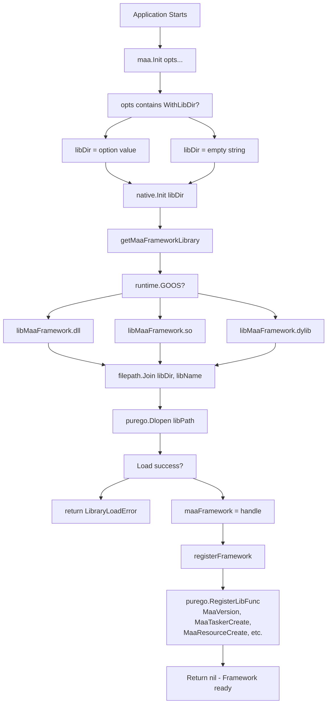
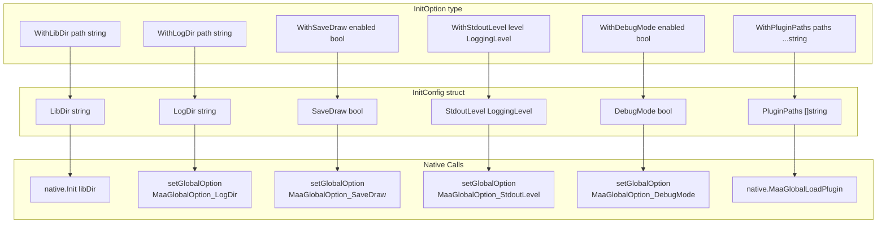
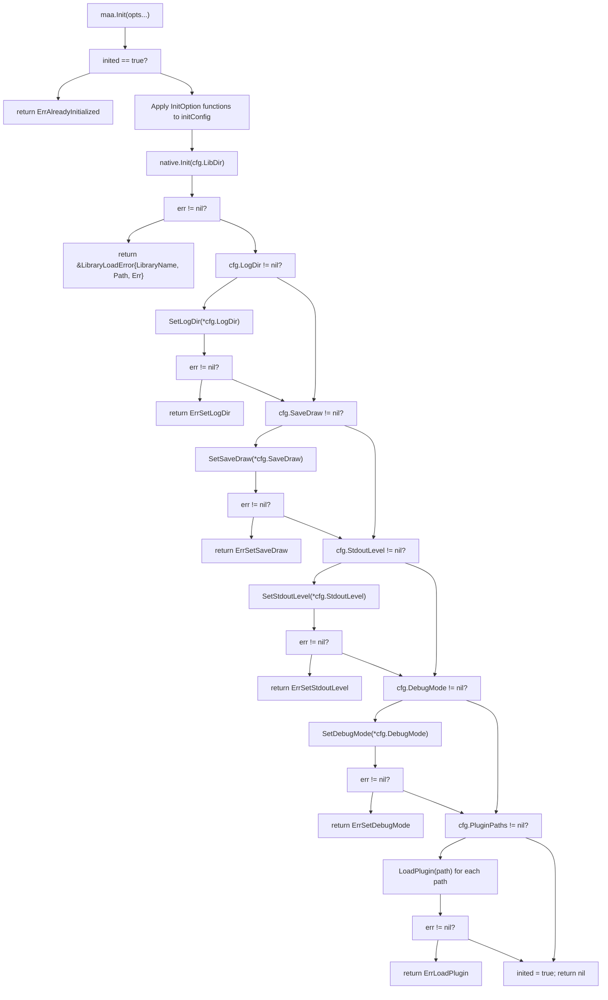
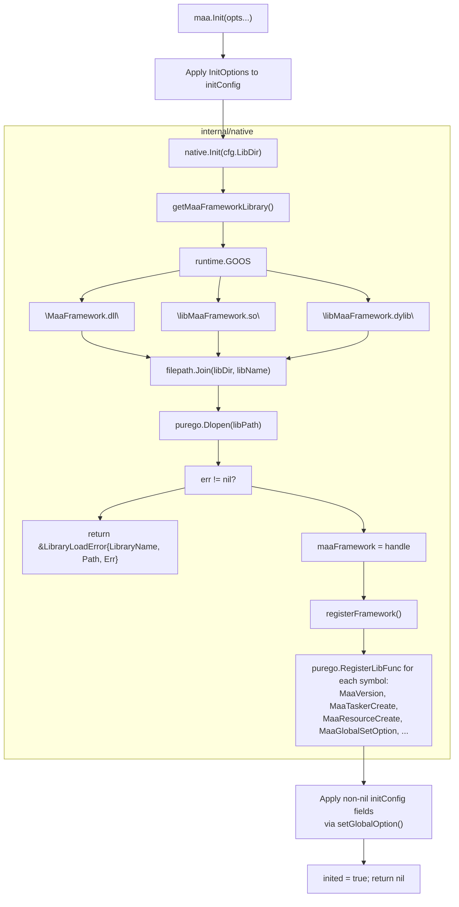
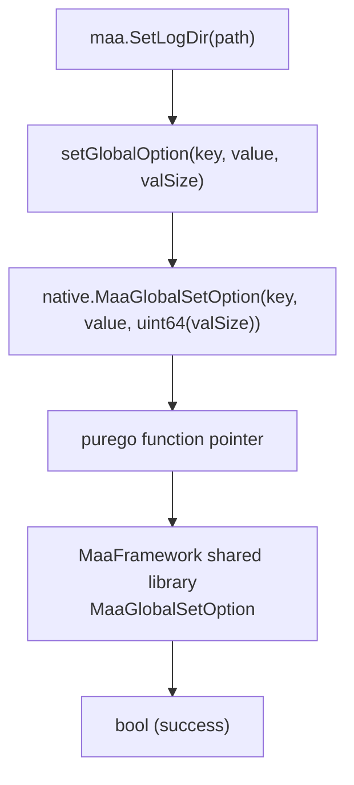

# Installation and Initialization

Relevant source files

* [README.md](https://github.com/MaaXYZ/maa-framework-go/blob/5f9c965c/README.md?plain=1)
* [README\_zh.md](https://github.com/MaaXYZ/maa-framework-go/blob/5f9c965c/README_zh.md?plain=1)
* [examples/custom-action/main.go](https://github.com/MaaXYZ/maa-framework-go/blob/5f9c965c/examples/custom-action/main.go)
* [examples/quick-start/main.go](https://github.com/MaaXYZ/maa-framework-go/blob/5f9c965c/examples/quick-start/main.go)
* [go.mod](https://github.com/MaaXYZ/maa-framework-go/blob/5f9c965c/go.mod)
* [go.sum](https://github.com/MaaXYZ/maa-framework-go/blob/5f9c965c/go.sum)
* [internal/jsoncodec/jsoncodec.go](https://github.com/MaaXYZ/maa-framework-go/blob/5f9c965c/internal/jsoncodec/jsoncodec.go)
* [internal/target/target.go](https://github.com/MaaXYZ/maa-framework-go/blob/5f9c965c/internal/target/target.go)
* [json\_codec.go](https://github.com/MaaXYZ/maa-framework-go/blob/5f9c965c/json_codec.go)
* [json\_codec\_test.go](https://github.com/MaaXYZ/maa-framework-go/blob/5f9c965c/json_codec_test.go)
* [maa.go](https://github.com/MaaXYZ/maa-framework-go/blob/5f9c965c/maa.go)
* [pipeline.go](https://github.com/MaaXYZ/maa-framework-go/blob/5f9c965c/pipeline.go)
* [version.go](https://github.com/MaaXYZ/maa-framework-go/blob/5f9c965c/version.go)
* [version\_test.go](https://github.com/MaaXYZ/maa-framework-go/blob/5f9c965c/version_test.go)

This document covers the installation of maa-framework-go, the library loading process, and initialization procedures including the `maa.Init()` function, configuration options, and global settings. This page focuses on the setup phase before creating any framework components like Tasker, Controller, or Resource. For creating and configuring those components, see [Getting Started](/MaaXYZ/maa-framework-go/2-getting-started).

## Overview

The maa-framework-go bindings require two installation steps: obtaining the Go package and acquiring the native MaaFramework libraries. Initialization involves loading these native libraries via `maa.Init()` and configuring global framework settings such as logging, debugging, and plugins. All initialization must complete successfully before creating any framework components.

---

## Installation

### Go Package Installation

Install the Go package using the standard `go get` command:

```
```
go get github.com/MaaXYZ/maa-framework-go/v4
```
```

The package is imported as:

```
```
import "github.com/MaaXYZ/maa-framework-go/v4"
```
```

Sources: [README.md54-58](https://github.com/MaaXYZ/maa-framework-go/blob/5f9c965c/README.md?plain=1#L54-L58) [README\_zh.md54-58](https://github.com/MaaXYZ/maa-framework-go/blob/5f9c965c/README_zh.md?plain=1#L54-L58)

### MaaFramework Native Libraries

The Go bindings require the MaaFramework native dynamic libraries at runtime. Download the appropriate release package from the [MaaFramework releases page](https://github.com/MaaXYZ/maa-framework-go/blob/5f9c965c/MaaFramework releases page) based on your platform:

| Platform | Architecture | Package Name |
| --- | --- | --- |
| Windows | amd64 | `MAA-win-x86_64-*.zip` |
| Windows | arm64 | `MAA-win-aarch64-*.zip` |
| Linux | amd64 | `MAA-linux-x86_64-*.zip` |
| Linux | arm64 | `MAA-linux-aarch64-*.zip` |
| macOS | amd64 | `MAA-macos-x86_64-*.zip` |
| macOS | arm64 | `MAA-macos-aarch64-*.zip` |

Extract the package to a location accessible to your application.

Sources: [README.md60-71](https://github.com/MaaXYZ/maa-framework-go/blob/5f9c965c/README.md?plain=1#L60-L71) [README\_zh.md60-72](https://github.com/MaaXYZ/maa-framework-go/blob/5f9c965c/README_zh.md?plain=1#L60-L72)

---

## Library Loading Mechanisms

### Runtime Library Location

Applications built with maa-framework-go require the MaaFramework dynamic libraries to be available at runtime. The framework searches for libraries in the following order:

**Library Search and Load Process**



Sources: [internal/native/framework.go336-367](https://github.com/MaaXYZ/maa-framework-go/blob/5f9c965c/internal/native/framework.go#L336-L367) [internal/native/framework.go369-531](https://github.com/MaaXYZ/maa-framework-go/blob/5f9c965c/internal/native/framework.go#L369-L531) [maa.go125-171](https://github.com/MaaXYZ/maa-framework-go/blob/5f9c965c/maa.go#L125-L171)

**Library Location Methods**

1. **Programmatic Path (Recommended)** - Specify the library directory via `WithLibDir` option:

   ```
   ```
   maa.Init(maa.WithLibDir("path/to/MaaFramework/bin"))
   ```
   ```
2. **Working Directory** - Place libraries in the application's working directory
3. **Environment Variables** - Add the library path to:

   * Windows: `PATH`
   * Linux/macOS: `LD_LIBRARY_PATH`
4. **System Library Paths** - Install libraries to system directories (e.g., `/usr/lib`, `/usr/local/lib`)

Sources: [README.md73-87](https://github.com/MaaXYZ/maa-framework-go/blob/5f9c965c/README.md?plain=1#L73-L87) [README\_zh.md73-88](https://github.com/MaaXYZ/maa-framework-go/blob/5f9c965c/README_zh.md?plain=1#L73-L88) [maa.go34-37](https://github.com/MaaXYZ/maa-framework-go/blob/5f9c965c/maa.go#L34-L37)

### Library Load Error Handling

The framework provides detailed error information when library loading fails through the `LibraryLoadError` type:

```
```
type LibraryLoadError struct {


LibraryName string  // Name of the library that failed to load


Path        string  // Full path attempted


Err         error   // Underlying system error


}
```
```

This error type is returned when `Init()` fails due to missing or incompatible libraries, providing diagnostic information for troubleshooting.

Sources: [maa.go26-29](https://github.com/MaaXYZ/maa-framework-go/blob/5f9c965c/maa.go#L26-L29)

---

## Initialization Function

### The Init Function

The `maa.Init()` function loads native MaaFramework libraries and registers their exported functions. It must be called before any other framework operations.

**Function Signature:**

```
```
func Init(opts ...InitOption) error
```
```

**Basic Usage:**

```
```
func main() {


if err := maa.Init(); err != nil {


log.Fatalf("Failed to initialize MAA framework: %v", err)


}


defer maa.Release()


// Framework is now ready for component creation


}
```
```

**Initialization Sequence:**

```mermaid
sequenceDiagram
  participant Application
  participant maa.Init()
  participant internal/native
  participant purego FFI
  participant MaaFramework Library

  Application->>maa.Init(): "Init(opts...)"
  maa.Init()->>maa.Init(): "Check if already initialized"
  maa.Init()->>maa.Init(): "Apply default config"
  maa.Init()->>maa.Init(): "Apply user options"
  maa.Init()->>internal/native: "native.Init(libDir)"
  internal/native->>purego FFI: "Open library files (.dll/.so/.dylib)"
  purego FFI->>MaaFramework Library: "Load dynamic library"
  MaaFramework Library-->>purego FFI: "Library handle"
  purego FFI-->>internal/native: "Success"
  internal/native->>purego FFI: "Register function pointers
  purego FFI-->>internal/native: (MaaVersion, MaaCreate*, etc.)"
  internal/native-->>maa.Init(): "Functions registered"
  maa.Init()->>maa.Init(): "Library loaded"
  maa.Init()->>maa.Init(): "SetLogDir(cfg.LogDir)"
  maa.Init()->>maa.Init(): "SetSaveDraw(cfg.SaveDraw)"
  maa.Init()->>maa.Init(): "SetStdoutLevel(cfg.StdoutLevel)"
  loop ["For each
    maa.Init()->>maa.Init(): "SetDebugMode(cfg.DebugMode)"
  end
  maa.Init()->>maa.Init(): "LoadPlugin(path)"
  maa.Init()-->>Application: "Set inited = true"
```

**Error Conditions:**

The `Init()` function returns an error if:

* The framework has already been initialized (`ErrAlreadyInitialized`)
* Native library files cannot be found or loaded (`LibraryLoadError`)
* Global configuration options fail to apply (e.g., `ErrSetLogDir`, `ErrSetStdoutLevel`)
* Plugin loading fails (`ErrLoadPlugin`)

Sources: [maa.go125-171](https://github.com/MaaXYZ/maa-framework-go/blob/5f9c965c/maa.go#L125-L171) [examples/quick-start/main.go11](https://github.com/MaaXYZ/maa-framework-go/blob/5f9c965c/examples/quick-start/main.go#L11-L11) [examples/custom-action/main.go11](https://github.com/MaaXYZ/maa-framework-go/blob/5f9c965c/examples/custom-action/main.go#L11-L11)

### Checking Initialization Status

The `IsInited()` function returns whether the framework has been successfully initialized:

```
```
func IsInited() bool
```
```

This can be used to conditionally initialize the framework or verify initialization state before operations.

Sources: [maa.go173-176](https://github.com/MaaXYZ/maa-framework-go/blob/5f9c965c/maa.go#L173-L176)

### Release Function

The `Release()` function unloads the native libraries and frees associated resources. It should be called when the framework is no longer needed, typically via `defer` immediately after `Init()`.

```
```
func Release() error
```
```

Call `Release()` via `defer` immediately after a successful `Init()`. It returns `ErrNotInitialized` if called before `Init()`.

Sources: [maa.go178-193](https://github.com/MaaXYZ/maa-framework-go/blob/5f9c965c/maa.go#L178-L193)

---

## Configuration Options

### InitConfig Structure

The `initConfig` struct (unexported) holds all initialization parameters. Optional fields use pointer types — a nil pointer means `Init()` will not apply that setting:

| Field | Type | Purpose |
| --- | --- | --- |
| `LibDir` | `string` | Directory containing MaaFramework libraries; empty means default OS search paths |
| `LogDir` | `*string` | Directory for log files; nil means not set |
| `SaveDraw` | `*bool` | Save recognition draws to `LogDir/vision`; nil means not set |
| `StdoutLevel` | `*LoggingLevel` | Console log verbosity; nil means not set |
| `DebugMode` | `*bool` | Enable comprehensive debug mode; nil means not set |
| `PluginPaths` | `*[]string` | Plugins to load; nil means no plugins are loaded |

Sources: [maa.go32-61](https://github.com/MaaXYZ/maa-framework-go/blob/5f9c965c/maa.go#L32-L61)

**Configuration Option Mapping:**



Sources: [maa.go34-58](https://github.com/MaaXYZ/maa-framework-go/blob/5f9c965c/maa.go#L34-L58) [maa.go60-120](https://github.com/MaaXYZ/maa-framework-go/blob/5f9c965c/maa.go#L60-L120) [maa.go195-197](https://github.com/MaaXYZ/maa-framework-go/blob/5f9c965c/maa.go#L195-L197)

Sources: [maa.go34-58](https://github.com/MaaXYZ/maa-framework-go/blob/5f9c965c/maa.go#L34-L58)

### Functional Options Pattern

Configuration uses the functional options pattern via `InitOption` functions. Each option modifies specific fields of `InitConfig`:

| InitOption Function | Field Modified | Purpose |
| --- | --- | --- |
| `WithLibDir(path)` | `LibDir` | Specify library directory |
| `WithLogDir(path)` | `LogDir` | Set log output directory |
| `WithSaveDraw(enabled)` | `SaveDraw` | Enable/disable recognition draw saving |
| `WithStdoutLevel(level)` | `StdoutLevel` | Set console log level |
| `WithDebugMode(enabled)` | `DebugMode` | Enable/disable debug mode |
| `WithPluginPaths(paths...)` | `PluginPaths` | Specify plugins to load |

All six `With*` options can be combined in a single `Init()` call. See [maa.go66-113](https://github.com/MaaXYZ/maa-framework-go/blob/5f9c965c/maa.go#L66-L113) for each option constructor.

**Default Behavior:**

When no options are provided, `Init()` only loads the native library (searching OS default paths). None of the optional global settings (`LogDir`, `SaveDraw`, `StdoutLevel`, `DebugMode`, `PluginPaths`) are applied. All framework defaults are determined by the underlying MaaFramework native library.

Sources: [maa.go118-171](https://github.com/MaaXYZ/maa-framework-go/blob/5f9c965c/maa.go#L118-L171)

---

## Global Configuration Functions

### Logging Configuration

#### SetLogDir

Sets the directory where log files are written.

```
```
func SetLogDir(path string) error
```
```

**Parameters:**

* `path` - Directory path for log files (must not be empty)

**Returns:**

* `ErrEmptyLogDir` if path is empty
* `ErrSetLogDir` if the native call fails

Returns `ErrEmptyLogDir` if `path` is empty, or `ErrSetLogDir` if the native call fails.

Sources: [maa.go202-210](https://github.com/MaaXYZ/maa-framework-go/blob/5f9c965c/maa.go#L202-L210) [maa\_test.go9-33](https://github.com/MaaXYZ/maa-framework-go/blob/5f9c965c/maa_test.go#L9-L33)

#### SetStdoutLevel

Configures the verbosity of logs written to standard output.

```
```
func SetStdoutLevel(level LoggingLevel) error
```
```

**LoggingLevel Constants:**

| Level | Value | Description |
| --- | --- | --- |
| `LoggingLevelOff` | 0 | No output |
| `LoggingLevelFatal` | 1 | Fatal errors only |
| `LoggingLevelError` | 2 | Errors and above |
| `LoggingLevelWarn` | 3 | Warnings and above |
| `LoggingLevelInfo` | 4 | Info messages and above (default) |
| `LoggingLevelDebug` | 5 | Debug messages and above |
| `LoggingLevelTrace` | 6 | Trace messages and above |
| `LoggingLevelAll` | 7 | All messages |

Sources: [maa.go235-241](https://github.com/MaaXYZ/maa-framework-go/blob/5f9c965c/maa.go#L235-L241) [maa\_test.go61-117](https://github.com/MaaXYZ/maa-framework-go/blob/5f9c965c/maa_test.go#L61-L117)

### Debug and Diagnostic Configuration

#### SetSaveDraw

Controls whether recognition results are saved as images to `LogDir/vision` for debugging.

```
```
func SetSaveDraw(enabled bool) error
```
```

When enabled, `RecoDetail` objects can retrieve draw images showing what the recognition algorithm detected. This is useful for debugging recognition issues but increases disk usage.

Sources: [maa.go212-217](https://github.com/MaaXYZ/maa-framework-go/blob/5f9c965c/maa.go#L212-L217) [maa\_test.go35-59](https://github.com/MaaXYZ/maa-framework-go/blob/5f9c965c/maa_test.go#L35-L59)

#### SetDebugMode

Enables comprehensive debug mode, causing the framework to collect additional diagnostic information.

```
```
func SetDebugMode(enabled bool) error
```
```

Sources: [maa.go243-248](https://github.com/MaaXYZ/maa-framework-go/blob/5f9c965c/maa.go#L243-L248) [maa\_test.go119-143](https://github.com/MaaXYZ/maa-framework-go/blob/5f9c965c/maa_test.go#L119-L143)

#### SetSaveOnError

Configures whether to save screenshots when errors occur during task execution.

```
```
func SetSaveOnError(enabled bool) error
```
```

Sources: [maa.go248-254](https://github.com/MaaXYZ/maa-framework-go/blob/5f9c965c/maa.go#L248-L254)

#### SetDrawQuality

Sets the JPEG quality for saved recognition draw images.

```
```
func SetDrawQuality(quality int32) error
```
```

**Parameters:**

* `quality` - JPEG quality value (range: 0-100, default: 85)

Sources: [maa.go256-263](https://github.com/MaaXYZ/maa-framework-go/blob/5f9c965c/maa.go#L256-L263)

#### SetRecoImageCacheLimit

Sets the maximum number of images cached during recognition operations.

```
```
func SetRecoImageCacheLimit(limit uint64) error
```
```

**Parameters:**

* `limit` - Maximum cache size (default: 4096)

Higher values improve performance by reducing repeated image loading but increase memory usage.

Sources: [maa.go265-272](https://github.com/MaaXYZ/maa-framework-go/blob/5f9c965c/maa.go#L265-L272)

### Plugin Loading

#### LoadPlugin

Loads a plugin from the specified path.

```
```
func LoadPlugin(path string) error
```
```

**Parameters:**

* `path` - Full filesystem path or plugin name

When only a plugin name is provided, the framework searches:

1. System plugin directories
2. Current working directory

If `path` refers to a directory, the framework recursively searches for plugins within it.

Plugins can also be loaded during initialization via the `WithPluginPaths` option passed to `Init()`.

Sources: [maa.go279-285](https://github.com/MaaXYZ/maa-framework-go/blob/5f9c965c/maa.go#L279-L285)

---

## Initialization Patterns

### Basic Initialization

The simplest initialization pattern uses no options, relying on the native library being available in system paths or the working directory. See [examples/quick-start/main.go10-11](https://github.com/MaaXYZ/maa-framework-go/blob/5f9c965c/examples/quick-start/main.go#L10-L11) and [examples/custom-action/main.go10-11](https://github.com/MaaXYZ/maa-framework-go/blob/5f9c965c/examples/custom-action/main.go#L10-L11) for real-world usage.

Call `maa.Init()` at the top of `main()` and `maa.Release()` via `defer` immediately after.

### Custom Configuration

When libraries are not on the system path, pass `WithLibDir` to specify the directory. For diagnostics and logging, combine multiple options in a single `Init()` call:

```
maa.Init(
    maa.WithLibDir(...),
    maa.WithLogDir(...),
    maa.WithStdoutLevel(...),
    maa.WithSaveDraw(...),
)
```

On failure, check whether the returned error wraps `LibraryLoadError` to get the library name, attempted path, and underlying OS error. See [maa.go26-29](https://github.com/MaaXYZ/maa-framework-go/blob/5f9c965c/maa.go#L26-L29)

### Post-Initialization Configuration

The global option functions (`SetLogDir`, `SetStdoutLevel`, `SetSaveDraw`, `SetDebugMode`, etc.) can be called individually at any point after `Init()` returns successfully. They call through to `MaaGlobalSetOption` in the native library. See [maa.go199-283](https://github.com/MaaXYZ/maa-framework-go/blob/5f9c965c/maa.go#L199-L283)

Sources: [maa.go118-174](https://github.com/MaaXYZ/maa-framework-go/blob/5f9c965c/maa.go#L118-L174) [maa.go199-283](https://github.com/MaaXYZ/maa-framework-go/blob/5f9c965c/maa.go#L199-L283) [examples/quick-start/main.go10-11](https://github.com/MaaXYZ/maa-framework-go/blob/5f9c965c/examples/quick-start/main.go#L10-L11) [examples/custom-action/main.go10-11](https://github.com/MaaXYZ/maa-framework-go/blob/5f9c965c/examples/custom-action/main.go#L10-L11)

### Error Handling

**`maa.Init()` Error Flow:**



**Error sentinel values** declared in [maa.go11-24](https://github.com/MaaXYZ/maa-framework-go/blob/5f9c965c/maa.go#L11-L24):

| Sentinel | Cause |
| --- | --- |
| `ErrAlreadyInitialized` | `Init()` called more than once |
| `ErrNotInitialized` | `Release()` called before `Init()` |
| `ErrSetLogDir` | Native `MaaGlobalSetOption` rejected the log directory |
| `ErrEmptyLogDir` | Empty string passed to `SetLogDir` |
| `ErrSetSaveDraw` | Native call failed for save-draw option |
| `ErrSetStdoutLevel` | Native call failed for stdout level option |
| `ErrSetDebugMode` | Native call failed for debug mode option |
| `ErrSetSaveOnError` | Native call failed for save-on-error option |
| `ErrSetDrawQuality` | Native call failed for draw quality option |
| `ErrSetRecoImageCacheLimit` | Native call failed for cache limit option |
| `ErrLoadPlugin` | `MaaGlobalLoadPlugin` returned false |
| `LibraryLoadError` | Native `.dll`/`.so`/`.dylib` could not be opened |

`LibraryLoadError` (aliased from `native.LibraryLoadError` in [maa.go26-29](https://github.com/MaaXYZ/maa-framework-go/blob/5f9c965c/maa.go#L26-L29)) carries `LibraryName`, `Path`, and `Err` fields for diagnostics.

Sources: [maa.go11-29](https://github.com/MaaXYZ/maa-framework-go/blob/5f9c965c/maa.go#L11-L29) [maa.go118-171](https://github.com/MaaXYZ/maa-framework-go/blob/5f9c965c/maa.go#L118-L171)

---

## Internal Implementation Details

### Native Function Registration

`maa.Init()` delegates library loading to `internal/native`, which uses `purego` to bind native symbols without CGO. For full details see page 7.1.

**`maa.Init()` to native library binding:**



**Global option call path:**



`setGlobalOption` is defined in [maa.go198-200](https://github.com/MaaXYZ/maa-framework-go/blob/5f9c965c/maa.go#L198-L200) and wraps all `SetXxx` global functions. The `MaaGlobalOption_*` key constants are defined in `internal/native`.

Sources: [maa.go118-200](https://github.com/MaaXYZ/maa-framework-go/blob/5f9c965c/maa.go#L118-L200)

### Thread Safety

The `inited` flag is a plain `bool` with no mutex protection. `Init()` and `Release()` must not be called concurrently or from multiple goroutines. Call them only from `main()` before any goroutines that use framework objects are started.

Global configuration functions (`SetLogDir`, `SetStdoutLevel`, etc.) delegate to native code, but should similarly be called from a single goroutine or with external synchronization.

Sources: [maa.go11](https://github.com/MaaXYZ/maa-framework-go/blob/5f9c965c/maa.go#L11-L11) [maa.go118-122](https://github.com/MaaXYZ/maa-framework-go/blob/5f9c965c/maa.go#L118-L122) [maa.go183-186](https://github.com/MaaXYZ/maa-framework-go/blob/5f9c965c/maa.go#L183-L186)

---

## Summary

The initialization process involves:

1. **Installation**: Obtain the Go package via `go get` and download platform-specific MaaFramework libraries
2. **Library Loading**: Call `maa.Init()` to load native libraries, specifying the library directory via `WithLibDir` if not in default paths
3. **Configuration**: Apply global settings such as log directory, log level, debug mode, and plugins
4. **Verification**: Check for errors and handle `LibraryLoadError` for diagnostic information
5. **Cleanup**: Use `defer maa.Release()` to ensure proper resource cleanup

After successful initialization, the framework is ready for component creation. The next steps involve creating controllers, resources, and taskers as described in [Quick Start Guide](/MaaXYZ/maa-framework-go/2.2-quick-start-guide).

Sources: [maa.go1-284](https://github.com/MaaXYZ/maa-framework-go/blob/5f9c965c/maa.go#L1-L284) [README.md52-156](https://github.com/MaaXYZ/maa-framework-go/blob/5f9c965c/README.md?plain=1#L52-L156) [examples/quick-start/main.go1-64](https://github.com/MaaXYZ/maa-framework-go/blob/5f9c965c/examples/quick-start/main.go#L1-L64)